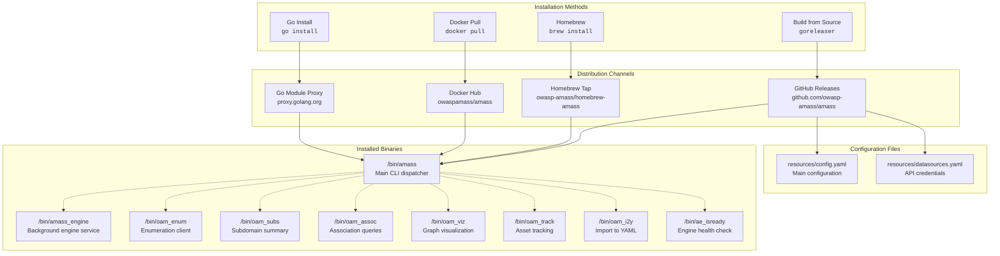
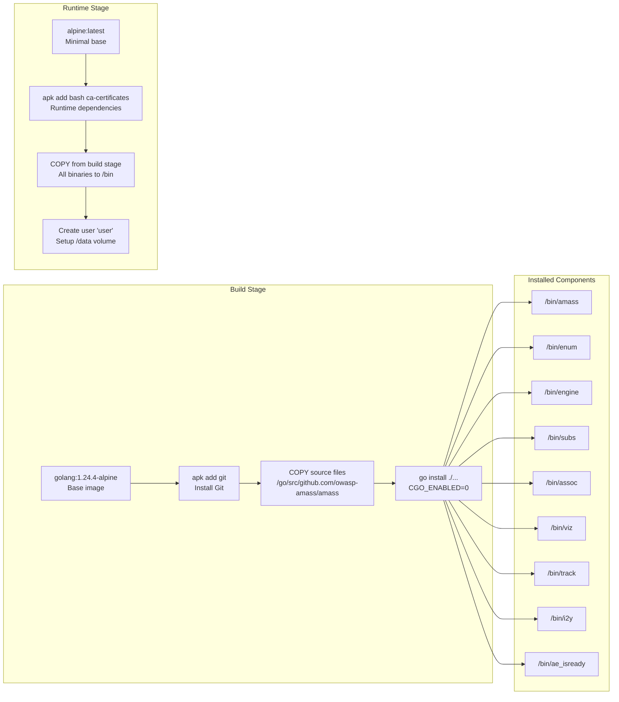
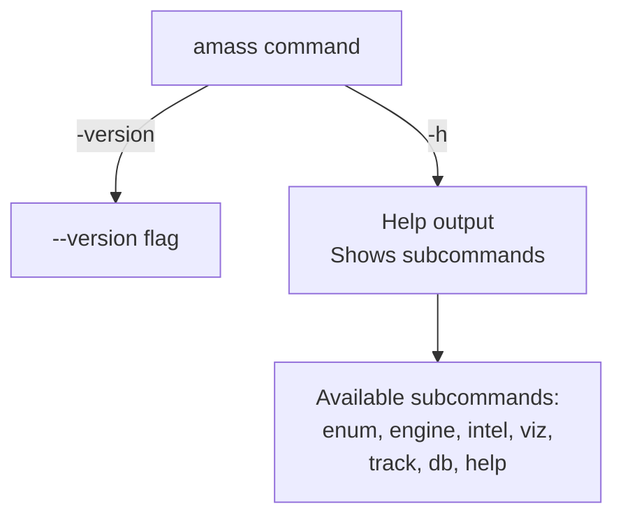
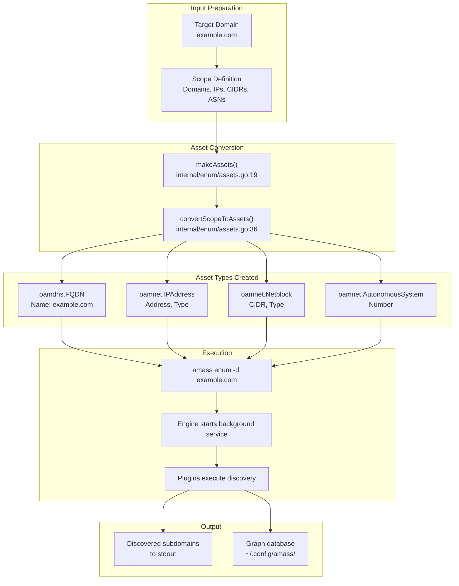
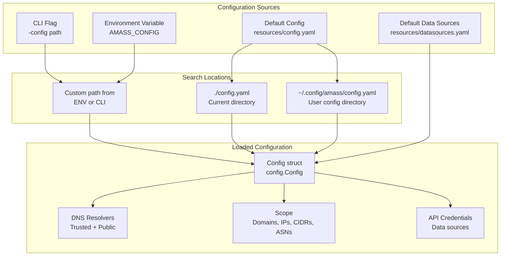

# Installation and Quick Start

# Installation and Quick Start

<details>
<summary>Relevant source files</summary>

The following files were used as context for generating this wiki page:

- [.codeclimate.yml](.codeclimate.yml)
- [.dockerignore](.dockerignore)
- [.gitattributes](.gitattributes)
- [.github/workflows/docker.yml](.github/workflows/docker.yml)
- [.github/workflows/go.yml](.github/workflows/go.yml)
- [.github/workflows/goreleaser.yml](.github/workflows/goreleaser.yml)
- [.github/workflows/lint.yml](.github/workflows/lint.yml)
- [.gitignore](.gitignore)
- [.goreleaser.yaml](.goreleaser.yaml)
- [CONTRIBUTING.md](CONTRIBUTING.md)
- [Dockerfile](Dockerfile)
- [LICENSE](LICENSE)
- [README.md](README.md)
- [codecov.yml](codecov.yml)
- [internal/enum/assets.go](internal/enum/assets.go)

</details>


This document provides instructions for installing OWASP Amass and running your first asset enumeration. It covers the three primary installation methods (Go install, Docker, Homebrew), verification steps, and a basic enumeration workflow. For detailed information about Amass architecture and capabilities, see [Introduction](#1). For configuration options beyond the quick start, see [Configuration System](#3.3).

---

## Prerequisites

Before installing Amass, ensure your system meets these requirements:

| Requirement | Specification |
|------------|---------------|
| **Go Version** | 1.24.0 or later (for Go installation method) |
| **Operating System** | Linux, macOS (Darwin), Windows |
| **Architecture** | amd64, 386, arm (v6/v7), arm64 |
| **Docker** | 20.10+ with BuildKit support (for Docker installation) |

**Sources:** [go.yml:15-16](), [goreleaser.yaml:14-36](), [Dockerfile:1]()

---

## Installation Methods

Amass provides three primary installation paths, each producing the same set of binaries with different deployment characteristics.

### Installation Path Overview



**Sources:** [Dockerfile:10-18](), [goreleaser.yaml:38-46](), [README.md:12-14]()

---

### Method 1: Installation via Go

The Go installation method uses the Go toolchain to fetch, compile, and install Amass directly from source.

```bash
# Install the main amass command and all OAM tools
go install github.com/owasp-amass/amass/v5/cmd/...@latest
```

This command installs binaries to `$GOPATH/bin` or `$HOME/go/bin` by default. The `...` wildcard installs all commands under `cmd/`, which includes:
- `amass` - Main CLI dispatcher
- `amass_engine` - Background engine service  
- `oam_enum` - Enumeration client
- `oam_subs` - Subdomain summary tool
- `oam_assoc` - Association query tool
- `oam_viz` - Visualization tool
- `oam_track` - Asset tracking tool
- `oam_i2y` - Import to YAML converter
- `ae_isready` - Engine readiness probe

**Installation Details:**

| Aspect | Configuration |
|--------|---------------|
| **CGO** | Disabled (`CGO_ENABLED=0`) |
| **Build Flags** | Default Go compilation |
| **Installation Path** | `$GOPATH/bin` or `$HOME/go/bin` |

Ensure `$GOPATH/bin` is in your `PATH`:
```bash
export PATH=$PATH:$(go env GOPATH)/bin
```

**Sources:** [Dockerfile:5](), [goreleaser.yaml:12-13](), [go.yml:18]()

---

### Method 2: Installation via Docker

The Docker installation provides a containerized environment with all binaries pre-installed. The build process uses a multi-stage approach to minimize image size.

```bash
# Pull the latest stable release
docker pull owaspamass/amass:latest

# Pull a specific version
docker pull owaspamass/amass:v4.2.0
```

**Multi-Stage Build Process:**



**Docker Image Tags:**

The automated build process creates semantic version tags:

| Tag Pattern | Example | Description |
|------------|---------|-------------|
| `v{{major}}` | `v4` | Latest in major version |
| `v{{major}}.{{minor}}` | `v4.2` | Latest in minor version |
| `v{{major}}.{{minor}}.{{patch}}` | `v4.2.0` | Specific patch version |

**Platform Support:**

Multi-architecture images are built for:
- `linux/amd64`
- `linux/arm64`

Docker automatically selects the correct architecture for your platform.

**Sources:** [Dockerfile:1-31](), [docker.yml:22-57]()

---

### Method 3: Installation via Homebrew (macOS)

Homebrew provides the simplest installation method for macOS users.

```bash
# Add the Amass tap
brew tap owasp-amass/amass

# Install Amass
brew install amass
```

The Homebrew formula is automatically updated when new releases are published through the GoReleaser workflow. The tap repository is located at `github.com/owasp-amass/homebrew-amass`.

**Installation includes:**
- All binary executables
- Configuration template files (`config.yaml`, `datasources.yaml`)
- Man pages and documentation

**Sources:** [goreleaser.yaml:63-80](), [goreleaser.yml:36]()

---

### Method 4: Building from Source

For development or customization, build Amass from source.

```bash
# Clone the repository
git clone https://github.com/owasp-amass/amass.git
cd amass

# Build all binaries
go build -v ./cmd/...

# Or install to $GOPATH/bin
go install -v ./cmd/...
```

**Development Build Process:**

The repository uses GitHub Actions for automated testing and building:

| Workflow | Trigger | Purpose |
|----------|---------|---------|
| **tests** | Push to main/develop, PRs | Run test suite on 3 OS |
| **lint** | Push, PRs | Code quality checks |
| **goreleaser** | Tag push `v*.*.*` | Create releases |
| **docker** | Tag push `v*.*.*` | Build Docker images |

**Build Environment Variables:**

```bash
# Disable CGO for static binaries
export CGO_ENABLED=0

# Test with aggressive garbage collection
export GOGC=1  # For testing only
```

**Sources:** [go.yml:1-51](), [goreleaser.yml:1-37](), [lint.yml:1-33](), [CONTRIBUTING.md:5-7]()

---

## Verifying Installation

After installation, verify that Amass is properly installed and accessible.

### Check Binary Availability

```bash
# Verify main CLI
amass -version

# Verify OAM tools
oam_enum -h
oam_subs -h
oam_assoc -h

# For Docker installation
docker run owaspamass/amass -version
```

### Expected Output Structure



**Sources:** [README.md:1-14]()

---

## Quick Start: First Enumeration

This section demonstrates running your first asset enumeration with Amass. The basic workflow involves starting the engine, submitting domains for enumeration, and retrieving results.

### Basic Enumeration Workflow



**Sources:** [internal/enum/assets.go:19-112]()

### Simple Enumeration Command

```bash
# Enumerate a single domain
amass enum -d example.com

# Enumerate multiple domains
amass enum -d example.com,example.org

# Specify a custom configuration file
amass enum -config /path/to/config.yaml -d example.com
```

### Scope Asset Conversion

When you provide input to Amass (domains, IPs, CIDRs, ASNs), the system converts them to Open Asset Model (OAM) asset types through the following process:

**Asset Type Mapping:**

| Input Type | Config Field | OAM Asset Type | Code Location |
|-----------|--------------|----------------|---------------|
| Domain | `Scope.Domains` | `oamdns.FQDN{Name: "example.com"}` | [internal/enum/assets.go:42-52]() |
| IP Address | `Scope.Addresses` | `oamnet.IPAddress{Address, Type}` | [internal/enum/assets.go:56-77]() |
| CIDR Range | `Scope.CIDRs` | `oamnet.Netblock{CIDR, Type}` | [internal/enum/assets.go:80-100]() |
| ASN | `Scope.ASNs` | `oamnet.AutonomousSystem{Number}` | [internal/enum/assets.go:103-110]() |

Each asset is wrapped in an `et.Asset` structure containing:
- `Data.OAMAsset` - The actual OAM asset object
- `Data.OAMType` - The asset type identifier
- `Name` - Sequential identifier (`asset#1`, `asset#2`, etc.)

**Sources:** [internal/enum/assets.go:19-112]()

### Docker-Based Enumeration

For Docker installations, mount a volume for persistent data storage:

```bash
# Create a local directory for data
mkdir -p ~/amass-output

# Run enumeration with volume mount
docker run -v ~/amass-output:/data owaspamass/amass enum -d example.com

# Access results
ls ~/amass-output
```

The Docker image sets up:
- Working directory: `/data`
- User: Non-root user `user`
- Config directory: `/.config/amass`
- Entry point: `/bin/amass`

**Sources:** [Dockerfile:19-31]()

---

## Configuration Files

Amass uses two primary configuration files that are included in release archives:

### Configuration File Locations



**Sources:** [goreleaser.yaml:42-46]()

### config.yaml Structure

The `config.yaml` file controls enumeration behavior:

```yaml
# Example minimal configuration
scope:
  domains:
    - example.com
  
resolvers:
  - 8.8.8.8
  - 1.1.1.1

options:
  # Number of DNS queries per second
  qps: 5000
```

### datasources.yaml Structure

The `datasources.yaml` file stores API credentials for external data sources (GLEIF, Aviato, BGP.Tools, etc.):

```yaml
# Example API configuration
datasources:
  - name: "ServiceName"
    ttl: 43200
    credentials:
      apikey: "your-api-key-here"
```

For detailed configuration options, see [Configuration System](#3.3).

**Sources:** [goreleaser.yaml:45-46]()

---

## Next Steps

After completing the quick start, explore these resources:

| Topic | Wiki Page | Description |
|-------|-----------|-------------|
| **Architecture** | [Architecture Overview](#2) | Understanding system components |
| **CLI Commands** | [Command-Line Interface](#3) | Full command reference |
| **Configuration** | [Configuration System](#3.3) | Advanced configuration options |
| **OAM Tools** | [OAM Analysis Tools](#3.2) | Analyzing collected data |
| **DNS System** | [DNS Resolution System](#5) | Understanding DNS discovery |
| **Plugin System** | [Plugin System](#6) | Extending functionality |

### Common Next Actions

1. **Configure API Keys:** Add credentials to `datasources.yaml` for enhanced discovery. See [API Integration Plugins](#6.3).

2. **Run the Engine Service:** For continuous enumeration, run the engine as a background service:
   ```bash
   amass engine
   ```
   See [Session Management](#4.2) for details.

3. **Analyze Results:** Use OAM tools to query and visualize collected data:
   ```bash
   oam_subs -d example.com
   oam_viz -d example.com -o graph.html
   ```
   See [OAM Analysis Tools](#3.2) for details.

4. **Track Changes:** Monitor for new assets over time:
   ```bash
   oam_track -d example.com -since 2024-01-01
   ```
   See [OAM Analysis Tools](#3.2) for details.

**Sources:** [README.md:14](), [Dockerfile:10-18]()

---

## Troubleshooting Installation

| Issue | Solution |
|-------|----------|
| **Command not found** | Ensure `$GOPATH/bin` is in your `PATH` |
| **Go version error** | Upgrade to Go 1.24.0+ |
| **Docker permission denied** | Add user to `docker` group or use `sudo` |
| **Homebrew installation fails** | Update Homebrew: `brew update` |

For additional help, join the [Discord server](https://discord.gg/ANTyEDUXt5) or review [open issues](https://github.com/owasp-amass/amass/issues).

**Sources:** [README.md:25-29](), [CONTRIBUTING.md:1-4]()