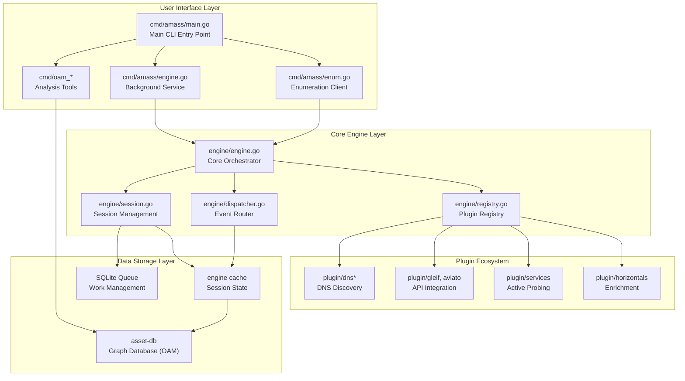
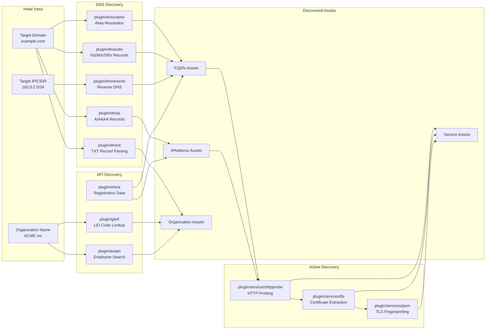
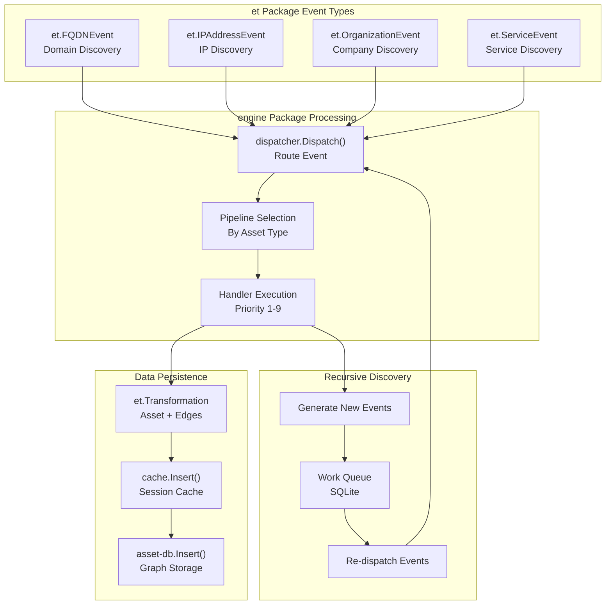

# Introduction

# Introduction

Relevant source files

The following files were used as context for generating this wiki page:

- [README.md](README.md)

## Purpose and Scope

This document introduces OWASP Amass, its mission of attack surface mapping and external asset discovery, and provides a high-level overview of the system's architecture and capabilities. For installation instructions and getting started with your first enumeration, see [Installation and Quick Start](#1.1). For detailed architecture concepts, see [Architecture Overview](#2). For command-line usage, see [Command-Line Interface](#3).

**Sources:** [README.md:1-36]()

## What is OWASP Amass?

OWASP Amass is an OWASP Flagship Project that performs network mapping of attack surfaces and external asset discovery. The system combines open source information gathering (OSINT) with active reconnaissance techniques to comprehensively enumerate an organization's externally-facing infrastructure.

The project operates as an event-driven discovery engine that recursively identifies assets through multiple discovery vectors: DNS enumeration, API integrations with external data sources, active service probing, and relationship-based expansion. Discovered assets are stored in a graph database conforming to the Open Asset Model (OAM) specification, enabling sophisticated relationship analysis and continuous monitoring.

**Sources:** [README.md:1-10]()

## System Architecture Components

Amass consists of three primary architectural layers that work together to discover, enrich, and analyze attack surface data:

**Diagram: System Architecture Components Mapped to Code Structure**

The architecture separates concerns into distinct layers:

| Layer | Primary Packages | Responsibility |
|-------|-----------------|----------------|
| User Interface | `cmd/amass`, `cmd/oam_*` | CLI commands and user interaction |
| Core Engine | `engine` | Event dispatching, session management, plugin orchestration |
| Plugin Ecosystem | `plugin/*` | Discovery, enrichment, and active reconnaissance |
| Data Storage | `asset-db`, `engine/cache` | Graph storage and session state |

**Sources:** [README.md:1-36](), High-level architecture diagrams

## Core Capabilities

### Discovery Mechanisms

Amass employs multiple complementary discovery techniques to build a comprehensive asset inventory:

**Diagram: Discovery Mechanisms Mapped to Plugin Implementation**

**DNS-Based Discovery**: The system maintains a pool of 78 baseline trusted DNS resolvers plus dynamically-fetched public resolvers, implementing sophisticated wildcard detection and TTL-based caching to avoid redundant queries. DNS plugins process different record types in priority order, creating cascading discovery chains where each discovery can trigger additional queries.

**API Integration**: External data sources are queried through dedicated plugins. The GLEIF plugin performs fuzzy completion searches for Legal Entity Identifiers, the Aviato plugin discovers employee information and funding data, and various WHOIS/RDAP plugins enrich discovered assets with registration and network ownership data.

**Active Reconnaissance**: Service discovery plugins perform live probing of discovered FQDNs and IP addresses. HTTP probes detect web services on common ports (80, 443, 8080, 8443), TLS certificate extraction identifies additional domains from Subject Alternative Names, and JARM fingerprinting profiles TLS configurations for service identification.

**Sources:** High-level architecture diagrams, Plugin ecosystem diagram

## Event-Driven Processing Model

Amass operates on an event-driven architecture where discoveries generate new events that trigger additional processing:

**Diagram: Event-Driven Processing Flow with Code Entities**

The event system enables recursive discovery where each finding can trigger additional investigation:

1. **Event Generation**: User input or plugin discoveries generate typed events (`et.FQDNEvent`, `et.IPAddressEvent`, etc.)
2. **Dispatch and Routing**: The `engine/dispatcher.go` routes events to appropriate asset pipelines based on event type
3. **Handler Execution**: Registered plugin handlers execute in priority order (1-9, lower values first)
4. **Transformation**: Handlers produce `et.Transformation` objects containing discovered assets and their relationships
5. **Persistence**: Transformations are cached in the session cache and persisted to the `asset-db` graph database
6. **Recursive Generation**: Handlers generate new events, which are queued and re-dispatched, creating discovery chains

This recursive model allows a single domain input to expand into a comprehensive asset inventory through cascading discoveries.

**Sources:** Event-driven plugin architecture diagram, Data flow diagram

## Key System Directories

The codebase is organized into the following primary directories:

| Directory | Purpose | Key Components |
|-----------|---------|----------------|
| `cmd/amass` | Main CLI application | `main.go`, `enum.go`, `engine.go` |
| `cmd/oam_*` | OAM analysis tools | `oam_assoc`, `oam_subs`, `oam_track`, `oam_viz` |
| `engine` | Core orchestration engine | `engine.go`, `dispatcher.go`, `session.go`, `registry.go` |
| `plugin` | Plugin implementations | DNS, API, service, enrichment plugins |
| `plugin/support` | Shared plugin utilities | DNS helpers, organization creation, TTL management |
| `config` | Configuration management | `config.go`, YAML parsing, resolver configuration |
| `asset-db` | Graph database (external) | OAM storage, graph queries, relationship traversal |

The `engine` package provides the core orchestration layer that coordinates plugin execution, manages sessions, and dispatches events. The `plugin` directory contains all discovery and enrichment plugins, with `plugin/support` providing common utilities shared across plugins. Configuration is managed through the `config` package which handles YAML files, environment variables, and CLI arguments.

**Sources:** Repository structure, High-level architecture diagrams

## Data Model: Open Asset Model (OAM)

Amass stores all discovered data using the Open Asset Model (OAM) specification, which defines a graph-based representation of digital assets and their relationships. The `asset-db` package (maintained as a separate repository) provides the graph database implementation.

Key asset types include:

- **FQDN**: Fully qualified domain names
- **IPAddress**: IPv4 and IPv6 addresses  
- **Organization**: Companies and legal entities
- **Service**: Network services with ports and protocols
- **Person**: Contact information
- **Location**: Physical addresses
- **AutonomousSystem**: ASN and BGP information
- **Netblock**: IP address ranges

Assets are connected through typed edges representing relationships such as `dns_record`, `id` (identifier), `subsidiary`, `member` (employment), `port`, `legal_address`, and `hq_address`. Each edge includes source attribution tracking which plugin discovered the relationship.

For detailed information about the OAM data model, see [Open Asset Model (OAM)](#7.1). For asset types and properties, see [Asset Types and Properties](#7.2). For relationship semantics, see [Relationships and Edges](#7.3).

**Sources:** Data model diagram, Plugin enrichment diagram

## Deployment Models

Amass supports three primary deployment models:

**Local Installation**: Direct binary installation via `go install github.com/owasp-amass/amass/v4/cmd/amass` for ad-hoc usage and development.

**Package Manager**: Installation through Homebrew (`brew install amass`) provides managed updates and dependencies.

**Container Deployment**: Multi-architecture Docker images (`owaspamass/amass`) enable containerized deployment in production environments, Kubernetes clusters, or CI/CD pipelines.

The system can operate in two modes: **client-server** (`amass engine` as background service + `amass enum` as client) or **standalone** (`amass enum` runs engine internally). The client-server model allows multiple enumeration sessions to share a single engine instance.

For detailed deployment information, see [Deployment](#9) and [Docker Deployment](#9.1).

**Sources:** [README.md:12-14](), Build and deployment diagram

## Getting Started

To begin using Amass, users typically follow this workflow:

1. **Install**: Choose installation method (Go, Docker, or Homebrew)
2. **Configure**: Create configuration file with API keys and resolver settings (optional)
3. **Enumerate**: Run `amass enum -d example.com` to discover assets for a target domain
4. **Analyze**: Use OAM tools (`oam_subs`, `oam_viz`, etc.) to analyze collected data
5. **Monitor**: Re-run enumerations periodically and use `oam_track` to identify new assets

For step-by-step installation and usage instructions, see [Installation and Quick Start](#1.1).

For detailed command-line usage, see [Command-Line Interface](#3).

For configuration options, see [Configuration System](#3.3).

**Sources:** [README.md:1-36]()