# Core Concepts

# Core Concepts

<details>
<summary>Relevant source files</summary>

The following files were used as context for generating this wiki page:

- [Dockerfile](Dockerfile)
- [config/engineapi.go](config/engineapi.go)
- [config/graphdb.go](config/graphdb.go)
- [engine/api/graphql/client/client.go](engine/api/graphql/client/client.go)
- [engine/api/graphql/server/schema.resolvers.go](engine/api/graphql/server/schema.resolvers.go)
- [engine/dispatcher/dispatcher.go](engine/dispatcher/dispatcher.go)
- [engine/registry/pipelines.go](engine/registry/pipelines.go)
- [engine/sessions/manager.go](engine/sessions/manager.go)
- [engine/sessions/queue.go](engine/sessions/queue.go)
- [engine/sessions/queuedb/queue_db.go](engine/sessions/queuedb/queue_db.go)
- [engine/sessions/queuedb/queue_db_test.go](engine/sessions/queuedb/queue_db_test.go)
- [engine/sessions/session.go](engine/sessions/session.go)
- [engine/types/events.go](engine/types/events.go)
- [engine/types/registry.go](engine/types/registry.go)
- [engine/types/sessions.go](engine/types/sessions.go)
- [internal/enum/assets.go](internal/enum/assets.go)

</details>


This page defines the fundamental concepts and data structures that form the foundation of OWASP Amass. Understanding these concepts is essential before diving into specific subsystems. For information about how these components are orchestrated together, see [Architecture Overview](#2). For details on how data flows through the system, see [Data Flow and Processing Pipeline](#2.2).

The core concepts covered here are:
- **Events**: Units of work that flow through the system
- **Assets and Entities**: Open Asset Model (OAM) assets wrapped in database entities
- **Sessions**: Isolated enumeration contexts with their own configuration and state
- **Handlers**: Callback functions registered by plugins to process specific asset types
- **Pipelines**: Priority-ordered chains of handlers for each asset type
- **Transformations**: Configuration rules that control which plugins process which assets

---

## Events

### Event Structure

An **Event** is the fundamental unit of work in Amass. Every discovery, enrichment, or processing action generates events that flow through the system. Events are defined in [engine/types/events.go:14-20]().

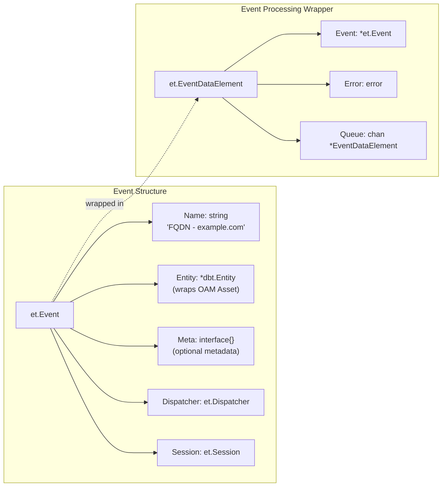

**Event Fields**:

| Field | Type | Purpose |
|-------|------|---------|
| `Name` | `string` | Human-readable event identifier (e.g., "FQDN - example.com") |
| `Entity` | `*dbt.Entity` | The asset being processed, wrapped in a database entity |
| `Meta` | `interface{}` | Optional metadata (e.g., `EmailMeta` for verification status) |
| `Dispatcher` | `et.Dispatcher` | Reference to the dispatcher for generating new events |
| `Session` | `et.Session` | The session context this event belongs to |

The `EventDataElement` [engine/types/events.go:43-55]() wraps an event for pipeline processing. It includes an `Error` field to accumulate errors from handlers and a `Queue` channel for completion callbacks.

**Sources**: [engine/types/events.go:14-55]()

### Event Lifecycle

Events are created when:
1. User submits initial seed assets via GraphQL API [engine/api/graphql/server/schema.resolvers.go:64-114]()
2. Plugins discover new assets and dispatch new events [engine/dispatcher/dispatcher.go:60-73]()
3. Session queue refills pipeline queues with pending work [engine/dispatcher/dispatcher.go:124-159]()

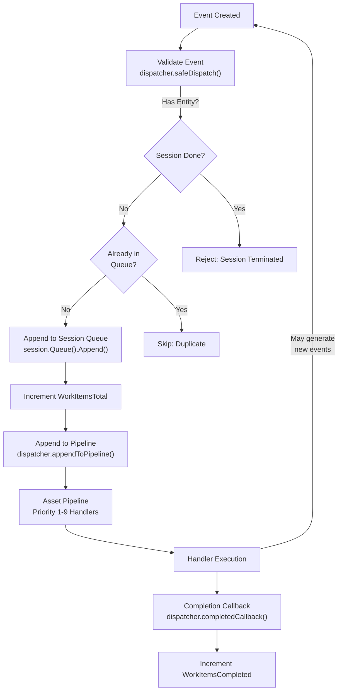

**Sources**: [engine/dispatcher/dispatcher.go:60-227](), [engine/api/graphql/server/schema.resolvers.go:102-111]()

---

## Assets and Entities

### Open Asset Model (OAM)

Amass uses the **Open Asset Model (OAM)** to represent discovered infrastructure. OAM defines standardized asset types with consistent properties and relationships. For comprehensive coverage of OAM, see [Open Asset Model (OAM)](#7.1).

**Core Asset Types**:

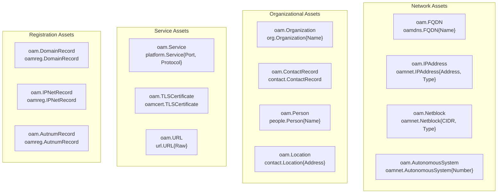

**Sources**: [engine/api/graphql/server/schema.resolvers.go:187-233](), OAM import statements across codebase

### Entity Wrapper

Every OAM asset is wrapped in a `dbt.Entity` structure from the asset-db library. This wrapper provides:
- **Unique ID**: Database identifier for the entity
- **Asset**: The OAM asset itself
- **Relationships**: Edges to other entities

The `AssetData` structure [engine/types/events.go:32-35]() pairs an OAM asset with its type:

```go
type AssetData struct {
    OAMAsset oam.Asset     `json:"asset"`
    OAMType  oam.AssetType `json:"type"`
}
```

Assets are created from user input in [internal/enum/assets.go:36-112](), where scope elements (domains, IPs, CIDRs, ASNs) are converted to OAM assets.

**Sources**: [engine/types/events.go:32-41](), [internal/enum/assets.go:18-112]()

---

## Sessions

A **Session** represents an isolated enumeration context. Each session has its own configuration, scope, database connections, cache, and work queue. Multiple sessions can run concurrently within a single engine instance.

### Session Structure

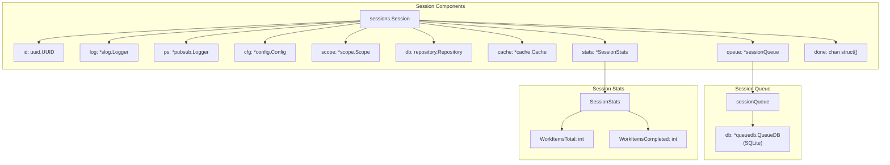

**Sources**: [engine/sessions/session.go:29-45](), [engine/types/sessions.go:23-37]()

### Session Lifecycle

Sessions are managed by the `SessionManager` [engine/sessions/manager.go:27-31]():

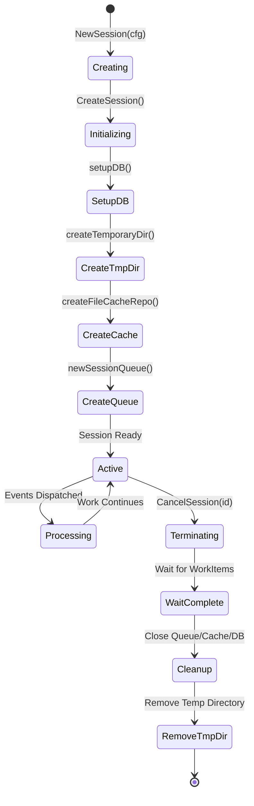

**Key Methods**:

| Method | Purpose |
|--------|---------|
| `CreateSession()` | Initialize new session with config [engine/sessions/session.go:47-95]() |
| `ID()` | Get session UUID |
| `Config()` | Access session configuration |
| `DB()` | Get primary database repository |
| `Cache()` | Get session-specific cache |
| `Queue()` | Get work queue for tracking entities |
| `Stats()` | Get processing statistics |
| `Done()` | Check if session is terminated |
| `Kill()` | Terminate session [engine/sessions/session.go:145-153]() |

**Sources**: [engine/sessions/session.go:47-246](), [engine/sessions/manager.go:27-159](), [engine/types/sessions.go:23-61]()

### Session Queue

Each session has a dedicated work queue backed by SQLite [engine/sessions/queuedb/queue_db.go:16-18](). The queue tracks which entities have been scheduled for processing and which have been completed.

**Queue Database Schema**:

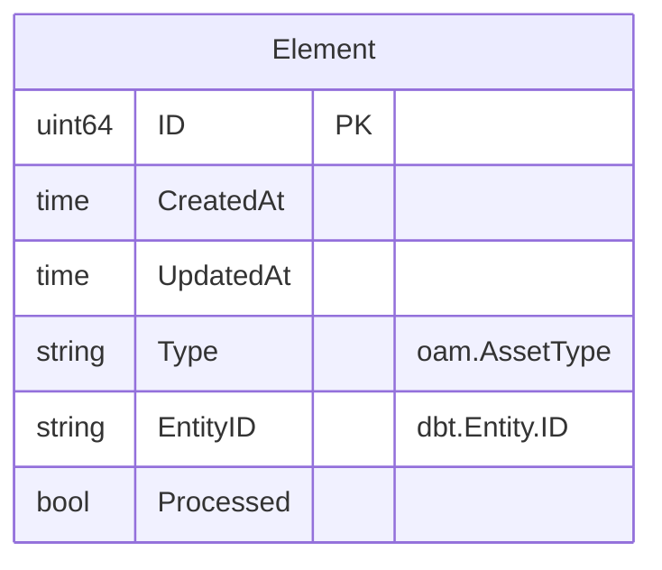

**Queue Operations**:

| Method | Purpose | Source |
|--------|---------|--------|
| `Has(e *dbt.Entity)` | Check if entity is already queued | [engine/sessions/queue.go:39-44]() |
| `Append(e *dbt.Entity)` | Add entity to queue | [engine/sessions/queue.go:46-62]() |
| `Next(atype, num)` | Get next batch of unprocessed entities | [engine/sessions/queue.go:64-81]() |
| `Processed(e *dbt.Entity)` | Mark entity as processed | [engine/sessions/queue.go:83-88]() |

**Sources**: [engine/sessions/queue.go:16-96](), [engine/sessions/queuedb/queue_db.go:16-116]()

---

## Handlers and Plugins

### Handler Structure

A **Handler** is a callback function registered by a plugin to process specific asset types. Handlers are the actual processing units that examine assets and generate new discoveries.

**Handler Definition** [engine/types/registry.go:23-31]():

```go
type Handler struct {
    Plugin       Plugin          // Owner plugin
    Name         string          // Handler identifier
    Priority     int             // Execution priority (1-9)
    MaxInstances int             // Concurrency limit (0 = unlimited)
    EventType    oam.AssetType   // Asset type this handler processes
    Transforms   []string        // Transformation types produced
    Callback     func(*Event) error  // Processing function
}
```

### Priority System

Handlers execute in **priority order** from 1 (highest) to 9 (lowest). This ensures critical operations happen before dependent operations:

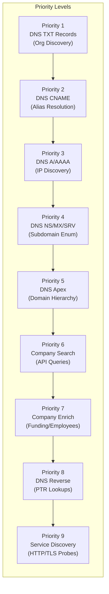

**Rationale**: DNS TXT records may contain organization identifiers (priority 1), which enable CNAME resolution (priority 2), which leads to IP addresses (priority 3), which enable service discovery (priority 9).

**Sources**: [engine/registry/pipelines.go:37-66]()

### Plugin Interface

Plugins implement the `Plugin` interface [engine/types/registry.go:17-21]():

```go
type Plugin interface {
    Name() string
    Start(r Registry) error  // Register handlers with registry
    Stop()
}
```

During `Start()`, plugins register one or more handlers with the registry. Example registration pattern:

```go
r.RegisterHandler(&Handler{
    Plugin:       plugin,
    Name:         "dns-txt-handler",
    Priority:     1,
    EventType:    oam.FQDN,
    Transforms:   []string{"to-organization"},
    Callback:     plugin.handleTXT,
})
```

**Sources**: [engine/types/registry.go:17-31]()

---

## Asset Pipelines

### Pipeline Construction

For each OAM asset type, the registry builds an **Asset Pipeline** consisting of all registered handlers for that type, ordered by priority [engine/registry/pipelines.go:19-31]().

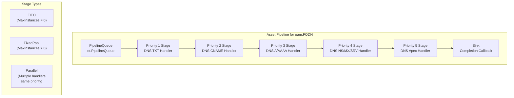

**Pipeline Stage Types** [engine/registry/pipelines.go:43-65]():

| Stage Type | When Used | Behavior |
|------------|-----------|----------|
| `FIFO` | Single handler, `MaxInstances = 0` | Serial processing, unlimited goroutines |
| `FixedPool` | Single handler, `MaxInstances > 0` | Concurrent processing, limited pool |
| `Parallel` | Multiple handlers, same priority | All handlers run concurrently |

**Sources**: [engine/registry/pipelines.go:19-79](), [engine/types/registry.go:33-43]()

### Pipeline Execution

Pipelines execute continuously in the background [engine/registry/pipelines.go:73-78]():

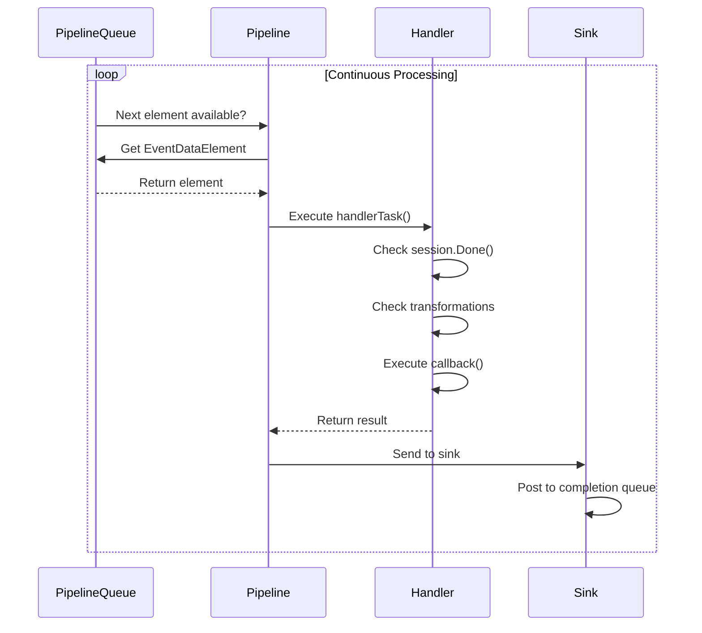

**Handler Execution** [engine/registry/pipelines.go:93-139]():

1. **Extract EventDataElement**: Validate pipeline data
2. **Check Session**: Skip if session terminated [engine/registry/pipelines.go:114-117]()
3. **Check Transformations**: Apply config filters [engine/registry/pipelines.go:122-136]()
4. **Execute Callback**: Run handler's processing function
5. **Error Handling**: Accumulate errors in EventDataElement

**Sources**: [engine/registry/pipelines.go:81-183]()

---

## Transformations

**Transformations** are configuration rules that control which plugins can process which asset types. They provide fine-grained control over the discovery pipeline.

### Transformation Rules

Transformations are defined in `config.yaml` [config/transformations.go]():

```yaml
transformations:
  - from: FQDN
    to: all
    exclude:
      - dnsSubs
  - from: IPAddress
    to: dnsReverse
```

Each transformation specifies:
- **From**: Source asset type (e.g., `FQDN`, `IPAddress`)
- **To**: Target plugin name or `all`
- **Exclude**: Plugins to exclude when using `all`

### Transformation Matching

When a handler executes, the system checks if it's allowed to process the current asset [engine/registry/pipelines.go:122-136]():

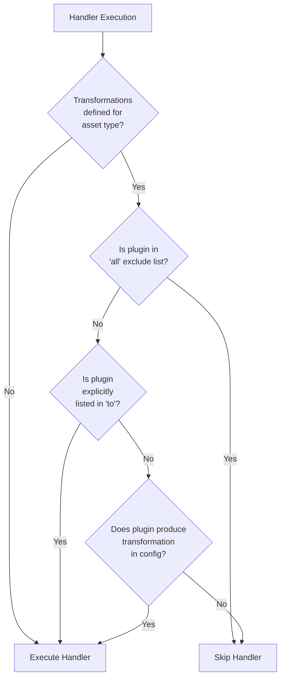

**Matching Logic** [engine/registry/pipelines.go:141-182]():

1. Get all transformations for the asset type [engine/registry/pipelines.go:141-151]()
2. Check if plugin is excluded via `all` exclusion list [engine/registry/pipelines.go:162-182]()
3. Check if plugin name matches `to` field [engine/registry/pipelines.go:153-160]()
4. Check if handler's `Transforms` intersect with config transformations

**Sources**: [engine/registry/pipelines.go:141-182]()

---

## Complete Event Flow

This diagram shows how all core concepts work together:

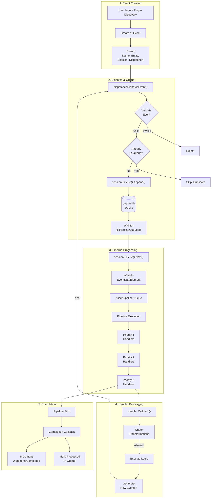

**Key Points**:
1. Events can generate new events recursively (discovery cascade)
2. The session queue prevents duplicate processing
3. Pipelines execute handlers in priority order
4. Transformations filter which handlers execute
5. Completion callbacks track progress statistics

**Sources**: [engine/dispatcher/dispatcher.go:60-227](), [engine/registry/pipelines.go:19-183](), [engine/sessions/queue.go:39-95]()