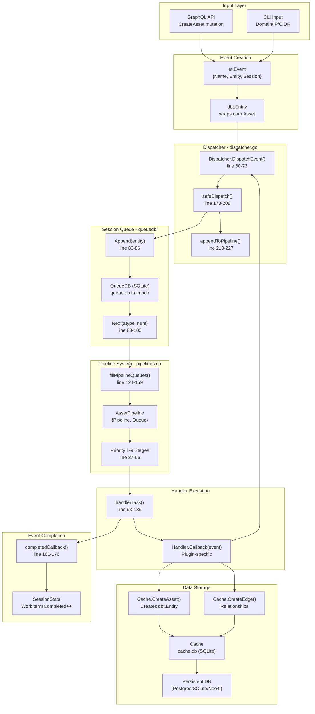
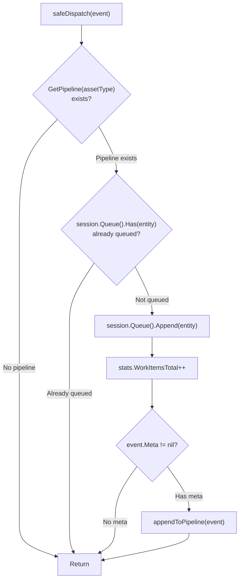
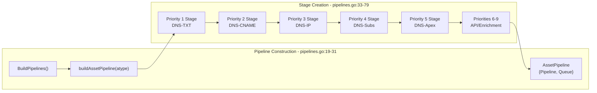
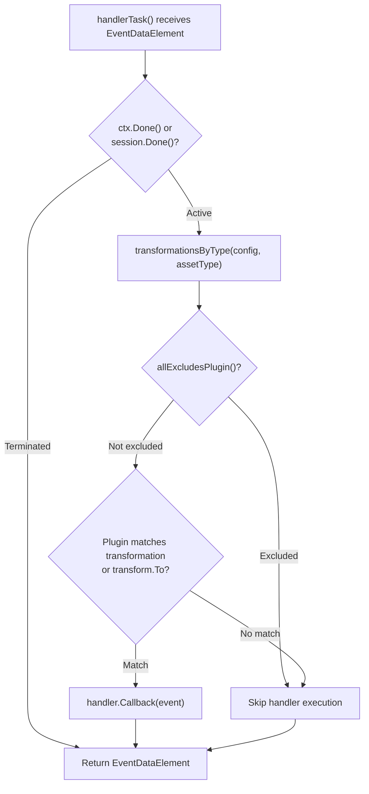
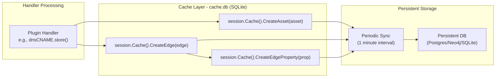
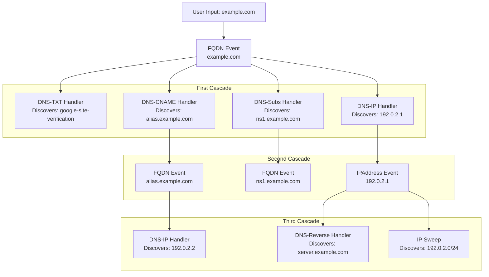
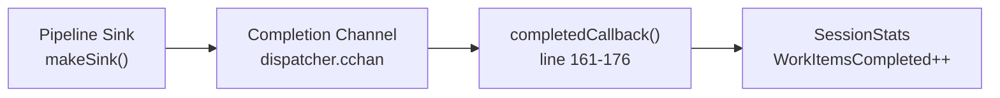
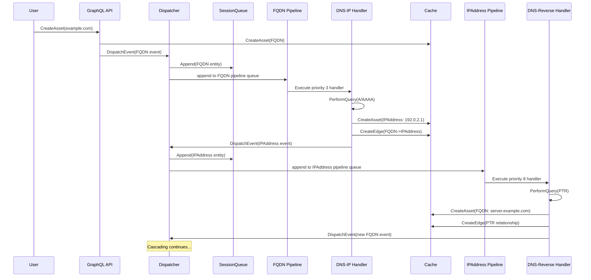

# Data Flow and Processing Pipeline

# Data Flow and Processing Pipeline

<details>
<summary>Relevant source files</summary>

The following files were used as context for generating this wiki page:

- [config/engineapi.go](config/engineapi.go)
- [config/graphdb.go](config/graphdb.go)
- [engine/api/graphql/client/client.go](engine/api/graphql/client/client.go)
- [engine/api/graphql/server/schema.resolvers.go](engine/api/graphql/server/schema.resolvers.go)
- [engine/dispatcher/dispatcher.go](engine/dispatcher/dispatcher.go)
- [engine/plugins/dns/apex.go](engine/plugins/dns/apex.go)
- [engine/plugins/dns/cname.go](engine/plugins/dns/cname.go)
- [engine/plugins/dns/ip.go](engine/plugins/dns/ip.go)
- [engine/plugins/dns/plugin.go](engine/plugins/dns/plugin.go)
- [engine/plugins/dns/reverse.go](engine/plugins/dns/reverse.go)
- [engine/plugins/dns/subs.go](engine/plugins/dns/subs.go)
- [engine/plugins/dns/txt.go](engine/plugins/dns/txt.go)
- [engine/registry/pipelines.go](engine/registry/pipelines.go)
- [engine/sessions/manager.go](engine/sessions/manager.go)
- [engine/sessions/queue.go](engine/sessions/queue.go)
- [engine/sessions/queuedb/queue_db.go](engine/sessions/queuedb/queue_db.go)
- [engine/sessions/queuedb/queue_db_test.go](engine/sessions/queuedb/queue_db_test.go)
- [engine/sessions/session.go](engine/sessions/session.go)
- [engine/types/events.go](engine/types/events.go)
- [engine/types/registry.go](engine/types/registry.go)
- [engine/types/sessions.go](engine/types/sessions.go)

</details>


This document describes how data flows through the Amass engine from initial user input to persistent storage, including the event-driven processing model, queue management, plugin execution pipelines, and the cascading discovery mechanism that enables recursive enumeration.

For information about the core data structures used in this pipeline (Events, Assets, Sessions), see [Core Concepts](#2.1). For details on the plugin system and handler registration, see [Plugin Architecture](#6.1).

---

## Purpose and Scope

This page documents the complete data flow from asset creation to storage, covering:

- How the `Dispatcher` routes events to processing pipelines
- The role of `SessionQueue` in work item management
- Priority-based pipeline execution through `AssetPipeline` objects
- Handler execution and transformation rules
- The cascading event model that enables recursive discovery
- Data persistence from `Cache` to permanent database storage

---

## Data Flow Overview

The following diagram illustrates the complete end-to-end data flow in Amass:



**Sources:** [engine/dispatcher/dispatcher.go:1-228](), [engine/sessions/queue.go:1-96](), [engine/sessions/queuedb/queue_db.go:1-116](), [engine/registry/pipelines.go:1-183](), [engine/sessions/session.go:1-246]()

---

## Event Creation and Initial Dispatch

### Event Structure

Events are the fundamental unit of work in Amass. Each event wraps an asset entity and carries routing information:

| Field | Type | Purpose |
|-------|------|---------|
| `Name` | `string` | Human-readable identifier |
| `Entity` | `*dbt.Entity` | Asset being processed (wraps `oam.Asset`) |
| `Meta` | `interface{}` | Plugin-specific metadata (e.g., DNS record types) |
| `Dispatcher` | `Dispatcher` | Reference for dispatching new events |
| `Session` | `Session` | Session context and resources |

**Sources:** [engine/types/events.go:14-20]()

### GraphQL Asset Creation

When a user creates an asset via the GraphQL API, the flow begins at the `CreateAsset` mutation resolver:

1. **Mutation handler** receives asset data [engine/api/graphql/server/schema.resolvers.go:64-114]()
2. **Asset unmarshaling** converts JSON to appropriate `oam.Asset` type using `createSeedAsset()` [engine/api/graphql/server/schema.resolvers.go:187-233]()
3. **Entity creation** in cache via `session.Cache().CreateAsset()` [engine/api/graphql/server/schema.resolvers.go:96-99]()
4. **Event construction** with the new entity [engine/api/graphql/server/schema.resolvers.go:102-107]()
5. **Dispatch** via `r.Dispatcher.DispatchEvent(event)` [engine/api/graphql/server/schema.resolvers.go:109]()

**Sources:** [engine/api/graphql/server/schema.resolvers.go:64-114](), [engine/types/events.go:14-20]()

### Dispatcher Entry Point

The `Dispatcher.DispatchEvent()` method is the entry point for all event processing:

```
Validation checks (lines 61-69):
  - Event is not nil
  - Session is associated
  - Session is not terminated
  - Entity and Asset are present
  
Pass to dchan channel (line 71)
```

**Sources:** [engine/dispatcher/dispatcher.go:60-73]()

---

## Session Queue Management

### Queue Database Structure

Each session maintains a SQLite-backed work queue in `<tmpdir>/queue.db`. The `QueueDB` uses GORM for ORM operations with the following schema:

**Element Table:**

| Column | Type | Index | Purpose |
|--------|------|-------|---------|
| `id` | `uint64` | Primary Key | Auto-increment ID |
| `created_at` | `time.Time` | `idx_created_at` (ASC) | FIFO ordering |
| `etype` | `string` | `idx_etype` | Asset type (FQDN, IPAddress, etc.) |
| `entity_id` | `string` | `idx_entity_id` (unique) | Reference to cache entity |
| `processed` | `bool` | `idx_processed` | Processing status flag |

**Sources:** [engine/sessions/queuedb/queue_db.go:20-27]()

### Queue Operations

The `SessionQueue` interface wraps the underlying `QueueDB` and provides entity-based operations:

**Append Flow:**
```
sessionQueue.Append(entity)
  └─> Validate entity, ID, and asset type
      └─> queueDB.Append(assetType, entityID)
          └─> INSERT INTO elements (etype, entity_id, processed)
              VALUES (?, ?, false)
```

**Next (Dequeue) Flow:**
```
sessionQueue.Next(assetType, numRequested)
  └─> queueDB.Next(assetType, num)
      └─> SELECT entity_id FROM elements
          WHERE etype = ? AND processed = false
          ORDER BY created_at ASC
          LIMIT ?
  └─> Lookup entities in cache by ID
  └─> Return []*dbt.Entity slice
```

**Processed (Mark Complete) Flow:**
```
sessionQueue.Processed(entity)
  └─> queueDB.Processed(entityID)
      └─> UPDATE elements
          SET processed = true
          WHERE entity_id = ?
```

**Sources:** [engine/sessions/queue.go:39-95](), [engine/sessions/queuedb/queue_db.go:69-104]()

### Safe Dispatch Logic

The `safeDispatch()` function implements deduplication and queue management:



**Key Points:**
- Assets are only queued once (deduplication via `Queue().Has()`) [engine/dispatcher/dispatcher.go:185-187]()
- Only events with metadata are immediately added to pipelines [engine/dispatcher/dispatcher.go:201-206]()
- Events without metadata remain queued for later processing by `fillPipelineQueues()` [engine/dispatcher/dispatcher.go:124-159]()

**Sources:** [engine/dispatcher/dispatcher.go:178-208]()

---

## Pipeline Queue Filling

### Periodic Queue Polling

The dispatcher runs a background goroutine that periodically fills pipeline queues from session queues:

```
maintainPipelines() loop (lines 75-103):
  Every 1 second (ctick timer):
    └─> fillPipelineQueues()
        └─> For each session:
            └─> For each asset type with queue.Len() < 100:
                └─> Request up to (500 / sessionCount) entities
                └─> Create events and append to pipelines
```

This ensures that work items in the session queue are eventually processed even if they weren't immediately added to pipelines during dispatch.

**Sources:** [engine/dispatcher/dispatcher.go:75-103](), [engine/dispatcher/dispatcher.go:124-159]()

### Queue Size Management

The dispatcher maintains pipeline queue sizes within bounds:

| Constant | Value | Purpose |
|----------|-------|---------|
| `MinPipelineQueueSize` | 100 | Trigger for refill |
| `MaxPipelineQueueSize` | 500 | Maximum items to request per session |

**Sources:** [engine/dispatcher/dispatcher.go:19-22]()

---

## Priority-Based Pipeline Processing

### AssetPipeline Construction

Each `oam.AssetType` has its own `AssetPipeline`, built during registry initialization via `BuildPipelines()`:



**Pipeline Stage Construction Logic:**

```
For priority = 1 to 9:
  Get handlers at this priority level
  If single handler:
    If MaxInstances > 0:
      └─> Create FixedPool stage (concurrent execution)
    Else:
      └─> Create FIFO stage (sequential execution)
  If multiple handlers:
    └─> Create Parallel stage (all handlers execute concurrently)
```

**Sources:** [engine/registry/pipelines.go:19-79]()

### Pipeline Execution

Each `AssetPipeline` runs in its own goroutine with buffered execution:

```
Goroutine per pipeline:
  pipeline.ExecuteBuffered(ctx, queue, sink, bufsize)
    └─> Read from PipelineQueue (implements InputSource)
    └─> Pass EventDataElement through stages
    └─> Send to sink when complete
```

**Sources:** [engine/registry/pipelines.go:73-78](), [engine/types/registry.go:33-97]()

---

## Handler Execution and Transformation Rules

### Handler Task Wrapper

Each registered handler is wrapped in a `handlerTask` function that implements transformation filtering:



**Key Transformation Logic:**

1. **Get transformations** for the source asset type [engine/registry/pipelines.go:122]()
2. **Check exclusions**: Skip if `all -> exclude: [plugin]` is configured [engine/registry/pipelines.go:123-135]()
3. **Check matches**: Execute if:
   - Plugin name matches `transformation.To` [engine/registry/pipelines.go:124](), OR
   - Handler's `Transforms` list matches `transformation` [engine/registry/pipelines.go:127-130]()

**Sources:** [engine/registry/pipelines.go:93-139](), [engine/registry/pipelines.go:141-182]()

### Example: DNS Plugin Handler Execution

When an FQDN event reaches the DNS pipeline, handlers execute in priority order:

| Priority | Handler | Action | New Events |
|----------|---------|--------|------------|
| 1 | `DNS-TXT` | Query TXT records | None (stores organization IDs) |
| 2 | `DNS-CNAME` | Query CNAME | Dispatches target FQDN |
| 3 | `DNS-IP` | Query A/AAAA | Dispatches IPAddress entities |
| 4 | `DNS-Subdomains` | Query NS/MX/SRV | Dispatches subdomain FQDNs |
| 5 | `DNS-Apex` | Create hierarchy edges | None (creates relationships) |

**Sources:** [engine/plugins/dns/plugin.go:57-165]()

---

## Asset Creation and Storage Flow

### Cache as Staging Layer

The `Cache` acts as a temporary staging area before data syncs to the permanent database:



**Cache Initialization:**

The cache is created during session initialization with a sync interval:

```
session.createFileCacheRepo()  // Creates cache.db in tmpdir
  └─> cache.New(cacheRepo, persistentRepo, syncInterval)
      └─> Starts background sync goroutine
```

**Sources:** [engine/sessions/session.go:76-84]()

### Example: CNAME Handler Storage

The `dnsCNAME` plugin demonstrates the typical storage pattern:

```
store(event, fqdn, dnsRecords):
  For each CNAME record:
    1. Create target FQDN asset in cache
    2. Create BasicDNSRelation edge from source to target
    3. Create SourceProperty on edge (attribution)
    4. Return relAlias struct for processing
```

**Sources:** [engine/plugins/dns/cname.go:89-122]()

---

## Cascading Event Generation

### Recursive Discovery Pattern

Amass's power comes from handlers generating new events that trigger further discovery:



**Event Dispatch from Handlers:**

All handlers receive the event's `Dispatcher` reference, enabling them to create new events:

```
In handler callback:
  entity, err := e.Session.Cache().CreateAsset(newAsset)
  if err == nil && entity != nil {
    newEvent := &et.Event{
      Name:    newAsset.Key(),
      Entity:  entity,
      Session: e.Session,
    }
    _ = e.Dispatcher.DispatchEvent(newEvent)
  }
```

**Sources:** [engine/plugins/dns/cname.go:124-137](), [engine/plugins/dns/ip.go:176-196](), [engine/plugins/dns/subs.go:304-331]()

### IP Sweep Example

The `dnsIP` handler demonstrates conditional cascading based on scope:

```
After discovering IP addresses for a domain:
  If IP is in scope:
    size = secondSweepSize (100)
    If active mode: size = maxSweepSize (250)
  Else if domain is in scope:
    size = firstSweepSize (25)
  
  If size > 0:
    support.IPAddressSweep(event, ip, size, sweepCallback)
      └─> For each IP in CIDR range:
          └─> Create IPAddress asset
          └─> Dispatch IPAddress event
```

**Sources:** [engine/plugins/dns/ip.go:56-79](), [engine/plugins/dns/plugin.go:231-247]()

---

## Completion Tracking and Statistics

### Event Completion Flow



**Completion Process:**

1. **Pipeline completion**: Each stage completion sends `EventDataElement` to sink [engine/registry/pipelines.go:81-91]()
2. **Sink forwards to channel**: `ede.Queue <- ede` (the queue is `dispatcher.cchan`) [engine/registry/pipelines.go:88]()
3. **Dispatcher receives**: In `maintainPipelines()` loop [engine/dispatcher/dispatcher.go:99-100]()
4. **Callback execution**: Updates stats and logs errors [engine/dispatcher/dispatcher.go:161-176]()

**Sources:** [engine/dispatcher/dispatcher.go:161-176](), [engine/registry/pipelines.go:81-91]()

### Session Statistics

The `SessionStats` structure tracks processing progress:

| Field | Type | Purpose |
|-------|------|---------|
| `WorkItemsTotal` | `int` | Total events queued |
| `WorkItemsCompleted` | `int` | Events finished processing |

These stats are accessible via:
- GraphQL API: `sessionStats(sessionToken)` query [engine/api/graphql/server/schema.resolvers.go:136-159]()
- CLI monitoring: Clients poll stats to show progress

**Sources:** [engine/types/sessions.go:48-52](), [engine/dispatcher/dispatcher.go:171-175](), [engine/dispatcher/dispatcher.go:194-199]()

---

## Complete Flow Example: FQDN to IP Discovery

This example traces a complete flow from FQDN input to IP discovery and subsequent processing:



**Code Path:**

1. **GraphQL entry**: [engine/api/graphql/server/schema.resolvers.go:64-114]()
2. **Event dispatch**: [engine/dispatcher/dispatcher.go:60-73]()
3. **Queue management**: [engine/sessions/queue.go:46-62]()
4. **Pipeline routing**: [engine/dispatcher/dispatcher.go:210-227]()
5. **IP handler**: [engine/plugins/dns/ip.go:35-81]()
6. **Asset creation**: Plugin calls `e.Session.Cache().CreateAsset()`
7. **New event dispatch**: [engine/plugins/dns/ip.go:187-191]()
8. **Reverse handler**: [engine/plugins/dns/reverse.go:42-94]()

**Sources:** [engine/api/graphql/server/schema.resolvers.go:64-114](), [engine/dispatcher/dispatcher.go:60-227](), [engine/plugins/dns/ip.go:35-196](), [engine/plugins/dns/reverse.go:42-207]()

---

## Key Characteristics of the Pipeline

### Deduplication

- **Session Queue Level**: `sessionQueue.Has(entity)` prevents duplicate queueing [engine/dispatcher/dispatcher.go:185-187]()
- **Database Level**: SQLite unique index on `entity_id` [engine/sessions/queuedb/queue_db.go:25]()
- **Cache Level**: `Cache.CreateAsset()` returns existing entity if asset already exists

### Parallelism

- **Multiple sessions**: Each session has independent queues and processing
- **Pipeline stages**: Fixed pools allow concurrent handler instances [engine/registry/pipelines.go:47-51]()
- **Parallel handlers**: Same-priority handlers execute concurrently [engine/registry/pipelines.go:56-65]()

### Backpressure Management

- **Pipeline queue limits**: Min 100, Max 500 items per pipeline [engine/dispatcher/dispatcher.go:19-22]()
- **Buffered execution**: Pipelines use buffered processing [engine/registry/pipelines.go:74]()
- **Periodic refills**: Only refill when queue drops below minimum [engine/dispatcher/dispatcher.go:133-137]()

### Memory Management

- **Heap monitoring**: GC triggered when heap grows >500MB over NextGC [engine/dispatcher/dispatcher.go:105-118]()
- **TTL-based caching**: Old data expires from cache [engine/plugins/dns/txt.go:33-36]()
- **Processed flag**: Prevents reprocessing completed items [engine/sessions/queuedb/queue_db.go:102-104]()

**Sources:** [engine/dispatcher/dispatcher.go:19-227](), [engine/registry/pipelines.go:19-183](), [engine/sessions/queuedb/queue_db.go:1-116]()