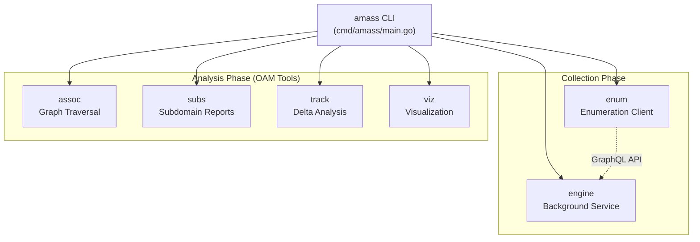
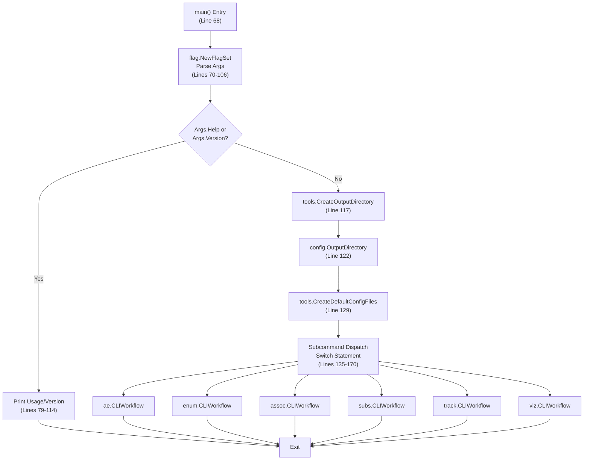
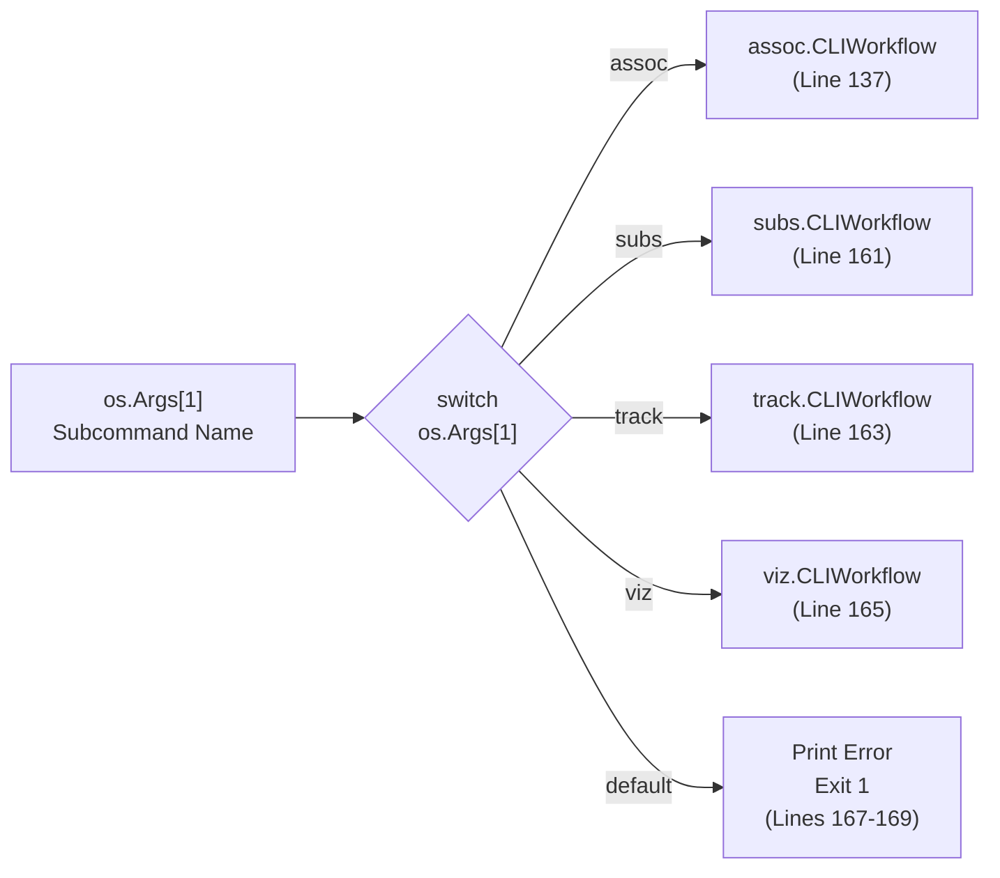
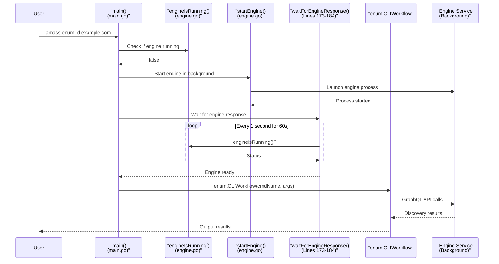

# Main CLI and Subcommands

# Main CLI and Subcommands

<details>
<summary>Relevant source files</summary>

The following files were used as context for generating this wiki page:

- [cmd/amass/main.go](cmd/amass/main.go)
- [config/config.go](config/config.go)

</details>


## Purpose and Scope

This document describes the main `amass` command-line interface entry point, its subcommand dispatch mechanism, and the special engine-enum client-server relationship. It focuses on the command routing logic in `cmd/amass/main.go` and how user commands are dispatched to their respective workflow handlers.

For detailed information about individual OAM analysis tools (`oam_assoc`, `oam_subs`, etc.), see [OAM Analysis Tools](#3.2). For configuration file parsing and the Config struct, see [Configuration System](#3.3). For engine internals, see [Engine Core](#4).

---

## Command Structure Overview

The Amass CLI provides six subcommands, each serving a distinct purpose in the reconnaissance and analysis workflow:

| Subcommand | Description | Primary Function |
|------------|-------------|------------------|
| `engine` | Background service that performs asset discovery | Runs the core enumeration engine as a service |
| `enum` | Enumeration client that submits targets to the engine | Client that communicates with engine via GraphQL |
| `assoc` | Association walk for graph queries | Performs triple-based graph traversal |
| `subs` | Subdomain summary with ASN information | Outputs discovered subdomains with network context |
| `track` | New asset tracker with time-based diff | Identifies assets discovered after a timestamp |
| `viz` | Graph visualization generator | Creates D3.js, Graphviz, or GEXF visualizations |

### Subcommand Categories



**Sources:** [cmd/amass/main.go:59-66](), [cmd/amass/main.go:135-170]()

---

## Main Entry Point and Initialization

The `main()` function in [cmd/amass/main.go:68-171]() serves as the primary dispatcher. Its responsibilities include:

1. **Argument Parsing** - Parses top-level flags (`-h`, `--help`, `-version`)
2. **Output Directory Setup** - Ensures `$HOME/.config/amass` exists
3. **Config File Initialization** - Creates default `config.yaml` if missing
4. **Subcommand Dispatch** - Routes to appropriate workflow handler

### Initialization Sequence



**Sources:** [cmd/amass/main.go:68-171](), [cmd/amass/main.go:117-132]()

### Output Directory Resolution

The system uses `config.OutputDirectory()` [config/config.go:373-383]() to determine where to store data:

1. If `dir` argument provided → use that path
2. Otherwise → `$USER_CONFIG_DIR/amass` (typically `~/.config/amass` on Unix)

The directory structure created:
```
~/.config/amass/
├── config.yaml          # Default configuration
├── datasources.yaml     # Data source API keys
└── [session files]      # Session-specific databases
```

**Sources:** [cmd/amass/main.go:117-126](), [config/config.go:373-383]()

---

## Subcommand Dispatch Logic

The dispatch mechanism uses a simple `switch` statement on `os.Args[1]` [cmd/amass/main.go:135-170](). Each case calls a package-specific `CLIWorkflow()` function:

### Standard Dispatch Pattern



Each `CLIWorkflow()` function receives:
- `cmdName` - Formatted as `"amass [subcommand]"` for help messages
- `os.Args[2:]` - Remaining arguments after the subcommand

**Example dispatch call:**
```
Command: amass assoc -d example.com
         ↓
assoc.CLIWorkflow("amass assoc", ["-d", "example.com"])
```

**Sources:** [cmd/amass/main.go:135-170]()

---

## Engine-Enum Client-Server Relationship

The `engine` and `enum` subcommands have a special relationship: **enum is a client that requires a running engine service**. This is unique among all subcommands.

### Engine Startup Flow for Enum Command



**Sources:** [cmd/amass/main.go:146-159](), [cmd/amass/main.go:173-184]()

### Engine Running Detection

The `waitForEngineResponse()` function [cmd/amass/main.go:173-184]() implements a polling mechanism:

- **Polling Interval:** 1 second
- **Timeout:** 60 seconds (60 iterations)
- **Check Function:** `engineIsRunning()` (defined in platform-specific files)

If the engine doesn't respond within 60 seconds, the enum command exits with an error [cmd/amass/main.go:153-156]().

### Engine-Only Subcommands

The `engine` subcommand has an exclusivity check [cmd/amass/main.go:139-144]():

```go
case "engine":
    if engineIsRunning() {
        _, _ = afmt.R.Fprintf(color.Error, "The Amass engine is already running.\n")
        os.Exit(1)
    }
    ae.CLIWorkflow(cmdName, os.Args[2:])
```

This prevents multiple engine instances from running simultaneously, which could cause database conflicts or port binding issues.

**Sources:** [cmd/amass/main.go:139-159]()

---

## Command-Line Argument Structure

### Top-Level Flags

The main `amass` command accepts three top-level flags [cmd/amass/main.go:70-74]():

| Flag | Alias | Type | Purpose |
|------|-------|------|---------|
| `-h` | `--help` | bool | Display usage and subcommand list |
| `-version` | - | bool | Print version number |

### Args Struct

```go
type Args struct {
    Help    bool
    Version bool
}
```

**Definition:** [cmd/amass/main.go:49-52]()

### Usage Message Construction

The usage function [cmd/amass/main.go:79-96]() performs several tasks:

1. **Banner Display** - Calls `afmt.PrintBanner()` to show ASCII art logo
2. **Usage Line** - Shows `Usage: amass [subcommands] [options]`
3. **Conditional Details:**
   - If `args.Help == true` → Shows flag descriptions and subcommand table
   - If `args.Help == false` → Shows brief help message with Discord link

### Subcommand Descriptions

The `subcommands` slice [cmd/amass/main.go:59-66]() provides metadata for each subcommand:

```go
var subcommands = []subDesc{
    {"assoc", assoc.Description},
    {"engine", ae.Description},
    {"enum", enum.Description},
    {"subs", subs.Description},
    {"track", track.Description},
    {"viz", viz.Description},
}
```

Each package exports a `Description` constant that's displayed in the help output.

**Sources:** [cmd/amass/main.go:49-96]()

---

## Subcommand Workflow Pattern

All subcommands follow a consistent pattern by implementing a `CLIWorkflow()` function:

### Workflow Function Signature

```go
func CLIWorkflow(cmdName string, args []string) {
    // 1. Define subcommand-specific flags
    // 2. Parse arguments
    // 3. Load configuration
    // 4. Execute subcommand logic
    // 5. Output results
}
```

### Example Dispatch Locations

| Subcommand | Package | Workflow Function Location |
|------------|---------|---------------------------|
| `assoc` | `internal/assoc` | `assoc.CLIWorkflow()` |
| `engine` | `internal/amass_engine` | `ae.CLIWorkflow()` |
| `enum` | `internal/enum` | `enum.CLIWorkflow()` |
| `subs` | `internal/subs` | `subs.CLIWorkflow()` |
| `track` | `internal/track` | `track.CLIWorkflow()` |
| `viz` | `internal/viz` | `viz.CLIWorkflow()` |

**Note:** The actual implementation of each `CLIWorkflow()` is documented in [OAM Analysis Tools](#3.2) for analysis commands, and in [Engine Core](#4) for discovery commands.

**Sources:** [cmd/amass/main.go:135-170]()

---

## Configuration Initialization

Before any subcommand executes, the main function ensures default configuration files exist [cmd/amass/main.go:128-132]().

### Configuration File Resolution

The system follows this precedence order (implemented in `config.AcquireConfig()` [config/config.go:346-369]()):

1. **Explicit `-config` flag** - User-specified path
2. **`AMASS_CONFIG` environment variable** - Env var override
3. **Output directory** - `$OUTPUT_DIR/config.yaml`
4. **System directory** - `/etc/amass/config.yaml` (Unix only)

### Default File Creation

The `tools.CreateDefaultConfigFiles()` function creates two files if they don't exist:

```
~/.config/amass/
├── config.yaml       # Main configuration with scope, resolvers, etc.
└── datasources.yaml  # API keys for external data sources
```

This ensures that even first-time users have valid configuration files, preventing errors from missing config paths.

**Sources:** [cmd/amass/main.go:128-132](), [config/config.go:346-369]()

---

## Error Handling and Exit Codes

### Exit Code Summary

| Condition | Exit Code | Location |
|-----------|-----------|----------|
| Argument parsing error | 1 | [Line 105]() |
| Output directory creation failed | 1 | [Line 119]() |
| Output directory path resolution failed | 1 | [Line 125]() |
| Config file creation failed | 1 | [Line 131]() |
| Engine already running (engine cmd) | 1 | [Line 141]() |
| Engine startup failed (enum cmd) | 1 | [Line 150]() |
| Engine timeout (enum cmd) | 1 | [Line 155]() |
| Unknown subcommand | 1 | [Line 169]() |
| Normal completion | 0 | implicit |

### Error Output Formatting

All error messages use the `afmt.R.Fprintf()` function (red colored output) to write to `color.Error` (stderr):

```go
_, _ = afmt.R.Fprintf(color.Error, "Failed to create the output directory: %v\n", err)
```

This provides visual distinction between normal output and error messages in terminal environments that support color.

**Sources:** [cmd/amass/main.go:102-170]()

---

## Command Name Construction

Each subcommand receives a formatted command name for its help messages [cmd/amass/main.go:134]():

```go
cmdName := fmt.Sprintf("%s %s", path.Base(os.Args[0]), os.Args[1])
```

**Example transformations:**
- `/usr/local/bin/amass enum` → `"amass enum"`
- `./amass assoc` → `"amass assoc"`

This ensures that help messages display correctly regardless of how the binary is invoked (absolute path, relative path, or via `$PATH`).

**Sources:** [cmd/amass/main.go:134]()

---

## Summary Table: Dispatch Flow

| Step | Function/Check | Action | Error Exit? |
|------|----------------|--------|-------------|
| 1 | Argument parsing | Parse `-h`, `--help`, `-version` | Yes (invalid args) |
| 2 | Help/Version check | Display and exit if requested | No |
| 3 | `CreateOutputDirectory()` | Ensure output dir exists | Yes |
| 4 | `OutputDirectory()` | Get output dir path | Yes |
| 5 | `CreateDefaultConfigFiles()` | Create config.yaml if missing | Yes |
| 6 | Subcommand switch | Match `os.Args[1]` | Yes (unknown) |
| 7a | (engine case) `engineIsRunning()` | Check for existing engine | Yes |
| 7b | (enum case) `engineIsRunning()` | Check engine status | No |
| 7c | (enum case) `startEngine()` | Launch engine if needed | Yes |
| 7d | (enum case) `waitForEngineResponse()` | Poll for engine readiness | Yes (timeout) |
| 8 | `[pkg].CLIWorkflow()` | Execute subcommand | No (handled internally) |

**Sources:** [cmd/amass/main.go:68-171]()