# OAM Analysis Tools

# OAM Analysis Tools

<details>
<summary>Relevant source files</summary>

The following files were used as context for generating this wiki page:

- [cmd/oam_assoc/main.go](cmd/oam_assoc/main.go)
- [cmd/oam_enum/main.go](cmd/oam_enum/main.go)
- [cmd/oam_subs/main.go](cmd/oam_subs/main.go)
- [cmd/oam_track/main.go](cmd/oam_track/main.go)
- [cmd/oam_viz/main.go](cmd/oam_viz/main.go)
- [internal/afmt/print.go](internal/afmt/print.go)
- [internal/amass_engine/cli.go](internal/amass_engine/cli.go)
- [internal/assoc/cli.go](internal/assoc/cli.go)
- [internal/enum/cli.go](internal/enum/cli.go)
- [internal/enum/files.go](internal/enum/files.go)
- [internal/subs/cli.go](internal/subs/cli.go)
- [internal/tools/log.go](internal/tools/log.go)
- [internal/track/cli.go](internal/track/cli.go)
- [internal/viz/cli.go](internal/viz/cli.go)

</details>


The OAM Analysis Tools are a suite of standalone command-line utilities that query and analyze data stored in the Asset-DB graph database after collection. These tools operate independently of the enumeration process and provide different views of the collected Open Asset Model (OAM) data. Each tool reads from the persistent graph database and outputs formatted results for specific analysis tasks.

For information about the data collection process, see [Main CLI and Subcommands](#3.1). For details on the underlying data model, see [Open Asset Model (OAM)](#7.1).

## Tool Suite Overview

The OAM Analysis Tools consist of four primary utilities, each serving a distinct analysis purpose:

| Tool | Purpose | Primary Output |
|------|---------|----------------|
| `oam_assoc` | Graph traversal using triple patterns | JSON results of association walks |
| `oam_subs` | Subdomain enumeration with infrastructure data | Terminal tables with ASN/netblock information |
| `oam_track` | Time-based discovery tracking | List of newly discovered assets since timestamp |
| `oam_viz` | Graph visualization generation | D3.js HTML, Graphviz DOT, or GEXF files |

All tools share a common architecture pattern: they accept configuration via YAML files and CLI arguments, connect to the Asset-DB graph database, query the OAM data, and format output for their specific use case.

Sources: [internal/assoc/cli.go:21-24](), [internal/subs/cli.go:30-33](), [internal/track/cli.go:25-29](), [internal/viz/cli.go:22-26]()

## Architecture Pattern

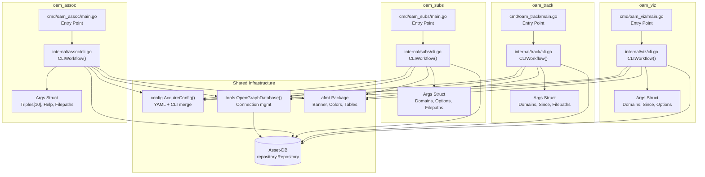

**Common CLI Workflow Pattern**

Each tool follows an identical architectural pattern for consistency. The `main.go` entry point extracts the command name using `path.Base(os.Args[0])` and delegates to the internal package's `CLIWorkflow()` function. This function handles flag parsing, configuration loading, database connection, and output formatting.

Sources: [cmd/oam_assoc/main.go:32-34](), [cmd/oam_subs/main.go:32-34](), [cmd/oam_track/main.go:32-34](), [cmd/oam_viz/main.go:32-34](), [internal/assoc/cli.go:63-174](), [internal/subs/cli.go:81-171](), [internal/track/cli.go:61-149](), [internal/viz/cli.go:68-194]()

## oam_assoc - Association Walk

The `oam_assoc` tool performs graph traversal queries using "triples" - a pattern-based syntax for walking relationships in the Asset-DB graph. It outputs JSON-formatted results showing entities and relationships discovered along the walk path.

### Command Structure

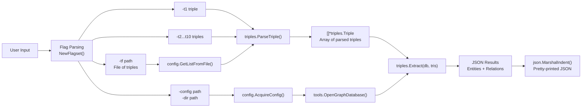

**Triple-Based Query System**

The tool accepts up to 10 triples via individual flags (`-t1` through `-t10`) or from a file (`-tf`). Each triple defines a graph traversal step using the pattern `subject predicate object`, where wildcards can be used. The triples are parsed by `triples.ParseTriple()` and executed sequentially by `triples.Extract()`.

Sources: [internal/assoc/cli.go:26-38](), [internal/assoc/cli.go:40-61](), [internal/assoc/cli.go:104-158]()

### Args Structure

The `Args` struct in `internal/assoc/cli.go` defines the command-line arguments:

```
Args {
    Help    bool
    Triples []string              // Array of 10 triple strings
    Options {
        NoColor bool              // Disable colorized output
        Silent  bool              // Disable all output
    }
    Filepaths {
        ConfigFile string         // Path to YAML config
        Directory  string         // Graph database directory
        TripleFile string         // File containing triples list
    }
}
```

The `Triples` array is pre-allocated to 10 elements at [internal/assoc/cli.go:65](). The tool requires at least one triple to be provided, validated at [internal/assoc/cli.go:120-123]().

Sources: [internal/assoc/cli.go:26-38](), [internal/assoc/cli.go:64-65]()

### Workflow Execution

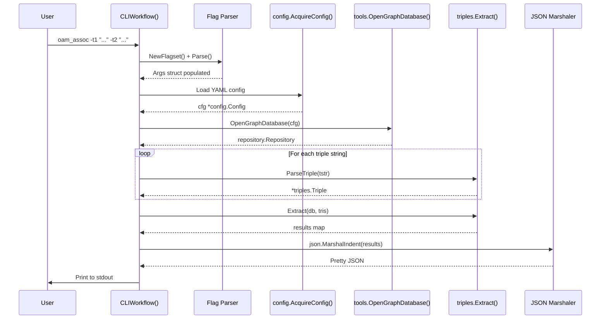

**Error Handling**

The workflow includes multiple error exit points: failure to parse triples ([internal/assoc/cli.go:149-152]()), failure to extract associations ([internal/assoc/cli.go:160-164]()), and failure to marshal JSON ([internal/assoc/cli.go:168-171]()). Each error outputs a colored message to `color.Error` before calling `os.Exit(1)`.

Sources: [internal/assoc/cli.go:63-174](), [internal/assoc/cli.go:142-164]()

### Output Format

The tool outputs indented JSON with two-space formatting specified at [internal/assoc/cli.go:167](). The JSON structure contains the results from `triples.Extract()`, which returns entities and relationships discovered during the graph walk. The output is printed to `color.Output` at [internal/assoc/cli.go:173]().

Sources: [internal/assoc/cli.go:166-173]()

## oam_subs - Subdomain Analysis

The `oam_subs` tool provides a formatted summary of discovered subdomains with optional IP address resolution and Autonomous System Number (ASN) infrastructure information. It displays results as colored terminal output with optional ASN summary tables.

### Command Structure and Flags

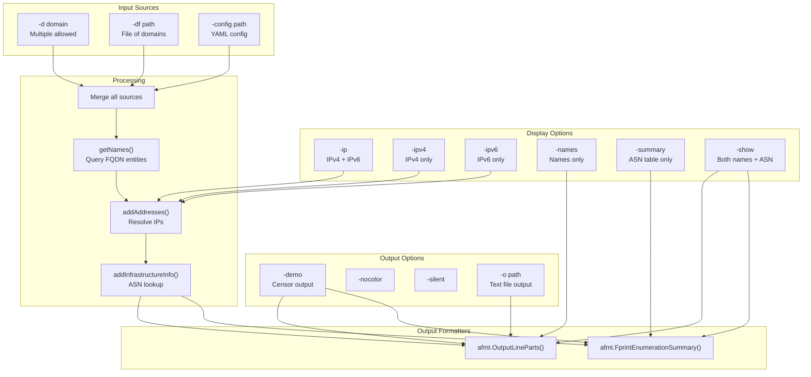

**Display Mode Logic**

The tool requires either `-names`, `-summary`, or `-show` to determine output mode ([internal/subs/cli.go:160-163]()). The `-show` flag enables both modes by setting `DiscoveredNames` and `ASNTableSummary` to true ([internal/subs/cli.go:156-159]()). The `-ip` flag is a convenience that enables both IPv4 and IPv6 ([internal/subs/cli.go:123-126]()).

Sources: [internal/subs/cli.go:35-55](), [internal/subs/cli.go:59-78](), [internal/subs/cli.go:123-163]()

### Args Structure

```
Args {
    Help    bool
    Domains *stringset.Set
    Options {
        DemoMode        bool     // Censor sensitive data
        IPs             bool     // Show all IP addresses
        IPv4            bool     // Show IPv4 addresses
        IPv6            bool     // Show IPv6 addresses
        ASNTableSummary bool     // Print ASN table
        DiscoveredNames bool     // Print subdomain list
        NoColor         bool
        ShowAll         bool     // Enable both names + ASN
        Silent          bool
    }
    Filepaths {
        ConfigFile string
        Directory  string
        Domains    string
        TermOut    string        // Redirect output to file
    }
}
```

Sources: [internal/subs/cli.go:35-55]()

### Data Retrieval Workflow

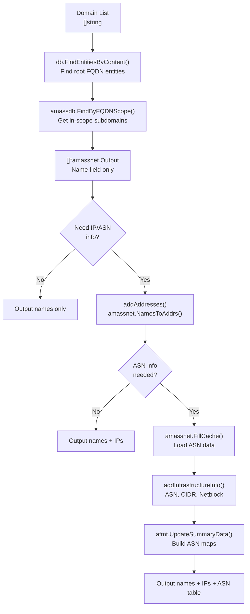

**Database Query Strategy**

The `getNames()` function at [internal/subs/cli.go:263-292]() queries for root domain FQDN entities, then uses `amassdb.FindByFQDNScope()` to retrieve all subdomains within scope. This returns `[]*dbt.Entity` containing `oamdns.FQDN` assets. The function uses a `stringset.Set` filter to deduplicate names.

The `addAddresses()` function at [internal/subs/cli.go:294-326]() uses `amassnet.NamesToAddrs()` to bulk query DNS A/AAAA relationships, populating the `Addresses` field of each `amassnet.Output` struct.

Sources: [internal/subs/cli.go:263-326](), [internal/subs/cli.go:173-261]()

### ASN Information System

```mermaid
graph LR
    subgraph "ASN Cache"
        FillCache["amassnet.FillCache(cache, db)<br/>Load all ASN records"]
        Cache["*amassnet.ASNCache<br/>In-memory lookup"]
    end
    
    subgraph "Per-Address Enrichment"
        AddrLoop["For each AddressInfo"]
        CacheSearch["cache.AddrSearch(ip)<br/>Find ASN record"]
        ParseCIDR["net.ParseCIDR(prefix)"]
        BuildAddr["Populate ASN, CIDRStr,<br/>Netblock, Description"]
    end
    
    subgraph "Summary Aggregation"
        UpdateSummary["afmt.UpdateSummaryData()"]
        ASNMap["map[int]*ASNSummaryData<br/>ASN -> Name, Netblocks"]
        NetblockCount["Netblocks map[string]int<br/>CIDR -> IP count"]
    end
    
    FillCache --> Cache
    Cache --> AddrLoop
    AddrLoop --> CacheSearch
    CacheSearch --> ParseCIDR
    ParseCIDR --> BuildAddr
    BuildAddr --> UpdateSummary
    UpdateSummary --> ASNMap
    ASNMap --> NetblockCount
```

**ASN Cache Population**

When ASN information is requested, the tool creates an `amassnet.ASNCache` at [internal/subs/cli.go:195]() and populates it using `amassnet.FillCache()` at [internal/subs/cli.go:196](). This loads all ASN records from the database into memory for efficient lookup.

The `addInfrastructureInfo()` function at [internal/subs/cli.go:344-372]() iterates through each IP address, calls `cache.AddrSearch()` to find the corresponding ASN record, and enriches the `AddressInfo` struct with ASN number, CIDR prefix, netblock, and description.

Sources: [internal/subs/cli.go:193-200](), [internal/subs/cli.go:344-372]()

### Output Formatting

The tool generates two types of output:

1. **Name Listing**: Each subdomain is printed with optional IP addresses using `afmt.OutputLineParts()` at [internal/subs/cli.go:224](). Output goes to either a file specified by `-o` or to colored terminal output at [internal/subs/cli.go:231-237]().

2. **ASN Summary Table**: Generated by `afmt.FprintEnumerationSummary()` at [internal/subs/cli.go:258](), this displays ASN numbers, descriptions, and netblock statistics with IP counts per CIDR. The table format is defined in [internal/afmt/print.go:136-185]().

The `DemoMode` flag ([internal/subs/cli.go:39]()) censors sensitive data using functions like `censorDomain()` and `censorIP()` defined in [internal/afmt/print.go:201-211]().

Sources: [internal/subs/cli.go:209-261](), [internal/afmt/print.go:136-185](), [internal/afmt/print.go:214-232]()

## oam_track - Asset Tracking

The `oam_track` tool identifies newly discovered assets by filtering the graph database based on creation timestamps. It outputs a simple list of FQDNs that were discovered after a specified time.

### Command Structure

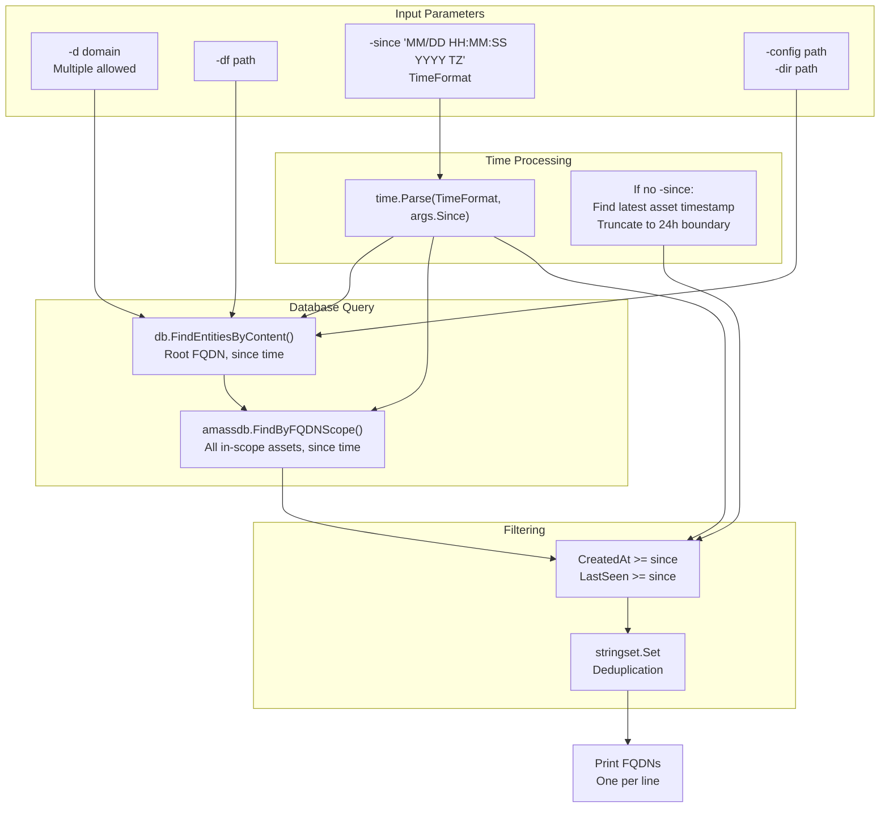

**Time Format Specification**

The tool uses a specific time format defined at [internal/track/cli.go:26](): `"01/02 15:04:05 2006 MST"`. This format is used for both the `-since` flag and in error messages. If no `-since` is provided, the tool finds the latest asset timestamp and truncates it to a 24-hour boundary at [internal/track/cli.go:177]().

Sources: [internal/track/cli.go:26-27](), [internal/track/cli.go:46-58](), [internal/track/cli.go:117-124]()

### Args Structure

```
Args {
    Help    bool
    Domains *stringset.Set
    Since   string              // Time string in TimeFormat
    Options {
        NoColor bool
        Silent  bool
    }
    Filepaths {
        ConfigFile string
        Directory  string
        Domains    string
    }
}
```

The `Since` field is a string that gets parsed using `time.Parse()` at [internal/track/cli.go:119](). An empty string indicates no time filter was provided.

Sources: [internal/track/cli.go:31-44]()

### Workflow Implementation

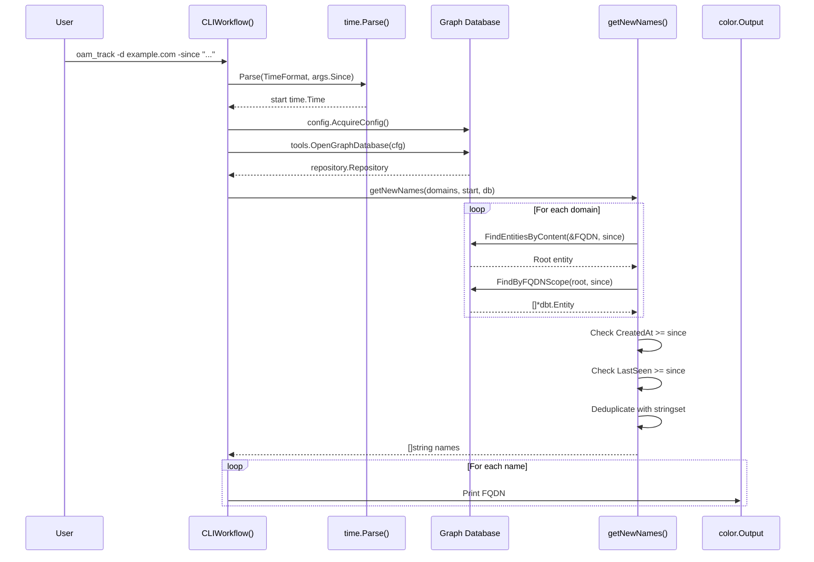

**Database Query with Timestamp**

The `getNewNames()` function at [internal/track/cli.go:151-192]() queries the database twice per domain. First, `db.FindEntitiesByContent()` locates the root FQDN entity with the `since` timestamp parameter at [internal/track/cli.go:158](). Second, `amassdb.FindByFQDNScope()` retrieves all related assets, also filtered by the timestamp at [internal/track/cli.go:159]().

**Timestamp Filtering Logic**

Assets are included if both conditions are met at [internal/track/cli.go:184-186]():
- `CreatedAt` is equal to or after `since`
- `LastSeen` is equal to or after `since`

This ensures only assets created and validated within the time window are returned.

Sources: [internal/track/cli.go:61-149](), [internal/track/cli.go:151-192]()

### Default Time Calculation

When no `-since` flag is provided, the tool calculates a default starting time:

```
// Find the latest LastSeen timestamp among all assets
for _, a := range assets {
    if _, ok := a.Asset.(*oamdns.FQDN); ok && a.LastSeen.After(latest) {
        latest = a.LastSeen
    }
}
// Truncate to 24-hour boundary
since = latest.Truncate(24 * time.Hour)
```

This logic at [internal/track/cli.go:168-178]() finds the most recently validated asset and sets the filter to the beginning of that day, effectively showing assets from the last 24 hours.

Sources: [internal/track/cli.go:168-178]()

## oam_viz - Visualization Generation

The `oam_viz` tool generates graph visualizations in three formats: D3.js force simulation HTML, Graphviz DOT, and GEXF (Gephi Exchange Format). It queries the database for nodes and edges, then renders them into the selected output format.

### Command Structure and Format Selection

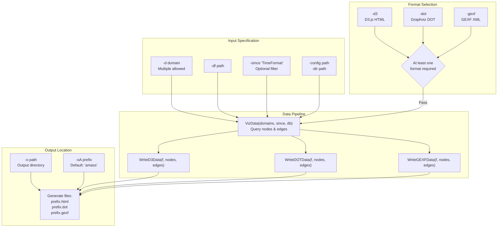

**Format Requirement Validation**

The tool requires at least one output format to be specified, validated at [internal/viz/cli.go:123-126](). If no format flags are provided, it outputs an error and exits. Each format flag triggers generation of a corresponding output file with the prefix from `-oA` (defaulting to "amass" at [internal/viz/cli.go:166-169]()).

Sources: [internal/viz/cli.go:28-46](), [internal/viz/cli.go:48-66](), [internal/viz/cli.go:123-126]()

### Args Structure

```
Args {
    Help    bool
    Domains *stringset.Set
    Since   string              // TimeFormat timestamp
    Options {
        D3      bool            // Generate D3.js HTML
        DOT     bool            // Generate Graphviz DOT
        GEXF    bool            // Generate GEXF XML
        NoColor bool
        Silent  bool
    }
    Filepaths {
        ConfigFile    string
        Directory     string
        Domains       string
        Output        string    // Output directory
        AllFilePrefix string    // Filename prefix (-oA)
    }
}
```

Sources: [internal/viz/cli.go:28-46]()

### Visualization Data Retrieval

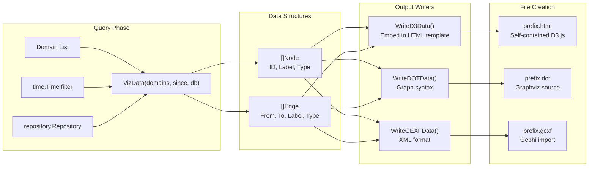

**VizData Function**

The `VizData()` function (referenced but not shown in provided files) queries the graph database for nodes and edges filtered by domain scope and timestamp. It returns two slices: `[]Node` containing graph vertices and `[]Edge` containing relationships.

The `Node` structure likely contains fields for ID, label, and type. The `Edge` structure contains source/target IDs and relationship metadata. These are consumed by the format-specific writer functions.

Sources: [internal/viz/cli.go:158]()

### File Writing Pipeline

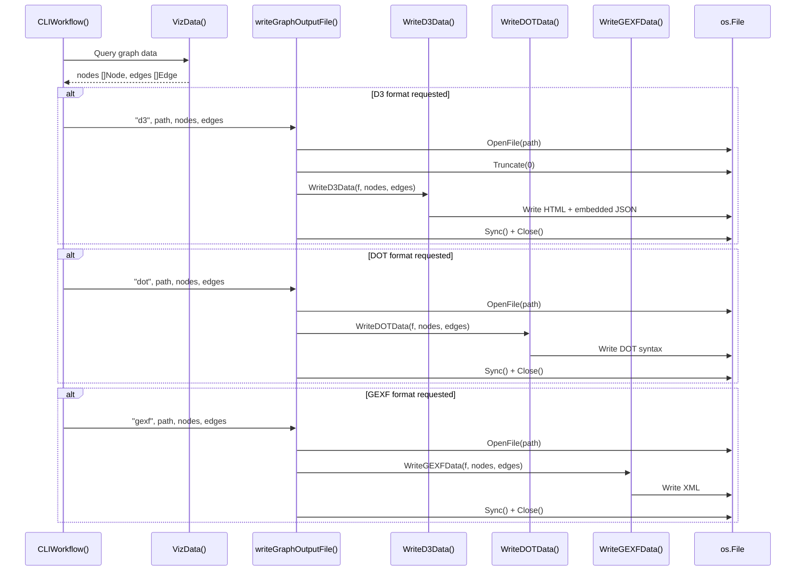

**File Management**

The `writeGraphOutputFile()` function at [internal/viz/cli.go:196-218]() handles file creation and format dispatching. It opens the file with `os.O_WRONLY|os.O_CREATE` at [internal/viz/cli.go:197](), truncates to zero length at [internal/viz/cli.go:206](), writes the appropriate format, then syncs and closes at [internal/viz/cli.go:201-204]().

A switch statement at [internal/viz/cli.go:209-216]() routes to the correct writer based on the format type string ("d3", "dot", or "gexf").

Sources: [internal/viz/cli.go:178-189](), [internal/viz/cli.go:196-218]()

### Output Format Characteristics

| Format | File Extension | Purpose | Key Features |
|--------|---------------|---------|--------------|
| D3.js  | `.html` | Interactive web visualization | Self-contained HTML with embedded force simulation, requires browser |
| DOT | `.dot` | Graphviz rendering | Text-based graph description, can be rendered with `dot` command |
| GEXF | `.gexf` | Gephi import | XML format for loading into Gephi for advanced analysis |

The D3 output generates a single HTML file with all JavaScript and data embedded, making it portable. The DOT format produces graph description language that can be rendered to PNG/SVG using Graphviz tools. The GEXF format creates XML compatible with the Gephi graph visualization platform.

Sources: [internal/viz/cli.go:60-62]()

## Common Infrastructure

All OAM tools share common infrastructure components that provide consistent configuration loading, database access, and output formatting.

### Configuration Loading Pattern

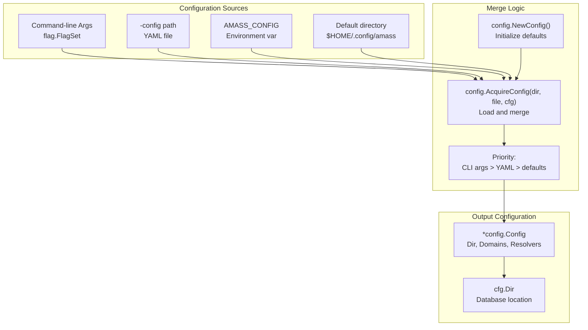

**AcquireConfig Function**

Every tool calls `config.AcquireConfig()` with the directory path, config file path, and a `*config.Config` instance. This function, referenced at [internal/assoc/cli.go:127](), [internal/subs/cli.go:138](), [internal/track/cli.go:128](), and [internal/viz/cli.go:140](), loads YAML configuration and merges it with existing settings.

If a config file is explicitly specified but fails to load, tools exit with an error. If no config is specified, the function attempts default locations without error.

Sources: [internal/assoc/cli.go:125-134](), [internal/subs/cli.go:136-148](), [internal/track/cli.go:126-138](), [internal/viz/cli.go:138-150]()

### Database Connection Pattern

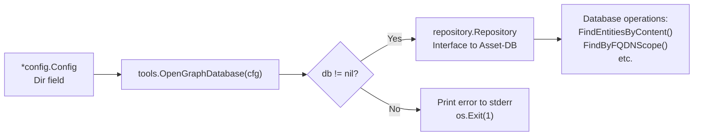

**OpenGraphDatabase Function**

The `tools.OpenGraphDatabase()` function, called by all tools, returns a `repository.Repository` interface. If the connection fails, it returns `nil`, prompting each tool to output an error message to `color.Error` and exit at [internal/assoc/cli.go:137-140](), [internal/subs/cli.go:150-154](), [internal/track/cli.go:140-144](), and [internal/viz/cli.go:152-156]().

The repository interface provides methods like `FindEntitiesByContent()` for querying OAM entities and associated relationships stored in the Asset-DB graph database.

Sources: [internal/assoc/cli.go:136-140](), [internal/subs/cli.go:150-154](), [internal/track/cli.go:140-144](), [internal/viz/cli.go:152-156]()

### Output Formatting System

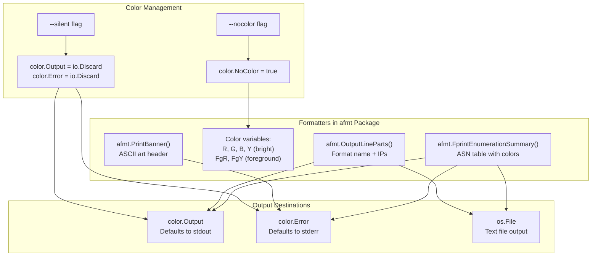

**Color Package Integration**

All tools use the `github.com/fatih/color` package for terminal output. The package is configured through global variables at the start of each workflow. The `--nocolor` flag disables colored output by setting `color.NoColor = true` at [internal/assoc/cli.go:98](), [internal/subs/cli.go:117](), [internal/track/cli.go:97](), and [internal/viz/cli.go:104]().

The `--silent` flag redirects both `color.Output` and `color.Error` to `io.Discard`, suppressing all output at [internal/assoc/cli.go:100-103](), [internal/subs/cli.go:119-122](), [internal/track/cli.go:99-102](), and [internal/viz/cli.go:106-109]().

**Banner Display**

Every tool displays the Amass banner using `afmt.PrintBanner()` in its usage function. The banner is defined in [internal/afmt/print.go:19-30]() and includes version information, project attribution, and the Discord invitation link.

Sources: [internal/assoc/cli.go:72-82](), [internal/subs/cli.go:91-101](), [internal/track/cli.go:71-81](), [internal/viz/cli.go:78-88](), [internal/afmt/print.go:19-44](), [internal/afmt/print.go:62-83]()

### Error Handling Pattern

All tools follow a consistent error handling approach:

1. **Flag Parsing Errors**: Output error to `color.Error`, then `os.Exit(1)` at [internal/assoc/cli.go:89-92]()
2. **Config Loading Errors**: When explicit config file specified, output error and exit at [internal/assoc/cli.go:131-134]()
3. **Database Connection Errors**: Output to `color.Error` and exit at [internal/assoc/cli.go:137-140]()
4. **Operation Errors**: Tool-specific errors (parse failures, query failures) output and exit similarly

The pattern ensures consistent error reporting across all tools, with colored error messages to `stderr` before termination.

Sources: [internal/assoc/cli.go:89-92](), [internal/assoc/cli.go:131-134](), [internal/assoc/cli.go:137-140](), [internal/subs/cli.go:109-110](), [internal/track/cli.go:89-91](), [internal/viz/cli.go:96-98]()