# Configuration System

# Configuration System

<details>
<summary>Relevant source files</summary>

The following files were used as context for generating this wiki page:

- [cmd/amass/main.go](cmd/amass/main.go)
- [config/config.go](config/config.go)
- [config/resolvers.go](config/resolvers.go)

</details>


## Purpose and Scope

The Configuration System manages all runtime settings for OWASP Amass, including enumeration scope, DNS resolver pools, data source credentials, transformation rules, and behavioral parameters. It supports a hierarchical configuration model where settings can be specified via YAML files, environment variables, and CLI arguments, with later sources overriding earlier ones.

This page documents the configuration data structures, loading mechanisms, and validation logic. For information about how CLI subcommands parse and apply configurations, see [Main CLI and Subcommands](#3.1). For details on how the engine uses configuration to manage sessions, see [Session Management](#4.2).

---

## Configuration Sources and Hierarchy

Amass employs a three-tier configuration hierarchy that determines precedence when conflicting settings are specified:

| Priority | Source | Description |
|----------|--------|-------------|
| 1 (Highest) | CLI Arguments | Flags passed directly to commands |
| 2 | Environment Variables | `AMASS_CONFIG` variable pointing to a config file |
| 3 (Lowest) | YAML Files | Configuration files in standard locations |

### Configuration File Discovery

The system searches for configuration files in the following order, using the first one found:

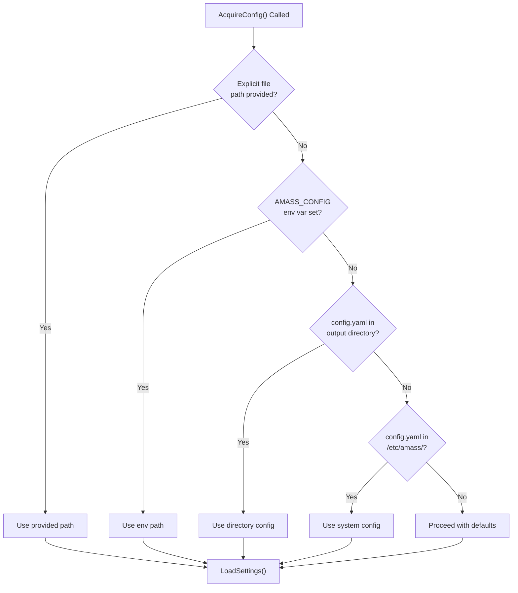

**Sources:** [config/config.go:345-369]()

The `OutputDirectory()` function determines the default location for Amass files, typically `$HOME/.config/amass` on Unix systems [config/config.go:373-383](). On startup, the main CLI ensures this directory exists and creates default configuration files if needed [cmd/amass/main.go:116-132]().

### Environment Variables

The primary environment variable is `AMASS_CONFIG`, which specifies the path to a YAML configuration file:

```bash
export AMASS_CONFIG=/custom/path/config.yaml
```

**Sources:** [config/config.go:35](), [config/config.go:360-361]()

---

## The Config Struct

The `Config` struct is the central data structure that holds all configuration state throughout the application lifecycle.

### Core Fields

```mermaid
classDiagram
    class Config {
        +UUID uuid.UUID
        +Rand *rand.Rand
        +Log *log.Logger
        +CollectionStartTime time.Time
        +Seed *Scope
        +Scope *Scope
        +Options map[string]interface{}
        +DefaultTransformations *Transformation
        +Filepath string
        +Dir string
        +GraphDBs []*Database
        +MaxDNSQueries int
        +Wordlist []string
        +BruteForcing bool
        +Recursive bool
        +Alterations bool
        +Passive bool
        +Active bool
        +Rigid bool
        +MinimumTTL int
        +Resolvers []string
        +ResolversQPS int
        +TrustedResolvers []string
        +TrustedQPS int
        +DataSrcConfigs *DataSourceConfig
        +Transformations map[string]*Transformation
        +LoadSettings(path string) error
        +CheckSettings() error
        +UpdateConfig(Updater) error
    }
    
    class Scope {
        +Domains []string
        +Addresses []net.IP
        +IP []string
        +ASNs []int
        +CIDRs []*net.IPNet
        +CIDRStrings []string
        +Ports []int
        +PortsRaw []interface{}
        +Blacklist []string
    }
    
    class Transformation {
        +TTL int
        +Confidence int
        +Priority int
    }
    
    Config --> Scope : Seed
    Config --> Scope : Scope
    Config --> Transformation : DefaultTransformations
    Config --> Transformation : Transformations map
```

**Sources:** [config/config.go:44-167]()

### Key Configuration Categories

| Category | Fields | Purpose |
|----------|--------|---------|
| **Identity** | `UUID`, `Rand`, `Log` | Session identification and runtime state |
| **Scope** | `Seed`, `Scope` | Define enumeration boundaries |
| **DNS** | `Resolvers`, `TrustedResolvers`, `MaxDNSQueries` | DNS resolution infrastructure |
| **Discovery** | `BruteForcing`, `Alterations`, `Recursive`, `Active`, `Passive` | Enumeration techniques |
| **Data** | `GraphDBs`, `DataSrcConfigs` | Data storage and source configuration |
| **Transformations** | `Transformations`, `DefaultTransformations` | Event processing rules |

**Sources:** [config/config.go:44-167]()

### Config Initialization

The `NewConfig()` function returns a `Config` struct with sensible defaults:

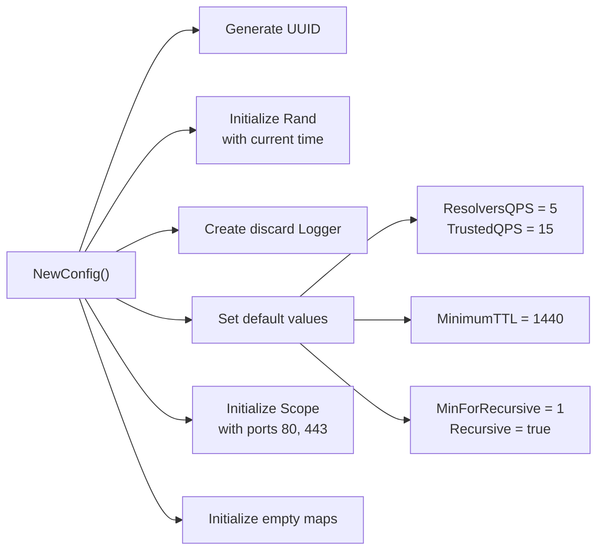

**Sources:** [config/config.go:200-230]()

The default QPS values are defined as constants: `DefaultQueriesPerPublicResolver = 5` and `DefaultQueriesPerBaselineResolver = 15` [config/resolvers.go:23-27]().

---

## Scope Configuration

The `Scope` struct defines the boundaries of an enumeration. Amass distinguishes between **Seed** scope (initial targets) and **Scope** (expanded boundaries):

### Scope Struct Fields

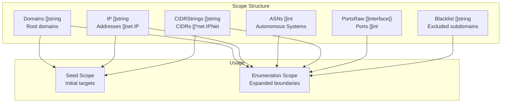

**Sources:** [config/config.go:169-197]()

### Seed vs Scope Distinction

- **Seed Scope** (`Config.Seed`): The initial user-provided targets (domains, IPs, CIDRs) that serve as starting points for discovery
- **Enumeration Scope** (`Config.Scope`): The expanded boundaries that may include discovered ASNs, additional networks, and service ports. The `Rigid` field determines whether discovery can expand beyond the seed [config/config.go:119]()

### Ports Configuration

Ports can be specified as individual integers or ranges in YAML:

```yaml
scope:
  ports:
    - 80
    - 443
    - 8000-8100
```

The `PortsRaw` field stores the interface{} representation for parsing, while `Ports` contains the expanded integer list [config/config.go:190-193]().

### CIDR Conversion

The `toCIDRs()` helper method converts string CIDR representations to `*net.IPNet` objects for efficient IP matching [config/config.go:336-343]().

**Sources:** [config/config.go:169-197](), [config/config.go:336-343]()

---

## Resolver Configuration

DNS resolver configuration is one of the most critical aspects of Amass's performance and reliability.

### Resolver Types and Defaults

Amass maintains two distinct resolver pools:

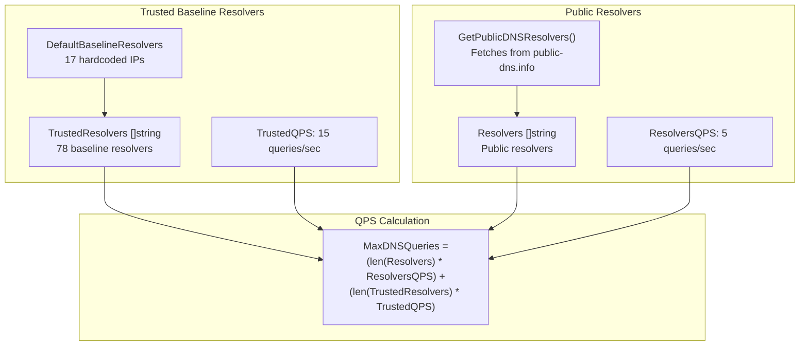

**Sources:** [config/resolvers.go:23-49](), [config/config.go:136-139](), [config/resolvers.go:156-159]()

### Default Baseline Resolvers

The system includes 17 hardcoded trusted resolvers from major providers [config/resolvers.go:31-49]():

| Provider | IP Address | Description |
|----------|------------|-------------|
| Google | 8.8.8.8 | Primary Google DNS |
| Cloudflare | 1.1.1.1 | Privacy-focused resolver |
| Quad9 | 9.9.9.9 | Security-focused resolver |
| Cisco OpenDNS | 208.67.222.222 | Enterprise resolver |
| Neustar | 64.6.64.6 | Commercial DNS service |
| (12 more...) | ... | Various providers |

### Dynamic Public Resolver Fetching

The `GetPublicDNSResolvers()` function downloads a CSV from `public-dns.info` and filters resolvers with reliability ≥ 0.85 [config/resolvers.go:54-98]():

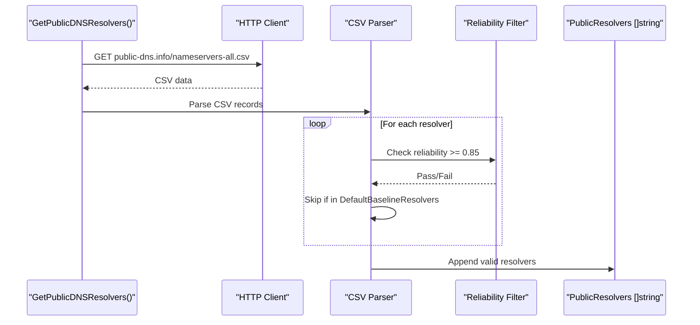

**Sources:** [config/resolvers.go:54-98]()

### Loading Resolvers from Configuration

Resolvers can be specified in YAML as IP addresses or file paths:

```yaml
options:
  resolvers:
    - 8.8.8.8
    - 1.1.1.1
    - /path/to/resolvers.txt
```

The `loadResolverSettings()` method processes this configuration [config/resolvers.go:161-215]():

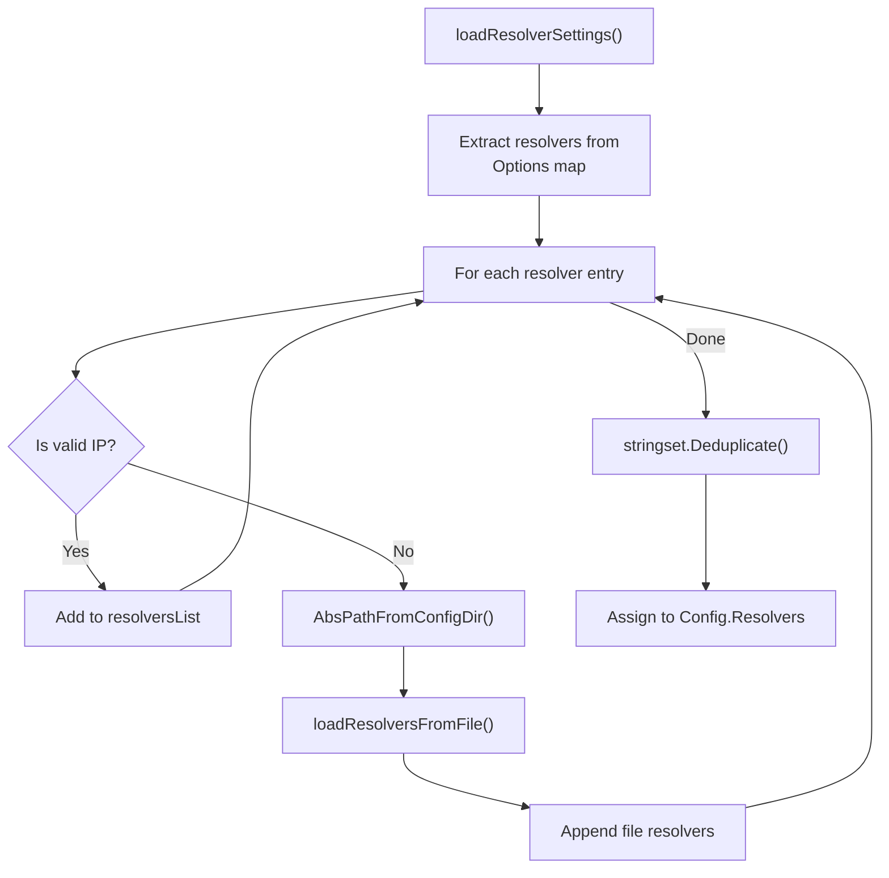

**Sources:** [config/resolvers.go:161-215](), [config/resolvers.go:217-249]()

### Resolver Management Methods

The `Config` struct provides methods to manage resolver lists:

| Method | Purpose |
|--------|---------|
| `SetResolvers(...string)` | Replace untrusted resolver list |
| `AddResolvers(...string)` | Append to untrusted resolver list |
| `AddResolver(string)` | Add single untrusted resolver |
| `SetTrustedResolvers(...string)` | Replace trusted resolver list |
| `AddTrustedResolvers(...string)` | Append to trusted resolver list |
| `AddTrustedResolver(string)` | Add single trusted resolver |
| `CalcMaxQPS()` | Recalculate MaxDNSQueries field |

All add/set methods automatically call `CalcMaxQPS()` to update the total query capacity [config/resolvers.go:100-159]().

**Sources:** [config/resolvers.go:100-159]()

---

## Configuration Loading Process

The configuration loading process involves multiple stages, each handling a different aspect of the configuration.

### AcquireConfig Flow

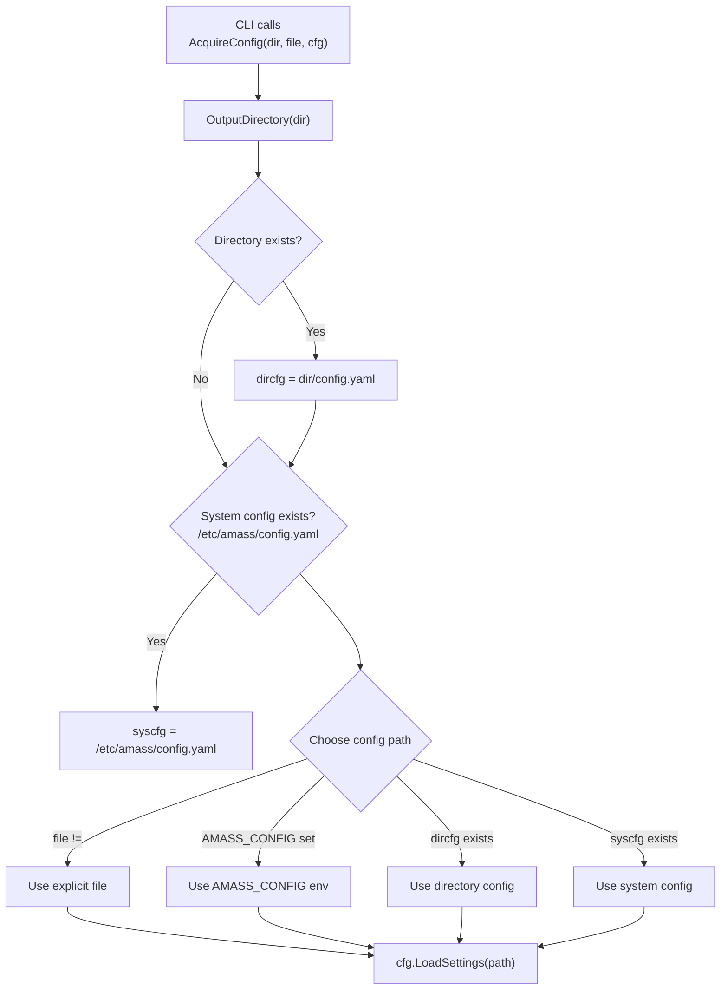

**Sources:** [config/config.go:346-369]()

### LoadSettings Method Chain

The `LoadSettings()` method orchestrates a series of specialized loading functions:

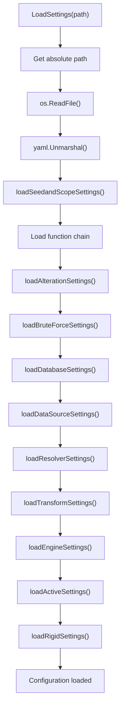

**Sources:** [config/config.go:263-310]()

Each `load*Settings()` function is responsible for extracting and validating a specific aspect of the configuration from the YAML data [config/config.go:292-302]().

### Configuration Validation

The `CheckSettings()` method performs sanity checks on the loaded configuration:

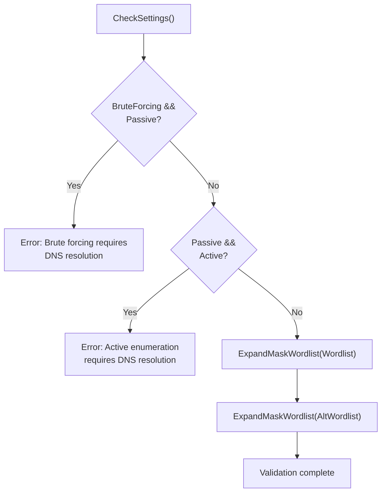

**Sources:** [config/config.go:238-260]()

---

## Transformations and Data Sources

### Transformation Configuration

Transformations define how events are processed through the plugin pipeline. Each transformation specifies TTL, confidence scores, and priority values:

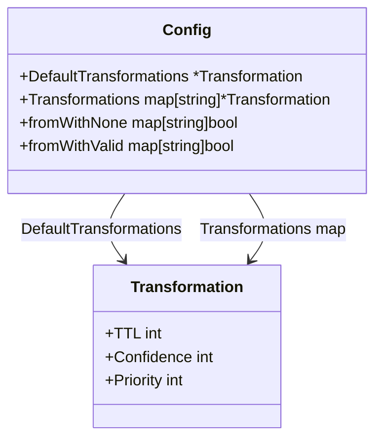

The `DefaultTransformations` provides fallback values (TTL: 1440, Confidence: 50, Priority: 5) when specific transformations are not defined [config/config.go:224-228]().

**Sources:** [config/config.go:69-70](), [config/config.go:157](), [config/config.go:162-166](), [config/config.go:224-228]()

### Data Source Configuration

The `DataSrcConfigs` field holds credentials and options for external data sources like GLEIF, Aviato, and various WHOIS/RDAP services:

```yaml
datasource_config:
  gleif:
    apikey: "your-api-key"
  aviato:
    apikey: "your-api-key"
```

The `DataSourceConfig` struct is defined in [config/config.go:154]() and includes a `GlobalOptions` map for cross-cutting settings [config/config.go:220-222]().

**Sources:** [config/config.go:154](), [config/config.go:220-222]()

---

## Path Resolution

The configuration system supports both absolute and relative paths for file references.

### AbsPathFromConfigDir

The `AbsPathFromConfigDir()` method resolves paths relative to the configuration file's directory:

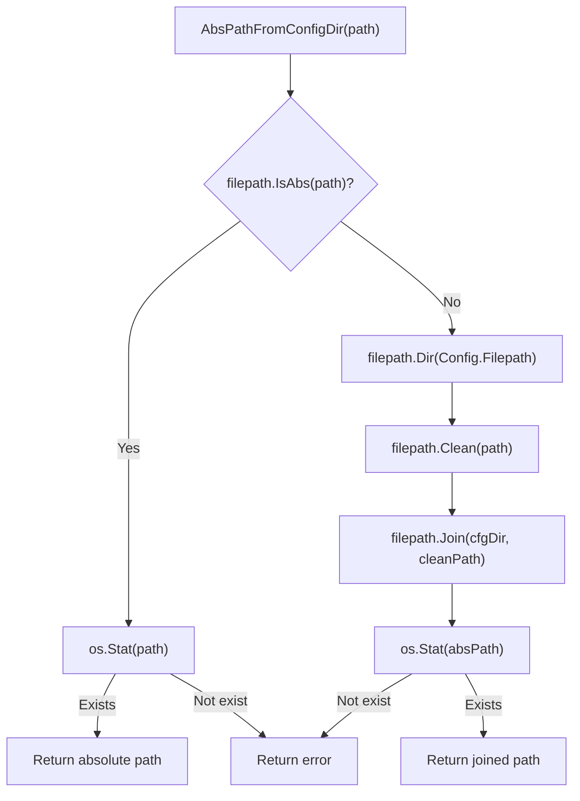

**Sources:** [config/config.go:314-335]()

This method is used throughout the configuration loading process to resolve relative paths for resolver files, wordlists, and other file-based configuration inputs [config/resolvers.go:191-194]().

---

## Configuration Updates

The configuration system supports runtime updates through the `Updater` interface:

```go
type Updater interface {
    OverrideConfig(*Config) error
}
```

Any object implementing this interface can modify a configuration by calling `Config.UpdateConfig(updater)` [config/config.go:39-42](), [config/config.go:233-235]().

### JSON Serialization

The `JSON()` method serializes the configuration to JSON without HTML escaping:

```mermaid
graph LR
    JSON["Config.JSON()"]
    CreateAlias["type Alias Config"]
    CreateBuffer["bytes.Buffer"]
    CreateEncoder["json.NewEncoder(buffer)"]
    DisableEscape["encoder.SetEscapeHTML(false)"]
    Encode["encoder.Encode()"]
    ReturnBytes["Return buffer.Bytes()"]
    
    JSON --> CreateAlias
    CreateAlias --> CreateBuffer
    CreateBuffer --> CreateEncoder
    CreateEncoder --> DisableEscape
    DisableEscape --> Encode
    Encode --> ReturnBytes
```

**Sources:** [config/config.go:442-454]()

---

## Integration Points

The configuration system integrates with other Amass components:

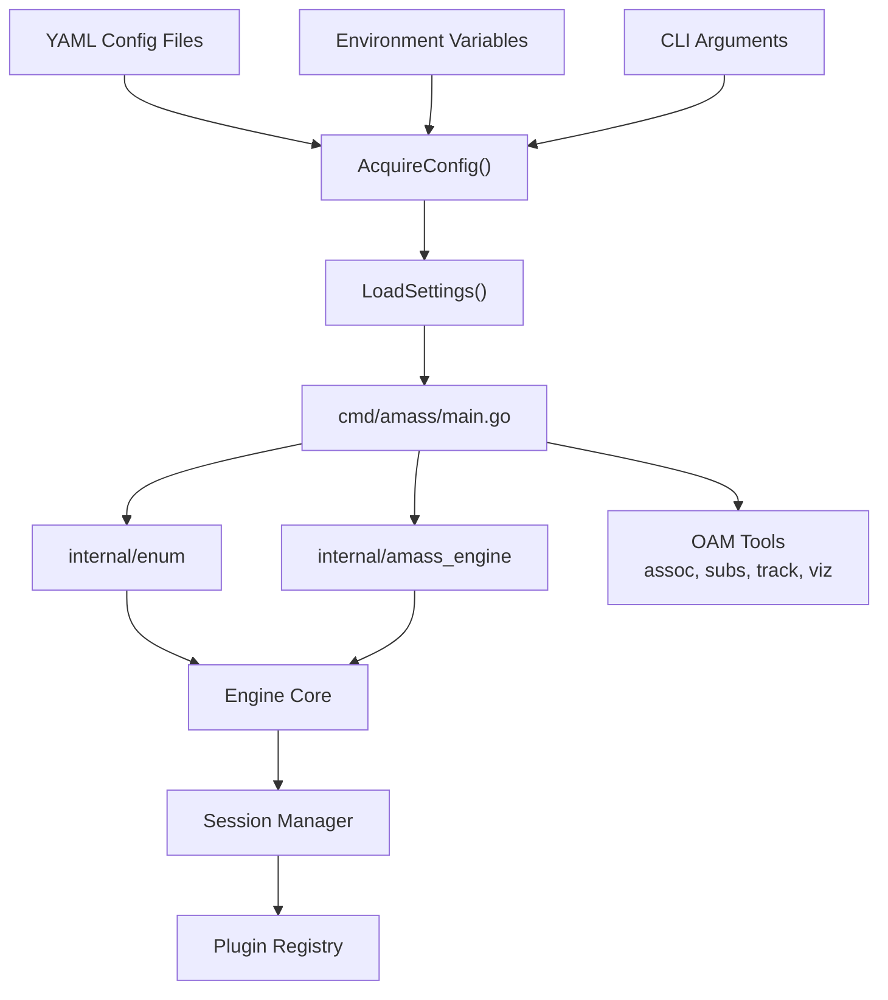

The main CLI creates output directories and default config files before dispatching to subcommands [cmd/amass/main.go:116-132](). Each subcommand (enum, engine, assoc, etc.) receives the configuration and may apply additional CLI-specific overrides through the `Updater` interface.

**Sources:** [cmd/amass/main.go:1-185](), [config/config.go:1-455](), [config/resolvers.go:1-250]()