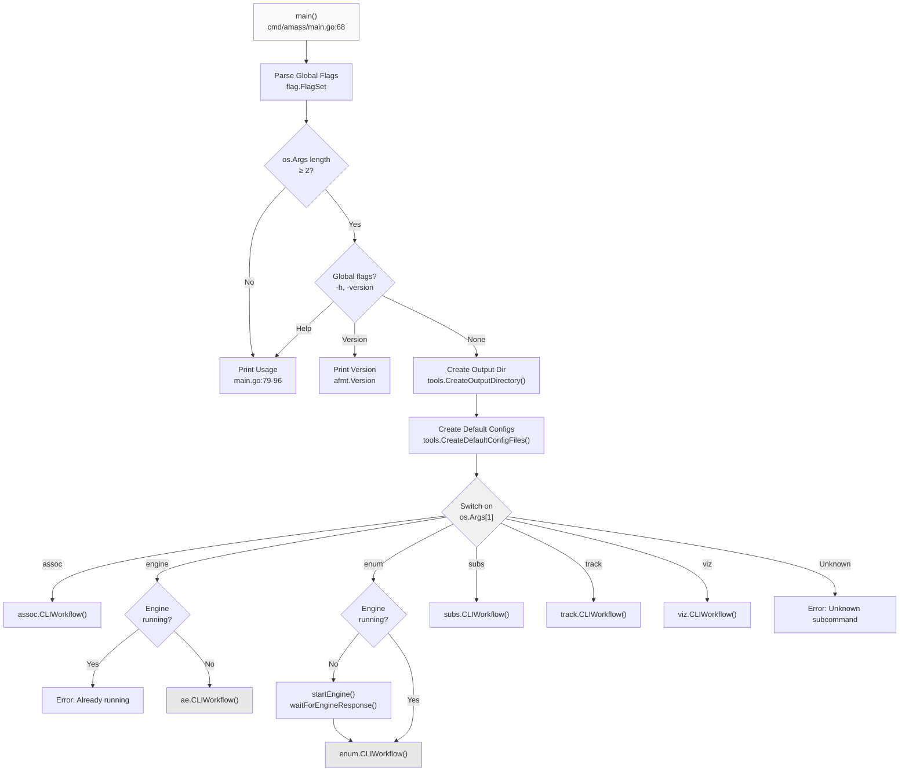
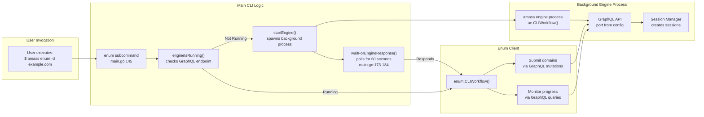
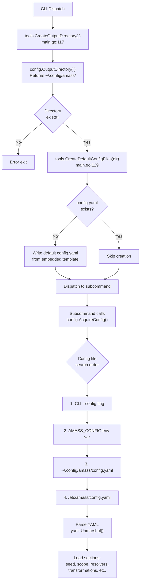
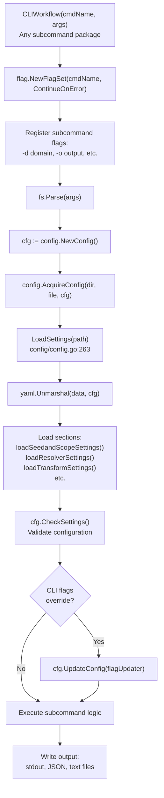
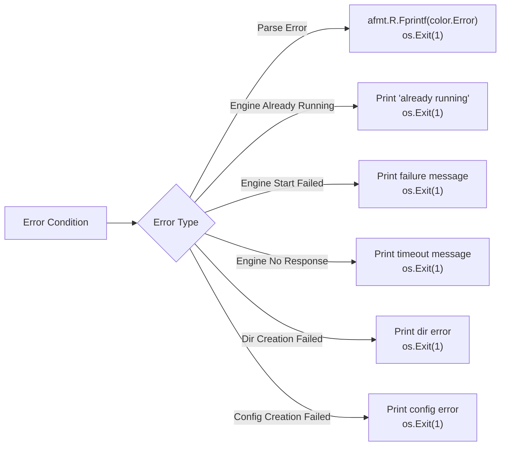

# Command-Line Interface

# Command-Line Interface

<details>
<summary>Relevant source files</summary>

The following files were used as context for generating this wiki page:

- [README.md](README.md)
- [cmd/amass/main.go](cmd/amass/main.go)
- [config/config.go](config/config.go)

</details>


The Command-Line Interface (CLI) is the primary user-facing component of OWASP Amass, providing access to reconnaissance operations and data analysis tools. This page documents the main `amass` command, its subcommand routing architecture, and the specialized OAM (Open Asset Model) analysis tools.

For information about the underlying engine that powers enumeration, see [Engine Core](#4). For details about configuration files and settings, see [Configuration System](#3.3). For information about specific OAM analysis tools, see [OAM Analysis Tools](#3.2).

## CLI Overview and Entry Point

The main CLI entry point is located in [cmd/amass/main.go](). It implements a subcommand-based architecture where the `amass` binary dispatches to one of six specialized subcommands:

| Subcommand | Description | Code Entry Point |
|------------|-------------|------------------|
| `assoc` | Association graph traversal and queries | `assoc.CLIWorkflow()` |
| `engine` | Background reconnaissance engine service | `ae.CLIWorkflow()` |
| `enum` | Enumeration client for submitting domains | `enum.CLIWorkflow()` |
| `subs` | Subdomain summary with ASN information | `subs.CLIWorkflow()` |
| `track` | Track new assets discovered over time | `track.CLIWorkflow()` |
| `viz` | Generate graph visualizations | `viz.CLIWorkflow()` |

The main function performs three initialization tasks before dispatching to subcommands:
1. **Output directory creation** - Ensures `$HOME/.config/amass/` exists [cmd/amass/main.go:117-120]()
2. **Default config file generation** - Creates `config.yaml` if missing [cmd/amass/main.go:128-132]()
3. **Engine lifecycle management** - Starts `amass engine` if `amass enum` is invoked [cmd/amass/main.go:146-156]()

Sources: [cmd/amass/main.go:1-185](), [README.md:1-36]()

## Command Dispatch Architecture

The CLI uses Go's `flag` package to implement a two-stage argument parsing system. The first stage handles global flags (`-h`, `--help`, `-version`), and the second stage dispatches to subcommand-specific workflows.



**Diagram: Main CLI Command Dispatch Flow**

The dispatch logic at [cmd/amass/main.go:134-170]() uses a simple `switch` statement on `os.Args[1]`. Each case invokes a `CLIWorkflow()` function from the corresponding internal package. The `cmdName` parameter passed to each workflow includes both the binary name and subcommand for proper usage message display.

Sources: [cmd/amass/main.go:68-171]()

## Argument Structure and Flag Sets

The CLI defines a minimal `Args` struct for global flags:

```go
type Args struct {
    Help    bool
    Version bool
}
```

Global flag registration occurs at [cmd/amass/main.go:70-74](), creating a `flag.FlagSet` named "amass" with `ContinueOnError` mode. This allows the CLI to handle parsing errors gracefully and display custom usage messages. The flag set output is redirected to a buffer to prevent default flag package output from appearing.

The usage function at [cmd/amass/main.go:79-96]() displays:
1. ASCII art banner via `afmt.PrintBanner()`
2. Usage syntax: `amass [assoc|engine|enum|subs|track|viz] [options]`
3. Global flag descriptions
4. Subcommand table with descriptions
5. Discord invitation link

Sources: [cmd/amass/main.go:49-96]()

## Engine-Enum Client-Server Architecture

The `amass engine` and `amass enum` commands implement a client-server model where the engine runs as a persistent background service, and enum acts as a client that submits domains and monitors progress. This architecture enables multiple enumeration sessions to share a single engine instance.



**Diagram: Engine-Enum Client-Server Interaction**

The key functions managing this interaction are:

- **`engineIsRunning()`** - Attempts to query the GraphQL API endpoint to determine if the engine is responsive [cmd/amass/main.go]()
- **`startEngine()`** - Spawns `amass engine` as a detached background process [cmd/amass/main.go]()
- **`waitForEngineResponse()`** - Polls for engine availability with 1-second intervals for up to 60 seconds [cmd/amass/main.go:173-184]()

The engine-first requirement is enforced at [cmd/amass/main.go:146-157](). If the engine isn't running when `enum` is invoked, the CLI automatically starts it and waits for it to become responsive before proceeding with the enumeration workflow.

Sources: [cmd/amass/main.go:139-184]()

## Configuration Integration

The CLI integrates with the configuration system through a two-step initialization process that occurs before any subcommand executes:



**Diagram: Configuration Loading Hierarchy**

The configuration search order is defined in [config/config.go:346-368](). The `AcquireConfig()` function checks locations in priority order, using the first valid configuration file found. Constants for this system are defined at [config/config.go:32-37]():

```go
outputDirName  = "amass"
defaultCfgFile = "config.yaml"
cfgEnvironVar  = "AMASS_CONFIG"
systemCfgDir   = "/etc"
```

Each subcommand receives the configuration through its `CLIWorkflow()` function, which typically accepts a `*config.Config` parameter. The config struct contains settings for scope, resolvers, data sources, transformations, and graph database connections.

Sources: [cmd/amass/main.go:117-132](), [config/config.go:32-37](), [config/config.go:346-368]()

## Subcommand Workflow Pattern

All subcommands follow a consistent workflow pattern implemented in their respective internal packages. Each `CLIWorkflow()` function:

1. **Defines subcommand-specific flags** - Creates a new `flag.FlagSet` with options relevant to that operation
2. **Parses arguments** - Processes `os.Args` passed from the main dispatcher
3. **Loads configuration** - Calls `config.AcquireConfig()` to populate a `Config` struct
4. **Validates settings** - Checks for incompatible options and missing required parameters
5. **Executes operation** - Performs the subcommand's primary function
6. **Outputs results** - Writes findings to stdout or files based on output flags



**Diagram: Standard Subcommand Workflow Pattern**

The `Config.LoadSettings()` method at [config/config.go:263-310]() orchestrates a series of loader functions that populate different configuration sections. Each loader handles a specific aspect:

| Loader Function | Purpose | Config Fields Populated |
|-----------------|---------|-------------------------|
| `loadSeedandScopeSettings()` | Parse domains, IPs, CIDRs | `Seed.Domains`, `Scope.CIDRs`, `Scope.ASNs` |
| `loadResolverSettings()` | Configure DNS resolvers | `Resolvers`, `TrustedResolvers`, `ResolversQPS` |
| `loadBruteForceSettings()` | Load wordlists | `Wordlist`, `BruteForcing`, `Recursive` |
| `loadAlterationSettings()` | Configure alterations | `Alterations`, `FlipWords`, `EditDistance` |
| `loadTransformSettings()` | Parse transformation rules | `Transformations` map |
| `loadDatabaseSettings()` | Graph database config | `GraphDBs` array |
| `loadEngineSettings()` | Engine API settings | `EngineAPI.URI`, `EngineAPI.Key` |
| `loadActiveSettings()` | Active recon settings | `Active` flag |
| `loadRigidSettings()` | Boundary rigidness | `Rigid` flag |

The configuration also supports environment variable overrides via `LoadDatabaseEnvSettings()` and `LoadEngineEnvSettings()` functions.

Sources: [config/config.go:263-310](), [config/config.go:1-455]()

## Output Directory and File Management

The CLI manages a consistent output directory structure across all subcommands. The `OutputDirectory()` function at [config/config.go:373-383]() determines the location:

```go
func OutputDirectory(dir ...string) string {
    if len(dir) > 0 && dir[0] != "" {
        return dir[0]  // Use provided directory
    }
    
    if path, err := os.UserConfigDir(); err == nil {
        return filepath.Join(path, outputDirName)  // ~/.config/amass/
    }
    
    return ""  // Fallback to empty string
}
```

The directory structure created by the CLI:

```
~/.config/amass/
├── config.yaml           # Main configuration file
├── datasrc_config.yaml   # Data source API keys
├── amass.log            # Engine log file
└── sessions/            # Per-enumeration session data
    └── <uuid>/
        ├── assets.db    # Graph database
        └── queue.db     # Work queue (SQLite)
```

Directory creation is performed by `tools.CreateOutputDirectory()` at [cmd/amass/main.go:117-120](), and default configuration file generation by `tools.CreateDefaultConfigFiles()` at [cmd/amass/main.go:128-132](). Both must succeed before subcommand dispatch proceeds.

Sources: [cmd/amass/main.go:117-132](), [config/config.go:373-383]()

## Error Handling and Exit Codes

The CLI uses Go's standard error handling patterns with explicit `os.Exit()` calls for fatal errors. Error messages are printed to stderr using the `afmt` (Amass format) package, which provides colored output:



**Diagram: CLI Error Handling Flow**

All error exits use code `1` to indicate failure. The `afmt.R.Fprintf()` function writes error messages in red to `color.Error` (which is stderr). Examples from [cmd/amass/main.go]():

- Line 104: Flag parsing errors
- Line 119: Output directory creation failures
- Line 131: Config file creation failures  
- Line 141: Engine already running error
- Line 149: Engine start failures
- Line 154: Engine response timeout
- Line 169: Unknown subcommand error

The `waitForEngineResponse()` function at [cmd/amass/main.go:173-184]() implements a 60-second timeout with 1-second polling intervals using a ticker:

```go
func waitForEngineResponse() error {
    t := time.NewTicker(time.Second)
    defer t.Stop()
    
    for range 60 {  // 60 iterations = 60 seconds
        <-t.C
        if engineIsRunning() {
            return nil
        }
    }
    return fmt.Errorf("the Amass engine did not respond within the timeout period")
}
```

Sources: [cmd/amass/main.go:102-184]()

## Banner and Version Display

The CLI displays an ASCII art banner for branding and version information. The banner is defined at [cmd/amass/main.go:7-22]() and displayed via `afmt.PrintBanner()`:

```
+----------------------------------------------------------------------------+
| ░░░░░░░░░░░░░░░░░░░░░░░░░░░░░  OWASP Amass  ░░░░░░░░░░░░░░░░░░░░░░░░░░░░░░ |
+----------------------------------------------------------------------------+
|      .+++:.            :                             .+++.                 |
|    +W@@@@@@8        &+W@#               o8W8:      +W@@@@@@#.   oW@@@W#+   |
|   &@#+   .o@##.    .@@@o@W.o@@o       :@@#&W8o    .@#:  .:oW+  .@#+++&#&   |
...
```

The `--version` flag at [cmd/amass/main.go:111-113]() prints the version string from `afmt.Version` and exits. This version is embedded at build time by the GoReleaser build pipeline.

The usage message includes a Discord invitation link defined in the `afmt` package, encouraging users to join the community for support rather than opening GitHub issues (as noted in [README.md:29]()).

Sources: [cmd/amass/main.go:7-22](), [cmd/amass/main.go:111-113](), [README.md:27-29]()