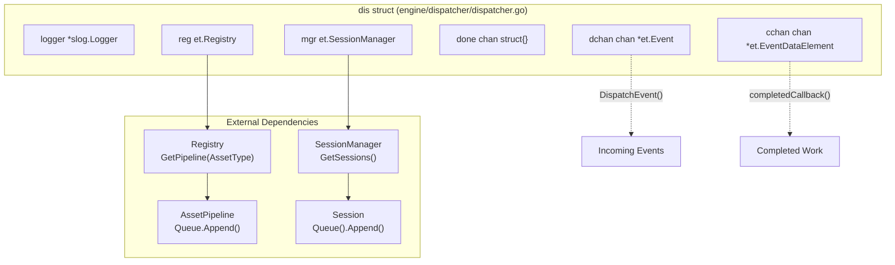
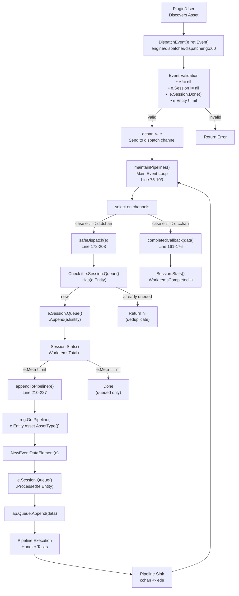
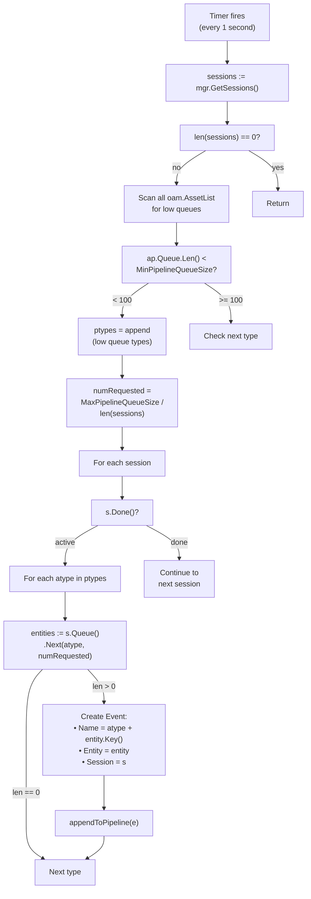
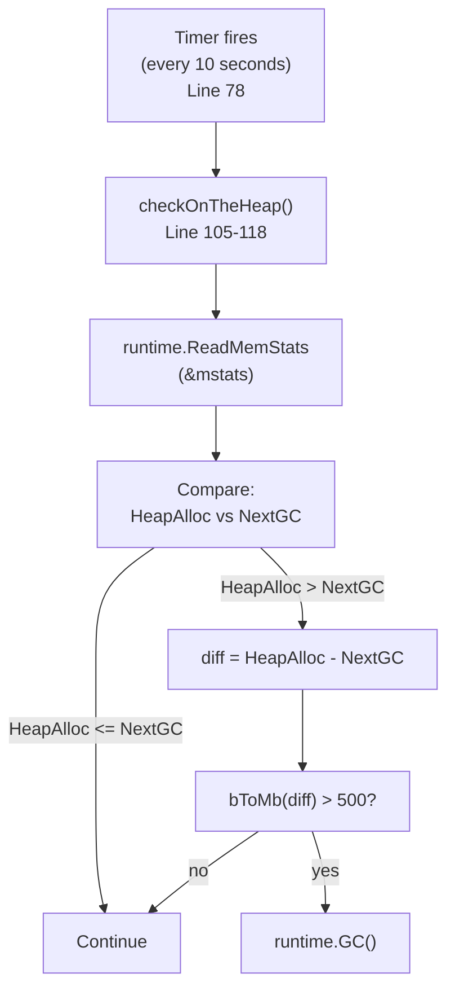
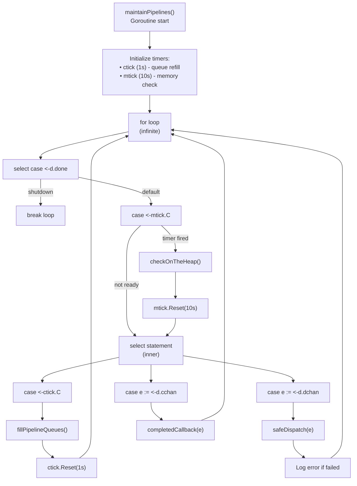
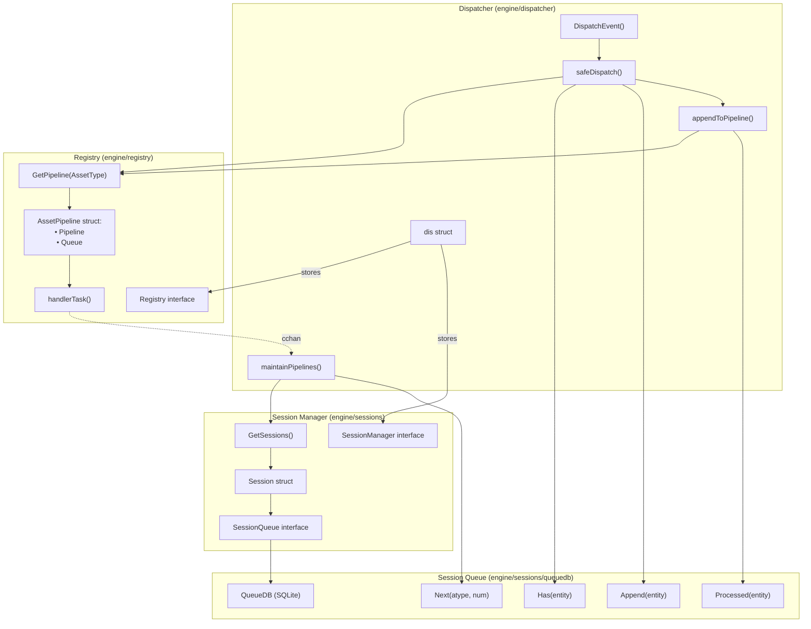

# Event Dispatcher

# Event Dispatcher

Relevant source files

The following files were used as context for generating this wiki page:

- [config/engineapi.go](config/engineapi.go)
- [config/graphdb.go](config/graphdb.go)
- [engine/api/graphql/client/client.go](engine/api/graphql/client/client.go)
- [engine/api/graphql/server/schema.resolvers.go](engine/api/graphql/server/schema.resolvers.go)
- [engine/dispatcher/dispatcher.go](engine/dispatcher/dispatcher.go)
- [engine/registry/pipelines.go](engine/registry/pipelines.go)
- [engine/sessions/manager.go](engine/sessions/manager.go)
- [engine/sessions/queue.go](engine/sessions/queue.go)
- [engine/sessions/queuedb/queue_db.go](engine/sessions/queuedb/queue_db.go)
- [engine/sessions/queuedb/queue_db_test.go](engine/sessions/queuedb/queue_db_test.go)
- [engine/sessions/session.go](engine/sessions/session.go)
- [engine/types/events.go](engine/types/events.go)
- [engine/types/registry.go](engine/types/registry.go)
- [engine/types/sessions.go](engine/types/sessions.go)

## Purpose and Scope

The Event Dispatcher is the central routing component of the Amass engine that manages the flow of events from discovery sources to asset processing pipelines. It coordinates between sessions, plugin handlers, and work queues to ensure events are processed in priority order while maintaining session isolation and resource efficiency.

For information about how plugins register handlers that the dispatcher routes to, see [Plugin Registry and Pipelines](#4.3). For information about session lifecycle and queue management, see [Session Management](#4.2).

**Sources:** [engine/dispatcher/dispatcher.go:1-228]()

## Overview

The Event Dispatcher implements the `et.Dispatcher` interface and serves as the orchestration hub for all asset discovery events in Amass. When a plugin discovers a new asset (e.g., a domain, IP address, or organization), it creates an `Event` and submits it to the dispatcher via `DispatchEvent()`. The dispatcher validates the event, adds it to the appropriate session's work queue, and ensures it flows through the correct asset pipeline based on its type.

The dispatcher operates asynchronously via a main event loop (`maintainPipelines()`) that continuously:
- Processes incoming events from the dispatch channel
- Refills asset pipeline queues from session work queues
- Handles completion callbacks from finished event processing
- Monitors memory usage and triggers garbage collection when needed

**Sources:** [engine/dispatcher/dispatcher.go:24-103](), [engine/types/events.go:14-30]()

## Architecture and Components

### Dispatcher Structure

The core dispatcher implementation is the `dis` struct, which contains all necessary components for event routing:

The `dis` struct fields serve specific purposes:
- `logger`: Logs errors and debugging information
- `reg`: References the plugin registry to retrieve asset pipelines
- `mgr`: References the session manager to access active sessions
- `done`: Signals shutdown to the maintenance goroutine
- `dchan`: Receives events submitted via `DispatchEvent()` (buffer size: `MinPipelineQueueSize` = 100)
- `cchan`: Receives completion notifications from pipeline sink functions (buffer size: `MinPipelineQueueSize` = 100)

**Sources:** [engine/dispatcher/dispatcher.go:24-31](), [engine/dispatcher/dispatcher.go:33-49]()

### Event and EventDataElement

Events flow through the dispatcher wrapped in two data structures:

| Structure | Purpose | Key Fields |
|-----------|---------|------------|
| `Event` | Represents a discovered asset ready for processing | `Name` (description), `Entity` (OAM asset), `Session` (owning session), `Dispatcher` (back-reference), `Meta` (additional data) |
| `EventDataElement` | Wraps events for pipeline execution with error tracking | `Event` (the event), `Error` (accumulated errors), `Queue` (completion callback channel) |

The transformation from `Event` to `EventDataElement` occurs in `appendToPipeline()` when events are added to asset pipeline queues.

**Sources:** [engine/types/events.go:14-56]()

## Event Flow Architecture

### Dispatch Path

**Key validation rules** enforced in `DispatchEvent()`:
1. Event must not be nil
2. Event must have an associated session
3. Session must not be terminated (`!e.Session.Done()`)
4. Event must have a valid entity with an asset

**Deduplication logic** in `safeDispatch()` prevents the same entity from being queued multiple times via `e.Session.Queue().Has(e.Entity)` check. If an entity is already in the queue, the event is silently dropped (returns nil without error).

**Conditional pipeline dispatch**: Events are only appended to pipelines if `e.Meta != nil`. This allows events to be queued for later processing without immediately executing handlers. When `e.Meta` is nil, the event is added to the session queue but not immediately dispatched to the pipeline.

**Sources:** [engine/dispatcher/dispatcher.go:60-73](), [engine/dispatcher/dispatcher.go:178-208](), [engine/dispatcher/dispatcher.go:210-227]()

## Pipeline Queue Management

### Fill Algorithm

The dispatcher automatically refills asset pipeline queues every second via `fillPipelineQueues()`:

**Queue thresholds:**
- **`MinPipelineQueueSize` = 100**: When a pipeline queue falls below this threshold, it triggers a refill
- **`MaxPipelineQueueSize` = 500**: Maximum items to distribute across all sessions per refill cycle
- **Request calculation**: `numRequested = MaxPipelineQueueSize / len(sessions)` ensures fair distribution across active sessions

**Load balancing:** The algorithm distributes pipeline queue slots evenly across all active sessions. For example, with 5 active sessions, each session can contribute up to 100 items per refill cycle (500 / 5).

**Type-based querying:** The dispatcher queries session queues by `oam.AssetType` (e.g., FQDN, IPAddress, Organization) to ensure proper routing to type-specific pipelines.

**Sources:** [engine/dispatcher/dispatcher.go:19-22](), [engine/dispatcher/dispatcher.go:124-159]()

## Completion Callbacks

### Callback Processing

When a pipeline completes processing an event, it flows through a sink function that sends the `EventDataElement` back to the dispatcher's completion channel:

```mermaid
graph LR
    PipelineTask["Pipeline Handler Task<br/>engine/registry/pipelines.go:99"]
    HandlerCallback["h.Callback(ede.Event)"]
    TaskReturn["Return data, error"]
    
    PipelineSink["Pipeline Sink Function<br/>engine/registry/pipelines.go:81"]
    ExtractEDE["Extract EventDataElement<br/>from pipeline.Data"]
    SendCompletion["ede.Queue <- ede<br/>(Send to cchan)"]
    
    MaintainLoop["maintainPipelines()<br/>select statement"]
    CaseReceive["case e := <-d.cchan"]
    CompletedCB["completedCallback(e)"]
    
    LogError["Log error if<br/>ede.Error != nil"]
    IncrementStats["stats.WorkItemsCompleted++"]
    
    PipelineTask --> HandlerCallback
    HandlerCallback --> TaskReturn
    TaskReturn --> PipelineSink
    
    PipelineSink --> ExtractEDE
    ExtractEDE --> SendCompletion
    
    SendCompletion --> MaintainLoop
    MaintainLoop --> CaseReceive
    CaseReceive --> CompletedCB
    
    CompletedCB --> LogError
    LogError --> IncrementStats
```

**Completion data flow:**
1. Pipeline handler executes `h.Callback(ede.Event)` in a task function
2. Handler may accumulate errors in `ede.Error` via `multierror.Append()`
3. Pipeline sink extracts `EventDataElement` and sends it to `ede.Queue` (which points to dispatcher's `cchan`)
4. Dispatcher's main loop receives on `d.cchan` and calls `completedCallback()`

**Statistics tracking:** Each completion increments `Session.Stats().WorkItemsCompleted`. This is paired with the increment of `WorkItemsTotal` in `safeDispatch()`, allowing clients to monitor progress via the GraphQL API query `sessionStats()`.

**Error logging:** If `ede.Error` is not nil, it's logged with the event name for debugging. Errors are accumulated by handlers using the `multierror` library, allowing multiple handler failures to be tracked for a single event.

**Sources:** [engine/dispatcher/dispatcher.go:161-176](), [engine/registry/pipelines.go:81-91](), [engine/registry/pipelines.go:99-138]()

## Memory Management

### Garbage Collection Strategy

The dispatcher monitors heap memory every 10 seconds and triggers garbage collection when necessary:

**Threshold logic:**
- **Condition 1:** `HeapAlloc > NextGC` (heap has exceeded the next GC target)
- **Condition 2:** `(HeapAlloc - NextGC) > 500 MB` (difference exceeds 500 MB threshold)

This prevents excessive GC cycles while ensuring memory doesn't grow unbounded during large enumeration sessions with hundreds of thousands of events.

**Timing:**
- Memory check: every 10 seconds
- Pipeline queue refill: every 1 second
- These are managed by separate `time.Timer` instances in the `maintainPipelines()` select loop

**Sources:** [engine/dispatcher/dispatcher.go:75-118]()

## Main Event Loop

### maintainPipelines() Structure

The dispatcher's main loop implements a multiplexed event processing model:

**Nested select pattern:** The loop uses two nested select statements:
1. **Outer select:** Checks shutdown signal and memory timer (non-blocking with `default` case)
2. **Inner select:** Multiplexes between queue refill timer, dispatch channel, and completion channel

This structure ensures:
- Shutdown is checked on every iteration
- Memory management runs at lower frequency (10s)
- Event dispatch and completion callbacks are processed immediately when available
- Queue refills occur regularly but don't block other operations

**Graceful shutdown:** When `d.done` channel is closed via `Shutdown()`, the loop breaks cleanly, allowing the goroutine to terminate.

**Sources:** [engine/dispatcher/dispatcher.go:75-103](), [engine/dispatcher/dispatcher.go:51-58]()

## Integration with Registry and Sessions

### Component Interaction

**Registry dependency:** The dispatcher uses `reg.GetPipeline(atype)` to retrieve the appropriate asset pipeline for each event type. The registry is responsible for building pipelines from registered plugin handlers.

**Session Manager dependency:** The dispatcher uses `mgr.GetSessions()` to iterate over all active sessions during queue refills. This allows fair distribution of processing across multiple concurrent enumeration sessions.

**Session Queue interaction:** The dispatcher interfaces with session queues through the `SessionQueue` interface, which abstracts the underlying SQLite-based `QueueDB` implementation. Key operations:
- **`Has()`:** Check if entity is already queued (deduplication)
- **`Append()`:** Add new entity to session's work queue
- **`Next()`:** Retrieve entities for pipeline processing
- **`Processed()`:** Mark entity as being processed

**Data isolation:** Each session maintains its own queue database file in its temporary directory, ensuring work items are isolated between sessions.

**Sources:** [engine/dispatcher/dispatcher.go:24-31](), [engine/types/sessions.go:38-46](), [engine/sessions/queuedb/queue_db.go:16-116]()

## Error Handling

The dispatcher implements multiple layers of error handling:

| Layer | Mechanism | Example |
|-------|-----------|---------|
| **API Validation** | Return errors from `DispatchEvent()` | `errors.New("the event is nil")` |
| **Internal Logging** | Log errors without stopping | `d.logger.Error(fmt.Sprintf("Failed to dispatch event: %s", err.Error()))` |
| **Pipeline Errors** | Accumulate in `EventDataElement.Error` | `ede.Error = multierror.Append(ede.Error, err)` |
| **Session Logging** | Log via session logger | `ede.Event.Session.Log().WithGroup("event").Error(err.Error())` |

**Non-blocking error handling:** Most errors in `maintainPipelines()` are logged but don't stop the dispatcher. This ensures that one problematic event doesn't halt the entire enumeration.

**Error propagation:** Handler errors are accumulated in `EventDataElement.Error` and eventually logged via `completedCallback()`, providing visibility into plugin failures while maintaining system resilience.

**Sources:** [engine/dispatcher/dispatcher.go:60-73](), [engine/dispatcher/dispatcher.go:96-98](), [engine/dispatcher/dispatcher.go:161-176]()