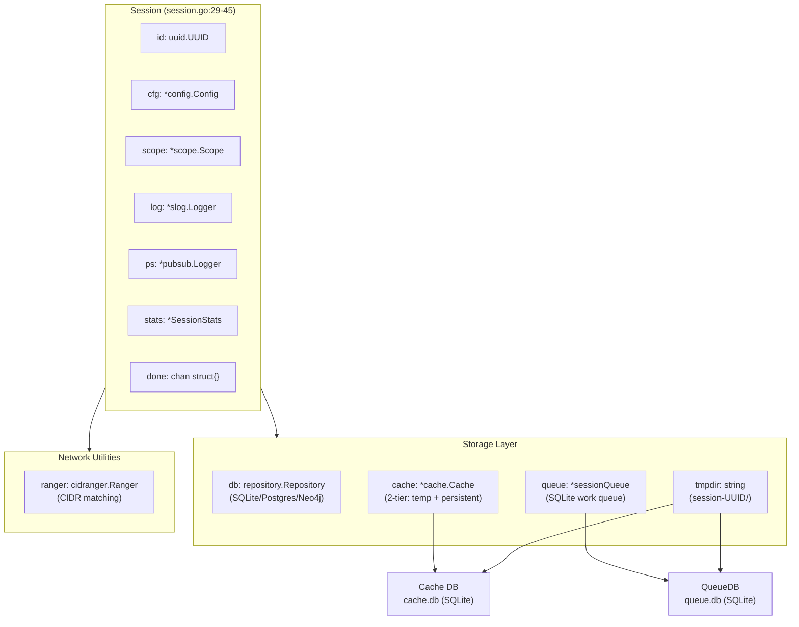
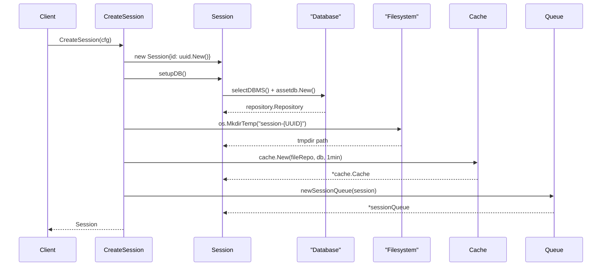
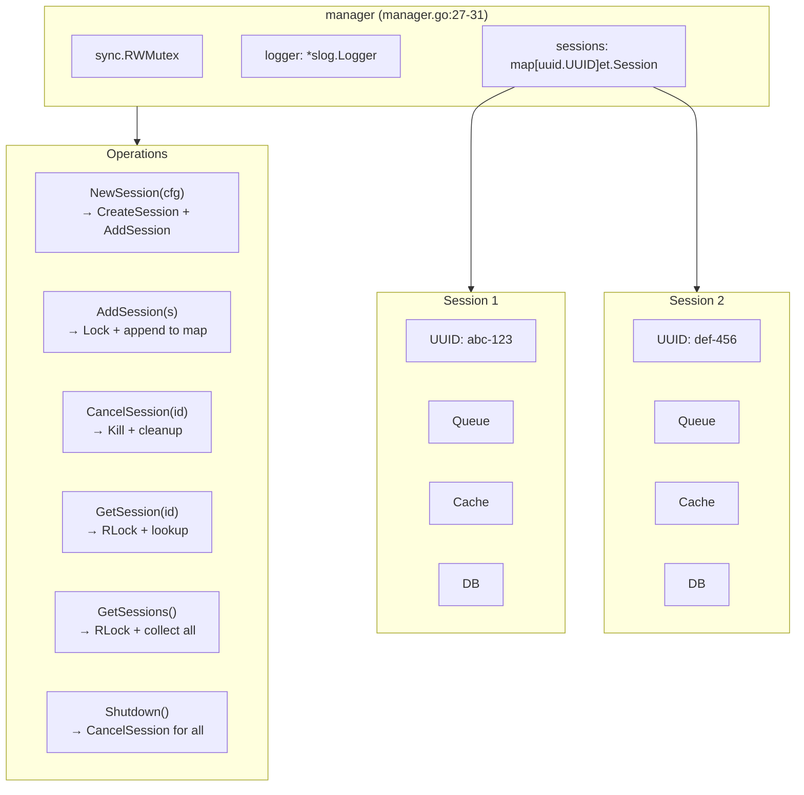
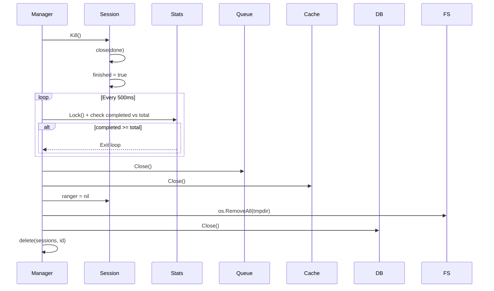
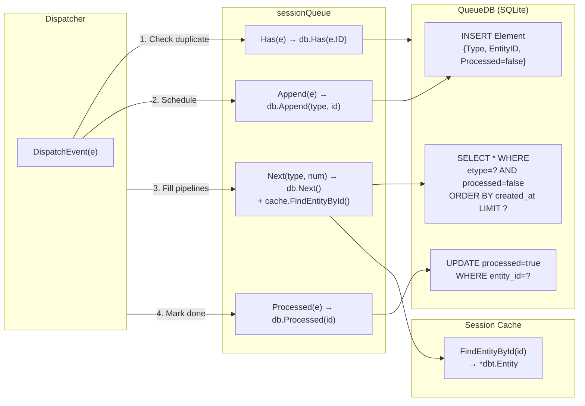
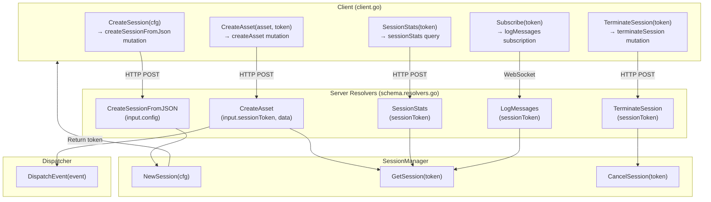
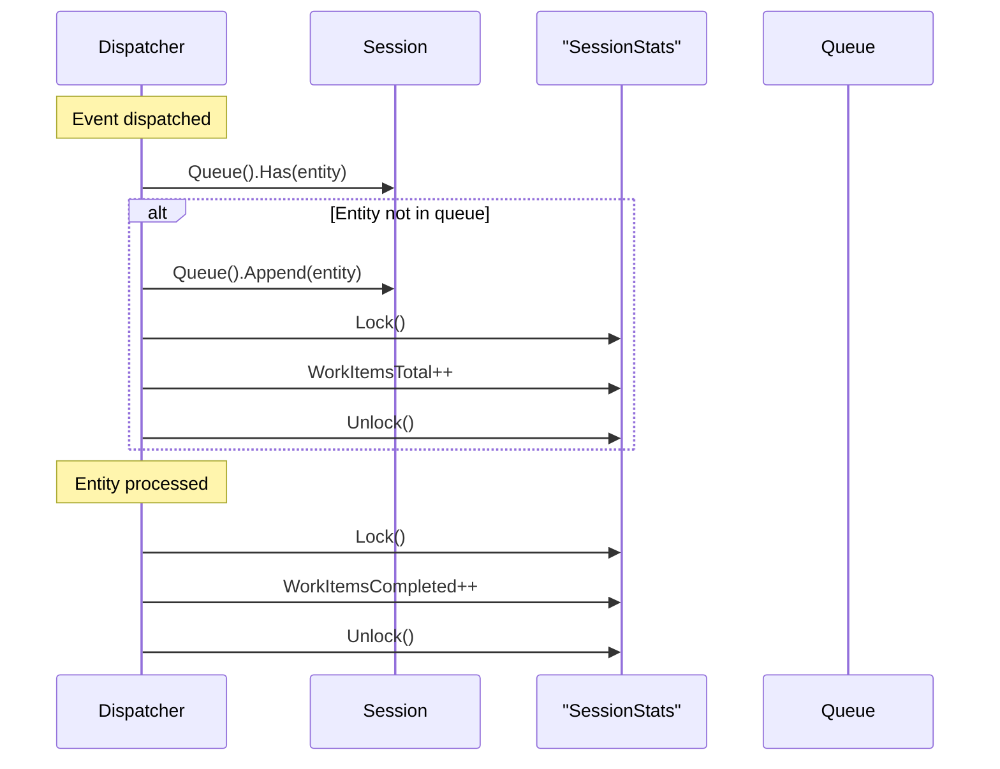
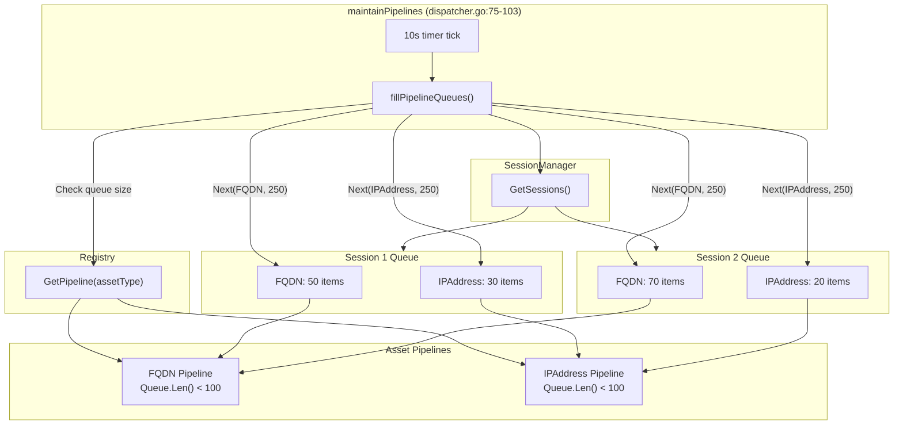

# Session Management

# Session Management

<details>
<summary>Relevant source files</summary>

The following files were used as context for generating this wiki page:

- [config/engineapi.go](config/engineapi.go)
- [config/graphdb.go](config/graphdb.go)
- [engine/api/graphql/client/client.go](engine/api/graphql/client/client.go)
- [engine/api/graphql/server/schema.resolvers.go](engine/api/graphql/server/schema.resolvers.go)
- [engine/dispatcher/dispatcher.go](engine/dispatcher/dispatcher.go)
- [engine/registry/pipelines.go](engine/registry/pipelines.go)
- [engine/sessions/manager.go](engine/sessions/manager.go)
- [engine/sessions/queue.go](engine/sessions/queue.go)
- [engine/sessions/queuedb/queue_db.go](engine/sessions/queuedb/queue_db.go)
- [engine/sessions/queuedb/queue_db_test.go](engine/sessions/queuedb/queue_db_test.go)
- [engine/sessions/session.go](engine/sessions/session.go)
- [engine/types/events.go](engine/types/events.go)
- [engine/types/registry.go](engine/types/registry.go)
- [engine/types/sessions.go](engine/types/sessions.go)

</details>


## Purpose and Scope

This document describes the session management system in OWASP Amass, which maintains the state of active enumeration sessions. A **Session** represents a single enumeration operation with its own configuration, database connections, work queue, and statistics. The **SessionManager** coordinates multiple concurrent sessions in a thread-safe manner.

For information about how sessions interact with the event dispatching system, see [Event Dispatcher](#4.1). For details on the plugin registry that sessions utilize, see [Plugin Registry and Pipelines](#4.3). For configuration details, see [Configuration System](#3.3).

## Session Object

The `Session` struct [engine/sessions/session.go:29-45]() represents the state of an active engine enumeration. Each session is uniquely identified by a UUID and contains all necessary components to execute an independent enumeration operation.

### Core Components

| Component | Type | Purpose |
|-----------|------|---------|
| `id` | `uuid.UUID` | Unique identifier for the session |
| `log` | `*slog.Logger` | Structured JSON logger for session events |
| `ps` | `*pubsub.Logger` | Publish-subscribe logger for GraphQL subscriptions |
| `cfg` | `*config.Config` | Session configuration including scope and transformations |
| `scope` | `*scope.Scope` | Determines which assets are in-scope for enumeration |
| `db` | `repository.Repository` | Primary database connection (SQLite, Postgres, or Neo4j) |
| `cache` | `*cache.Cache` | Two-tier cache with temporary and persistent storage |
| `queue` | `*sessionQueue` | Work queue backed by SQLite database |
| `ranger` | `cidranger.Ranger` | CIDR range manager for IP address matching |
| `tmpdir` | `string` | Temporary directory for session-specific files |
| `stats` | `*et.SessionStats` | Work item counters (completed vs total) |
| `done` | `chan struct{}` | Signals session termination |
| `finished` | `bool` | Indicates if session has been terminated |

**Session Component Architecture**



Sources: [engine/sessions/session.go:29-45](), [engine/types/sessions.go:23-37]()

### Session Lifecycle

Sessions are created via the `CreateSession` function [engine/sessions/session.go:49-95](), which performs the following initialization sequence:

1. **Configuration Validation**: Uses provided config or creates default [engine/sessions/session.go:50-53]()
2. **Session Object Creation**: Generates UUID, initializes scope, ranger, and stats [engine/sessions/session.go:55-64]()
3. **Database Setup**: Determines primary database from config and establishes connection [engine/sessions/session.go:66-69]()
4. **Temporary Directory**: Creates `session-{UUID}` directory in output path [engine/sessions/session.go:71-74]()
5. **Cache Initialization**: Creates file-based cache repository with 1-minute TTL [engine/sessions/session.go:76-84]()
6. **Queue Creation**: Initializes SQLite-backed work queue [engine/sessions/session.go:86-89]()

**Session Creation Flow**



Sources: [engine/sessions/session.go:49-95](), [engine/sessions/session.go:155-220](), [engine/sessions/queue.go:21-33]()

### Database Selection

The `selectDBMS` method [engine/sessions/session.go:162-220]() determines which database to use based on the `GraphDBs` configuration. It supports three database systems:

| System | DSN Format | Default Pragmas |
|--------|-----------|-----------------|
| **SQLite** | `{output_dir}/assetdb.db?_pragma=...` | `busy_timeout(30000)`, `journal_mode(WAL)` |
| **Postgres** | `host={host} port={port} user={user} password={pass} dbname={db}` | None |
| **Neo4j** | `{url}` (bolt:// or neo4j://) | None |

If no primary database is specified, SQLite is used by default [engine/sessions/session.go:164-171]().

Sources: [engine/sessions/session.go:162-220](), [config/graphdb.go:14-25]()

### Session Interface Methods

The Session implements the `et.Session` interface [engine/types/sessions.go:23-37]() with the following accessor methods:

```go
ID() uuid.UUID              // Returns session UUID
Log() *slog.Logger          // Returns structured logger
PubSub() *pubsub.Logger     // Returns pub/sub logger for GraphQL
Config() *config.Config     // Returns session configuration
Scope() *scope.Scope        // Returns scope filter
DB() repository.Repository  // Returns primary database
Cache() *cache.Cache        // Returns two-tier cache
Queue() SessionQueue        // Returns work queue
CIDRanger() cidranger.Ranger // Returns CIDR range matcher
TmpDir() string             // Returns temporary directory path
Stats() *SessionStats       // Returns work item statistics
Done() bool                 // Returns true if session terminated
Kill()                      // Terminates the session
```

Sources: [engine/sessions/session.go:97-153](), [engine/types/sessions.go:23-37]()

## Session Manager

The `manager` struct [engine/sessions/manager.go:27-31]() is a singleton that manages the lifecycle of all active sessions. It provides thread-safe operations using a `sync.RWMutex` and maintains a map of session UUIDs to Session objects.

**SessionManager Architecture**



Sources: [engine/sessions/manager.go:27-39](), [engine/types/sessions.go:54-61]()

### Session Creation and Registration

The `NewSession` method [engine/sessions/manager.go:41-51]() creates a new session and automatically registers it with the manager:

1. Calls `CreateSession(cfg)` to initialize the Session object
2. Calls `AddSession(s)` to add it to the internal map
3. Returns the Session if successful

The `AddSession` method [engine/sessions/manager.go:54-67]() performs thread-safe registration using a write lock.

Sources: [engine/sessions/manager.go:41-67]()

### Session Termination

The `CancelSession` method [engine/sessions/manager.go:70-114]() performs graceful termination:

1. **Signal Termination**: Calls `s.Kill()` to close the `done` channel [engine/sessions/manager.go:75]()
2. **Wait for Completion**: Polls session stats every 500ms until all work items are completed [engine/sessions/manager.go:77-89]()
3. **Cleanup Resources**: 
   - Closes the work queue database [engine/sessions/manager.go:94-97]()
   - Closes the cache [engine/sessions/manager.go:99-101]()
   - Nullifies the CIDR ranger [engine/sessions/manager.go:102-104]()
   - Removes temporary directory [engine/sessions/manager.go:105-107]()
   - Closes the primary database [engine/sessions/manager.go:108-111]()
4. **Remove from Map**: Deletes the session from the manager's map [engine/sessions/manager.go:113]()

**Session Termination Sequence**



Sources: [engine/sessions/manager.go:70-114](), [engine/sessions/session.go:145-153]()

### Session Retrieval

The manager provides two methods for retrieving sessions:

- `GetSession(id uuid.UUID)` [engine/sessions/manager.go:129-137](): Returns a specific session by UUID using a read lock
- `GetSessions()` [engine/sessions/manager.go:116-126](): Returns all active sessions as a slice using a read lock

Sources: [engine/sessions/manager.go:116-137]()

### Manager Shutdown

The `Shutdown` method [engine/sessions/manager.go:140-159]() terminates all active sessions concurrently:

1. Collects all session UUIDs under write lock
2. Spawns a goroutine for each session
3. Calls `CancelSession` for each UUID
4. Uses `sync.WaitGroup` to wait for all terminations to complete

Sources: [engine/sessions/manager.go:140-159]()

## Session Queue

Each session maintains a work queue backed by a SQLite database, managed by the `sessionQueue` wrapper [engine/sessions/queue.go:16-19]() and the underlying `QueueDB` implementation [engine/sessions/queuedb/queue_db.go:16-18]().

### Queue Database Schema

The queue uses GORM with a single `Element` table [engine/sessions/queuedb/queue_db.go:20-27]():

| Field | Type | Indexes | Purpose |
|-------|------|---------|---------|
| `ID` | `uint64` | Primary Key | Auto-incrementing identifier |
| `CreatedAt` | `time.Time` | `idx_created_at` (ASC) | Timestamp for FIFO ordering |
| `UpdatedAt` | `time.Time` | None | Last modification time |
| `Type` | `string` | `idx_etype` | Asset type (FQDN, IPAddress, etc.) |
| `EntityID` | `string` | `idx_entity_id` (Unique) | Entity UUID from cache |
| `Processed` | `bool` | `idx_processed` | Whether entity has been processed |

The database is configured with WAL mode and a 30-second busy timeout [engine/sessions/queuedb/queue_db.go:30](), with a single connection (MaxOpenConns=1, MaxIdleConns=1) [engine/sessions/queuedb/queue_db.go:45-48]().

Sources: [engine/sessions/queuedb/queue_db.go:16-56]()

### Queue Operations

**Work Queue Flow**



Sources: [engine/sessions/queue.go:39-95](), [engine/sessions/queuedb/queue_db.go:69-104]()

#### Has(e *dbt.Entity)

Checks if an entity is already in the queue [engine/sessions/queue.go:39-44]():
- Returns `false` if entity is nil or has empty ID
- Queries `QueueDB.Has(e.ID)` which counts matching records [engine/sessions/queuedb/queue_db.go:69-78]()

#### Append(e *dbt.Entity)

Adds a new work item to the queue [engine/sessions/queue.go:46-62]():
- Validates entity, ID, asset, and asset type are not nil/empty
- Calls `QueueDB.Append(atype, eid)` to insert element [engine/sessions/queuedb/queue_db.go:80-86]()
- Sets `Processed=false` on insertion

#### Next(atype oam.AssetType, num int)

Retrieves unprocessed entities of a specific type [engine/sessions/queue.go:64-81]():
1. Queries `QueueDB.Next(atype, num)` which returns entity IDs ordered by `created_at` [engine/sessions/queuedb/queue_db.go:88-100]()
2. For each ID, retrieves full entity from cache via `cache.FindEntityById(id)` [engine/sessions/queue.go:71-75]()
3. Returns slice of entities or error if none found

#### Processed(e *dbt.Entity)

Marks an entity as processed [engine/sessions/queue.go:83-88]():
- Updates the `processed` column to `true` [engine/sessions/queuedb/queue_db.go:102-104]()
- Called by dispatcher after entity is successfully processed

#### Delete(e *dbt.Entity)

Removes an entity from the queue [engine/sessions/queue.go:90-95]():
- Finds the element and deletes it [engine/sessions/queuedb/queue_db.go:106-115]()

Sources: [engine/sessions/queue.go:39-95](), [engine/sessions/queuedb/queue_db.go:69-115]()

## GraphQL API Integration

Sessions are exposed via a GraphQL API [engine/api/graphql/server/schema.resolvers.go]() that enables remote enumeration control. The API follows a client-server architecture where `amass enum` acts as a client and `amass engine` runs the server.

### API Operations

**GraphQL Session API**



Sources: [engine/api/graphql/server/schema.resolvers.go:36-172](), [engine/api/graphql/client/client.go:28-228]()

### Session Creation

Two mutations create sessions:

**createSession** (deprecated) [engine/api/graphql/server/schema.resolvers.go:36-42]():
- Returns a placeholder token
- Not fully implemented

**createSessionFromJson** [engine/api/graphql/server/schema.resolvers.go:44-62]():
1. Unmarshals JSON config string into `config.Config`
2. Populates transformation FROM/TO fields by splitting keys [engine/api/graphql/server/schema.resolvers.go:52-54]()
3. Calls `r.Manager.NewSession(&config)` [engine/api/graphql/server/schema.resolvers.go:56]()
4. Returns session UUID as string token

Example GraphQL mutation:
```graphql
mutation {
  createSessionFromJson(input: {config: "{\"scope\":{\"domains\":[\"example.com\"]}}"}) {
    sessionToken
  }
}
```

Sources: [engine/api/graphql/server/schema.resolvers.go:44-62](), [engine/api/graphql/client/client.go:66-99]()

### Asset Submission

**createAsset** mutation [engine/api/graphql/server/schema.resolvers.go:64-114]():
1. Parses and validates session token UUID [engine/api/graphql/server/schema.resolvers.go:67-76]()
2. Unmarshals asset data into `et.AssetData` using `createSeedAsset` helper [engine/api/graphql/server/schema.resolvers.go:78-94]()
3. Creates asset in session cache [engine/api/graphql/server/schema.resolvers.go:96-99]()
4. Constructs `et.Event` with dispatcher and session references [engine/api/graphql/server/schema.resolvers.go:102-107]()
5. Dispatches event for processing [engine/api/graphql/server/schema.resolvers.go:109-111]()

The `createSeedAsset` function [engine/api/graphql/server/schema.resolvers.go:187-233]() instantiates the appropriate OAM asset type (FQDN, IPAddress, Organization, etc.) based on the type string.

Sources: [engine/api/graphql/server/schema.resolvers.go:64-114](), [engine/api/graphql/server/schema.resolvers.go:187-233]()

### Session Termination

**terminateSession** mutation [engine/api/graphql/server/schema.resolvers.go:116-133]():
1. Validates session token and confirms session exists [engine/api/graphql/server/schema.resolvers.go:119-128]()
2. Asynchronously calls `r.Manager.CancelSession(token)` [engine/api/graphql/server/schema.resolvers.go:131]()
3. Returns `true` immediately without waiting for completion

Sources: [engine/api/graphql/server/schema.resolvers.go:116-133](), [engine/api/graphql/client/client.go:121-123]()

### Session Statistics

**sessionStats** query [engine/api/graphql/server/schema.resolvers.go:135-159]():
1. Validates session token [engine/api/graphql/server/schema.resolvers.go:138-147]()
2. Retrieves stats via `session.Stats()` [engine/api/graphql/server/schema.resolvers.go:149]()
3. Acquires lock and reads `WorkItemsCompleted` and `WorkItemsTotal` [engine/api/graphql/server/schema.resolvers.go:150-153]()
4. Returns as GraphQL object

Example query:
```graphql
query {
  sessionStats(sessionToken: "abc-123-def") {
    WorkItemsCompleted
    WorkItemsTotal
  }
}
```

Sources: [engine/api/graphql/server/schema.resolvers.go:135-159](), [engine/api/graphql/client/client.go:125-150]()

### Log Message Subscription

**logMessages** subscription [engine/api/graphql/server/schema.resolvers.go:161-172]():
1. Validates session token and retrieves session [engine/api/graphql/server/schema.resolvers.go:163-166]()
2. Subscribes to the session's `PubSub()` channel [engine/api/graphql/server/schema.resolvers.go:167-169]()
3. Returns channel for streaming log messages over WebSocket

The subscription uses the `pubsub.Logger` component [engine/sessions/session.go:32]() which publishes structured log output that clients can consume in real-time.

Sources: [engine/api/graphql/server/schema.resolvers.go:161-172](), [engine/api/graphql/client/client.go:153-199]()

## Session Statistics

The `SessionStats` struct [engine/types/sessions.go:48-52]() tracks enumeration progress with two counters:

| Field | Type | Purpose |
|-------|------|---------|
| `WorkItemsCompleted` | `int` | Number of entities processed by handlers |
| `WorkItemsTotal` | `int` | Total number of entities scheduled for processing |

Both fields are protected by an embedded `sync.Mutex` for thread-safe updates.

### Statistics Updates

**Dispatcher Integration**



**Increment WorkItemsTotal** [engine/dispatcher/dispatcher.go:195-199]():
- Called by `safeDispatch` when new entity is added to queue
- Only increments if entity is not already scheduled

**Increment WorkItemsCompleted** [engine/dispatcher/dispatcher.go:171-175]():
- Called by `completedCallback` when handler finishes processing
- Triggered regardless of success or error

Sources: [engine/dispatcher/dispatcher.go:161-208](), [engine/types/sessions.go:48-52]()

## Integration with Engine Core

Sessions are tightly integrated with the core engine components, particularly the Dispatcher.

### Event Validation

The Dispatcher validates every event against its associated session [engine/dispatcher/dispatcher.go:60-73]():

```go
// Event validation checks
if e == nil {
    return errors.New("the event is nil")
} else if e.Session == nil {
    return errors.New("the event has no associated session")
} else if e.Session.Done() {
    return errors.New("the associated session has been terminated")
} else if e.Entity == nil || e.Entity.Asset == nil {
    return errors.New("the event has no associated entity or asset")
}
```

This ensures no events are processed for terminated sessions.

Sources: [engine/dispatcher/dispatcher.go:60-73]()

### Pipeline Queue Filling

The Dispatcher's `fillPipelineQueues` method [engine/dispatcher/dispatcher.go:124-159]() periodically pulls work items from session queues:

1. Retrieves all active sessions from SessionManager [engine/dispatcher/dispatcher.go:125-128]()
2. Identifies pipelines with queue length below `MinPipelineQueueSize` (100) [engine/dispatcher/dispatcher.go:130-137]()
3. Calculates entities per session: `MaxPipelineQueueSize` (500) / session count [engine/dispatcher/dispatcher.go:139]()
4. For each session and asset type, calls `s.Queue().Next(atype, numRequested)` [engine/dispatcher/dispatcher.go:145]()
5. Creates `et.Event` objects and appends to pipelines [engine/dispatcher/dispatcher.go:147-154]()

This mechanism ensures pipelines remain fed with work from all active sessions proportionally.

**Pipeline Queue Filling Flow**



Sources: [engine/dispatcher/dispatcher.go:124-159](), [engine/dispatcher/dispatcher.go:75-103]()

### Session Done Handling

Throughout the system, components check `session.Done()` to avoid processing work for terminated sessions:

- **Dispatcher**: Rejects events from terminated sessions [engine/dispatcher/dispatcher.go:65-66]()
- **Pipeline handlers**: Exit early if session is done [engine/registry/pipelines.go:114-117]()
- **PipelineQueue**: Filters out elements from terminated sessions [engine/types/registry.go:86-88]()

This ensures graceful termination without errors from in-flight operations.

Sources: [engine/dispatcher/dispatcher.go:65-66](), [engine/registry/pipelines.go:114-117](), [engine/types/registry.go:86-88]()