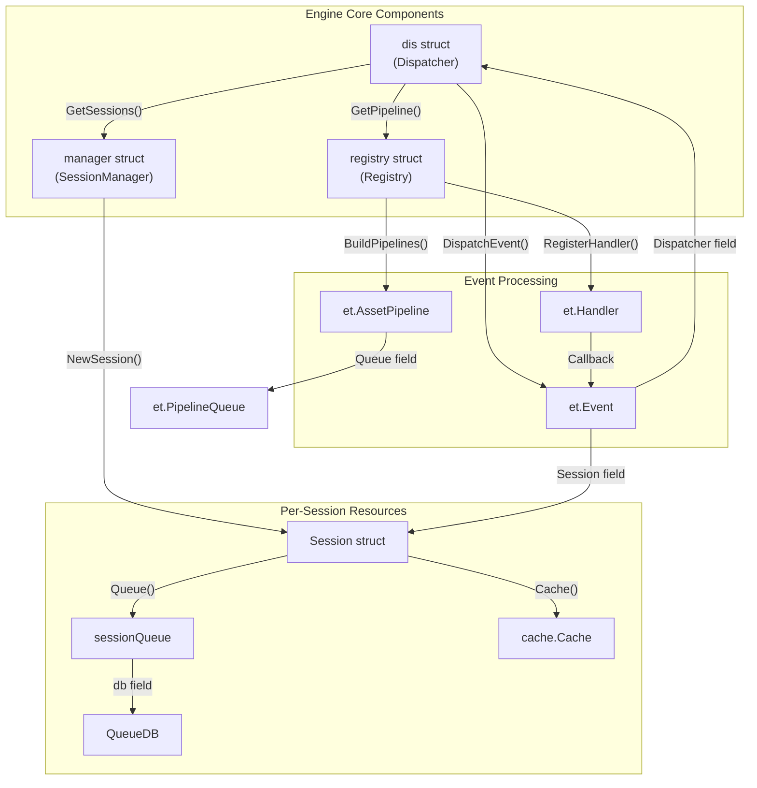
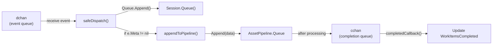
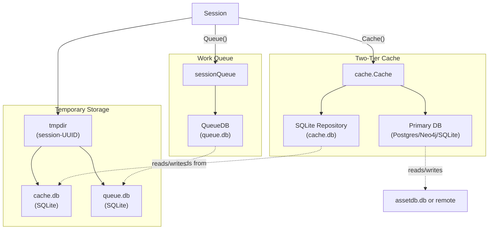
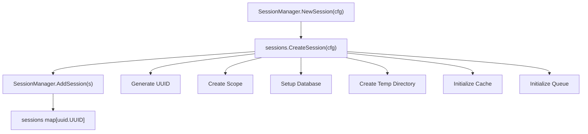
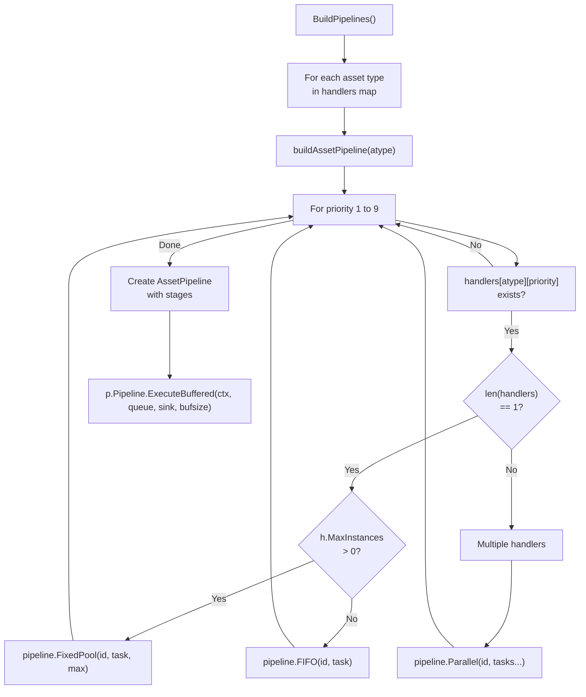
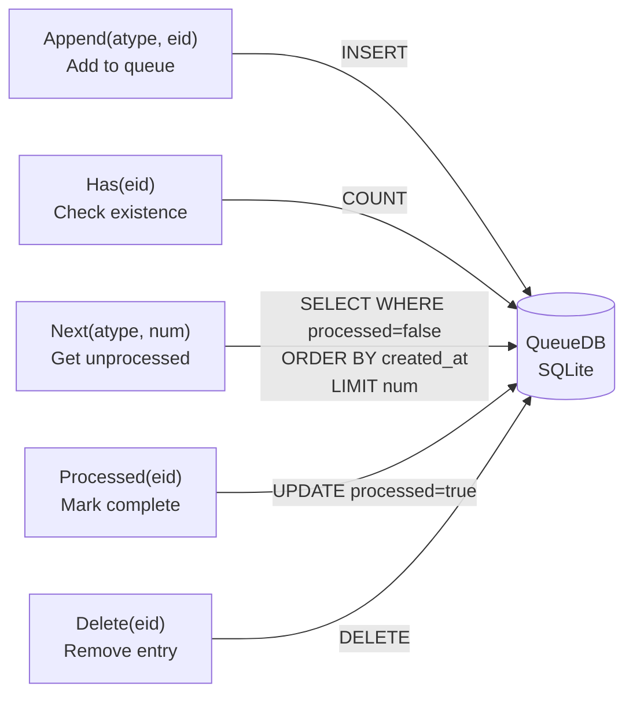
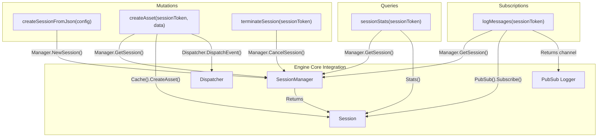

# Engine Core

# Engine Core

<details>
<summary>Relevant source files</summary>

The following files were used as context for generating this wiki page:

- [config/engineapi.go](config/engineapi.go)
- [config/graphdb.go](config/graphdb.go)
- [engine/api/graphql/client/client.go](engine/api/graphql/client/client.go)
- [engine/api/graphql/server/schema.resolvers.go](engine/api/graphql/server/schema.resolvers.go)
- [engine/dispatcher/dispatcher.go](engine/dispatcher/dispatcher.go)
- [engine/registry/pipelines.go](engine/registry/pipelines.go)
- [engine/sessions/manager.go](engine/sessions/manager.go)
- [engine/sessions/queue.go](engine/sessions/queue.go)
- [engine/sessions/queuedb/queue_db.go](engine/sessions/queuedb/queue_db.go)
- [engine/sessions/queuedb/queue_db_test.go](engine/sessions/queuedb/queue_db_test.go)
- [engine/sessions/session.go](engine/sessions/session.go)
- [engine/types/events.go](engine/types/events.go)
- [engine/types/registry.go](engine/types/registry.go)
- [engine/types/sessions.go](engine/types/sessions.go)

</details>


The Engine Core is the orchestration layer that manages the lifecycle of enumeration sessions, dispatches events to plugins, and coordinates the overall discovery process. It consists of three primary components: the **Dispatcher** (event routing), the **SessionManager** (session lifecycle management), and the **Registry** (plugin management and pipeline construction). These components work together to enable Amass's event-driven architecture where discovered assets trigger cascading plugin executions.

For information about individual plugins and their discovery mechanisms, see [Plugin System](#6). For details about the event-driven processing model and data flow, see [Data Flow and Processing Pipeline](#2.2).

## Core Components Overview

The Engine Core is implemented across several packages that define interfaces and concrete implementations. The primary types are defined in [engine/types/](). Three interfaces define the contracts:

| Interface | Purpose | Implementation Location |
|-----------|---------|------------------------|
| `et.Dispatcher` | Routes events to asset pipelines | [engine/dispatcher/dispatcher.go]() |
| `et.SessionManager` | Manages multiple concurrent sessions | [engine/sessions/manager.go]() |
| `et.Registry` | Registers plugins and builds pipelines | [engine/registry/]() |

**Component Interaction Diagram**



Sources: [engine/dispatcher/dispatcher.go:24-31](), [engine/sessions/manager.go:27-31](), [engine/sessions/session.go:29-45](), [engine/types/sessions.go:23-37](), [engine/types/registry.go:17-43]()

## Dispatcher

The Dispatcher is responsible for routing events to appropriate asset pipelines and managing the completion callbacks. It is implemented as the `dis` struct in [engine/dispatcher/dispatcher.go:24-31]().

### Dispatcher Structure

```go
type dis struct {
    logger *slog.Logger
    reg    et.Registry
    mgr    et.SessionManager
    done   chan struct{}
    dchan  chan *et.Event
    cchan  chan *et.EventDataElement
}
```

The `dchan` receives new events for dispatching, while `cchan` receives completed event data elements for callback processing. The Dispatcher maintains references to both the Registry (for pipeline lookups) and SessionManager (for pulling work from queues).

### Event Dispatching Flow

The `DispatchEvent()` method performs validation before queueing events:

1. Validates event is non-nil with associated session and entity [engine/dispatcher/dispatcher.go:60-73]()
2. Checks that the session has not been terminated
3. Queues the event to `dchan` for asynchronous processing

The `maintainPipelines()` goroutine processes events in a loop:



Sources: [engine/dispatcher/dispatcher.go:75-103](), [engine/dispatcher/dispatcher.go:178-208]()

### Queue Filling Mechanism

Every second, the Dispatcher proactively fills pipeline queues by pulling work from session queues [engine/dispatcher/dispatcher.go:124-159](). The `fillPipelineQueues()` method:

1. Iterates through all active sessions via `mgr.GetSessions()`
2. Identifies pipelines with queue length below `MinPipelineQueueSize` (100)
3. Requests up to `MaxPipelineQueueSize / len(sessions)` entities per session per asset type
4. Wraps each entity in an `et.Event` and appends to the appropriate pipeline

This mechanism ensures that pipelines have continuous work available without overwhelming memory. The constants are defined as:

| Constant | Value | Purpose |
|----------|-------|---------|
| `MinPipelineQueueSize` | 100 | Threshold to trigger queue refilling |
| `MaxPipelineQueueSize` | 500 | Maximum items distributed per fill cycle |

Sources: [engine/dispatcher/dispatcher.go:19-22](), [engine/dispatcher/dispatcher.go:124-159]()

### Memory Management

The Dispatcher includes a memory management mechanism that triggers manual garbage collection when heap allocation exceeds the next GC threshold by more than 500MB [engine/dispatcher/dispatcher.go:105-122]():

```go
func checkOnTheHeap() {
    var mstats runtime.MemStats
    runtime.ReadMemStats(&mstats)
    
    if diff := mstats.HeapAlloc - mstats.NextGC; bToMb(diff) > 500 {
        runtime.GC()
    }
}
```

This check runs every 10 seconds via the `mtick` timer in `maintainPipelines()`.

Sources: [engine/dispatcher/dispatcher.go:75-122]()

## Session Architecture

A Session represents a single enumeration execution with its own configuration, scope, database connections, and work queue. Sessions are isolated from each other, allowing multiple concurrent enumerations.

### Session Structure

The `Session` struct is defined in [engine/sessions/session.go:29-45]():

```go
type Session struct {
    id       uuid.UUID
    log      *slog.Logger
    ps       *pubsub.Logger
    cfg      *config.Config
    scope    *scope.Scope
    db       repository.Repository
    queue    *sessionQueue
    dsn      string
    dbtype   string
    cache    *cache.Cache
    ranger   cidranger.Ranger
    tmpdir   string
    stats    *et.SessionStats
    done     chan struct{}
    finished bool
}
```

**Session Resource Diagram**

```mermaid
graph TB
    Session["Session struct"]
    
    subgraph "Configuration & Identity"
        ID["id: uuid.UUID"]
        Config["cfg: *config.Config"]
        Scope["scope: *scope.Scope"]
    end
    
    subgraph "Logging & Communication"
        Logger["log: *slog.Logger"]
        PubSub["ps: *pubsub.Logger"]
    end
    
    subgraph "Storage Layer"
        DB["db: repository.Repository<br/>(Neo4j/Postgres/SQLite)"]
        Cache["cache: *cache.Cache"]
        DSN["dsn: string<br/>dbtype: string"]
    end
    
    subgraph "Work Management"
        Queue["queue: *sessionQueue"]
        TmpDir["tmpdir: string"]
        Stats["stats: *et.SessionStats"]
    end
    
    subgraph "Network Utilities"
        Ranger["ranger: cidranger.Ranger"]
    end
    
    subgraph "Lifecycle"
        Done["done: chan struct{}"]
        Finished["finished: bool"]
    end
    
    Session --> ID
    Session --> Config
    Session --> Scope
    Session --> Logger
    Session --> PubSub
    Session --> DB
    Session --> Cache
    Session --> DSN
    Session --> Queue
    Session --> TmpDir
    Session --> Stats
    Session --> Ranger
    Session --> Done
    Session --> Finished
```



Sources: [engine/sessions/session.go:29-45]()

### Session Initialization

The `CreateSession()` function in [engine/sessions/session.go:49-95]() initializes all session resources:

1. **UUID Generation**: Creates unique identifier via `uuid.New()`
2. **Scope Creation**: Builds scope from config via `scope.CreateFromConfigScope(cfg)`
3. **Database Setup**: Calls `setupDB()` which determines database type (SQLite/Postgres/Neo4j) from `cfg.GraphDBs`
4. **Temporary Directory**: Creates session-specific temp directory in output directory
5. **Cache Initialization**: Creates two-tier cache system with SQLite backing store
6. **Queue Creation**: Initializes `sessionQueue` with dedicated SQLite database

### Database Selection Logic

The `selectDBMS()` method in [engine/sessions/session.go:162-220]() processes the `GraphDBs` configuration to determine the primary database:

| Database System | DSN Format | Type Constant |
|-----------------|------------|---------------|
| `postgres` | `host=%s port=%s user=%s password=%s dbname=%s` | `sqlrepo.Postgres` |
| `sqlite`/`sqlite3` | `{outputdir}/assetdb.db?_pragma=...` | `sqlrepo.SQLite` |
| `neo4j`/`bolt` | Direct URL from config | `neo4j.Neo4j` |

The DSN includes SQLite pragmas for concurrency: `busy_timeout(30000)` and `journal_mode(WAL)`.

Sources: [engine/sessions/session.go:155-220]()

### Cache and Storage Architecture

Sessions maintain a two-tier storage architecture:



The cache is initialized in [engine/sessions/session.go:76-84]() with a 1-minute TTL:

```go
s.cache, err = cache.New(c, s.db, time.Minute)
```

This two-tier design allows fast access to recently used entities while persisting all discoveries to the primary database.

Sources: [engine/sessions/session.go:222-245](), [engine/sessions/session.go:236-245]()

### Session Statistics

The `et.SessionStats` struct tracks work progress [engine/types/sessions.go:48-52]():

```go
type SessionStats struct {
    sync.Mutex
    WorkItemsCompleted int
    WorkItemsTotal     int
}
```

Statistics are updated by the Dispatcher:
- `WorkItemsTotal` incremented when `DispatchEvent()` adds to queue [engine/dispatcher/dispatcher.go:194-199]()
- `WorkItemsCompleted` incremented by `completedCallback()` [engine/dispatcher/dispatcher.go:170-175]()

Sources: [engine/types/sessions.go:48-52](), [engine/dispatcher/dispatcher.go:161-176]()

## SessionManager

The SessionManager maintains a registry of active sessions and coordinates their lifecycle. It is implemented as the `manager` struct in [engine/sessions/manager.go:27-31]():

```go
type manager struct {
    sync.RWMutex
    logger   *slog.Logger
    sessions map[uuid.UUID]et.Session
}
```

### Session Lifecycle Operations

**Session Creation Flow**



Sources: [engine/sessions/manager.go:41-51]()

### Session Termination

The `CancelSession()` method performs graceful shutdown in [engine/sessions/manager.go:70-114]():

1. **Signal Termination**: Calls `session.Kill()` to close the `done` channel
2. **Wait for Completion**: Polls `SessionStats` until `WorkItemsCompleted >= WorkItemsTotal`
3. **Resource Cleanup**:
   - Close queue database via `Queue().Close()`
   - Close cache via `Cache().Close()`
   - Clear CIDR ranger reference
   - Remove temporary directory
   - Close primary database connection
   - Remove session from `sessions` map

The polling mechanism uses a 500ms ticker to avoid busy waiting:

```go
t := time.NewTicker(500 * time.Millisecond)
defer t.Stop()

for range t.C {
    ss := s.Stats()
    ss.Lock()
    total := ss.WorkItemsTotal
    completed := ss.WorkItemsCompleted
    ss.Unlock()
    if completed >= total {
        break
    }
}
```

Sources: [engine/sessions/manager.go:70-114]()

### Concurrent Session Management

The manager uses `sync.RWMutex` to allow concurrent read access while serializing writes:

| Operation | Lock Type | Purpose |
|-----------|-----------|---------|
| `AddSession()` | Write Lock | Add to `sessions` map |
| `GetSession()` | Read Lock | Lookup by UUID |
| `GetSessions()` | Read Lock | Return all sessions slice |
| `CancelSession()` | Write Lock (deferred) | Cleanup and delete |

The `Shutdown()` method cancels all sessions concurrently using `sync.WaitGroup` [engine/sessions/manager.go:140-159]().

Sources: [engine/sessions/manager.go:34-159]()

## Registry and Pipeline Building

The Registry manages plugin registration and constructs asset pipelines based on registered handlers. While the Registry implementation is in the `engine/registry/` package, the interfaces are defined in [engine/types/registry.go]().

### Handler Registration

Plugins register handlers via `Registry.RegisterHandler()`. Each `Handler` struct specifies [engine/types/registry.go:23-31]():

```go
type Handler struct {
    Plugin       Plugin
    Name         string
    Priority     int              // 1-9, lower = higher priority
    MaxInstances int              // 0 = unlimited
    EventType    oam.AssetType   // Asset type this handles
    Transforms   []string         // Transformation permissions
    Callback     func(*Event) error
}
```

**Handler Priority System**

| Priority Range | Typical Handlers | Execution Stage |
|----------------|------------------|-----------------|
| 1-3 | DNS TXT, CNAME, IP resolution | Initial discovery |
| 4-6 | Subdomain enumeration, Apex detection | Expansion |
| 7-9 | Enrichment, reverse DNS, service probing | Deep analysis |

Sources: [engine/types/registry.go:23-31]()

### Pipeline Construction

The `BuildPipelines()` method in [engine/registry/pipelines.go:19-31]() constructs a pipeline for each asset type that has registered handlers. The `buildAssetPipeline()` function in [engine/registry/pipelines.go:33-79]() creates pipelines as follows:

**Pipeline Building Algorithm**



The pipeline execution happens in a goroutine, continuously processing items from the `AssetPipeline.Queue`.

Sources: [engine/registry/pipelines.go:19-79]()

### Handler Task Wrapping

The `handlerTask()` function in [engine/registry/pipelines.go:93-139]() wraps handler callbacks with transformation filtering logic:

1. **Context Cancellation Check**: Returns early if context is done
2. **Session Termination Check**: Returns early if session is terminated
3. **Transformation Validation**: Checks if handler's plugin is allowed by config transformations
4. **Plugin Matching**: Verifies handler transforms are permitted for the asset type
5. **Callback Execution**: Invokes `h.Callback(event)` if all checks pass

The transformation filtering uses these helper functions:
- `transformationsByType()` - Gets transformations for asset type [engine/registry/pipelines.go:141-151]()
- `tosContainPlugin()` - Checks if plugin is explicitly listed [engine/registry/pipelines.go:153-160]()
- `allExcludesPlugin()` - Checks if plugin is in "all" exclude list [engine/registry/pipelines.go:162-182]()

Sources: [engine/registry/pipelines.go:93-182]()

### Pipeline Queue Interface

The `PipelineQueue` struct wraps `queue.Queue` and implements the `pipeline.InputSource` interface [engine/types/registry.go:45-96]():

```go
type PipelineQueue struct {
    queue.Queue
}

func (pq *PipelineQueue) Next(ctx context.Context) bool
func (pq *PipelineQueue) Data() pipeline.Data
func (pq *PipelineQueue) Error() error
```

The `Next()` method blocks until data is available or context is cancelled, checking:
- Current queue length
- 100ms ticker timeout
- Queue signal channel

The `Data()` method extracts `EventDataElement` instances and filters out events from terminated sessions.

Sources: [engine/types/registry.go:45-96]()

## Work Queue System

Each session maintains a dedicated work queue implemented as a SQLite database, tracking which entities have been queued for processing and which have completed.

### Queue Database Schema

The `QueueDB` uses GORM with a single table defined by the `Element` struct in [engine/sessions/queuedb/queue_db.go:20-27]():

```go
type Element struct {
    ID        uint64    `gorm:"primaryKey;column:id"`
    CreatedAt time.Time `gorm:"index:idx_created_at,sort:asc"`
    UpdatedAt time.Time
    Type      string    `gorm:"index:idx_etype;column:etype"`
    EntityID  string    `gorm:"index:idx_entity_id,unique;column:entity_id"`
    Processed bool      `gorm:"index:idx_processed;column:processed"`
}
```

**Indexes for Performance**

| Index | Purpose |
|-------|---------|
| `idx_created_at` | Ordered retrieval of oldest unprocessed items |
| `idx_etype` | Fast filtering by asset type |
| `idx_entity_id` | Unique constraint and fast lookups |
| `idx_processed` | Filtering processed vs unprocessed |

Sources: [engine/sessions/queuedb/queue_db.go:20-27]()

### Queue Operations

**Queue Operation Flow**



The `Next()` method in [engine/sessions/queuedb/queue_db.go:88-100]() queries:

```sql
SELECT * FROM elements 
WHERE etype = ? AND processed = ? 
ORDER BY created_at ASC 
LIMIT ?
```

This ensures FIFO processing within each asset type while allowing different asset types to be processed in parallel.

Sources: [engine/sessions/queuedb/queue_db.go:69-115]()

### SessionQueue Wrapper

The `sessionQueue` struct wraps `QueueDB` and implements `et.SessionQueue` interface [engine/sessions/queue.go:16-19]():

```go
type sessionQueue struct {
    session *Session
    db      *qdb.QueueDB
}
```

It bridges between the high-level `dbt.Entity` objects and the low-level queue database by:
1. Extracting entity IDs for storage
2. Retrieving entities from the session cache based on IDs returned by `Next()`
3. Validating entity structure before operations

The `Next()` implementation in [engine/sessions/queue.go:64-81]() performs cache lookups:

```go
func (sq *sessionQueue) Next(atype oam.AssetType, num int) ([]*dbt.Entity, error) {
    ids, err := sq.db.Next(atype, num)
    if err != nil {
        return nil, err
    }
    
    var results []*dbt.Entity
    for _, id := range ids {
        if e, err := sq.session.Cache().FindEntityById(id); err == nil {
            results = append(results, e)
        }
    }
    
    if len(results) == 0 {
        return nil, errors.New("no entities found")
    }
    return results, nil
}
```

Sources: [engine/sessions/queue.go:16-96]()

## Event Processing Flow

The complete event processing flow integrates all Engine Core components. This section demonstrates how an event flows from dispatch through pipeline execution to completion.

**Complete Event Lifecycle**

```mermaid
graph TB
    Start["Event Source<br/>(Plugin or User Input)"]
    
    subgraph "1. Event Dispatch"
        DispatchEvent["Dispatcher.DispatchEvent(e)"]
        Validate["Validate event<br/>session, entity"]
        SendToDchan["Send to dchan"]
    end
    
    subgraph "2. Queue Management"
        SafeDispatch["safeDispatch(e)"]
        CheckDuplicate["Queue.Has(entity)?"]
        AppendQueue["Queue.Append(entity)"]
        CheckMeta{"e.Meta != nil?"}
        AppendPipeline["appendToPipeline(e)"]
    end
    
    subgraph "3. Pipeline Processing"
        GetPipeline["Registry.GetPipeline(assetType)"]
        CreateEDE["NewEventDataElement(e)"]
        MarkProcessed["Queue.Processed(entity)"]
        PipelineQueue["AssetPipeline.Queue.Append(data)"]
    end
    
    subgraph "4. Handler Execution"
        PipelineExec["Pipeline.ExecuteBuffered()"]
        HandlerTask["handlerTask()"]
        CheckTransform["Transformation filtering"]
        CallbackExec["Handler.Callback(event)"]
    end
    
    subgraph "5. Completion"
        Sink["makeSink()"]
        SendToCchan["Send to cchan"]
        CompletedCallback["completedCallback(ede)"]
        UpdateStats["Update WorkItemsCompleted"]
    end
    
    Start --> DispatchEvent
    DispatchEvent --> Validate
    Validate --> SendToDchan
    SendToDchan --> SafeDispatch
    
    SafeDispatch --> CheckDuplicate
    CheckDuplicate -->|No| AppendQueue
    CheckDuplicate -->|Yes| End1[Return]
    AppendQueue --> CheckMeta
    CheckMeta -->|Yes| AppendPipeline
    CheckMeta -->|No| End2[Return]
    
    AppendPipeline --> GetPipeline
    GetPipeline --> CreateEDE
    CreateEDE --> MarkProcessed
    MarkProcessed --> PipelineQueue
    
    PipelineQueue --> PipelineExec
    PipelineExec --> HandlerTask
    HandlerTask --> CheckTransform
    CheckTransform -->|Allowed| CallbackExec
    CheckTransform -->|Denied| Sink
    CallbackExec --> Sink
    
    Sink --> SendToCchan
    SendToCchan --> CompletedCallback
    CompletedCallback --> UpdateStats
```



**Key Decision Points:**

1. **Duplicate Detection**: `Queue.Has()` prevents processing same entity multiple times [engine/dispatcher/dispatcher.go:185-187]()
2. **Meta Check**: Events without `Meta` are queued but not immediately dispatched [engine/dispatcher/dispatcher.go:201-207]()
3. **Transformation Filtering**: Handler execution is gated by config transformations [engine/registry/pipelines.go:120-136]()

Sources: [engine/dispatcher/dispatcher.go:60-227](), [engine/registry/pipelines.go:33-139](), [engine/sessions/queue.go:39-96]()

### GraphQL API Integration

The Engine Core exposes session management through a GraphQL API implemented in [engine/api/graphql/](). The resolvers in [engine/api/graphql/server/schema.resolvers.go]() interact with the Engine Core:

**GraphQL Operations**



The `createSessionFromJson` mutation parses JSON config and calls `Manager.NewSession()` [engine/api/graphql/server/schema.resolvers.go:45-62](). The `createAsset` mutation retrieves the session, creates an asset in the cache, wraps it in an event, and dispatches it [engine/api/graphql/server/schema.resolvers.go:64-114]().

The GraphQL client implementation in [engine/api/graphql/client/client.go]() demonstrates how `amass enum` command interacts with a running `amass engine` instance.

Sources: [engine/api/graphql/server/schema.resolvers.go:36-234](), [engine/api/graphql/client/client.go:28-227]()