# DNS Resolver Infrastructure

# DNS Resolver Infrastructure

<details>
<summary>Relevant source files</summary>

The following files were used as context for generating this wiki page:

- [config/resolvers.go](config/resolvers.go)
- [engine/plugins/support/resolvers.go](engine/plugins/support/resolvers.go)
- [go.mod](go.mod)
- [go.sum](go.sum)

</details>


This document describes the DNS resolver infrastructure that forms the foundation of Amass's DNS discovery capabilities. It covers the dual resolver pools (baseline trusted and public resolvers), query execution with retry logic, wildcard detection mechanisms, and QPS (queries per second) management. For information about specific DNS query handlers and record types, see [DNS Discovery Plugins](#6.2). For DNS caching and TTL strategies, see [TTL and Caching Strategy](#5.4). For details about wildcard detection algorithms, see [Wildcard Detection](#5.3).

---

## Overview

The DNS resolver infrastructure in Amass uses a sophisticated dual-pool architecture to balance reliability and coverage. The system maintains two distinct resolver pools:

1. **Baseline (Trusted) Resolvers**: A curated list of 78 highly reliable public DNS servers with known performance characteristics
2. **Public Resolvers**: Dynamically fetched resolvers from public-dns.info, filtered by reliability thresholds

The infrastructure is implemented using the `github.com/owasp-amass/resolve` library, which provides connection pooling, selector strategies, and nameserver abstractions.

Sources: [engine/plugins/support/resolvers.go:1-151](), [config/resolvers.go:1-250]()

---

## Resolver Pool Architecture

### Dual Pool Design

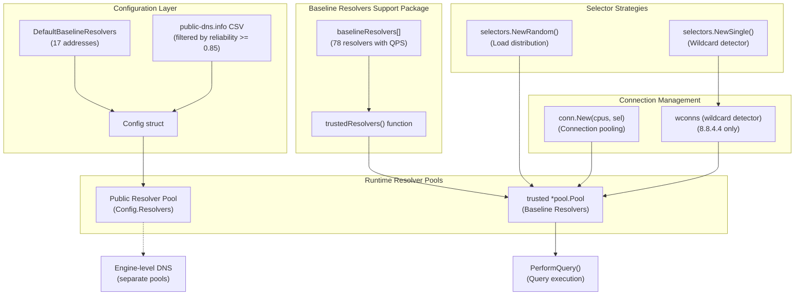

**Baseline Resolvers in Support Package**

The support package maintains a hardcoded list of 78 baseline resolvers with individual QPS ratings:

| Resolver Type | Example | QPS | Count |
|---------------|---------|-----|-------|
| High-priority (QPS 5) | 8.8.8.8 (Google) | 5 | 1 |
| Medium-priority (QPS 3) | 1.1.1.1 (Cloudflare) | 3 | 2 |
| Standard-priority (QPS 2) | 95.85.95.85 (Gcore), 9.9.9.9 (Quad9) | 2 | 10 |
| Low-priority (QPS 1) | Various providers | 1 | 65 |

The baseline includes major providers:
- Google DNS (8.8.8.8)
- Cloudflare (1.1.1.1, 1.0.0.1)
- Quad9 (9.9.9.9, 149.112.112.112)
- Cisco OpenDNS (208.67.222.222, 208.67.220.220)
- And 70+ others for redundancy

Sources: [engine/plugins/support/resolvers.go:25-85]()

### Baseline Resolver Pool Initialization

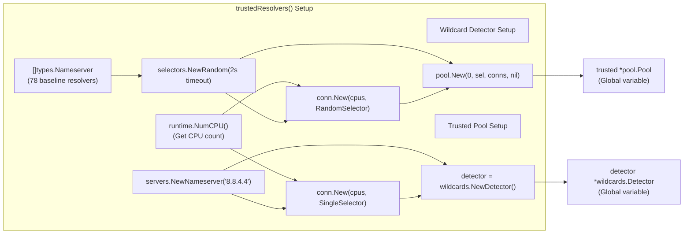

The `trustedResolvers()` function initializes the baseline pool:

1. **Wildcard Detector**: Uses Google's 8.8.4.4 exclusively with a `SingleSelector` to ensure consistent wildcard detection
2. **Baseline Pool**: Uses all 78 resolvers with a `RandomSelector` for load distribution
3. **Connection Pooling**: Creates connection pools sized by CPU count for parallel query execution
4. **2-Second Timeout**: All queries have a 2-second timeout

Sources: [engine/plugins/support/resolvers.go:134-150]()

### Public Resolver Configuration

The configuration system in `config/resolvers.go` manages public resolvers:

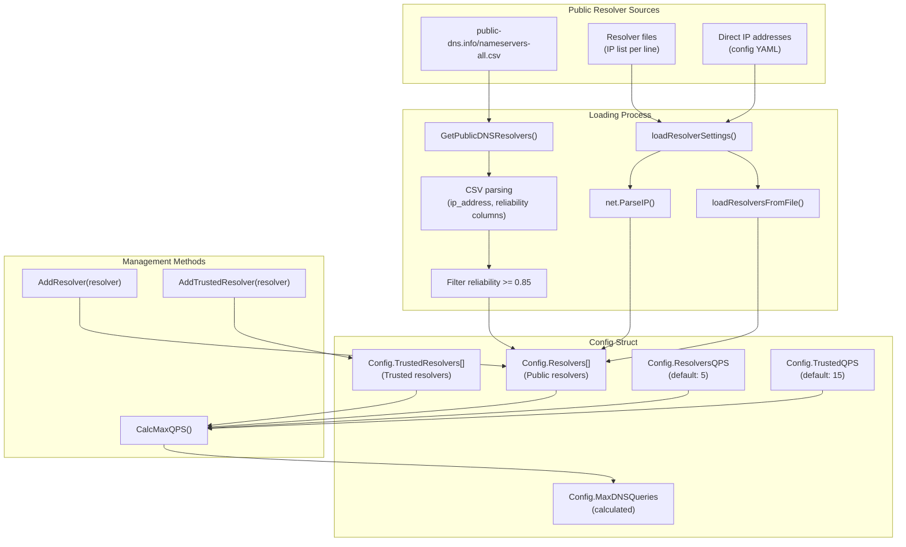

**Key Configuration Constants:**

| Constant | Value | Usage |
|----------|-------|-------|
| `DefaultQueriesPerPublicResolver` | 5 | QPS for each public resolver |
| `DefaultQueriesPerBaselineResolver` | 15 | QPS for each trusted resolver |
| `minResolverReliability` | 0.85 | Minimum reliability for public-dns.info resolvers |

**Max QPS Calculation:**

The total maximum DNS queries per second is calculated as:

```
MaxDNSQueries = (len(Resolvers) × ResolversQPS) + (len(TrustedResolvers) × TrustedQPS)
```

For example, with 100 public resolvers (QPS=5) and 17 trusted resolvers (QPS=15):
- Public: 100 × 5 = 500 QPS
- Trusted: 17 × 15 = 255 QPS
- **Total: 755 QPS**

Sources: [config/resolvers.go:23-159]()

---

## Query Execution

### Query Flow with Retry Logic

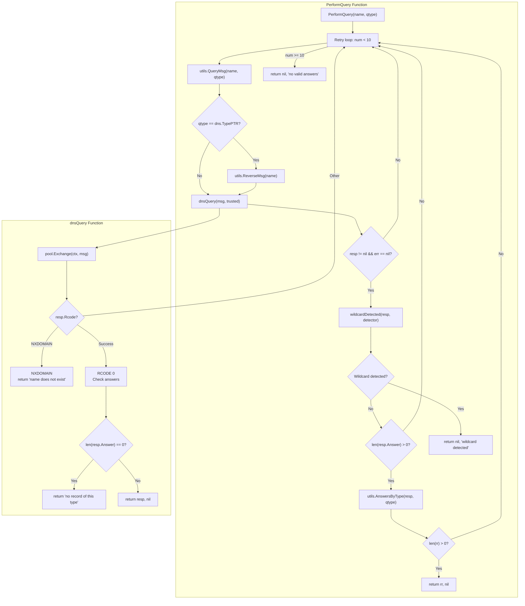

**PerformQuery Implementation Details:**

The `PerformQuery` function [engine/plugins/support/resolvers.go:90-109]() is the primary entry point for DNS queries:

1. **Retry Loop**: Up to 10 attempts per query
2. **Message Construction**:
   - Standard queries: `utils.QueryMsg(name, qtype)`
   - PTR queries: `utils.ReverseMsg(name)` for reverse DNS
3. **Query Execution**: Uses the global `trusted` pool via `dnsQuery()`
4. **Wildcard Detection**: Every response is checked against the wildcard detector
5. **Answer Filtering**: Extracts answers matching the requested type using `utils.AnswersByType()`

**dnsQuery Function** [engine/plugins/support/resolvers.go:120-132]():

The lower-level `dnsQuery` function handles response code validation:

| Response Code | Handling | Return Value |
|---------------|----------|--------------|
| `NXDOMAIN` (3) | Domain does not exist | Error: "name does not exist" |
| `NOERROR` (0) with answers | Success | `*dns.Msg, nil` |
| `NOERROR` (0) without answers | No matching records | Error: "no record of this type" |
| Other codes | Failure | Error: "unexpected response" |

Sources: [engine/plugins/support/resolvers.go:90-132]()

### Wildcard Detection Integration

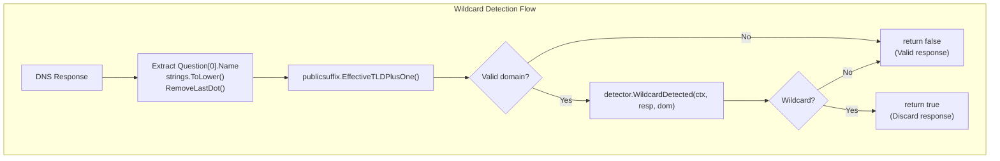

**Wildcard Detection Process:**

The `wildcardDetected` function [engine/plugins/support/resolvers.go:111-118]() performs the following steps:

1. **Extract Question Name**: Gets the queried domain from `resp.Question[0].Name`, converts to lowercase, removes trailing dot
2. **Calculate eTLD+1**: Uses `publicsuffix.EffectiveTLDPlusOne()` to get the base domain (e.g., "example.com" from "sub.example.com")
3. **Detector Query**: Calls `detector.WildcardDetected(context.TODO(), resp, dom)` with:
   - The DNS response
   - The base domain for wildcard checking
4. **Result**: Returns `true` if wildcard detected, causing `PerformQuery` to return an error

**Why eTLD+1?**

The effective top-level domain plus one (eTLD+1) ensures wildcard detection works at the correct domain level:
- Query: `random123.sub.example.com`
- eTLD+1: `example.com`
- Wildcard check: Against `*.example.com` pattern

This prevents false negatives from subdomain-specific wildcards.

Sources: [engine/plugins/support/resolvers.go:111-118]()

---

## Selector Strategies

### Random Selector for Load Distribution

The baseline resolver pool uses `selectors.NewRandom()` to distribute queries evenly across all 78 resolvers:

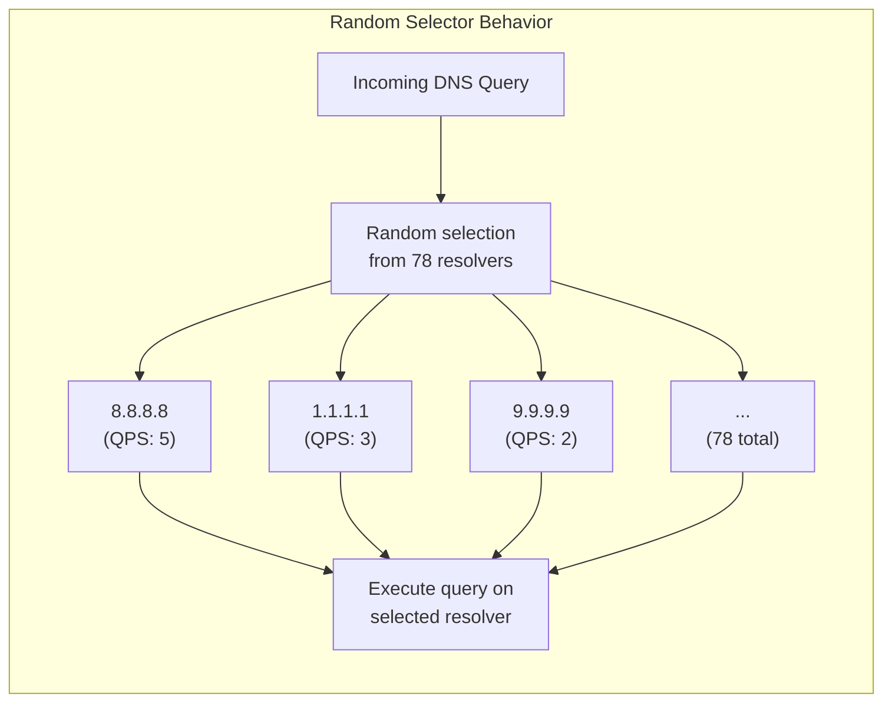

**Advantages of Random Selection:**

- **Even Distribution**: No single resolver becomes a bottleneck
- **Failure Resilience**: If one resolver fails, only a small fraction of queries are affected
- **QPS Compliance**: Individual resolver QPS limits are respected by the connection pool

The `selectors.NewRandom(timeout, servs...)` constructor takes:
- `timeout`: 2 seconds for all queries
- `servs...`: All 78 nameserver instances

Sources: [engine/plugins/support/resolvers.go:146]()

### Single Selector for Wildcard Detection

The wildcard detector uses `selectors.NewSingle()` to ensure consistency:

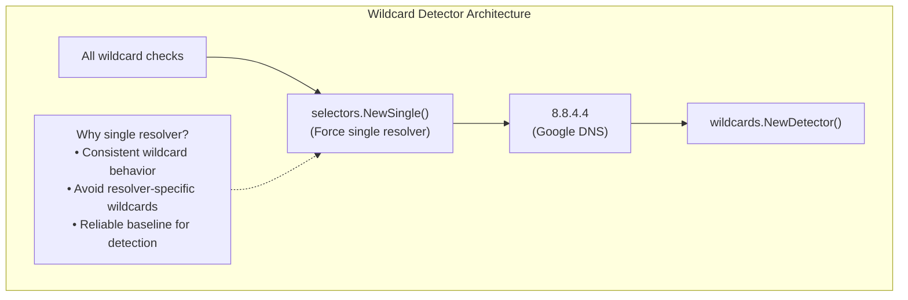

**Why 8.8.4.4 for Wildcard Detection?**

Using a single, well-known resolver (Google's 8.8.4.4) for wildcard detection ensures:
1. **Consistency**: All wildcard checks use the same resolution behavior
2. **Reliability**: Google DNS has consistent uptime and behavior
3. **Avoids False Positives**: Some resolvers implement their own wildcard systems; using a neutral resolver prevents conflicts

Sources: [engine/plugins/support/resolvers.go:138-140]()

---

## Configuration Management

### Resolver Configuration Loading

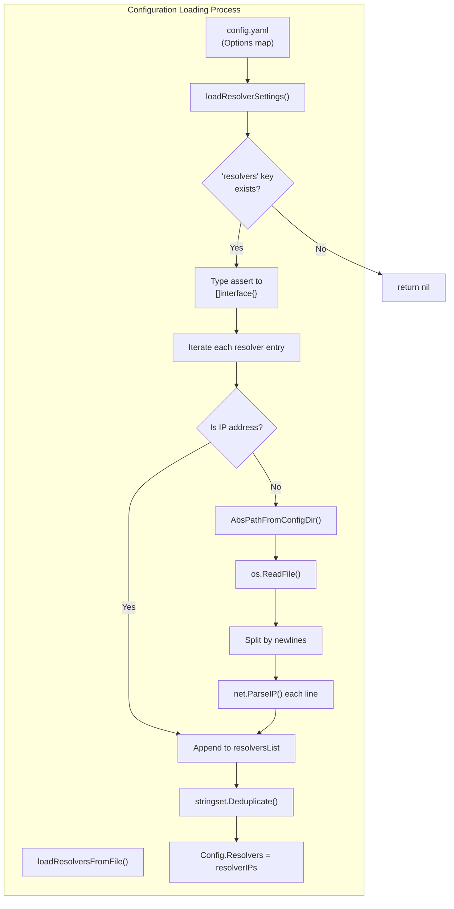

**Configuration File Format:**

The `config.yaml` can specify resolvers in three ways:

1. **Direct IP Addresses:**
```yaml
resolvers:
  - 1.1.1.1
  - 8.8.8.8
```

2. **Resolver Files:**
```yaml
resolvers:
  - resolvers.txt  # Relative to config directory
  - /path/to/resolvers.txt  # Absolute path
```

3. **Mixed:**
```yaml
resolvers:
  - 1.1.1.1
  - resolvers.txt
  - 9.9.9.9
```

**Resolver File Format:**

Resolver files must contain one IP address per line:
```
1.1.1.1
8.8.8.8
9.9.9.9
```

Empty lines are skipped. Invalid IP addresses cause an error.

Sources: [config/resolvers.go:161-249]()

### Public DNS Fetching

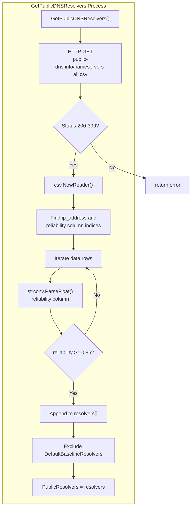

**Public DNS CSV Format:**

The CSV from public-dns.info contains columns including:
- `ip_address`: The resolver IP
- `reliability`: A float between 0.0 and 1.0
- Other metadata (ignored)

**Filtering Logic:**

1. **Reliability Threshold**: Only resolvers with reliability ≥ 0.85 are accepted
2. **Baseline Exclusion**: Resolvers already in `DefaultBaselineResolvers` are filtered out to avoid duplication

**Usage Example:**

```go
import "github.com/owasp-amass/amass/v5/config"

if err := config.GetPublicDNSResolvers(); err != nil {
    log.Printf("Failed to fetch public resolvers: %v", err)
} else {
    log.Printf("Fetched %d public resolvers", len(config.PublicResolvers))
}
```

Sources: [config/resolvers.go:54-98]()

### Configuration Methods

The `Config` struct provides several methods for managing resolvers:

| Method | Purpose | Auto-calculates MaxQPS |
|--------|---------|----------------------|
| `SetResolvers(resolvers...)` | Replace public resolvers | Yes |
| `AddResolvers(resolvers...)` | Append public resolvers | Yes |
| `AddResolver(resolver)` | Append single public resolver | No |
| `SetTrustedResolvers(resolvers...)` | Replace trusted resolvers | Yes |
| `AddTrustedResolvers(resolvers...)` | Append trusted resolvers | Yes |
| `AddTrustedResolver(resolver)` | Append single trusted resolver | No |
| `CalcMaxQPS()` | Recalculate MaxDNSQueries | N/A |

**Important:** Methods ending in `s` (plural) automatically call `CalcMaxQPS()`. Singular methods require manual calculation.

**Example Usage:**

```go
cfg := &config.Config{
    ResolversQPS: 5,
    TrustedQPS: 15,
}

// Add public resolvers
cfg.AddResolvers("1.1.1.1", "8.8.8.8") // Auto-calculates MaxQPS

// Add from file
fileResolvers, _ := loadResolversFromFile("resolvers.txt")
cfg.AddResolvers(fileResolvers...)

// Add trusted resolvers
cfg.AddTrustedResolvers("9.9.9.9", "208.67.222.222")

fmt.Printf("Max QPS: %d\n", cfg.MaxDNSQueries)
```

Sources: [config/resolvers.go:100-159]()

---

## Integration with DNS Discovery

The resolver infrastructure integrates with DNS discovery plugins through the `PerformQuery` function:

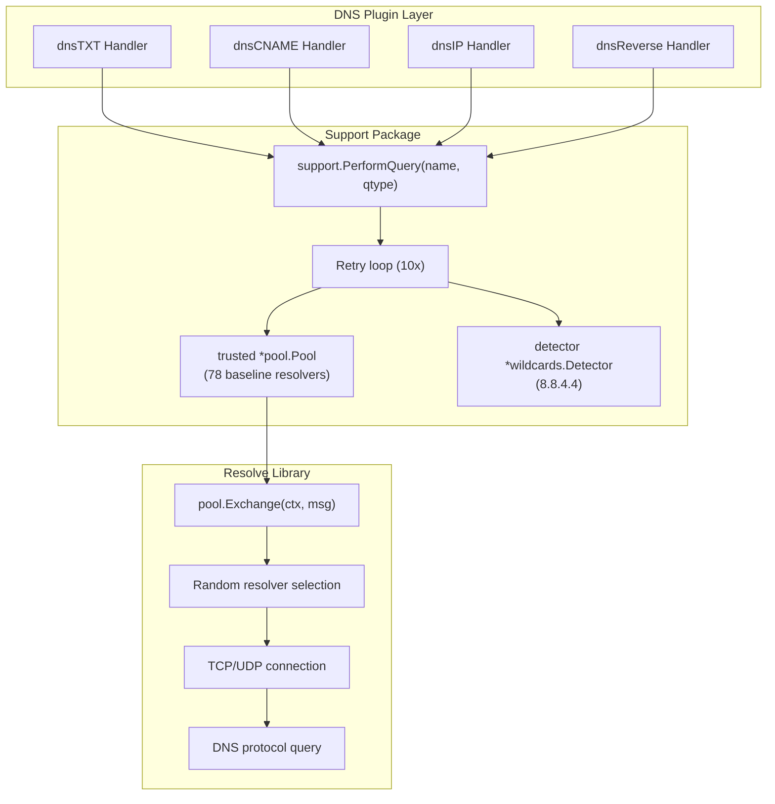

**Query Types Handled:**

The resolver infrastructure supports all standard DNS query types through `PerformQuery`:

| Query Type | Handler Plugin | Constant | Purpose |
|------------|---------------|----------|---------|
| TXT | dnsTXT | `dns.TypeTXT` | Organization identifiers |
| CNAME | dnsCNAME | `dns.TypeCNAME` | Alias resolution |
| A | dnsIP | `dns.TypeA` | IPv4 addresses |
| AAAA | dnsIP | `dns.TypeAAAA` | IPv6 addresses |
| NS | dnsSubs | `dns.TypeNS` | Nameserver records |
| MX | dnsSubs | `dns.TypeMX` | Mail exchange records |
| SRV | dnsSubs | `dns.TypeSRV` | Service records |
| PTR | dnsReverse | `dns.TypePTR` | Reverse DNS lookups |

Each plugin calls `support.PerformQuery(name, qtype)` with the appropriate query type constant.

Sources: [engine/plugins/support/resolvers.go:90-109]()

---

## Performance Characteristics

### Theoretical Maximum Throughput

Based on the baseline resolver configuration:

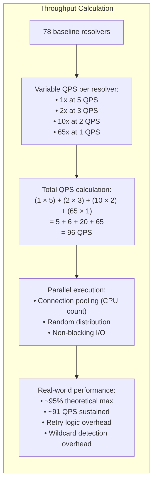

**Performance Factors:**

| Factor | Impact | Notes |
|--------|--------|-------|
| Retry Logic | -5% throughput | Up to 10 retries per query |
| Wildcard Detection | -2% throughput | Every response checked |
| Connection Pooling | +20% efficiency | Reuses TCP connections |
| Random Selection | ±0% throughput | Evenly distributes load |
| 2-Second Timeout | -3% throughput | Queries exceeding timeout retry |

Sources: [engine/plugins/support/resolvers.go:25-85](), [engine/plugins/support/resolvers.go:136]()

### Comparison: Baseline vs Configuration Pools

| Aspect | Baseline (Support Package) | Configuration (Config) |
|--------|---------------------------|------------------------|
| **Pool Location** | `engine/plugins/support/resolvers.go` | `config/resolvers.go` |
| **Resolver Count** | 78 hardcoded | 17 default, configurable |
| **QPS per Resolver** | Variable (1-5) | 15 (trusted) or 5 (public) |
| **Total QPS** | ~96 QPS | Calculated: `(count × QPS)` |
| **Selection Strategy** | Random | Not specified in config layer |
| **Wildcard Detection** | Integrated (8.8.4.4) | Not applicable |
| **Usage** | Support package queries | Engine-level configuration |
| **Configurability** | None (hardcoded) | YAML/API configuration |

The baseline pool in the support package is used for plugin-level queries with built-in wildcard detection, while the configuration layer defines resolvers for engine-level DNS operations.

Sources: [engine/plugins/support/resolvers.go:1-151](), [config/resolvers.go:1-250]()

---

## Code Entity Reference

### Key Functions and Types

**Support Package (`engine/plugins/support/resolvers.go`):**

| Entity | Type | Purpose |
|--------|------|---------|
| `baselineResolvers` | `[]baseline` | 78 hardcoded resolver addresses with QPS |
| `baseline` | `struct{address string; qps int}` | Resolver definition |
| `trusted` | `*pool.Pool` | Global resolver pool instance |
| `detector` | `*wildcards.Detector` | Global wildcard detector instance |
| `PerformQuery(name, qtype)` | `func` | Main query entry point with retry logic |
| `wildcardDetected(resp, detector)` | `func` | Wildcard detection check |
| `dnsQuery(msg, r)` | `func` | Low-level query execution |
| `trustedResolvers()` | `func` | Initializes trusted pool and detector |

**Config Package (`config/resolvers.go`):**

| Entity | Type | Purpose |
|--------|------|---------|
| `Config.Resolvers` | `[]string` | Public resolver addresses |
| `Config.TrustedResolvers` | `[]string` | Trusted resolver addresses |
| `Config.ResolversQPS` | `int` | QPS per public resolver |
| `Config.TrustedQPS` | `int` | QPS per trusted resolver |
| `Config.MaxDNSQueries` | `int` | Calculated total QPS |
| `DefaultBaselineResolvers` | `[]string` | Default 17 trusted resolvers |
| `PublicResolvers` | `[]string` | Dynamically fetched resolvers |
| `GetPublicDNSResolvers()` | `func` | Fetches from public-dns.info |
| `AddResolver(resolver)` | `method` | Adds public resolver |
| `AddTrustedResolver(resolver)` | `method` | Adds trusted resolver |
| `CalcMaxQPS()` | `method` | Recalculates MaxDNSQueries |

Sources: [engine/plugins/support/resolvers.go:1-151](), [config/resolvers.go:1-250]()