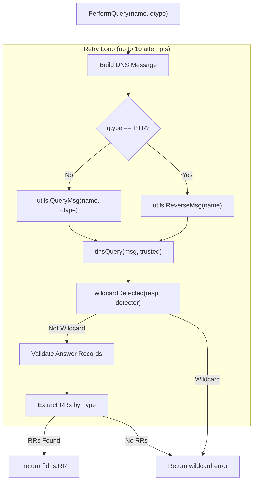
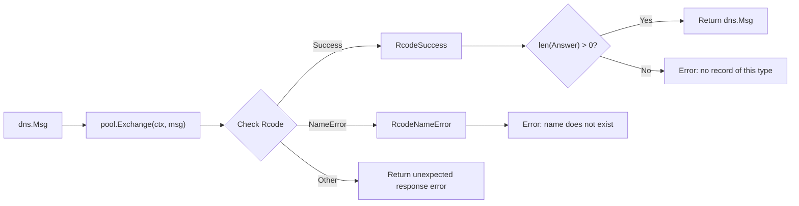
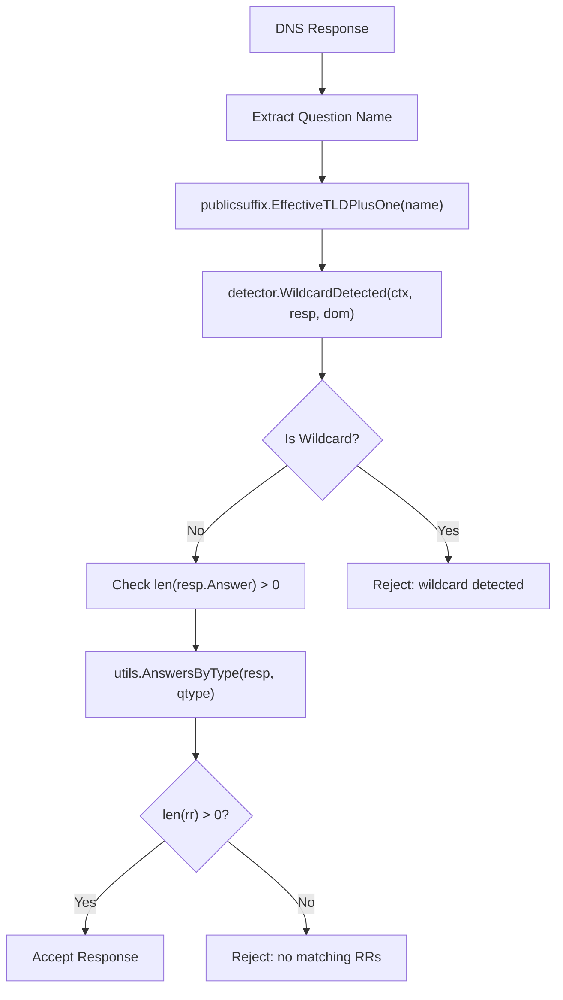
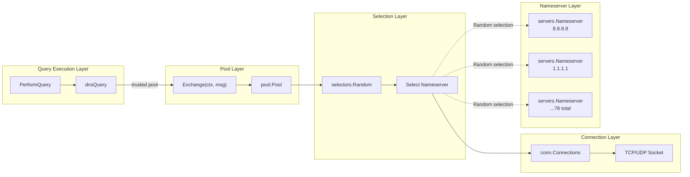
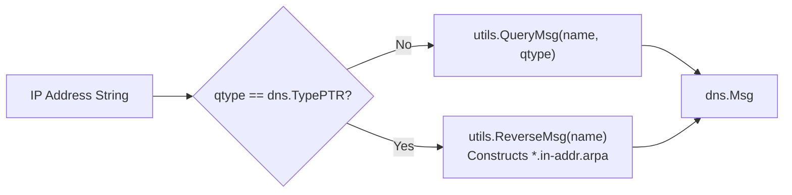
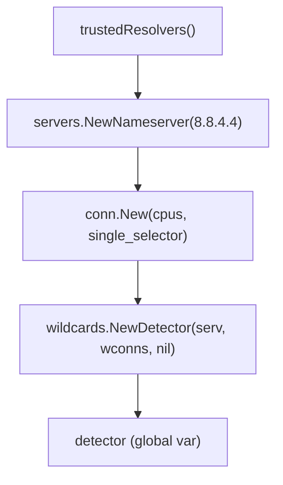

# DNS Query Execution

# DNS Query Execution

<details>
<summary>Relevant source files</summary>

The following files were used as context for generating this wiki page:

- [engine/plugins/support/resolvers.go](engine/plugins/support/resolvers.go)
- [go.mod](go.mod)
- [go.sum](go.sum)

</details>


## Purpose and Scope

This page documents the DNS query execution mechanism in Amass, specifically the `PerformQuery` function and its supporting infrastructure. This covers the process of submitting DNS queries to the resolver pool, handling retries, validating responses, and detecting wildcards. For information about the resolver pool infrastructure and selection strategies, see [DNS Resolver Infrastructure](#5.1). For details on wildcard detection algorithms, see [Wildcard Detection](#5.3).

**Sources:** [engine/plugins/support/resolvers.go:1-151]()

---

## Query Execution Architecture

The DNS query execution system consists of four primary components working together to perform reliable DNS lookups with automatic retry and validation.



**Sources:** [engine/plugins/support/resolvers.go:90-109]()

---

## The PerformQuery Function

The `PerformQuery` function is the primary entry point for DNS resolution in Amass plugins. It implements a robust retry mechanism with wildcard detection and response validation.

### Function Signature

```go
func PerformQuery(name string, qtype uint16) ([]dns.RR, error)
```

### Retry Logic

The function attempts up to **10 query iterations** before giving up. This aggressive retry strategy ensures resilience against temporary network issues, rate limiting, and resolver failures.

| Attempt | Action | Failure Handling |
|---------|--------|------------------|
| 1-9 | Execute DNS query via `dnsQuery` | Continue to next attempt |
| 10 | Final attempt | Return error "no valid answers" |

On each iteration:
1. Construct a DNS message using `utils.QueryMsg` or `utils.ReverseMsg` for PTR records
2. Submit query to the trusted resolver pool via `dnsQuery`
3. Check for wildcard responses using `wildcardDetected`
4. Validate that answers exist and match the requested type
5. Return immediately on success, or continue to next attempt on failure

**Sources:** [engine/plugins/support/resolvers.go:90-109]()

---

## Low-Level Query Execution

The `dnsQuery` function handles the actual network communication with DNS resolvers through the pool abstraction.



### Response Code Handling

| Rcode | Value | Action | Error Message |
|-------|-------|--------|---------------|
| `RcodeNameError` | 3 | Return error | "name does not exist" |
| `RcodeSuccess` | 0 | Validate answers exist | "no record of this type" if empty |
| Other | Various | Return error | "unexpected response" |

**Sources:** [engine/plugins/support/resolvers.go:120-132]()

---

## Response Validation Flow

DNS responses undergo two validation stages before being returned to callers.



### Stage 1: Wildcard Detection

Before processing answers, the system checks for DNS wildcard responses:

1. **Extract Domain**: The question name is converted to its EffectiveTLD+1 (e.g., "sub.example.com" → "example.com")
2. **Invoke Detector**: The `detector.WildcardDetected` method analyzes the response against known wildcard patterns for the domain
3. **Reject on Match**: If a wildcard is detected, the response is rejected with error "wildcard detected"

**Sources:** [engine/plugins/support/resolvers.go:111-118]()

### Stage 2: Answer Type Validation

After wildcard detection, the system validates that:
- The response contains at least one answer record (`len(resp.Answer) > 0`)
- At least one answer matches the requested type via `utils.AnswersByType(resp, qtype)`

Only answers matching the exact query type are extracted and returned.

**Sources:** [engine/plugins/support/resolvers.go:101-104]()

---

## Resolver Pool Integration

Query execution relies on the **trusted resolver pool**, a pre-configured `pool.Pool` instance that manages connections to baseline resolvers.



### Trusted Pool Initialization

The `trustedResolvers` function creates the pool during system startup:

| Component | Type | Configuration |
|-----------|------|---------------|
| **Timeout** | `time.Duration` | 2 seconds per query |
| **Worker Threads** | `int` | `runtime.NumCPU()` concurrent workers |
| **Nameservers** | `[]types.Nameserver` | 78 baseline resolvers from `baselineResolvers` |
| **Selector** | `selectors.Random` | Random selection among available resolvers |
| **Connection Pool** | `conn.Connections` | CPU-count connection handlers |
| **Rate Limiting** | `pool.Pool` | No explicit limit (pool-level management) |

**Sources:** [engine/plugins/support/resolvers.go:134-150]()

---

## Special Handling: PTR Queries

Reverse DNS (PTR) queries require special message construction because they use a different question format (in-addr.arpa or ip6.arpa).



The distinction is made at [engine/plugins/support/resolvers.go:92-95]():
- Standard queries use `utils.QueryMsg(name, qtype)`
- PTR queries use `utils.ReverseMsg(name)` which converts IPs to reverse lookup format

**Sources:** [engine/plugins/support/resolvers.go:92-95]()

---

## Error Conditions

The query execution system returns specific errors to help callers distinguish between different failure modes.

| Error Message | Source | Meaning | Retry Strategy |
|---------------|--------|---------|----------------|
| `"wildcard detected"` | `PerformQuery` | Response matched wildcard pattern | Immediate failure, no retry |
| `"no valid answers"` | `PerformQuery` | All 10 attempts exhausted | Fatal after 10 attempts |
| `"name does not exist"` | `dnsQuery` | DNS returned NXDOMAIN | Propagated up, triggers retry |
| `"no record of this type"` | `dnsQuery` | Success but no answers | Propagated up, triggers retry |
| `"unexpected response"` | `dnsQuery` | Non-standard Rcode | Propagated up, triggers retry |
| Network errors | `pool.Exchange` | TCP/UDP failure | Propagated up, triggers retry |

**Sources:** [engine/plugins/support/resolvers.go:90-132]()

---

## Wildcard Detection Integration

Query execution integrates with the wildcard detection system through a dedicated `wildcards.Detector` instance configured to use Google's `8.8.4.4` resolver.

### Detector Configuration



The detector is initialized once during pool creation:
1. A dedicated `servers.Nameserver` is created for `8.8.4.4` (Google DNS Secondary)
2. A separate connection pool is created with `selectors.NewSingle` (always uses 8.8.4.4)
3. The detector is instantiated with these dedicated resources
4. The detector is stored in the global `detector` variable for use by all queries

This separation ensures wildcard detection doesn't interfere with normal resolver pool operations and always uses a consistent, reliable resolver.

**Sources:** [engine/plugins/support/resolvers.go:136-140]()

---

## Thread Safety and Concurrency

All query execution components are designed for concurrent use by multiple goroutines:

- **`PerformQuery`**: Stateless function, safe to call concurrently
- **`pool.Pool`**: Thread-safe, manages internal connection pooling
- **`wildcards.Detector`**: Thread-safe with internal caching and state management
- **Global Variables**: `trusted` and `detector` are initialized once and read-only afterward

Plugins can call `PerformQuery` from multiple event handlers without synchronization.

**Sources:** [engine/plugins/support/resolvers.go:87-88, 134-150]()