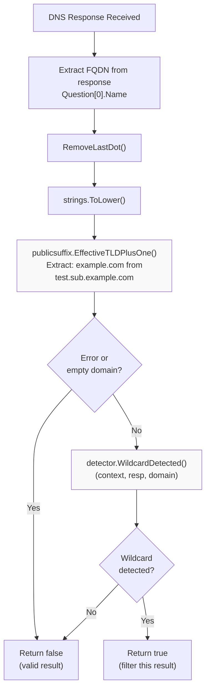
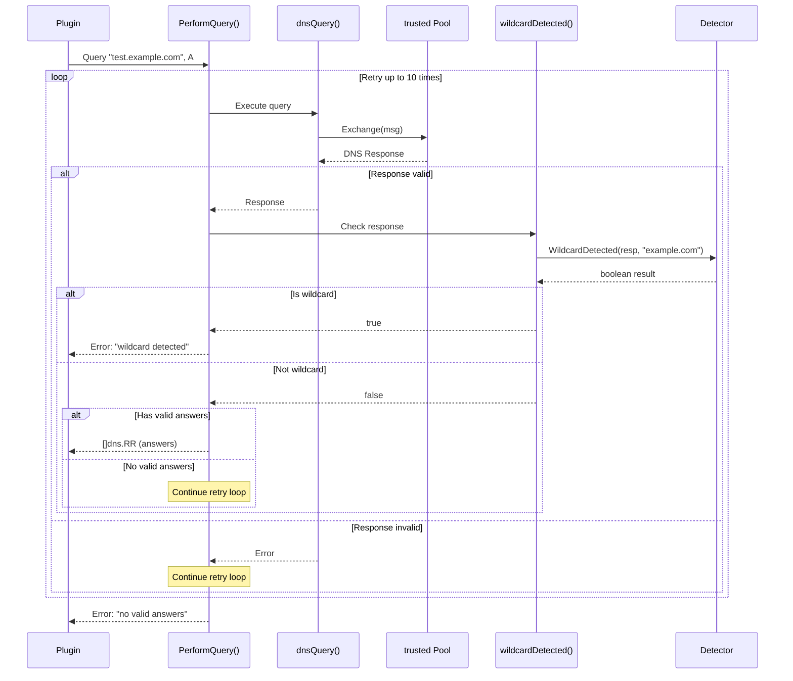
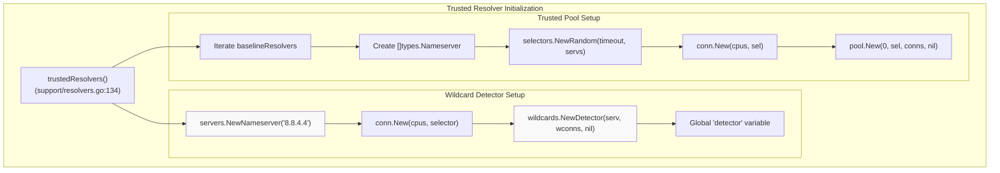

# Wildcard Detection

# Wildcard Detection

<details>
<summary>Relevant source files</summary>

The following files were used as context for generating this wiki page:

- [engine/plugins/support/resolvers.go](engine/plugins/support/resolvers.go)
- [go.mod](go.mod)
- [go.sum](go.sum)

</details>


## Purpose and Scope

This document describes the wildcard DNS detection mechanism in Amass, which prevents false positive domain discoveries caused by wildcard DNS records. Wildcard detection is a critical filtering step that runs during DNS query resolution to ensure enumeration accuracy.

For information about the broader DNS resolution infrastructure that uses wildcard detection, see [DNS Resolver Infrastructure](#5.1). For details on how DNS queries are executed, see [DNS Query Execution](#5.2).

## Overview of DNS Wildcards

DNS wildcard records allow administrators to configure a single DNS record that matches all subdomains under a domain. For example, a wildcard record `*.example.com` will resolve any previously undefined subdomain like `random123.example.com` or `nonexistent.example.com` to the same IP address.

**Problem for Reconnaissance**: During subdomain enumeration, wildcard records create false positives. If Amass queries `test-abcd1234.example.com` and receives a valid DNS response, it cannot determine whether this subdomain legitimately exists or is simply matching a wildcard record. Without wildcard detection, enumeration results would be polluted with thousands of non-existent subdomains that all resolve to the same wildcard IP.

## Architecture Overview

The wildcard detection system operates independently from the main DNS resolver pool, using a dedicated single resolver for consistency.

```mermaid
graph TB
    subgraph "DNS Query Flow"
        Q[DNS Query Request]
        PQ["PerformQuery()<br/>(support/resolvers.go:90)"]
        TP["trusted Pool"]
        DQ["dnsQuery()<br/>(support/resolvers.go:120)"]
        R["DNS Response"]
    end
    
    subgraph "Wildcard Detection System"
        WD["wildcards.Detector<br/>(global variable)"]
        WDF["wildcardDetected()<br/>(support/resolvers.go:111)"]
        ETLD["publicsuffix.EffectiveTLDPlusOne()"]
        WDM["Detector.WildcardDetected()"]
    end
    
    subgraph "Dedicated Wildcard Resolver"
        GD["8.8.4.4<br/>(Google DNS Secondary)"]
        WC["conn.New() for detector"]
    end
    
    Q --> PQ
    PQ --> DQ
    DQ --> TP
    TP --> R
    R --> WDF
    
    WDF --> ETLD
    ETLD --> WDM
    WDM --> WD
    WD --> GD
    WD --> WC
    
    WDF -.."wildcard detected".-> PQ
    
    style WD fill:#f9f9f9
    style GD fill:#f9f9f9
    style WDF fill:#f9f9f9
```

**Sources:** [engine/plugins/support/resolvers.go:1-151]()

### Key Components

| Component | Type | Purpose |
|-----------|------|---------|
| `detector` | `*wildcards.Detector` | Global singleton wildcard detector instance |
| `wildcardDetected()` | Function | Checks if a DNS response matches a wildcard pattern |
| `8.8.4.4` | Nameserver | Google DNS Secondary used exclusively for wildcard detection |
| `EffectiveTLDPlusOne` | Function | Extracts the registered domain (eTLD+1) from an FQDN |

## Detection Algorithm



**Sources:** [engine/plugins/support/resolvers.go:111-118]()

### EffectiveTLD+1 Extraction

The detection algorithm first extracts the **EffectiveTLD+1** (eTLD+1) from the queried domain. This is the registered domain name:

- `www.test.example.com` → `example.com`
- `api.staging.company.co.uk` → `company.co.uk`
- `subdomain.github.io` → `github.io` (public suffix)

This extraction is critical because wildcard detection must be performed at the registered domain level. If `*.example.com` is a wildcard, then all subdomains under `example.com` will match it, regardless of how many levels deep (e.g., `a.b.c.d.example.com`).

**Code Implementation:**
```go
// engine/plugins/support/resolvers.go:113-115
if dom, err := publicsuffix.EffectiveTLDPlusOne(name); err == nil && dom != "" {
    return r.WildcardDetected(context.TODO(), resp, dom)
}
```

The function uses the `golang.org/x/net/publicsuffix` package, which implements the Public Suffix List algorithm to correctly identify registered domains across all TLDs, including complex cases like `.co.uk`, `.gov.au`, etc.

**Sources:** [engine/plugins/support/resolvers.go:111-118](), [go.mod:37]()

## Integration with DNS Query Execution

Wildcard detection is integrated into the main DNS query path through the `PerformQuery()` function, which is the primary entry point for DNS resolution in plugins.



**Sources:** [engine/plugins/support/resolvers.go:90-109]()

### Retry Logic

The `PerformQuery()` function implements a retry mechanism with up to **10 attempts** [engine/plugins/support/resolvers.go:91](). For each attempt:

1. Query is sent via the `trusted` resolver pool
2. Response is validated by `dnsQuery()`
3. If valid, wildcard detection is performed
4. If wildcard is detected, the entire query fails immediately with error "wildcard detected"
5. If not a wildcard but no valid answers, retry continues
6. If valid non-wildcard answers exist, they are returned

This aggressive retry logic ensures that transient network errors don't cause false negatives, but wildcard detection always causes an immediate failure to prevent false positives.

**Sources:** [engine/plugins/support/resolvers.go:90-109]()

## Initialization and Configuration

The wildcard detector is initialized as part of the trusted resolver pool setup, ensuring it is available before any DNS queries are executed.



**Sources:** [engine/plugins/support/resolvers.go:134-150]()

### Single Resolver Design

The wildcard detector uses a **single dedicated resolver** (`8.8.4.4` - Google DNS Secondary) rather than the pool of 78+ resolvers used for regular queries. This design choice provides several benefits:

| Aspect | Benefit |
|--------|---------|
| **Consistency** | All wildcard checks use the same resolver, eliminating variability in wildcard behavior across different DNS servers |
| **Reliability** | Google's DNS service has high uptime and consistent behavior |
| **Simplicity** | Reduces complexity by avoiding resolver-specific wildcard handling logic |
| **Performance** | Dedicated connection pool prevents contention with regular query traffic |

**Code Implementation:**
```go
// engine/plugins/support/resolvers.go:138-140
serv := servers.NewNameserver("8.8.4.4")
wconns := conn.New(cpus, selectors.NewSingle(timeout, serv))
detector = wildcards.NewDetector(serv, wconns, nil)
```

**Sources:** [engine/plugins/support/resolvers.go:134-150]()

## Implementation Details

### Global State Management

The wildcard detector is implemented as a **global singleton** variable:

```go
// engine/plugins/support/resolvers.go:88
var detector *wildcards.Detector
```

This global state is initialized once during the first call to `trustedResolvers()` and remains available for the lifetime of the process. The global design allows all DNS query operations throughout the codebase to share a single detector instance without explicit dependency injection.

**Sources:** [engine/plugins/support/resolvers.go:88]()

### Connection Pool Sizing

The detector's connection pool is sized based on the number of CPU cores:

```go
// engine/plugins/support/resolvers.go:136
cpus := runtime.NumCPU()
wconns := conn.New(cpus, selectors.NewSingle(timeout, serv))
```

This ensures the detector can handle concurrent wildcard checks proportional to the system's parallelism capabilities, matching the concurrency of the main DNS resolution system.

**Sources:** [engine/plugins/support/resolvers.go:134-150]()

### Error Handling

The `wildcardDetected()` function returns `false` (not a wildcard) if it cannot extract the eTLD+1:

```go
// engine/plugins/support/resolvers.go:114-117
if dom, err := publicsuffix.EffectiveTLDPlusOne(name); err == nil && dom != "" {
    return r.WildcardDetected(context.TODO(), resp, dom)
}
return false
```

This fail-safe behavior ensures that parsing errors don't block legitimate results. If the domain cannot be properly parsed (e.g., invalid format, local domain), the system assumes it's not a wildcard and allows the result through.

**Sources:** [engine/plugins/support/resolvers.go:111-118]()

### Dependencies

The wildcard detection system relies on two external libraries:

| Library | Purpose | Import Path |
|---------|---------|-------------|
| `resolve/wildcards` | Core wildcard detection logic | `github.com/owasp-amass/resolve/wildcards` |
| `publicsuffix` | eTLD+1 extraction | `golang.org/x/net/publicsuffix` |

The actual wildcard detection algorithm is implemented in the external `owasp-amass/resolve` library, keeping the detection logic separate from the main Amass engine.

**Sources:** [engine/plugins/support/resolvers.go:8-23](), [go.mod:30,37]()