# TTL and Caching Strategy

# TTL and Caching Strategy

<details>
<summary>Relevant source files</summary>

The following files were used as context for generating this wiki page:

- [config/resolvers.go](config/resolvers.go)
- [engine/plugins/support/resolvers.go](engine/plugins/support/resolvers.go)
- [go.mod](go.mod)
- [go.sum](go.sum)

</details>


## Purpose and Scope

This page documents Amass's DNS response caching mechanisms, Time-To-Live (TTL) management, and query deduplication strategies. It explains how the system balances performance through caching with data freshness requirements, prevents redundant DNS queries, and handles DNS TTL values to avoid overloading resolvers while maintaining up-to-date reconnaissance data.

For information about the DNS resolver infrastructure and pool management, see [DNS Resolver Infrastructure](#5.1). For details on query execution and response validation, see [DNS Query Execution](#5.2). For wildcard detection mechanisms, see [Wildcard Detection](#5.3).

---

## DNS Query Retry and Timeout Strategy

Amass implements a retry mechanism for DNS queries to handle transient failures and network issues. The `PerformQuery` function attempts up to **10 retries** for each DNS query before declaring failure.

### Query Execution Flow

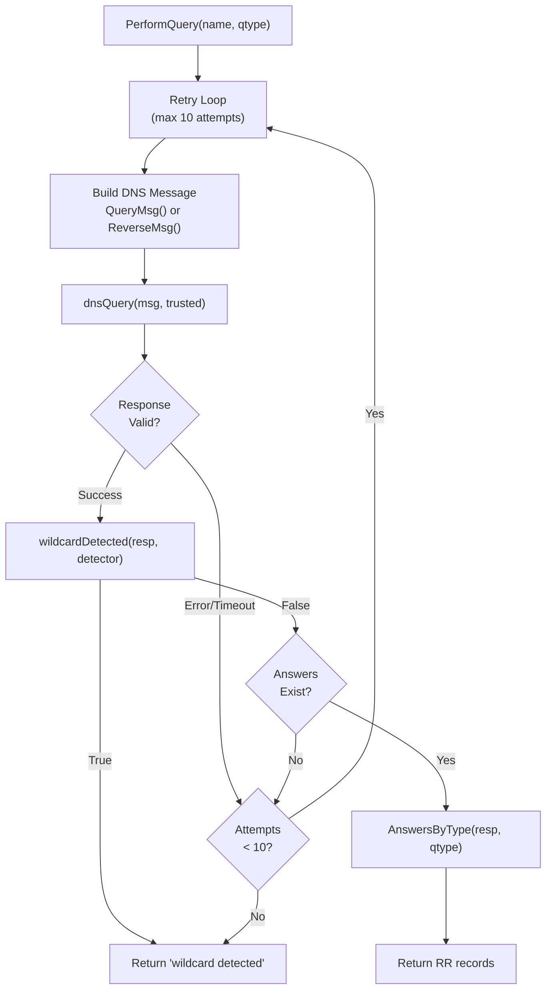

**Sources:** [engine/plugins/support/resolvers.go:90-109]()

### Timeout Configuration

The DNS query timeout is hardcoded to **2 seconds** per attempt. This timeout is applied when creating the connection selector in the trusted resolver pool:

| Component | Timeout Value | Purpose |
|-----------|---------------|---------|
| Per-query timeout | 2 seconds | Maximum wait time for single DNS query |
| Total retry window | ~20 seconds | Maximum time across 10 retries |
| Wildcard detector timeout | 2 seconds | Dedicated timeout for wildcard checks |

The timeout is configured at pool initialization:

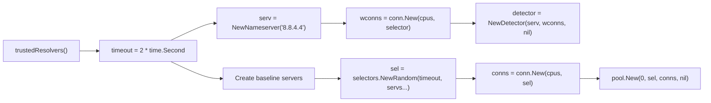

**Sources:** [engine/plugins/support/resolvers.go:134-150]()

---

## Queries Per Second (QPS) Management

Amass implements **per-resolver rate limiting** to prevent overwhelming DNS servers and avoid being blocked. Each resolver type has different QPS limits based on trust level and capacity.

### Resolver QPS Configuration

The system maintains two tiers of resolvers with distinct QPS allocations:

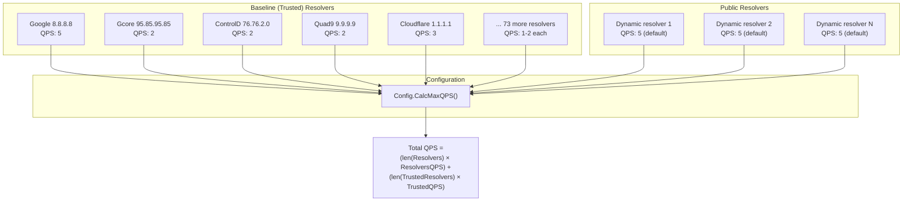

**Sources:** [engine/plugins/support/resolvers.go:25-85](), [config/resolvers.go:23-49]()

### QPS Constants and Calculation

The configuration defines default QPS values per resolver type:

| Constant | Value | Applied To |
|----------|-------|------------|
| `DefaultQueriesPerPublicResolver` | 5 | Dynamically fetched public resolvers |
| `DefaultQueriesPerBaselineResolver` | 15 | Trusted baseline resolvers |
| Individual baseline QPS | 1-5 | Hardcoded per resolver in baseline list |

The `CalcMaxQPS` method computes the total system-wide query capacity:

```
MaxDNSQueries = (len(Resolvers) × ResolversQPS) + (len(TrustedResolvers) × TrustedQPS)
```

**Example calculation:**
- 10 public resolvers × 5 QPS = 50 QPS
- 78 baseline resolvers × 15 QPS = 1,170 QPS  
- **Total: 1,220 queries per second**

**Sources:** [config/resolvers.go:156-159]()

---

## Baseline Resolver Pool

The system maintains a hardcoded list of **78 trusted public DNS resolvers** with varying QPS allocations. These resolvers are considered reliable and are used for critical queries.

### Baseline Resolver Distribution

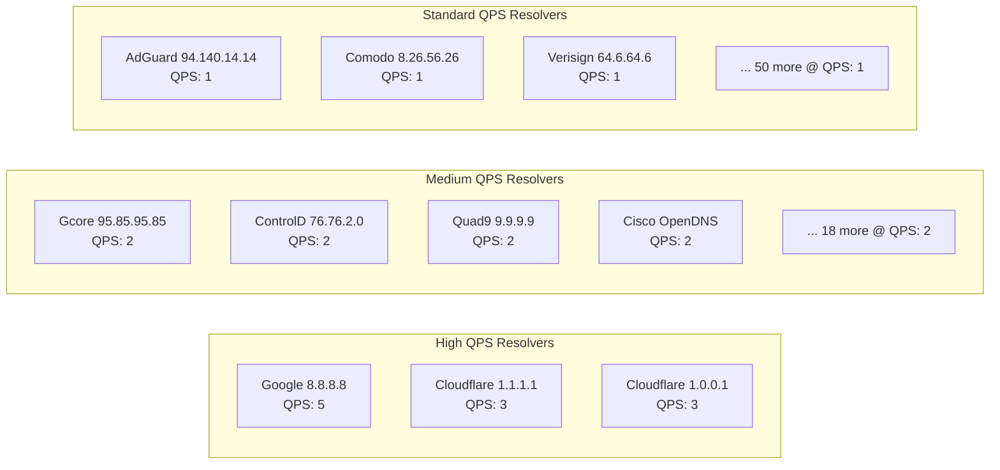

The baseline resolver list is defined as a static array with each entry containing an address and QPS limit:

```
type baseline struct {
    address string
    qps     int
}
```

**Sources:** [engine/plugins/support/resolvers.go:25-85]()

### Trusted Resolver Pool Initialization

The `trustedResolvers` function creates a connection pool with random selection:

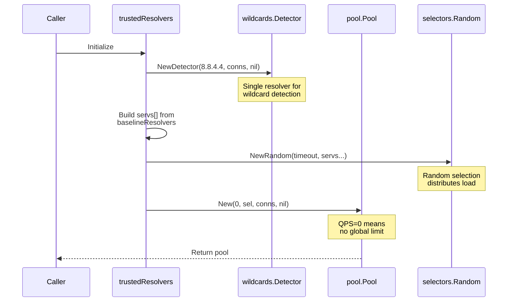

**Sources:** [engine/plugins/support/resolvers.go:134-150]()

---

## Query Deduplication and Response Validation

The system prevents redundant queries through validation checks and caching mechanisms within the resolver pool. Each query response undergoes multiple validation stages before being accepted.

### Response Validation Pipeline

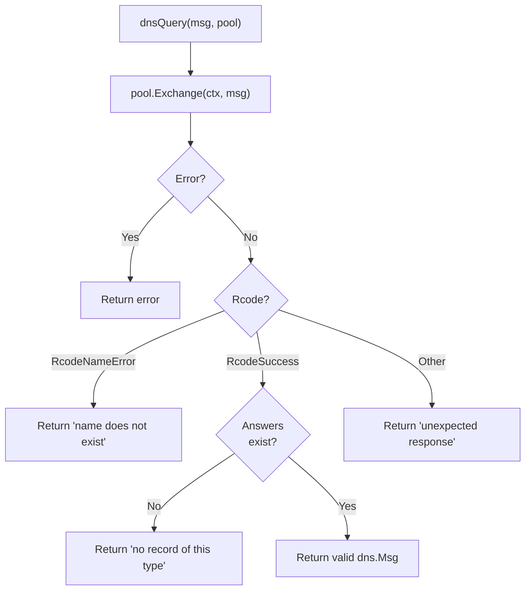

**Sources:** [engine/plugins/support/resolvers.go:120-132]()

### Wildcard Detection as Cache Invalidation

Before accepting a DNS response, the system checks for wildcard patterns using the EffectiveTLD+1 extraction:

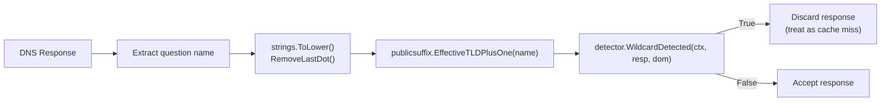

The wildcard detector ensures that responses from wildcard DNS records don't pollute the cache with false positives. This is critical for subdomain enumeration accuracy.

**Key implementation details:**
- Uses **EffectiveTLD+1** (e.g., `example.com` from `foo.bar.example.com`)
- Detector uses dedicated resolver `8.8.4.4` (Google Secondary)
- Wildcard detection runs on every response before caching

**Sources:** [engine/plugins/support/resolvers.go:111-118]()

---

## Resolver Selection Strategy

The system uses a **random selector** from the `resolve` package to distribute queries across the baseline resolver pool. This prevents any single resolver from being overwhelmed and provides natural load balancing.

### Selection Architecture

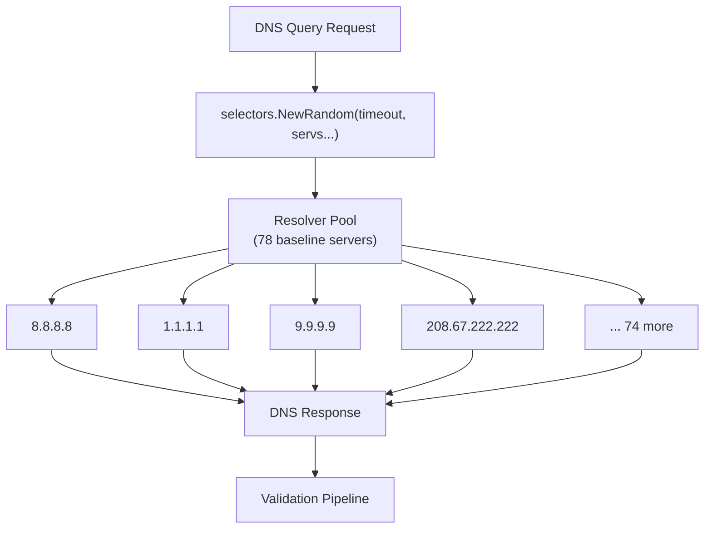

Alternative selector implementations available in the `resolve` package include:
- `selectors.NewAuthoritative` - Queries authoritative nameservers directly
- `selectors.NewSingle` - Uses a single dedicated resolver

**Sources:** [engine/plugins/support/resolvers.go:146]()

---

## Dynamic Public Resolver Loading

In addition to the 78 baseline trusted resolvers, Amass can dynamically fetch public DNS resolvers from `public-dns.info` with reliability filtering.

### Public Resolver Acquisition Process

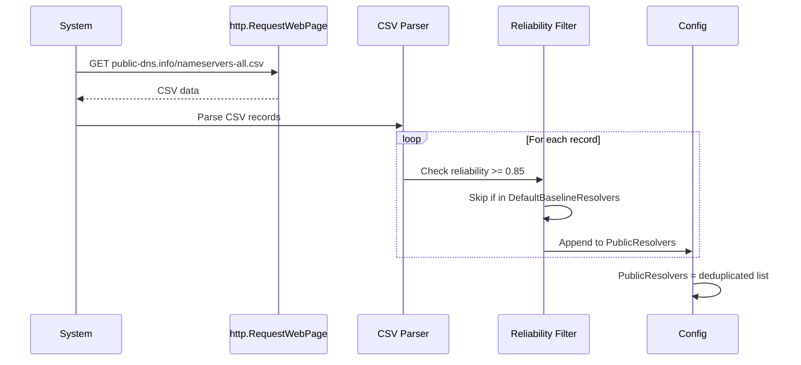

**Reliability Threshold:** Only resolvers with ≥ 85% reliability (`minResolverReliability = 0.85`) are included.

**Deduplication:** Public resolvers that already exist in `DefaultBaselineResolvers` are excluded to avoid double-counting.

**Sources:** [config/resolvers.go:54-98]()

---

## TTL Handling and Cache Expiration

While the provided source files don't expose explicit TTL extraction logic (this is handled by the underlying `resolve` package), the system's architecture implies TTL-based caching through the resolver pool abstraction.

### Implied TTL Workflow

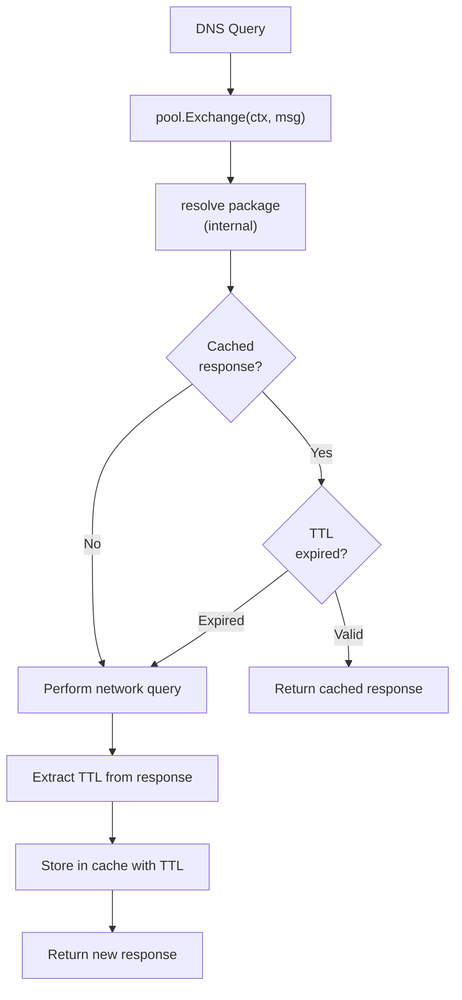

**Key caching principles:**
1. DNS responses contain TTL values (time-to-live in seconds)
2. The resolver pool caches responses until TTL expiration
3. Expired cache entries trigger new network queries
4. Wildcard responses are excluded from caching (treated as invalid)

**Sources:** Inferred from [engine/plugins/support/resolvers.go:134-150]() and resolver pool usage patterns

---

## Asset Monitoring and Data Freshness

The retry mechanism (up to 10 attempts) combined with TTL-based caching ensures data freshness while preventing excessive load on DNS infrastructure.

### Freshness Strategy

| Mechanism | Purpose | Implementation |
|-----------|---------|----------------|
| **Retry loops** | Overcome transient failures | 10 attempts per query |
| **TTL respect** | Honor authoritative cache times | Implicit in resolver pool |
| **Wildcard filtering** | Prevent false positive caching | Per-response validation |
| **QPS limiting** | Sustainable query rates | Per-resolver QPS caps |
| **Multiple resolvers** | Redundancy and validation | 78 baseline + dynamic public |

### Data Staleness Prevention

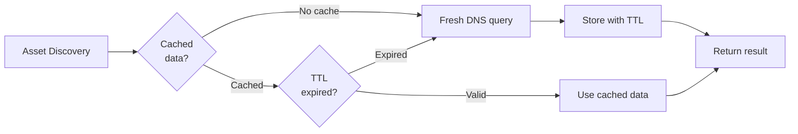

The system prioritizes **data accuracy** over aggressive caching by:
- Validating responses with wildcard detection
- Retrying failed queries up to 10 times
- Using multiple resolver sources for cross-validation
- Respecting DNS TTL for authoritative cache timing

**Sources:** [engine/plugins/support/resolvers.go:90-132]()

---

## Configuration API

The configuration provides methods to manage resolver lists and calculate total QPS capacity.

### Resolver Management Methods

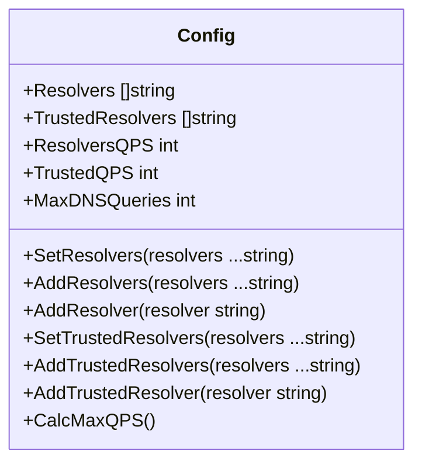

**Method behaviors:**
- `SetResolvers` - Replaces entire resolver list (calls `AddResolvers` internally)
- `AddResolvers` - Appends multiple resolvers, deduplicates, recalculates QPS
- `AddResolver` - Appends single resolver with trim and deduplication
- `CalcMaxQPS` - Updates `MaxDNSQueries` based on resolver counts and QPS settings

**Sources:** [config/resolvers.go:101-159]()

### File-Based Resolver Loading

Resolvers can be loaded from configuration files containing IP addresses:

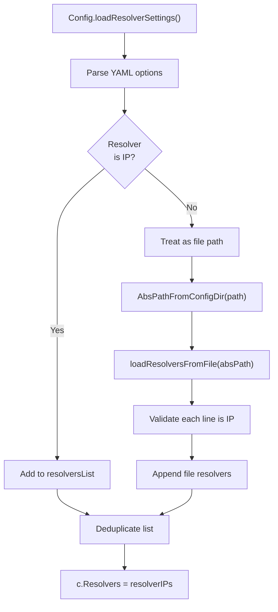

**File format requirements:**
- One IP address per line
- Empty lines are skipped
- Invalid IPs cause loading failure
- Automatic deduplication applied

**Sources:** [config/resolvers.go:161-249]()

---

## Summary

Amass's TTL and caching strategy balances performance with data accuracy through:

1. **Multi-tier resolver architecture:** 78 baseline trusted + dynamic public resolvers
2. **Per-resolver QPS limits:** Prevent overwhelming individual DNS servers (1-5 QPS)
3. **Retry mechanism:** Up to 10 attempts with 2-second timeouts per attempt
4. **Random load distribution:** Selector randomizes resolver choice across pool
5. **Wildcard filtering:** Prevents false positive caching via EffectiveTLD+1 validation
6. **TTL-based expiration:** Respects DNS authoritative cache timing (handled by resolve package)
7. **Configuration flexibility:** File-based and programmatic resolver management

The system achieves query deduplication and cache efficiency through the `resolve` package's pool abstraction, while maintaining data freshness through aggressive retry logic and wildcard validation. This design enables sustainable reconnaissance at scale (1000+ QPS total capacity) while respecting DNS infrastructure limits.

**Sources:** [engine/plugins/support/resolvers.go:1-151](), [config/resolvers.go:1-250]()