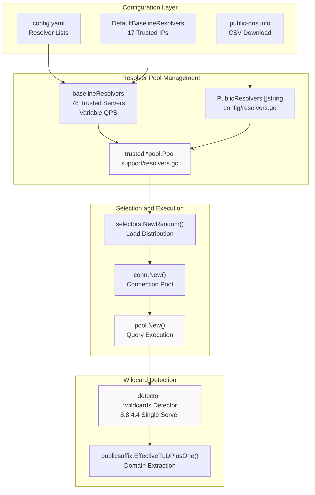
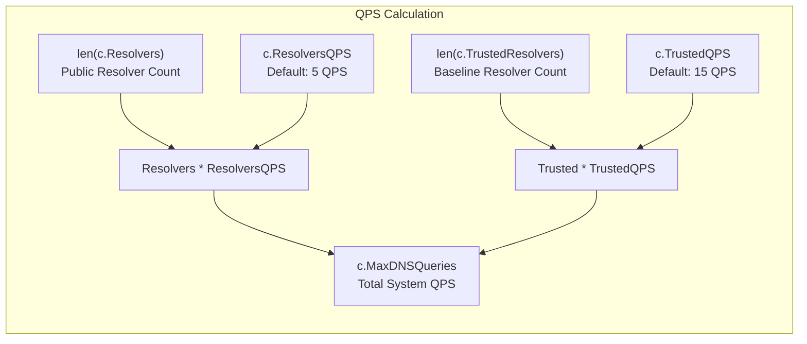
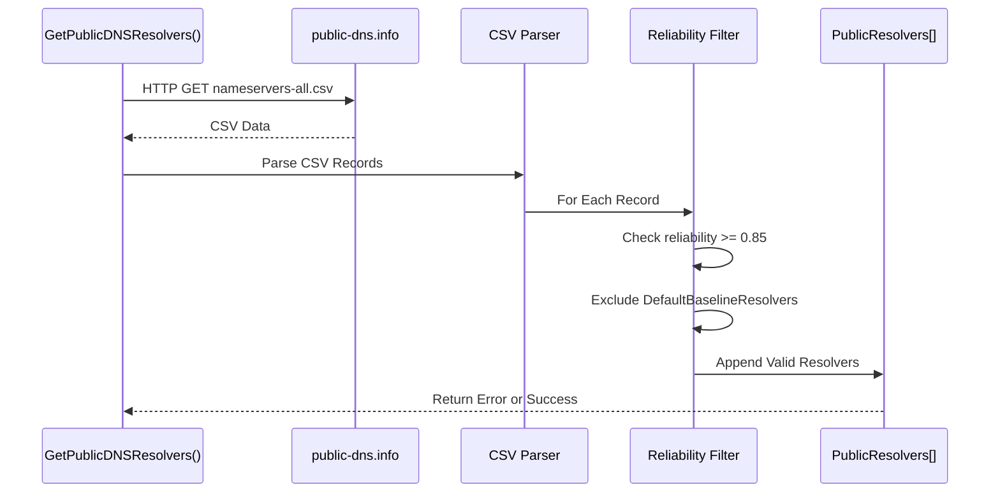
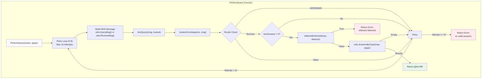
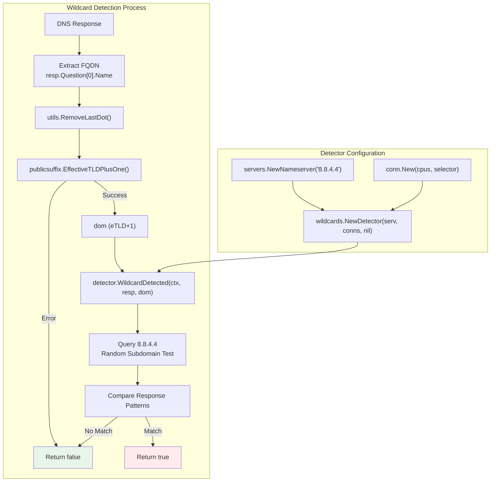
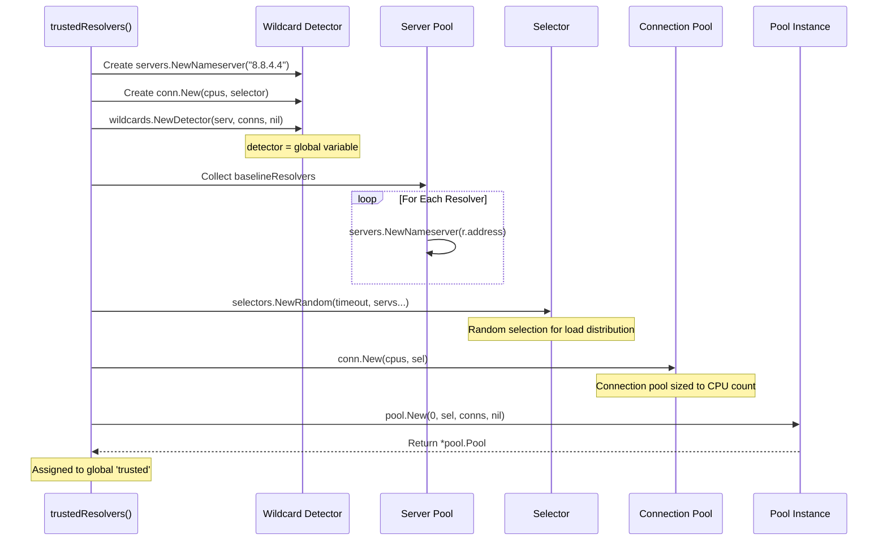
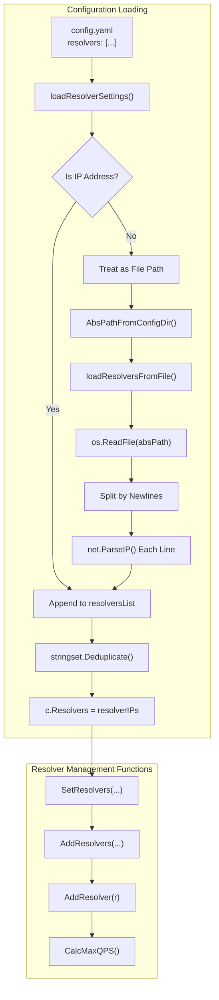

# DNS Resolution System

# DNS Resolution System

Relevant source files

The following files were used as context for generating this wiki page:

- [config/resolvers.go](config/resolvers.go)
- [engine/plugins/support/resolvers.go](engine/plugins/support/resolvers.go)
- [go.mod](go.mod)
- [go.sum](go.sum)

## Purpose and Scope

The DNS Resolution System is the foundational infrastructure that enables Amass to perform comprehensive domain reconnaissance through DNS queries. This system manages a sophisticated dual-tier resolver architecture, executes DNS queries with retry logic and validation, detects DNS wildcards to prevent false positives, and implements rate limiting to ensure reliable operation. All DNS discovery plugins ([#6.2](#6.2)) rely on this system to resolve domain names, enumerate subdomains, and discover IP addresses.

For details on specific DNS discovery plugins that use this system, see [DNS Discovery Plugins](#6.2). For information on how DNS queries are dispatched through the event system, see [Event Dispatcher](#4.1).

---

## Resolver Architecture Overview

Amass employs a **dual-tier DNS resolver architecture** consisting of trusted baseline resolvers and dynamically fetched public resolvers. This design provides both reliability through trusted sources and scale through a larger pool of public DNS servers.

**Sources:** [engine/plugins/support/resolvers.go:25-150](), [config/resolvers.go:23-98]()

---

## Baseline Resolver Configuration

The system uses a hardcoded list of **78 trusted baseline resolvers** with varying QPS (queries per second) rates. These resolvers are carefully selected public DNS services known for reliability.

### Baseline Resolver List

| Resolver Service | IP Address(es) | QPS | Code Reference |
|-----------------|----------------|-----|----------------|
| Google | 8.8.8.8 | 5 | [resolvers.go:32]() |
| Cloudflare | 1.1.1.1, 1.0.0.1 | 3 | [resolvers.go:42-43]() |
| Quad9 | 9.9.9.9, 149.112.112.112 | 2 | [resolvers.go:38-39]() |
| Cisco OpenDNS | 208.67.222.222, 208.67.220.220 | 2 | [resolvers.go:40-41]() |
| Gcore DNS | 95.85.95.85, 2.56.220.2 | 2 | [resolvers.go:34-35]() |
| ControlD | 76.76.2.0, 76.76.10.0 | 2 | [resolvers.go:36-37]() |
| AdGuard DNS | 94.140.14.14, 94.140.15.15, 176.103.130.130, 176.103.130.131 | 1 | [resolvers.go:48-51]() |
| CleanBrowsing | 185.228.168.9, 185.228.169.9 | 1 | [resolvers.go:44-45]() |
| Verisign DNS | 64.6.64.6, 64.6.65.6 | 1 | [resolvers.go:56-57]() |
| *(62 additional resolvers)* | Various | 1 | [resolvers.go:32-85]() |

The complete list includes resolvers from Alternate DNS, Comodo Secure DNS, CenturyLink Level3, CIRA Canadian Shield, OpenNIC, Oracle Dyn, UncensoredDNS, Yandex.DNS, Hurricane Electric, DNS for Family, Freenom World, DNS.WATCH, Neustar, GreenTeamDNS, FreeDNS, and CyberGhost.

**Sources:** [engine/plugins/support/resolvers.go:25-85]()

### QPS Configuration

**Formula:** `MaxDNSQueries = (len(Resolvers) × ResolversQPS) + (len(TrustedResolvers) × TrustedQPS)`

**Default Values:**
- `DefaultQueriesPerPublicResolver = 5` [config/resolvers.go:24]()
- `DefaultQueriesPerBaselineResolver = 15` [config/resolvers.go:27]()

The `CalcMaxQPS()` function [config/resolvers.go:157-159]() recalculates the total system QPS whenever resolvers are added or removed.

**Sources:** [config/resolvers.go:23-159]()

---

## Public Resolver Discovery

In addition to baseline resolvers, Amass can dynamically fetch public DNS resolvers from `public-dns.info`:

**Reliability Threshold:** Only resolvers with `reliability >= 0.85` are accepted [config/resolvers.go:28]().

**Deduplication:** Public resolvers that appear in `DefaultBaselineResolvers` are automatically excluded [config/resolvers.go:88-96]().

**Sources:** [config/resolvers.go:54-98]()

---

## DNS Query Execution

The `PerformQuery()` function is the primary interface for executing DNS queries through the trusted resolver pool:

**Key Functions:**
- `PerformQuery(name string, qtype uint16)` [resolvers.go:90-109]() - Main query interface with retry logic
- `dnsQuery(msg *dns.Msg, r *pool.Pool)` [resolvers.go:120-132]() - Lower-level query execution
- `wildcardDetected(resp *dns.Msg, r *wildcards.Detector)` [resolvers.go:111-118]() - Validates response against wildcard patterns

**Retry Logic:** The function attempts up to **10 queries** before failing [resolvers.go:91](). This aggressive retry strategy ensures high reliability even with transient network issues.

**Sources:** [engine/plugins/support/resolvers.go:90-132]()

---

## Wildcard Detection Mechanism

To prevent false positives from DNS wildcards, Amass uses a dedicated wildcard detector:

**EffectiveTLD+1 Extraction:** The system uses `publicsuffix.EffectiveTLDPlusOne()` [resolvers.go:114]() to extract the registered domain from the FQDN (e.g., "example.com" from "sub.example.com").

**Single Detector Server:** The wildcard detector uses **Google's 8.8.4.4** exclusively [resolvers.go:138](), separate from the main resolver pool, to ensure consistent wildcard detection.

**Sources:** [engine/plugins/support/resolvers.go:111-140]()

---

## Resolver Pool Initialization

The `trustedResolvers()` function [resolvers.go:134-150]() initializes the DNS infrastructure:

**CPU-Based Sizing:** Both the wildcard detector connections and main pool connections are sized based on `runtime.NumCPU()` [resolvers.go:136]() to optimize parallelism.

**Random Selection:** The resolver pool uses `selectors.NewRandom()` [resolvers.go:146]() to randomly distribute queries across all resolvers, providing load balancing and resilience.

**Timeout:** All selectors use a 2-second timeout [resolvers.go:135]().

**Sources:** [engine/plugins/support/resolvers.go:134-150]()

---

## Configuration Integration

The DNS resolution system integrates with the Amass configuration system to load custom resolver lists:

**API Functions:**
- `SetResolvers(resolvers ...string)` [config/resolvers.go:101-104]() - Replace resolver list
- `AddResolvers(resolvers ...string)` [config/resolvers.go:107-112]() - Append to resolver list
- `AddResolver(resolver string)` [config/resolvers.go:115-126]() - Add single resolver with deduplication
- `SetTrustedResolvers(resolvers ...string)` [config/resolvers.go:129-132]() - Replace trusted resolver list
- `AddTrustedResolvers(resolvers ...string)` [config/resolvers.go:135-140]() - Append to trusted resolver list
- `AddTrustedResolver(resolver string)` [config/resolvers.go:143-154]() - Add single trusted resolver

**File Format:** Resolver files must contain one IP address per line [config/resolvers.go:228-245]().

**Sources:** [config/resolvers.go:101-249]()

---

## Integration with DNS Plugins

DNS discovery plugins use the `PerformQuery()` function to execute queries:

| Plugin | Query Types | Function Call Pattern |
|--------|-------------|----------------------|
| dnsTXT | TXT records | `support.PerformQuery(fqdn, dns.TypeTXT)` |
| dnsCNAME | CNAME records | `support.PerformQuery(fqdn, dns.TypeCNAME)` |
| dnsIP | A, AAAA records | `support.PerformQuery(fqdn, dns.TypeA)` |
| dnsSubs | NS, MX, SRV | `support.PerformQuery(fqdn, dns.TypeNS)` |
| dnsReverse | PTR records | `support.PerformQuery(ip, dns.TypePTR)` |

The `support` package [engine/plugins/support/resolvers.go]() provides a shared DNS infrastructure that all DNS plugins import and use, ensuring consistent behavior and centralized resolver management.

**Sources:** [engine/plugins/support/resolvers.go:90-109]()

---

## Key Dependencies

The DNS Resolution System relies on several external libraries:

| Library | Purpose | Import Path |
|---------|---------|-------------|
| miekg/dns | DNS protocol implementation | `github.com/miekg/dns` |
| resolve | Resolver pool management | `github.com/owasp-amass/resolve` |
| publicsuffix | eTLD extraction | `golang.org/x/net/publicsuffix` |
| stringset | Deduplication | `github.com/caffix/stringset` |

The `resolve` library provides:
- `pool.Pool` - Query execution with connection pooling
- `selectors` - Resolver selection strategies (Random, Authoritative)
- `conn` - Connection management
- `wildcards.Detector` - Wildcard pattern detection
- `servers.Nameserver` - Resolver representation

**Sources:** [engine/plugins/support/resolvers.go:14-22](), [go.mod:25,30]()