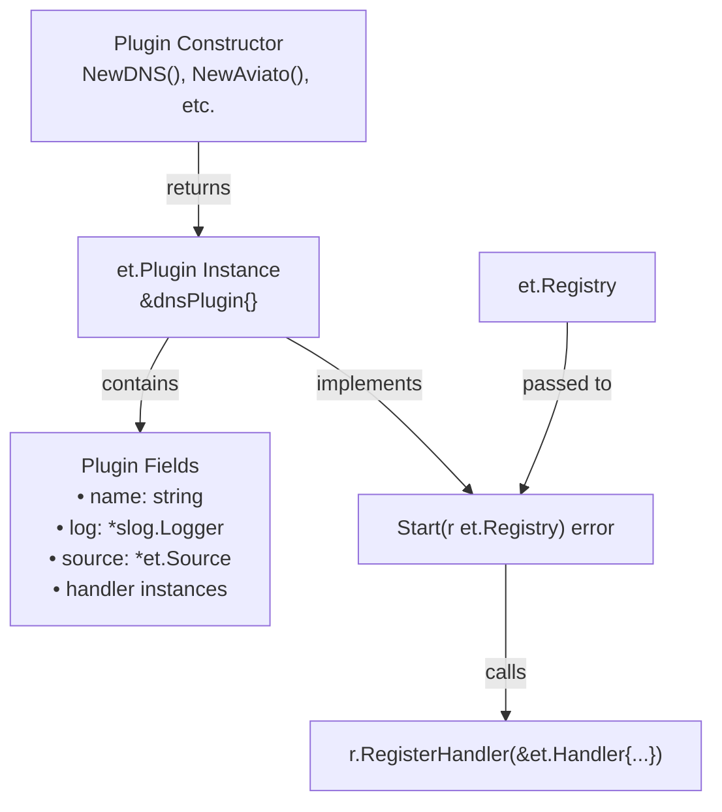
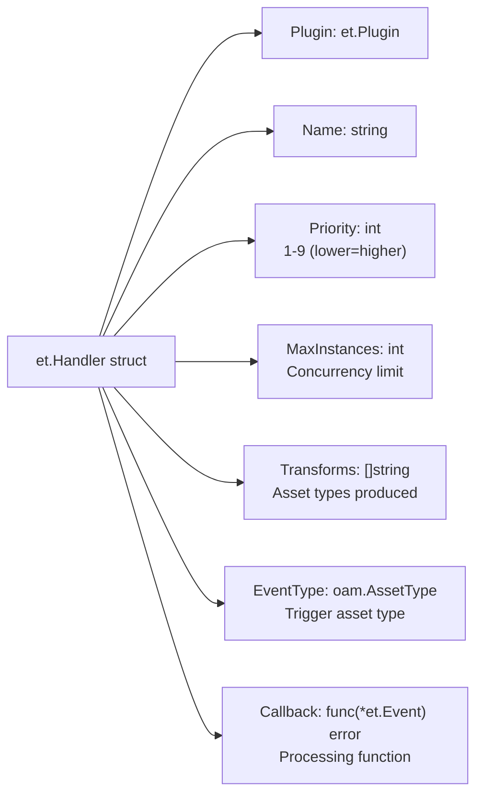
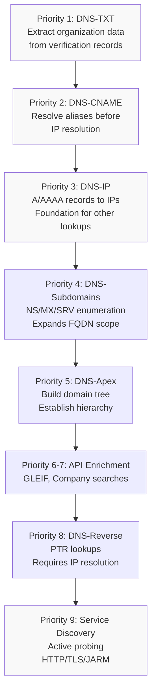
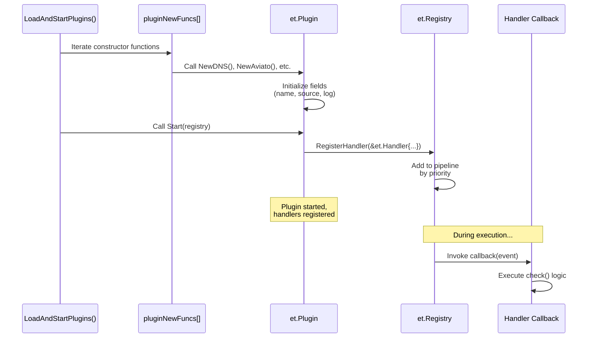
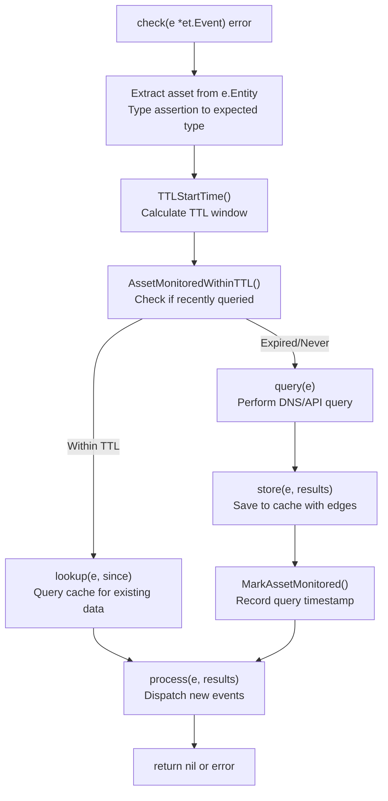
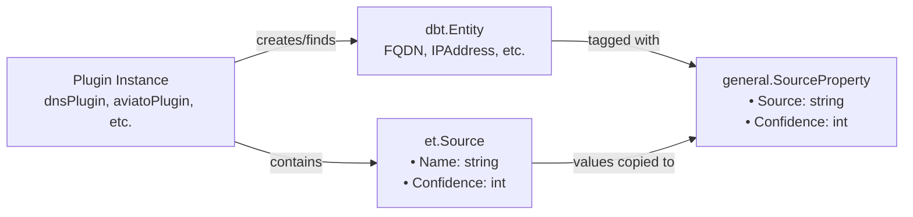
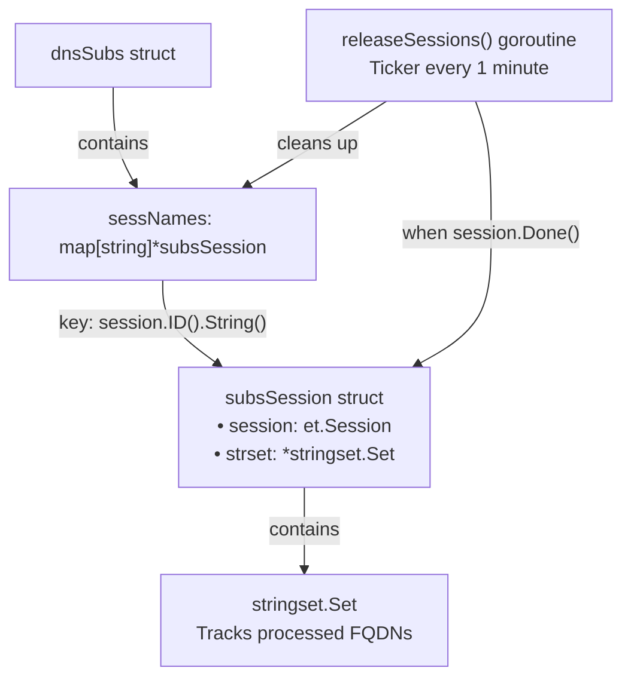
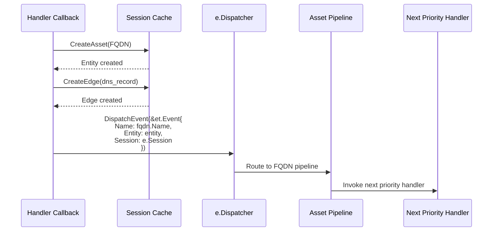
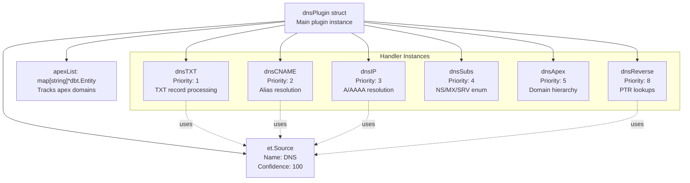

# Plugin Architecture

# Plugin Architecture

<details>
<summary>Relevant source files</summary>

The following files were used as context for generating this wiki page:

- [engine/plugins/dns/apex.go](engine/plugins/dns/apex.go)
- [engine/plugins/dns/cname.go](engine/plugins/dns/cname.go)
- [engine/plugins/dns/ip.go](engine/plugins/dns/ip.go)
- [engine/plugins/dns/plugin.go](engine/plugins/dns/plugin.go)
- [engine/plugins/dns/reverse.go](engine/plugins/dns/reverse.go)
- [engine/plugins/dns/subs.go](engine/plugins/dns/subs.go)
- [engine/plugins/dns/txt.go](engine/plugins/dns/txt.go)
- [engine/plugins/jarm.go](engine/plugins/jarm.go)
- [engine/plugins/load.go](engine/plugins/load.go)
- [engine/plugins/service_discovery/dns/plugin.go](engine/plugins/service_discovery/dns/plugin.go)
- [engine/plugins/service_discovery/dns/txt.go](engine/plugins/service_discovery/dns/txt.go)
- [engine/plugins/support/fingerprinting.go](engine/plugins/support/fingerprinting.go)

</details>


This document explains Amass's plugin architecture, including the `et.Plugin` interface, handler registration, the priority-based execution system, and the lifecycle of plugin components. Understanding this architecture is essential for extending Amass with custom functionality or understanding how existing plugins coordinate to perform reconnaissance.

For information about specific plugin categories and their implementations, see [DNS Discovery Plugins](#6.2), [API Integration Plugins](#6.3), [Service Discovery Plugins](#6.4), and [Enrichment Plugins](#6.5). For the overall engine orchestration, see [Engine Core](#4).

---

## Plugin Interface

All Amass plugins implement the `et.Plugin` interface, which defines three core methods:

```go
type Plugin interface {
    Name() string
    Start(Registry) error
    Stop()
}
```

The `Name()` method returns a unique identifier for the plugin. The `Start()` method receives a `Registry` object and registers one or more handlers that process specific event types. The `Stop()` method performs cleanup when the plugin is shut down.

**Plugin Instantiation Structure**



**Sources:**
- [engine/plugins/dns/plugin.go:22-51]()
- [engine/plugins/service_discovery/dns/plugin.go:14-28]()
- [engine/plugins/jarm.go:21-35]()

---

## Handler Registration

During the `Start()` phase, plugins register handlers with the `Registry` by calling `r.RegisterHandler()`. Each handler defines how to process events for specific asset types.

**Handler Registration Structure**



**Example: DNS Plugin Handler Registration**

The DNS plugin registers six handlers in its `Start()` method, each with a specific priority and callback:

| Handler Name | Priority | EventType | Transforms | Callback | Purpose |
|--------------|----------|-----------|------------|----------|---------|
| DNS-TXT | 1 | `oam.FQDN` | `["FQDN"]` | `dnsTXT.check` | Extract organization IDs from TXT records |
| DNS-CNAME | 2 | `oam.FQDN` | `["FQDN"]` | `dnsCNAME.check` | Resolve CNAME aliases |
| DNS-IP | 3 | `oam.FQDN` | `["IPAddress"]` | `dnsIP.check` | Resolve A/AAAA records to IPs |
| DNS-Subdomains | 4 | `oam.FQDN` | `["FQDN"]` | `dnsSubs.check` | Enumerate NS/MX/SRV records |
| DNS-Apex | 5 | `oam.FQDN` | `["FQDN"]` | `dnsApex.check` | Build domain hierarchy |
| DNS-Reverse | 8 | `oam.IPAddress` | `["FQDN"]` | `dnsReverse.check` | PTR lookups for IPs |

**Sources:**
- [engine/plugins/dns/plugin.go:57-165]()
- [engine/plugins/service_discovery/dns/plugin.go:35-58]()

---

## Priority System

Handlers are executed in priority order from 1 (highest) to 9 (lowest). This ensures that foundational data is collected before dependent processing occurs. For example, TXT records are processed first (priority 1) to identify organizations, then CNAME resolution (priority 2) follows, then IP resolution (priority 3).

**Priority Assignment Rationale**



Lower priority numbers execute first. This ordering prevents redundant work - for instance, CNAME records are resolved before attempting A/AAAA lookups, and IP addresses are discovered before attempting reverse DNS lookups.

**Sources:**
- [engine/plugins/dns/plugin.go:64,85,107,133,154]()
- [engine/plugins/service_discovery/dns/plugin.go:47]()

---

## Plugin Lifecycle

**Plugin Loading and Initialization**



The loading process in [engine/plugins/load.go:68-80]() iterates through the `pluginNewFuncs` array, instantiates each plugin, and calls `Start()`. If any plugin fails to start, all previously started plugins are stopped to ensure a clean state.

**Plugin Constructor Pattern:**

All plugins follow a consistent constructor pattern:
1. Return a struct that implements `et.Plugin`
2. Initialize the plugin's `name` field
3. Create an `et.Source` struct with name and confidence score
4. Initialize any plugin-specific fields (handlers, state)

**Sources:**
- [engine/plugins/load.go:25-86]()
- [engine/plugins/dns/plugin.go:39-51]()

---

## Handler Callback Pattern

Handler callbacks follow a consistent four-phase pattern: **check → lookup → query → store → process**. This pattern ensures efficient TTL-based caching and clean separation of concerns.

**Standard Handler Callback Flow**



**Phase Breakdown:**

1. **Check**: Entry point, validates event and calculates TTL window
2. **Lookup**: Retrieves cached data if available within TTL
3. **Query**: Performs actual DNS/API queries if cache miss or TTL expired
4. **Store**: Persists results to session cache with appropriate edges/properties
5. **Process**: Dispatches new events to trigger cascading discovery

**Example: DNS TXT Handler Implementation**

```
dnsTXT.check(e *et.Event):
    1. Extract FQDN from e.Entity.Asset
    2. Calculate TTL start time for "FQDN" → "FQDN" (DNS plugin)
    3. If AssetMonitoredWithinTTL: call lookup()
    4. Else: call query() and store()
    5. If results found: call process() to dispatch organization events
```

**Sources:**
- [engine/plugins/dns/txt.go:27-52]()
- [engine/plugins/dns/cname.go:34-57]()
- [engine/plugins/dns/ip.go:35-81]()
- [engine/plugins/dns/subs.go:66-90]()

---

## Handler Concurrency Control

The `MaxInstances` field limits concurrent executions of a handler. The DNS plugin sets this to `support.MaxHandlerInstances` for most handlers, allowing high parallelism for I/O-bound DNS queries.

**Concurrency Configuration:**

| Handler Category | MaxInstances | Rationale |
|------------------|--------------|-----------|
| DNS queries | `support.MaxHandlerInstances` | I/O-bound, can parallelize heavily |
| API calls | `support.MaxHandlerInstances` | Rate limits handled internally by each plugin |
| JARM fingerprinting | 25 | CPU-bound crypto operations, limit parallelism |
| Subdomain enumeration | Unspecified (no limit) | Manages own concurrency with session-specific sets |

**Sources:**
- [engine/plugins/dns/plugin.go:65,86,108]()
- [engine/plugins/jarm.go:47]()

---

## Source Tracking

Each plugin defines an `et.Source` struct that identifies the origin of discovered data. This source information is attached to assets and edges as `general.SourceProperty` tags.

**Source Attribution Structure**



**Confidence Scores:**

- DNS plugin: 100 (authoritative DNS data)
- DNS-SD plugin: 80 (inferred from TXT records)
- JARM plugin: 90 (active fingerprinting)
- API plugins: varies by source reliability

**Sources:**
- [engine/plugins/dns/plugin.go:45-48]()
- [engine/plugins/service_discovery/dns/plugin.go:24-27]()
- [engine/plugins/jarm.go:30-33]()

---

## Handler-Specific State Management

Some handlers maintain state across events. For example, `dnsSubs` uses a map of session-specific string sets to track which FQDNs have already been processed, preventing duplicate work.

**dnsSubs State Management Example:**



The `fqdnAvailable()` method checks if an FQDN has already been processed for a given session, inserting it into the session's string set if not. A background goroutine (`releaseSessions()`) periodically cleans up completed sessions.

**Sources:**
- [engine/plugins/dns/subs.go:31-64]()
- [engine/plugins/dns/subs.go:333-382]()

---

## Event Dispatching from Handlers

Handlers generate new events by calling `e.Dispatcher.DispatchEvent()`. This creates a cascading effect where one discovery triggers subsequent handlers.

**Event Dispatch Pattern in Handlers:**



**Example: CNAME Handler Dispatching**

When `dnsCNAME.process()` discovers a CNAME target, it dispatches a new event for the target FQDN. This triggers the entire handler pipeline for that FQDN, starting from priority 1.

**Sources:**
- [engine/plugins/dns/cname.go:124-137]()
- [engine/plugins/dns/ip.go:176-196]()
- [engine/plugins/dns/subs.go:304-331]()

---

## Plugin Registry Integration

The `Registry` interface provides plugins with access to logging and handler registration. When `Start(r et.Registry)` is called, plugins use the registry to:

1. Obtain a scoped logger: `r.Log().WithGroup("plugin").With("name", pluginName)`
2. Register handlers: `r.RegisterHandler(&et.Handler{...})`

**Registry Interface Contract:**

```go
type Registry interface {
    Log() *slog.Logger
    RegisterHandler(*Handler) error
}
```

The registry validates handlers during registration and adds them to the appropriate asset pipeline based on `EventType`. Handlers within a pipeline are sorted by `Priority` before execution begins.

**Sources:**
- [engine/plugins/dns/plugin.go:57-164]()
- [engine/plugins/service_discovery/dns/plugin.go:35-58]()

---

## Complete Plugin Example

**DNS Plugin Structure:**



The DNS plugin demonstrates the full plugin pattern:
- Single plugin struct (`dnsPlugin`) contains multiple handler instances
- Each handler has its own name, callback, and dedicated source
- Shared state (apex list) accessible by all handlers
- Lifecycle methods (`Start`, `Stop`) manage handler registration and cleanup

**Sources:**
- [engine/plugins/dns/plugin.go:22-278]()
- [engine/plugins/dns/txt.go:21-25]()
- [engine/plugins/dns/cname.go:23-27]()
- [engine/plugins/dns/ip.go:23-28]()