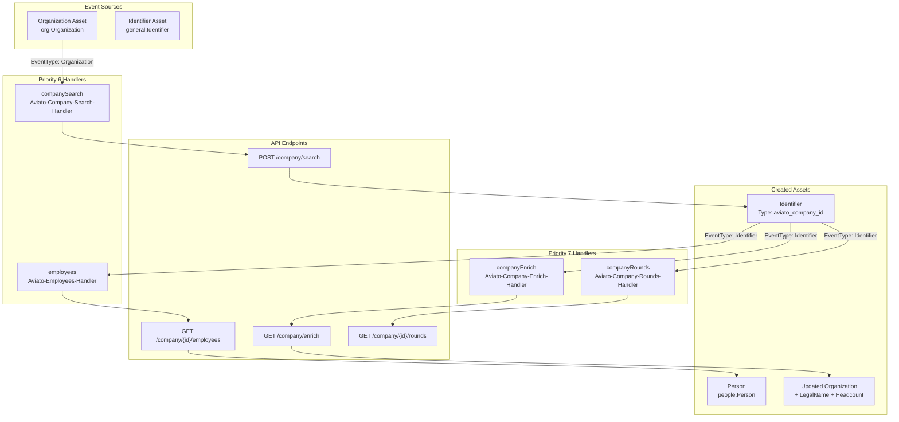
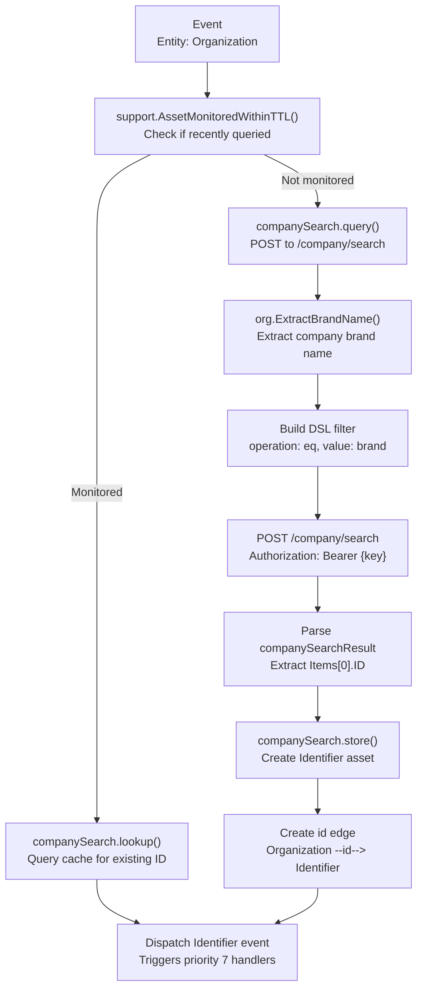
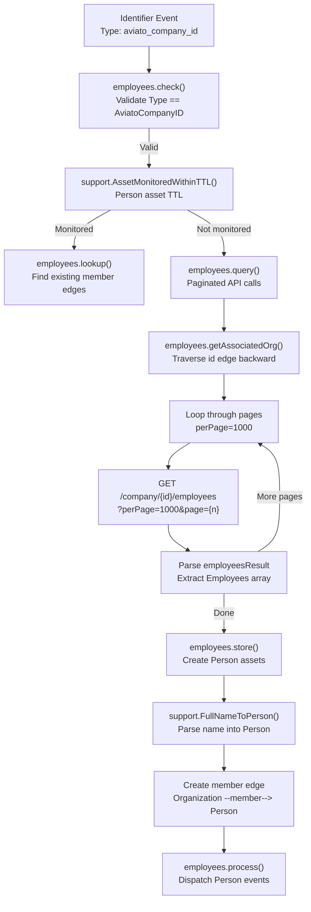
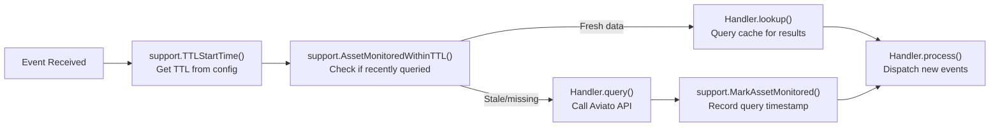

# Aviato Plugin

# Aviato Plugin

<details>
<summary>Relevant source files</summary>

The following files were used as context for generating this wiki page:

- [engine/plugins/api/aviato/company_enrich.go](engine/plugins/api/aviato/company_enrich.go)
- [engine/plugins/api/aviato/company_search.go](engine/plugins/api/aviato/company_search.go)
- [engine/plugins/api/aviato/employees.go](engine/plugins/api/aviato/employees.go)
- [engine/plugins/api/aviato/plugin.go](engine/plugins/api/aviato/plugin.go)
- [engine/plugins/api/aviato/types.go](engine/plugins/api/aviato/types.go)

</details>


## Purpose and Scope

The Aviato Plugin integrates with the Aviato API to enrich organization data with company information, funding rounds, and employee relationships. This plugin discovers employees working at target organizations, enriches company profiles with legal names and operational details, and tracks funding round information. For information about other API integration plugins, see [API Integration Plugins](#6.3). For DNS-based discovery, see [DNS Discovery Plugins](#6.2).

## Overview

The Aviato plugin (`engine/plugins/api/aviato/`) provides four specialized handlers that query the Aviato commercial API at `https://data.api.aviato.co/`. The plugin operates on `Organization` and `Identifier` assets, creating enriched organization profiles and discovering employee relationships through the `member` edge type.

The plugin implements rate limiting at 0.5 requests per second (one request every 2 seconds) and supports multiple API keys for distributing load. All handlers use TTL-based caching to avoid redundant API queries within configured time windows.

**Sources:** [engine/plugins/api/aviato/plugin.go:1-132](), [engine/plugins/api/aviato/types.go:1-304]()

## Plugin Architecture

The Aviato plugin is instantiated via `NewAviato()` [engine/plugins/api/aviato/plugin.go:18-29]() and registers four handlers during its `Start()` method [engine/plugins/api/aviato/plugin.go:35-108]():

| Handler Name | Priority | Event Type | Transforms | Purpose |
|-------------|----------|------------|------------|---------|
| `Aviato-Company-Search-Handler` | 6 | `Organization` | `Identifier` | Search for Aviato company ID |
| `Aviato-Employees-Handler` | 6 | `Identifier` | `Person` | Discover employee relationships |
| `Aviato-Company-Enrich-Handler` | 7 | `Identifier` | `Organization` | Enrich organization data |
| `Aviato-Company-Rounds-Handler` | 7 | `Identifier` | `Organization`, `Account`, `FundsTransfer` | Discover funding rounds |

The plugin struct [engine/plugins/api/aviato/types.go:19-28]() maintains:
- `name`: Plugin identifier ("Aviato")
- `log`: Structured logger
- `rlimit`: Rate limiter (0.5 QPS)
- `companyEnrich`, `companyRounds`, `employees`, `companySearch`: Handler instances
- `source`: Source metadata with 90% confidence rating

**Sources:** [engine/plugins/api/aviato/plugin.go:35-108](), [engine/plugins/api/aviato/types.go:19-28]()

## Handler Registration and Data Flow



**Sources:** [engine/plugins/api/aviato/plugin.go:35-108](), [engine/plugins/api/aviato/types.go:19-28]()

## Company Search Handler

The `companySearch` handler [engine/plugins/api/aviato/company_search.go:1-204]() converts `Organization` assets into Aviato-specific company identifiers. This handler executes first (priority 6) in the Aviato pipeline.

### Search Process



### DSL Query Structure

The handler constructs a domain-specific language (DSL) query [engine/plugins/api/aviato/company_search.go:101-114]():

```json
{
  "dsl": {
    "offset": 0,
    "limit": 10,
    "filters": [
      {
        "name": {
          "operation": "eq",
          "value": "<extracted_brand_name>"
        }
      }
    ]
  }
}
```

The `dsl` struct [engine/plugins/api/aviato/types.go:30-39]() and `dslEvalObj` struct [engine/plugins/api/aviato/types.go:36-39]() define this query format. The handler uses `org.ExtractBrandName()` [engine/plugins/api/aviato/company_search.go:89]() to normalize organization names before querying.

### Response Processing

The API returns a `companySearchResult` [engine/plugins/api/aviato/types.go:41-55]() containing matching companies. The handler selects the first match [engine/plugins/api/aviato/company_search.go:154]() and creates an `Identifier` asset with:
- `Type`: `AviatoCompanyID` constant [engine/plugins/api/aviato/types.go:16]()
- `ID`: Company ID from API response
- `UniqueID`: Formatted as `aviato_company_id:{company_id}`

**Sources:** [engine/plugins/api/aviato/company_search.go:1-204](), [engine/plugins/api/aviato/types.go:30-55]()

## Company Enrich Handler

The `companyEnrich` handler [engine/plugins/api/aviato/company_enrich.go:1-213]() receives `Identifier` events with type `AviatoCompanyID` and enriches the associated `Organization` asset with detailed company information.

### Enrichment Data Flow

```mermaid
graph LR
    IdentEvent["Identifier Event<br/>Type: aviato_company_id"]
    
    ValidateType["Check oamid.Type<br/>== AviatoCompanyID"]
    
    CheckTTL["support.AssetMonitoredWithinTTL()<br/>Check freshness"]
    
    FindOrg["companyEnrich.lookup()<br/>Traverse id edge to Organization"]
    
    QueryEnrich["GET /company/enrich?id={id}<br/>companyEnrichResult"]
    
    UpdateOrg["Update Organization fields<br/>Active, LegalName, Headcount"]
    
    CreateLegalID["Create Identifier<br/>Type: legal_name"]
    
    LinkLegalID["Create id edge<br/>Organization --id--> LegalName"]
    
    DispatchOrg["Dispatch Organization event<br/>With enriched data"]
    
    IdentEvent --> ValidateType
    ValidateType -->|"Valid"| CheckTTL
    CheckTTL -->|"Not fresh"| FindOrg
    FindOrg --> QueryEnrich
    QueryEnrich --> UpdateOrg
    UpdateOrg --> CreateLegalID
    CreateLegalID --> LinkLegalID
    LinkLegalID --> DispatchOrg
```



### Enrichment Fields

The `companyEnrichResult` struct [engine/plugins/api/aviato/types.go:152-278]() contains extensive company data. The handler updates the following `Organization` fields [engine/plugins/api/aviato/company_enrich.go:145-197]():

| Field | Source | Type |
|-------|--------|------|
| `Active` | `data.Status == "active"` | boolean |
| `NonProfit` | `data.IsNonProfit` | boolean |
| `Headcount` | `data.Headcount` | integer |
| `LegalName` | `data.LegalName` | string |

When a `LegalName` is discovered and the organization lacks one, the handler:
1. Creates a new `Identifier` asset with type `general.LegalName` [engine/plugins/api/aviato/company_enrich.go:159-163]()
2. Links it to the organization via an `id` edge [engine/plugins/api/aviato/company_enrich.go:183]()
3. Tags the identifier with `SourceProperty` [engine/plugins/api/aviato/company_enrich.go:172-175]()

**Sources:** [engine/plugins/api/aviato/company_enrich.go:1-213](), [engine/plugins/api/aviato/types.go:152-278]()

## Employees Handler

The `employees` handler [engine/plugins/api/aviato/employees.go:1-256]() discovers employee relationships by querying the Aviato API for personnel associated with a company. This handler operates at priority 6, alongside the company search handler.

### Employee Discovery Process



### Pagination Handling

The employees endpoint supports pagination with the following parameters [engine/plugins/api/aviato/employees.go:123-178]():
- `perPage`: Set to 1000 records per page
- `page`: Zero-indexed page number
- Response includes `Pages` field indicating total pages

The handler iterates through API keys if rate limits or errors occur, allowing failover across multiple keys [engine/plugins/api/aviato/employees.go:128-178]().

### Employee Data Structure

Each employee record (`employeeResult` [engine/plugins/api/aviato/types.go:130-150]()) contains:
- `Person.FullName`: Used to create `people.Person` asset
- `Person.ID`: Aviato person identifier
- `PositionList`: Array of job titles and descriptions
- `StartDate`/`EndDate`: Employment period

The handler uses `support.FullNameToPerson()` [engine/plugins/api/aviato/employees.go:207]() to parse full names into structured `Person` assets with `GivenName` and `FamilyName` fields.

### Relationship Creation

For each employee, the handler:
1. Creates a `people.Person` asset [engine/plugins/api/aviato/employees.go:212-217]()
2. Adds `SourceProperty` metadata [engine/plugins/api/aviato/employees.go:219-226]()
3. Creates a `member` edge from Organization to Person [engine/plugins/api/aviato/employees.go:229-230]()
4. Dispatches a new Person event [engine/plugins/api/aviato/employees.go:245-249]()

**Sources:** [engine/plugins/api/aviato/employees.go:1-256](), [engine/plugins/api/aviato/types.go:119-150]()

## Company Rounds Handler

The `companyRounds` handler [engine/plugins/api/aviato/types.go:62-65]() is registered to discover funding round information. This handler is defined but the implementation file was not provided in the source files. Based on the type definitions, it processes `companyFundingRound` data [engine/plugins/api/aviato/types.go:73-112]() which includes:

| Field | Description |
|-------|-------------|
| `MoneyRaised` | Funding amount |
| `Stage` | Round type (Seed, Series A, etc.) |
| `AnnouncedOn` | Date of announcement |
| `LeadPersonInvestors` | Lead individual investors |
| `PersonInvestors` | Other individual investors |
| `LeadCompanyInvestors` | Lead institutional investors |
| `CompanyInvestors` | Other institutional investors |

The handler is registered with priority 7 and transforms to `Organization`, `Account`, and `FundsTransfer` asset types [engine/plugins/api/aviato/plugin.go:59-72]().

**Sources:** [engine/plugins/api/aviato/types.go:62-112](), [engine/plugins/api/aviato/plugin.go:59-72]()

## API Integration Details

### Rate Limiting

The plugin implements strict rate limiting via `golang.org/x/time/rate` [engine/plugins/api/aviato/types.go:11]():

```go
limit := rate.Every(2 * time.Second)
rlimit: rate.NewLimiter(limit, 1)
```

This enforces a maximum of **0.5 requests per second** (one request every 2 seconds) across all handlers. Each handler calls `rlimit.Wait(context.TODO())` before making API requests [engine/plugins/api/aviato/employees.go:133](), [engine/plugins/api/aviato/company_enrich.go:105](), [engine/plugins/api/aviato/company_search.go:97]().

**Sources:** [engine/plugins/api/aviato/plugin.go:19-23](), [engine/plugins/api/aviato/types.go:22]()

### Authentication

All API requests use Bearer token authentication [engine/plugins/api/aviato/employees.go:130-131]():

```
Authorization: Bearer {apikey}
```

The plugin retrieves API keys from the configuration system [engine/plugins/api/aviato/employees.go:35-48]():
1. Calls `e.Session.Config().GetDataSourceConfig()`
2. Extracts `Apikey` from each credential in `ds.Creds`
3. Iterates through keys on failure for redundancy

### API Endpoints

| Endpoint | Method | Purpose | Handler |
|----------|--------|---------|---------|
| `/company/search` | POST | Search by company name | `companySearch` |
| `/company/enrich?id={id}` | GET | Get company details | `companyEnrich` |
| `/company/{id}/employees?perPage={n}&page={p}` | GET | List employees | `employees` |
| `/company/{id}/rounds` | GET | Get funding rounds | `companyRounds` |

All endpoints use the base URL `https://data.api.aviato.co` and require `Content-Type: application/json` headers.

**Sources:** [engine/plugins/api/aviato/company_search.go:122](), [engine/plugins/api/aviato/company_enrich.go:109](), [engine/plugins/api/aviato/employees.go:137]()

### Error Handling

All handlers implement consistent error handling [engine/plugins/api/aviato/employees.go:139-155]():
1. Check HTTP status code (expect 200)
2. Validate response body is non-empty
3. Check for error strings in response
4. Log errors with structured logging via `e.Session.Log().Error()`
5. Continue to next API key on failure

The handlers use 20-second timeouts for all HTTP requests [engine/plugins/api/aviato/employees.go:134](), [engine/plugins/api/aviato/company_enrich.go:106](), [engine/plugins/api/aviato/company_search.go:98]().

**Sources:** [engine/plugins/api/aviato/employees.go:134-155](), [engine/plugins/api/aviato/company_enrich.go:106-127](), [engine/plugins/api/aviato/company_search.go:98-139]()

## TTL-Based Caching Strategy

All handlers implement TTL-based caching to prevent redundant API queries. The caching flow:



The TTL configuration specifies cache duration for each asset type pair:
- **Company Search**: `Organization` → `Identifier` TTL
- **Company Enrich**: `Identifier` → `Organization` TTL
- **Employees**: `Identifier` → `Person` TTL

Each handler calls `support.AssetMonitoredWithinTTL()` [engine/plugins/api/aviato/employees.go:62](), [engine/plugins/api/aviato/company_enrich.go:60](), [engine/plugins/api/aviato/company_search.go:57]() to check if the asset was queried within the TTL window. If cached data exists, the handler retrieves it from the cache instead of making an API request.

**Sources:** [engine/plugins/api/aviato/employees.go:50-72](), [engine/plugins/api/aviato/company_enrich.go:49-71](), [engine/plugins/api/aviato/company_search.go:46-67]()

## Configuration

To enable the Aviato plugin, add the following to your `config.yaml`:

```yaml
datasources:
  - name: Aviato
    ttl: 4320  # 72 hours
    creds:
      - apikey: "your_aviato_api_key_1"
      - apikey: "your_aviato_api_key_2"  # Optional: additional keys for redundancy
```

Multiple API keys provide failover capability when rate limits are hit or errors occur. The plugin automatically rotates through available keys.

The `ttl` value controls how long cached results remain valid before re-querying the API. A 72-hour TTL balances data freshness with API quota conservation.

**Sources:** [engine/plugins/api/aviato/employees.go:35-48](), [engine/plugins/api/aviato/company_enrich.go:34-47](), [engine/plugins/api/aviato/company_search.go:31-44]()