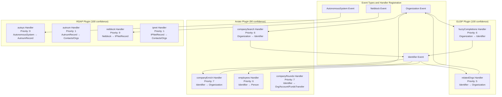
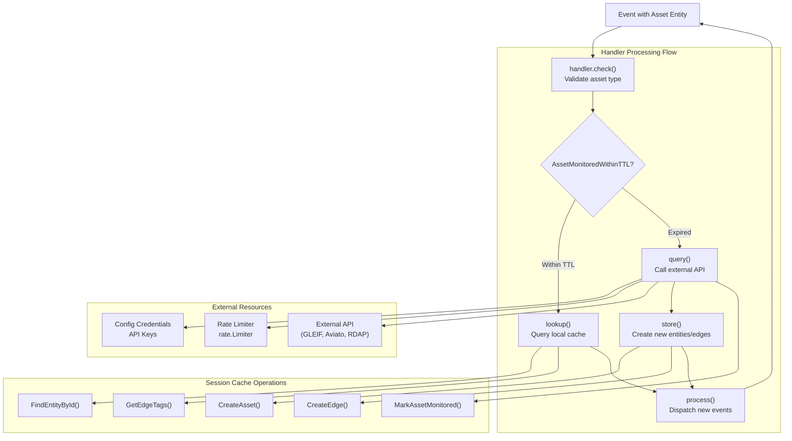
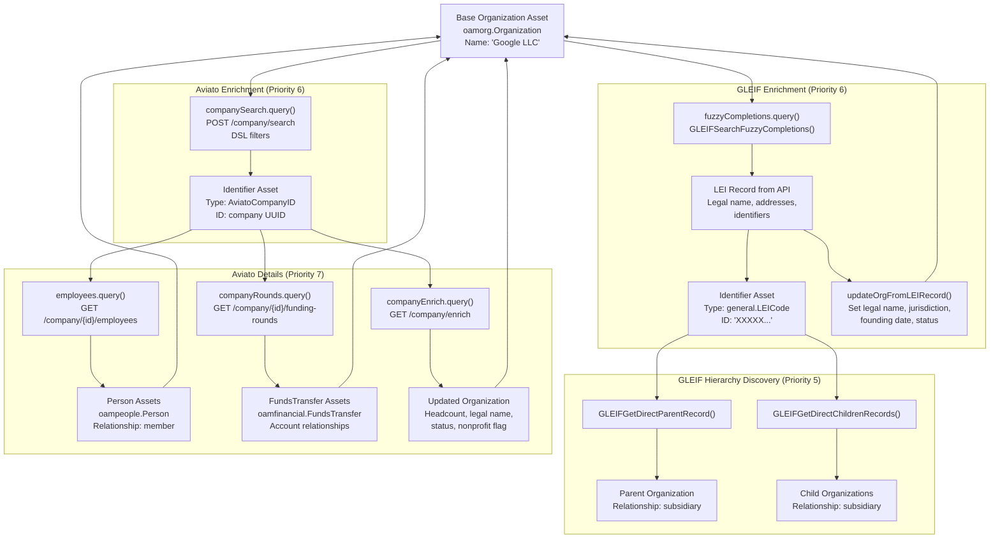
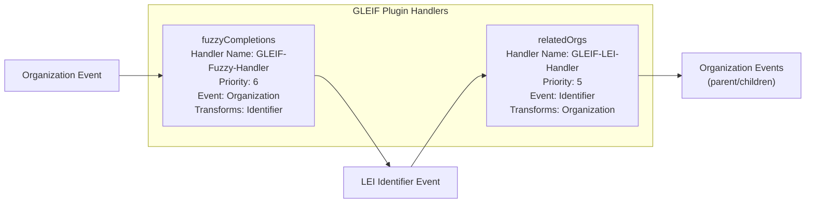
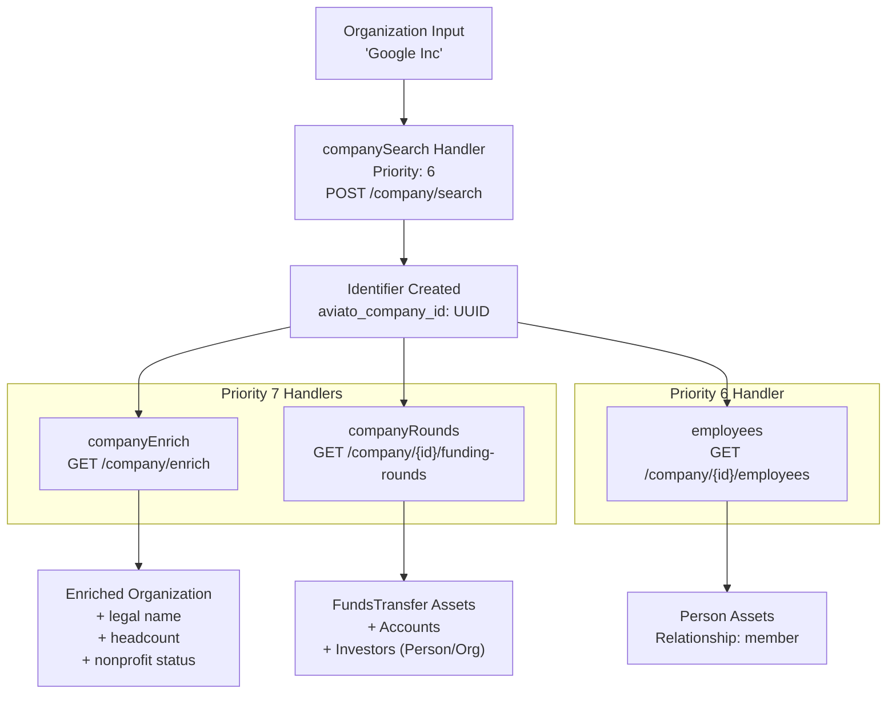

# API Integration Plugins

# API Integration Plugins

<details>
<summary>Relevant source files</summary>

The following files were used as context for generating this wiki page:

- [engine/plugins/api/aviato/company_enrich.go](engine/plugins/api/aviato/company_enrich.go)
- [engine/plugins/api/aviato/company_rounds.go](engine/plugins/api/aviato/company_rounds.go)
- [engine/plugins/api/aviato/company_search.go](engine/plugins/api/aviato/company_search.go)
- [engine/plugins/api/aviato/employees.go](engine/plugins/api/aviato/employees.go)
- [engine/plugins/api/aviato/plugin.go](engine/plugins/api/aviato/plugin.go)
- [engine/plugins/api/aviato/types.go](engine/plugins/api/aviato/types.go)
- [engine/plugins/api/gleif/fuzzy.go](engine/plugins/api/gleif/fuzzy.go)
- [engine/plugins/api/gleif/lei_record.go](engine/plugins/api/gleif/lei_record.go)
- [engine/plugins/api/gleif/org_lei.go](engine/plugins/api/gleif/org_lei.go)
- [engine/plugins/api/gleif/plugin.go](engine/plugins/api/gleif/plugin.go)
- [engine/plugins/api/gleif/related.go](engine/plugins/api/gleif/related.go)
- [engine/plugins/api/gleif/types.go](engine/plugins/api/gleif/types.go)
- [engine/plugins/api/rdap/plugin.go](engine/plugins/api/rdap/plugin.go)
- [engine/plugins/enrich/tls_cert.go](engine/plugins/enrich/tls_cert.go)
- [engine/plugins/support/database.go](engine/plugins/support/database.go)
- [engine/plugins/whois/domain_record.go](engine/plugins/whois/domain_record.go)

</details>


## Purpose and Scope

This page provides an overview of the API integration plugin category within the OWASP Amass plugin ecosystem. API integration plugins query external authoritative data sources to enrich discovered assets with additional context such as organization identifiers, employee information, funding data, and registration records. These plugins extend beyond active DNS probing by leveraging third-party APIs to build comprehensive asset profiles.

For general plugin architecture concepts including handler registration and priority systems, see [Plugin Architecture](#6.1). For DNS-based discovery plugins, see [DNS Discovery Plugins](#6.2). For active service probing, see [Service Discovery Plugins](#6.4).

## Overview

API integration plugins query external APIs to enrich asset data after initial discovery. Unlike DNS plugins that actively probe DNS infrastructure, API plugins consume structured data from authoritative sources. The primary categories are:

- **Legal Entity Identification**: GLEIF plugin queries for Legal Entity Identifiers (LEI) and organizational hierarchies
- **Company Intelligence**: Aviato plugin provides employee discovery, funding rounds, and company enrichment data
- **Registration Data**: RDAP and WHOIS plugins query registration authorities for domain, IP, and ASN ownership information

All API plugins follow common architectural patterns: TTL-based caching to avoid redundant queries, rate limiting to respect API constraints, API key management through the configuration system, and source attribution with confidence scoring.

## Plugin Catalog

| Plugin | API Source | Primary Asset Types | Transformations | Priority Range |
|--------|------------|---------------------|-----------------|----------------|
| **GLEIF** | GLEIF API (gleif.org) | `Organization` → `Identifier` (LEI) | Organization hierarchies, legal names | 5-6 |
| **Aviato** | Aviato API (aviato.co) | `Organization` → `Person`, `FundsTransfer` | Employees, funding rounds, company data | 6-7 |
| **RDAP** | RDAP servers | `AutonomousSystem`, `Netblock` → `AutnumRecord`, `IPNetRecord` | Contact records, registration data | 1, 9 |
| **WHOIS** | WHOIS servers | `DomainRecord` | Name servers, registrant contacts | Variable |

**GLEIF Plugin** queries the Global Legal Entity Identifier Foundation API to find LEI codes for organizations using fuzzy name matching. It discovers parent-subsidiary relationships and enriches organization data with legal names and identifiers. See [GLEIF Plugin](#6.3.1) for details.

**Aviato Plugin** provides corporate intelligence by searching for companies, retrieving employee lists, funding round information, and company enrichment data including headcount, legal status, and identifiers. See [Aviato Plugin](#6.3.2) for details.

**RDAP Plugin** queries Registration Data Access Protocol servers for authoritative ownership information about IP networks and autonomous systems. It creates contact records with location, email, and phone data.

**WHOIS Plugin** performs traditional WHOIS queries for domain registration data, extracting name servers, registrant contacts, and administrative information.

## Handler Registration and Priorities



**Sources:** [engine/plugins/api/gleif/plugin.go:30-67](), [engine/plugins/api/aviato/plugin.go:35-107](), [engine/plugins/api/rdap/plugin.go:64-176]()

Each plugin registers multiple handlers with the `Registry` during the `Start()` lifecycle method. Handlers specify their priority (1-9, lower = higher), the event type they consume, and the asset types they produce (transforms). The dispatcher routes events to handlers based on registered event types, executing them in priority order within asset pipelines.

## API Plugin Architecture Patterns



**Sources:** [engine/plugins/api/gleif/fuzzy.go:25-49](), [engine/plugins/api/aviato/company_search.go:25-67](), [engine/plugins/support/database.go:131-164]()

### TTL-Based Monitoring Pattern

All API plugins implement a lookup-before-query pattern to avoid redundant API calls. The flow:

1. **TTL Check**: Call `support.TTLStartTime()` to calculate the timestamp before which data is considered stale ([engine/plugins/support/database.go:131-148]())
2. **Monitored Check**: Call `support.AssetMonitoredWithinTTL()` to check if the asset has been queried recently ([engine/plugins/support/database.go:150-164]())
3. **Lookup Path**: If within TTL, query the session cache using `OutgoingEdges()` or `IncomingEdges()` with the TTL timestamp
4. **Query Path**: If stale or missing, call the external API, store results, and mark with `support.MarkAssetMonitored()` ([engine/plugins/support/database.go:131-148]())

Example from GLEIF fuzzy handler:

```go
since, err := support.TTLStartTime(e.Session.Config(),
    string(oam.Organization), string(oam.Identifier), fc.plugin.name)

var id *dbt.Entity
if support.AssetMonitoredWithinTTL(e.Session, e.Entity, fc.plugin.source, since) {
    id = fc.lookup(e, e.Entity, since)  // Query cache
} else {
    id = fc.query(e, e.Entity)  // Call API
    support.MarkAssetMonitored(e.Session, e.Entity, fc.plugin.source)
}
```

**Sources:** [engine/plugins/api/gleif/fuzzy.go:31-43]()

### Rate Limiting Pattern

API plugins use `golang.org/x/time/rate.Limiter` to enforce API rate limits:

```go
// Aviato plugin initialization
limit := rate.Every(2 * time.Second)
return &aviato{
    rlimit: rate.NewLimiter(limit, 1),
}

// In query method
_ = ae.plugin.rlimit.Wait(context.TODO())
resp, err := http.RequestWebPage(ctx, &http.Request{URL: u, Header: headers})
```

**Sources:** [engine/plugins/api/aviato/plugin.go:18-28](), [engine/plugins/api/aviato/employees.go:133]()

### API Credential Management

Plugins retrieve API keys from the session configuration:

```go
ds := e.Session.Config().GetDataSourceConfig(ae.plugin.name)
if ds == nil || len(ds.Creds) == 0 {
    return nil
}

var keys []string
for _, cr := range ds.Creds {
    if cr != nil && cr.Apikey != "" {
        keys = append(keys, cr.Apikey)
    }
}
```

**Sources:** [engine/plugins/api/aviato/company_search.go:31-44]()

### Source Attribution

All created assets and edges receive source properties with confidence scores:

```go
_, err = e.Session.Cache().CreateEntityProperty(ident, &general.SourceProperty{
    Source:     cs.name,
    Confidence: cs.plugin.source.Confidence,
})

edge, err := session.Cache().CreateEdge(&dbt.Edge{...})
_, err = session.Cache().CreateEdgeProperty(edge, &general.SourceProperty{
    Source:     g.source.Name,
    Confidence: conf,
})
```

**Sources:** [engine/plugins/api/aviato/company_search.go:171-179](), [engine/plugins/api/gleif/plugin.go:85-89]()

## Data Enrichment Flow



**Sources:** [engine/plugins/api/gleif/fuzzy.go:68-106](), [engine/plugins/api/gleif/related.go:98-104](), [engine/plugins/api/aviato/company_search.go:87-155](), [engine/plugins/api/aviato/company_enrich.go:90-143](), [engine/plugins/api/aviato/employees.go:113-184](), [engine/plugins/api/aviato/company_rounds.go:132-198]()

The diagram shows cascading enrichment: a base `Organization` asset triggers GLEIF's fuzzy search (priority 6), which creates an LEI `Identifier`. That identifier then triggers hierarchy discovery (priority 5), finding parent and child organizations. Simultaneously, Aviato's company search (priority 6) creates an Aviato identifier, which triggers enrichment handlers (priority 7) to add employees, funding data, and organizational details.

## GLEIF Plugin Details

The GLEIF plugin specializes in Legal Entity Identifier (LEI) lookup and organizational hierarchy discovery.

### Handler Structure



**Sources:** [engine/plugins/api/gleif/plugin.go:30-67](), [engine/plugins/api/gleif/types.go:13-29]()

### Fuzzy Matching Algorithm

The fuzzy completions handler implements sophisticated matching logic:

1. **Brand Extraction**: Extracts brand name using `org.ExtractBrandName()` ([engine/plugins/api/gleif/fuzzy.go:83]())
2. **API Query**: Calls `org.GLEIFSearchFuzzyCompletions()` to get candidate LEI records ([engine/plugins/api/gleif/fuzzy.go:85]())
3. **Name Matching**: Uses `org.NameMatch()` to find exact and partial matches ([engine/plugins/api/gleif/fuzzy.go:120]())
4. **Scoring System**:
   - Exact match: 30 points
   - Single match bonus: +30 points
   - Location match: +40 points
   - Partial match: Uses Smith-Waterman-Gotoh algorithm for string similarity (0-30 points)

```go
// Exact match scoring
for _, match := range exact {
    score := 30
    if len(exact) == 1 {
        score += 30  // Only one exact match
    }
    if org.LocMatch(e, orgent, r) {
        score += 40  // Location matches
    }
    if score > conf {
        rec = r  // Keep highest scoring record
    }
}
```

**Sources:** [engine/plugins/api/gleif/fuzzy.go:108-176]()

### Organization Enrichment

The `updateOrgFromLEIRecord()` method enriches organization assets with LEI data:

- Legal name and alternate names as identifiers ([engine/plugins/api/gleif/org_lei.go:65-77]())
- Founding date, jurisdiction, registration ID ([engine/plugins/api/gleif/org_lei.go:79-86]())
- Legal address, headquarters address, other addresses as locations ([engine/plugins/api/gleif/org_lei.go:88-97]())
- Additional identifiers: BIC codes, MIC codes, OpenCorp ID, S&P Global ID ([engine/plugins/api/gleif/org_lei.go:99-102]())

For detailed GLEIF plugin implementation, see [GLEIF Plugin](#6.3.1).

## Aviato Plugin Details

The Aviato plugin provides corporate intelligence through four specialized handlers.

### Custom Identifier Types

Aviato defines custom identifier types for tracking entities:

```go
const (
    AviatoPersonID  = "aviato_person_id"
    AviatoCompanyID = "aviato_company_id"
)
```

**Sources:** [engine/plugins/api/aviato/types.go:14-17]()

### Handler Pipeline



**Sources:** [engine/plugins/api/aviato/plugin.go:35-107]()

### Company Search DSL

The company search handler uses a Domain-Specific Language (DSL) for filtering:

```go
filters := []map[string]*dslEvalObj{
    {
        "name": &dslEvalObj{
            Operation: "eq",
            Value:     brand,
        },
    },
}

reqDSL := &dsl{
    Offset:  0,
    Limit:   10,
    Filters: filters,
}
```

**Sources:** [engine/plugins/api/aviato/company_search.go:101-114]()

### Funding Rounds Data Model

The company rounds handler creates complex relationships:

1. **Organization Checking Account**: Creates or finds a default checking account for the target organization ([engine/plugins/api/aviato/company_rounds.go:285-333]())
2. **Seed Account**: Creates a temporary account representing the funding source ([engine/plugins/api/aviato/company_rounds.go:336-374]())
3. **FundsTransfer Asset**: Represents the funding round with amount, currency, and date ([engine/plugins/api/aviato/company_rounds.go:241-246]())
4. **Investor Discovery**: Creates Person and Organization assets for investors, linking them to the seed account ([engine/plugins/api/aviato/company_rounds.go:377-533]())

For detailed Aviato plugin implementation, see [Aviato Plugin](#6.3.2).

## RDAP Plugin Details

The RDAP plugin queries Registration Data Access Protocol servers for authoritative registration data about IP networks and autonomous systems.

### Bootstrap Client Configuration

RDAP uses a bootstrap client with disk caching:

```go
c := cache.NewDiskCache()
c.Dir = filepath.Join(outdir, ".openrdap")

bs := &bootstrap.Client{Cache: c}
rd.client = &rdap.Client{
    HTTP:      httpClient,
    Bootstrap: bs,
}
```

**Sources:** [engine/plugins/api/rdap/plugin.go:67-93]()

### Four-Handler Architecture

The RDAP plugin implements bi-directional transformations:

- **autsys**: `AutonomousSystem` → `AutnumRecord` (Priority 9) - Creates registration records from ASN assets
- **autnum**: `AutnumRecord` → `FQDN`, `ContactRecord`, `Organization`, etc. (Priority 1) - Expands registration records
- **netblock**: `Netblock` → `IPNetRecord` (Priority 9) - Creates registration records from netblock assets
- **ipnet**: `IPNetRecord` → `FQDN`, `ContactRecord`, `Organization`, etc. (Priority 1) - Expands registration records

**Sources:** [engine/plugins/api/rdap/plugin.go:95-176]()

### VCard Processing

RDAP responses contain VCard contact data, which the plugin parses to create `ContactRecord` assets with related entities:

```go
v := entity.VCard
if adr := v.GetFirst("adr"); adr != nil {
    if label, ok := adr.Parameters["label"]; ok {
        addr := strings.Join(strings.Split(s, "\n"), " ")
        if loc := support.StreetAddressToLocation(addr); loc != nil {
            // Create Location asset
        }
    }
}
if email := strings.ToLower(v.Email()); email != "" {
    // Create Identifier asset with EmailAddress type
}
if phone := support.PhoneToOAMPhone(v.Tel(), "", v.Country()); phone != nil {
    // Create Phone asset
}
```

**Sources:** [engine/plugins/api/rdap/plugin.go:227-266]()

## WHOIS Plugin Details

The WHOIS plugin handles traditional WHOIS queries for domain registration data.

### Domain Record Transformation

The `domrec` handler processes `DomainRecord` events and creates relationships to discovered assets:

- Name servers as `FQDN` assets ([engine/plugins/whois/domain_record.go:138-150]())
- WHOIS server as `FQDN` asset ([engine/plugins/whois/domain_record.go:151-161]())
- Contact records for registrar, registrant, admin, technical, and billing contacts ([engine/plugins/whois/domain_record.go:171-182]())

### Contact Record Creation

Each contact type creates a `ContactRecord` with relationships to:

- `Person` assets (if name parses successfully)
- `Location` assets (from street address parsing)
- `Identifier` assets (email addresses)
- `Phone` assets (regular and fax numbers)
- `URL` assets (referral URLs)
- `Organization` assets (organization name)

**Sources:** [engine/plugins/whois/domain_record.go:191-280]()

## Integration with Support Utilities

API plugins rely heavily on the support package utilities documented in [Plugin Support Utilities](#6.6):

- `support.TTLStartTime()` - Calculate TTL timestamp
- `support.AssetMonitoredWithinTTL()` - Check if asset was recently queried
- `support.MarkAssetMonitored()` - Mark asset as monitored
- `support.StreetAddressToLocation()` - Parse addresses into Location assets
- `support.FullNameToPerson()` - Parse names into Person assets
- `support.PhoneToOAMPhone()` - Parse phone numbers into Phone assets
- `support.ProcessAssetsWithSource()` - Create edges with source attribution
- `org.CreateOrgAsset()` - Create Organization assets with proper relationships
- `org.ExtractBrandName()` - Extract brand from organization name
- `org.NameMatch()` - Match organization names
- `org.LocMatch()` - Match organization locations

**Sources:** [engine/plugins/support/database.go:28-261]()