# Service Discovery Plugins

# Service Discovery Plugins

<details>
<summary>Relevant source files</summary>

The following files were used as context for generating this wiki page:

- [engine/plugins/brute/alterations.go](engine/plugins/brute/alterations.go)
- [engine/plugins/ip_netblock.go](engine/plugins/ip_netblock.go)
- [engine/plugins/jarm.go](engine/plugins/jarm.go)
- [engine/plugins/load.go](engine/plugins/load.go)
- [engine/plugins/service_discovery/dns/plugin.go](engine/plugins/service_discovery/dns/plugin.go)
- [engine/plugins/service_discovery/dns/txt.go](engine/plugins/service_discovery/dns/txt.go)
- [engine/plugins/service_discovery/http_probes/fqdn_endpoint.go](engine/plugins/service_discovery/http_probes/fqdn_endpoint.go)
- [engine/plugins/service_discovery/http_probes/ipaddr_endpoint.go](engine/plugins/service_discovery/http_probes/ipaddr_endpoint.go)
- [engine/plugins/service_discovery/http_probes/plugin.go](engine/plugins/service_discovery/http_probes/plugin.go)
- [engine/plugins/support/fingerprinting.go](engine/plugins/support/fingerprinting.go)
- [engine/plugins/support/support.go](engine/plugins/support/support.go)
- [engine/plugins/whois/bgptools/autsys.go](engine/plugins/whois/bgptools/autsys.go)
- [engine/plugins/whois/bgptools/netblock.go](engine/plugins/whois/bgptools/netblock.go)
- [engine/plugins/whois/bgptools/plugin.go](engine/plugins/whois/bgptools/plugin.go)
- [engine/plugins/whois/fqdn_lookup.go](engine/plugins/whois/fqdn_lookup.go)

</details>


## Purpose and Scope

This page documents the **Service Discovery Plugins** in OWASP Amass, which actively probe and identify running services on discovered assets. These plugins transform passive asset discoveries (FQDNs and IP addresses) into detailed service information including HTTP endpoints, TLS certificates, and service fingerprints.

For information about DNS-based discovery (subdomain enumeration, IP resolution), see [DNS Discovery Plugins](#6.2). For enrichment plugins that expand scope or add metadata, see [Enrichment Plugins](#6.5).

**Sources:** [engine/plugins/load.go:18-19](), [engine/plugins/load.go:45](), [engine/plugins/load.go:53](), [engine/plugins/load.go:63]()

---

## Overview

Service discovery plugins operate at **priority 9** in the event processing pipeline, running after DNS resolution and API enrichment have identified basic assets. These plugins:

1. **Actively probe** HTTP/HTTPS endpoints on configured ports
2. **Extract TLS certificates** from HTTPS connections
3. **Fingerprint services** using JARM TLS fingerprinting
4. **Discover organization affiliations** via DNS TXT records containing site verification tokens
5. **Create Service assets** with detailed metadata (headers, response bodies, certificates)

The service discovery subsystem includes three primary plugins:

| Plugin Name | Handler Priority | Event Types | Purpose |
|-------------|-----------------|-------------|---------|
| DNS-SD | 9 | FQDN | Extracts organization identifiers from TXT records |
| HTTP-Probes | 9 | FQDN, IPAddress | Probes HTTP/HTTPS services, extracts TLS certificates |
| JARM-Fingerprint | N/A | Service | Generates JARM fingerprints for TLS services |

**Sources:** [engine/plugins/service_discovery/dns/plugin.go:14-63](), [engine/plugins/service_discovery/http_probes/plugin.go:25-96](), [engine/plugins/jarm.go:21-61]()

---

## System Architecture

### Service Discovery Flow

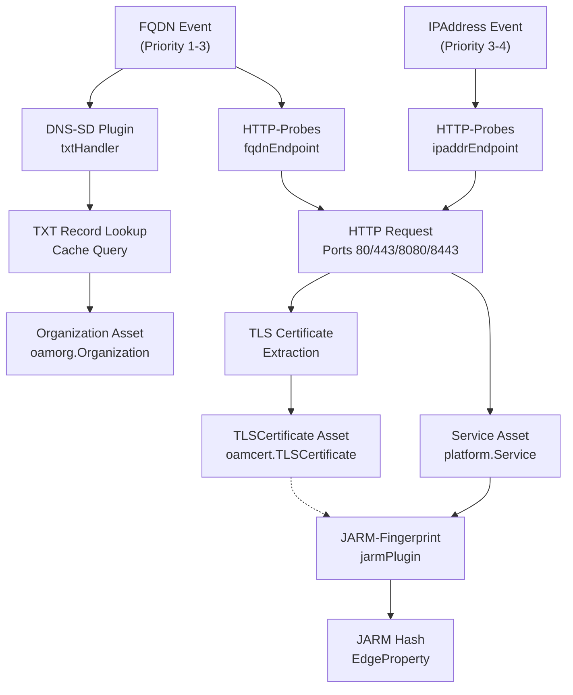

**Diagram: Service Discovery Plugin Event Flow**

This diagram shows how service discovery plugins transform FQDN and IPAddress events into rich Service assets with associated certificates and fingerprints. The DNS-SD plugin runs independently on FQDN events, while HTTP-Probes creates the Service assets that JARM-Fingerprint subsequently enriches.

**Sources:** [engine/plugins/service_discovery/dns/plugin.go:35-58](), [engine/plugins/service_discovery/http_probes/plugin.go:49-92](), [engine/plugins/jarm.go:44-56]()

---

## DNS-SD Plugin

The **DNS-SD** (DNS Service Discovery) plugin analyzes DNS TXT records to discover organization affiliations through site verification tokens. When services like Google, Microsoft, or Adobe verify domain ownership, they require placing specific TXT records that contain company identifiers.

### Plugin Registration

The DNS-SD plugin is implemented as `dnsPlugin` and registers a single handler:

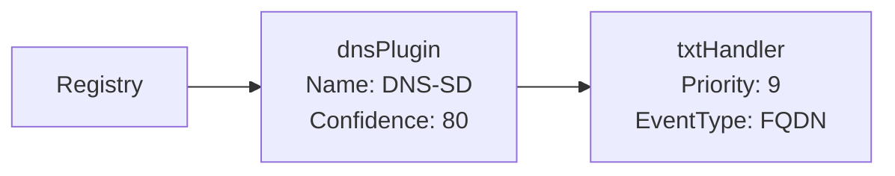

**Diagram: DNS-SD Plugin Structure**

**Sources:** [engine/plugins/service_discovery/dns/plugin.go:14-28](), [engine/plugins/service_discovery/dns/plugin.go:35-58]()

### TXT Record Processing

The `txtHandler` processes FQDN events by:

1. **Querying the cache** for existing TXT records using `GetEntityTags` with relationship type `"dns_record"`
2. **Filtering for TXT records** by checking `prop.Header.RRType == dns.TypeTXT`
3. **Matching verification prefixes** against a database of 100+ known service verification patterns
4. **Creating Organization assets** when matches are found

**Processing Flow:**

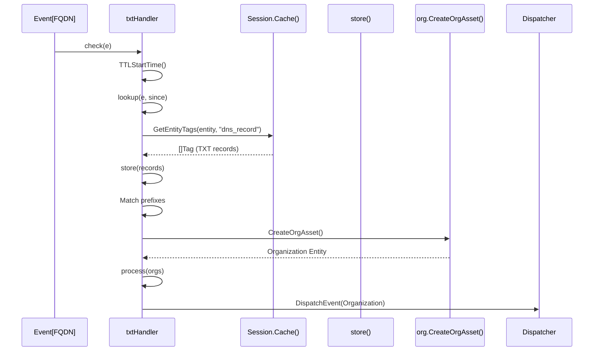

**Diagram: DNS-SD TXT Record Processing Sequence**

**Sources:** [engine/plugins/service_discovery/dns/txt.go:29-91]()

### Site Verification Database

The plugin maintains a comprehensive database of verification record prefixes mapped to organization names:

| Verification Prefix | Organization | Example |
|---------------------|--------------|---------|
| `google-site-verification=` | Google LLC | google-site-verification=abc123 |
| `MS=` | Microsoft Corporation | MS=ms12345678 |
| `apple-domain-verification=` | Apple Inc. | apple-domain-verification=xyz789 |
| `facebook-domain-verification=` | Meta Platforms, Inc. | facebook-domain-verification=abc |
| `amazonses=` / `amazonses:` | Amazon Web Services, Inc. | amazonses=key123 |

The complete database includes **100+ verification patterns** for services including Zoom, Slack, Adobe, Shopify, Stripe, Twilio, and many others.

**Sources:** [engine/plugins/service_discovery/dns/txt.go:93-182]()

### Organization Asset Creation

When a verification record is matched, the handler creates an Organization asset with a `"verified_for"` relationship:

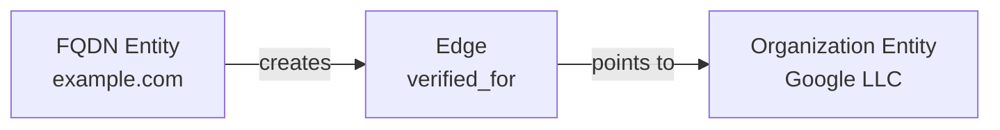

**Diagram: Organization Relationship Creation**

The creation uses the `org.CreateOrgAsset` helper function, which:
- Creates or retrieves the Organization asset
- Establishes the `verified_for` relationship edge
- Attaches source attribution with confidence 80

**Sources:** [engine/plugins/service_discovery/dns/txt.go:55-79](), [engine/plugins/support/org/org.go:1-100]()

---

## HTTP-Probes Plugin

The **HTTP-Probes** plugin is the core service discovery mechanism, actively probing HTTP and HTTPS endpoints to discover running web services, extract TLS certificates, and collect service metadata.

### Plugin Architecture

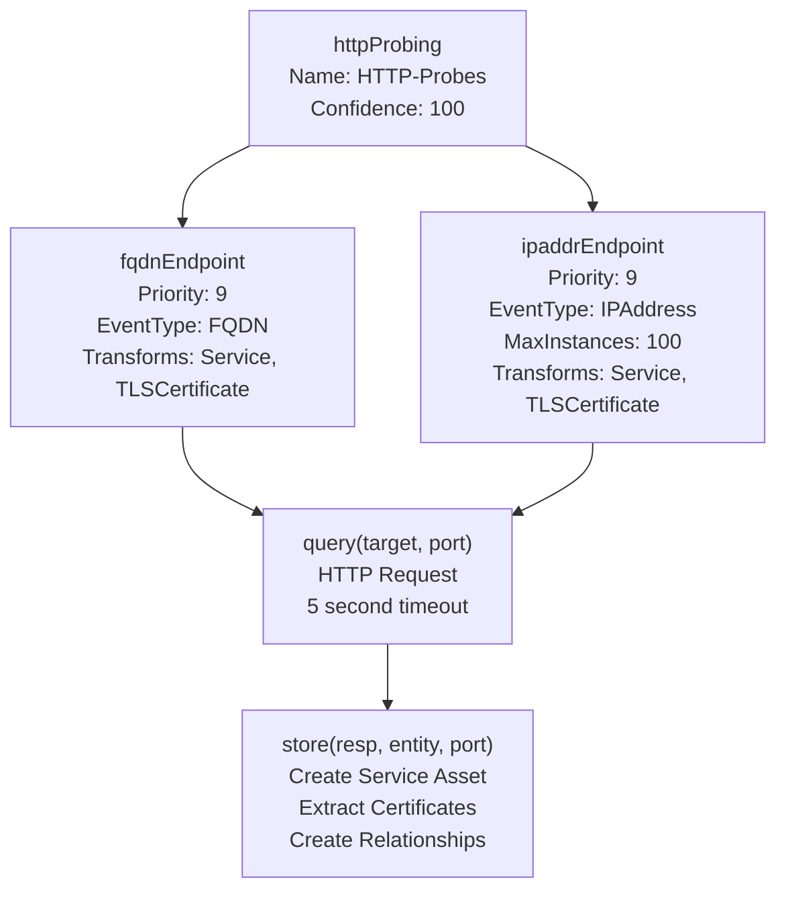

**Diagram: HTTP-Probes Plugin Component Structure**

**Sources:** [engine/plugins/service_discovery/http_probes/plugin.go:25-96]()

### Port Configuration

The plugin probes ports specified in the session configuration (`Config.Scope.Ports`). By default, common HTTP/HTTPS ports are targeted:

- **Port 80**: HTTP
- **Port 443**: HTTPS
- **Port 8080**: HTTP (alternate)
- **Port 8443**: HTTPS (alternate)

Protocol selection logic:
```
if port == 80 || port == 8080:
    protocol = "http"
else:
    protocol = "https"
```

**Sources:** [engine/plugins/service_discovery/http_probes/fqdn_endpoint.go:100-109](), [engine/plugins/service_discovery/http_probes/ipaddr_endpoint.go:102-115]()

### FQDN Endpoint Handler

The `fqdnEndpoint` handler processes FQDN events:

**Filtering Criteria:**
1. **Active scanning enabled**: `Config.Active == true`
2. **DNS resolution exists**: Asset has A, AAAA, or CNAME records
3. **In scope**: FQDN passes scope validation

**TTL-Based Caching:**
The handler implements TTL-based monitoring to avoid redundant probes:

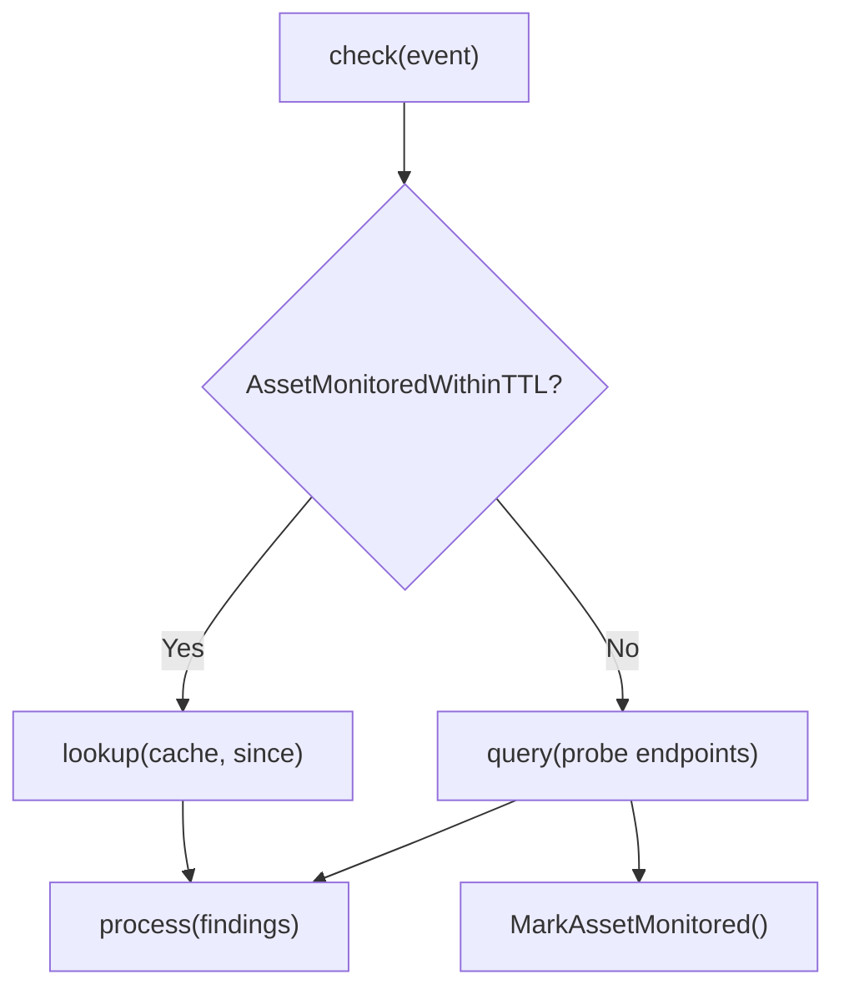

**Diagram: FQDN Handler TTL Logic**

**Sources:** [engine/plugins/service_discovery/http_probes/fqdn_endpoint.go:30-70](), [engine/plugins/service_discovery/http_probes/fqdn_endpoint.go:72-94]()

### IPAddress Endpoint Handler

The `ipaddrEndpoint` handler processes IPAddress events with additional capabilities:

**Additional Filtering:**
1. **Reserved address check**: Skips RFC 1918 private addresses
2. **Scope validation**: IP must be in configured CIDR ranges

**IP Address Sweep:**
When an IP address is probed, the handler initiates a **sweep** of nearby addresses:

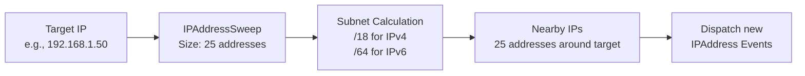

**Diagram: IP Address Sweep Mechanism**

The sweep callback creates new IPAddress assets and dispatches events for each:

```go
func sweepCallback(e *Event, ip *IPAddress, src *Source) {
    entity := Session.Cache().CreateAsset(ip)
    CreateEntityProperty(entity, SourceProperty)
    Dispatcher.DispatchEvent(Event{Entity: entity})
}
```

**Sources:** [engine/plugins/service_discovery/http_probes/ipaddr_endpoint.go:30-72](), [engine/plugins/service_discovery/http_probes/ipaddr_endpoint.go:124-136](), [engine/plugins/support/support.go:164-195]()

### HTTP Request Execution

The `query` function performs the actual HTTP request using a custom HTTP client:

**Request Parameters:**
- **Context timeout**: 5 seconds
- **URL construction**: `protocol://target:port`
- **Custom headers**: Standard browser user-agent
- **TLS verification**: Disabled to allow probing all services

**Sources:** [engine/plugins/service_discovery/http_probes/plugin.go:98-108]()

### Service Asset Creation

The `store` function creates comprehensive Service assets from HTTP responses:

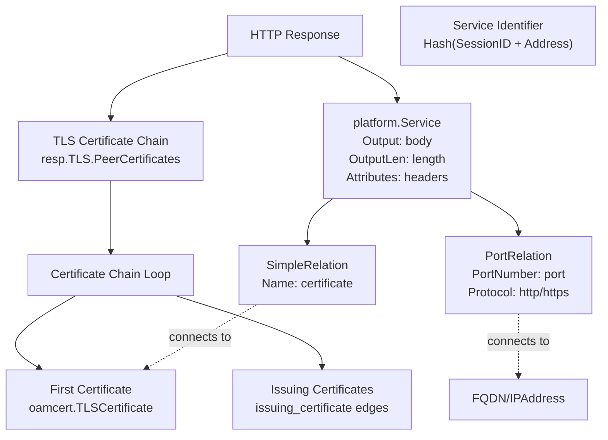

**Diagram: Service Asset and Certificate Chain Creation**

**Key Asset Types:**

1. **Service Asset** (`platform.Service`):
   - `ID`: Unique hash-based identifier
   - `Output`: HTTP response body (truncated)
   - `OutputLen`: Response length in bytes
   - `Attributes`: HTTP headers as map

2. **TLS Certificate Asset** (`oamcert.TLSCertificate`):
   - `SerialNumber`: X.509 serial number
   - `Subject`: Certificate subject DN
   - `Issuer`: Certificate issuer DN
   - `NotBefore` / `NotAfter`: Validity period
   - Full X.509 certificate data

**Relationship Types:**

| From Asset | Relation | To Asset | Purpose |
|------------|----------|----------|---------|
| FQDN/IPAddress | `port` (PortRelation) | Service | Associates service with endpoint and port |
| Service | `certificate` | TLSCertificate | Links service to its TLS certificate |
| TLSCertificate | `issuing_certificate` | TLSCertificate | Certificate chain hierarchy |

**Sources:** [engine/plugins/service_discovery/http_probes/plugin.go:110-198]()

### Service Identifier Generation

Service assets use a deterministic identifier generated by hashing the session ID and target address:

```go
hash := maphash.Hash
hash.SetSeed(MakeSeed())
serv := ServiceWithIdentifier(&hash, session.ID(), addr)
```

This ensures:
- **Uniqueness** within a session
- **Deterministic** regeneration
- **Collision resistance** across different targets

**Sources:** [engine/plugins/service_discovery/http_probes/plugin.go:150](), [engine/plugins/support/service.go:1-100]()

---

## JARM Fingerprint Plugin

The **JARM-Fingerprint** plugin generates TLS fingerprints for HTTPS services using the JARM fingerprinting technique, which analyzes server TLS handshake responses to create unique service signatures.

### Plugin Behavior

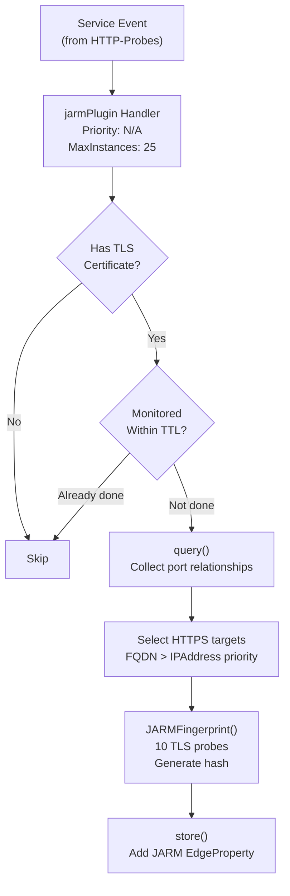

**Diagram: JARM Fingerprinting Flow**

**Sources:** [engine/plugins/jarm.go:63-161]()

### JARM Fingerprinting Process

The JARM fingerprinting technique:

1. **Generates 10 TLS probes** with different TLS versions and cipher configurations
2. **Sends each probe** to the target service
3. **Captures ServerHello responses**
4. **Parses response characteristics**: TLS version, cipher suite, extensions
5. **Computes hash** from concatenated responses
6. **Returns 62-character fingerprint**

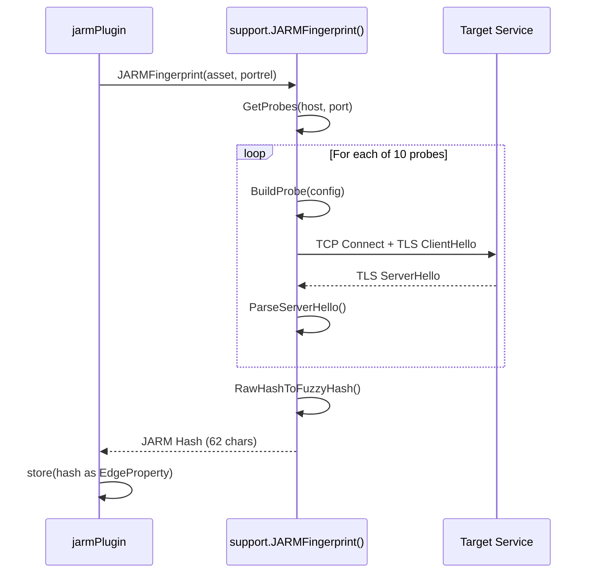

**Diagram: JARM Fingerprinting Sequence**

**Sources:** [engine/plugins/support/fingerprinting.go:22-81]()

### JARM Hash Storage

The JARM hash is stored as an **EdgeProperty** on the `port` relationship edge:

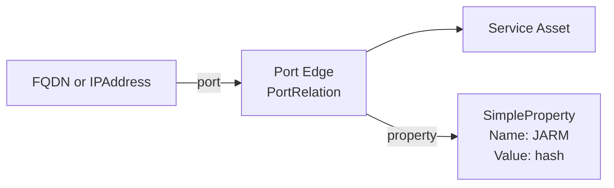

**Diagram: JARM Hash Storage Location**

This storage approach:
- Associates the fingerprint with the specific port/protocol combination
- Allows different fingerprints for different ports on the same host
- Maintains relationship-level metadata rather than entity-level

**Sources:** [engine/plugins/jarm.go:153-160]()

### JARM Probe Configuration

The JARM algorithm uses 10 distinct probes:

| Probe # | TLS Version | Cipher Suite Order | Extensions | ALPN |
|---------|-------------|-------------------|------------|------|
| 1 | TLS 1.2 | Forward | Standard | HTTP/1.1 |
| 2 | TLS 1.2 | Reverse | Standard | HTTP/1.1 |
| 3 | TLS 1.2 | Forward | Rare | HTTP/1.1 |
| 4 | TLS 1.2 | Forward | Standard | None |
| 5 | TLS 1.1 | Forward | Standard | None |
| 6 | TLS 1.2 | Forward | Standard | None |
| 7 | TLS 1.3 | Forward | Standard | HTTP/1.1 |
| 8 | TLS 1.3 | Reverse | Standard | HTTP/1.1 |
| 9 | TLS 1.3 | Forward | Invalid | HTTP/1.1 |
| 10 | TLS 1.2 | Forward | Standard | HTTP/1.1 |

Each probe variant tests different server behaviors, creating a unique signature.

**Sources:** External JARM specification (referenced by [engine/plugins/support/fingerprinting.go:42]())

---

## Service Asset Data Model

### Service Entity Structure

The `platform.Service` asset type represents a discovered network service:

```go
type Service struct {
    ID         string            // Unique identifier (hash-based)
    Output     string            // Response body (truncated)
    OutputLen  int               // Full response length
    Attributes map[string]string // HTTP headers
}
```

**Key Attributes:**

| Attribute | Description | Example |
|-----------|-------------|---------|
| `Server` | HTTP Server header | "nginx/1.18.0" |
| `Content-Type` | Response content type | "text/html; charset=utf-8" |
| `X-Powered-By` | Technology identifier | "PHP/7.4.3" |
| `Set-Cookie` | Cookie headers | Session tokens, flags |

**Sources:** [open-asset-model/platform/service.go:1-50]()

### TLS Certificate Chain

TLS certificate chains are represented as linked entities:

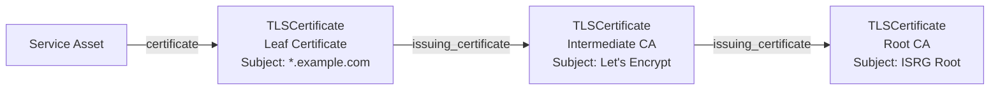

**Diagram: TLS Certificate Chain Representation**

The chain extraction occurs during HTTP response processing, iterating through `resp.TLS.PeerCertificates` and creating edges between consecutive certificates.

**Sources:** [engine/plugins/service_discovery/http_probes/plugin.go:118-148]()

### Relationship Properties

Service discovery plugins attach detailed properties to edges:

**SourceProperty** (on all edges):
```go
type SourceProperty struct {
    Source     string  // Plugin name: "HTTP-Probes"
    Confidence int     // Confidence: 100
}
```

**PortRelation** (FQDN/IP → Service):
```go
type PortRelation struct {
    Name       string  // "port"
    PortNumber int     // 443
    Protocol   string  // "https"
}
```

**SimpleProperty** (JARM hash on PortRelation):
```go
type SimpleProperty struct {
    PropertyName  string  // "JARM"
    PropertyValue string  // "29d29d00029d29d00041d..."
}
```

**Sources:** [open-asset-model/general/relations.go:1-100]()

---

## Integration with Event Pipeline

### Priority and Sequencing

Service discovery plugins execute at **priority 9**, near the end of the standard discovery pipeline:

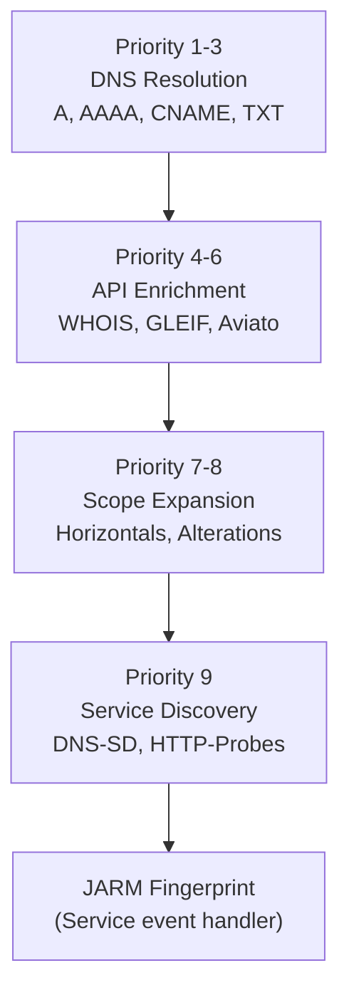

**Diagram: Service Discovery Pipeline Position**

This sequencing ensures:
- **DNS resolution completes first**, providing IP addresses for probing
- **API enrichment finishes**, avoiding redundant external queries
- **Scope validation works**, preventing out-of-scope service probing
- **Service events trigger JARM**, creating a cascading enrichment

**Sources:** [engine/plugins/service_discovery/dns/plugin.go:47](), [engine/plugins/service_discovery/http_probes/plugin.go:60](), [engine/plugins/jarm.go:44-56]()

### Transform Declarations

Service discovery plugins declare their output transformations:

```go
// HTTP-Probes declares it produces:
Transforms: []string{
    string(oam.Service),           // Creates Service assets
    string(oam.TLSCertificate),    // Extracts certificates
}

// JARM declares it enriches:
Transforms: []string{
    string(oam.Service),           // Adds JARM fingerprints
}
```

This allows the Registry to:
- **Route events** to appropriate handlers
- **Track dependencies** between plugins
- **Enable/disable** specific transformations via configuration

**Sources:** [engine/plugins/service_discovery/http_probes/plugin.go:61-65](), [engine/plugins/jarm.go:48]()

### Asynchronous Probing

HTTP probing uses **goroutines** for non-blocking execution:

```go
if !AssetMonitoredWithinTTL(session, entity, source, since) {
    go func() {
        findings := query(event, entity)
        if len(findings) > 0 {
            process(event, findings)
        }
    }()
    MarkAssetMonitored(session, entity, source)
}
```

This design:
- **Prevents blocking** the main event processing loop
- **Allows parallel probing** of multiple targets
- **Respects TTL caching** to avoid duplicate work
- **Uses MaxInstances** limits to control concurrency

**Sources:** [engine/plugins/service_discovery/http_probes/fqdn_endpoint.go:58-63](), [engine/plugins/service_discovery/http_probes/ipaddr_endpoint.go:58-64]()

---

## Configuration

### Active Scanning Toggle

Service discovery requires explicit enablement via the `Active` configuration flag:

```yaml
# config.yaml
scope:
  active: true
  ports:
    - 80
    - 443
    - 8080
    - 8443
```

When `Config.Active == false`, HTTP-Probes and JARM plugins skip processing entirely.

**Sources:** [engine/plugins/service_discovery/http_probes/fqdn_endpoint.go:36-38](), [engine/plugins/service_discovery/http_probes/ipaddr_endpoint.go:36-38]()

### Port Configuration

The `Scope.Ports` slice defines which ports to probe:

```go
// Default configuration
Config.Scope.Ports = []int{80, 443, 8080, 8443}

// Custom configuration for extended probing
Config.Scope.Ports = []int{80, 443, 8000, 8080, 8443, 8888}
```

Each configured port is probed for every in-scope FQDN and IP address.

**Sources:** [engine/plugins/service_discovery/http_probes/fqdn_endpoint.go:100-109](), [engine/plugins/service_discovery/http_probes/ipaddr_endpoint.go:102-115]()

### TTL Configuration

Service discovery respects TTL settings to avoid redundant probes:

```yaml
# config.yaml
transformations:
  - from: "IPAddress"
    to: "Service"
    plugin: "HTTP-Probes-IPAddress-Interrogation"
    ttl: 1440  # 24 hours
```

Assets monitored within the TTL period use cached results instead of re-probing.

**Sources:** [engine/plugins/support/support.go:91-104](), [engine/plugins/service_discovery/http_probes/fqdn_endpoint.go:48-51]()

---

## Summary

Service discovery plugins transform passive asset discoveries into actionable service intelligence:

1. **DNS-SD** identifies organization affiliations via TXT record verification tokens
2. **HTTP-Probes** actively probes web services, extracting full HTTP responses and TLS certificate chains
3. **JARM-Fingerprint** generates unique TLS fingerprints for service identification

These plugins operate at priority 9, execute asynchronously to avoid blocking, respect TTL caching to minimize network traffic, and create comprehensive Service assets with full relationship graphs including certificates, ports, and fingerprints.

**Sources:** [engine/plugins/service_discovery/dns/plugin.go:1-63](), [engine/plugins/service_discovery/http_probes/plugin.go:1-199](), [engine/plugins/jarm.go:1-161]()