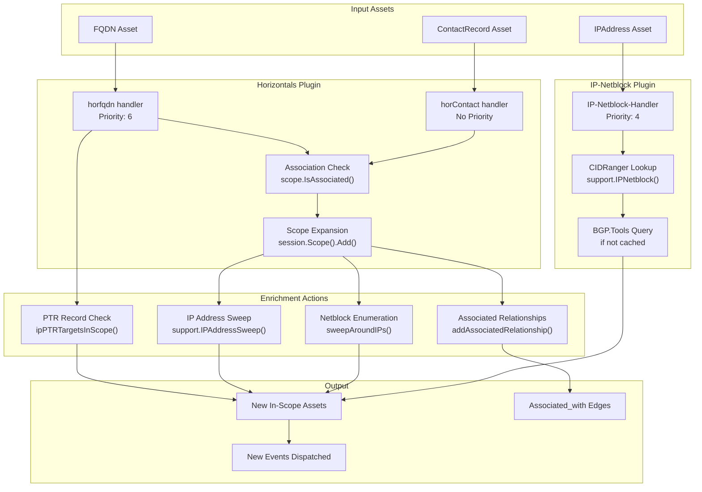
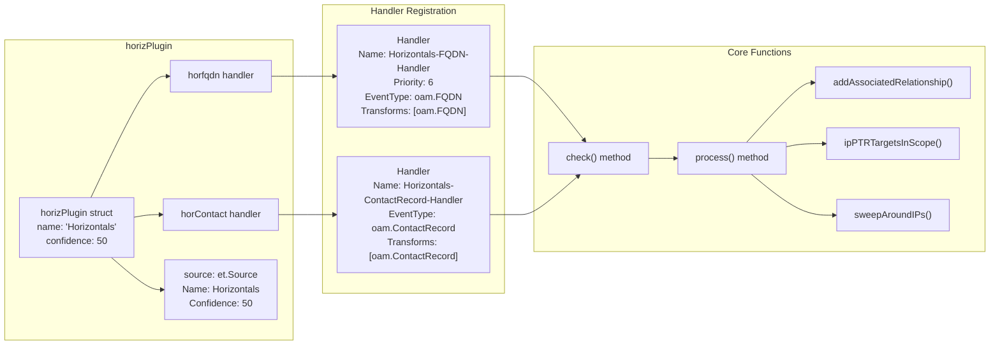
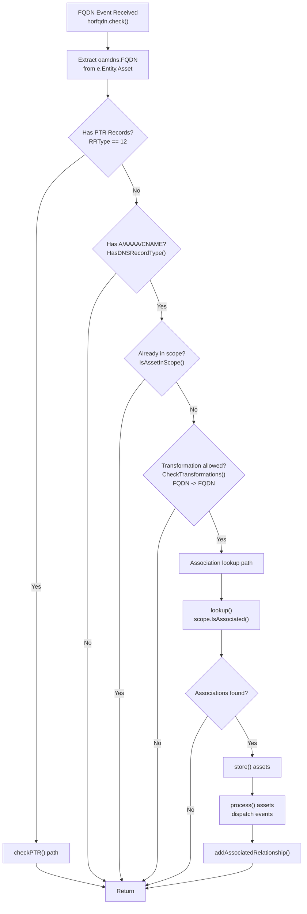
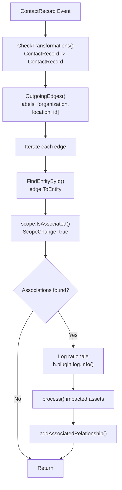
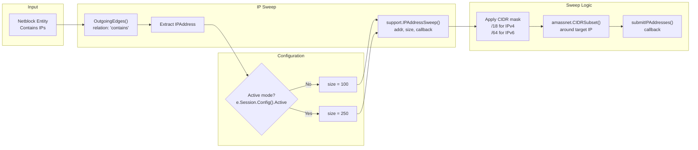
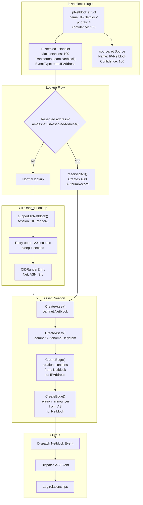
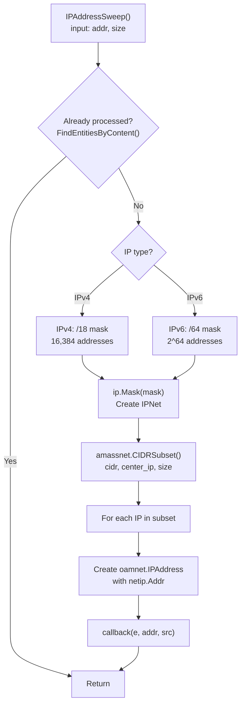
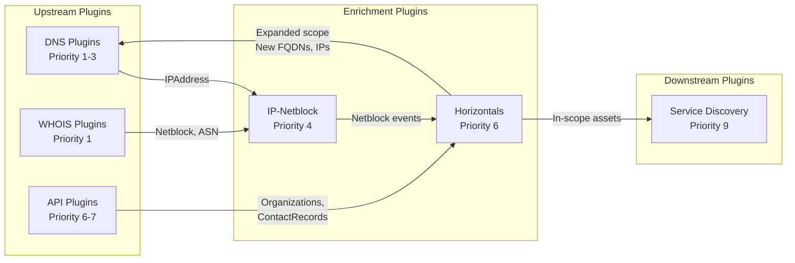

# Enrichment Plugins

# Enrichment Plugins

<details>
<summary>Relevant source files</summary>

The following files were used as context for generating this wiki page:

- [engine/plugins/brute/alterations.go](engine/plugins/brute/alterations.go)
- [engine/plugins/horizontals/contact.go](engine/plugins/horizontals/contact.go)
- [engine/plugins/horizontals/fqdn.go](engine/plugins/horizontals/fqdn.go)
- [engine/plugins/horizontals/plugin.go](engine/plugins/horizontals/plugin.go)
- [engine/plugins/ip_netblock.go](engine/plugins/ip_netblock.go)
- [engine/plugins/service_discovery/http_probes/fqdn_endpoint.go](engine/plugins/service_discovery/http_probes/fqdn_endpoint.go)
- [engine/plugins/service_discovery/http_probes/ipaddr_endpoint.go](engine/plugins/service_discovery/http_probes/ipaddr_endpoint.go)
- [engine/plugins/service_discovery/http_probes/plugin.go](engine/plugins/service_discovery/http_probes/plugin.go)
- [engine/plugins/support/support.go](engine/plugins/support/support.go)
- [engine/plugins/whois/bgptools/autsys.go](engine/plugins/whois/bgptools/autsys.go)
- [engine/plugins/whois/bgptools/netblock.go](engine/plugins/whois/bgptools/netblock.go)
- [engine/plugins/whois/bgptools/plugin.go](engine/plugins/whois/bgptools/plugin.go)
- [engine/plugins/whois/fqdn_lookup.go](engine/plugins/whois/fqdn_lookup.go)
- [engine/sessions/scope/assoc.go](engine/sessions/scope/assoc.go)

</details>


## Purpose and Scope

Enrichment plugins expand the reconnaissance scope and add contextual data to discovered assets. These plugins analyze relationships between assets to determine if newly discovered entities should be added to the session scope based on association with in-scope assets. The primary enrichment plugins are:

- **Horizontals Plugin**: Performs scope expansion by analyzing associations between assets (domain registrations, certificates, contact records, network ownership)
- **IP-Netblock Plugin**: Maps IP addresses to their containing network blocks and autonomous systems
- **Contact Expansion**: A component of Horizontals that follows organizational and location relationships

For information about DNS-based discovery, see [DNS Discovery Plugins](#6.2). For API-based data enrichment from external sources, see [API Integration Plugins](#6.3). For active service probing, see [Service Discovery Plugins](#6.4).

---

## Overview: Enrichment Plugin Architecture



**Diagram: Enrichment Plugin Processing Flow**

The enrichment pipeline processes discovered assets to determine scope expansion and create contextual relationships. The Horizontals plugin operates at priority 6, analyzing FQDNs and ContactRecords for associations. The IP-Netblock plugin operates at priority 4, mapping IP addresses to their network infrastructure.

Sources: [engine/plugins/horizontals/plugin.go:1-305](), [engine/plugins/ip_netblock.go:1-257]()

---

## Horizontals Plugin

The Horizontals plugin (`NewHorizontals()`) is the primary scope expansion mechanism in Amass. It analyzes asset relationships to determine if out-of-scope discoveries should be brought into scope based on their association with in-scope assets.

### Plugin Structure



**Diagram: Horizontals Plugin Architecture**

The plugin registers two handlers with different event types. The FQDN handler operates at priority 6, while the ContactRecord handler has no explicit priority (defaults to lower priority).

Sources: [engine/plugins/horizontals/plugin.go:25-86]()

### FQDN Handler: Scope Expansion via Associations

The `horfqdn` handler [engine/plugins/horizontals/fqdn.go:23-170]() processes FQDN assets to determine if they should be added to scope based on associations with in-scope assets.

#### Handler Logic Flow



**Diagram: FQDN Handler Decision Flow**

The handler first checks if the FQDN has PTR records pointing to in-scope addresses, which triggers special PTR handling. Otherwise, it performs association lookups if the FQDN has A, AAAA, or CNAME records.

Sources: [engine/plugins/horizontals/fqdn.go:32-98]()

#### PTR Record Analysis

When a PTR record is found, the handler performs bidirectional scope expansion [engine/plugins/horizontals/fqdn.go:100-144]():

| Scenario | Action | Code Reference |
|----------|--------|----------------|
| **PTR source IP is in-scope** | Extract EffectiveTLDPlusOne from PTR target, add domain to scope | [fqdn.go:123-128]() |
| **PTR target FQDN is in-scope** | Add source IP to scope, perform IP sweep (size 100 or 250 if active) | [fqdn.go:130-140]() |

The PTR analysis checks incoming edges with relation type `ptr_record` [engine/plugins/horizontals/fqdn.go:101]() and traverses to find the source IP address.

Sources: [engine/plugins/horizontals/fqdn.go:100-144]()

### Contact Handler: Organization and Location Expansion

The `horContact` handler [engine/plugins/horizontals/contact.go:17-84]() processes ContactRecord assets to expand scope based on organizational and location relationships.

#### Contact Relationship Traversal



**Diagram: Contact Handler Flow**

The handler follows three types of edges from ContactRecords: `organization`, `location`, and `id`. Each connected entity is checked for association with in-scope assets.

Sources: [engine/plugins/horizontals/contact.go:26-83]()

The handler queries relationships at [engine/plugins/horizontals/contact.go:61-83]():

```
labels := []string{"organization", "location", "id"}
OutgoingEdges(entity, since, labels...)
```

For each connected entity (organization, location, or identifier), it calls `scope.IsAssociated()` with `ScopeChange: true` to determine if the discovery should expand the session scope.

Sources: [engine/plugins/horizontals/contact.go:61-83]()

### Association Logic

Association checking is performed by `scope.IsAssociated()` [engine/sessions/scope/assoc.go:38-82](), which traverses the asset graph to find relationships between submitted assets and in-scope assets.

#### Association Traversal Paths

The system defines specific traversal rules based on asset types [engine/sessions/scope/assoc.go:242-361]():

| Asset Type | Outgoing Relations | Incoming Relations | Purpose |
|------------|-------------------|-------------------|---------|
| **DomainRecord** | `registrant_contact` | - | Registration data provides association |
| **IPNetRecord** | `registrant` | `registration` | Network registration |
| **AutnumRecord** | `registrant` | `registration` | AS registration |
| **TLSCertificate** | `subject_contact` | - | Certificate ownership |
| **ContactRecord** | `organization`, `location` | `registrant`, `registrant_contact`, `subject_contact` | Organizational links |
| **FQDN** | `registration` | `node` | Domain ownership |
| **IPAddress** | - | `contains` | Network membership |
| **Netblock** | `registration` | - | Network ownership |
| **Service** | - | `port` | Service attachment |

The association algorithm uses two complementary traversal functions:

1. **towardsAssetsWithAssociation()** [engine/sessions/scope/assoc.go:306-361](): Traverses from a submitted asset toward assets that provide associative value (DomainRecord, IPNetRecord, AutnumRecord, TLSCertificate)

2. **awayFromAssetsWithAssociation()** [engine/sessions/scope/assoc.go:242-304](): Traverses from assets with associative value toward related assets (Organizations, Locations, etc.)

Sources: [engine/sessions/scope/assoc.go:242-361]()

#### Association Confidence Scoring

The association check returns matches with confidence scores [engine/sessions/scope/assoc.go:29-36]():

```
type Association struct {
    Submission     *dbt.Entity  // Asset being checked
    Match          *dbt.Entity  // In-scope asset that matched
    Rationale      string       // Human-readable explanation
    Confidence     int          // 0-100 confidence score
    ScopeChange    bool         // Whether scope was modified
    ImpactedAssets []*dbt.Entity // Assets added to scope
}
```

The confidence score is compared against the request's minimum confidence. If `ScopeChange: true`, all related assets are added to scope and the rationale is extended with the list of impacted assets [engine/sessions/scope/assoc.go:84-92]().

Sources: [engine/sessions/scope/assoc.go:29-92]()

### IP Sweeping

When a new network range is added to scope, the Horizontals plugin performs IP address sweeps to discover nearby hosts [engine/plugins/horizontals/plugin.go:202-219]().

#### Sweep Configuration



**Diagram: IP Address Sweep Mechanism**

The sweep size is determined by active mode: 100 IPs in passive mode, 250 IPs in active mode.

Sources: [engine/plugins/horizontals/plugin.go:202-219](), [engine/plugins/support/support.go:164-195]()

The `IPAddressSweep()` function [engine/plugins/support/support.go:164-195]() creates a CIDR subnet around the target IP:

- **IPv4**: Uses a /18 mask (16,384 addresses), selects `size` addresses around the target
- **IPv6**: Uses a /64 mask (18 quintillion addresses), selects `size` addresses around the target

The function calls `amassnet.CIDRSubset()` to select evenly distributed IPs within the range, then invokes the callback for each IP to create assets and dispatch events.

Sources: [engine/plugins/support/support.go:164-195]()

### Process and Dispatch

The `process()` method [engine/plugins/horizontals/plugin.go:129-161]() handles newly added assets:

1. **Netblock Processing**: When a Netblock or IPNetRecord is added to scope:
   - Calls `ipPTRTargetsInScope()` to check PTR records
   - Calls `sweepAroundIPs()` to perform IP sweeps
   
2. **Event Dispatch**: Dispatches a new event for each asset using `Dispatcher.DispatchEvent()`

3. **Source Attribution**: Adds a `general.SourceProperty` to each asset with source name "Horizontals" and confidence 50

The `addAssociatedRelationship()` method [engine/plugins/horizontals/plugin.go:88-127]() creates bidirectional `associated_with` edges between the matched asset and all assets related to in-scope matches, avoiding self-loops.

Sources: [engine/plugins/horizontals/plugin.go:88-161]()

---

## IP-Netblock Plugin

The IP-Netblock plugin (`NewIPNetblock()`) maps IP addresses to their containing network blocks and autonomous systems, providing network infrastructure context.

### Plugin Architecture



**Diagram: IP-Netblock Plugin Processing**

The plugin operates at priority 4, processing IPAddress events after DNS resolution but before the Horizontals plugin's scope expansion.

Sources: [engine/plugins/ip_netblock.go:1-257]()

### Netblock Discovery Process

#### CIDRanger Integration

The plugin queries the session's CIDRanger [engine/plugins/ip_netblock.go:95-104](), which is populated by other plugins (primarily BGP.Tools):

```
for i := 0; i < 120; i++ {
    entry = support.IPNetblock(e.Session, ip.Address.String())
    if entry != nil {
        break
    }
    time.Sleep(time.Second)
}
```

The retry loop gives other plugins time to populate CIDRanger data. The `support.IPNetblock()` function [engine/plugins/support/support.go:122-149]() returns a `sessions.CIDRangerEntry`:

```
type CIDRangerEntry struct {
    Net *net.IPNet    // CIDR network
    ASN int           // Autonomous System Number
    Src *et.Source    // Data source
}
```

Sources: [engine/plugins/ip_netblock.go:95-104](), [engine/plugins/support/support.go:122-149]()

#### Asset and Relationship Creation

The `store()` method [engine/plugins/ip_netblock.go:115-173]() creates the infrastructure graph:

1. **Netblock Asset**: Creates `oamnet.Netblock` with CIDR and type (IPv4/IPv6)
2. **Contains Edge**: Links Netblock → IPAddress with relation `"contains"`
3. **AutonomousSystem Asset**: Creates `oamnet.AutonomousSystem` with ASN
4. **Announces Edge**: Links AutonomousSystem → Netblock with relation `"announces"`

All assets and edges receive `general.SourceProperty` tags with the original data source's name and confidence.

Sources: [engine/plugins/ip_netblock.go:115-173]()

### Reserved Address Handling

For reserved IP addresses (RFC 1918, loopback, etc.), the plugin creates a special AS0 structure [engine/plugins/ip_netblock.go:199-256]():

| Asset Type | Value | Purpose |
|------------|-------|---------|
| **Netblock** | Detected reserved CIDR (e.g., 10.0.0.0/8) | Represents reserved address space |
| **AutonomousSystem** | Number: 0 | Special AS for reserved addresses |
| **AutnumRecord** | Handle: "AS0"<br/>Name: "Reserved Network Address Blocks" | Registration record for AS0 |

The edges created are:
- `AutonomousSystem(0)` --[registration]--> `AutnumRecord(AS0)`
- `AutonomousSystem(0)` --[announces]--> `Netblock(reserved)`

Sources: [engine/plugins/ip_netblock.go:199-256]()

---

## Support Utilities for Enrichment

The `engine/plugins/support` package provides shared utilities used by enrichment plugins.

### IP Address Sweeping

The `IPAddressSweep()` function [engine/plugins/support/support.go:164-195]() performs controlled scanning of IP ranges:

#### Function Signature

```
func IPAddressSweep(
    e *et.Event,
    addr *oamnet.IPAddress,
    src *et.Source,
    size int,
    callback SweepCallback
)

type SweepCallback func(
    d *et.Event,
    addr *oamnet.IPAddress,
    src *et.Source
)
```

#### Sweep Algorithm



**Diagram: IP Sweep Algorithm**

The function creates a large subnet centered on the target IP, then selects a subset of addresses evenly distributed across the range.

Sources: [engine/plugins/support/support.go:164-195]()

The `amassnet.CIDRSubset()` function (not shown in files but referenced) returns `size` IP addresses selected from the CIDR range, with the target IP as the center point. This provides better coverage than simply scanning consecutive addresses.

Sources: [engine/plugins/support/support.go:164-195]()

### Netblock Lookup

The `IPNetblock()` function [engine/plugins/support/support.go:122-149]() queries the session's CIDRanger to find the most specific (longest prefix) netblock containing an IP address:

```
entries, err := session.CIDRanger().ContainingNetworks(ip)
if err != nil || len(entries) == 0 {
    return nil
}

var bits int
var arentry *sessions.CIDRangerEntry
for _, entry := range entries {
    e, ok := entry.(*sessions.CIDRangerEntry)
    if !ok {
        continue
    }
    
    n := e.Net
    if ones, _ := n.Mask.Size(); ones > bits {
        bits = ones
        arentry = e
    }
}

return arentry
```

The function returns the entry with the highest number of mask bits (most specific prefix), preferring /24 over /16, for example.

Sources: [engine/plugins/support/support.go:122-149]()

### FQDN Resolution Helpers

#### IsCNAME Check

The `IsCNAME()` function [engine/plugins/support/support.go:197-216]() determines if an FQDN has a CNAME record by querying the cache for outgoing edges with `dns_record` relation and RRType 5:

```
if edges, err := session.Cache().OutgoingEdges(fqdn, since, "dns_record"); ... {
    for _, edge := range edges {
        if rec, ok := edge.Relation.(*oamdns.BasicDNSRelation); ok && rec.Header.RRType == 5 {
            // Return the CNAME target
        }
    }
}
```

Sources: [engine/plugins/support/support.go:197-216]()

#### NameIPAddresses

The `NameIPAddresses()` function [engine/plugins/support/support.go:218-242]() returns all IP addresses associated with an FQDN by querying for A (RRType 1) and AAAA (RRType 28) records.

Sources: [engine/plugins/support/support.go:218-242]()

---

## Configuration and TTL Management

Enrichment plugins respect Time-To-Live (TTL) configurations to avoid redundant processing.

### TTL Checking

The `support.TTLStartTime()` function [engine/plugins/support/support.go:91-104]() calculates when an asset was last processed:

```
func TTLStartTime(c *config.Config, from, to, plugin string) (time.Time, error) {
    now := time.Now()
    
    if matches, err := c.CheckTransformations(from, to, plugin); ... {
        if ttl := matches.TTL(plugin); ttl >= 0 {
            return now.Add(time.Duration(-ttl) * time.Minute), nil
        }
        if ttl := matches.TTL(to); ttl >= 0 {
            return now.Add(time.Duration(-ttl) * time.Minute), nil
        }
    }
    
    return time.Time{}, errors.New("failed to obtain the TTL")
}
```

The function checks the configuration for transformation rules matching `from` → `to` for the specified plugin, returning a timestamp representing TTL minutes ago.

Sources: [engine/plugins/support/support.go:91-104]()

### Asset Monitoring

Plugins mark assets as monitored and check monitoring status:

| Function | Purpose | Code Reference |
|----------|---------|----------------|
| `AssetMonitoredWithinTTL()` | Check if asset was processed within TTL window | Referenced but not in provided files |
| `MarkAssetMonitored()` | Mark asset as processed by a source | Referenced but not in provided files |

These functions use `general.SourceProperty` tags on entities to track when each source last processed an asset.

---

## Integration with Other Plugins

Enrichment plugins receive data from and provide data to other plugin categories:



**Diagram: Enrichment Plugin Data Flow**

The IP-Netblock plugin operates at priority 4, between DNS resolution and the Horizontals plugin. This ordering ensures that netblock data is available when Horizontals evaluates scope expansion.

Sources: [engine/plugins/ip_netblock.go:45-64](), [engine/plugins/horizontals/plugin.go:47-82]()

---

## Summary

Enrichment plugins expand reconnaissance scope and add infrastructure context through:

1. **Scope Expansion**: The Horizontals plugin analyzes associations between assets to automatically expand the session scope when discovering related entities with sufficient confidence

2. **Infrastructure Mapping**: The IP-Netblock plugin maps IP addresses to their containing network blocks and autonomous systems, providing BGP and network ownership context

3. **Intelligent Sweeping**: IP address sweeps discover nearby hosts within newly added network ranges, with sweep size adjusted based on active/passive mode

4. **Association Traversal**: Graph traversal algorithms follow typed edges (organization, location, registration, certificate) to find relationships between assets

5. **TTL Management**: Plugins respect transformation TTL configurations to avoid redundant processing while ensuring data freshness

The enrichment plugins operate in the middle of the priority chain (4-6), receiving data from DNS and WHOIS plugins and providing expanded scope to service discovery plugins.

Sources: [engine/plugins/horizontals/plugin.go:1-305](), [engine/plugins/ip_netblock.go:1-257](), [engine/plugins/support/support.go:1-333](), [engine/sessions/scope/assoc.go:1-437]()