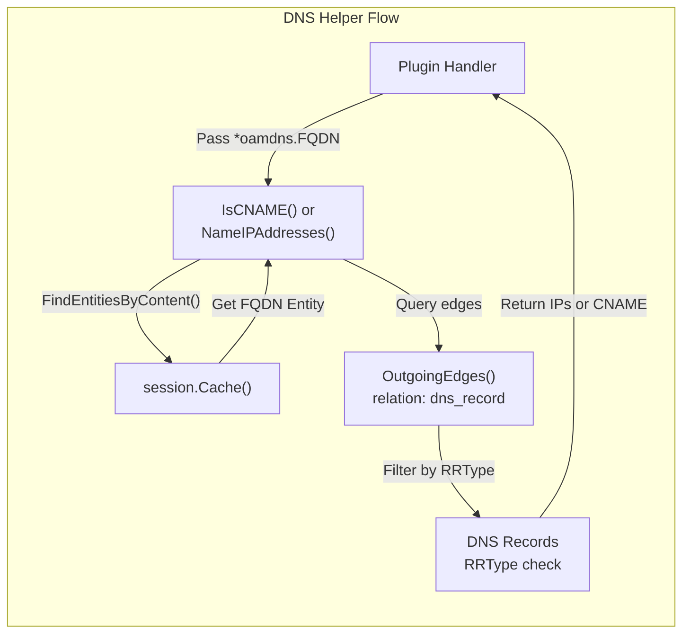
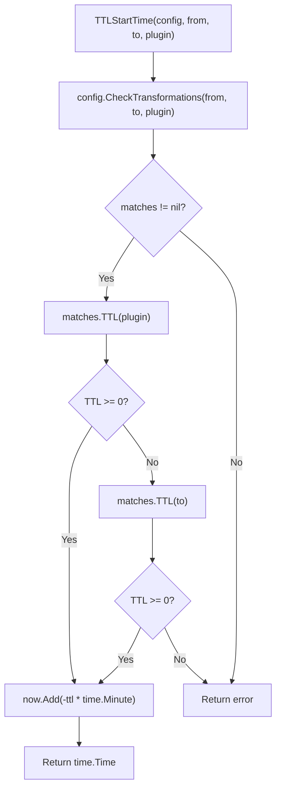
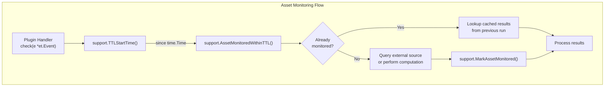
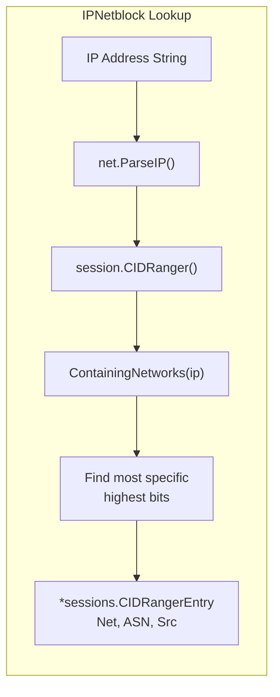
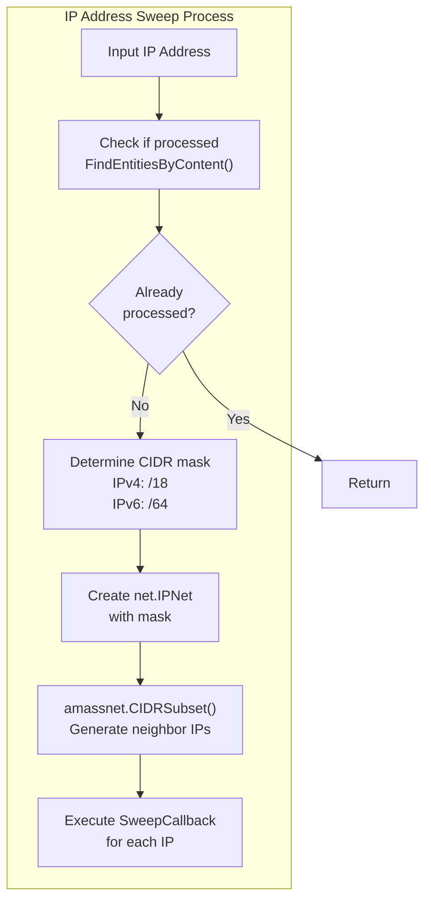
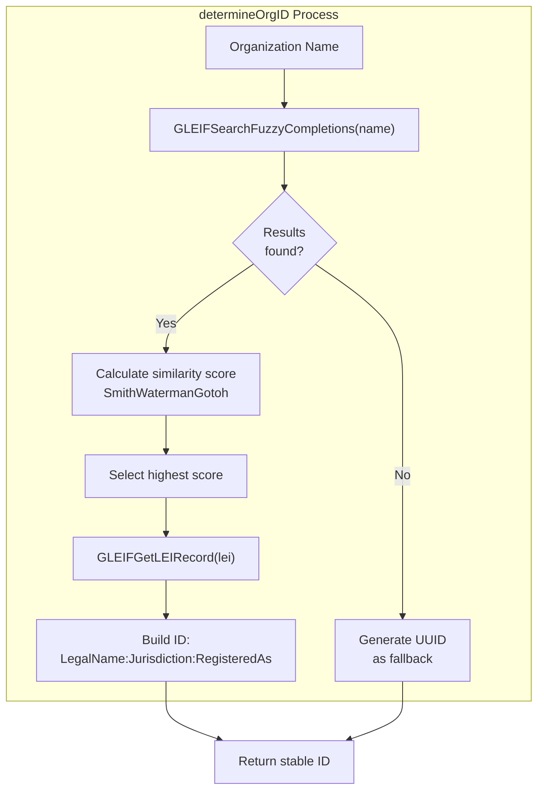
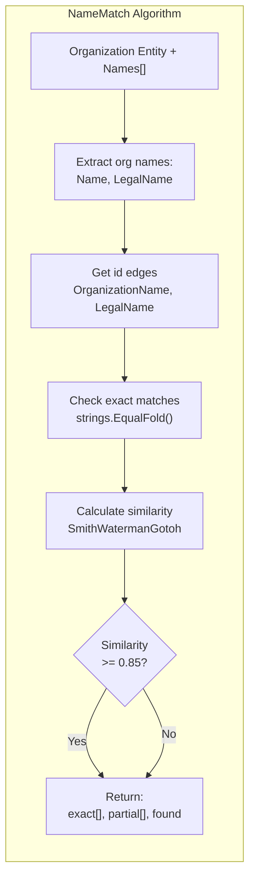
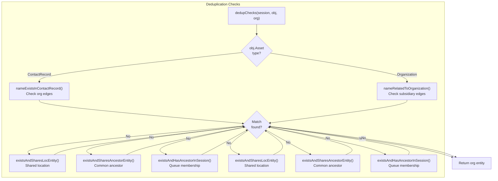

# Plugin Support Utilities

# Plugin Support Utilities

<details>
<summary>Relevant source files</summary>

The following files were used as context for generating this wiki page:

- [engine/plugins/brute/alterations.go](engine/plugins/brute/alterations.go)
- [engine/plugins/ip_netblock.go](engine/plugins/ip_netblock.go)
- [engine/plugins/service_discovery/http_probes/fqdn_endpoint.go](engine/plugins/service_discovery/http_probes/fqdn_endpoint.go)
- [engine/plugins/service_discovery/http_probes/ipaddr_endpoint.go](engine/plugins/service_discovery/http_probes/ipaddr_endpoint.go)
- [engine/plugins/service_discovery/http_probes/plugin.go](engine/plugins/service_discovery/http_probes/plugin.go)
- [engine/plugins/support/org/find.go](engine/plugins/support/org/find.go)
- [engine/plugins/support/org/gleif.go](engine/plugins/support/org/gleif.go)
- [engine/plugins/support/org/gleif_test.go](engine/plugins/support/org/gleif_test.go)
- [engine/plugins/support/org/match.go](engine/plugins/support/org/match.go)
- [engine/plugins/support/org/org.go](engine/plugins/support/org/org.go)
- [engine/plugins/support/org/types.go](engine/plugins/support/org/types.go)
- [engine/plugins/support/support.go](engine/plugins/support/support.go)
- [engine/plugins/whois/bgptools/autsys.go](engine/plugins/whois/bgptools/autsys.go)
- [engine/plugins/whois/bgptools/netblock.go](engine/plugins/whois/bgptools/netblock.go)
- [engine/plugins/whois/bgptools/plugin.go](engine/plugins/whois/bgptools/plugin.go)
- [engine/plugins/whois/fqdn_lookup.go](engine/plugins/whois/fqdn_lookup.go)

</details>


The plugin support package provides a comprehensive library of shared utilities used across all Amass plugins. These utilities handle common tasks such as DNS operations, TTL management, organization asset creation with deduplication, IP address sweeping, URL extraction, and asset monitoring. The support package ensures consistent behavior across plugins and eliminates code duplication for frequently-needed operations.

For information about the plugin architecture itself and how plugins register handlers, see [Plugin Architecture](#6.1). For DNS-specific plugins that use these utilities, see [DNS Discovery Plugins](#6.2). For organization enrichment workflows, see [GLEIF Plugin](#6.3.1).

## Overview of Support Package Organization

The support utilities are organized into two main packages:

**Main Support Package** (`engine/plugins/support/`): Core utilities for DNS, IP management, TTL tracking, and general asset operations.

**Organization Sub-Package** (`engine/plugins/support/org/`): Specialized utilities for creating, matching, and deduplicating organization assets using GLEIF API integration.

```mermaid
graph TB
    subgraph "Support Package Structure"
        MainPkg["support package<br/>engine/plugins/support/"]
        OrgPkg["org sub-package<br/>engine/plugins/support/org/"]
    end
    
    subgraph "Main Package Functions"
        DNS["DNS Helpers<br/>IsCNAME(), NameIPAddresses()"]
        TTL["TTL Management<br/>TTLStartTime()"]
        IP["IP/Network Helpers<br/>IPNetblock(), IPAddressSweep()"]
        URL["URL Extraction<br/>ExtractURLFromString()"]
        Monitor["Asset Monitoring<br/>AssetMonitoredWithinTTL()"]
        Meta["FQDN Metadata<br/>AddDNSRecordType()"]
    end
    
    subgraph "Org Package Functions"
        Create["Organization Creation<br/>CreateOrgAsset()"]
        Match["Name Matching<br/>NameMatch(), ExtractBrandName()"]
        GLEIF["GLEIF Integration<br/>GLEIFSearchFuzzyCompletions()"]
        Dedup["Deduplication<br/>dedupChecks()"]
    end
    
    subgraph "Plugin Users"
        DNSPlugins["DNS Plugins<br/>dnsTXT, dnsCNAME, dnsIP"]
        ServicePlugins["Service Plugins<br/>HTTP-Probes"]
        APIPlugins["API Plugins<br/>GLEIF, Aviato"]
        WHOISPlugins["WHOIS Plugins<br/>BGP.Tools"]
    end
    
    MainPkg --> DNS
    MainPkg --> TTL
    MainPkg --> IP
    MainPkg --> URL
    MainPkg --> Monitor
    MainPkg --> Meta
    
    OrgPkg --> Create
    OrgPkg --> Match
    OrgPkg --> GLEIF
    OrgPkg --> Dedup
    
    DNSPlugins --> DNS
    DNSPlugins --> TTL
    DNSPlugins --> Monitor
    DNSPlugins --> Meta
    
    ServicePlugins --> Monitor
    ServicePlugins --> TTL
    
    APIPlugins --> Create
    APIPlugins --> Match
    APIPlugins --> GLEIF
    
    WHOISPlugins --> IP
    WHOISPlugins --> TTL
    WHOISPlugins --> Create
```



**Sources:** [engine/plugins/support/support.go:1-333](), [engine/plugins/support/org/org.go:1-170]()

## DNS Helper Functions

The support package provides several utilities for querying cached DNS information and checking resolution status. These functions operate on the session cache rather than performing new DNS queries.

### Resolution Status Functions

| Function | Purpose | Return Type |
|----------|---------|-------------|
| `IsCNAME(session, name)` | Check if FQDN has CNAME record | `(*oamdns.FQDN, bool)` |
| `NameIPAddresses(session, name)` | Get all IP addresses for FQDN | `[]*oamnet.IPAddress` |
| `NameResolved(session, name)` | Check if FQDN has any resolution | `bool` |



**Implementation Details:**

The `IsCNAME` function [support.go:197-216]() searches the cache for outgoing edges from the FQDN entity with relation type `dns_record`. It then filters for edges where the `BasicDNSRelation.Header.RRType` equals 5 (CNAME type). If found, it returns the target FQDN entity and `true`.

The `NameIPAddresses` function [support.go:218-242]() follows a similar pattern but filters for RRTypes 1 (A) or 28 (AAAA), returning a slice of `*oamnet.IPAddress` assets.

The `NameResolved` function [support.go:244-252]() is a convenience wrapper that returns `true` if either `IsCNAME` or `NameIPAddresses` finds results.

**Sources:** [engine/plugins/support/support.go:197-252]()

## TTL Management System

The Time-To-Live (TTL) system controls how frequently plugins re-query external sources or re-process assets. TTL values are configured per-transformation in the configuration file and prevent redundant operations.

### TTL Start Time Calculation

The `TTLStartTime` function calculates the earliest timestamp that should be considered "fresh" based on configured TTL values:



**Function Signature:**

```go
func TTLStartTime(c *config.Config, from, to, plugin string) (time.Time, error)
```

**Parameters:**
- `from`: Source asset type (e.g., `"IPAddress"`)
- `to`: Target asset type (e.g., `"Netblock"`)
- `plugin`: Plugin name (e.g., `"BGP.Tools"`)

**Returns:** The timestamp `(now - TTL minutes)` if a TTL is configured, or an error if no TTL is found.

**Usage Example:**

```go
// From bgptools/netblock.go:49-52
since, err := support.TTLStartTime(e.Session.Config(), 
    string(oam.IPAddress), 
    string(oam.Netblock), 
    r.plugin.name)
```

**Sources:** [engine/plugins/support/support.go:91-104](), [engine/plugins/whois/bgptools/netblock.go:49-52]()

## Asset Monitoring System

The support package provides utilities to track which assets have been processed by which plugins within their TTL window, preventing duplicate work.

### Monitoring Functions

| Function | Purpose |
|----------|---------|
| `AssetMonitoredWithinTTL(session, entity, source, since)` | Check if asset was monitored by source after `since` |
| `MarkAssetMonitored(session, entity, source)` | Mark asset as monitored by source at current time |
| `SourceToAssetsWithinTTL(session, key, assetType, source, since)` | Find assets created by source after `since` |



**Implementation Example:**

The HTTP probes plugin demonstrates the pattern [http_probes/ipaddr_endpoint.go:48-64]():

```go
since, err := support.TTLStartTime(e.Session.Config(), 
    string(oam.IPAddress), string(oam.Service), r.name)
// ...
if support.AssetMonitoredWithinTTL(e.Session, e.Entity, src, since) {
    findings = append(findings, r.lookup(e, e.Entity, since)...)
} else {
    go func() {
        if findings := append(findings, r.query(e, e.Entity)...); len(findings) > 0 {
            r.process(e, findings)
        }
    }()
    support.MarkAssetMonitored(e.Session, e.Entity, src)
}
```

**Sources:** [engine/plugins/support/support.go:91-104](), [engine/plugins/service_discovery/http_probes/ipaddr_endpoint.go:48-64]()

## IP Address and Network Management

### IP Netblock Association

The `IPNetblock` function retrieves the most specific netblock containing a given IP address from the session's CIDR ranger:



**Function Signature:**

```go
func IPNetblock(session et.Session, addrstr string) *sessions.CIDRangerEntry
```

**CIDRangerEntry Structure:**

The returned entry contains:
- `Net *net.IPNet`: The CIDR netblock
- `ASN int`: Autonomous System Number
- `Src *et.Source`: Source that discovered this netblock

**Usage Example:**

The `ip_netblock.go` plugin uses this to wait for netblock discovery [ip_netblock.go:94-104]():

```go
var entry *sessions.CIDRangerEntry
for i := 0; i < 120; i++ {
    entry = support.IPNetblock(e.Session, ip.Address.String())
    if entry != nil {
        break
    }
    time.Sleep(time.Second)
}
```

**Sources:** [engine/plugins/support/support.go:122-149](), [engine/plugins/ip_netblock.go:94-104]()

### IP Address Sweeping

The `IPAddressSweep` function generates and processes neighboring IP addresses within a CIDR range to discover additional infrastructure:



**Function Signature:**

```go
type SweepCallback func(d *et.Event, addr *oamnet.IPAddress, src *et.Source)

func IPAddressSweep(e *et.Event, addr *oamnet.IPAddress, 
    src *et.Source, size int, callback SweepCallback)
```

**Parameters:**
- `size`: Number of neighboring IPs to generate from the subnet

**Implementation Logic [support.go:164-195]():**

1. Check if the IP was already processed in this session's cache
2. Determine appropriate mask (/18 for IPv4, /64 for IPv6)
3. Mask the IP to get the subnet base address
4. Use `amassnet.CIDRSubset()` to generate `size` neighboring IPs
5. Invoke the callback for each generated IP

**Usage Example from HTTP Probes [ipaddr_endpoint.go:70]():**

```go
go support.IPAddressSweep(e, ip, src, 25, sweepCallback)
```

Where `sweepCallback` creates new IPAddress assets and dispatches events for each discovered IP.

**Sources:** [engine/plugins/support/support.go:164-195](), [engine/plugins/service_discovery/http_probes/ipaddr_endpoint.go:70]()

### Netblock Addition

The `AddNetblock` function adds a CIDR range to the session's CIDR ranger for subsequent netblock lookups:

```go
func AddNetblock(session et.Session, cidr string, asn int, src *et.Source) error
```

This is used by WHOIS plugins after discovering netblock assignments [bgptools/netblock.go:61-67]().

**Sources:** [engine/plugins/support/support.go:151-162](), [engine/plugins/whois/bgptools/netblock.go:61-67]()

## Organization Creation and Deduplication

The `org` sub-package provides sophisticated utilities for creating organization assets with automatic deduplication using multiple strategies and GLEIF LEI record matching.

### CreateOrgAsset Function

The primary entry point for organization asset creation with built-in deduplication:

```mermaid
graph TD
    subgraph "CreateOrgAsset Flow"
        Start["CreateOrgAsset(session, obj, rel, org, src)"]
        Lock["Acquire createOrgLock"]
        Validate["Validate inputs<br/>org.Name != empty"]
        Dedup["dedupChecks(session, obj, org)"]
        Found{"Existing org<br/>found?"}
        CreateIdent["Create Identifier asset<br/>Type: OrganizationName"]
        DetermineID["determineOrgID(name)<br/>GLEIF lookup"]
        CreateOrg["Create Organization asset"]
        AddSource["Add SourceProperty"]
        LinkIdentifier["Link org->id->Identifier"]
        LinkRelation["Link obj->rel->org"]
        Unlock["Release lock<br/>(delayed if no rel)"]
    end
    
    Start --> Lock
    Lock --> Validate
    Validate --> Dedup
    Dedup --> Found
    Found -->|"Yes"| LinkRelation
    Found -->|"No"| CreateIdent
    CreateIdent --> DetermineID
    DetermineID --> CreateOrg
    CreateOrg --> AddSource
    AddSource --> LinkIdentifier
    LinkIdentifier --> LinkRelation
    LinkRelation --> Unlock
```



**Function Signature:**

```go
func CreateOrgAsset(session et.Session, obj *dbt.Entity, 
    rel oam.Relation, o *oamorg.Organization, 
    src *et.Source) (*dbt.Entity, error)
```

**Parameters:**
- `obj`: The entity being linked to this organization (e.g., ContactRecord, FQDN)
- `rel`: The relationship type (e.g., `"organization"`, `"subsidiary"`)
- `o`: The organization asset to create
- `src`: Source attribution

**Deduplication Strategy:**

The function attempts multiple deduplication checks [org/org.go:39-92]():

1. **Name matching** in existing organization entities
2. **Location sharing** with other contact records or organizations
3. **Shared ancestor** detection in the asset graph
4. **Session membership** checking if related organizations exist in the work queue

**Lock Mechanism:**

A mutex `createOrgLock` [org/org.go:25-37]() serializes organization creation. If no relationship is provided (`rel == nil`), the unlock is delayed by 2 seconds to allow related entities to be processed, improving deduplication accuracy.

**Sources:** [engine/plugins/support/org/org.go:39-92]()

### Organization ID Determination with GLEIF

The `determineOrgID` function generates a stable identifier for organizations using GLEIF LEI (Legal Entity Identifier) records:



**Scoring Algorithm [org/org.go:94-150]():**

The function uses Smith-Waterman-Gotoh string similarity with these parameters:
- `GapPenalty: -0.1`
- `Match: 1`, `Mismatch: -0.5`
- Base score: `similarity * 30`
- Bonus: `+30` if only one result found

**ID Format:**

When LEI record found:
```
{LegalName}:{Jurisdiction}:{RegisteredAs or Other or LEI}
```

Example: `AMAZON.COM, INC.:US-DE:5351052`

When no LEI found: A UUID is generated as a unique identifier.

**Sources:** [engine/plugins/support/org/org.go:94-150]()

### GLEIF API Integration

The `org` package provides three GLEIF API functions with automatic rate limiting (3 seconds per request):

| Function | Purpose | Endpoint |
|----------|---------|----------|
| `GLEIFSearchFuzzyCompletions(name)` | Search for LEI codes by name | `/api/v1/fuzzycompletions` |
| `GLEIFGetLEIRecord(id)` | Get detailed LEI record | `/api/v1/lei-records/{id}` |
| `GLEIFGetDirectParentRecord(id)` | Get parent organization | `/api/v1/lei-records/{id}/direct-parent` |
| `GLEIFGetDirectChildrenRecords(id)` | Get all subsidiaries | `/api/v1/lei-records/{id}/direct-children` |

**Rate Limiting:**

All functions use a shared `rate.Limiter` [org/gleif.go:22-28]():

```go
var gleifLimit *rate.Limiter

func init() {
    limit := rate.Every(3 * time.Second)
    gleifLimit = rate.NewLimiter(limit, 1)
}
```

**LEI Record Structure:**

The `LEIRecord` type [org/types.go:58-171]() contains comprehensive organization data:
- Legal name and alternative names
- Legal and headquarters addresses
- Registration details (jurisdiction, registered ID)
- Parent/child relationships
- BIC, MIC, OCID identifiers
- Status and expiration information

**Location Matching:**

The `LocMatch` function [org/gleif.go:120-170]() verifies if an organization entity matches a LEI record by comparing postal codes across legal addresses, headquarters addresses, and contact record locations.

**Sources:** [engine/plugins/support/org/gleif.go:1-171](), [engine/plugins/support/org/types.go:1-197]()

### Organization Name Matching

The `NameMatch` function checks if an organization entity corresponds to any of the provided names using fuzzy string matching:



**Function Signature:**

```go
func NameMatch(session et.Session, orgent *dbt.Entity, 
    names []string) (exact []string, partial []string, found bool)
```

**Matching Logic [org/match.go:80-142]():**

1. Extract organization names from `Name` and `LegalName` fields
2. Query for `Identifier` entities linked with `"id"` relation
3. For each name pair:
   - Check exact match (case-insensitive)
   - Calculate Smith-Waterman-Gotoh similarity
   - Accept if similarity >= 0.85

**Brand Name Extraction:**

The `ExtractBrandName` function [org/match.go:67-78]() removes common legal suffixes (Inc, LLC, Ltd, GmbH, etc.) to get the core brand name for better matching.

**Sources:** [engine/plugins/support/org/match.go:67-142]()

### Deduplication Strategy Details

The `dedupChecks` function [org/find.go:17-59]() implements a multi-layered deduplication strategy:



**Check 1: Name in Contact Record [find.go:61-78]()**

Searches for organization entities linked from the contact record via `"organization"` relation and checks name matches.

**Check 2: Shared Location Entity [find.go:110-157]()**

Finds location entities linked to the input object, then searches for other organizations or contact records that share those locations and match the organization name.

**Check 3: Shared Ancestor Entity [find.go:159-217]()**

Performs graph traversal (up to 10 levels) to find common ancestors between the input object and existing organizations with matching names.

**Check 4: Session Queue Membership [find.go:219-255]()**

Searches for organizations with matching names whose ancestors are currently in the session work queue, indicating they're part of the current enumeration scope.

**Sources:** [engine/plugins/support/org/find.go:17-255]()

## URL and String Parsing Utilities

### URL Extraction

The support package provides functions to extract URLs from arbitrary text:

| Function | Purpose | Return Type |
|----------|---------|-------------|
| `ExtractURLFromString(s)` | Extract first URL | `*url.URL` |
| `ExtractURLsFromString(s)` | Extract all URLs | `[]*url.URL` |
| `ScrapeSubdomainNames(s)` | Extract subdomain patterns | `[]string` |

**Implementation:**

The functions use the `xurls` library for flexible URL pattern matching [support.go:35-85](). URLs without schemes are automatically prefixed with `http://`.

**Subdomain Scraping:**

The `ScrapeSubdomainNames` function [support.go:43-54]() uses a pre-compiled regex from `dns.AnySubdomainRegexString()` to extract valid subdomain patterns from text.

**Sources:** [engine/plugins/support/support.go:35-85]()

### API Key Retrieval

The `GetAPI` function retrieves API keys from the configuration:

```go
func GetAPI(name string, e *et.Event) (string, error)
```

**Usage Example:**

```go
// From a plugin handler
apiKey, err := support.GetAPI("GLEIF", e)
if err != nil {
    return err
}
```

The function queries `e.Session.Config().GetDataSourceConfig(name)` and returns the first available API key from the credentials list [support.go:106-120]().

**Sources:** [engine/plugins/support/support.go:106-120]()

## FQDN Metadata Management

The support package provides utilities to attach and query metadata to FQDN events without modifying the underlying asset:

### FQDNMeta Structure

```go
type FQDNMeta struct {
    SLDInScope  bool
    RecordTypes map[int]bool  // DNS RRType -> presence
}
```

### Metadata Functions

| Function | Purpose |
|----------|---------|
| `AddSLDInScope(e)` | Mark that FQDN's SLD is in scope |
| `HasSLDInScope(e)` | Check if FQDN's SLD is in scope |
| `AddDNSRecordType(e, rrtype)` | Record that RRType was queried |
| `HasDNSRecordType(e, rrtype)` | Check if RRType was queried |

**Implementation Pattern:**

Each function checks if `e.Meta` is already a `*FQDNMeta`, creating one if needed [support.go:259-332]():

```go
if e.Meta == nil {
    e.Meta = &FQDNMeta{
        SLDInScope: true,
    }
}
```

**Usage Example:**

The HTTP probes plugin checks DNS record types before probing [fqdn_endpoint.go:39-43]():

```go
if !support.HasDNSRecordType(e, int(dns.TypeA)) &&
    !support.HasDNSRecordType(e, int(dns.TypeAAAA)) &&
    !support.HasDNSRecordType(e, int(dns.TypeCNAME)) {
    return nil
}
```

**Sources:** [engine/plugins/support/support.go:254-332](), [engine/plugins/service_discovery/http_probes/fqdn_endpoint.go:39-43]()

## Service Discovery Helpers

The support package includes utilities for creating and managing service assets discovered through active probing.

### Service Creation with Identifiers

The `ServiceWithIdentifier` function generates unique service identifiers using a hash function:

```go
func ServiceWithIdentifier(hash *maphash.Hash, sessionID, addr string) *platform.Service
```

The function creates a deterministic ID by hashing the session ID concatenated with the address, ensuring the same endpoint discovered multiple times gets the same service ID.

### TLS Certificate Conversion

The `X509ToOAMTLSCertificate` function converts Go's `*x509.Certificate` to OAM's `*oamcert.TLSCertificate` format for storage in the asset database.

### Finding and Relationship Processing

The `Finding` structure represents discovered relationships:

```go
type Finding struct {
    From     *dbt.Entity
    FromName string
    To       *dbt.Entity
    ToName   string
    ToMeta   interface{}
    Rel      oam.Relation
}
```

The `ProcessAssetsWithSource` function takes a slice of findings and:
1. Creates edges for each relationship
2. Adds `SourceProperty` to edges
3. Dispatches events for newly discovered assets
4. Logs relationship discoveries

**Usage in HTTP Probes [http_probes/plugin.go:110-198]():**

```go
findings = append(findings, &support.Finding{
    From:     entity,
    FromName: addr,
    To:       s,
    ToName:   "Service: " + serv.ID,
    Rel:      portrel,
})
```

**Sources:** [engine/plugins/service_discovery/http_probes/plugin.go:98-198]()

## Global Utilities

### MaxHandlerInstances Constant

The support package exports a constant used across plugins:

```go
const MaxHandlerInstances int = 100
```

This value is used when registering handlers that can run multiple concurrent instances [support.go:30]().

### Shutdown Function

The `Shutdown` function [support.go:87-89]() closes the global `done` channel, signaling all support utilities to terminate. This is called during graceful shutdown.

**Sources:** [engine/plugins/support/support.go:30](), [engine/plugins/support/support.go:87-89]()