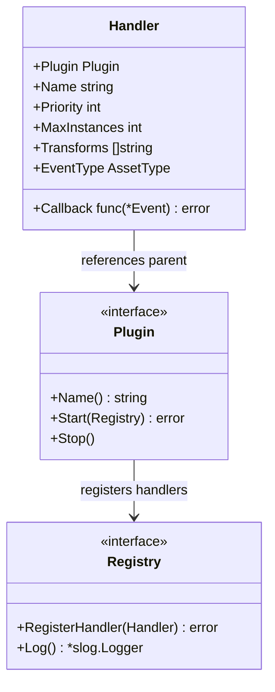
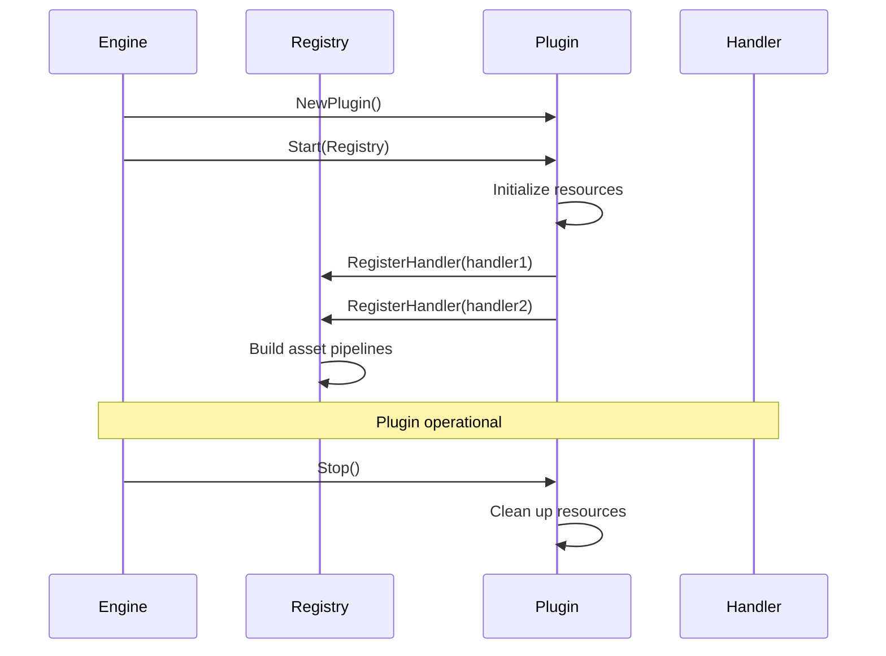
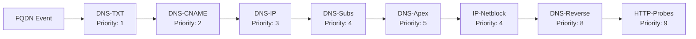
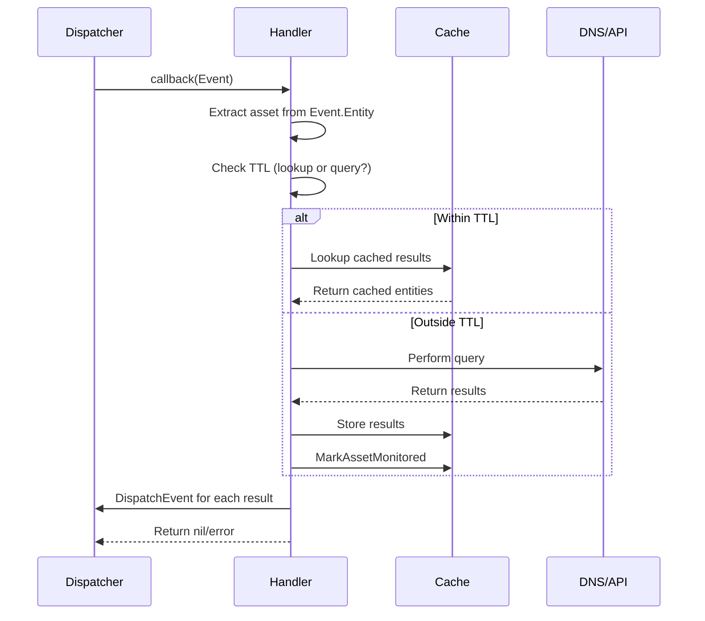
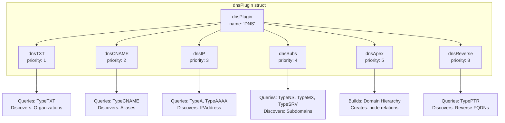
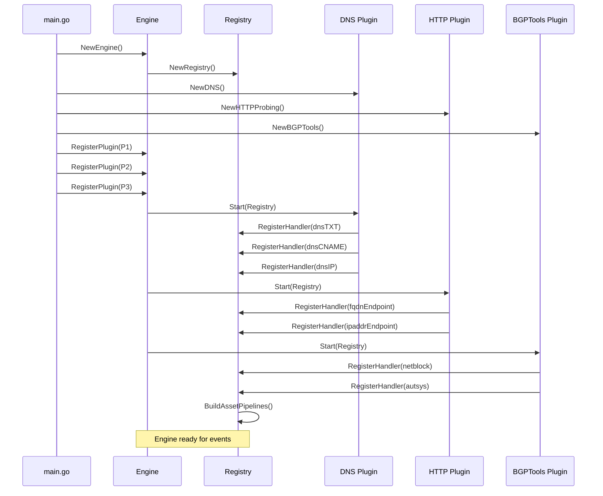

# Plugin System

# Plugin System

<details>
<summary>Relevant source files</summary>

The following files were used as context for generating this wiki page:

- [engine/plugins/brute/alterations.go](engine/plugins/brute/alterations.go)
- [engine/plugins/dns/apex.go](engine/plugins/dns/apex.go)
- [engine/plugins/dns/cname.go](engine/plugins/dns/cname.go)
- [engine/plugins/dns/ip.go](engine/plugins/dns/ip.go)
- [engine/plugins/dns/plugin.go](engine/plugins/dns/plugin.go)
- [engine/plugins/dns/reverse.go](engine/plugins/dns/reverse.go)
- [engine/plugins/dns/subs.go](engine/plugins/dns/subs.go)
- [engine/plugins/dns/txt.go](engine/plugins/dns/txt.go)
- [engine/plugins/ip_netblock.go](engine/plugins/ip_netblock.go)
- [engine/plugins/service_discovery/http_probes/fqdn_endpoint.go](engine/plugins/service_discovery/http_probes/fqdn_endpoint.go)
- [engine/plugins/service_discovery/http_probes/ipaddr_endpoint.go](engine/plugins/service_discovery/http_probes/ipaddr_endpoint.go)
- [engine/plugins/service_discovery/http_probes/plugin.go](engine/plugins/service_discovery/http_probes/plugin.go)
- [engine/plugins/support/support.go](engine/plugins/support/support.go)
- [engine/plugins/whois/bgptools/autsys.go](engine/plugins/whois/bgptools/autsys.go)
- [engine/plugins/whois/bgptools/netblock.go](engine/plugins/whois/bgptools/netblock.go)
- [engine/plugins/whois/bgptools/plugin.go](engine/plugins/whois/bgptools/plugin.go)
- [engine/plugins/whois/fqdn_lookup.go](engine/plugins/whois/fqdn_lookup.go)

</details>


The plugin system is Amass's primary extensibility mechanism, enabling modular asset discovery and enrichment capabilities. Plugins implement handlers that transform input assets into related output assets through DNS queries, API calls, active probing, or other discovery techniques. This document covers the plugin interface, handler registration, priority-based execution, and the common support utilities available to plugin developers.

For information about the engine's event dispatcher that routes events to plugin handlers, see [Event Dispatcher](#4.1). For details about the session management system that plugins interact with, see [Session Management](#4.2).

---

## Plugin Architecture

### Core Interface

All plugins implement the `et.Plugin` interface defined in the engine types package:



**Sources**: [engine/plugins/dns/plugin.go:39-55](), [engine/plugins/dns/plugin.go:57-165](), [engine/plugins/service_discovery/http_probes/plugin.go:35-92]()

The `Plugin` interface requires three methods:
- **`Name()`**: Returns the plugin's unique identifier string
- **`Start(Registry)`**: Called during engine initialization to register handlers and set up resources
- **`Stop()`**: Called during engine shutdown to clean up resources

The `Registry` interface provides:
- **`RegisterHandler()`**: Registers a handler with the plugin registry
- **`Log()`**: Returns a structured logger for plugin output

### Plugin Lifecycle



**Sources**: [engine/plugins/dns/plugin.go:57-165]()

During the `Start()` phase, plugins typically:
1. Initialize logging with `r.Log().WithGroup("plugin").With("name", d.name)`
2. Create handler instances (often as nested structs)
3. Register each handler with the `Registry`
4. Start any background goroutines (e.g., session cleanup)

**Sources**: [engine/plugins/dns/plugin.go:57-165]()

---

## Handler Registration and Execution

### Handler Structure

Each handler registered by a plugin must provide:

| Field | Type | Description |
|-------|------|-------------|
| `Plugin` | `et.Plugin` | Reference to parent plugin |
| `Name` | `string` | Unique handler identifier |
| `Priority` | `int` | Execution priority (1-9, lower executes first) |
| `MaxInstances` | `int` | Maximum concurrent handler instances (0 = unlimited) |
| `Transforms` | `[]string` | Output asset types this handler produces |
| `EventType` | `oam.AssetType` | Input asset type this handler processes |
| `Callback` | `func(*et.Event) error` | Function invoked when asset matches EventType |

**Sources**: [engine/plugins/dns/plugin.go:61-71](), [engine/plugins/dns/plugin.go:82-92]()

### Priority-Based Execution

The priority system determines handler execution order, creating a processing pipeline:



**Sources**: [engine/plugins/dns/plugin.go:57-165]()

Priority assignment rationale:
- **Priority 1**: TXT record lookup (discovers organization identifiers)
- **Priority 2**: CNAME resolution (must resolve before IP lookup)
- **Priority 3**: A/AAAA resolution (base IP discovery)
- **Priority 4**: NS/MX/SRV enumeration (subdomain discovery)
- **Priority 5**: Apex domain hierarchy building
- **Priority 8**: PTR reverse DNS lookups
- **Priority 9**: Active HTTP service probing

### Handler Callback Pattern



**Sources**: [engine/plugins/dns/txt.go:27-52](), [engine/plugins/dns/cname.go:34-57]()

All handler callbacks follow this pattern:
1. **Asset Extraction**: Extract typed asset from `e.Entity.Asset` (e.g., `*oamdns.FQDN`)
2. **TTL Check**: Determine if asset was recently monitored within TTL window
3. **Lookup/Query Decision**: Use cached results if within TTL, otherwise perform new query
4. **Storage**: Store new results in session cache with source attribution
5. **Event Emission**: Dispatch new events for discovered assets
6. **Error Handling**: Return nil on success or error on failure

**Sources**: [engine/plugins/dns/txt.go:27-52](), [engine/plugins/dns/cname.go:34-57](), [engine/plugins/dns/ip.go:35-81]()

---

## Plugin Categories

### DNS Discovery Plugins

The DNS plugin (`dns/plugin.go`) is the core discovery mechanism, implementing six handlers:



**Sources**: [engine/plugins/dns/plugin.go:22-50]()

#### dnsTXT Handler

Queries TXT records to discover organization identifiers (LEI codes, domain ownership):

```go
type dnsTXT struct {
    name   string
    plugin *dnsPlugin
    source *et.Source
}
```

Key operations:
- Queries DNS TypeTXT records for FQDN
- Stores `DNSRecordProperty` with `RRType: dns.TypeTXT`
- Logs discovered TXT record contents
- Adds `dns.TypeTXT` to event metadata via `support.AddDNSRecordType`

**Sources**: [engine/plugins/dns/txt.go:21-122]()

#### dnsCNAME Handler

Resolves CNAME aliases to discover canonical names:

```go
type dnsCNAME struct {
    name   string
    plugin *dnsPlugin
    source *et.Source
}
```

Creates `BasicDNSRelation` edges with `RRType: 5` (CNAME) and dispatches events for target FQDNs.

**Sources**: [engine/plugins/dns/cname.go:23-137]()

#### dnsIP Handler

Resolves A and AAAA records to discover IPv4/IPv6 addresses:

```go
type dnsIP struct {
    name    string
    queries []uint16  // dns.TypeA, dns.TypeAAAA
    plugin  *dnsPlugin
    source  *et.Source
}
```

Additional behavior:
- Skips processing if CNAME record exists (priority ordering)
- Triggers IP address sweeps based on scope configuration
- Sweep sizes: `firstSweepSize: 25`, `secondSweepSize: 100`, `maxSweepSize: 250`

**Sources**: [engine/plugins/dns/ip.go:23-196](), [engine/plugins/dns/plugin.go:39-50]()

#### dnsSubs Handler

Enumerates subdomains via NS, MX, and SRV records:

```go
type dnsSubs struct {
    name      string
    types     []subsQtypes  // NS, MX query types
    done      chan struct{}
    sessNames map[string]*subsSession
    plugin    *dnsPlugin
}
```

Unique features:
- Maintains per-session string sets to avoid duplicate processing
- Queries 100+ SRV record labels (`_http._tcp`, `_xmpp-server._tcp`, etc.)
- Background goroutine releases completed sessions via `releaseSessions()`

**Sources**: [engine/plugins/dns/subs.go:36-555]()

#### dnsApex Handler

Builds domain hierarchy by creating "node" relationships between apex domains and subdomains:

**Sources**: [engine/plugins/dns/apex.go:19-64]()

#### dnsReverse Handler

Performs PTR lookups on IP addresses to discover associated FQDNs:

Creates synthetic PTR FQDN entity (e.g., `1.0.168.192.in-addr.arpa`) and stores discovered reverse mappings.

**Sources**: [engine/plugins/dns/reverse.go:25-207]()

---

### Service Discovery Plugins

#### HTTP Probes Plugin

The `httpProbing` plugin actively probes HTTP/HTTPS endpoints to discover services and TLS certificates:

```go
type httpProbing struct {
    name     string
    log      *slog.Logger
    fqdnend  *fqdnEndpoint
    ipaddr   *ipaddrEndpoint
    source   *et.Source
    hash     maphash.Hash
    servlock sync.Mutex
}
```

**Sources**: [engine/plugins/service_discovery/http_probes/plugin.go:25-96]()

Two handlers:
- **fqdnEndpoint** (Priority 9): Probes FQDNs with A/AAAA/CNAME records on configured ports
- **ipaddrEndpoint** (Priority 9): Probes IP addresses directly on configured ports

**Sources**: [engine/plugins/service_discovery/http_probes/fqdn_endpoint.go:21-116](), [engine/plugins/service_discovery/http_probes/ipaddr_endpoint.go:21-136]()

Default probe ports: 80, 443, 8080, 8443 (configurable via `Config.Scope.Ports`)

Service discovery process:
1. HTTP request with 5-second timeout
2. Extract TLS certificate chain if HTTPS
3. Create `platform.Service` asset with:
   - `ServiceWithIdentifier()` generates unique service ID via maphash
   - `Output`: HTTP response body
   - `Attributes`: HTTP headers
4. Create `PortRelation` edge (proto: "http" or "https")
5. Create certificate chain with `issuing_certificate` relations

**Sources**: [engine/plugins/service_discovery/http_probes/plugin.go:98-198]()

---

### API Integration and Enrichment Plugins

#### BGPTools WHOIS Plugin

The `bgpTools` plugin queries the BGP.Tools WHOIS server for netblock and ASN information:

```go
type bgpTools struct {
    name     string
    addr     string  // bgp.tools IP address
    port     int     // 43 (WHOIS)
    rlimit   *rate.Limiter  // 1 req/sec
    autsys   *autsys
    netblock *netblock
    source   *et.Source
}
```

**Sources**: [engine/plugins/whois/bgptools/plugin.go:28-115]()

Two handlers:
- **netblock** (Priority 1): IPAddress → Netblock transformation
- **autsys** (Priority 1): Netblock → AutonomousSystem transformation

WHOIS query response parsing:
```
ASN | IP | Prefix | CC | Registry | AllocatedDate | ASName
```

**Sources**: [engine/plugins/whois/bgptools/plugin.go:117-191]()

Creates relationships:
- `Netblock --contains--> IPAddress`
- `AutonomousSystem --announces--> Netblock`

**Sources**: [engine/plugins/whois/bgptools/netblock.go:150-209](), [engine/plugins/whois/bgptools/autsys.go:126-146]()

#### IP Netblock Plugin

The `ipNetblock` plugin provides fallback netblock discovery using the session's `CIDRanger`:

```go
type ipNetblock struct {
    name   string
    log    *slog.Logger
    source *et.Source
}
```

Handler priority: 4 (after BGPTools at priority 1)

Waits up to 120 seconds for CIDRanger to be populated by upstream plugins before falling back.

**Sources**: [engine/plugins/ip_netblock.go:25-256]()

#### WHOIS Domain Lookup Plugin

Queries WHOIS servers for domain registration records:

```go
type fqdnLookup struct {
    name   string
    plugin *whois
}
```

Uses `likexian/whois` and `likexian/whois-parser` libraries to create `oamreg.DomainRecord` assets with fields like `CreatedDate`, `ExpirationDate`, `Status`, `DNSSEC`.

**Sources**: [engine/plugins/whois/fqdn_lookup.go:26-171]()

---

## Support Utilities Package

The `engine/plugins/support` package provides shared functionality for all plugins:

### DNS Query Execution

```go
func PerformQuery(name string, qtype uint16) ([]dns.RR, error)
```

Executes DNS queries with:
- Random resolver selection from trusted + public pools
- Retry logic (up to 10 attempts)
- Wildcard detection filtering
- Response validation

**Sources**: Referenced in [engine/plugins/dns/txt.go:81](), [engine/plugins/dns/cname.go:79]()

### TTL Management Functions

```go
func TTLStartTime(c *config.Config, from, to, plugin string) (time.Time, error)
```

Calculates the time boundary for asset monitoring based on configured TTL values.

```go
func AssetMonitoredWithinTTL(session Session, entity *Entity, src *Source, since time.Time) bool
```

Checks if an asset was already monitored by a source within the TTL window.

```go
func MarkAssetMonitored(session Session, entity *Entity, src *Source)
```

Marks an asset as monitored by storing a `SourceProperty` tag.

**Sources**: [engine/plugins/support/support.go:91-104]()

### IP Address Utilities

```go
func IPAddressSweep(e *Event, addr *IPAddress, src *Source, size int, callback SweepCallback)
```

Performs IP address sweep within a CIDR subnet:
- IPv4: /18 mask (16,384 addresses), sweeps `size` nearby IPs
- IPv6: /64 mask, sweeps `size` nearby IPs

```go
func IPNetblock(session Session, addrstr string) *CIDRangerEntry
```

Looks up the netblock containing an IP address from the session's CIDRanger.

**Sources**: [engine/plugins/support/support.go:122-195]()

### Asset Helper Functions

```go
func ScrapeSubdomainNames(s string) []string
func ExtractURLFromString(s string) *url.URL
func NameIPAddresses(session Session, name *FQDN) []*IPAddress
func IsCNAME(session Session, name *FQDN) (*FQDN, bool)
func NameResolved(session Session, name *FQDN) bool
```

**Sources**: [engine/plugins/support/support.go:43-252]()

### Event Metadata Management

```go
func AddDNSRecordType(e *Event, rrtype int)
func HasDNSRecordType(e *Event, rrtype int) bool
func AddSLDInScope(e *Event)
func HasSLDInScope(e *Event) bool
```

Manages `FQDNMeta` struct stored in `Event.Meta`:

```go
type FQDNMeta struct {
    SLDInScope  bool
    RecordTypes map[int]bool
}
```

**Sources**: [engine/plugins/support/support.go:254-332]()

### Common Constants

```go
const MaxHandlerInstances int = 100
```

Default value for handler `MaxInstances` field, limiting concurrent handler executions.

**Sources**: [engine/plugins/support/support.go:30]()

---

## Creating Custom Plugins

### Step 1: Implement the Plugin Interface

```go
package myplugin

import (
    "log/slog"
    et "github.com/owasp-amass/amass/v5/engine/types"
    oam "github.com/owasp-amass/open-asset-model"
)

type myPlugin struct {
    name   string
    log    *slog.Logger
    source *et.Source
}

func NewMyPlugin() et.Plugin {
    return &myPlugin{
        name: "MyPlugin",
        source: &et.Source{
            Name:       "MyPlugin",
            Confidence: 100,
        },
    }
}

func (p *myPlugin) Name() string {
    return p.name
}

func (p *myPlugin) Start(r et.Registry) error {
    p.log = r.Log().WithGroup("plugin").With("name", p.name)
    
    // Register handler
    if err := r.RegisterHandler(&et.Handler{
        Plugin:       p,
        Name:         p.name + "-Handler",
        Priority:     5,
        MaxInstances: 10,
        Transforms:   []string{string(oam.IPAddress)},
        EventType:    oam.FQDN,
        Callback:     p.handleFQDN,
    }); err != nil {
        return err
    }
    
    p.log.Info("Plugin started")
    return nil
}

func (p *myPlugin) Stop() {
    p.log.Info("Plugin stopped")
}
```

### Step 2: Implement Handler Callback

```go
func (p *myPlugin) handleFQDN(e *et.Event) error {
    // Extract asset
    fqdn, ok := e.Entity.Asset.(*oamdns.FQDN)
    if !ok {
        return errors.New("failed to extract FQDN")
    }
    
    // Check TTL
    since, err := support.TTLStartTime(e.Session.Config(), 
        string(oam.FQDN), string(oam.IPAddress), p.name)
    if err != nil {
        return err
    }
    
    // Lookup cached or perform new query
    var results []*dbt.Entity
    if support.AssetMonitoredWithinTTL(e.Session, e.Entity, p.source, since) {
        results = p.lookup(e, e.Entity, since)
    } else {
        results = p.query(e, fqdn)
        support.MarkAssetMonitored(e.Session, e.Entity, p.source)
    }
    
    // Process and dispatch results
    p.process(e, results)
    return nil
}
```

### Step 3: Implement Query and Storage Logic

```go
func (p *myPlugin) query(e *et.Event, fqdn *oamdns.FQDN) []*dbt.Entity {
    var results []*dbt.Entity
    
    // Perform external query (DNS, API, etc.)
    // ...
    
    // Store discovered assets
    if asset, err := e.Session.Cache().CreateAsset(discoveredAsset); err == nil {
        // Add source attribution
        _, _ = e.Session.Cache().CreateEntityProperty(asset, 
            &general.SourceProperty{
                Source:     p.source.Name,
                Confidence: p.source.Confidence,
            })
        
        // Create relationship edge
        if edge, err := e.Session.Cache().CreateEdge(&dbt.Edge{
            Relation:   &general.SimpleRelation{Name: "discovered_by"},
            FromEntity: e.Entity,
            ToEntity:   asset,
        }); err == nil {
            _, _ = e.Session.Cache().CreateEdgeProperty(edge, 
                &general.SourceProperty{
                    Source:     p.source.Name,
                    Confidence: p.source.Confidence,
                })
        }
        
        results = append(results, asset)
    }
    
    return results
}

func (p *myPlugin) process(e *et.Event, results []*dbt.Entity) {
    for _, asset := range results {
        // Dispatch new event for each discovered asset
        _ = e.Dispatcher.DispatchEvent(&et.Event{
            Name:    asset.Asset.Key(),
            Entity:  asset,
            Session: e.Session,
        })
        
        p.log.Info("asset discovered", 
            "type", asset.Asset.AssetType(),
            "key", asset.Asset.Key())
    }
}
```

### Key Considerations

1. **Source Attribution**: Always attach `SourceProperty` to created entities and edges
2. **TTL Caching**: Use `AssetMonitoredWithinTTL` to avoid redundant queries
3. **Error Handling**: Return errors from callbacks to signal failure
4. **Logging**: Use structured logging with plugin name context
5. **Concurrency**: Set `MaxInstances` to limit concurrent handler executions
6. **Priority**: Choose priority based on data dependencies (lower = earlier)

**Sources**: Pattern derived from [engine/plugins/dns/plugin.go:57-165](), [engine/plugins/dns/txt.go:27-122](), [engine/plugins/dns/cname.go:34-137]()

---

## Plugin Registration Flow



**Sources**: Pattern derived from [engine/plugins/dns/plugin.go:57-165](), [engine/plugins/service_discovery/http_probes/plugin.go:49-91](), [engine/plugins/whois/bgptools/plugin.go:58-110]()