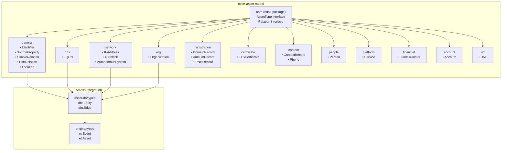
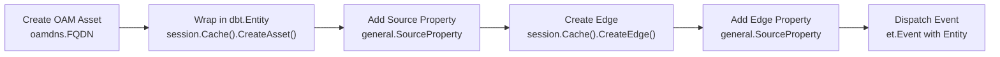
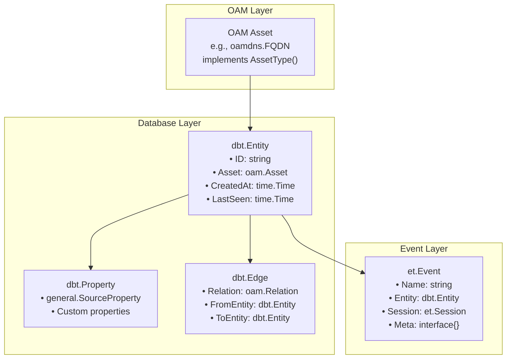
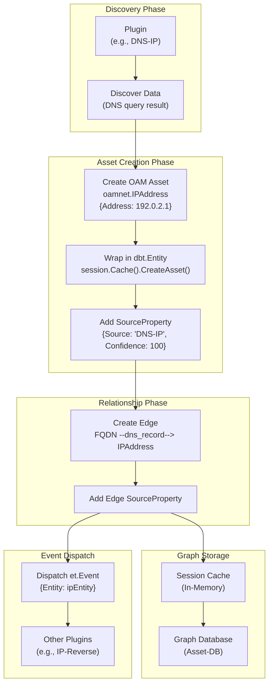
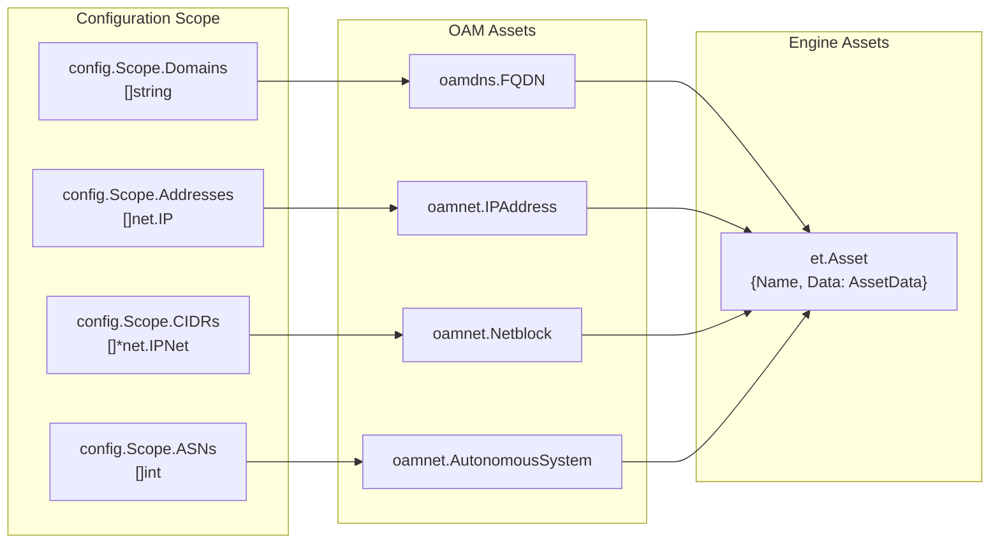

# Open Asset Model (OAM)

# Open Asset Model (OAM)

<details>
<summary>Relevant source files</summary>

The following files were used as context for generating this wiki page:

- [Dockerfile](Dockerfile)
- [engine/plugins/api/aviato/company_rounds.go](engine/plugins/api/aviato/company_rounds.go)
- [engine/plugins/api/gleif/fuzzy.go](engine/plugins/api/gleif/fuzzy.go)
- [engine/plugins/api/gleif/lei_record.go](engine/plugins/api/gleif/lei_record.go)
- [engine/plugins/api/gleif/org_lei.go](engine/plugins/api/gleif/org_lei.go)
- [engine/plugins/api/gleif/plugin.go](engine/plugins/api/gleif/plugin.go)
- [engine/plugins/api/gleif/related.go](engine/plugins/api/gleif/related.go)
- [engine/plugins/api/gleif/types.go](engine/plugins/api/gleif/types.go)
- [engine/plugins/api/rdap/plugin.go](engine/plugins/api/rdap/plugin.go)
- [engine/plugins/enrich/tls_cert.go](engine/plugins/enrich/tls_cert.go)
- [engine/plugins/support/database.go](engine/plugins/support/database.go)
- [engine/plugins/whois/domain_record.go](engine/plugins/whois/domain_record.go)
- [internal/enum/assets.go](internal/enum/assets.go)

</details>


## Purpose and Scope

This page documents the **Open Asset Model (OAM)**, the core data model used throughout OWASP Amass to represent discovered digital assets and their relationships. OAM defines a standardized schema for cybersecurity reconnaissance data, enabling consistent representation of domains, IP addresses, organizations, services, and related entities.

This page covers:
- The OAM specification and its purpose
- Core asset types and their organization into packages
- How assets are instantiated and managed in the Amass engine
- The relationship between OAM assets and the underlying graph database

For detailed information about individual asset types and their properties, see [Asset Types and Properties](#7.2). For relationship semantics and edge types, see [Relationships and Edges](#7.3). For database operations and querying, see [Graph Database and Querying](#7.4).

---

## What is OAM?

The **Open Asset Model** is an external Go package (`github.com/owasp-amass/open-asset-model`) that provides type definitions for cybersecurity assets and their relationships. Amass uses OAM as its canonical data representation layer, ensuring that all discovered information—whether from DNS queries, API integrations, or active probing—is normalized into a consistent graph structure.

**Key Design Principles:**
- **Asset-centric**: Everything is an asset with typed relationships
- **Package-organized**: Assets are grouped by domain (DNS, network, organization, etc.)
- **Graph-ready**: Designed for storage in property graph databases
- **Source-attributed**: All data includes provenance via `SourceProperty`

**Why OAM?**
1. **Interoperability**: Standardized schema enables data exchange between tools
2. **Extensibility**: New asset types can be added without breaking existing code
3. **Type Safety**: Go's type system prevents invalid asset constructions
4. **Query Power**: Graph structure enables complex traversals and relationship analysis

Sources: [engine/plugins/support/database.go:1-27](), [internal/enum/assets.go:1-16]()

---

## OAM Package Structure

OAM is organized into domain-specific packages, each containing related asset types:



**Package Responsibilities:**

| Package | Purpose | Key Types |
|---------|---------|-----------|
| `oam` (base) | Core interfaces and types | `AssetType`, `Relation` |
| `general` | Cross-cutting assets and relations | `Identifier`, `SourceProperty`, `SimpleRelation` |
| `dns` | DNS infrastructure | `FQDN` |
| `network` | Network infrastructure | `IPAddress`, `Netblock`, `AutonomousSystem` |
| `org` | Organizational entities | `Organization` |
| `registration` | Registry records | `DomainRecord`, `AutnumRecord`, `IPNetRecord` |
| `certificate` | TLS/SSL certificates | `TLSCertificate` |
| `contact` | Contact information | `ContactRecord`, `Phone` |
| `people` | Individual persons | `Person` |
| `platform` | Running services | `Service` |
| `account` | Financial accounts | `Account` |
| `financial` | Financial transactions | `FundsTransfer` |
| `url` | Web resources | `URL` |

Sources: [engine/plugins/support/database.go:19-26](), [engine/plugins/enrich/tls_cert.go:22-29](), [engine/plugins/api/aviato/company_rounds.go:23-29]()

---

## Core Asset Types

### Primary Discovery Assets

These are the most commonly encountered asset types in Amass enumeration:

**1. FQDN (Fully Qualified Domain Name)**
```go
// From oamdns package
type FQDN struct {
    Name string  // e.g., "mail.example.com"
}
```
**Usage:** Represents DNS domain names discovered through enumeration, DNS records, or certificate parsing.

**Example instantiation:**
```go
asset := &oamdns.FQDN{Name: "example.com"}
entity, _ := session.Cache().CreateAsset(asset)
```

Sources: [engine/plugins/support/database.go:33-39](), [engine/plugins/whois/domain_record.go:140-148](), [internal/enum/assets.go:42-51]()

---

**2. IPAddress**
```go
// From oamnet package
type IPAddress struct {
    Address netip.Addr  // Go 1.18+ netip.Addr
    Type    string      // "IPv4" or "IPv6"
}
```
**Usage:** Represents IPv4 or IPv6 addresses discovered from DNS resolution, service probing, or certificate SANs.

Sources: [engine/plugins/support/database.go:175-180](), [engine/plugins/enrich/tls_cert.go:238-255](), [internal/enum/assets.go:54-77]()

---

**3. Organization**
```go
// From oamorg package
type Organization struct {
    Name           string
    ID             string
    LegalName      string
    FoundingDate   string
    Jurisdiction   string
    RegistrationID string
    Active         bool
}
```
**Usage:** Represents companies or organizations discovered through WHOIS, GLEIF, Aviato, or certificate parsing.

Sources: [engine/plugins/api/gleif/fuzzy.go:26-29](), [engine/plugins/api/gleif/org_lei.go:49-109](), [engine/plugins/whois/domain_record.go:266-279]()

---

**4. Identifier**
```go
// From general package
type Identifier struct {
    UniqueID       string  // Format: "type:id"
    ID             string  // The actual identifier value
    Type           string  // e.g., "lei-code", "email", "legal-name"
    Status         string
    CreationDate   string
    UpdatedDate    string
    ExpirationDate string
}
```

**Common identifier types:**
- `general.LEICode` - Legal Entity Identifier
- `general.EmailAddress` - Email addresses
- `general.LegalName` - Legal organization names
- `general.OrganizationName` - Brand/trading names
- `general.BankIDCode` - BIC codes
- `general.MarketIDCode` - MIC codes
- `general.OpenCorpID` - OpenCorporates IDs
- Custom types like `AviatoCompanyID`, `AviatoPersonID`

Sources: [engine/plugins/api/gleif/fuzzy.go:59-63](), [engine/plugins/api/gleif/org_lei.go:136-164](), [engine/plugins/support/database.go:42-49]()

---

### Infrastructure Assets

**5. Service**
```go
// From platform package
type Service struct {
    ID         string
    OutputLen  int
    Attributes map[string][]string  // HTTP headers, banners
}
```
**Usage:** Represents discovered network services with their characteristics (HTTP servers, certificates, JARM fingerprints).

Sources: [engine/plugins/support/database.go:166-260](), [engine/plugins/support/database.go:65-66]()

---

**6. TLSCertificate**
```go
// From oamcert package
type TLSCertificate struct {
    SerialNumber      string
    SubjectCommonName string
    // Additional fields from x509.Certificate
}
```
**Usage:** Represents SSL/TLS certificates discovered during service probing.

Sources: [engine/plugins/enrich/tls_cert.go:84-86](), [engine/plugins/support/database.go:222-225]()

---

**7. Netblock & AutonomousSystem**
```go
// From oamnet package
type Netblock struct {
    CIDR netip.Prefix  // e.g., 192.0.2.0/24
    Type string        // "IPv4" or "IPv6"
}

type AutonomousSystem struct {
    Number int  // AS number
}
```
**Usage:** Represents IP address ranges and BGP autonomous systems.

Sources: [internal/enum/assets.go:80-110](), [engine/plugins/support/database.go:50-66]()

---

### Registration and Contact Assets

**8. DomainRecord, AutnumRecord, IPNetRecord**
```go
// From oamreg package
type DomainRecord struct {
    Domain      string
    WhoisServer string
    // ... additional WHOIS fields
}

type AutnumRecord struct {
    Number int
    Handle string
}

type IPNetRecord struct {
    CIDR   netip.Prefix
    Handle string
}
```
**Usage:** Represents registry records from WHOIS/RDAP queries.

Sources: [engine/plugins/whois/domain_record.go:39-42](), [engine/plugins/support/database.go:50-63]()

---

**9. ContactRecord**
```go
// From contact package
type ContactRecord struct {
    DiscoveredAt string  // Source URL or context
}
```
**Usage:** Hub asset that connects related contact information (person, location, phone, email, organization).

Sources: [engine/plugins/whois/domain_record.go:192-195](), [engine/plugins/enrich/tls_cert.go:338-341](), [engine/plugins/api/rdap/plugin.go:205-208]()

---

**10. Person**
```go
// From people package
type Person struct {
    ID        string
    FullName  string
    FirstName string
    LastName  string
    // Additional fields
}
```
**Usage:** Represents individuals discovered in contact records or employee databases.

Sources: [engine/plugins/api/aviato/company_rounds.go:483-506](), [engine/plugins/whois/domain_record.go:212-216]()

---

**11. Location**
```go
// From general package
type Location struct {
    Address  string
    Building string
    // Parsed address components
}
```
**Usage:** Represents physical addresses parsed from contact information.

Sources: [engine/plugins/api/gleif/org_lei.go:111-134](), [engine/plugins/api/rdap/plugin.go:235-242]()

---

### Financial Assets

**12. Account & FundsTransfer**
```go
// From account package
type Account struct {
    ID      string
    Type    string   // "checking", "savings"
    Number  string
    Balance float64
    Active  bool
}

// From financial package
type FundsTransfer struct {
    ID           string
    Amount       float64
    Currency     string
    ExchangeDate string
}
```
**Usage:** Represents financial accounts and funding rounds (primarily used by Aviato plugin).

Sources: [engine/plugins/api/aviato/company_rounds.go:241-283](), [engine/plugins/api/aviato/company_rounds.go:301-334]()

---

## Asset Instantiation Pattern

All OAM assets follow a consistent instantiation pattern in Amass:



**Example from code:**

```go
// 1. Create OAM asset
fqdn := &oamdns.FQDN{Name: "example.com"}

// 2. Store in cache (returns dbt.Entity)
entity, err := session.Cache().CreateAsset(fqdn)

// 3. Add source attribution
session.Cache().CreateEntityProperty(entity, &general.SourceProperty{
    Source:     "DNS-Resolution",
    Confidence: 100,
})

// 4. Create relationship
edge, err := session.Cache().CreateEdge(&dbt.Edge{
    Relation:   &general.SimpleRelation{Name: "dns_record"},
    FromEntity: fqdnEntity,
    ToEntity:   ipEntity,
})

// 5. Attribute the edge
session.Cache().CreateEdgeProperty(edge, &general.SourceProperty{
    Source:     "DNS-Resolution",
    Confidence: 100,
})

// 6. Dispatch for further processing
dispatcher.DispatchEvent(&et.Event{
    Name:    "example.com",
    Entity:  entity,
    Session: session,
})
```

Sources: [engine/plugins/support/database.go:81-101](), [engine/plugins/api/gleif/plugin.go:73-90]()

---

## Relations and Asset Connections

OAM defines typed relationships between assets. Key relation types:

### Common Relation Types

| Relation Name | From Asset | To Asset | Semantic Meaning |
|--------------|------------|----------|------------------|
| `dns_record` | FQDN | IPAddress | DNS A/AAAA resolution |
| `id` | Organization | Identifier | Organization identifier |
| `subsidiary` | Organization | Organization | Parent-child relationship |
| `member` | Organization | Person | Employment relationship |
| `port` | IPAddress/FQDN | Service | Network service binding |
| `legal_address` | Organization | Location | Legal registered address |
| `hq_address` | Organization | Location | Headquarters address |
| `location` | ContactRecord | Location | Associated address |
| `organization` | ContactRecord | Organization | Associated company |
| `person` | ContactRecord | Person | Associated individual |
| `phone` | ContactRecord | Phone | Contact phone number |
| `url` | ContactRecord | URL | Related web resource |
| `common_name` | TLSCertificate | FQDN | Certificate CN field |
| `san_dns_name` | TLSCertificate | FQDN | Certificate SAN entry |
| `certificate` | Service | TLSCertificate | TLS certificate used |
| `account` | Organization | Account | Financial account ownership |
| `sender` | FundsTransfer | Account | Funds source |
| `recipient` | FundsTransfer | Account | Funds destination |

Sources: [engine/plugins/whois/domain_record.go:80-86](), [engine/plugins/enrich/tls_cert.go:124-137](), [engine/plugins/api/aviato/company_rounds.go:265-277]()

---

## Asset-to-Entity Wrapping

OAM assets are wrapped in `dbt.Entity` structures for storage:



**Key Components:**

**`dbt.Entity`** - Database wrapper for OAM assets
- Holds the OAM asset in the `Asset` field
- Tracks creation and last-seen timestamps
- Has a unique `ID` for graph storage

**`general.SourceProperty`** - Attribution metadata
```go
type SourceProperty struct {
    Source     string  // Plugin name (e.g., "GLEIF", "DNS-IP")
    Confidence int     // 0-100 confidence score
}
```

**`et.Event`** - Processing unit
- Carries a `dbt.Entity` through the pipeline
- Can include `Meta` field for additional context (e.g., raw `*x509.Certificate`)

Sources: [engine/plugins/api/gleif/fuzzy.go:25-49](), [engine/plugins/support/database.go:131-148]()

---

## Data Flow: Discovery to Storage



**Process Flow:**

1. **Discovery**: Plugin queries external source (DNS, API, etc.)
2. **Asset Creation**: Raw data converted to typed OAM asset
3. **Entity Wrapping**: Asset stored in cache, returns `dbt.Entity`
4. **Attribution**: `SourceProperty` added to entity
5. **Relationship Creation**: Edge created between related entities
6. **Edge Attribution**: `SourceProperty` added to edge
7. **Storage**: Entity and edge persisted to graph database
8. **Event Dispatch**: New entity wrapped in `et.Event` for further processing

Sources: [engine/plugins/support/database.go:81-101](), [engine/plugins/api/gleif/fuzzy.go:190-202]()

---

## Asset Type Enumeration

Amass defines constants for all asset types used in transformation rules:

```go
// From oam package
const (
    FQDN              AssetType = "fqdn"
    IPAddress         AssetType = "ip_address"
    Netblock          AssetType = "netblock"
    AutonomousSystem  AssetType = "autonomous_system"
    Organization      AssetType = "organization"
    Identifier        AssetType = "identifier"
    DomainRecord      AssetType = "domain_record"
    AutnumRecord      AssetType = "autnum_record"
    IPNetRecord       AssetType = "ipnet_record"
    TLSCertificate    AssetType = "tls_certificate"
    ContactRecord     AssetType = "contact_record"
    Person            AssetType = "person"
    Service           AssetType = "service"
    Location          AssetType = "location"
    Phone             AssetType = "phone"
    URL               AssetType = "url"
    Account           AssetType = "account"
)
```

These constants are used in:
- **Handler registration**: Specify which asset types a handler transforms
- **Configuration**: Define which transformations are enabled
- **TTL management**: Determine cache expiration per asset type

Sources: [engine/plugins/api/gleif/plugin.go:38-63](), [engine/plugins/enrich/tls_cert.go:38-55](), [engine/plugins/whois/domain_record.go:44-48]()

---

## Scope Conversion to Assets

User-provided scope (domains, IPs, CIDRs, ASNs) is converted to OAM assets during enumeration initialization:



**Conversion logic:**
```go
// Domains → FQDN assets
for _, d := range scope.Domains {
    fqdn := oamdns.FQDN{Name: d}
    asset := &et.Asset{
        Data: et.AssetData{
            OAMAsset: fqdn,
            OAMType:  fqdn.AssetType(),
        },
    }
    assets = append(assets, asset)
}

// IPs → IPAddress assets
for _, ip := range scope.Addresses {
    addr, _ := netip.AddrFromSlice(ip)
    ipType := "IPv4"
    if addr.Is6() {
        ipType = "IPv6"
    }
    asset := oamnet.IPAddress{Address: addr, Type: ipType}
    // ... wrap in et.Asset
}

// CIDRs → Netblock assets
for _, cidr := range scope.CIDRs {
    prefix := ipnet2Prefix(*cidr)
    asset := oamnet.Netblock{CIDR: prefix, Type: ipType}
    // ... wrap in et.Asset
}

// ASNs → AutonomousSystem assets
for _, asn := range scope.ASNs {
    asset := oamnet.AutonomousSystem{Number: asn}
    // ... wrap in et.Asset
}
```

Sources: [internal/enum/assets.go:18-112]()

---

## Summary

The Open Asset Model provides:

1. **Standardized Schema**: Consistent representation across all data sources
2. **Type Safety**: Go types prevent invalid constructions
3. **Graph Structure**: Natural fit for relationship-rich reconnaissance data
4. **Extensibility**: New asset types can be added independently
5. **Attribution**: Built-in provenance tracking via `SourceProperty`
6. **Modularity**: Domain-separated packages for clean organization

All discovered data in Amass flows through this OAM abstraction, ensuring that plugins, the engine core, analysis tools, and the graph database all speak the same data language. This architectural decision enables Amass's powerful graph traversal and relationship analysis capabilities.

For specifics on individual asset types and their fields, continue to [Asset Types and Properties](#7.2).

Sources: [engine/plugins/support/database.go:1-261](), [internal/enum/assets.go:1-112](), [engine/plugins/api/gleif/fuzzy.go:1-203](), [engine/plugins/api/aviato/company_rounds.go:1-545](), [engine/plugins/enrich/tls_cert.go:1-428]()