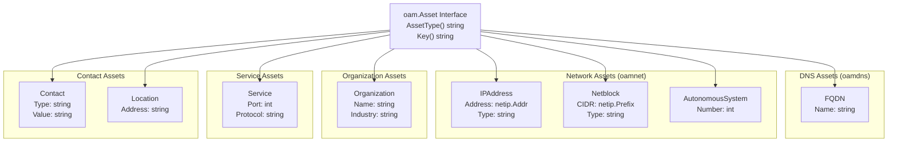
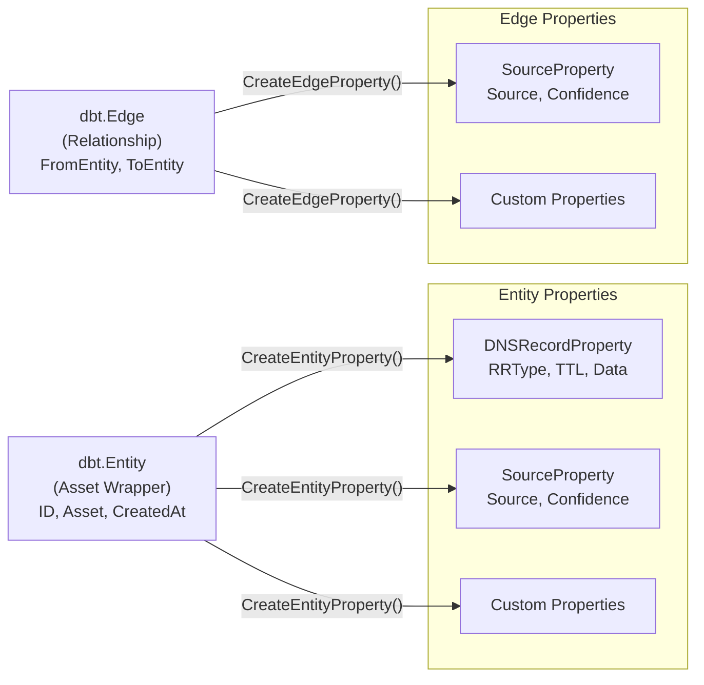
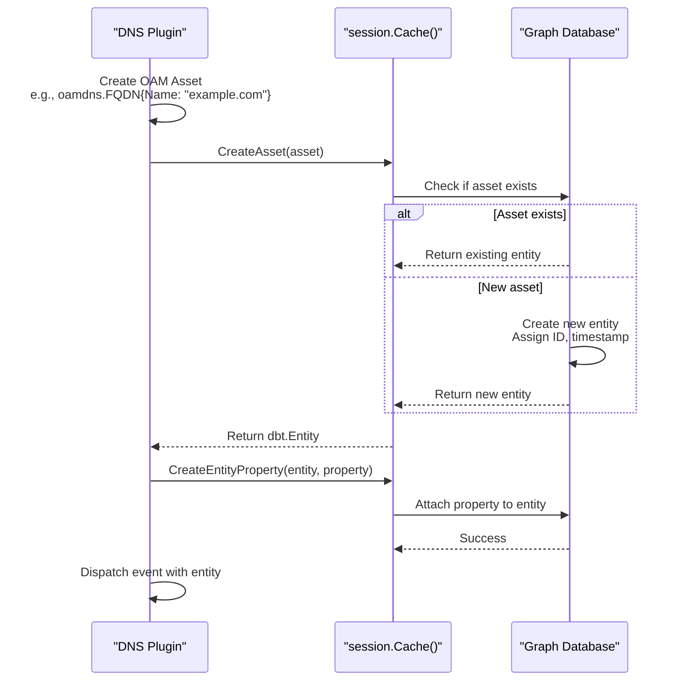
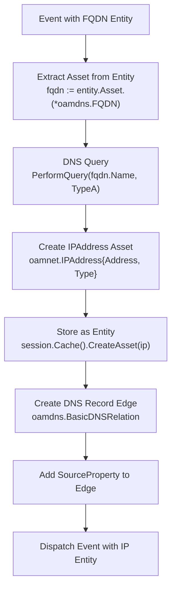

# Asset Types and Properties

# Asset Types and Properties

<details>
<summary>Relevant source files</summary>

The following files were used as context for generating this wiki page:

- [Dockerfile](Dockerfile)
- [engine/plugins/dns/apex.go](engine/plugins/dns/apex.go)
- [engine/plugins/dns/cname.go](engine/plugins/dns/cname.go)
- [engine/plugins/dns/ip.go](engine/plugins/dns/ip.go)
- [engine/plugins/dns/plugin.go](engine/plugins/dns/plugin.go)
- [engine/plugins/dns/reverse.go](engine/plugins/dns/reverse.go)
- [engine/plugins/dns/subs.go](engine/plugins/dns/subs.go)
- [engine/plugins/dns/txt.go](engine/plugins/dns/txt.go)
- [internal/enum/assets.go](internal/enum/assets.go)

</details>


This page documents the asset types used in OWASP Amass and their properties. Assets are the fundamental data structures representing discovered infrastructure elements like domain names, IP addresses, organizations, and services. Amass uses the Open Asset Model (OAM) specification to standardize asset representation.

For information about how assets are stored and queried in the graph database, see [Graph Database and Querying](#7.4). For details on how assets are related to each other through edges, see [Relationships and Edges](#7.3).

## Overview of Asset Types

Amass represents all discovered infrastructure as strongly-typed assets conforming to the Open Asset Model (OAM). Each asset type is defined in the `github.com/owasp-amass/open-asset-model` package and implements the `Asset` interface with an `AssetType()` method that returns its type identifier.

Assets exist in two forms in the codebase:
1. **OAM Assets**: Pure data structures from the `open-asset-model` package (e.g., `oamdns.FQDN`, `oamnet.IPAddress`)
2. **Entities**: Wrapped assets stored in the graph database as `dbt.Entity` objects from the `asset-db` package

### Asset Type Hierarchy



**Sources:** [engine/plugins/dns/plugin.go:16-19](), [internal/enum/assets.go:14-16](), [engine/plugins/dns/ip.go:17-21]()

## Core Asset Types

### FQDN Asset

The `FQDN` (Fully Qualified Domain Name) asset represents domain names and subdomains discovered during enumeration.

**Structure:**
- **Package**: `github.com/owasp-amass/open-asset-model/dns`
- **Type**: `oamdns.FQDN`
- **Asset Type Identifier**: `"FQDN"`

**Fields:**

| Field | Type | Description |
|-------|------|-------------|
| `Name` | `string` | The fully qualified domain name (e.g., "www.example.com") |

**Key Method**: Returns the `Name` field as the unique identifier.

**Creation Example** (from code):
```go
fqdn := &oamdns.FQDN{Name: "example.com"}
entity, err := session.Cache().CreateAsset(fqdn)
```

**Validation Rules:**
- Name must be a valid DNS name
- Automatically normalized to lowercase
- Trailing dots are removed

**Sources:** [engine/plugins/dns/txt.go:28-31](), [engine/plugins/dns/cname.go:99](), [internal/enum/assets.go:43-47]()

### IPAddress Asset

The `IPAddress` asset represents IPv4 and IPv6 addresses discovered through DNS resolution, active scanning, or API enrichment.

**Structure:**
- **Package**: `github.com/owasp-amass/open-asset-model/network`
- **Type**: `oamnet.IPAddress`
- **Asset Type Identifier**: `"IPAddress"`

**Fields:**

| Field | Type | Description |
|-------|------|-------------|
| `Address` | `netip.Addr` | The IP address as a Go netip.Addr value |
| `Type` | `string` | Either `"IPv4"` or `"IPv6"` |

**Key Method**: Returns `Address.String()` as the unique identifier.

**Creation Examples** (from code):

IPv4 Address:
```go
addr := netip.MustParseAddr("192.0.2.1")
ip := &oamnet.IPAddress{Address: addr, Type: "IPv4"}
entity, err := session.Cache().CreateAsset(ip)
```

IPv6 Address:
```go
addr := netip.MustParseAddr("2001:db8::1")
ip := &oamnet.IPAddress{Address: addr, Type: "IPv6"}
entity, err := session.Cache().CreateAsset(ip)
```

**Type Determination Logic** (from [internal/enum/assets.go:59-67]()):
- If `addr.Is4In6()`: Convert to IPv4 and set Type to `"IPv4"`
- If `addr.Is6()`: Set Type to `"IPv6"`
- Otherwise: Default to `"IPv4"`

**Sources:** [engine/plugins/dns/ip.go:123-124](), [engine/plugins/dns/ip.go:148](), [internal/enum/assets.go:70-74](), [engine/plugins/dns/plugin.go:231-238]()

### Netblock Asset

The `Netblock` asset represents CIDR ranges that define IP address blocks.

**Structure:**
- **Package**: `github.com/owasp-amass/open-asset-model/network`
- **Type**: `oamnet.Netblock`
- **Asset Type Identifier**: `"Netblock"`

**Fields:**

| Field | Type | Description |
|-------|------|-------------|
| `CIDR` | `netip.Prefix` | The network prefix (e.g., 192.0.2.0/24) |
| `Type` | `string` | Either `"IPv4"` or `"IPv6"` |

**Creation Example** (from code):
```go
prefix := netip.MustParsePrefix("192.0.2.0/24")
netblock := &oamnet.Netblock{CIDR: prefix, Type: "IPv4"}
entity, err := session.Cache().CreateAsset(netblock)
```

**Sources:** [internal/enum/assets.go:94-98]()

### AutonomousSystem Asset

The `AutonomousSystem` asset represents Autonomous System Numbers (ASNs) discovered through BGP lookups and WHOIS queries.

**Structure:**
- **Package**: `github.com/owasp-amass/open-asset-model/network`
- **Type**: `oamnet.AutonomousSystem`
- **Asset Type Identifier**: `"AutonomousSystem"`

**Fields:**

| Field | Type | Description |
|-------|------|-------------|
| `Number` | `int` | The ASN (e.g., 15169 for Google) |

**Creation Example** (from code):
```go
asn := &oamnet.AutonomousSystem{Number: 15169}
entity, err := session.Cache().CreateAsset(asn)
```

**Sources:** [internal/enum/assets.go:104-108]()

### Organization Asset

The `Organization` asset represents companies, entities, and legal organizations discovered through API plugins like GLEIF and Aviato.

**Structure:**
- **Package**: Referenced as `oam.Organization` in the codebase
- **Asset Type Identifier**: `"Organization"`

**Common Fields:**
- `Name`: Organization name
- `Industry`: Industry classification
- Legal identifiers (LEI codes, registration numbers)

**Usage Context**: Organizations are enriched through API plugins and linked to FQDNs, IP addresses, and contacts via relationships.

**Sources:** [engine/plugins/dns/plugin.go:18]()

## Asset Properties

Properties are metadata attached to entities (asset wrappers) stored in the graph database. Properties provide additional context, attribution, and DNS-specific information.

### Property Attachment Model



**Sources:** [engine/plugins/dns/txt.go:96-104](), [engine/plugins/dns/plugin.go:234-237](), [engine/plugins/dns/cname.go:113-116]()

### DNSRecordProperty

The `DNSRecordProperty` attaches DNS record information to FQDN entities.

**Structure:**
- **Package**: `github.com/owasp-amass/open-asset-model/dns`
- **Type**: `oamdns.DNSRecordProperty`
- **Property Name**: `"dns_record"`

**Fields:**

| Field | Type | Description |
|-------|------|-------------|
| `PropertyName` | `string` | Always `"dns_record"` |
| `Header` | `oamdns.RRHeader` | DNS record header information |
| `Data` | `string` | Record-specific data (e.g., TXT record content) |

**RRHeader Structure:**

| Field | Type | Description |
|-------|------|-------------|
| `RRType` | `int` | DNS record type (1=A, 5=CNAME, 15=MX, 16=TXT, 28=AAAA, etc.) |
| `Class` | `int` | DNS class (typically 1 for IN) |
| `TTL` | `int` | Time to live in seconds |

**Creation Example** (from [engine/plugins/dns/txt.go:96-104]()):
```go
_, err := session.Cache().CreateEntityProperty(fqdn, &oamdns.DNSRecordProperty{
    PropertyName: "dns_record",
    Header: oamdns.RRHeader{
        RRType: int(dns.TypeTXT),
        Class:  int(record.Header().Class),
        TTL:    int(record.Header().Ttl),
    },
    Data: txtValue,
})
```

**DNS Record Type Constants** (from miekg/dns package):

| Constant | Value | Description |
|----------|-------|-------------|
| `dns.TypeA` | 1 | IPv4 address record |
| `dns.TypeNS` | 2 | Name server record |
| `dns.TypeCNAME` | 5 | Canonical name record |
| `dns.TypePTR` | 12 | Pointer record (reverse DNS) |
| `dns.TypeMX` | 15 | Mail exchange record |
| `dns.TypeTXT` | 16 | Text record |
| `dns.TypeAAAA` | 28 | IPv6 address record |
| `dns.TypeSRV` | 33 | Service record |

**Sources:** [engine/plugins/dns/txt.go:96-110](), [engine/plugins/dns/ip.go:125-131](), [engine/plugins/dns/subs.go:252-259]()

### SourceProperty

The `SourceProperty` provides attribution for asset discovery, indicating which plugin or data source discovered an asset and with what confidence level.

**Structure:**
- **Package**: `github.com/owasp-amass/open-asset-model/general`
- **Type**: `general.SourceProperty`

**Fields:**

| Field | Type | Description |
|-------|------|-------------|
| `Source` | `string` | Name of the plugin or data source (e.g., "DNS", "DNS-IP", "DNS-TXT") |
| `Confidence` | `int` | Confidence score (0-100), typically 100 for DNS-based discoveries |

**Usage:** Can be attached to both entities and edges for attribution tracking.

**Creation Example** (from [engine/plugins/dns/plugin.go:234-237]()):
```go
_, _ = session.Cache().CreateEntityProperty(entity, &general.SourceProperty{
    Source:     src.Name,
    Confidence: src.Confidence,
})
```

**Edge Property Example** (from [engine/plugins/dns/cname.go:113-116]()):
```go
_, _ = session.Cache().CreateEdgeProperty(edge, &general.SourceProperty{
    Source:     source.Name,
    Confidence: source.Confidence,
})
```

**Sources:** [engine/plugins/dns/plugin.go:234-237](), [engine/plugins/dns/cname.go:113-116](), [engine/plugins/dns/subs.go:289-292]()

## Asset Creation and Entity Management

### Asset to Entity Conversion Flow



**Sources:** [engine/plugins/dns/txt.go:96-110](), [engine/plugins/dns/cname.go:99-118](), [engine/plugins/dns/ip.go:123-141]()

### Entity Structure

The `dbt.Entity` type (from `github.com/owasp-amass/asset-db/types`) wraps OAM assets for storage in the graph database.

**Fields:**

| Field | Type | Description |
|-------|------|-------------|
| `ID` | `string` | Unique entity identifier (UUID) |
| `Asset` | `oam.Asset` | The underlying OAM asset object |
| `CreatedAt` | `time.Time` | Entity creation timestamp |

**Key Method**: The entity's key is derived from the underlying asset's `Key()` method.

**Accessing the Asset** (from code patterns):
```go
// Type assertion to access the concrete asset type
fqdn, ok := entity.Asset.(*oamdns.FQDN)
if ok {
    name := fqdn.Name
    // Use the FQDN data
}
```

**Sources:** [engine/plugins/dns/txt.go:28-31](), [engine/plugins/dns/cname.go:35-37](), [engine/plugins/dns/ip.go:36-38]()

### Asset Creation Methods

The `session.Cache()` provides methods for creating and retrieving assets:

**CreateAsset Method:**
```go
entity, err := session.Cache().CreateAsset(asset)
```
- Input: An OAM asset (e.g., `*oamdns.FQDN`, `*oamnet.IPAddress`)
- Output: A `*dbt.Entity` wrapper and error
- Behavior: Creates a new entity if it doesn't exist, or returns the existing entity if the asset already exists in the cache/database

**FindEntitiesByContent Method:**
```go
entities, err := session.Cache().FindEntitiesByContent(asset, since)
```
- Input: An OAM asset and a time threshold
- Output: A slice of matching entities and error
- Use case: Looking up existing entities by asset content

**FindEntityById Method:**
```go
entity, err := session.Cache().FindEntityById(id)
```
- Input: Entity ID string
- Output: The entity and error
- Use case: Retrieving specific entities by their database ID

**Sources:** [engine/plugins/dns/txt.go:96](), [engine/plugins/dns/cname.go:99](), [engine/plugins/dns/subs.go:99-100](), [engine/plugins/dns/plugin.go:219]()

## Asset Type Usage Patterns

### DNS Plugin Asset Flow



**Sources:** [engine/plugins/dns/ip.go:35-80](), [engine/plugins/dns/ip.go:116-174]()

### Asset Type Assertions in Handlers

All DNS plugin handlers follow this pattern for accessing asset data:

**Type Assertion Pattern** (from multiple handlers):
```go
func (handler *dnsHandler) check(e *et.Event) error {
    // Assert the entity contains the expected asset type
    fqdn, ok := e.Entity.Asset.(*oamdns.FQDN)
    if !ok {
        return errors.New("failed to extract the FQDN asset")
    }
    
    // Use the FQDN data
    name := fqdn.Name
    // ... handler logic
}
```

**Common Assertion Points:**
- [engine/plugins/dns/txt.go:28-31]() - FQDN assertion in TXT handler
- [engine/plugins/dns/cname.go:35-38]() - FQDN assertion in CNAME handler
- [engine/plugins/dns/ip.go:36-39]() - FQDN assertion in IP handler
- [engine/plugins/dns/reverse.go:43-46]() - IPAddress assertion in reverse DNS handler
- [engine/plugins/dns/subs.go:67-70]() - FQDN assertion in subdomain handler

**Sources:** [engine/plugins/dns/txt.go:27-31](), [engine/plugins/dns/cname.go:34-38](), [engine/plugins/dns/ip.go:35-39](), [engine/plugins/dns/reverse.go:42-46]()

## Validation and Constraints

### Asset Key Uniqueness

Each asset type implements a `Key()` method that returns a unique string identifier. The graph database uses this key to ensure asset uniqueness.

**Key Generation Rules:**

| Asset Type | Key Format | Example |
|------------|------------|---------|
| FQDN | Lowercase domain name | `"www.example.com"` |
| IPAddress | IP address string | `"192.0.2.1"` or `"2001:db8::1"` |
| Netblock | CIDR notation | `"192.0.2.0/24"` |
| AutonomousSystem | "AS" + number | `"AS15169"` |

### DNS Record Type Tracking

The DNS plugin maintains metadata about which DNS record types have been discovered for an FQDN through the `support.FQDNMeta` structure.

**Record Type Tracking** (from [engine/plugins/dns/txt.go:49](), [engine/plugins/dns/cname.go:54](), [engine/plugins/dns/ip.go:182-184]()):
```go
support.AddDNSRecordType(e, int(dns.TypeTXT))
support.AddDNSRecordType(e, int(dns.TypeCNAME))
support.AddDNSRecordType(e, int(dns.TypeA))
```

**Record Type Checking** (from [engine/plugins/dns/ip.go:41-43](), [engine/plugins/dns/subs.go:72-74]()):
```go
if support.HasDNSRecordType(e, int(dns.TypeCNAME)) {
    // Skip IP resolution for CNAME records
    return nil
}

if !support.HasDNSRecordType(e, int(dns.TypeA)) && 
   !support.HasDNSRecordType(e, int(dns.TypeAAAA)) {
    // Skip subdomain enumeration if no A/AAAA records exist
    return nil
}
```

This prevents redundant queries and enforces logical constraints (e.g., CNAMEs don't have A/AAAA records).

**Sources:** [engine/plugins/dns/txt.go:49](), [engine/plugins/dns/cname.go:54](), [engine/plugins/dns/ip.go:41-43](), [engine/plugins/dns/ip.go:182-184](), [engine/plugins/dns/subs.go:72-74]()

### TTL-Based Asset Monitoring

Assets and their properties have TTL (Time To Live) values that control re-querying behavior. The support package provides utilities for checking if an asset was recently monitored.

**TTL Checking Pattern** (from [engine/plugins/dns/txt.go:33-45]()):
```go
since, err := support.TTLStartTime(e.Session.Config(), "FQDN", "FQDN", pluginName)
if err != nil {
    return err
}

if support.AssetMonitoredWithinTTL(e.Session, e.Entity, source, since) {
    // Asset was recently monitored, lookup cached properties
    props = lookup(e, e.Entity, since)
} else {
    // Asset needs re-querying
    records = query(e, e.Entity)
    store(e, e.Entity, records)
    support.MarkAssetMonitored(e.Session, e.Entity, source)
}
```

This pattern appears across all DNS handlers and ensures data freshness while avoiding unnecessary DNS queries.

**Sources:** [engine/plugins/dns/txt.go:33-51](), [engine/plugins/dns/cname.go:40-56](), [engine/plugins/dns/ip.go:45-55](), [engine/plugins/dns/reverse.go:65-76]()

## Asset Type Summary Table

| Asset Type | Package | Key Structure | Primary Use Case |
|------------|---------|---------------|------------------|
| `FQDN` | `oamdns` | Domain name | DNS enumeration, subdomain discovery |
| `IPAddress` | `oamnet` | IP address string | Network infrastructure mapping |
| `Netblock` | `oamnet` | CIDR notation | Network range definition |
| `AutonomousSystem` | `oamnet` | ASN | BGP/network ownership |
| `Organization` | `oam` | Organization name | Entity attribution and enrichment |
| `Service` | `oam` | Service identifier | Active service discovery |
| `Contact` | `oam` | Contact value | WHOIS/organization contacts |
| `Location` | `oam` | Address | Physical location data |

**Sources:** All cited code examples above