# Relationships and Edges

# Relationships and Edges

<details>
<summary>Relevant source files</summary>

The following files were used as context for generating this wiki page:

- [engine/plugins/api/aviato/company_rounds.go](engine/plugins/api/aviato/company_rounds.go)
- [engine/plugins/api/gleif/fuzzy.go](engine/plugins/api/gleif/fuzzy.go)
- [engine/plugins/api/gleif/lei_record.go](engine/plugins/api/gleif/lei_record.go)
- [engine/plugins/api/gleif/org_lei.go](engine/plugins/api/gleif/org_lei.go)
- [engine/plugins/api/gleif/plugin.go](engine/plugins/api/gleif/plugin.go)
- [engine/plugins/api/gleif/related.go](engine/plugins/api/gleif/related.go)
- [engine/plugins/api/gleif/types.go](engine/plugins/api/gleif/types.go)
- [engine/plugins/api/rdap/plugin.go](engine/plugins/api/rdap/plugin.go)
- [engine/plugins/dns/apex.go](engine/plugins/dns/apex.go)
- [engine/plugins/dns/cname.go](engine/plugins/dns/cname.go)
- [engine/plugins/dns/ip.go](engine/plugins/dns/ip.go)
- [engine/plugins/dns/plugin.go](engine/plugins/dns/plugin.go)
- [engine/plugins/dns/reverse.go](engine/plugins/dns/reverse.go)
- [engine/plugins/dns/subs.go](engine/plugins/dns/subs.go)
- [engine/plugins/dns/txt.go](engine/plugins/dns/txt.go)
- [engine/plugins/enrich/tls_cert.go](engine/plugins/enrich/tls_cert.go)
- [engine/plugins/support/database.go](engine/plugins/support/database.go)
- [engine/plugins/whois/domain_record.go](engine/plugins/whois/domain_record.go)

</details>


This page documents the relationship types (edges) in Amass's graph database, their semantic meanings, and how they connect assets together. For information about the asset types themselves, see [Asset Types and Properties](#7.2). For details on querying the graph database, see [Graph Database and Querying](#7.4).

## Purpose and Scope

In the Open Asset Model (OAM) graph database, **edges** represent typed, directed relationships between assets. Each edge connects two entities (assets) via a **relation** that encodes semantic meaning. For example, a DNS A record creates an edge from an FQDN entity to an IPAddress entity with a `dns_record` relation, while a corporate subsidiary relationship creates an edge from a parent Organization to a child Organization with a `subsidiary` relation.

This page covers:
- Edge structure and the `dbt.Edge` type
- Relation types and their implementations
- Source attribution via `SourceProperty` edge tags
- Common edge creation patterns used by plugins
- Edge querying and lookup strategies

## Edge Structure

### Core Edge Type

Edges are represented by the `dbt.Edge` struct from the asset-db package:

```
Edge {
    Relation:   oam.Relation
    FromEntity: *dbt.Entity
    ToEntity:   *dbt.Entity
}
```

Every edge has three required components:
- **Relation**: An object implementing the `oam.Relation` interface that defines the relationship type and semantics
- **FromEntity**: The source entity (asset) of the directed edge
- **ToEntity**: The destination entity (asset) of the directed edge

**Sources:** [engine/plugins/support/database.go:254-260](), [engine/plugins/dns/cname.go:100-111]()

### Edge Creation Pattern

Plugins create edges using the session cache's `CreateEdge` method. The typical pattern includes creating the edge and immediately attaching a `SourceProperty` to track attribution:

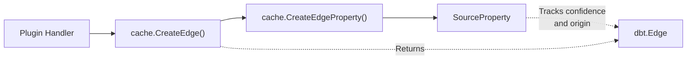

Example from DNS CNAME handler:

```go
edge, err := e.Session.Cache().CreateEdge(&dbt.Edge{
    Relation: &oamdns.BasicDNSRelation{
        Name: "dns_record",
        Header: oamdns.RRHeader{...},
    },
    FromEntity: fqdn,
    ToEntity:   cname,
})
if err == nil && edge != nil {
    e.Session.Cache().CreateEdgeProperty(edge, &general.SourceProperty{
        Source:     d.source.Name,
        Confidence: d.source.Confidence,
    })
}
```

**Sources:** [engine/plugins/dns/cname.go:100-117](), [engine/plugins/dns/ip.go:124-141](), [engine/plugins/support/database.go:254-260]()

## Relation Types and Semantics

### DNS Relations

DNS plugins create edges with specialized relation types that encode DNS record information. These relations implement the `oam.Relation` interface and include DNS-specific metadata.

#### BasicDNSRelation

Used for simple DNS records like A, AAAA, CNAME, NS, and PTR records. Contains the DNS resource record header information.

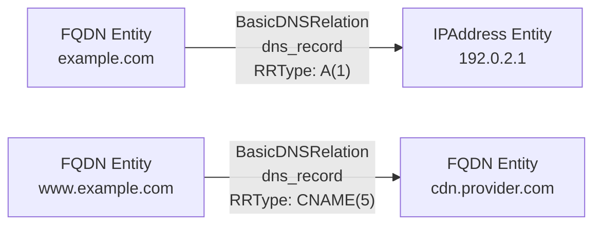

The `BasicDNSRelation` struct includes:
- `Name`: Always `"dns_record"`
- `Header.RRType`: DNS record type (1=A, 5=CNAME, 12=PTR, 28=AAAA, etc.)
- `Header.Class`: DNS class (typically 1=IN)
- `Header.TTL`: Time-to-live value

**Sources:** [engine/plugins/dns/cname.go:101-108](), [engine/plugins/dns/ip.go:125-132](), [engine/plugins/dns/reverse.go:139-147]()

#### PrefDNSRelation

Used for DNS records with preference/priority values, such as MX (mail exchanger) records. Extends `BasicDNSRelation` with a `Preference` field.

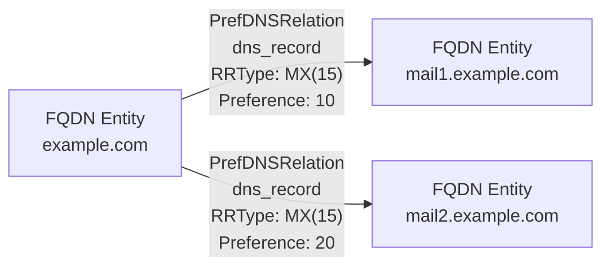

**Sources:** [engine/plugins/dns/subs.go:269-281]()

#### SRVDNSRelation

Used for SRV (service) records which include priority, weight, and port information for service discovery.

**Sources:** [engine/plugins/dns/plugin.go:202-215]()

### Identity Relations

The `id` relation connects entities to their identifiers. This is a fundamental relationship type used extensively throughout the system to link organizations to LEI codes, email addresses, company IDs, and other identifier types.

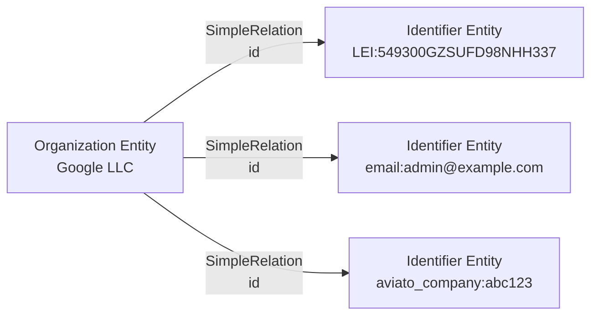

The GLEIF plugin creates `id` edges when associating organizations with their Legal Entity Identifiers:

**Sources:** [engine/plugins/api/gleif/org_lei.go:158-161](), [engine/plugins/api/gleif/fuzzy.go:191-202](), [engine/plugins/api/aviato/company_rounds.go:437-441]()

### Organizational Relations

#### Subsidiary Relationships

The `subsidiary` relation represents parent-child organizational hierarchies. GLEIF discovers these through the LEI system's corporate structure data.

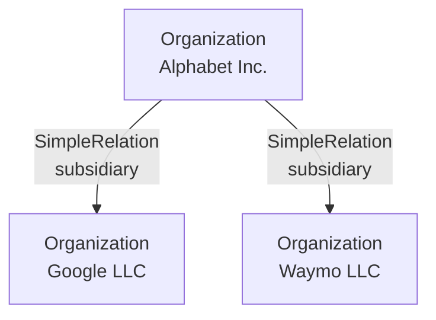

**Sources:** [engine/plugins/api/gleif/related.go:123](), [engine/plugins/api/gleif/related.go:131]()

#### Member Relationships

The `member` relation represents employment or membership relationships between people and organizations, discovered through services like Aviato.

**Sources:** Context indicates this exists but not directly shown in provided files

#### Organization Relationships

Contact records connect to organizations via the `organization` relation, linking contact information to the companies they represent.

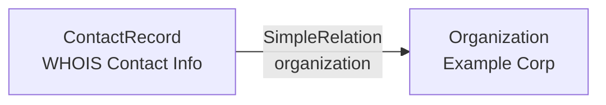

**Sources:** [engine/plugins/whois/domain_record.go:266-269](), [engine/plugins/enrich/tls_cert.go:409-411]()

### Location Relations

Location relations connect entities to physical addresses and locations. The system distinguishes between different address types with semantic meaning.

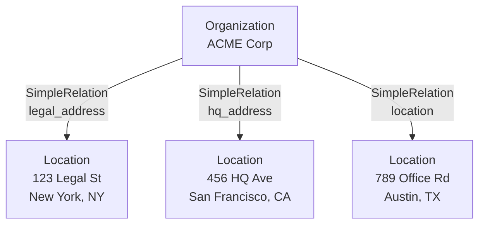

Relation types include:
- **`legal_address`**: The registered legal address from LEI records
- **`hq_address`**: The headquarters address from LEI records  
- **`location`**: Other addresses or general location associations

**Sources:** [engine/plugins/api/gleif/org_lei.go:89](), [engine/plugins/api/gleif/org_lei.go:92](), [engine/plugins/api/gleif/org_lei.go:96]()

### Network Relations

#### Port Relations

The `port` relation connects hosts (FQDNs or IP addresses) to services running on specific ports. The relation object is a `PortRelation` that includes port number and protocol.

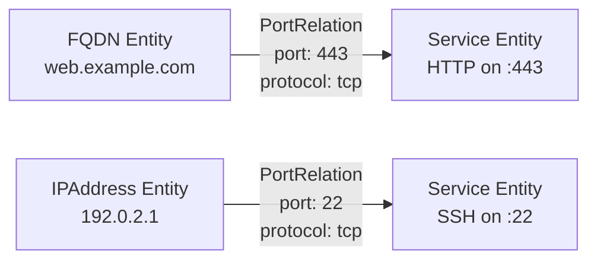

The system intelligently matches existing services to avoid duplication by checking port, protocol, and service characteristics.

**Sources:** [engine/plugins/support/database.go:166-260]()

#### PTR Record Relations

The `ptr_record` relation links IP addresses to their reverse DNS FQDN representations.

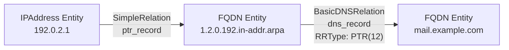

**Sources:** [engine/plugins/dns/reverse.go:170-179]()

#### Node Relations

The `node` relation represents domain hierarchy, connecting apex domains to their subdomains in a tree structure.

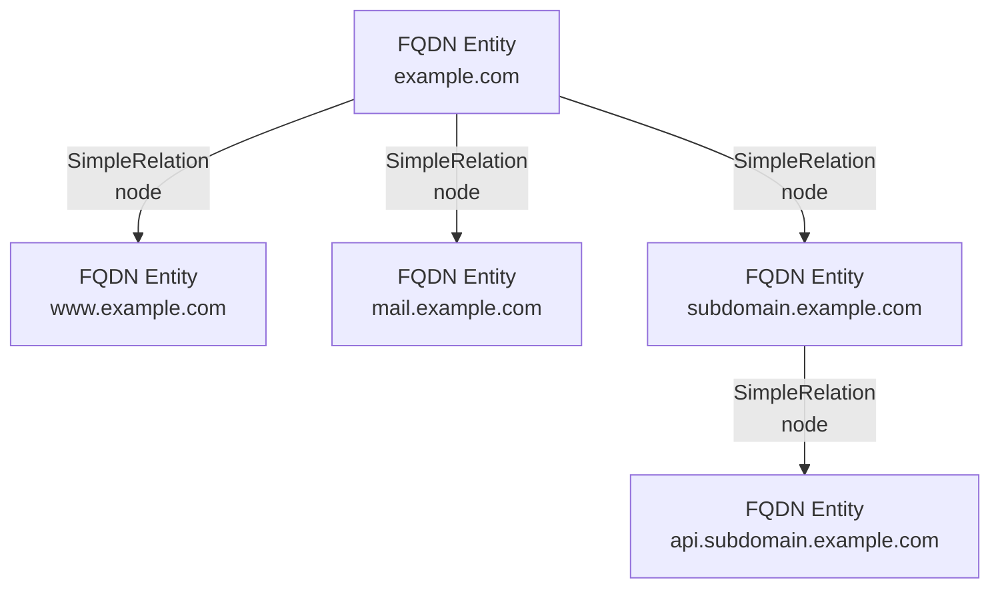

**Sources:** [engine/plugins/dns/apex.go:56-63]()

### Contact Relations

Contact records serve as connection points for various contact-related information. Multiple relation types connect contact records to other entities.

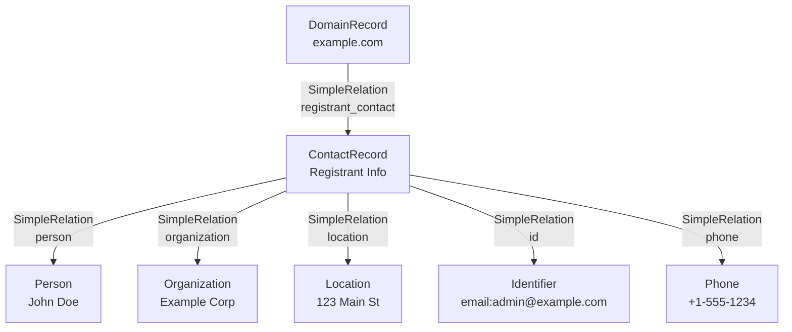

Contact relation types include:
- **`registrant_contact`**: Domain registrant information
- **`admin_contact`**: Administrative contact
- **`technical_contact`**: Technical contact
- **`billing_contact`**: Billing contact
- **`abuse_contact`**: Abuse contact (RDAP)
- **`subject_contact`**: TLS certificate subject
- **`issuer_contact`**: TLS certificate issuer

**Sources:** [engine/plugins/whois/domain_record.go:171-182](), [engine/plugins/rdap/plugin.go:191-204](), [engine/plugins/enrich/tls_cert.go:304-312]()

### Certificate Relations

TLS certificate expansion creates multiple relation types connecting certificates to the entities they reference.

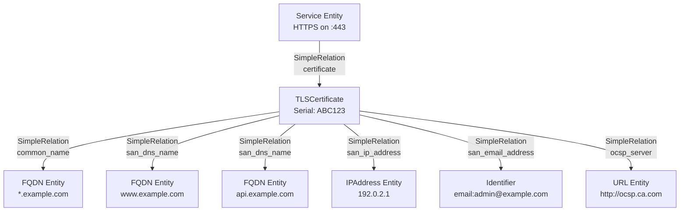

Certificate-related relations:
- **`common_name`**: Links to the CN in the certificate subject
- **`san_dns_name`**: Subject Alternative Name DNS entries
- **`san_ip_address`**: Subject Alternative Name IP entries
- **`san_email_address`**: Subject Alternative Name email entries
- **`san_url`**: Subject Alternative Name URI entries
- **`ocsp_server`**: OCSP responder URLs
- **`issuing_certificate_url`**: CA issuer URLs
- **`certificate`**: Reverse relation from service to its certificate

**Sources:** [engine/plugins/enrich/tls_cert.go:182-297]()

### Financial Relations

The Aviato plugin creates financial flow relationships for funding rounds:

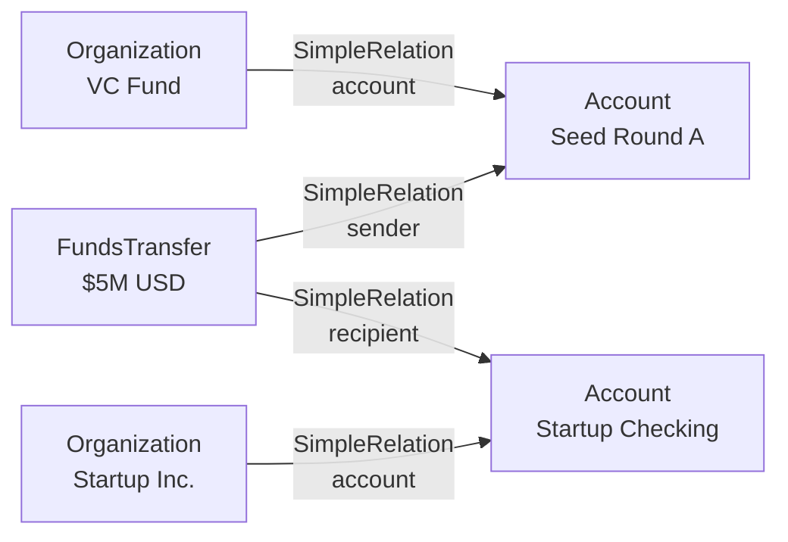

**Sources:** [engine/plugins/api/aviato/company_rounds.go:265-277]()

### Domain Registration Relations

WHOIS and RDAP data create relations connecting domain records to their infrastructure and contacts:

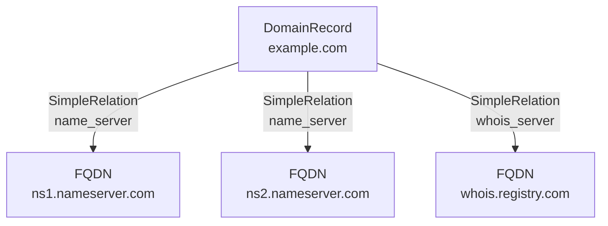

**Sources:** [engine/plugins/whois/domain_record.go:138-160]()

## Source Attribution

### SourceProperty on Edges

Every edge created by a plugin should have a `SourceProperty` attached as an edge property. This tracks which data source discovered the relationship and with what confidence level.

```go
type SourceProperty struct {
    Source:     string  // Plugin/source name
    Confidence: int     // 0-100 confidence score
}
```

The `SourceProperty` is attached via `CreateEdgeProperty`:

```go
_, err = session.Cache().CreateEdgeProperty(edge, &general.SourceProperty{
    Source:     pluginName,
    Confidence: 100,
})
```

**Sources:** [engine/plugins/dns/cname.go:113-116](), [engine/plugins/api/gleif/plugin.go:85-90]()

### Source Tracking Pattern

Plugins create edges with consistent source attribution:

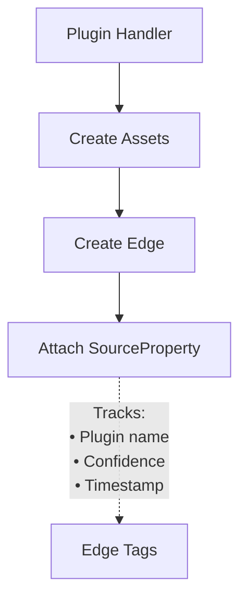

This enables:
1. **Attribution tracking**: Know which plugin discovered each relationship
2. **Confidence scoring**: Different sources have different reliability (e.g., DNS=100, fuzzy matching=60-90)
3. **Source filtering**: Query edges from specific sources
4. **Duplicate detection**: Check if a relationship was already discovered by a source

**Sources:** [engine/plugins/support/database.go:254-260](), [engine/plugins/dns/ip.go:137-140]()

## Edge Querying Patterns

### Outgoing Edges Lookup

Plugins frequently query outgoing edges to discover related entities. The pattern involves:
1. Query edges by relation type(s)
2. Filter by timestamp (TTL-based)
3. Check for source property tags
4. Retrieve the target entity

```go
// Query outgoing edges with specific relation types
edges, err := session.Cache().OutgoingEdges(entity, sinceTime, "dns_record", "id")
if err == nil {
    for _, edge := range edges {
        // Check for source attribution
        tags, _ := session.Cache().GetEdgeTags(edge, sinceTime, sourceName)
        
        // Get target entity
        target, _ := session.Cache().FindEntityById(edge.ToEntity.ID)
        // Process target...
    }
}
```

**Sources:** [engine/plugins/api/gleif/fuzzy.go:52-65](), [engine/plugins/api/aviato/company_rounds.go:100-112]()

### Incoming Edges Lookup

Querying incoming edges to find entities that reference the current entity:

```go
// Find entities that have edges pointing to this one
edges, err := session.Cache().IncomingEdges(entity, sinceTime, "id")
if err == nil {
    for _, edge := range edges {
        // Get source entity
        source, _ := session.Cache().FindEntityById(edge.FromEntity.ID)
        // Process source...
    }
}
```

**Sources:** [engine/plugins/api/gleif/related.go:52-64](), [engine/plugins/api/aviato/company_rounds.go:81-93]()

### TTL-Based Edge Filtering

The DNS plugin implements sophisticated TTL-based edge lookup to avoid redundant queries:

```go
func (d *dnsPlugin) lookupWithinTTL(session et.Session, name string, 
    atype oam.AssetType, since time.Time, reltype oam.RelationType, 
    rrtypes ...int) []*dbt.Entity {
    
    edges, err := session.Cache().OutgoingEdges(entity, since, "dns_record")
    
    for _, edge := range edges {
        // Check edge tags for source property
        tags, _ := session.Cache().GetEdgeTags(edge, since, sourceName)
        
        // Verify RR type matches
        var rrtype int
        switch v := edge.Relation.(type) {
        case *oamdns.BasicDNSRelation:
            rrtype = v.Header.RRType
        case *oamdns.PrefDNSRelation:
            rrtype = v.Header.RRType
        }
        
        // Return matching entities
    }
}
```

This pattern enables DNS plugins to check if a query was already performed within the TTL window, avoiding redundant DNS lookups while ensuring data freshness.

**Sources:** [engine/plugins/dns/plugin.go:172-229](), [engine/plugins/dns/cname.go:59-72]()

### Relation Type Checking

When querying edges, plugins often need to examine the relation type and extract type-specific information:

```go
switch v := edge.Relation.(type) {
case *oamdns.BasicDNSRelation:
    rrtype := v.Header.RRType
    ttl := v.Header.TTL
case *oamdns.PrefDNSRelation:
    preference := v.Preference
case *general.PortRelation:
    port := v.PortNumber
    protocol := v.Protocol
}
```

**Sources:** [engine/plugins/dns/plugin.go:202-215](), [engine/plugins/support/database.go:189-195]()

## Edge Creation Helper Functions

### Simple Edge Creation

The WHOIS domain record handler provides a helper for creating simple edges with source attribution:

```go
func (r *domrec) createSimpleEdge(c *cache.Cache, rel oam.Relation, from, to *dbt.Entity) {
    if edge, err := c.CreateEdge(&dbt.Edge{
        Relation:   rel,
        FromEntity: from,
        ToEntity:   to,
    }); err == nil && edge != nil {
        c.CreateEdgeProperty(edge, &general.SourceProperty{
            Source:     r.plugin.source.Name,
            Confidence: r.plugin.source.Confidence,
        })
    }
}
```

**Sources:** [engine/plugins/whois/domain_record.go:286-297]()

### GLEIF Relation Helper

The GLEIF plugin encapsulates edge creation with source tracking:

```go
func (g *gleif) createRelation(session et.Session, obj *dbt.Entity, 
    rel oam.Relation, subject *dbt.Entity, conf int) error {
    
    edge, err := session.Cache().CreateEdge(&dbt.Edge{
        Relation:   rel,
        FromEntity: obj,
        ToEntity:   subject,
    })
    if err != nil {
        return err
    }
    
    _, err = session.Cache().CreateEdgeProperty(edge, &general.SourceProperty{
        Source:     g.source.Name,
        Confidence: conf,
    })
    return err
}
```

**Sources:** [engine/plugins/api/gleif/plugin.go:73-90]()

## Summary

Amass's edge system provides a rich, typed relationship model that captures the semantic connections between assets. Key principles include:

1. **Typed Relations**: Each edge has a specific relation type with semantic meaning
2. **Source Attribution**: Every edge tracks its source plugin and confidence via `SourceProperty`
3. **Directional**: Edges have explicit from/to directionality
4. **Queryable**: Edges can be efficiently queried by type, direction, timestamp, and source
5. **Metadata-Rich**: Relations can include additional metadata (DNS headers, port numbers, preferences, etc.)

This structure enables complex graph traversals and analysis, supporting use cases like:
- Finding all subdomains of a domain (`node` relations)
- Discovering corporate hierarchies (`subsidiary` relations)
- Mapping network infrastructure (`dns_record`, `port` relations)
- Tracing data provenance (via `SourceProperty`)

**Sources:** [engine/plugins/dns/plugin.go:1-278](), [engine/plugins/api/gleif/plugin.go:1-91](), [engine/plugins/support/database.go:1-261](), [engine/plugins/whois/domain_record.go:1-298]()