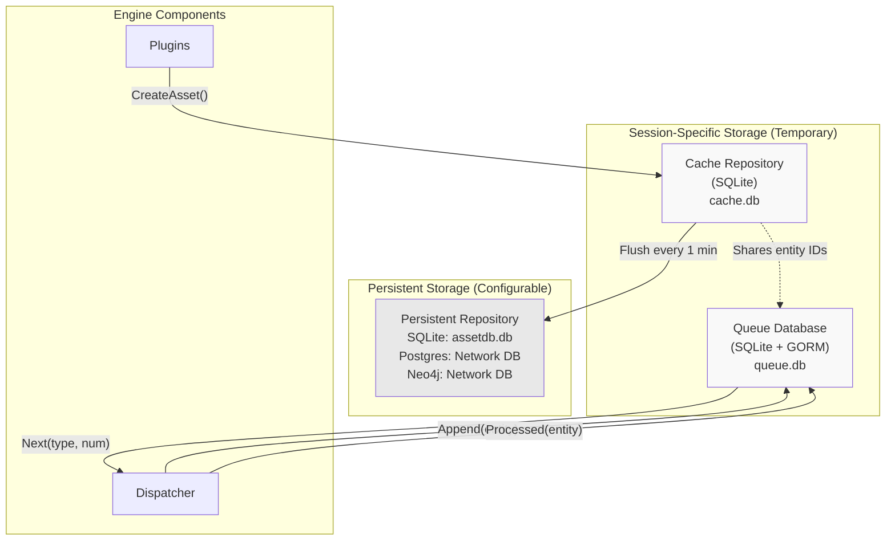
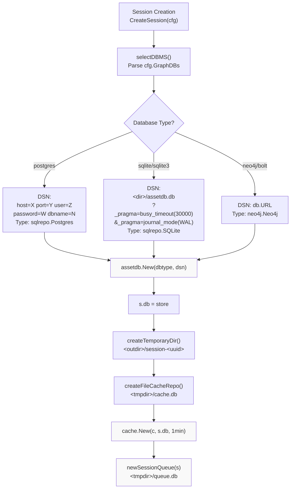
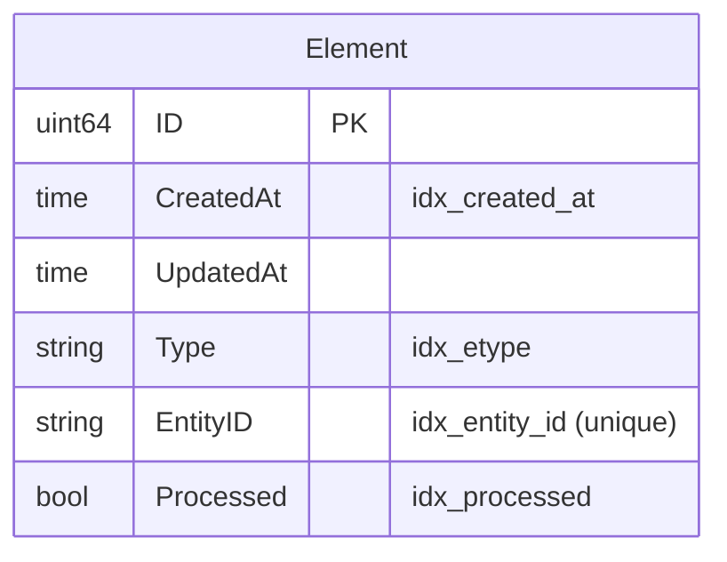
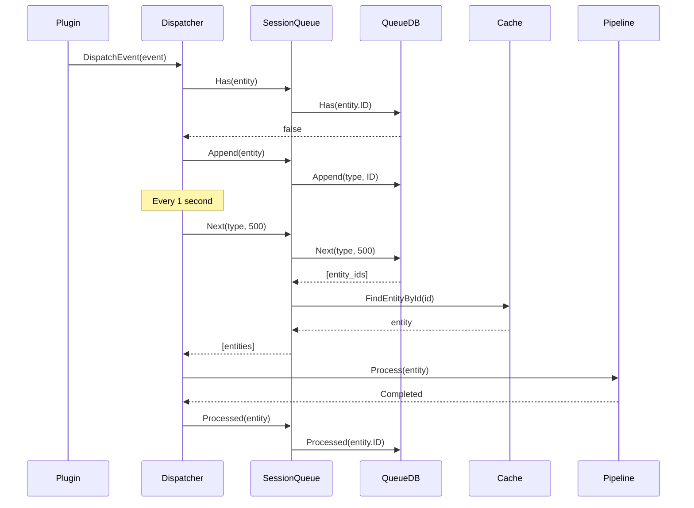
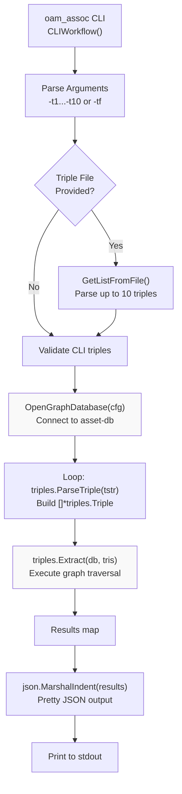
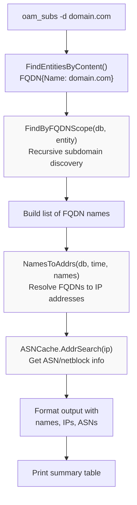
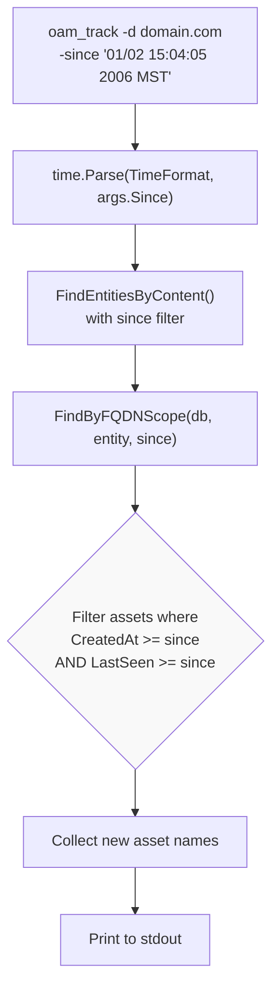
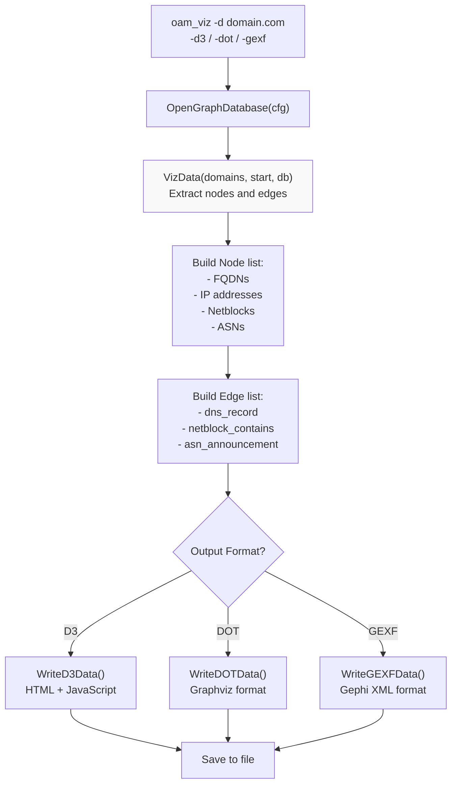

# Graph Database and Querying

# Graph Database and Querying

<details>
<summary>Relevant source files</summary>

The following files were used as context for generating this wiki page:

- [cmd/oam_enum/main.go](cmd/oam_enum/main.go)
- [cmd/oam_viz/main.go](cmd/oam_viz/main.go)
- [config/engineapi.go](config/engineapi.go)
- [config/graphdb.go](config/graphdb.go)
- [engine/api/graphql/client/client.go](engine/api/graphql/client/client.go)
- [engine/api/graphql/server/schema.resolvers.go](engine/api/graphql/server/schema.resolvers.go)
- [engine/dispatcher/dispatcher.go](engine/dispatcher/dispatcher.go)
- [engine/registry/pipelines.go](engine/registry/pipelines.go)
- [engine/sessions/manager.go](engine/sessions/manager.go)
- [engine/sessions/queue.go](engine/sessions/queue.go)
- [engine/sessions/queuedb/queue_db.go](engine/sessions/queuedb/queue_db.go)
- [engine/sessions/queuedb/queue_db_test.go](engine/sessions/queuedb/queue_db_test.go)
- [engine/sessions/session.go](engine/sessions/session.go)
- [engine/types/events.go](engine/types/events.go)
- [engine/types/registry.go](engine/types/registry.go)
- [engine/types/sessions.go](engine/types/sessions.go)
- [internal/amass_engine/cli.go](internal/amass_engine/cli.go)
- [internal/assoc/cli.go](internal/assoc/cli.go)
- [internal/enum/cli.go](internal/enum/cli.go)
- [internal/enum/files.go](internal/enum/files.go)
- [internal/subs/cli.go](internal/subs/cli.go)
- [internal/tools/log.go](internal/tools/log.go)
- [internal/track/cli.go](internal/track/cli.go)
- [internal/viz/cli.go](internal/viz/cli.go)

</details>


This document explains the graph database implementation in Amass, including the three-tier storage architecture (cache, queue, persistent), database configuration, and querying mechanisms. The system uses the `asset-db` library to provide a unified repository interface over multiple backend types (SQLite, Postgres, Neo4j) and implements graph traversal using triple-based queries.

For information about the asset types and properties stored in the database, see [Asset Types and Properties](#7.2). For details on relationship types and edge semantics, see [Relationships and Edges](#7.3).

---

## Storage Architecture Overview

Amass uses a three-tier storage architecture to balance performance, durability, and work distribution:

**Diagram: Three-Tier Storage Architecture**



**Sources:** [engine/sessions/session.go:29-95](), [engine/sessions/queuedb/queue_db.go:16-56](), [engine/dispatcher/dispatcher.go:124-159]()

### Storage Tiers

| Tier | Purpose | Lifetime | Backend | Location |
|------|---------|----------|---------|----------|
| **Cache** | Temporary asset storage, deduplication | Session duration | SQLite | `<tmpdir>/cache.db` |
| **Queue** | Work item tracking, processing state | Session duration | SQLite + GORM | `<tmpdir>/queue.db` |
| **Persistent** | Long-term asset storage | Permanent | SQLite/Postgres/Neo4j | Configurable |

The **cache** provides fast write access for plugins and automatic flushing to persistent storage every minute [engine/sessions/session.go:81](). The **queue** tracks which entities need processing and their completion state. The **persistent** database stores all discovered assets permanently for analysis.

**Sources:** [engine/sessions/session.go:76-84](), [engine/sessions/queue.go:21-32]()

---

## Database Configuration and Connection

### Database Configuration Structure

The `Database` struct defines connection parameters for graph databases:

```
type Database struct {
    System   string  // "sqlite", "postgres", "neo4j", "bolt"
    Primary  bool    // Whether this is the primary database
    URL      string  // Full connection URI
    Username string  // Authentication username
    Password string  // Authentication password
    Host     string  // Database host
    Port     string  // Database port
    DBName   string  // Database name
    Options  string  // Connection options
}
```

**Sources:** [config/graphdb.go:15-25]()

### Environment Variable Configuration

Database connections can be configured via environment variables:

| Variable | Purpose | Default |
|----------|---------|---------|
| `AMASS_DB_USER` | Database username | (required) |
| `AMASS_DB_PASSWORD` | Database password | (none) |
| `AMASS_DB_HOST` | Database host | `localhost` |
| `AMASS_DB_PORT` | Database port | `5432` |
| `AMASS_DB_NAME` | Database name | `assetdb` |

The `LoadDatabaseEnvSettings()` method constructs a Postgres connection URI from these variables [config/graphdb.go:61-102]().

**Sources:** [config/graphdb.go:27-102]()

### Session Database Initialization

**Diagram: Database Connection Flow**



**Sources:** [engine/sessions/session.go:155-245]()

The session initialization sequence [engine/sessions/session.go:47-95]():

1. **Parse database configuration** - `selectDBMS()` examines `cfg.GraphDBs` to find the primary database [engine/sessions/session.go:162-220]()
2. **Construct DSN** - Build connection string based on database type (SQLite, Postgres, Neo4j)
3. **Initialize repository** - Call `assetdb.New(dbtype, dsn)` to create the repository interface [engine/sessions/session.go:214]()
4. **Create temporary directory** - Session-specific directory under the output directory [engine/sessions/session.go:222-234]()
5. **Create cache repository** - SQLite database in temporary directory [engine/sessions/session.go:236-245]()
6. **Initialize cache** - Wrap cache repository with flush-to-persistent logic, 1-minute interval [engine/sessions/session.go:81]()
7. **Create session queue** - SQLite + GORM database for work tracking [engine/sessions/queue.go:21-32]()

**Default SQLite Configuration:**

If no databases are specified in `cfg.GraphDBs`, the system defaults to SQLite [engine/sessions/session.go:164-170]():

```
{
    Primary: true,
    System:  "sqlite",
}
```

The DSN includes pragmas for reliability:
- `busy_timeout(30000)` - Wait up to 30 seconds on lock contention
- `journal_mode(WAL)` - Write-Ahead Logging for concurrent reads

**Sources:** [engine/sessions/session.go:47-245](), [config/graphdb.go:61-102]()

---

## Cache vs Persistent Storage

### Cache Repository

The cache provides fast, session-scoped storage with automatic flushing to the persistent database.

**Cache Initialization:**

```
// Create file-based cache repository
c, err := assetdb.New(sqlrepo.SQLite, dsn)

// Wrap with cache.Cache that flushes every minute
s.cache, err = cache.New(c, s.db, time.Minute)
```

**Sources:** [engine/sessions/session.go:76-84]()

### Cache Operations

| Operation | Method | Purpose |
|-----------|--------|---------|
| Create asset | `cache.CreateAsset(asset)` | Store new asset in cache, deduplicate |
| Find by ID | `cache.FindEntityById(id)` | Retrieve entity from cache or persistent DB |
| Find by content | `cache.FindEntitiesByContent(asset, time)` | Search for matching assets |
| Flush | Automatic every 1 minute | Write cached assets to persistent storage |

**Plugin Asset Creation Flow:**

Plugins create assets that flow through the cache to persistent storage:

```
// Plugin handler creates asset
dba, err := session.Cache().CreateAsset(oamAsset)

// Cache deduplicates and stores locally
// Every 1 minute, cache flushes to session.DB()
```

**Sources:** [engine/api/graphql/server/schema.resolvers.go:96-99](), [engine/sessions/session.go:81]()

### Persistent Repository

The persistent repository stores all discovered assets permanently. It supports three backends:

**SQLite Backend:**
- Path: `<output_directory>/assetdb.db`
- Type: `sqlrepo.SQLite`
- Single-file database, good for local enumeration

**Postgres Backend:**
- Connection: `host=X port=Y user=Z password=W dbname=N`
- Type: `sqlrepo.Postgres`
- Network database, supports concurrent sessions

**Neo4j Backend:**
- Connection: Bolt/Neo4j URL from config
- Type: `neo4j.Neo4j`
- Graph-native database, optimized for traversal

**Sources:** [engine/sessions/session.go:179-204]()

### Cache-to-Persistent Flush Mechanism

The `cache.Cache` wrapper automatically flushes changes to the persistent repository every minute [engine/sessions/session.go:81](). This provides:

- **Fast writes** - Plugins write to in-memory structures in SQLite cache
- **Deduplication** - Cache prevents duplicate asset creation
- **Durability** - Periodic flush ensures data isn't lost
- **Consistency** - All cached data eventually reaches persistent storage

**Sources:** [engine/sessions/session.go:81]()

---

## Session Queue Database

The session queue tracks work items (entities) that need processing by the dispatcher and plugin pipelines.

### Queue Database Schema

**Diagram: Queue Database Structure**



**Sources:** [engine/sessions/queuedb/queue_db.go:20-27]()

### Queue Indexes

The queue database uses five indexes for efficient operations:

| Index | Columns | Purpose |
|-------|---------|---------|
| Primary Key | `ID` | Unique row identifier |
| `idx_created_at` | `CreatedAt ASC` | FIFO ordering for `Next()` |
| `idx_etype` | `Type` | Filter by asset type |
| `idx_entity_id` | `EntityID` | Uniqueness constraint, fast `Has()` lookup |
| `idx_processed` | `Processed` | Filter unprocessed items |

**Sources:** [engine/sessions/queuedb/queue_db.go:20-27]()

### Queue Operations

**QueueDB Interface:**

```
type QueueDB struct {
    db *gorm.DB
}

// Core operations
func (r *QueueDB) Has(eid string) bool
func (r *QueueDB) Append(atype oam.AssetType, eid string) error
func (r *QueueDB) Next(atype oam.AssetType, num int) ([]string, error)
func (r *QueueDB) Processed(eid string) error
func (r *QueueDB) Delete(eid string) error
```

**Sources:** [engine/sessions/queuedb/queue_db.go:16-115]()

**Operation Details:**

1. **Has(eid)** - Check if entity is already queued [engine/sessions/queuedb/queue_db.go:69-78]()
   - Queries: `SELECT COUNT(*) WHERE entity_id = ?`
   - Used by dispatcher to prevent duplicate scheduling

2. **Append(atype, eid)** - Add entity to queue [engine/sessions/queuedb/queue_db.go:80-86]()
   - Inserts with `Processed = false`
   - Type stored as string for filtering

3. **Next(atype, num)** - Retrieve unprocessed entities [engine/sessions/queuedb/queue_db.go:88-100]()
   - Query: `WHERE etype = ? AND processed = ? ORDER BY created_at ASC LIMIT ?`
   - FIFO processing order

4. **Processed(eid)** - Mark entity as processed [engine/sessions/queuedb/queue_db.go:102-104]()
   - Update: `SET processed = true WHERE entity_id = ?`
   - Called after pipeline completion

5. **Delete(eid)** - Remove entity from queue [engine/sessions/queuedb/queue_db.go:106-115]()
   - Hard delete from database

**Sources:** [engine/sessions/queuedb/queue_db.go:69-115]()

### Queue-Dispatcher Integration

**Diagram: Queue and Dispatcher Workflow**



**Sources:** [engine/dispatcher/dispatcher.go:178-209](), [engine/sessions/queue.go:35-95]()

The dispatcher interacts with the queue in two ways:

**Event Dispatch (safeDispatch):**
1. Check `session.Queue().Has(entity)` to prevent duplicates [engine/dispatcher/dispatcher.go:185]()
2. Append to queue with `session.Queue().Append(entity)` [engine/dispatcher/dispatcher.go:189]()
3. If `event.Meta` is set, immediately append to pipeline [engine/dispatcher/dispatcher.go:201-206]()

**Queue Filling (fillPipelineQueues):**
1. Every 1 second [engine/dispatcher/dispatcher.go:94](), check pipeline queues
2. For pipelines below `MinPipelineQueueSize` (100 items) [engine/dispatcher/dispatcher.go:133]()
3. Request up to `MaxPipelineQueueSize / num_sessions` entities per type [engine/dispatcher/dispatcher.go:139]()
4. Retrieve entities from queue and create events [engine/dispatcher/dispatcher.go:145-156]()
5. Mark as processed after pipeline completion [engine/dispatcher/dispatcher.go:222]()

**Sources:** [engine/dispatcher/dispatcher.go:75-227]()

---

## Querying the Graph Database

### Triple-Based Graph Traversal

Amass uses **triple-based queries** to traverse the graph database. A triple is a pattern `(subject, predicate, object)` that describes a relationship traversal.

**Triple Syntax:**

```
fqdn -> dns_record -> ipaddr
```

This reads as: "Starting from an FQDN asset, follow 'dns_record' edges to reach IPAddress assets."

**Sources:** [internal/assoc/cli.go:22-24]()

### The oam_assoc Tool

The `oam_assoc` command-line tool performs graph traversal queries using a series of triples.

**Command Structure:**

```bash
oam_assoc -t1 "triple1" -t2 "triple2" ... -t10 "triple10"
# or
oam_assoc -tf triples_file.txt
```

**Sources:** [internal/assoc/cli.go:21-24]()

**Diagram: oam_assoc Query Execution Flow**



**Sources:** [internal/assoc/cli.go:63-174]()

**Implementation Details:**

1. **Argument Parsing** - Up to 10 triples via `-t1` through `-t10` flags, or from a file via `-tf` [internal/assoc/cli.go:40-61]()

2. **Triple File Format** - Plain text, one triple per line:
   ```
   fqdn -> dns_record -> ipaddr
   ipaddr -> netblock_contains -> netblock
   netblock -> asn_announcement -> as
   ```
   [internal/assoc/cli.go:104-119]()

3. **Database Connection** - Uses `tools.OpenGraphDatabase(cfg)` to connect to the configured repository [internal/assoc/cli.go:136]()

4. **Triple Parsing** - Each triple string is parsed with `triples.ParseTriple(tstr)` [internal/assoc/cli.go:148]()

5. **Graph Extraction** - `triples.Extract(db, tris)` performs the traversal, returning results as a map [internal/assoc/cli.go:160]()

6. **Output** - Results formatted as indented JSON [internal/assoc/cli.go:167-173]()

**Sources:** [internal/assoc/cli.go:63-174]()

### Direct Repository Queries

Beyond triple-based traversal, analysis tools query the repository directly using the `repository.Repository` interface:

**Common Query Methods:**

| Method | Purpose | Usage Example |
|--------|---------|---------------|
| `FindEntitiesByContent(asset, time)` | Find assets matching content | Get all FQDNs for a domain |
| `FindEntityById(id)` | Retrieve specific entity | Lookup entity by UUID |
| `IncomingEdges(entity, relation)` | Get incoming relationships | Find all DNS records pointing to an IP |
| `OutgoingEdges(entity, relation)` | Get outgoing relationships | Find all IPs resolved from an FQDN |

**Sources:** [internal/subs/cli.go:263-292](), [internal/track/cli.go:151-192]()

---

## Database Operations by Analysis Tool

### oam_subs: Subdomain Summary Queries

The `oam_subs` tool queries the database to summarize discovered subdomains with ASN information.

**Query Sequence:**



**Sources:** [internal/subs/cli.go:173-261]()

**Key Operations:**

1. **Domain Lookup** - Find root domain entity [internal/subs/cli.go:274]()
   ```
   ents, err := db.FindEntitiesByContent(&oamdns.FQDN{Name: d}, qtime)
   ```

2. **Scope Discovery** - Find all in-scope subdomains [internal/subs/cli.go:275]()
   ```
   n, err := amassdb.FindByFQDNScope(db, ents[0], qtime)
   ```

3. **Address Resolution** - Map FQDNs to IP addresses [internal/subs/cli.go:303]()
   ```
   pairs, err := amassnet.NamesToAddrs(db, qtime, namestrs...)
   ```

4. **ASN Enrichment** - Add autonomous system information [internal/subs/cli.go:351]()
   ```
   i := cache.AddrSearch(a.Address.String())
   ```

**Sources:** [internal/subs/cli.go:263-372]()

### oam_track: Time-Based Filtering

The `oam_track` tool identifies newly discovered assets since a specified timestamp.

**Query Logic:**



**Sources:** [internal/track/cli.go:61-149]()

**Filtering Implementation:**

The tool uses two timestamps for filtering [internal/track/cli.go:184-187]():

```
if (a.CreatedAt.Equal(since) || a.CreatedAt.After(since)) &&
   (a.LastSeen.Equal(since) || a.LastSeen.After(since)) {
    res.Insert(n.Name)
}
```

This ensures assets are both:
- **Created** after the timestamp (first discovered)
- **Verified** after the timestamp (recently confirmed)

**Auto-Timestamp Selection:**

If no `since` parameter is provided, the tool automatically uses the most recent asset's timestamp, truncated to midnight [internal/track/cli.go:168-177]():

```
if since.IsZero() {
    var latest time.Time
    for _, a := range assets {
        if a.LastSeen.After(latest) {
            latest = a.LastSeen
        }
    }
    since = latest.Truncate(24 * time.Hour)
}
```

**Sources:** [internal/track/cli.go:151-192]()

### oam_viz: Graph Data Extraction

The `oam_viz` tool extracts nodes and edges from the database for visualization.

**Extraction Flow:**



**Sources:** [internal/viz/cli.go:68-194]()

**Query Parameters:**

The `VizData()` function accepts:
- **Domains** - Root domains to visualize (scope)
- **Start time** - Filter assets discovered after this timestamp
- **Repository** - Database connection

And returns:
- **Nodes** - Array of graph nodes (FQDNs, IPs, etc.)
- **Edges** - Array of graph edges (relationships)

Output formats support interactive exploration (D3.js), static visualization (Graphviz DOT), and import into Gephi (GEXF).

**Sources:** [internal/viz/cli.go:158-194]()

---

## Repository Interface Abstraction

All database operations go through the `repository.Repository` interface from the `asset-db` library. This abstraction allows Amass to support multiple backends (SQLite, Postgres, Neo4j) with a unified API.

**Key Repository Methods:**

```
// Entity operations
FindEntityById(id string) (*Entity, error)
FindEntitiesByContent(asset Asset, since time.Time) ([]*Entity, error)
CreateEntity(entity *Entity) (*Entity, error)

// Edge operations  
CreateEdge(edge *Edge) (*Edge, error)
IncomingEdges(entity *Entity, since time.Time, relations ...string) ([]*Edge, error)
OutgoingEdges(entity *Entity, since time.Time, relations ...string) ([]*Edge, error)

// Lifecycle
Close() error
```

The `cache.Cache` wrapper adds deduplication and periodic flushing on top of the base repository interface.

**Sources:** [engine/sessions/session.go:117](), [engine/sessions/session.go:121]()

---

## Summary

The Amass graph database system provides:

1. **Three-tier storage** - Cache (fast, temporary), Queue (work tracking), Persistent (durable)
2. **Multiple backends** - SQLite for local use, Postgres/Neo4j for production
3. **Session isolation** - Each enumeration session has its own cache and queue
4. **Triple-based queries** - Graph traversal using `oam_assoc` and the `triples.Extract()` API
5. **Analysis tools** - Specialized querying for subdomains (`oam_subs`), changes (`oam_track`), and visualization (`oam_viz`)
6. **Unified interface** - Repository abstraction enables backend portability

The queue database tracks work items with processed/unprocessed state, while the cache provides fast asset creation with automatic deduplication and flushing. The persistent database stores the complete asset graph for offline analysis and long-term tracking.