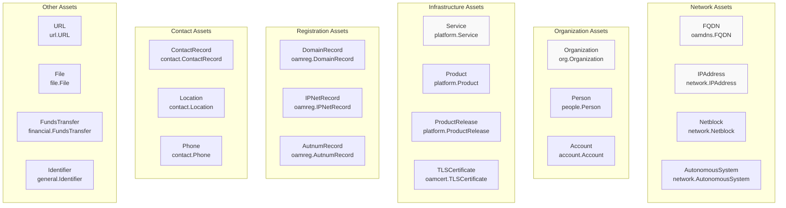
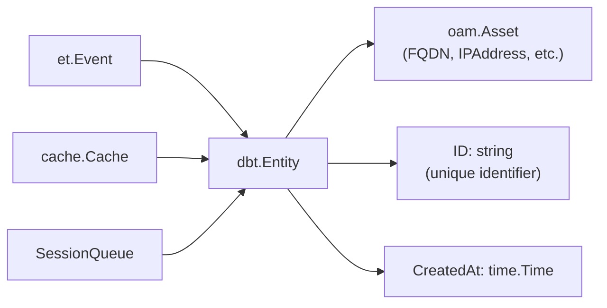
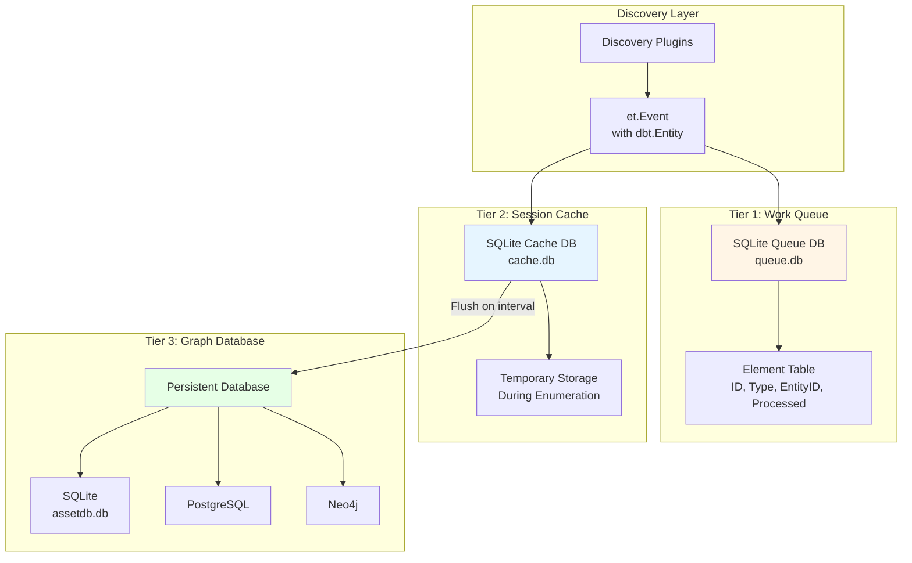
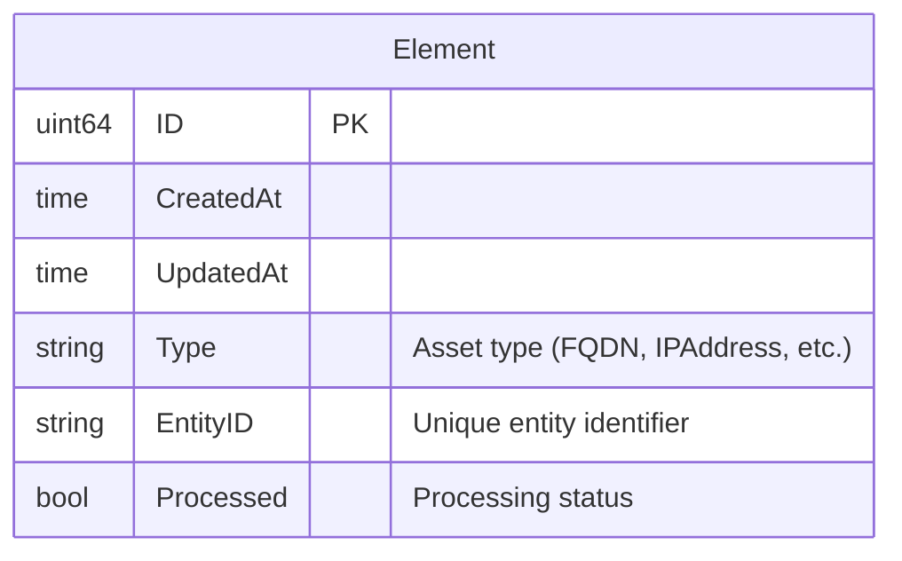
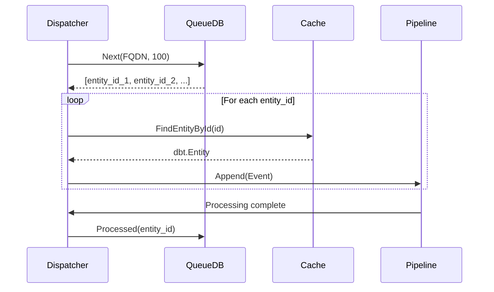
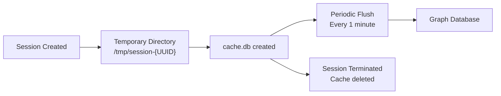
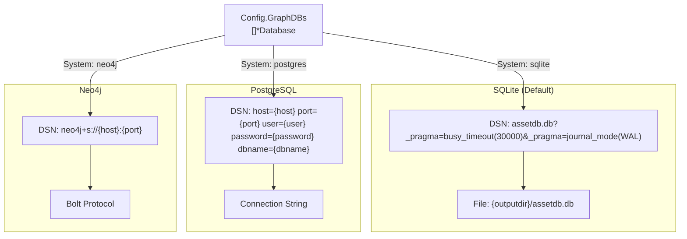
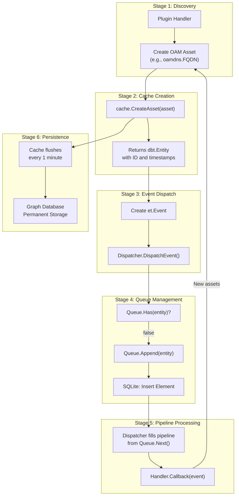
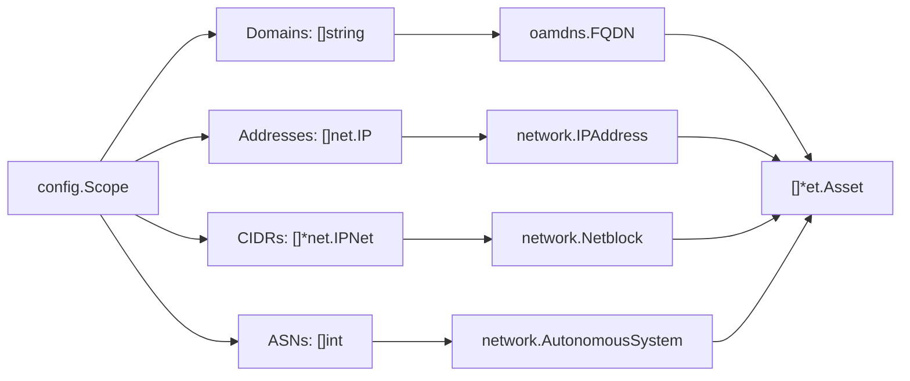
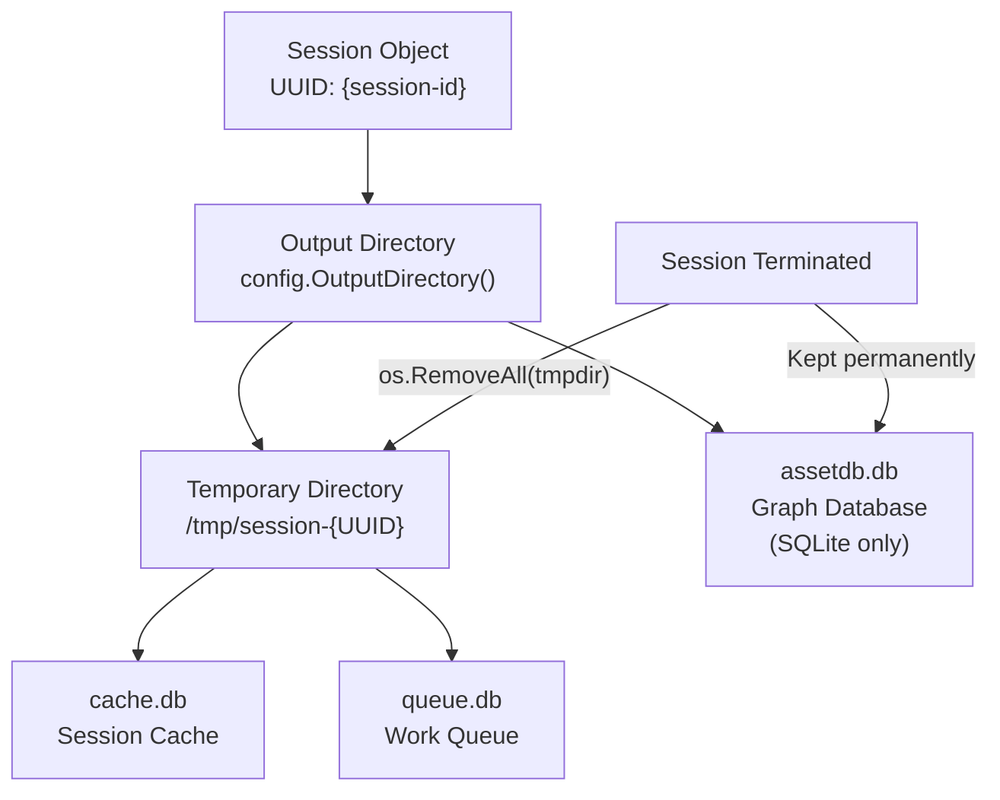

# Data Model and Storage

# Data Model and Storage

<details>
<summary>Relevant source files</summary>

The following files were used as context for generating this wiki page:

- [Dockerfile](Dockerfile)
- [config/engineapi.go](config/engineapi.go)
- [config/graphdb.go](config/graphdb.go)
- [engine/api/graphql/client/client.go](engine/api/graphql/client/client.go)
- [engine/api/graphql/server/schema.resolvers.go](engine/api/graphql/server/schema.resolvers.go)
- [engine/dispatcher/dispatcher.go](engine/dispatcher/dispatcher.go)
- [engine/registry/pipelines.go](engine/registry/pipelines.go)
- [engine/sessions/manager.go](engine/sessions/manager.go)
- [engine/sessions/queue.go](engine/sessions/queue.go)
- [engine/sessions/queuedb/queue_db.go](engine/sessions/queuedb/queue_db.go)
- [engine/sessions/queuedb/queue_db_test.go](engine/sessions/queuedb/queue_db_test.go)
- [engine/sessions/session.go](engine/sessions/session.go)
- [engine/types/events.go](engine/types/events.go)
- [engine/types/registry.go](engine/types/registry.go)
- [engine/types/sessions.go](engine/types/sessions.go)
- [internal/enum/assets.go](internal/enum/assets.go)

</details>


This document explains the data model and storage architecture used by OWASP Amass. It covers the Open Asset Model (OAM) specification that defines asset types and relationships, the three-tier storage architecture (graph database, cache, and work queue), and how assets flow through the system from discovery to persistent storage.

For information about how plugins discover and create assets, see [Plugin System](#6). For details on how the engine processes events containing assets, see [Engine Core](#4).

---

## Data Model Foundation

Amass uses the **Open Asset Model (OAM)** as its core data specification. OAM is a standardized schema for representing cybersecurity assets and their relationships in a graph structure. Each discovered piece of information (domain, IP address, organization, service, etc.) is represented as an OAM asset type.

### OAM Asset Types

The system supports 20 distinct asset types, each implementing the `oam.Asset` interface:



**Asset Type Hierarchy**

Sources: [engine/api/graphql/server/schema.resolvers.go:187-233]()

### Entity Wrapper Pattern

OAM assets are not stored directly. Instead, they are wrapped in a `dbt.Entity` object that provides metadata and tracking:



**Entity Wrapper Pattern**: OAM assets are wrapped in `dbt.Entity` for tracking

The `Event` structure carries entities through the system:

| Field | Type | Purpose |
|-------|------|---------|
| `Name` | `string` | Human-readable event identifier |
| `Entity` | `*dbt.Entity` | Wrapped OAM asset |
| `Meta` | `interface{}` | Optional metadata (e.g., `EmailMeta`) |
| `Dispatcher` | `Dispatcher` | Reference for dispatching new events |
| `Session` | `Session` | Associated session context |

Sources: [engine/types/events.go:14-20](), [engine/types/events.go:32-35]()

---

## Three-Tier Storage Architecture

Amass maintains three distinct storage layers, each serving a specific purpose in the data lifecycle:



**Three-Tier Storage Architecture**: Work queue, session cache, and persistent graph database

### Tier 1: Work Queue Database

The work queue is a **SQLite database** (`queue.db`) that tracks which assets need processing. It implements a priority-based FIFO queue for each asset type.

**Database Schema**:



**Element Table Schema**: Tracks work items by asset type

**Indexes**:
- `idx_created_at` - Orders by creation time (FIFO)
- `idx_etype` - Filters by asset type
- `idx_entity_id` - Ensures uniqueness
- `idx_processed` - Filters unprocessed items

**Key Operations**:

| Method | Purpose | SQL Pattern |
|--------|---------|-------------|
| `Has(eid)` | Check if entity is queued | `SELECT COUNT(*) WHERE entity_id = ?` |
| `Append(type, eid)` | Add to queue | `INSERT INTO elements (type, entity_id, processed) VALUES (?, ?, false)` |
| `Next(type, num)` | Get next N unprocessed | `SELECT * WHERE etype = ? AND processed = false ORDER BY created_at LIMIT ?` |
| `Processed(eid)` | Mark as processed | `UPDATE elements SET processed = true WHERE entity_id = ?` |
| `Delete(eid)` | Remove from queue | `DELETE FROM elements WHERE entity_id = ?` |

The dispatcher fills pipeline queues by calling `Next()` periodically:



**Queue to Pipeline Flow**: How assets move from queue to processing

Sources: [engine/sessions/queuedb/queue_db.go:16-105](), [engine/sessions/queue.go:16-95](), [engine/dispatcher/dispatcher.go:124-159]()

### Tier 2: Session Cache

The session cache is a **temporary SQLite database** (`cache.db`) created per-session in the temporary directory. It uses the `cache.Cache` abstraction from the `asset-db` library.

**Purpose**:
- Fast read/write during active enumeration
- Deduplication of discovered assets
- Batched flushing to persistent storage
- Session isolation (each session has its own cache)

**Cache Lifecycle**:



**Cache Lifecycle**: From creation to cleanup

The cache wraps a file-based repository with a flush interval:

| Component | Implementation | Location |
|-----------|---------------|----------|
| Cache Interface | `cache.Cache` | `asset-db/cache` |
| Backend Repository | SQLite file | `{tmpdir}/cache.db` |
| Flush Interval | 1 minute | Hardcoded |
| DSN Options | `busy_timeout=30000`, `journal_mode=WAL` | Write-ahead logging |

Sources: [engine/sessions/session.go:76-84](), [engine/sessions/session.go:236-245]()

### Tier 3: Persistent Graph Database

The persistent graph database is the **single source of truth** for all discovered assets. Amass supports three database systems:



**Database System Selection**: Three supported backends

**Database Configuration**:

The `Database` struct defines connection parameters:

```go
type Database struct {
    System   string  // "sqlite", "postgres", "neo4j"
    Primary  bool    // Primary database flag
    URL      string  // Full connection URI
    Username string  // Authentication username
    Password string  // Authentication password
    Host     string  // Database host
    Port     string  // Database port
    DBName   string  // Database name
    Options  string  // Extra connection options
}
```

**Database Selection Logic**:

1. If no `GraphDBs` specified → default to SQLite
2. Iterate `Config.GraphDBs` to find `Primary: true`
3. Parse connection string based on `System` type
4. Initialize `assetdb.New(dbtype, dsn)`

**Environment Variable Support**:

| Variable | Purpose | Default |
|----------|---------|---------|
| `AMASS_DB_USER` | Database username | (required) |
| `AMASS_DB_PASSWORD` | Database password | (optional) |
| `AMASS_DB_HOST` | Database host | `localhost` |
| `AMASS_DB_PORT` | Database port | `5432` |
| `AMASS_DB_NAME` | Database name | `assetdb` |

Sources: [engine/sessions/session.go:155-220](), [config/graphdb.go:15-25](), [config/graphdb.go:60-102]()

---

## Asset and Entity Lifecycle

Assets flow through multiple stages from initial discovery to persistent storage:



**Asset Lifecycle**: From discovery to persistent storage

### Stage-by-Stage Breakdown

**Stage 1: Plugin Discovery**
- A plugin handler discovers new information (e.g., DNS lookup finds an IP)
- Creates an OAM asset object: `&network.IPAddress{Address: addr, Type: "IPv4"}`

**Stage 2: Cache Creation**
- Calls `session.Cache().CreateAsset(oamAsset)`
- Cache wraps asset in `dbt.Entity` with unique ID and timestamp
- Returns `*dbt.Entity` for use in events

**Stage 3: Event Dispatch**
- Plugin creates `et.Event` with the entity
- Calls `dispatcher.DispatchEvent(event)`
- Dispatcher validates event has session, entity, and asset

**Stage 4: Queue Management**
- Dispatcher checks `session.Queue().Has(entity)` to prevent duplicates
- If not queued, calls `session.Queue().Append(entity)`
- Queue database inserts `Element` record with `Processed: false`
- Work item counter increments: `stats.WorkItemsTotal++`

**Stage 5: Pipeline Processing**
- Dispatcher periodically calls `Queue.Next(assetType, 100)` to fill pipelines
- Retrieves entity from cache: `cache.FindEntityById(id)`
- Creates new event and appends to asset pipeline
- Handlers execute in priority order (1-9)
- After processing, marks as processed: `Queue.Processed(entity)`
- Work item counter increments: `stats.WorkItemsCompleted++`

**Stage 6: Persistence**
- Cache flushes to graph database every 1 minute
- Assets and relationships persist permanently
- Analysis tools query graph database directly

Sources: [engine/dispatcher/dispatcher.go:60-73](), [engine/dispatcher/dispatcher.go:178-208](), [engine/api/graphql/server/schema.resolvers.go:64-114]()

---

## Asset Creation from Configuration

Initial assets are created from the configuration scope before enumeration begins:



**Scope to Asset Conversion**: Initial seed assets

The `convertScopeToAssets()` function transforms configuration scope into assets:

| Scope Field | OAM Asset Type | Properties |
|-------------|----------------|------------|
| `Domains []string` | `oamdns.FQDN` | `Name: domain` |
| `Addresses []net.IP` | `network.IPAddress` | `Address: netip.Addr`, `Type: "IPv4"/"IPv6"` |
| `CIDRs []*net.IPNet` | `network.Netblock` | `CIDR: netip.Prefix`, `Type: "IPv4"/"IPv6"` |
| `ASNs []int` | `network.AutonomousSystem` | `Number: asn` |

Each asset is wrapped in an `et.Asset` structure:
```go
type Asset struct {
    Session uuid.UUID
    Name    string        // e.g., "asset#1"
    Data    AssetData     // Contains OAMAsset and OAMType
}
```

Sources: [internal/enum/assets.go:19-112]()

---

## Session-Specific Storage

Each session maintains isolated storage in a temporary directory:



**Session Storage Layout**: Temporary and persistent files

**Directory Structure**:
```
{OutputDir}/
├── assetdb.db              # Persistent graph database (SQLite)
└── session-{UUID}/         # Temporary session directory
    ├── cache.db            # Session cache (deleted on exit)
    └── queue.db            # Work queue (deleted on exit)
```

**Cleanup Process**:

When a session terminates via `manager.CancelSession(id)`:
1. Wait for all work items to complete (`WorkItemsCompleted >= WorkItemsTotal`)
2. Close queue database: `Queue.Close()`
3. Close cache: `Cache.Close()`
4. Close graph database connection: `DB.Close()`
5. Remove temporary directory: `os.RemoveAll(tmpdir)`
6. Keep persistent graph database intact

Sources: [engine/sessions/session.go:222-245](), [engine/sessions/manager.go:70-114]()

---

## Database Connection Strings

### SQLite DSN Format

```
{path}/assetdb.db?_pragma=busy_timeout(30000)&_pragma=journal_mode(WAL)
```

**Pragma Options**:
- `busy_timeout(30000)` - Wait 30 seconds when database is locked
- `journal_mode(WAL)` - Write-Ahead Logging for better concurrency

**File Locations**:
- Graph DB: `{OutputDir}/assetdb.db`
- Cache: `{TmpDir}/cache.db`
- Queue: `{TmpDir}/queue.db`

### PostgreSQL DSN Format

```
host={host} port={port} user={user} password={password} dbname={dbname}
```

**Configuration via Environment**:
```bash
export AMASS_DB_USER="amass"
export AMASS_DB_PASSWORD="secret"
export AMASS_DB_HOST="localhost"
export AMASS_DB_PORT="5432"
export AMASS_DB_NAME="assetdb"
```

### Neo4j DSN Format

```
neo4j+s://{host}:{port}
```

**Supported Schemes**:
- `neo4j` - Unencrypted connection
- `neo4j+s` / `neo4j+sec` - Encrypted connection
- `bolt` - Bolt protocol
- `bolt+s` / `bolt+sec` - Encrypted Bolt

Sources: [engine/sessions/session.go:162-220](), [config/graphdb.go:60-157]()

---

## Summary

The Amass data model and storage architecture provides:

1. **Standardized Asset Representation**: OAM specification ensures consistent asset types across all plugins
2. **Three-Tier Storage**: Work queue for scheduling, cache for performance, graph database for persistence
3. **Session Isolation**: Each enumeration session has dedicated temporary storage
4. **Flexible Database Support**: SQLite for standalone use, PostgreSQL/Neo4j for production deployments
5. **Entity Wrapping**: `dbt.Entity` provides metadata layer over OAM assets
6. **Efficient Lifecycle**: Assets flow from discovery → cache → queue → pipeline → persistent storage

The storage architecture balances performance (via caching and queuing) with data integrity (via persistent graph database), enabling Amass to handle large-scale enumerations while maintaining complete asset histories.