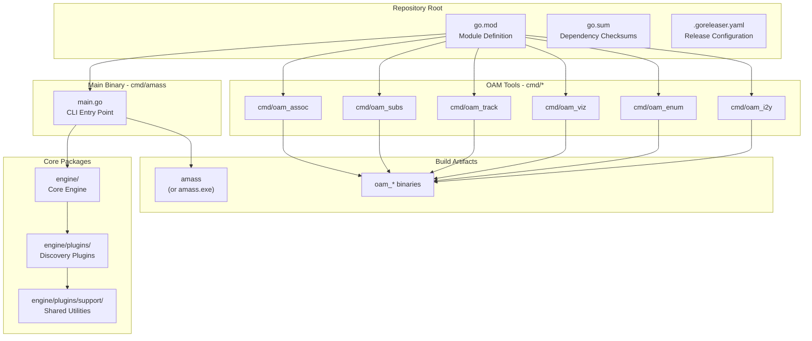
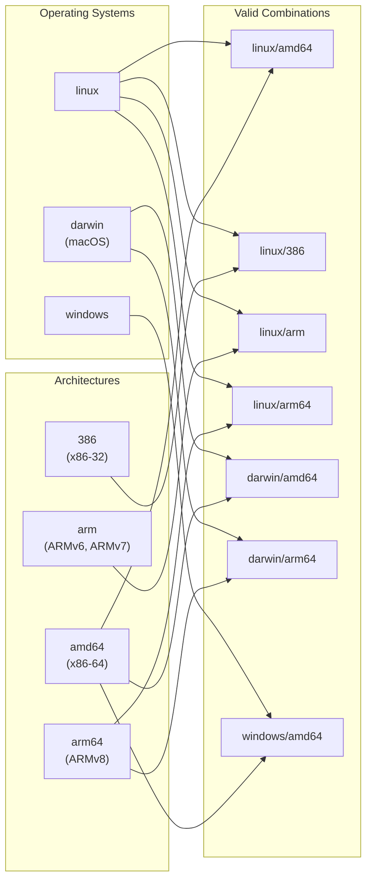
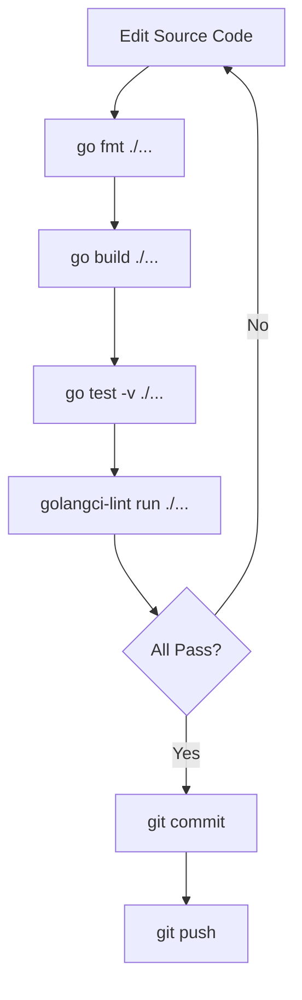

# Building from Source

# Building from Source

<details>
<summary>Relevant source files</summary>

The following files were used as context for generating this wiki page:

- [.codeclimate.yml](.codeclimate.yml)
- [.dockerignore](.dockerignore)
- [.gitattributes](.gitattributes)
- [.github/workflows/docker.yml](.github/workflows/docker.yml)
- [.github/workflows/go.yml](.github/workflows/go.yml)
- [.github/workflows/goreleaser.yml](.github/workflows/goreleaser.yml)
- [.github/workflows/lint.yml](.github/workflows/lint.yml)
- [.gitignore](.gitignore)
- [.goreleaser.yaml](.goreleaser.yaml)
- [CONTRIBUTING.md](CONTRIBUTING.md)
- [LICENSE](LICENSE)
- [codecov.yml](codecov.yml)
- [engine/plugins/support/resolvers.go](engine/plugins/support/resolvers.go)
- [go.mod](go.mod)
- [go.sum](go.sum)

</details>


This document provides instructions for building OWASP Amass from source code. It covers prerequisites, repository setup, build commands, and cross-compilation options. For installing pre-built binaries, see [Installation and Quick Start](#1.1). For information about the automated release pipeline, see [Release Process](#8.4). For testing and code quality tools, see [Testing and Code Quality](#8.2).

## Prerequisites

Building Amass requires a specific Go version and environment configuration.

### Required Software

| Requirement | Version | Purpose |
|------------|---------|---------|
| Go | 1.24+ | Compilation toolchain |
| Git | Any recent | Source code management |
| Make (optional) | Any recent | Build automation |

The minimum Go version is defined in [go.mod:3](), which specifies `go 1.24.4`. The project uses pure Go with no C dependencies, as indicated by `CGO_ENABLED=0` in all build workflows [.github/workflows/go.yml:18](), [.github/workflows/lint.yml:16](), and [.github/workflows/goreleaser.yml:15]().

**Sources:** [go.mod:3](), [.github/workflows/go.yml:18](), [.github/workflows/lint.yml:16](), [.github/workflows/goreleaser.yml:15]()

### Development Tools (Optional)

| Tool | Purpose | Usage |
|------|---------|-------|
| `gofmt` | Code formatting | `go fmt ./...` |
| `golangci-lint` | Static analysis | `golangci-lint run ./...` |

These tools are recommended for contributors. The `golangci-lint` tool runs with a 60-minute timeout in CI [.github/workflows/lint.yml:31]().

**Sources:** [CONTRIBUTING.md:7-9](), [.github/workflows/lint.yml:27-32]()

## Repository Structure



**Sources:** [go.mod:1](), [.goreleaser.yaml:10]()

## Cloning the Repository

### Standard Clone

```bash
git clone https://github.com/owasp-amass/amass.git
cd amass
```

### Fork-based Development

For contributors, Go's import path requirements necessitate a specific workflow. The code must reside at `$GOPATH/src/github.com/owasp-amass/amass`, not at the fork location [CONTRIBUTING.md:13-18]().

```bash
# 1. Clone the official repository
git clone https://github.com/owasp-amass/amass.git
cd amass

# 2. Rename the remote
git remote rename origin upstream

# 3. Add your fork as origin
git remote add origin git@github.com:yourusername/amass.git

# 4. Create a development branch
git checkout -b feature-branch develop
```

To pull updates from upstream:

```bash
git fetch upstream
git rebase upstream/develop
```

**Sources:** [CONTRIBUTING.md:11-34]()

## Building the Main Binary

### Basic Build

The main Amass binary is built from [cmd/amass/]():

```bash
# Build with default settings
go build -o amass ./cmd/amass

# Or using go install
go install ./cmd/amass
```

### Production Build

For a production-grade build matching the official releases, use the same settings as the CI pipeline:

```bash
CGO_ENABLED=0 go build \
  -ldflags="-s -w" \
  -o amass \
  ./cmd/amass
```

| Flag | Purpose |
|------|---------|
| `CGO_ENABLED=0` | Disables C dependencies for static linking |
| `-ldflags="-s -w"` | Strips debugging information to reduce binary size |

**Sources:** [.goreleaser.yaml:10-13](), [.github/workflows/goreleaser.yml:15]()

### Build Output

The build produces a single executable:
- **Linux/macOS:** `amass`
- **Windows:** `amass.exe`

## Building OAM Tools

The Open Asset Model (OAM) analysis tools are separate binaries:

```bash
# Build all OAM tools
go build -o oam_assoc ./cmd/oam_assoc
go build -o oam_subs ./cmd/oam_subs
go build -o oam_track ./cmd/oam_track
go build -o oam_viz ./cmd/oam_viz
go build -o oam_enum ./cmd/oam_enum
go build -o oam_i2y ./cmd/oam_i2y
```

Or build all at once:

```bash
for tool in assoc subs track viz enum i2y; do
  CGO_ENABLED=0 go build -o "oam_${tool}" "./cmd/oam_${tool}"
done
```

**Sources:** [.goreleaser.yaml:8-36]()

## Dependency Management

### Installing Dependencies

Dependencies are managed via Go modules. To download all dependencies:

```bash
go mod download
```

To verify and clean up dependencies:

```bash
go mod tidy
go mod verify
```

The `go mod tidy` command is automatically run before releases [.goreleaser.yaml:5-6]().

### Key Dependencies

The project has 42 direct dependencies [go.mod:5-42](), including:

| Dependency | Purpose |
|------------|---------|
| `github.com/miekg/dns` | DNS protocol handling |
| `github.com/owasp-amass/asset-db` | Graph database for asset storage |
| `github.com/owasp-amass/open-asset-model` | OAM data model |
| `github.com/owasp-amass/resolve` | DNS resolution infrastructure |
| `github.com/glebarez/sqlite` | Embedded SQLite for queues |
| `github.com/99designs/gqlgen` | GraphQL API generation |
| `gorm.io/gorm` | ORM for database operations |

**Sources:** [go.mod:5-42](), [.goreleaser.yaml:5-6]()

## Cross-Compilation

### Supported Platforms

Amass supports cross-compilation for multiple operating systems and architectures, as defined in [.goreleaser.yaml:14-36]():



**Excluded Combinations** [.goreleaser.yaml:26-36]():
- `darwin/386` - macOS no longer supports 32-bit
- `darwin/arm` - macOS doesn't run on 32-bit ARM
- `windows/386` - Not included in official builds
- `windows/arm` - Not included in official builds
- `windows/arm64` - Not included in official builds

**Sources:** [.goreleaser.yaml:14-36]()

### Cross-Compilation Commands

To build for a specific platform:

```bash
# Linux AMD64
GOOS=linux GOARCH=amd64 CGO_ENABLED=0 go build -o amass-linux-amd64 ./cmd/amass

# macOS ARM64 (Apple Silicon)
GOOS=darwin GOARCH=arm64 CGO_ENABLED=0 go build -o amass-darwin-arm64 ./cmd/amass

# Windows AMD64
GOOS=windows GOARCH=amd64 CGO_ENABLED=0 go build -o amass-windows-amd64.exe ./cmd/amass

# Linux ARM (Raspberry Pi)
GOOS=linux GOARCH=arm GOARM=7 CGO_ENABLED=0 go build -o amass-linux-armv7 ./cmd/amass
```

For ARM builds, the `GOARM` variable specifies the ARM version [.goreleaser.yaml:23-25]():
- `GOARM=6` - ARMv6 (Raspberry Pi 1, Zero)
- `GOARM=7` - ARMv7 (Raspberry Pi 2, 3, 4 in 32-bit mode)

**Sources:** [.goreleaser.yaml:14-36]()

## Development Workflow

### Build-Test-Lint Cycle



### Running Tests

The test suite runs on three operating systems in CI [.github/workflows/go.yml:14]():

```bash
# Simple test run
go test -v ./...

# Test with memory pressure (simulates low-memory environments)
GOGC=1 go test -v ./...

# Test with coverage
go test -v -coverprofile=coverage.out ./...

# View coverage report
go tool cover -html=coverage.out
```

The coverage report is submitted to Codecov [.github/workflows/go.yml:46-50]() with a target range of 20-60% [codecov.yml:11]().

**Sources:** [.github/workflows/go.yml:10-51](), [codecov.yml:10-13]()

### Code Quality Checks

```bash
# Format all code
go fmt ./...

# Run linter (requires golangci-lint installation)
golangci-lint run ./...

# Run linter with extended timeout
golangci-lint run --timeout=60m ./...
```

The linter configuration runs across three operating systems with a 60-minute timeout [.github/workflows/lint.yml:12-31]().

**Sources:** [.github/workflows/lint.yml:7-33](), [CONTRIBUTING.md:7-9]()

## Build Artifacts and Packaging

### Archive Structure

When using GoReleaser, archives include additional files [.goreleaser.yaml:38-46]():

```
amass_linux_amd64/
├── amass                      # Main binary
├── LICENSE                    # Apache 2.0 license
├── README.md                  # Project documentation
├── resources/
│   ├── config.yaml           # Example configuration
│   └── datasources.yaml      # Example data source config
```

### Archive Naming

Archives follow this pattern [.goreleaser.yaml:40]():
```
amass_{{ .Os }}_{{ .Arch }}{{ if .Arm }}v{{ .Arm }}{{ end }}
```

Examples:
- `amass_linux_amd64.tar.gz`
- `amass_darwin_arm64.tar.gz`
- `amass_linux_armv7.tar.gz`

**Sources:** [.goreleaser.yaml:38-46]()

## Troubleshooting

### Common Build Issues

| Issue | Cause | Solution |
|-------|-------|----------|
| `go: module not found` | Missing dependencies | Run `go mod download` |
| `package X is not in GOROOT` | Wrong Go version | Upgrade to Go 1.24+ |
| `cgo: not found` | CGO enabled by default | Set `CGO_ENABLED=0` |
| Import path issues with fork | Code not at expected path | Follow fork workflow in [CONTRIBUTING.md](#contributing) |

### Verifying Build

After building, verify the binary:

```bash
# Check binary exists and is executable
./amass version

# Verify it's statically linked (Linux/macOS)
ldd amass  # Should show "not a dynamic executable" or minimal libraries

# Check file type
file amass
```

**Sources:** [CONTRIBUTING.md:11-34](), [.goreleaser.yaml:12-13]()

## Next Steps

After successfully building from source:

1. **Configure Amass** - See [Configuration System](#3.3) for YAML configuration options
2. **Run Your First Enumeration** - See [Installation and Quick Start](#1.1)
3. **Set Up Testing** - See [Testing and Code Quality](#8.2)
4. **Understand the Release Process** - See [Release Process](#8.4)
5. **Contribute** - Read [CONTRIBUTING.md]() and join the [Discord server](https://discord.gg/ANTyEDUXt5)

**Sources:** [CONTRIBUTING.md:1-42]()