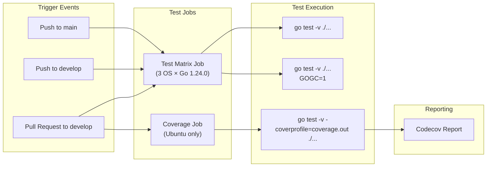
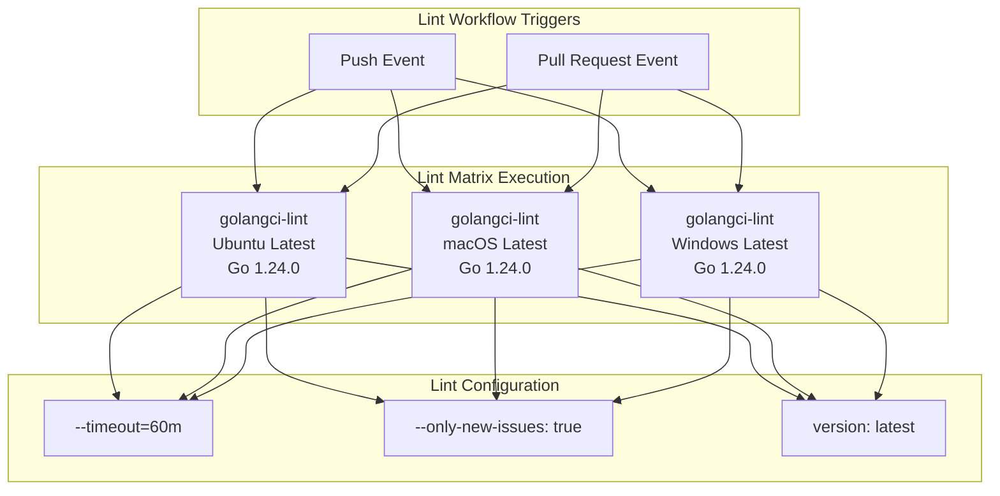
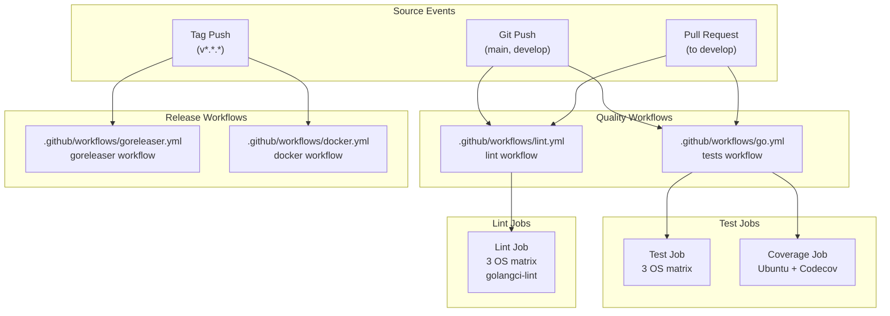
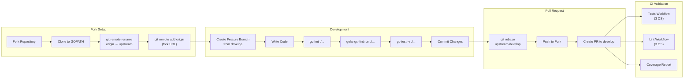

# Testing and Code Quality

# Testing and Code Quality

<details>
<summary>Relevant source files</summary>

The following files were used as context for generating this wiki page:

- [.codeclimate.yml](.codeclimate.yml)
- [.dockerignore](.dockerignore)
- [.gitattributes](.gitattributes)
- [.github/workflows/docker.yml](.github/workflows/docker.yml)
- [.github/workflows/go.yml](.github/workflows/go.yml)
- [.github/workflows/goreleaser.yml](.github/workflows/goreleaser.yml)
- [.github/workflows/lint.yml](.github/workflows/lint.yml)
- [.gitignore](.gitignore)
- [.goreleaser.yaml](.goreleaser.yaml)
- [CONTRIBUTING.md](CONTRIBUTING.md)
- [LICENSE](LICENSE)
- [codecov.yml](codecov.yml)

</details>


This page documents the testing infrastructure, code quality standards, and continuous integration workflows used in the OWASP Amass project. It covers the automated test suite, linting configuration, coverage requirements, and the GitHub Actions CI/CD pipelines that enforce these standards.

For information about building Amass from source, see [Building from Source](#8.1). For details on the release process and deployment, see [Release Process](#8.4).

## Test Suite Structure

The Amass project maintains a comprehensive test suite executed through standard Go testing tools. Tests are organized alongside the source code they validate, following Go conventions.

### Test Execution

The test suite runs in two configurations to ensure robustness under different conditions:

| Test Configuration | Environment | Purpose |
|-------------------|-------------|---------|
| Simple Test | Default GOGC | Standard validation of functionality |
| GC Pressure Test | `GOGC=1` | Validates behavior under high garbage collection pressure |

Both configurations execute the full test suite using `go test -v ./...` [.github/workflows/go.yml:30]() and [.github/workflows/go.yml:33]().

### Multi-Platform Testing

Tests execute on three operating systems to ensure cross-platform compatibility:

- **Ubuntu Latest** (Linux)
- **macOS Latest** (Darwin)
- **Windows Latest**

All platforms use Go 1.24.0 with `CGO_ENABLED=0` [.github/workflows/go.yml:13-18](), matching the production build configuration.

### Test Workflow Triggers



**Test Workflow Architecture**: Tests trigger on pushes to main or develop branches and pull requests targeting develop. The test matrix runs both simple and GC pressure tests across all platforms, while coverage measurement runs only on Ubuntu.

Sources: [.github/workflows/go.yml:1-51]()

## Code Coverage Requirements

### Coverage Configuration

Coverage tracking uses Codecov with custom path fixes to correctly map module paths:

```yaml
fixes:
  - "github.com/owasp-amass/amass/v5/::github.com/owasp-amass/amass/"
```

[codecov.yml:4-5]()

### Coverage Thresholds

| Metric | Value | Behavior |
|--------|-------|----------|
| Range | 20-60% | Coverage is considered acceptable within this range |
| Rounding | Up | Coverage percentages round upward |
| Precision | 2 decimal places | Report precision level |

[codecov.yml:10-13]()

### Coverage Exclusions

The `./resources/**/*` directory is excluded from coverage analysis [codecov.yml:8]() as it contains configuration files and data sources rather than executable code.

### Coverage Reporting

Coverage reports post as comments on pull requests with the layout `"reach, diff, files"` [codecov.yml:16](). Comments only appear on new pull requests that have changes and require both base and head commit coverage data [codecov.yml:17-20]().

Coverage measurement executes using:
```bash
CGO_ENABLED=0 go test -v -coverprofile=coverage.out ./...
```

[.github/workflows/go.yml:47]()

Sources: [codecov.yml:1-23](), [.github/workflows/go.yml:36-51]()

## Code Quality Standards

### Linting Infrastructure

The project enforces code quality through `golangci-lint`, executed via GitHub Actions on every push and pull request.



**Linting Pipeline**: The lint workflow executes on all platforms for every code change, using extended timeout to accommodate the large codebase and reporting only new issues to focus developer attention.

The linter runs with a 60-minute timeout [.github/workflows/lint.yml:31]() and focuses on new issues with `only-new-issues: true` [.github/workflows/lint.yml:32](), preventing noise from pre-existing code that may not meet current standards.

Sources: [.github/workflows/lint.yml:1-33]()

### Code Climate Complexity Metrics

Code Climate enforces maintainability standards through complexity thresholds configured in `.codeclimate.yml`:

| Metric | Threshold | Description |
|--------|-----------|-------------|
| Argument Count | 5 | Maximum function parameters |
| Complex Logic | 4 | Cognitive complexity limit |
| File Lines | 500 | Maximum lines per file |
| Method Complexity | 5 | Cyclomatic complexity per method |
| Method Count | 20 | Maximum methods per file |
| Method Lines | 100 | Maximum lines per method |
| Nested Control Flow | 4 | Maximum nesting depth |
| Return Statements | 10 | Maximum returns per method |
| Similar Code | 10 | Duplicate code threshold |
| Identical Code | 10 | Exact duplicate threshold |

[.codeclimate.yml:3-32]()

The `resources/` directory is excluded from Code Climate analysis [.codeclimate.yml:33-34]().

Sources: [.codeclimate.yml:1-34]()

### Code Formatting Standards

The project uses `gofmt` for consistent formatting. Contributors must format code before each commit:

```bash
go fmt ./...
```

[CONTRIBUTING.md:7]()

The Go standard formatting tool ensures consistent style across the entire codebase. Most editors can run `gofmt` automatically on file save.

Git attributes enforce LF line endings for Go files across all platforms:

```
*.go text eol=lf
```

[.gitattributes:1]()

Sources: [CONTRIBUTING.md:1-42](), [.gitattributes:1]()

## GitHub Actions CI/CD Workflows

### Workflow Architecture



**CI/CD Workflow Structure**: Quality checks (tests and linting) run on every code change, while release workflows (goreleaser and docker) trigger only on version tags.

### Tests Workflow Configuration

The `tests` workflow [.github/workflows/go.yml:1]() includes two jobs:

**Test Job Configuration:**
```yaml
strategy:
  matrix:
    os: [ "ubuntu-latest", "macos-latest", "windows-latest" ]
    go-version: [ "1.24.0" ]
runs-on: ${{ matrix.os }}
env:
  CGO_ENABLED: 0
```

[.github/workflows/go.yml:12-18]()

**Coverage Job Configuration:**
```yaml
runs-on: ubuntu-latest
steps:
  - name: measure coverage
    run: CGO_ENABLED=0 go test -v -coverprofile=coverage.out ./...
  - name: report coverage
    run: bash <(curl -s https://codecov.io/bash)
```

[.github/workflows/go.yml:38-50]()

Sources: [.github/workflows/go.yml:1-51]()

### Lint Workflow Configuration

The `lint` workflow [.github/workflows/lint.yml:1]() triggers on all pushes and pull requests:

```yaml
on:
  push:
  pull_request:
```

[.github/workflows/lint.yml:3-5]()

Each platform runs independently with the same configuration:

```yaml
strategy:
  matrix:
    os: [ "ubuntu-latest", "macos-latest", "windows-latest" ]
    go-version: [ "1.24.0" ]
```

[.github/workflows/lint.yml:10-13]()

The `golangci-lint-action` executes with:
- Latest linter version
- 60-minute timeout for complete analysis
- Only new issues reported

[.github/workflows/lint.yml:27-32]()

Sources: [.github/workflows/lint.yml:1-33]()

## Developer Workflow

### Pre-Commit Checklist

Before committing code, developers should:

1. **Format Code**: Run `go fmt ./...` to ensure consistent formatting [CONTRIBUTING.md:7]()
2. **Run Linter**: Execute `golangci-lint run ./...` to catch errors and maintain clean code [CONTRIBUTING.md:9]()
3. **Run Tests Locally**: Execute `go test -v ./...` to validate changes

### Contributing Standards



**Development Workflow**: Developers fork the repository, create feature branches from develop, ensure code quality through local tools, and submit pull requests that undergo automated CI validation.

### Branch Strategy

- **`main`**: Stable release branch
- **`develop`**: Active development branch (default target for PRs)
- **Feature branches**: Created from `develop` on developer forks

No force pushes to `develop` except when reverting broken commits [CONTRIBUTING.md:39](). All pull requests must target `develop`, not `main` [CONTRIBUTING.md:35]().

### Environment Configuration

All builds and tests use:
- **Go Version**: 1.24.0
- **CGO**: Disabled (`CGO_ENABLED=0`)

This configuration matches production builds to ensure test environments accurately reflect deployment conditions.

Sources: [CONTRIBUTING.md:1-42](), [.github/workflows/go.yml:1-51](), [.github/workflows/lint.yml:1-33]()

## Build Validation

### Pre-Release Hooks

The build system runs validation before creating releases:

```yaml
before:
  hooks:
  - go mod tidy
```

[.goreleaser.yaml:4-6]()

This ensures dependency consistency before producing release artifacts.

### Build Configuration

All release builds use `CGO_ENABLED=0` [.goreleaser.yaml:12-13]() to produce static binaries without C dependencies, improving portability and eliminating runtime library requirements.

The build targets 11 platform-architecture combinations:
- Linux: amd64, 386, arm (v6/v7), arm64
- Darwin: amd64, arm64
- Windows: amd64

[.goreleaser.yaml:14-36]()

Sources: [.goreleaser.yaml:1-80]()

## Quality Gates

### Required Checks

All pull requests must pass:

1. **Test Matrix**: All 6 test runs (3 OS × 2 configurations) must succeed
2. **Lint Matrix**: All 3 lint checks (3 OS) must pass with no new issues
3. **Coverage**: Coverage must be measured and reported (no specific threshold enforced)

### Code Review Process

After automated checks pass, code requires human review following GitHub standard practices. The project maintainer reviews changes for:
- Architectural consistency
- Security implications
- Performance considerations
- Documentation completeness

### Ignored Artifacts

Testing and build artifacts excluded from version control:

| Pattern | Purpose |
|---------|---------|
| `*.test` | Test binaries |
| `*.out` | Coverage profiles |
| `*.json` | Output data files |
| `*.log` | Log files |
| `*.html` | HTML reports |
| `.idea` | JetBrains IDE files |

[.gitignore:1-22]()

Docker builds exclude additional patterns including archives, compressed files, and build artifacts [.dockerignore:1-24]().

Sources: [.gitignore:1-22](), [.dockerignore:1-24]()