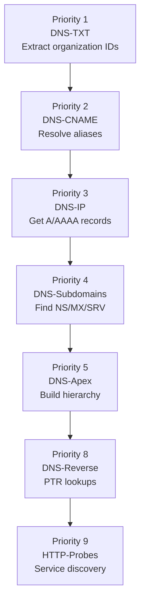
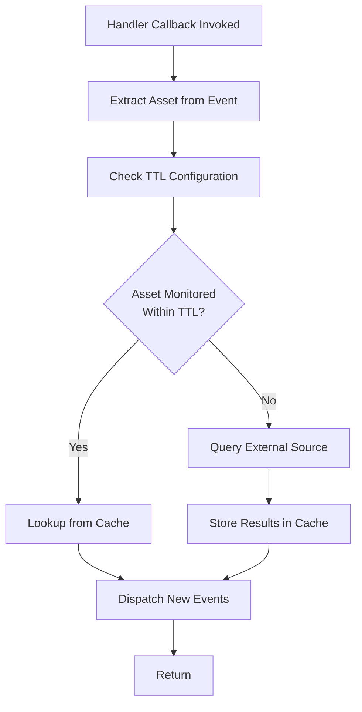
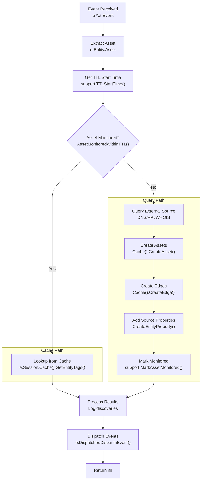

# Creating Custom Plugins

# Creating Custom Plugins

<details>
<summary>Relevant source files</summary>

The following files were used as context for generating this wiki page:

- [engine/plugins/brute/alterations.go](engine/plugins/brute/alterations.go)
- [engine/plugins/dns/apex.go](engine/plugins/dns/apex.go)
- [engine/plugins/dns/cname.go](engine/plugins/dns/cname.go)
- [engine/plugins/dns/ip.go](engine/plugins/dns/ip.go)
- [engine/plugins/dns/plugin.go](engine/plugins/dns/plugin.go)
- [engine/plugins/dns/reverse.go](engine/plugins/dns/reverse.go)
- [engine/plugins/dns/subs.go](engine/plugins/dns/subs.go)
- [engine/plugins/dns/txt.go](engine/plugins/dns/txt.go)
- [engine/plugins/ip_netblock.go](engine/plugins/ip_netblock.go)
- [engine/plugins/service_discovery/http_probes/fqdn_endpoint.go](engine/plugins/service_discovery/http_probes/fqdn_endpoint.go)
- [engine/plugins/service_discovery/http_probes/ipaddr_endpoint.go](engine/plugins/service_discovery/http_probes/ipaddr_endpoint.go)
- [engine/plugins/service_discovery/http_probes/plugin.go](engine/plugins/service_discovery/http_probes/plugin.go)
- [engine/plugins/support/support.go](engine/plugins/support/support.go)
- [engine/plugins/whois/bgptools/autsys.go](engine/plugins/whois/bgptools/autsys.go)
- [engine/plugins/whois/bgptools/netblock.go](engine/plugins/whois/bgptools/netblock.go)
- [engine/plugins/whois/bgptools/plugin.go](engine/plugins/whois/bgptools/plugin.go)
- [engine/plugins/whois/fqdn_lookup.go](engine/plugins/whois/fqdn_lookup.go)

</details>


This page provides a comprehensive tutorial for developing custom plugins that extend Amass's discovery capabilities. It covers the required interfaces, handler registration, event processing patterns, and integration with the cache and DNS systems.

For information about the overall plugin architecture and existing plugin categories, see [Plugin System](#6). For details on the plugin interfaces and priority system, see [Plugin Architecture](#6.1). For existing DNS, API, service discovery, and enrichment plugins, see sections [6.2](#6.2) through [6.5](#6.5).

## Overview

An Amass plugin is a self-contained module that registers one or more **handlers** to process specific asset types. When an event matching the handler's `EventType` is dispatched, the handler's callback function executes to perform discovery, enrichment, or transformation operations. Plugins interact with:

- **Registry (`et.Registry`)**: Used during startup to register handlers with the engine
- **Event (`et.Event`)**: Contains the asset entity, session context, and dispatcher for generating new events
- **Session (`et.Session`)**: Provides access to configuration, cache, scope checking, and logging
- **Support utilities**: Helper functions for DNS queries, TTL management, and asset creation

## Plugin Interface

All plugins must implement the `et.Plugin` interface with three methods:

```go
type Plugin interface {
    Name() string
    Start(r Registry) error
    Stop()
}
```

### Name Method

Returns a unique identifier for the plugin used in logging and source attribution.

**Example from DNS plugin:**
```go
func (d *dnsPlugin) Name() string {
    return d.name  // "DNS"
}
```

Sources: [engine/plugins/dns/plugin.go:53-55]()

### Start Method

Called during engine initialization to register handlers. This is where you configure the plugin's behavior by registering one or more handlers with specific priorities, event types, and transforms.

**Pattern from DNS plugin:**
```go
func (d *dnsPlugin) Start(r et.Registry) error {
    d.log = r.Log().WithGroup("plugin").With("name", d.name)
    
    // Register TXT handler with priority 1 (highest)
    d.txt = &dnsTXT{...}
    if err := r.RegisterHandler(&et.Handler{
        Plugin:       d,
        Name:         d.txt.name,
        Priority:     1,
        MaxInstances: support.MaxHandlerInstances,
        Transforms:   []string{string(oam.FQDN)},
        EventType:    oam.FQDN,
        Callback:     d.txt.check,
    }); err != nil {
        return err
    }
    
    // Register additional handlers...
    return nil
}
```

Sources: [engine/plugins/dns/plugin.go:57-165]()

### Stop Method

Called during engine shutdown to cleanup resources. Close channels, release goroutines, and finalize any pending operations.

**Example from DNS plugin:**
```go
func (d *dnsPlugin) Stop() {
    close(d.subs.done)  // Signal background goroutines to exit
    d.log.Info("Plugin stopped")
}
```

Sources: [engine/plugins/dns/plugin.go:167-170]()

## Handler Registration

Handlers are registered using the `et.Handler` struct, which configures how and when the handler executes:

```go
type Handler struct {
    Plugin       Plugin
    Name         string
    Priority     int
    MaxInstances int
    Transforms   []string
    EventType    oam.AssetType
    Callback     func(*Event) error
}
```

### Handler Fields

| Field | Description | Example |
|-------|-------------|---------|
| `Plugin` | Reference to parent plugin | `d` (the plugin instance) |
| `Name` | Unique handler identifier | `"DNS-TXT"` |
| `Priority` | Execution order (1-9, lower=higher) | `1` (TXT), `2` (CNAME), `3` (A/AAAA) |
| `MaxInstances` | Concurrent execution limit | `support.MaxHandlerInstances` (100) |
| `Transforms` | Asset types produced | `[]string{string(oam.FQDN)}` |
| `EventType` | Asset type consumed | `oam.FQDN` |
| `Callback` | Handler function | `d.txt.check` |

### Priority System

Handlers execute in priority order (1-9, lower number = higher priority). This ensures dependencies are satisfied before dependent handlers run:



Sources: [engine/plugins/dns/plugin.go:61-161](), [engine/plugins/service_discovery/http_probes/plugin.go:57-88]()

### Transforms Declaration

The `Transforms` field declares which asset types the handler can produce. This information is used by the configuration system to validate transformation rules and TTL settings:

**Example from BGP.Tools plugin:**
```go
// Netblock handler transforms IPAddress → Netblock
if err := r.RegisterHandler(&et.Handler{
    Transforms: []string{string(oam.Netblock)},
    EventType:  oam.IPAddress,
    // ...
}); err != nil {
    return err
}

// Autsys handler transforms Netblock → AutonomousSystem
if err := r.RegisterHandler(&et.Handler{
    Transforms: []string{string(oam.AutonomousSystem)},
    EventType:  oam.Netblock,
    // ...
}); err != nil {
    return err
}
```

Sources: [engine/plugins/whois/bgptools/plugin.go:82-107]()

## Writing Handler Callbacks

Handler callbacks follow a standard pattern: extract asset, check TTL, query/lookup data, store results, dispatch events.

### Handler Callback Signature

```go
func (h *handlerStruct) check(e *et.Event) error {
    // Implementation
}
```

### Standard Handler Pattern

Here's the complete pattern used by most handlers:



Sources: [engine/plugins/dns/txt.go:27-52](), [engine/plugins/dns/cname.go:34-57](), [engine/plugins/dns/ip.go:35-81]()

### Complete Handler Example

Here's a complete handler implementation from the DNS TXT plugin:

```go
type dnsTXT struct {
    name   string
    plugin *dnsPlugin
    source *et.Source
}

func (d *dnsTXT) check(e *et.Event) error {
    // 1. Extract asset from event
    _, ok := e.Entity.Asset.(*oamdns.FQDN)
    if !ok {
        return errors.New("failed to extract the FQDN asset")
    }
    
    // 2. Get TTL start time for this transformation
    since, err := support.TTLStartTime(e.Session.Config(), "FQDN", "FQDN", d.plugin.name)
    if err != nil {
        return err
    }
    
    // 3. Check if asset was recently monitored
    var txtRecords []dns.RR
    var props []*oamdns.DNSRecordProperty
    if support.AssetMonitoredWithinTTL(e.Session, e.Entity, d.source, since) {
        // Lookup from cache
        props = d.lookup(e, e.Entity, since)
    } else {
        // Query DNS and store
        txtRecords = d.query(e, e.Entity)
        d.store(e, e.Entity, txtRecords)
    }
    
    // 4. Process results (log and update event metadata)
    if len(txtRecords) > 0 {
        d.process(e, e.Entity, txtRecords, props)
        support.AddDNSRecordType(e, int(dns.TypeTXT))
    }
    return nil
}
```

Sources: [engine/plugins/dns/txt.go:21-52]()

### Extracting Assets

Use type assertions to extract the specific asset type from `e.Entity.Asset`:

```go
// FQDN asset
fqdn, ok := e.Entity.Asset.(*oamdns.FQDN)
if !ok {
    return errors.New("failed to extract the FQDN asset")
}

// IPAddress asset
ip, ok := e.Entity.Asset.(*oamnet.IPAddress)
if !ok {
    return errors.New("failed to extract the IPAddress asset")
}

// Netblock asset
nb, ok := e.Entity.Asset.(*oamnet.Netblock)
if !ok {
    return errors.New("failed to extract the Netblock asset")
}
```

Sources: [engine/plugins/dns/txt.go:27-31](), [engine/plugins/ip_netblock.go:70-74](), [engine/plugins/whois/bgptools/autsys.go:35-39]()

### TTL-Based Caching Pattern

The TTL system prevents redundant queries. Always check if an asset was recently monitored:

```go
// Get TTL start time from configuration
since, err := support.TTLStartTime(
    e.Session.Config(),
    "FQDN",        // From asset type
    "IPAddress",   // To asset type
    d.plugin.name, // Plugin name
)
if err != nil {
    return err
}

// Check if asset was monitored within TTL
if support.AssetMonitoredWithinTTL(e.Session, e.Entity, d.source, since) {
    // Use cached data
    results = d.lookup(e, e.Entity, since)
} else {
    // Perform fresh query
    results = d.query(e, e.Entity)
    d.store(e, e.Entity, results)
    support.MarkAssetMonitored(e.Session, e.Entity, d.source)
}
```

Sources: [engine/plugins/dns/txt.go:33-45](), [engine/plugins/support/support.go:91-104]()

## Implementing Query and Lookup Methods

### Query Method Pattern

Queries external sources (DNS, APIs, WHOIS) and returns raw results:

```go
func (d *dnsTXT) query(e *et.Event, name *dbt.Entity) []dns.RR {
    var txtRecords []dns.RR
    
    fqdn, ok := name.Asset.(*oamdns.FQDN)
    if !ok {
        return txtRecords
    }
    
    // Use support utility for DNS query
    if rr, err := support.PerformQuery(fqdn.Name, dns.TypeTXT); err == nil {
        txtRecords = append(txtRecords, rr...)
        support.MarkAssetMonitored(e.Session, name, d.source)
    }
    
    return txtRecords
}
```

Sources: [engine/plugins/dns/txt.go:73-87]()

### Lookup Method Pattern

Retrieves previously stored data from the cache within the TTL window:

```go
func (d *dnsTXT) lookup(e *et.Event, fqdn *dbt.Entity, since time.Time) []*oamdns.DNSRecordProperty {
    var props []*oamdns.DNSRecordProperty
    
    n, ok := fqdn.Asset.(*oamdns.FQDN)
    if !ok || n == nil {
        return props
    }
    
    // Get entity tags (properties) created since TTL start time
    if tags, err := e.Session.Cache().GetEntityTags(fqdn, since, "dns_record"); err == nil {
        for _, tag := range tags {
            if prop, ok := tag.Property.(*oamdns.DNSRecordProperty); ok && prop.Header.RRType == int(dns.TypeTXT) {
                props = append(props, prop)
            }
        }
    }
    
    return props
}
```

Sources: [engine/plugins/dns/txt.go:54-71]()

### Store Method Pattern

Persists discovered data in the cache as assets, edges, and properties:

```go
func (d *dnsTXT) store(e *et.Event, fqdn *dbt.Entity, rr []dns.RR) {
    for _, record := range rr {
        if record.Header().Rrtype != dns.TypeTXT {
            continue
        }
        
        txtValue := strings.Join((record.(*dns.TXT)).Txt, " ")
        
        // Create entity property (tag on the FQDN entity)
        _, err := e.Session.Cache().CreateEntityProperty(fqdn, &oamdns.DNSRecordProperty{
            PropertyName: "dns_record",
            Header: oamdns.RRHeader{
                RRType: int(dns.TypeTXT),
                Class:  int(record.Header().Class),
                TTL:    int(record.Header().Ttl),
            },
            Data: txtValue,
        })
        if err != nil {
            msg := fmt.Sprintf("failed to create entity property for %s: %s", txtValue, err)
            e.Session.Log().Error(msg, "error", err.Error(),
                slog.Group("plugin", "name", d.plugin.name, "handler", d.name))
        }
    }
}
```

Sources: [engine/plugins/dns/txt.go:89-111]()

## Cache Operations

### Creating Assets

Assets are created using `e.Session.Cache().CreateAsset()`:

```go
// Create FQDN asset
fqdn, err := e.Session.Cache().CreateAsset(&oamdns.FQDN{Name: "example.com"})
if err != nil || fqdn == nil {
    return nil
}

// Create IPAddress asset
ip, err := e.Session.Cache().CreateAsset(&oamnet.IPAddress{
    Address: netip.MustParseAddr("192.0.2.1"),
    Type:    "IPv4",
})

// Create Netblock asset
nb, err := e.Session.Cache().CreateAsset(&oamnet.Netblock{
    Type: "IPv4",
    CIDR: netip.MustParsePrefix("192.0.2.0/24"),
})
```

Sources: [engine/plugins/dns/cname.go:99](), [engine/plugins/dns/ip.go:123](), [engine/plugins/whois/bgptools/netblock.go:156-159]()

### Creating Edges (Relationships)

Edges connect two assets with a typed relationship:

```go
// Create CNAME relationship: alias -> target
edge, err := e.Session.Cache().CreateEdge(&dbt.Edge{
    Relation: &oamdns.BasicDNSRelation{
        Name: "dns_record",
        Header: oamdns.RRHeader{
            RRType: int(dns.TypeCNAME),
            Class:  int(record.Header().Class),
            TTL:    int(record.Header().Ttl),
        },
    },
    FromEntity: alias,
    ToEntity:   target,
})
```

Sources: [engine/plugins/dns/cname.go:100-111]()

### Adding Source Properties

Source properties track provenance and confidence:

```go
// Add source to entity
_, _ = e.Session.Cache().CreateEntityProperty(entity, &general.SourceProperty{
    Source:     d.source.Name,
    Confidence: d.source.Confidence,
})

// Add source to edge
_, _ = e.Session.Cache().CreateEdgeProperty(edge, &general.SourceProperty{
    Source:     d.source.Name,
    Confidence: d.source.Confidence,
})
```

Sources: [engine/plugins/dns/cname.go:113-116](), [engine/plugins/whois/bgptools/netblock.go:179-182]()

## Dispatching Events

After storing discovered assets, dispatch events to trigger downstream handlers:

```go
func (d *dnsCNAME) process(e *et.Event, alias []*relAlias) {
    for _, a := range alias {
        target := a.target.Asset.(*oamdns.FQDN)
        
        // Dispatch event for discovered FQDN
        _ = e.Dispatcher.DispatchEvent(&et.Event{
            Name:    target.Name,
            Entity:  a.target,
            Session: e.Session,
        })
        
        // Log the discovery
        e.Session.Log().Info("relationship discovered", "from", d.plugin.source.Name, 
            "relation", "cname_record", "to", target.Name, 
            slog.Group("plugin", "name", d.plugin.name, "handler", d.name))
    }
}
```

Sources: [engine/plugins/dns/cname.go:124-137]()

## Using Support Utilities

The `support` package provides common functionality:

### DNS Operations

```go
// Perform DNS query with retry logic
rr, err := support.PerformQuery("example.com", dns.TypeA)

// Scrape subdomains from text
subdomains := support.ScrapeSubdomainNames(htmlContent)

// Extract URLs from text
urls := support.ExtractURLsFromString(htmlContent)
```

Sources: [engine/plugins/support/support.go:43-85]()

### TTL Management

```go
// Get TTL start time
since, err := support.TTLStartTime(cfg, "FQDN", "IPAddress", "DNS")

// Check if asset was monitored within TTL
if support.AssetMonitoredWithinTTL(session, entity, source, since) {
    // Use cached data
}

// Mark asset as monitored
support.MarkAssetMonitored(session, entity, source)
```

Sources: [engine/plugins/support/support.go:91-104](), [engine/plugins/support/dns.go:34-69]()

### IP Address Operations

```go
// Get netblock for IP address
entry := support.IPNetblock(session, "192.0.2.1")

// Add netblock to session's CIDR ranger
err := support.AddNetblock(session, "192.0.2.0/24", 64512, source)

// Perform IP address sweep
support.IPAddressSweep(e, ipAddr, source, 25, func(e *et.Event, addr *oamnet.IPAddress, src *et.Source) {
    // Callback for each IP in sweep
})
```

Sources: [engine/plugins/support/support.go:122-195]()

### API Key Retrieval

```go
// Get API key from configuration
apiKey, err := support.GetAPI("GLEIF", e)
if err != nil {
    return err
}
```

Sources: [engine/plugins/support/support.go:106-120]()

## Complete Plugin Example

Here's a complete minimal plugin that discovers IP netblocks:

```go
package plugins

import (
    "errors"
    "log/slog"
    "net/netip"
    
    "github.com/owasp-amass/amass/v5/engine/plugins/support"
    et "github.com/owasp-amass/amass/v5/engine/types"
    dbt "github.com/owasp-amass/asset-db/types"
    oam "github.com/owasp-amass/open-asset-model"
    "github.com/owasp-amass/open-asset-model/general"
    oamnet "github.com/owasp-amass/open-asset-model/network"
)

// Plugin struct
type ipNetblock struct {
    name   string
    log    *slog.Logger
    source *et.Source
}

// Constructor
func NewIPNetblock() et.Plugin {
    return &ipNetblock{
        name: "IP-Netblock",
        source: &et.Source{
            Name:       "IP-Netblock",
            Confidence: 100,
        },
    }
}

// Name returns plugin identifier
func (d *ipNetblock) Name() string {
    return d.name
}

// Start registers handlers
func (d *ipNetblock) Start(r et.Registry) error {
    d.log = r.Log().WithGroup("plugin").With("name", d.name)
    
    name := d.name + "-Handler"
    if err := r.RegisterHandler(&et.Handler{
        Plugin:       d,
        Name:         name,
        Priority:     4,
        MaxInstances: support.MaxHandlerInstances,
        Transforms:   []string{string(oam.Netblock)},
        EventType:    oam.IPAddress,
        Callback:     d.lookup,
    }); err != nil {
        return err
    }
    
    d.log.Info("Plugin started")
    return nil
}

// Stop cleans up resources
func (d *ipNetblock) Stop() {
    d.log.Info("Plugin stopped")
}

// Handler callback
func (d *ipNetblock) lookup(e *et.Event) error {
    // Extract asset
    ip, ok := e.Entity.Asset.(*oamnet.IPAddress)
    if !ok {
        return errors.New("failed to extract the IPAddress asset")
    }
    
    // Wait for netblock to be available (added by BGP.Tools or other source)
    var entry *sessions.CIDRangerEntry
    for i := 0; i < 120; i++ {
        entry = support.IPNetblock(e.Session, ip.Address.String())
        if entry != nil {
            break
        }
        time.Sleep(time.Second)
    }
    if entry == nil {
        return nil
    }
    
    // Store netblock and AS
    nb, as := d.store(e, entry)
    if nb == nil || as == nil {
        return nil
    }
    
    // Dispatch events
    d.process(e, e.Entity, nb, as)
    return nil
}

// Store results in cache
func (d *ipNetblock) store(e *et.Event, entry *sessions.CIDRangerEntry) (*dbt.Entity, *dbt.Entity) {
    // Create netblock asset
    netblock := &oamnet.Netblock{
        Type: "IPv4",
        CIDR: netip.MustParsePrefix(entry.Net.String()),
    }
    if netblock.CIDR.Addr().Is6() {
        netblock.Type = "IPv6"
    }
    
    nb, err := e.Session.Cache().CreateAsset(netblock)
    if err != nil || nb == nil {
        return nil, nil
    }
    
    // Add source property
    _, _ = e.Session.Cache().CreateEntityProperty(nb, &general.SourceProperty{
        Source:     entry.Src.Name,
        Confidence: entry.Src.Confidence,
    })
    
    // Create edge: netblock -> IP
    edge, err := e.Session.Cache().CreateEdge(&dbt.Edge{
        Relation:   &general.SimpleRelation{Name: "contains"},
        FromEntity: nb,
        ToEntity:   e.Entity,
    })
    if err != nil || edge == nil {
        return nil, nil
    }
    
    // Add source to edge
    _, _ = e.Session.Cache().CreateEdgeProperty(edge, &general.SourceProperty{
        Source:     entry.Src.Name,
        Confidence: entry.Src.Confidence,
    })
    
    // Create AS asset
    as, err := e.Session.Cache().CreateAsset(&oamnet.AutonomousSystem{Number: entry.ASN})
    if err != nil || as == nil {
        return nil, nil
    }
    
    // Create edge: AS -> netblock
    edge, err = e.Session.Cache().CreateEdge(&dbt.Edge{
        Relation:   &general.SimpleRelation{Name: "announces"},
        FromEntity: as,
        ToEntity:   nb,
    })
    
    return nb, as
}

// Dispatch events for discovered assets
func (d *ipNetblock) process(e *et.Event, ip, nb, as *dbt.Entity) {
    // Dispatch netblock event
    _ = e.Dispatcher.DispatchEvent(&et.Event{
        Name:    nb.Asset.Key(),
        Entity:  nb,
        Session: e.Session,
    })
    
    // Log discovery
    e.Session.Log().Info("relationship discovered", "from", nb.Asset.Key(), 
        "relation", "contains", "to", ip.Asset.Key(), 
        slog.Group("plugin", "name", d.name, "handler", d.name+"-Handler"))
    
    // Dispatch AS event
    asname := "AS" + as.Asset.Key()
    _ = e.Dispatcher.DispatchEvent(&et.Event{
        Name:    asname,
        Entity:  as,
        Session: e.Session,
    })
    
    e.Session.Log().Info("relationship discovered", "from", asname, 
        "relation", "announces", "to", nb.Asset.Key(), 
        slog.Group("plugin", "name", d.name, "handler", d.name+"-Handler"))
}
```

Sources: [engine/plugins/ip_netblock.go:1-257]()

## Plugin Data Flow Diagram



Sources: [engine/plugins/dns/txt.go:27-52](), [engine/plugins/dns/cname.go:34-137](), [engine/plugins/ip_netblock.go:70-197]()

## Best Practices

### Priority Assignment

Assign priorities based on dependencies:
- **1-2**: Fundamental DNS records (TXT, CNAME)
- **3-4**: Basic resolution (A/AAAA, NS/MX)
- **5-6**: Hierarchy and search (Apex, organization search)
- **7-8**: Enrichment and reverse lookups
- **9**: Active probing

Sources: [engine/plugins/dns/plugin.go:61-161]()

### Error Handling

Always validate assets and handle errors gracefully:

```go
// Validate asset extraction
fqdn, ok := e.Entity.Asset.(*oamdns.FQDN)
if !ok {
    return errors.New("failed to extract the FQDN asset")
}

// Handle cache errors
if err != nil {
    e.Session.Log().Error(err.Error(), 
        slog.Group("plugin", "name", d.plugin.name, "handler", d.name))
    return nil  // Don't fail the handler
}
```

Sources: [engine/plugins/dns/txt.go:27-31](), [engine/plugins/dns/ip.go:143]()

### Scope Checking

Check if assets are in scope before performing expensive operations:

```go
// Check FQDN scope
if _, conf := e.Session.Scope().IsAssetInScope(fqdn, 0); conf == 0 {
    return nil
}

// Check IP scope
if !e.Session.Scope().IsAddressInScope(e.Session.Cache(), ip) {
    return nil
}
```

Sources: [engine/plugins/service_discovery/http_probes/fqdn_endpoint.go:44-46](), [engine/plugins/service_discovery/http_probes/ipaddr_endpoint.go:44-46]()

### Asynchronous Operations

Use goroutines for slow operations to avoid blocking the handler:

```go
if support.AssetMonitoredWithinTTL(e.Session, e.Entity, src, since) {
    findings = append(findings, r.lookup(e, e.Entity, since)...)
} else {
    go func() {
        if findings := append(findings, r.query(e, e.Entity)...); len(findings) > 0 {
            r.process(e, findings)
        }
    }()
    support.MarkAssetMonitored(e.Session, e.Entity, src)
}
```

Sources: [engine/plugins/service_discovery/http_probes/ipaddr_endpoint.go:58-64]()

### Logging Standards

Use structured logging with consistent fields:

```go
e.Session.Log().Info("relationship discovered", 
    "from", fromName, 
    "relation", relationType, 
    "to", toName, 
    slog.Group("plugin", "name", d.plugin.name, "handler", d.name))

e.Session.Log().Error("failed to process asset", 
    "error", err.Error(), 
    "asset", assetName,
    slog.Group("plugin", "name", d.plugin.name, "handler", d.name))
```

Sources: [engine/plugins/dns/txt.go:115-121](), [engine/plugins/dns/cname.go:134-136]()

### Resource Cleanup

Always clean up in the `Stop()` method:

```go
func (d *dnsPlugin) Stop() {
    // Close channels
    close(d.subs.done)
    
    // Release locks and cleanup maps
    d.apexLock.Lock()
    d.apexList = nil
    d.apexLock.Unlock()
    
    // Log shutdown
    d.log.Info("Plugin stopped")
}
```

Sources: [engine/plugins/dns/plugin.go:167-170](), [engine/plugins/dns/subs.go:353-382]()

## Integration and Testing

After implementing a plugin:

1. **Register with Engine**: Import the plugin package and register it in the engine initialization
2. **Add Configuration**: Add configuration options to `config/config.yaml` for API keys, TTL values, etc.
3. **Test Handlers**: Write unit tests for individual handler methods
4. **Test Integration**: Run enumeration with your plugin enabled and verify discoveries
5. **Check Logs**: Review structured logs to ensure proper attribution and discovery chains

For information about testing and code quality requirements, see [Testing and Code Quality](#8.2).

Sources: [engine/plugins/dns/plugin.go:57-165](), [engine/plugins/whois/bgptools/plugin.go:58-111](), [engine/plugins/service_discovery/http_probes/plugin.go:49-92]()