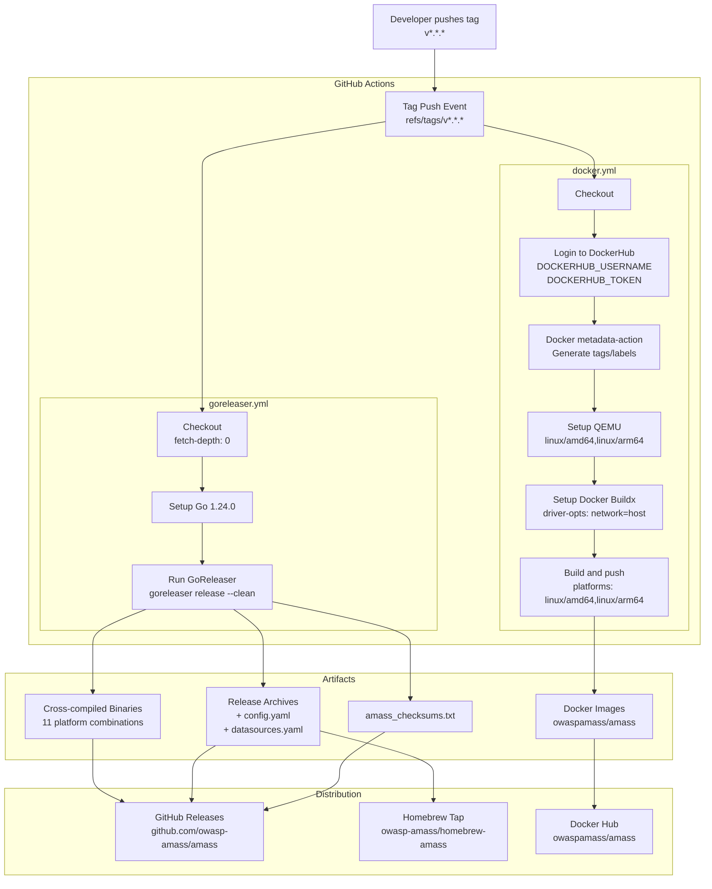
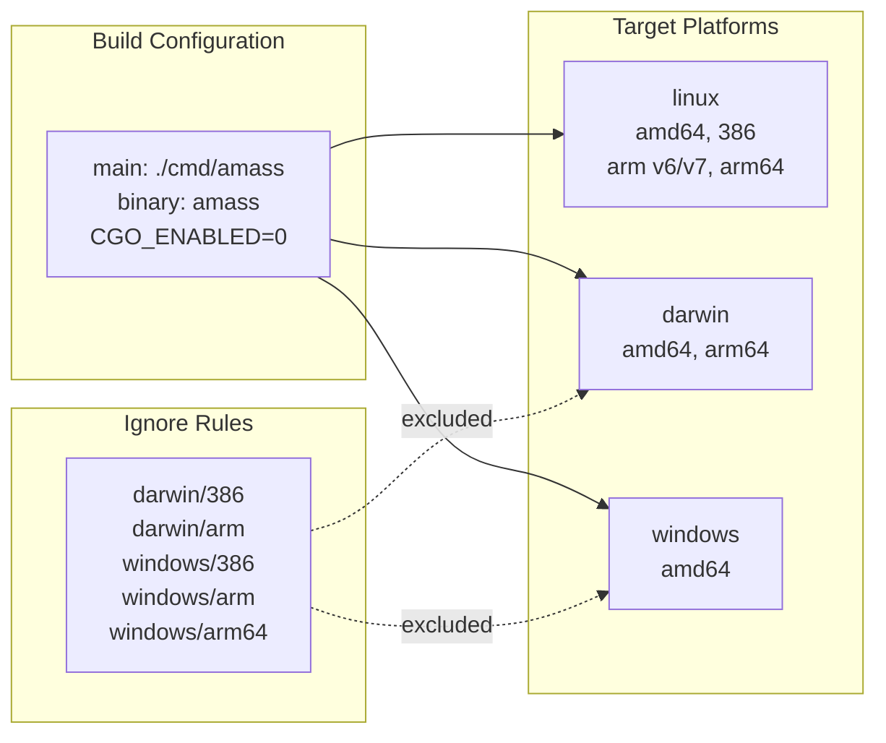
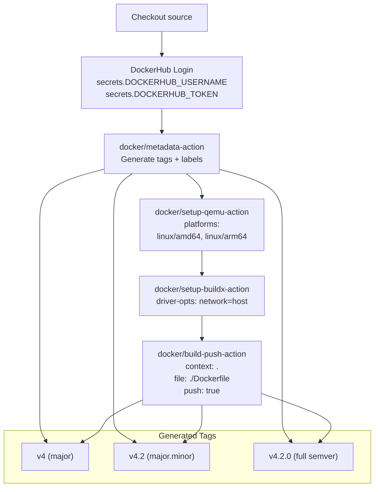
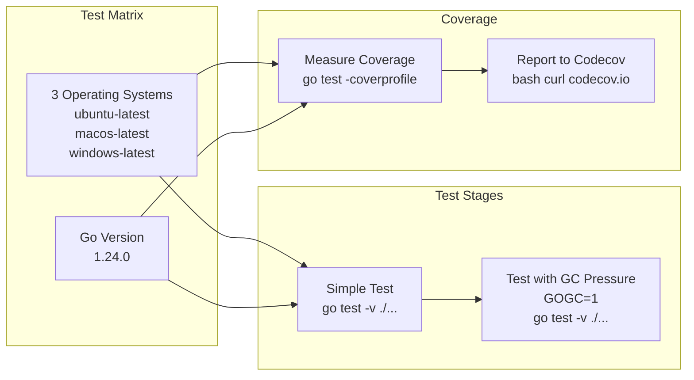
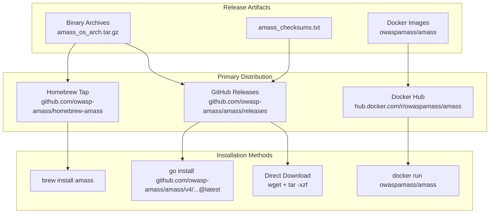

# Release Process

# Release Process

<details>
<summary>Relevant source files</summary>

The following files were used as context for generating this wiki page:

- [.codeclimate.yml](.codeclimate.yml)
- [.dockerignore](.dockerignore)
- [.gitattributes](.gitattributes)
- [.github/workflows/docker.yml](.github/workflows/docker.yml)
- [.github/workflows/go.yml](.github/workflows/go.yml)
- [.github/workflows/goreleaser.yml](.github/workflows/goreleaser.yml)
- [.github/workflows/lint.yml](.github/workflows/lint.yml)
- [.gitignore](.gitignore)
- [.goreleaser.yaml](.goreleaser.yaml)
- [CONTRIBUTING.md](CONTRIBUTING.md)
- [LICENSE](LICENSE)
- [codecov.yml](codecov.yml)

</details>


This document describes the automated release pipeline for OWASP Amass, including the GoReleaser configuration for binary distributions, Docker multi-architecture builds, and distribution to GitHub Releases, Homebrew, and Docker Hub. For information about building from source during development, see [Building from Source](#8.1). For Docker deployment instructions, see [Docker Deployment](#9.1).

## Overview of Release Pipeline

The Amass release process is fully automated through GitHub Actions. When a semantic version tag (e.g., `v4.2.0`) is pushed to the repository, two parallel workflows execute:

1. **goreleaser workflow** - Cross-compiles binaries for multiple platforms, creates release archives, generates checksums, publishes to GitHub Releases, and updates the Homebrew tap
2. **docker workflow** - Builds multi-architecture Docker images and publishes them to Docker Hub with semantic version tags



**Sources:** [.github/workflows/goreleaser.yml:1-37](), [.github/workflows/docker.yml:1-58]()

## Release Triggering

Releases are triggered exclusively by pushing semantic version tags matching the pattern `v*.*.*` to the repository. Both the `goreleaser` and `docker` workflows listen for these tag push events.

| Workflow | Trigger Pattern | File |
|----------|----------------|------|
| goreleaser | `tags: - 'v*.*.*'` | [.github/workflows/goreleaser.yml:3-6]() |
| docker | `tags: - 'v*.*.*'` | [.github/workflows/docker.yml:3-6]() |

The workflows do not trigger on branch pushes or pull requests. The tag format must follow semantic versioning conventions (e.g., `v4.2.0`, `v4.2.1-rc.1`).

**Sources:** [.github/workflows/goreleaser.yml:3-6](), [.github/workflows/docker.yml:3-6]()

## GoReleaser Configuration

The GoReleaser configuration at [.goreleaser.yaml:1-80]() defines the cross-compilation matrix, archive structure, and distribution settings.

### Build Matrix

GoReleaser compiles the `./cmd/amass` main package into the `amass` binary for multiple operating systems and architectures:

| OS | Architectures | Notes |
|----|--------------|-------|
| linux | amd64, 386, arm (v6, v7), arm64 | All combinations supported |
| darwin | amd64, arm64 | 386 and arm excluded via ignore rules |
| windows | amd64 | 386, arm, arm64 excluded via ignore rules |



The build uses `CGO_ENABLED=0` to produce static binaries with no external dependencies, ensuring portability across different Linux distributions and versions.

**Sources:** [.goreleaser.yaml:8-36](), [.github/workflows/goreleaser.yml:15-16]()

### Archive Creation

Each platform's binary is packaged into a named archive with configuration files:

```
Archive naming: amass_{Os}_{Arch}{Armv}.tar.gz
Example: amass_linux_amd64.tar.gz
         amass_linux_armv7.tar.gz
         amass_darwin_arm64.tar.gz
```

Archives contain:
- `amass` binary
- `LICENSE` file
- `README.md` documentation
- `resources/config.yaml` - default configuration template
- `resources/datasources.yaml` - data source definitions

Configuration at [.goreleaser.yaml:38-46]():

```yaml
archives:
  -
    name_template: "{{ .ProjectName }}_{{ .Os }}_{{ .Arch }}{{ if .Arm }}v{{ .Arm }}{{ end }}"
    wrap_in_directory: true
    files:
      - LICENSE
      - README.md
      - resources/config.yaml
      - resources/datasources.yaml
```

**Sources:** [.goreleaser.yaml:38-46]()

### Checksum Generation

GoReleaser generates a unified checksum file named `amass_checksums.txt` containing SHA256 hashes of all release archives. Users can verify download integrity using:

```bash
sha256sum -c amass_checksums.txt --ignore-missing
```

**Sources:** [.goreleaser.yaml:48-49]()

### GitHub Release Publication

The workflow publishes releases to the `owasp-amass/amass` repository on GitHub. The release includes:

- All platform archives
- Checksum file
- Auto-generated changelog (sorted descending, excluding merge commits and tag references)

Authentication uses the built-in `GITHUB_TOKEN` provided by GitHub Actions. The workflow requires `contents: write` permission to create releases.

**Sources:** [.goreleaser.yaml:51-61](), [.github/workflows/goreleaser.yml:8-9](), [.github/workflows/goreleaser.yml:34-36]()

### Homebrew Tap Update

GoReleaser automatically updates the Homebrew tap repository at `owasp-amass/homebrew-amass` with each release. The cask configuration:

| Property | Value |
|----------|-------|
| Repository | owasp-amass/homebrew-amass |
| Branch | main |
| Commit Author | caffix <caffix@users.noreply.github.com> |
| Homepage | https://owasp.org/www-project-amass/ |
| License | Apache-2.0 |

The tap update requires a separate GitHub token (`HOMEBREW_TAP_GITHUB_TOKEN`) with write access to the Homebrew repository. This token is stored as a GitHub Actions secret and passed to GoReleaser.

**Sources:** [.goreleaser.yaml:63-79](), [.github/workflows/goreleaser.yml:36]()

## Docker Multi-Architecture Build

The Docker workflow at [.github/workflows/docker.yml:1-58]() builds container images for multiple architectures using QEMU emulation and Docker Buildx.

### Docker Build Process



**Sources:** [.github/workflows/docker.yml:9-57]()

### Multi-Architecture Support

The build supports two architectures: `linux/amd64` and `linux/arm64`. Cross-platform compilation is enabled through:

1. **QEMU Setup** - Installs QEMU static binaries to emulate foreign architectures ([.github/workflows/docker.yml:36-39]())
2. **Docker Buildx** - Uses the Docker Buildx builder with `network=host` driver option for improved build performance ([.github/workflows/docker.yml:41-46]())

The build process creates a unified multi-architecture manifest, allowing Docker to automatically pull the correct image for the host architecture.

**Sources:** [.github/workflows/docker.yml:36-46](), [.github/workflows/docker.yml:55]()

### Docker Image Tagging

The `docker/metadata-action` generates three semantic version tags for each release:

| Tag Pattern | Example | Description |
|-------------|---------|-------------|
| `v{{major}}` | `v4` | Major version (mutable, updates with each v4.x.y) |
| `v{{major}}.{{minor}}` | `v4.2` | Major.minor version (mutable, updates with each v4.2.z) |
| `v{{major}}.{{minor}}.{{patch}}` | `v4.2.0` | Full semantic version (immutable) |

All images are published to `owaspamass/amass` on Docker Hub. The tagging strategy allows users to:
- Pin to specific versions: `docker pull owaspamass/amass:v4.2.0`
- Track minor versions: `docker pull owaspamass/amass:v4.2`
- Auto-update with major versions: `docker pull owaspamass/amass:v4`

**Sources:** [.github/workflows/docker.yml:22-34]()

### Docker Image Metadata

Images include standardized OCI labels:

```yaml
org.opencontainers.image.title=OWASP Amass
org.opencontainers.image.description=In-depth attack surface mapping and asset discovery
org.opencontainers.image.vendor=OWASP Foundation
```

These labels enable container registry UIs and tooling to display meaningful information about the images.

**Sources:** [.github/workflows/docker.yml:31-34]()

## Continuous Integration Workflows

While not directly part of the release process, two CI workflows maintain code quality on every push:

### Test Workflow

The `tests` workflow ([.github/workflows/go.yml:1-51]()) runs on pushes to `main` and `develop` branches, and on pull requests:



The workflow runs tests twice on each platform: once normally, and once with `GOGC=1` to stress-test garbage collection behavior. Coverage is measured only on Ubuntu and reported to Codecov.

**Sources:** [.github/workflows/go.yml:9-51](), [codecov.yml:1-23]()

### Lint Workflow

The `lint` workflow ([.github/workflows/lint.yml:1-33]()) uses `golangci-lint` to enforce code quality standards:

| Configuration | Value |
|---------------|-------|
| Matrix | 3 OS × Go 1.24.0 |
| Timeout | 60 minutes |
| Mode | only-new-issues: true |

The workflow runs on every push and pull request, checking only newly introduced issues to avoid overwhelming developers with pre-existing problems.

**Sources:** [.github/workflows/lint.yml:1-33]()

## Build Artifacts Summary

A complete release produces the following artifacts:

### Binary Distributions (11 total)

| Platform | Archive Name |
|----------|--------------|
| Linux amd64 | `amass_linux_amd64.tar.gz` |
| Linux 386 | `amass_linux_386.tar.gz` |
| Linux arm v6 | `amass_linux_armv6.tar.gz` |
| Linux arm v7 | `amass_linux_armv7.tar.gz` |
| Linux arm64 | `amass_linux_arm64.tar.gz` |
| Darwin amd64 | `amass_darwin_amd64.tar.gz` |
| Darwin arm64 | `amass_darwin_arm64.tar.gz` |
| Windows amd64 | `amass_windows_amd64.zip` |

Plus 3 ARM variants for Linux (armv6, armv7, arm64 for 32-bit systems).

### Checksum File

- `amass_checksums.txt` - SHA256 hashes of all archives

### Docker Images

- `owaspamass/amass:v4` (multi-arch manifest)
- `owaspamass/amass:v4.2` (multi-arch manifest)
- `owaspamass/amass:v4.2.0` (multi-arch manifest)
  - linux/amd64 image layer
  - linux/arm64 image layer

### Homebrew Cask

- Updated formula in `owasp-amass/homebrew-amass` repository

**Sources:** [.goreleaser.yaml:8-46](), [.github/workflows/docker.yml:22-30]()

## Distribution Channels



### GitHub Releases

Primary distribution channel at `https://github.com/owasp-amass/amass/releases`. Each release page includes:
- All platform-specific binary archives
- Checksum file for verification
- Auto-generated changelog
- Release notes (if manually added)

**Sources:** [.goreleaser.yaml:58-61]()

### Homebrew Tap

macOS users can install via Homebrew:

```bash
brew tap owasp-amass/amass
brew install amass
```

The tap repository at `github.com/owasp-amass/homebrew-amass` is automatically updated by GoReleaser. The cask downloads the appropriate Darwin binary from GitHub Releases.

**Sources:** [.goreleaser.yaml:63-79]()

### Docker Hub

Container images are available at `https://hub.docker.com/r/owaspamass/amass`. Users can pull images:

```bash
# Latest version within major version 4
docker pull owaspamass/amass:v4

# Specific version
docker pull owaspamass/amass:v4.2.0
```

Images support both `linux/amd64` and `linux/arm64` architectures. Docker automatically selects the appropriate architecture for the host system.

**Sources:** [.github/workflows/docker.yml:26](), [.github/workflows/docker.yml:55]()

## Release Prerequisites

To execute a release, the following secrets must be configured in the GitHub repository:

| Secret Name | Purpose | Used By |
|-------------|---------|---------|
| `GITHUB_TOKEN` | Built-in token for GitHub API access | goreleaser workflow (automatic) |
| `HOMEBREW_TAP_GITHUB_TOKEN` | Write access to homebrew-amass repository | goreleaser workflow |
| `DOCKERHUB_USERNAME` | Docker Hub account username | docker workflow |
| `DOCKERHUB_TOKEN` | Docker Hub access token | docker workflow |

The `GITHUB_TOKEN` is automatically provided by GitHub Actions. The other three must be manually configured as repository secrets.

**Sources:** [.github/workflows/goreleaser.yml:35-36](), [.github/workflows/docker.yml:18-20]()

## Performing a Release

To create a new release:

1. **Ensure all changes are merged to main branch**
2. **Tag the release** with semantic version:
   ```bash
   git tag v4.2.0
   git push origin v4.2.0
   ```
3. **Monitor GitHub Actions** - Both workflows will execute automatically:
   - View progress at `https://github.com/owasp-amass/amass/actions`
4. **Verify release artifacts**:
   - Check GitHub Releases page for archives and checksums
   - Verify Docker Hub shows new tags
   - Confirm Homebrew tap repository has been updated

The entire process typically completes within 10-15 minutes, depending on GitHub Actions queue times.

**Sources:** [.github/workflows/goreleaser.yml:3-6](), [.github/workflows/docker.yml:3-6]()