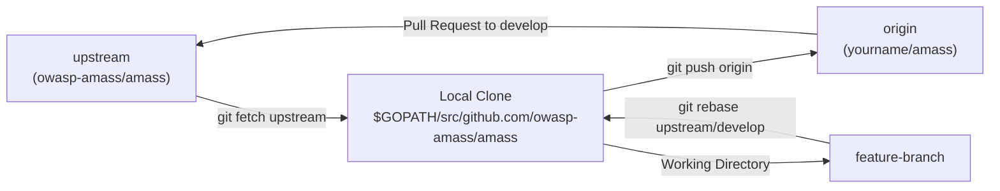
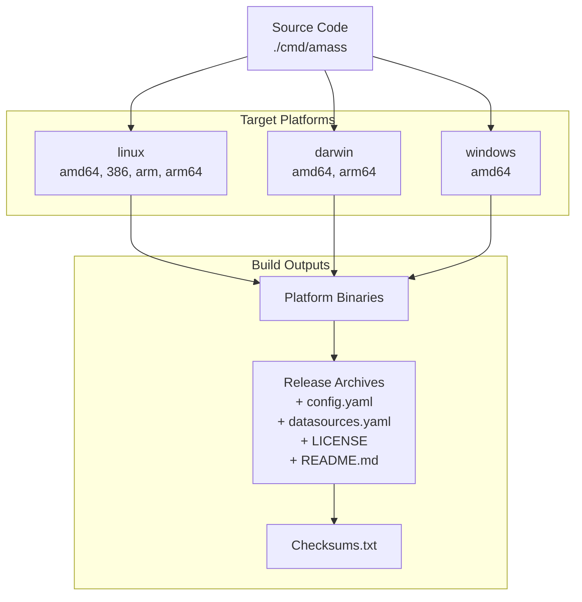
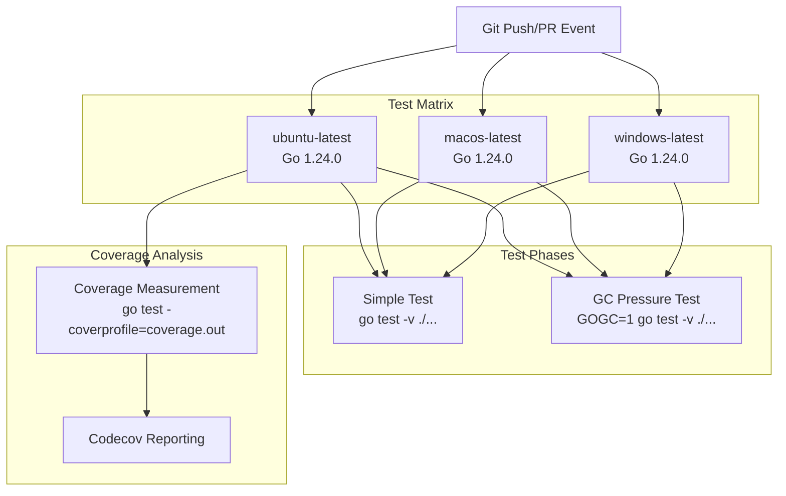
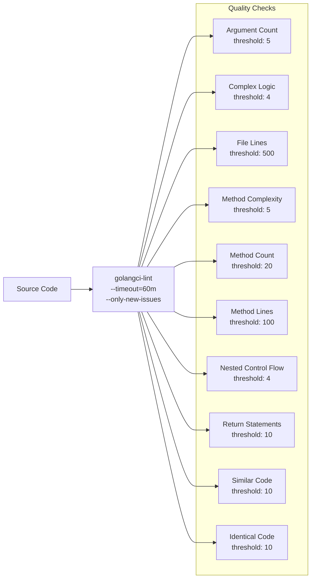
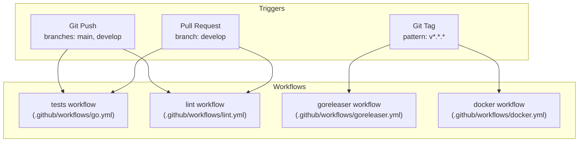
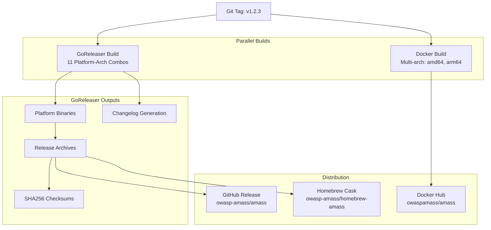
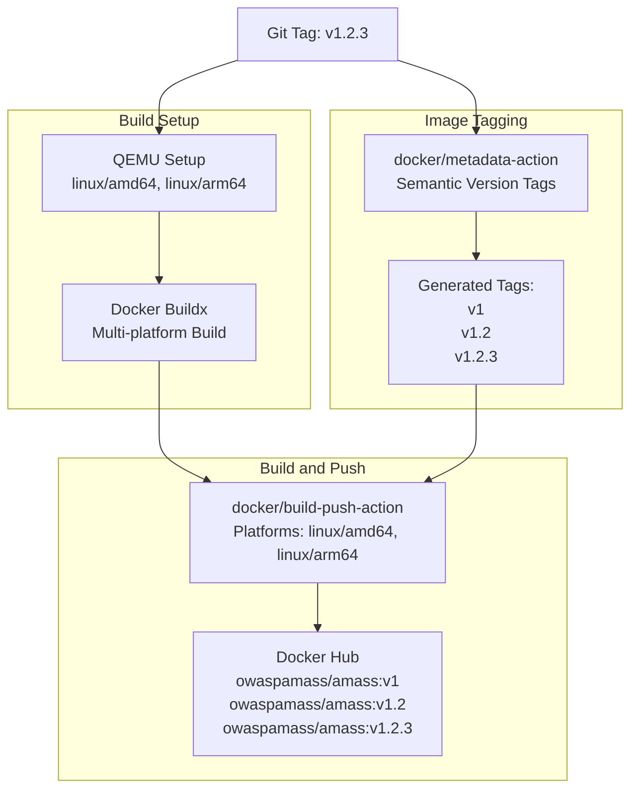
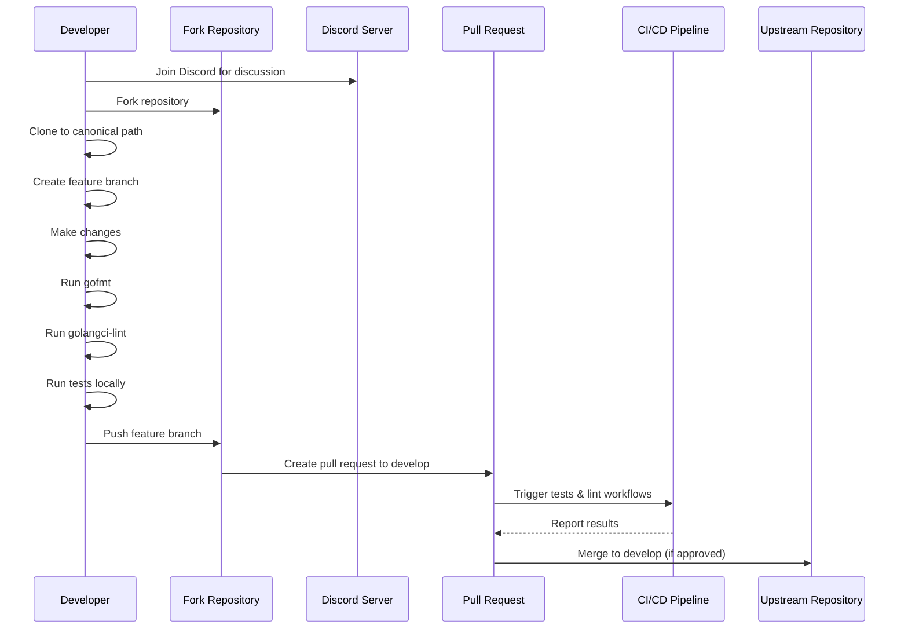

# Development Guide

# Development Guide

<details>
<summary>Relevant source files</summary>

The following files were used as context for generating this wiki page:

- [.codeclimate.yml](.codeclimate.yml)
- [.dockerignore](.dockerignore)
- [.gitattributes](.gitattributes)
- [.github/workflows/docker.yml](.github/workflows/docker.yml)
- [.github/workflows/go.yml](.github/workflows/go.yml)
- [.github/workflows/goreleaser.yml](.github/workflows/goreleaser.yml)
- [.github/workflows/lint.yml](.github/workflows/lint.yml)
- [.gitignore](.gitignore)
- [.goreleaser.yaml](.goreleaser.yaml)
- [.mailmap](.mailmap)
- [CONTRIBUTING.md](CONTRIBUTING.md)
- [LICENSE](LICENSE)
- [codecov.yml](codecov.yml)

</details>


This document provides a comprehensive guide for developers who want to contribute to or extend OWASP Amass. It covers the complete development lifecycle including environment setup, building from source, testing requirements, code quality standards, and the automated release pipeline. For specific guidance on plugin development patterns and architecture, see [Plugin System](#6). For production deployment configurations, see [Deployment](#9).

## Development Prerequisites

Amass requires the following tools and versions for development:

| Component | Version | Purpose |
|-----------|---------|---------|
| Go | 1.24.0+ | Core language runtime |
| golangci-lint | latest | Code quality enforcement |
| Git | Any recent | Source control |
| Docker | Any recent | Container testing (optional) |
| make | Any recent | Build automation (optional) |

The codebase enforces `CGO_ENABLED=0` across all build and test workflows to ensure static binary compilation without C dependencies. This simplifies cross-platform distribution and container deployment.

**Sources:** [.github/workflows/go.yml:18](), [.github/workflows/lint.yml:16](), [.github/workflows/goreleaser.yml:15]()

## Repository Structure and Workflow

### Fork and Branch Strategy

The project follows a standard GitHub fork-and-pull-request workflow with specific branch conventions. The primary development branch is `develop`, not `main`. All pull requests must target `develop`.



**Fork Setup Process:**

The codebase must remain in its canonical Go import path location: `$GOPATH/src/github.com/owasp-amass/amass`. This is required because Go resolves imports based on absolute paths. The recommended setup is:

1. Clone the original repository to the canonical path
2. Rename the `origin` remote to `upstream`
3. Add your fork as the new `origin` remote
4. Create feature branches locally
5. Push feature branches to your fork
6. Submit pull requests from your fork to `upstream/develop`

**Sources:** [CONTRIBUTING.md:11-42]()

### Development Workflow Rules

The project enforces strict workflow discipline:

- **Target Branch:** All pull requests must target `develop`, never `main` [CONTRIBUTING.md:35]()
- **Rebase Strategy:** Before submitting pull requests, rebase on top of the latest `develop` [CONTRIBUTING.md:41]()
- **Force Push Policy:** No force pushes to `develop` except when reverting broken commits [CONTRIBUTING.md:39]()
- **Code Formatting:** All code must be formatted with `gofmt` before commit [CONTRIBUTING.md:7]()
- **Linting:** Run `golangci-lint run ./...` before submitting pull requests [CONTRIBUTING.md:9]()

**Sources:** [CONTRIBUTING.md:37-42]()

## Build System

### Local Development Build

The project uses standard Go tooling for local builds. No custom build scripts are required for development:

```bash
# Build the main amass binary
go build -o amass ./cmd/amass

# Build all binaries
go build ./cmd/...

# Format all code
go fmt ./...

# Run linter
golangci-lint run ./...
```

The build system enforces `CGO_ENABLED=0` to produce statically-linked binaries without C dependencies. This is configured in all CI/CD workflows but should be set manually for local release builds.

**Sources:** [.github/workflows/goreleaser.yml:15](), [.github/workflows/go.yml:18]()

### Cross-Platform Compilation

The GoReleaser configuration defines the complete matrix of supported platforms:



**Supported Platform Matrix:**

| OS | Architectures | Notes |
|---|---|---|
| Linux | amd64, 386, arm (v6, v7), arm64 | Full support |
| Darwin (macOS) | amd64, arm64 | No 386 or arm [.goreleaser.yaml:27-30]() |
| Windows | amd64 | No 386, arm, or arm64 [.goreleaser.yaml:31-36]() |

The GoReleaser configuration explicitly ignores unsupported platform combinations to prevent build failures.

**Sources:** [.goreleaser.yaml:8-36]()

### Release Archive Structure

Each release archive is structured as follows:

```
amass_<os>_<arch>/
├── amass                    # Main binary
├── LICENSE                  # Apache 2.0 license
├── README.md               # Documentation
├── resources/
│   ├── config.yaml         # Default configuration
│   └── datasources.yaml    # Data source configuration
```

The archive naming follows the pattern: `amass_<os>_<arch>v<arm_version>.tar.gz`

**Sources:** [.goreleaser.yaml:38-46]()

## Testing Framework

### Test Execution Matrix

The continuous integration system runs tests across a comprehensive matrix:



**Test Phases:**

1. **Simple Test:** Standard test execution with default garbage collection settings [.github/workflows/go.yml:29-30]()
2. **GC Pressure Test:** Tests run with aggressive garbage collection (`GOGC=1`) to catch memory management issues [.github/workflows/go.yml:32-35]()
3. **Coverage Analysis:** Measures code coverage and reports to Codecov (Ubuntu only) [.github/workflows/go.yml:36-50]()

**Sources:** [.github/workflows/go.yml:9-51]()

### Coverage Requirements

The Codecov configuration defines coverage thresholds and reporting behavior:

```yaml
coverage:
  range: 20..60      # Coverage range (not strict enforcement)
  round: up          # Round up coverage percentages
  precision: 2       # Two decimal places
```

Key coverage settings:

- **Path Fixes:** GitHub path remapping to handle module versioning [codecov.yml:4-5]()
- **Ignored Paths:** The `resources/` directory is excluded from coverage [codecov.yml:7-8]()
- **Comment Behavior:** Coverage comments appear only on new PRs with changes [codecov.yml:15-22]()
- **Target Branch:** Comments only appear on PRs targeting `develop` [codecov.yml:21-22]()

**Sources:** [codecov.yml:1-23]()

## Code Quality Standards

### Linting Configuration

The project uses `golangci-lint` with a 60-minute timeout to accommodate comprehensive analysis:



**Code Quality Thresholds:**

| Check | Threshold | Purpose |
|-------|-----------|---------|
| argument-count | 5 | Limit function parameter complexity |
| complex-logic | 4 | Prevent overly complex conditional logic |
| file-lines | 500 | Keep files manageable |
| method-complexity | 5 | Limit cyclomatic complexity |
| method-count | 20 | Prevent god objects |
| method-lines | 100 | Keep functions readable |
| nested-control-flow | 4 | Limit nesting depth |
| return-statements | 10 | Prevent complex exit logic |
| similar-code | 10 | Detect code duplication |
| identical-code | 10 | Detect exact code duplication |

The linter runs with `--only-new-issues` to focus on changes in pull requests rather than legacy code debt.

**Sources:** [.codeclimate.yml:1-34](), [.github/workflows/lint.yml:27-32]()

### Code Formatting

The project enforces Line Feed (LF) line endings for all Go source files via `.gitattributes`:

```
*.go text eol=lf
```

This ensures consistent line endings across Windows, macOS, and Linux development environments.

**Sources:** [.gitattributes:1]()

## CI/CD Pipeline

### Workflow Trigger Matrix

The project uses four GitHub Actions workflows with different trigger conditions:



**Workflow Purposes:**

| Workflow | Trigger | Purpose |
|----------|---------|---------|
| tests | Push to main/develop, PRs to develop | Run test suite across platforms |
| lint | Any push or PR | Enforce code quality standards |
| goreleaser | Tags matching v*.*.* | Build and publish release binaries |
| docker | Tags matching v*.*.* | Build and publish Docker images |

**Sources:** [.github/workflows/go.yml:3-7](), [.github/workflows/lint.yml:3-5](), [.github/workflows/goreleaser.yml:3-6](), [.github/workflows/docker.yml:3-6]()

### Release Automation Pipeline

The release process is fully automated when a semantic version tag is pushed:



**GoReleaser Process:**

1. **Dependency Management:** Runs `go mod tidy` before build [.goreleaser.yaml:5-6]()
2. **Binary Compilation:** Cross-compiles for all platform combinations
3. **Archive Creation:** Bundles binaries with configuration files and documentation
4. **Checksum Generation:** Creates SHA256 checksums for all archives [.goreleaser.yaml:48-49]()
5. **Changelog Generation:** Auto-generates changelog from commits, excluding merge commits [.goreleaser.yaml:51-56]()
6. **GitHub Release:** Publishes release with all archives and checksums [.goreleaser.yaml:58-61]()
7. **Homebrew Update:** Updates the Homebrew tap repository automatically [.goreleaser.yaml:63-79]()

**Sources:** [.goreleaser.yaml:1-80](), [.github/workflows/goreleaser.yml:1-37]()

### Docker Multi-Architecture Build

The Docker workflow produces images for two architectures using QEMU emulation and Docker Buildx:



**Docker Build Process:**

1. **Checkout:** Clones the repository at the tagged commit [.github/workflows/docker.yml:13-14]()
2. **Authentication:** Logs into Docker Hub using secrets [.github/workflows/docker.yml:16-20]()
3. **Metadata Generation:** Creates semantic version tags (v1, v1.2, v1.2.3) [.github/workflows/docker.yml:22-34]()
4. **QEMU Setup:** Configures emulation for cross-architecture builds [.github/workflows/docker.yml:36-39]()
5. **Buildx Configuration:** Sets up Docker Buildx with host networking [.github/workflows/docker.yml:41-46]()
6. **Multi-Arch Build:** Builds and pushes images for both architectures [.github/workflows/docker.yml:48-57]()

**Image Labels:**

The Docker images include OCI standard labels:

- `org.opencontainers.image.title`: "OWASP Amass"
- `org.opencontainers.image.description`: "In-depth attack surface mapping and asset discovery"
- `org.opencontainers.image.vendor`: "OWASP Foundation"

**Sources:** [.github/workflows/docker.yml:1-58]()

## Contributing Process

### Contribution Workflow



**Required Steps Before Submitting:**

1. **Join Discord:** Coordinate with the community at https://discord.gg/ANTyEDUXt5 [CONTRIBUTING.md:3]()
2. **Review Documentation:** Check existing documentation at https://owasp-amass.github.io/docs/ [CONTRIBUTING.md:3]()
3. **Check Open Issues:** Review issues at https://github.com/owasp-amass/amass/issues [CONTRIBUTING.md:3]()
4. **Format Code:** Run `gofmt` on all modified files [CONTRIBUTING.md:7]()
5. **Lint Code:** Run `golangci-lint run ./...` to catch errors [CONTRIBUTING.md:9]()
6. **Rebase on Develop:** Ensure your branch is up to date with `develop` [CONTRIBUTING.md:41]()

**Sources:** [CONTRIBUTING.md:1-42]()

### License and Copyright

All contributions are licensed under the Apache License 2.0. The copyright is held by Jeff Foley (2017-2025) as stated in the LICENSE file header.

**Key License Terms:**

- Permissive open source license
- Allows commercial use, modification, distribution, and private use
- Requires preservation of copyright and license notices
- Provides patent grant from contributors
- No warranty or liability

**Sources:** [LICENSE:1-206]()

## Development Environment Setup

### Recommended IDE Configuration

The repository includes a `.gitignore` that explicitly excludes JetBrains IDE configuration files (`.idea/`), indicating that some core contributors use JetBrains IDEs (GoLand/IntelliJ IDEA). However, any IDE or text editor that supports Go can be used.

**Ignored Development Artifacts:**

- Compiled binaries: `*.exe`, `*.dll`, `*.so`, `*.dylib`
- Test binaries: `*.test`
- Coverage outputs: `*.out`
- Amass output files: `*.json`, `*.log`, `*.html`
- IDE configurations: `.idea/`

**Sources:** [.gitignore:1-22]()

### Docker Development Environment

For developers who prefer containerized development, the `.dockerignore` file excludes unnecessary files from Docker builds:

```
Dockerfile          # Build instructions (not needed in image)
*.md                # Documentation
.idea               # IDE configuration
*.json, *.log       # Output files
*.test, *.out       # Test artifacts
*.exe, *.dll, *.so  # Compiled artifacts
Archives            # *.zip, *.tar, *.gz, etc.
```

This keeps Docker images minimal by excluding development-time artifacts.

**Sources:** [.dockerignore:1-24]()

## Git Author Attribution

The project uses a `.mailmap` file to normalize author attribution across different email addresses:

```
Jeff Foley <caffix@users.noreply.github.com> Jeff Foley <caffix@users.noreply.github.com>
Jeff Foley <caffix@users.noreply.github.com> caffix <caffix@users.noreply.github.com>
```

This ensures consistent authorship statistics in `git log` and `git shortlog` outputs regardless of which email address was used for commits.

**Sources:** [.mailmap:1-2]()

## Next Steps

For detailed information on specific development tasks, see:

- **Building from Source:** Complete build instructions and dependency setup in [Building from Source](#8.1)
- **Testing Guidelines:** Detailed testing strategies and coverage requirements in [Testing and Code Quality](#8.2)
- **Plugin Development:** Complete plugin development tutorial in [Creating Custom Plugins](#8.3)
- **Release Management:** Detailed release process documentation in [Release Process](#8.4)

For architectural understanding of the systems you'll be working with:

- **Engine Internals:** See [Engine Core](#4) for dispatcher, session manager, and registry
- **Plugin Architecture:** See [Plugin System](#6) for plugin interfaces and handler patterns
- **Data Model:** See [Data Model and Storage](#7) for OAM asset types and graph relationships