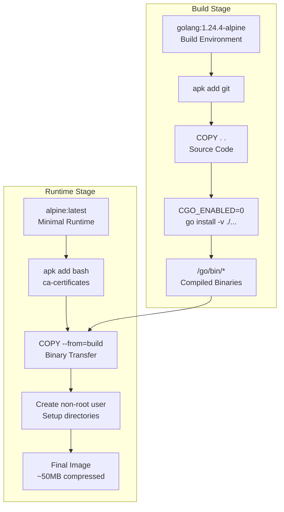
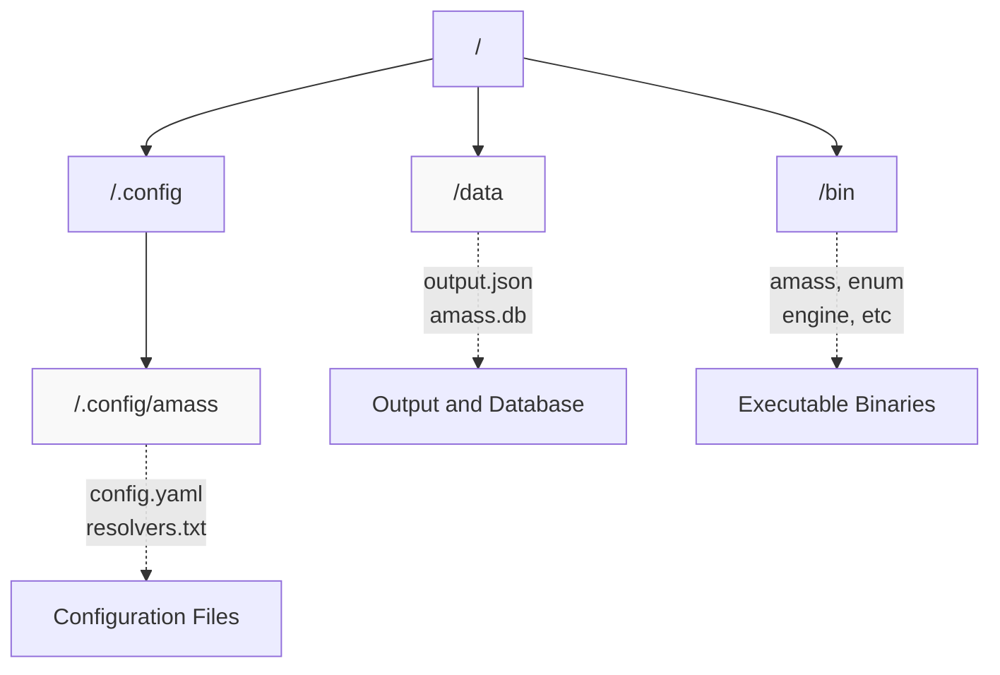
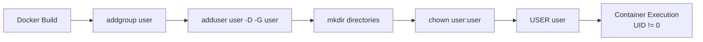
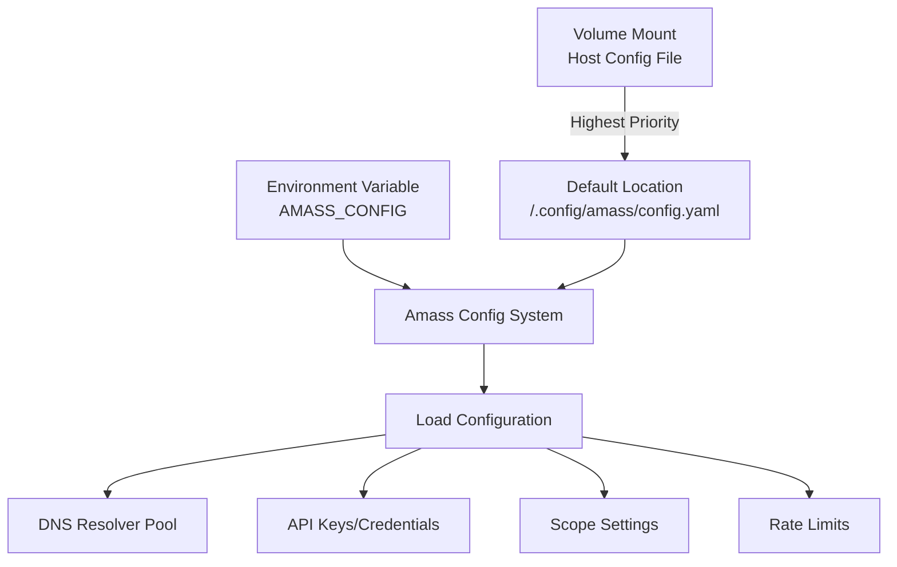

# Docker Deployment

# Docker Deployment

<details>
<summary>Relevant source files</summary>

The following files were used as context for generating this wiki page:

- [Dockerfile](Dockerfile)
- [internal/enum/assets.go](internal/enum/assets.go)

</details>


## Purpose and Scope

This document explains the Docker image structure for OWASP Amass, including the multi-stage build process, file system layout, volume management, and container usage patterns. It covers how to run Amass and its suite of OAM tools in containerized environments.

For general installation methods including local builds, see [Installation and Quick Start](#1.1). For configuration best practices in production deployments, see [Configuration Best Practices](#9.2).

---

## Multi-Stage Build Architecture

The Amass Docker image uses a multi-stage build pattern to minimize the final image size while maintaining all necessary runtime dependencies. The build separates compilation from execution, resulting in a lightweight Alpine Linux-based container that contains only the compiled binaries and essential system libraries.

### Build and Runtime Stages



**Sources:** [Dockerfile:1-31]()

The build stage uses `golang:1.24.4-alpine` as the base image, installs git for dependency fetching, and compiles all Amass binaries with CGO disabled (`CGO_ENABLED=0`) to produce statically-linked executables. This eliminates runtime library dependencies and enables the binaries to run in the minimal Alpine runtime environment.

The runtime stage starts from `alpine:latest`, installs only essential packages (`bash` and `ca-certificates`), and copies the compiled binaries from the build stage. This separation reduces the final image size significantly by excluding the entire Go toolchain and build artifacts.

---

## Binary Layout

The Docker image includes all Amass CLI tools, making the container capable of performing both data collection and analysis operations.

| Binary Path | Source Binary | Purpose |
|-------------|---------------|---------|
| `/bin/amass` | `amass` | Main CLI dispatcher |
| `/bin/enum` | `oam_enum` | Enumeration client |
| `/bin/engine` | `amass_engine` | Background engine service |
| `/bin/ae_isready` | `ae_isready` | Engine readiness probe |
| `/bin/subs` | `oam_subs` | Subdomain summary tool |
| `/bin/assoc` | `oam_assoc` | Association graph walker |
| `/bin/viz` | `oam_viz` | Graph visualization tool |
| `/bin/track` | `oam_track` | Asset change tracker |
| `/bin/i2y` | `oam_i2y` | Input-to-YAML converter |

**Sources:** [Dockerfile:10-18]()

All binaries are placed directly in `/bin/` to make them available in the default PATH. The main entrypoint is `/bin/amass`, but users can override this to run specific tools like the engine service or analysis utilities.

---

## File System Structure and Volumes

The container establishes a well-defined directory structure for configuration files, output data, and graph database storage.

### Directory Layout



**Sources:** [Dockerfile:22-27]()

The file system structure consists of three primary locations:

- **`/.config/amass/`**: Configuration directory where the container expects to find `config.yaml`, custom resolver lists, and API credential files. This directory is pre-created with proper ownership.

- **`/data/`**: Working directory (set via `WORKDIR`) for output files and the graph database. All file outputs default to this location unless absolute paths are specified.

- **`/bin/`**: System binary directory containing all Amass executables.

### Volume Mount Points

To persist data and provide custom configuration, mount volumes at these locations:

| Mount Point | Purpose | Recommended Usage |
|-------------|---------|-------------------|
| `/.config/amass` | Configuration files | Mount read-only with custom config.yaml |
| `/data` | Output and database | Mount read-write for persistent storage |

**Sources:** [Dockerfile:22-27]()

---

## Security Model

The container implements security best practices by running as a non-privileged user and handling signals appropriately.

### User and Permissions



**Sources:** [Dockerfile:20-28]()

The Dockerfile creates a non-root user named `user` and switches to this user before setting the entrypoint. This prevents the container from running with root privileges, adhering to the principle of least privilege. The `user` account owns both `/.config/amass` and `/data` directories, enabling write access to these locations without requiring elevated permissions.

### Signal Handling

[Dockerfile:30]() sets `STOPSIGNAL SIGINT`, ensuring that when the container is stopped, it sends `SIGINT` (interrupt signal) rather than the default `SIGTERM`. This allows the Amass engine to perform graceful shutdown, flushing pending data and closing connections cleanly.

---

## Running the Container

The container's entrypoint is `/bin/amass`, making it behave like the native `amass` CLI. Override the entrypoint or pass additional arguments to run different tools or commands.

### Basic Enumeration

```bash
# Run enumeration with domain input
docker run -v $(pwd)/output:/data owaspamass/amass enum -d example.com

# Mount custom configuration
docker run \
  -v $(pwd)/config.yaml:/.config/amass/config.yaml:ro \
  -v $(pwd)/output:/data \
  owaspamass/amass enum -d example.com
```

The first command runs `amass enum` with domain scope, storing output in a mounted volume. The second mounts a custom configuration file as read-only and uses it for API keys, resolver lists, and other settings.

### Running the Engine Service

```bash
# Start engine as background service
docker run -d \
  --name amass-engine \
  -v $(pwd)/config.yaml:/.config/amass/config.yaml:ro \
  -v $(pwd)/amass-data:/data \
  -p 8080:8080 \
  --entrypoint /bin/engine \
  owaspamass/amass

# Check engine readiness
docker exec amass-engine /bin/ae_isready

# Run enumeration client against engine
docker run --rm \
  --network container:amass-engine \
  --entrypoint /bin/enum \
  owaspamass/amass -d example.com
```

This pattern runs the engine as a persistent service (see [Session Management](#4.2)) with the GraphQL API exposed on port 8080. The `ae_isready` binary provides a health check utility. The enumeration client connects to the engine using shared network namespace, submitting domains for discovery.

### Running Analysis Tools

```bash
# List subdomains with ASN information
docker run --rm \
  -v $(pwd)/amass-data:/data \
  --entrypoint /bin/subs \
  owaspamass/amass -d example.com

# Walk association graph
docker run --rm \
  -v $(pwd)/amass-data:/data \
  --entrypoint /bin/assoc \
  owaspamass/amass -d example.com -fqdn mail.example.com

# Generate graph visualization
docker run --rm \
  -v $(pwd)/amass-data:/data \
  -v $(pwd)/output:/output \
  --entrypoint /bin/viz \
  owaspamass/amass -d example.com -d3 -o /output/graph.html
```

These commands demonstrate running the OAM analysis tools (see [OAM Analysis Tools](#3.2)) by overriding the entrypoint. Each tool reads from the graph database in `/data` and can produce various output formats.

**Sources:** [Dockerfile:31]()

---

## Configuration Management

The container respects the standard Amass configuration hierarchy, with file-based configuration taking precedence over defaults.

### Configuration File Location

The container expects configuration files at `/.config/amass/config.yaml`. Mount a custom configuration file to this location:

```bash
docker run \
  -v /path/to/custom-config.yaml:/.config/amass/config.yaml:ro \
  -v $(pwd)/output:/data \
  owaspamass/amass enum -d example.com
```

### Environment Variable

The `AMASS_CONFIG` environment variable can specify an alternate configuration file location:

```bash
docker run \
  -v $(pwd)/config:/config:ro \
  -v $(pwd)/output:/data \
  -e AMASS_CONFIG=/config/amass.yaml \
  owaspamass/amass enum -d example.com
```

This approach is useful when the configuration file cannot be placed at the default location.

### Configuration Structure in Container Context



**Sources:** [Dockerfile:22-24]()

For detailed configuration structure and options, see [Configuration System](#3.3). The container environment does not change the configuration precedence rules or syntax.

---

## Volume Persistence Strategy

Proper volume management ensures data persistence across container restarts and enables data sharing between collection and analysis phases.

### Data Volume Structure

When mounting `/data`, the following files are created:

| File/Directory | Purpose | Size Growth |
|----------------|---------|-------------|
| `amass.db` | SQLite graph database | Grows with discovered assets |
| `*.graphdb` | Session-specific databases | Per-session storage |
| `*.json` | JSON output files | Static after enumeration |
| `*.txt` | Text output files | Static after enumeration |

The primary storage is the graph database (`amass.db` or session-specific databases), which grows continuously during enumeration. For long-running enumerations or large target scopes, ensure adequate disk space is available.

### Sharing Data Between Containers

The engine-client architecture requires shared access to the graph database:

```bash
# Start engine with persistent volume
docker run -d \
  --name amass-engine \
  -v amass-persistent-data:/data \
  --entrypoint /bin/engine \
  owaspamass/amass

# Run multiple enumeration clients against same engine
docker run --rm \
  --network container:amass-engine \
  -v amass-persistent-data:/data \
  --entrypoint /bin/enum \
  owaspamass/amass -d example1.com

docker run --rm \
  --network container:amass-engine \
  -v amass-persistent-data:/data \
  --entrypoint /bin/enum \
  owaspamass/amass -d example2.com
```

Named volumes (`amass-persistent-data`) provide Docker-managed storage that persists across container lifecycles and enables concurrent access when needed.

---

## Image Distribution

The Docker image is distributed through Docker Hub as a multi-architecture image supporting both `linux/amd64` and `linux/arm64` platforms.

### Image Tags

Images are published with semantic versioning:

- `owaspamass/amass:latest` - Latest stable release
- `owaspamass/amass:v5` - Major version 5
- `owaspamass/amass:v5.X` - Minor version 5.X
- `owaspamass/amass:v5.X.Y` - Specific release 5.X.Y

Pull the appropriate tag based on stability requirements:

```bash
# Latest stable release
docker pull owaspamass/amass:latest

# Specific version for reproducibility
docker pull owaspamass/amass:v5.1.2
```

For information about the automated build and release pipeline that produces these images, see [Release Process](#8.4).

**Sources:** [Dockerfile:1-31]()