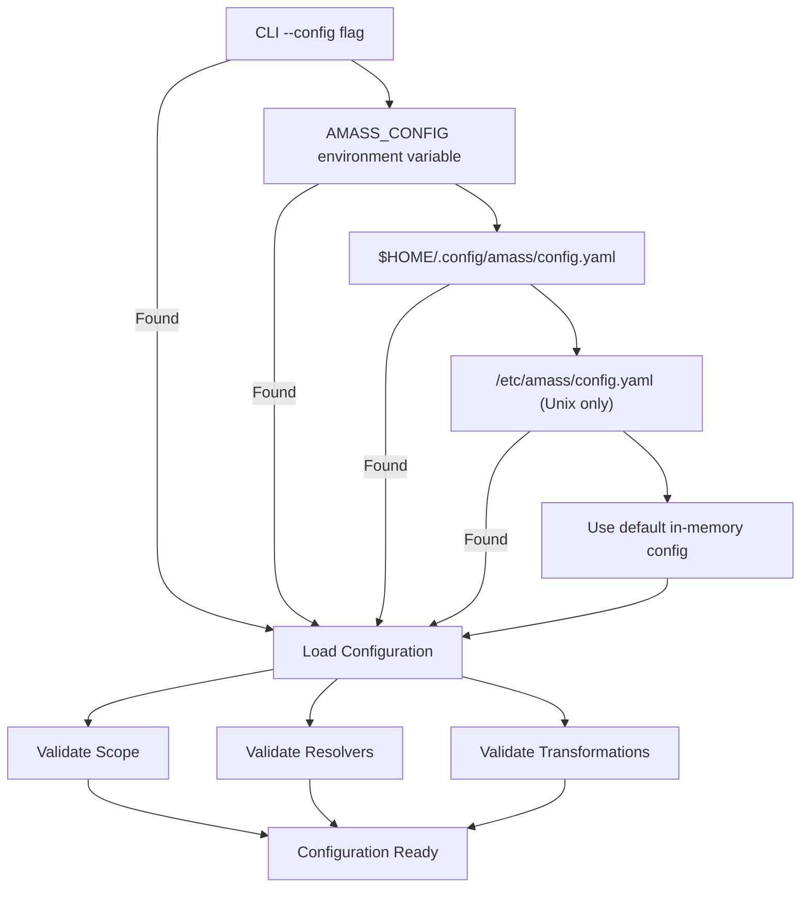
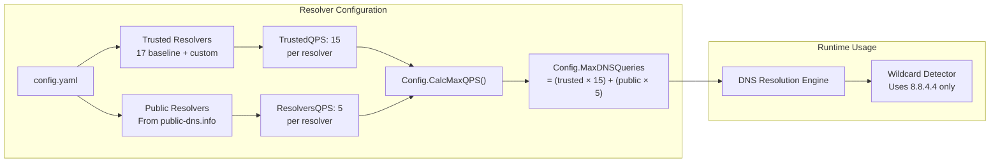
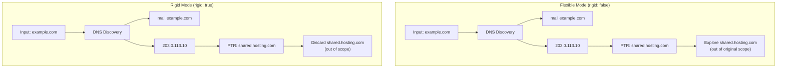
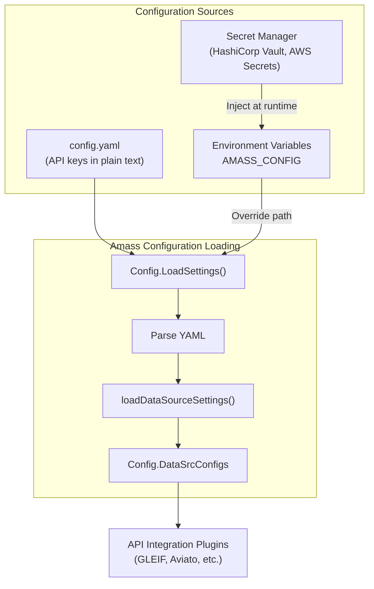
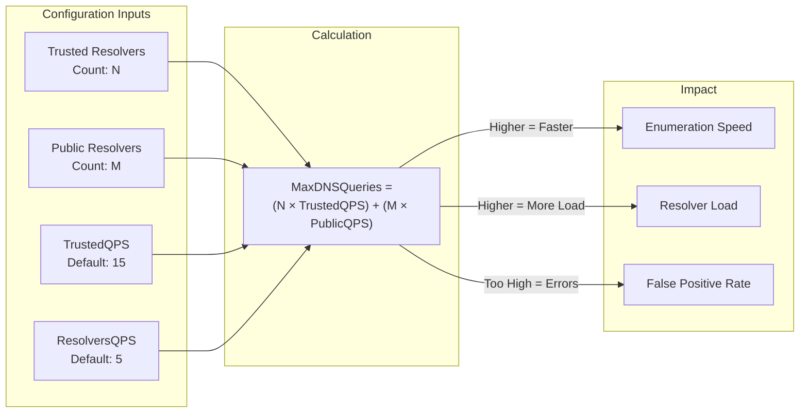
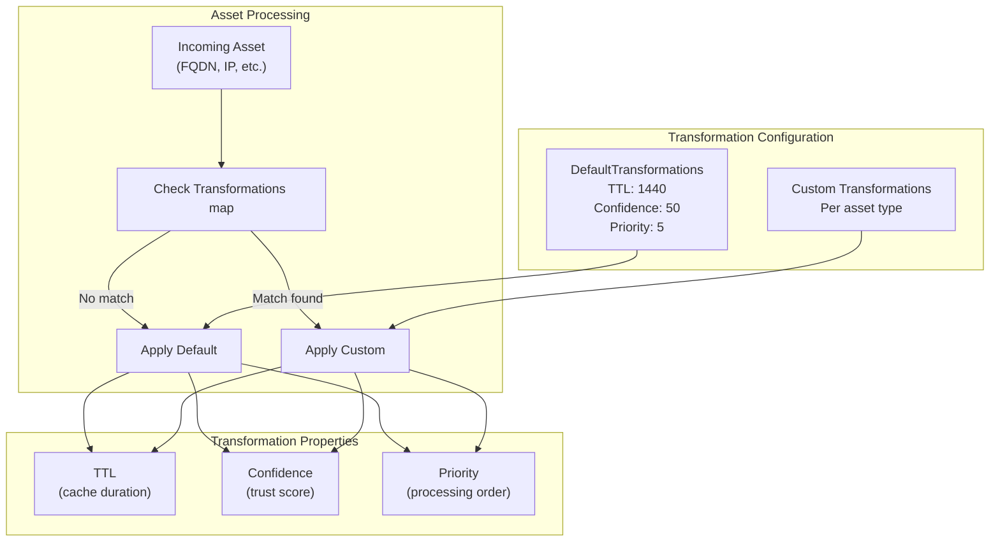
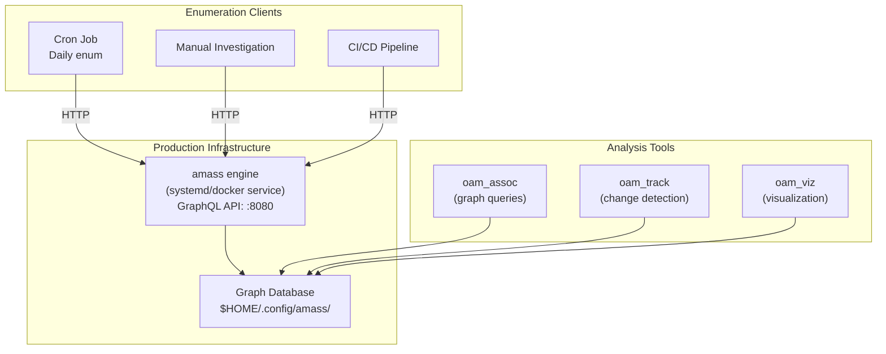

# Configuration Best Practices

# Configuration Best Practices

<details>
<summary>Relevant source files</summary>

The following files were used as context for generating this wiki page:

- [cmd/amass/main.go](cmd/amass/main.go)
- [config/config.go](config/config.go)
- [config/resolvers.go](config/resolvers.go)

</details>


This page provides production-tested best practices for configuring OWASP Amass deployments. It covers configuration hierarchy, resolver management, scope tuning, secrets handling, and performance optimization.

For basic installation and initial configuration, see [Installation and Quick Start](#1.1). For detailed information about the Configuration System architecture, see [Configuration System](#3.3). For deployment strategies, see [Docker Deployment](#9.1).

---

## Configuration Hierarchy and Loading

Amass follows a three-tier configuration hierarchy where later sources override earlier ones:

1. **YAML Configuration File** - Primary configuration source
2. **Environment Variables** - Override specific settings
3. **Command-Line Arguments** - Highest priority overrides

### Configuration File Resolution Order

The system searches for configuration files in the following order:



**Sources:** [cmd/amass/main.go:116-132](), [config/config.go:346-369]()

### Best Practice: Multi-Environment Configuration

Structure your configuration files for different environments:

```
$HOME/.config/amass/
├── config.yaml              # Default configuration
├── config.production.yaml   # Production overrides
├── config.staging.yaml      # Staging overrides
└── resolvers/
    ├── trusted.txt          # Custom trusted resolvers
    └── public.txt           # Additional public resolvers
```

Use the `AMASS_CONFIG` environment variable to switch between environments:

```bash
# Development
amass enum -d example.com

# Production
export AMASS_CONFIG=$HOME/.config/amass/config.production.yaml
amass enum -d example.com

# Staging with explicit path
amass enum -config $HOME/.config/amass/config.staging.yaml -d example.com
```

**Sources:** [config/config.go:33-36](), [config/config.go:346-369]()

---

## Resolver Configuration Best Practices

### Understanding Resolver Types

Amass uses two distinct resolver pools with different characteristics:

| Resolver Type | Default Count | Default QPS | Purpose | Source |
|--------------|---------------|-------------|---------|--------|
| **Trusted (Baseline)** | 17 hardcoded | 15 queries/sec | Primary resolution, validation | [config/resolvers.go:31-49]() |
| **Public** | Fetched dynamically | 5 queries/sec | Load distribution, diversity | [config/resolvers.go:54-98]() |



**Sources:** [config/resolvers.go:23-28](), [config/resolvers.go:156-159]()

### Best Practice: Custom Resolver Lists

For production deployments, provide custom resolver lists to avoid reliance on external services:

**config.yaml:**
```yaml
options:
  resolvers:
    - 8.8.8.8                           # Direct IP address
    - 1.1.1.1                           # Direct IP address
    - ./resolvers/custom-resolvers.txt  # Relative path from config file
    - /etc/amass/resolvers/prod.txt     # Absolute path
```

**resolvers/custom-resolvers.txt:**
```
# Corporate DNS infrastructure
10.0.1.53
10.0.2.53
10.0.3.53

# Cloud provider DNS
172.16.0.23
```

The configuration system handles both direct IP addresses and file paths, resolving relative paths from the config file location:

**Sources:** [config/resolvers.go:161-215](), [config/config.go:312-335]()

### Best Practice: Resolver QPS Tuning

Adjust QPS rates based on your resolver infrastructure and rate limits:

```yaml
# Conservative settings for shared infrastructure
trusted_resolvers:
  - 8.8.8.8
  - 1.1.1.1
# Default TrustedQPS: 15 per resolver = 30 total

resolvers:
  - ./resolvers/internal-dns.txt
# Default ResolversQPS: 5 per resolver

# For dedicated infrastructure, configure via CLI:
# amass enum -d example.com -rf resolvers.txt -max-dns-queries 500
```

**Calculation formula:**
```
MaxDNSQueries = (len(TrustedResolvers) × TrustedQPS) + (len(Resolvers) × ResolversQPS)
```

**Sources:** [config/resolvers.go:23-27](), [config/resolvers.go:156-159]()

### Best Practice: Resolver Reliability Filtering

The public resolver fetcher automatically filters by reliability score:

```go
// Only resolvers with >= 85% reliability are included
const minResolverReliability = 0.85
```

This prevents unstable resolvers from polluting results. For custom resolver lists, validate reliability before adding:

```bash
# Test resolver response time and accuracy
dig @8.8.8.8 example.com +time=2 +tries=3
```

**Sources:** [config/resolvers.go:28](), [config/resolvers.go:84-86]()

---

## Scope Management Best Practices

### Rigid vs Flexible Boundaries

Amass supports two scope enforcement modes:



**Sources:** [config/config.go:119]()

### Best Practice: Scope Definition for Different Use Cases

**Targeted Assessment (Rigid Boundaries):**
```yaml
rigid_boundaries: true
scope:
  domains:
    - example.com
    - example.net
  cidrs:
    - 203.0.113.0/24
  asns:
    - 64496
  ports:
    - 80
    - 443
    - 8080
    - 8443
```

**Comprehensive Discovery (Flexible Boundaries):**
```yaml
rigid_boundaries: false
seed:
  domains:
    - example.com
# No explicit scope - discover associated assets
```

**Sources:** [config/config.go:61-64](), [config/config.go:169-197]()

### Best Practice: Blacklist Management

Use blacklists to exclude specific subdomains from enumeration:

```yaml
scope:
  domains:
    - example.com
  blacklist:
    - cdn.example.com           # Third-party CDN
    - legacy-*.example.com      # Pattern matching not supported
    - test.example.com          # Internal testing domain
```

**Important:** Blacklist entries must be exact matches. Pattern matching is not currently supported.

**Sources:** [config/config.go:196]()

---

## API Key and Secrets Management

### Architecture for Credential Storage



**Sources:** [config/config.go:154](), [config/config.go:292-306]()

### Best Practice: Externalized Secrets

**Development (config.yaml):**
```yaml
# NOT RECOMMENDED FOR PRODUCTION
datasources:
  aviato:
    api_key: "dev-api-key-1234567890"
  gleif:
    api_key: "dev-gleif-key-abcdefg"
```

**Production (Environment Variables + Template):**

**config.production.yaml (template):**
```yaml
# No hardcoded secrets
datasources:
  aviato:
    # api_key loaded from environment
  gleif:
    # api_key loaded from environment
```

**Deployment script:**
```bash
#!/bin/bash
# Fetch secrets from vault
export AVIATO_API_KEY=$(vault kv get -field=api_key secret/amass/aviato)
export GLEIF_API_KEY=$(vault kv get -field=api_key secret/amass/gleif)

# Inject secrets via config preprocessing
envsubst < config.production.yaml.template > config.production.yaml

# Run amass
amass enum -config config.production.yaml -d example.com

# Clean up
rm config.production.yaml
```

### Best Practice: Minimal Permission API Keys

Configure API keys with minimal required permissions:

| Data Source | Required Permissions | Rate Limit Considerations |
|-------------|---------------------|--------------------------|
| GLEIF | Public read access | No key required for basic search |
| Aviato | Company search, employee read | 1000 requests/day on free tier |
| RDAP | No authentication | Rate limited by registry |
| BGP.Tools WHOIS | No authentication | Aggressive rate limiting |

**Sources:** Files reference API plugins in the plugin ecosystem

---

## Performance Tuning Best Practices

### DNS Query Rate Optimization



**Sources:** [config/resolvers.go:156-159]()

### Best Practice: Resource Allocation

**Small Scope (1-10 domains):**
```yaml
# Conservative settings
trusted_resolvers:
  - 8.8.8.8
  - 1.1.1.1
# MaxDNSQueries: 2 × 15 = 30 queries/sec
# Estimated time: 5-15 minutes
```

**Medium Scope (10-100 domains):**
```yaml
# Balanced settings
trusted_resolvers:
  - 8.8.8.8
  - 1.1.1.1
  - 9.9.9.9
  - 208.67.222.222
options:
  resolvers:
    - ./resolvers/additional-20.txt
# MaxDNSQueries: (4 × 15) + (20 × 5) = 160 queries/sec
# Estimated time: 30-90 minutes
```

**Large Scope (100+ domains):**
```yaml
# Aggressive settings with dedicated infrastructure
trusted_resolvers:
  - ./resolvers/corporate-dns-pool.txt  # 10 resolvers
options:
  resolvers:
    - ./resolvers/public-validated.txt  # 50 resolvers
# MaxDNSQueries: (10 × 15) + (50 × 5) = 400 queries/sec
# Estimated time: 2-6 hours
```

### Best Practice: TTL Configuration

The `MinimumTTL` setting controls how long discovered data is cached:

```yaml
options:
  minimum_ttl: 1440  # 24 hours (default)
  # minimum_ttl: 60  # 1 hour for rapidly changing infrastructure
  # minimum_ttl: 10080  # 7 days for stable environments
```

**Trade-offs:**

| TTL Value | Pros | Cons |
|-----------|------|------|
| Low (60 min) | Fresh data, detects changes quickly | More DNS queries, slower enumeration |
| Medium (1440 min) | Balanced performance | May miss recent changes |
| High (10080 min) | Faster enumeration, reduced load | Stale data risk |

**Sources:** [config/config.go:130](), [config/config.go:217]()

---

## Transformation Configuration

### Understanding the Transformation System

Transformations control how discovered assets flow through the processing pipeline:



**Sources:** [config/config.go:69-70](), [config/config.go:224-228]()

### Best Practice: Asset-Specific Transformations

Configure different processing rules for different asset types:

```yaml
transformations:
  fqdn:
    ttl: 1440        # 24 hours for domain names
    confidence: 80   # High confidence in DNS data
    priority: 1      # Process domains first
    
  ip_address:
    ttl: 2880        # 48 hours for IP addresses (more stable)
    confidence: 90   # Very high confidence
    priority: 3      # Process after domains
    
  organization:
    ttl: 10080       # 7 days for organization data
    confidence: 70   # Medium confidence (fuzzy matching)
    priority: 5      # Lower priority
```

**Sources:** [config/config.go:157]()

---

## Production Deployment Patterns

### Pattern 1: Engine-as-a-Service

Run the engine as a persistent service, with ephemeral enumeration clients:



**systemd service configuration:**
```ini
[Unit]
Description=OWASP Amass Engine
After=network.target

[Service]
Type=simple
User=amass
Environment="AMASS_CONFIG=/etc/amass/config.production.yaml"
ExecStart=/usr/local/bin/amass engine
Restart=always
RestartSec=10

[Install]
WantedBy=multi-user.target
```

**Sources:** [cmd/amass/main.go:139-157]()

### Pattern 2: Containerized Deployment

Mount configuration and data directories as volumes:

```yaml
# docker-compose.yml
version: '3.8'
services:
  amass-engine:
    image: owaspamass/amass:latest
    container_name: amass-engine
    volumes:
      - ./config:/root/.config/amass:ro
      - ./data:/root/.config/amass/data
      - ./resolvers:/etc/amass/resolvers:ro
    environment:
      - AMASS_CONFIG=/root/.config/amass/config.yaml
    ports:
      - "8080:8080"
    restart: unless-stopped
    
  amass-enum:
    image: owaspamass/amass:latest
    container_name: amass-enum
    depends_on:
      - amass-engine
    command: enum -d example.com
    volumes:
      - ./config:/root/.config/amass:ro
      - ./output:/output
```

**Sources:** Docker deployment patterns from high-level diagrams

### Pattern 3: Configuration Validation Pipeline

Validate configuration before deployment:

```bash
#!/bin/bash
# validate-config.sh

CONFIG_FILE="$1"

echo "Validating configuration: $CONFIG_FILE"

# Check YAML syntax
yamllint "$CONFIG_FILE" || exit 1

# Check file paths exist
grep -E "^\s+- ./" "$CONFIG_FILE" | while read -r line; do
    path=$(echo "$line" | sed 's/.*- //')
    if [ ! -f "$path" ]; then
        echo "ERROR: Referenced file not found: $path"
        exit 1
    fi
done

# Validate resolver IPs
if grep -q "resolvers:" "$CONFIG_FILE"; then
    echo "Testing resolver connectivity..."
    # Extract and test each resolver
fi

echo "Configuration validation passed"
```

---

## Common Pitfalls and Solutions

### Pitfall 1: Relative Path Resolution

**Problem:** Relative paths in config fail when running from different directories.

**Solution:** Use absolute paths or understand resolution order:

```yaml
# BAD: Relative to current working directory
options:
  resolvers:
    - resolvers/custom.txt

# GOOD: Relative to config file location
options:
  resolvers:
    - ./resolvers/custom.txt

# BEST: Absolute path
options:
  resolvers:
    - /etc/amass/resolvers/custom.txt
```

The system resolves `./` paths relative to the config file's directory, not the working directory:

**Sources:** [config/config.go:312-335]()

### Pitfall 2: Insufficient Resolver Pool

**Problem:** Using only default resolvers causes rate limiting and slow enumeration.

**Solution:** Provision adequate resolver infrastructure:

```yaml
# Default: 17 trusted + 0 public = 255 queries/sec max
# Add custom resolvers for better performance

trusted_resolvers:
  - 8.8.8.8
  - 1.1.1.1
  # Add more trusted resolvers

options:
  resolvers:
    - ./resolvers/validated-public.txt  # 50+ resolvers
```

**Sources:** [config/resolvers.go:31-49](), [config/resolvers.go:156-159]()

### Pitfall 3: Scope Creep with Flexible Boundaries

**Problem:** Flexible boundaries discover too many unrelated assets.

**Solution:** Use seed/scope separation:

```yaml
# Define starting points
seed:
  domains:
    - example.com
    
# Define strict boundaries
scope:
  domains:
    - example.com
    - "*.example.com"
  cidrs:
    - 203.0.113.0/24
rigid_boundaries: true
```

**Sources:** [config/config.go:61-64](), [config/config.go:119]()

### Pitfall 4: Missing Output Directory Permissions

**Problem:** Amass fails to create database files due to permission errors.

**Solution:** Ensure output directory exists with correct permissions:

```bash
# Create output directory structure
mkdir -p $HOME/.config/amass
chmod 755 $HOME/.config/amass

# Or specify custom directory
mkdir -p /var/lib/amass
chown amass:amass /var/lib/amass
```

The system automatically creates the output directory if it doesn't exist:

**Sources:** [cmd/amass/main.go:116-126](), [config/config.go:373-383]()

### Pitfall 5: Transformation Map Misconfig

**Problem:** No transformations defined causes assets to be ignored.

**Solution:** Ensure default transformations cover all asset types:

```yaml
# Define defaults that apply to all asset types
transformations:
  default:
    ttl: 1440
    confidence: 50
    priority: 5
  
  # Override for specific types
  fqdn:
    ttl: 720
    confidence: 80
    priority: 1
```

If no transformation is defined for an asset type, it falls back to `DefaultTransformations`:

**Sources:** [config/config.go:224-228]()

---

## Configuration Checklist

Use this checklist before production deployment:

- [ ] **Configuration File**
  - [ ] Valid YAML syntax
  - [ ] All file paths exist and are accessible
  - [ ] No hardcoded secrets in version control
  
- [ ] **Resolvers**
  - [ ] At least 5 trusted resolvers configured
  - [ ] Resolver files validated (all valid IPs)
  - [ ] QPS tuned for infrastructure capacity
  - [ ] MaxDNSQueries calculated and appropriate
  
- [ ] **Scope**
  - [ ] Domains explicitly listed
  - [ ] CIDRs and ASNs verified
  - [ ] Blacklist populated if needed
  - [ ] Rigid boundaries setting appropriate for use case
  
- [ ] **API Keys**
  - [ ] Stored in external secret manager
  - [ ] Minimal permissions configured
  - [ ] Rate limits understood and monitored
  
- [ ] **Performance**
  - [ ] MinimumTTL appropriate for update frequency
  - [ ] Transformation priorities set correctly
  - [ ] Resource allocation matches scope size
  
- [ ] **Infrastructure**
  - [ ] Output directory exists with correct permissions
  - [ ] Sufficient disk space for graph database
  - [ ] Network access to required APIs
  - [ ] DNS resolver connectivity verified

**Sources:** Summary of best practices from throughout this document