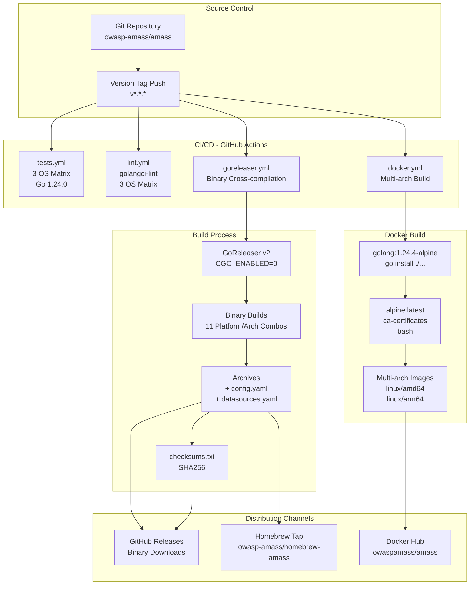
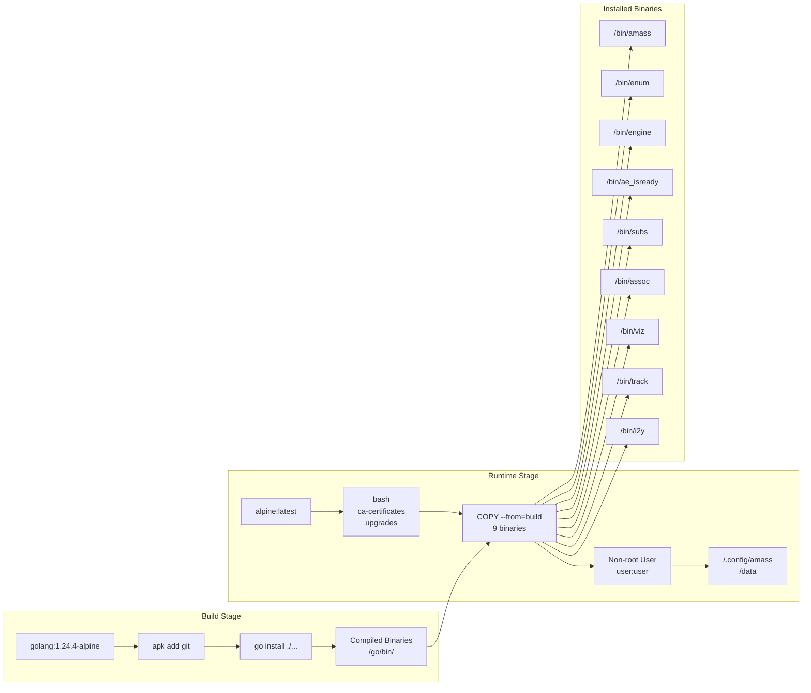
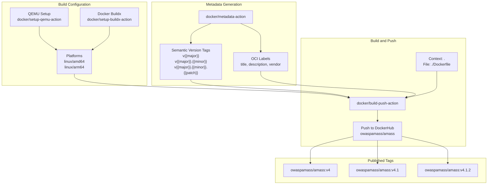

# Deployment

# Deployment

<details>
<summary>Relevant source files</summary>

The following files were used as context for generating this wiki page:

- [.codeclimate.yml](.codeclimate.yml)
- [.dockerignore](.dockerignore)
- [.gitattributes](.gitattributes)
- [.github/workflows/docker.yml](.github/workflows/docker.yml)
- [.github/workflows/go.yml](.github/workflows/go.yml)
- [.github/workflows/goreleaser.yml](.github/workflows/goreleaser.yml)
- [.github/workflows/lint.yml](.github/workflows/lint.yml)
- [.gitignore](.gitignore)
- [.goreleaser.yaml](.goreleaser.yaml)
- [CONTRIBUTING.md](CONTRIBUTING.md)
- [Dockerfile](Dockerfile)
- [LICENSE](LICENSE)
- [codecov.yml](codecov.yml)
- [internal/enum/assets.go](internal/enum/assets.go)

</details>


## Purpose and Scope

This document describes the deployment strategies and distribution mechanisms for OWASP Amass. It covers the available installation methods, platform support, and the automated build and release pipeline that produces binaries, Docker images, and package manager distributions.

For detailed information about Docker-specific deployment, see [Docker Deployment](#9.1). For production configuration best practices, including API key management and resolver configuration, see [Configuration Best Practices](#9.2).

---

## Deployment Overview

OWASP Amass provides three primary deployment methods:

1. **Direct Binary Installation** - Pre-compiled binaries for multiple operating systems and architectures, distributed via GitHub Releases
2. **Docker Containerization** - Multi-architecture container images hosted on Docker Hub
3. **Package Manager Installation** - Homebrew tap for macOS and Linux users

All deployment artifacts are automatically built and published through a CI/CD pipeline when version tags are pushed to the repository. The build process uses GoReleaser for binary compilation and Docker Buildx for multi-architecture container images.

**Sources:** [.goreleaser.yaml:1-80](), [Dockerfile:1-31](), [.github/workflows/docker.yml:1-58](), [.github/workflows/goreleaser.yml:1-37]()

---

## Release Pipeline Architecture

The following diagram illustrates the automated build and distribution pipeline that produces all deployment artifacts:



**Release Pipeline Components**

The pipeline is triggered when a semantic version tag (matching pattern `v*.*.*`) is pushed to the repository. Four parallel workflows execute:

1. **Testing Workflow** - Executes the full test suite across three operating systems (Ubuntu, macOS, Windows) with Go 1.24.0
2. **Linting Workflow** - Runs `golangci-lint` on the same OS matrix to ensure code quality
3. **GoReleaser Workflow** - Cross-compiles binaries for all supported platforms and publishes to GitHub Releases and Homebrew
4. **Docker Workflow** - Builds multi-architecture container images using QEMU emulation and publishes to Docker Hub

**Sources:** [.github/workflows/goreleaser.yml:1-37](), [.github/workflows/docker.yml:1-58](), [.github/workflows/go.yml:1-51](), [.github/workflows/lint.yml:1-33]()

---

## Binary Cross-Compilation Matrix

The GoReleaser configuration [.goreleaser.yaml:8-36]() defines a comprehensive cross-compilation matrix that produces binaries for the following combinations:

| Operating System | Architectures | Notes |
|-----------------|---------------|-------|
| **Linux** | amd64, 386, arm (v6/v7), arm64 | Full support for all architectures |
| **Darwin (macOS)** | amd64, arm64 | Excludes 386 and arm (deprecated/unsupported) |
| **Windows** | amd64 | Excludes 386, arm, arm64 (limited use case) |

All binaries are built with `CGO_ENABLED=0` [.goreleaser.yaml:12-13](), ensuring fully static binaries with no external C library dependencies. This configuration provides maximum portability and eliminates runtime dependency issues.

The build produces the main `amass` binary from [./cmd/amass]() along with the OAM analysis tools (oam_enum, oam_subs, oam_assoc, oam_viz, oam_track, oam_i2y) and supporting utilities (amass_engine, ae_isready).

**Archive Contents**

Each release archive [.goreleaser.yaml:38-46]() includes:
- Compiled binary for the target platform
- `LICENSE` file
- `README.md` documentation
- `resources/config.yaml` - Default configuration template
- `resources/datasources.yaml` - Data source credentials template

**Sources:** [.goreleaser.yaml:8-46]()

---

## Docker Multi-Stage Build

The Docker deployment uses a multi-stage build process defined in [Dockerfile:1-31]() to minimize the final image size:



**Build Stage** [Dockerfile:1-5]()
- Base: `golang:1.24.4-alpine`
- Installs Git for dependency fetching
- Compiles all binaries with `CGO_ENABLED=0`
- Outputs to `/go/bin/`

**Runtime Stage** [Dockerfile:7-31]()
- Base: `alpine:latest` (minimal footprint)
- Installs `bash` and `ca-certificates` for HTTPS/TLS operations
- Applies security updates with `apk upgrade`
- Copies only the compiled binaries (discards build dependencies)
- Creates non-root user `user` with UID/GID assignment [Dockerfile:20-21]()
- Sets up configuration directory `/.config/amass` [Dockerfile:22-25]()
- Creates data directory `/data` for output files [Dockerfile:26-27]()
- Sets `WORKDIR /data` as default working directory
- Configures `SIGINT` for graceful shutdown [Dockerfile:30]()
- Entrypoint: `/bin/amass` [Dockerfile:31]()

This architecture separates build-time dependencies from runtime, resulting in a significantly smaller image (alpine base ~5MB vs. golang ~300MB).

**Sources:** [Dockerfile:1-31]()

---

## Docker Multi-Architecture Support

The Docker workflow [.github/workflows/docker.yml:1-58]() builds images for multiple architectures using Docker Buildx with QEMU emulation:



**Platform Support**

The workflow [.github/workflows/docker.yml:39]() configures `linux/amd64` and `linux/arm64` as target platforms. QEMU emulation [.github/workflows/docker.yml:36-39]() enables cross-platform builds on the x86_64 GitHub Actions runner.

**Semantic Versioning Tags**

For a release tagged `v4.1.2`, the metadata action [.github/workflows/docker.yml:22-34]() generates three image tags:
- `owaspamass/amass:v4` - Major version (latest v4.x.x)
- `owaspamass/amass:v4.1` - Minor version (latest v4.1.x)
- `owaspamass/amass:v4.1.2` - Patch version (exact release)

This tagging strategy allows users to pin to specific stability levels (exact version, minor updates, or major version line).

**OCI Image Labels**

The workflow applies Open Container Initiative metadata [.github/workflows/docker.yml:31-34]():
- `org.opencontainers.image.title=OWASP Amass`
- `org.opencontainers.image.description=In-depth attack surface mapping and asset discovery`
- `org.opencontainers.image.vendor=OWASP Foundation`

**Sources:** [.github/workflows/docker.yml:1-58]()

---

## Deployment Topology Options

The following diagram illustrates common deployment topologies for OWASP Amass:

```mermaid
graph TB
    subgraph "Local Development"
        LocalBinary["Binary Installation<br/>go install<br/>homebrew"]
        LocalConfig["~/.config/amass/<br/>config.yaml<br/>datasources.yaml"]
        LocalData["Local Filesystem<br/>Graph Database<br/>Session Cache"]
        LocalBinary --> LocalConfig
        LocalBinary --> LocalData
    end
    
    subgraph "Container Deployment"
        DockerContainer["Docker Container<br/>owaspamass/amass"]
        VolumeConfig["Volume Mount<br/>/path/to/config:/.config/amass"]
        VolumeData["Volume Mount<br/>/path/to/data:/data"]
        DockerContainer --> VolumeConfig
        DockerContainer --> VolumeData
    end
    
    subgraph "Client-Server Topology"
        EngineServer["amass_engine<br/>Background Service<br/>GraphQL API"]
        EnumClient1["oam_enum Client #1<br/>Domain Enumeration"]
        EnumClient2["oam_enum Client #2<br/>IP Enumeration"]
        SharedDB["Shared Graph DB<br/>asset-db/"]
        EngineServer --> SharedDB
        EnumClient1 --> EngineServer
        EnumClient2 --> EngineServer
    end
    
    subgraph "Analysis Workstation"
        AnalysisTools["OAM Tools<br/>oam_assoc<br/>oam_subs<br/>oam_track<br/>oam_viz"]
        ExistingDB["Existing Graph DB<br/>Read-only Access"]
        OutputFiles["Output Files<br/>JSON, DOT, GEXF"]
        AnalysisTools --> ExistingDB
        AnalysisTools --> OutputFiles
    end
```



**Local Development Topology**

Single-user installation with the binary installed via `go install` or Homebrew. Configuration files reside in `~/.config/amass/` on Unix-like systems. The graph database and session cache are stored locally on the filesystem.

**Container Deployment Topology**

Docker-based deployment with external volume mounts for configuration and data persistence. The container runs as non-root user `user` [Dockerfile:28]() with working directory `/data` [Dockerfile:29](). Configuration files are mounted at `/.config/amass` and output data is persisted to `/data`.

**Client-Server Topology**

Distributed deployment where `amass_engine` runs as a background service exposing a GraphQL API (see page [Session Management](#4.2)). Multiple `oam_enum` clients connect to the shared engine to submit enumeration jobs. All clients share a common graph database, enabling collaborative asset discovery.

**Analysis Workstation Topology**

Post-enumeration analysis workflow where OAM tools (`oam_assoc`, `oam_subs`, `oam_track`, `oam_viz`) operate on previously collected graph data. These tools provide read-only access to the database and produce various output formats (JSON, graph visualization files).

**Sources:** [Dockerfile:19-29]()

---

## Installation Methods

### Binary Installation

**Via Go Install**
```bash
go install -v github.com/owasp-amass/amass/v5/...@latest
```

This command installs all Amass binaries to `$GOPATH/bin/`:
- `amass` - Main CLI dispatcher
- `amass_engine` - Background enumeration engine
- `oam_enum` - Enumeration client
- `oam_assoc` - Asset association queries
- `oam_subs` - Subdomain summary
- `oam_track` - New asset tracking
- `oam_viz` - Graph visualization
- `oam_i2y` - Ingestion utilities
- `ae_isready` - Engine readiness probe

**Via GitHub Releases**

Download pre-compiled binaries from the GitHub Releases page. Each release includes:
1. Platform-specific archives (`.tar.gz` or `.zip`)
2. SHA256 checksums file [.goreleaser.yaml:48-49]()
3. Configuration templates (`config.yaml`, `datasources.yaml`)

Extract the archive and add the binary to your system `PATH`.

**Via Homebrew (macOS/Linux)**
```bash
brew tap owasp-amass/amass
brew install amass
```

The Homebrew tap [.goreleaser.yaml:63-79]() is automatically updated by the GoReleaser workflow when new versions are tagged. It provides automatic dependency management and system integration.

**Sources:** [.goreleaser.yaml:8-46](), [.goreleaser.yaml:63-79]()

### Docker Installation

**Pull from Docker Hub**
```bash
docker pull owaspamass/amass:latest
```

**Run with Configuration and Data Volumes**
```bash
docker run -v /path/to/config:/.config/amass \
           -v /path/to/output:/data \
           owaspamass/amass enum -d example.com
```

The container expects:
- Configuration files mounted at `/.config/amass/` [Dockerfile:22-25]()
- Output directory mounted at `/data/` [Dockerfile:26-27]()
- Commands passed as arguments to the `amass` entrypoint [Dockerfile:31]()

**Access OAM Tools in Container**
```bash
docker run -v /path/to/data:/data \
           --entrypoint /bin/subs \
           owaspamass/amass -dir /data/asset-db
```

Override the entrypoint to access other binaries:
- `/bin/enum` - oam_enum
- `/bin/engine` - amass_engine
- `/bin/subs` - oam_subs
- `/bin/assoc` - oam_assoc
- `/bin/viz` - oam_viz
- `/bin/track` - oam_track
- `/bin/i2y` - oam_i2y
- `/bin/ae_isready` - Engine readiness probe

**Sources:** [Dockerfile:10-18](), [Dockerfile:31]()

---

## Configuration File Management

Amass expects configuration files in the following locations:

| File | Default Location | Purpose |
|------|-----------------|---------|
| `config.yaml` | `~/.config/amass/config.yaml` | Main configuration (scope, resolvers, plugins) |
| `datasources.yaml` | `~/.config/amass/datasources.yaml` | API credentials for external services |

**Configuration Directory Structure**

In Docker deployments, the configuration directory is `/.config/amass/` [Dockerfile:22-25]() with ownership set to the non-root `user:user` [Dockerfile:23-24]().

In binary installations, the default is `$HOME/.config/amass/` on Unix-like systems.

**Environment Variable Override**

The `AMASS_CONFIG` environment variable can override the default configuration file location:
```bash
export AMASS_CONFIG=/custom/path/config.yaml
amass enum -d example.com
```

**Configuration Templates**

Release archives include template files [.goreleaser.yaml:43-46]():
- `resources/config.yaml` - Commented example configuration
- `resources/datasources.yaml` - API credential templates

For detailed configuration options and production best practices, see [Configuration Best Practices](#9.2).

**Sources:** [.goreleaser.yaml:42-46](), [Dockerfile:22-25]()

---

## Data Persistence and Volume Management

### Graph Database Storage

Amass stores discovered assets in a graph database using the Open Asset Model (OAM) format. The database location is configurable via:

**CLI Arguments**
```bash
amass enum -dir /path/to/asset-db -d example.com
```

**Docker Volume Mount**
```bash
docker run -v /host/asset-db:/data/asset-db \
           owaspamass/amass enum -dir /data/asset-db -d example.com
```

The graph database persists all discovered assets, relationships, and metadata. Multiple enumeration sessions can target the same database to build a comprehensive asset inventory over time.

### Session Cache and Work Queue

During enumeration, Amass maintains session-specific caches and work queues (typically SQLite) for:
- Deduplication of discovered assets
- TTL-based DNS result caching
- Event queue management

These temporary data structures are stored within the session directory and can be safely deleted after enumeration completes.

### Docker Volume Strategy

Recommended volume mount strategy for containerized deployments:

```bash
docker run \
  -v /host/config:/root/.config/amass:ro \
  -v /host/data:/data \
  owaspamass/amass enum -d example.com
```

- Configuration volume mounted read-only (`:ro`)
- Data volume mounted read-write for database and output files
- Working directory set to `/data` by default [Dockerfile:29]()

**Sources:** [Dockerfile:26-29]()

---

## Production Deployment Considerations

### Non-Root Execution

The Docker image runs as non-root user `user` [Dockerfile:20-28]() for security. Binary installations should follow the same principle:

```bash
# Create dedicated user
useradd -r -s /bin/false amass

# Set ownership
chown -R amass:amass /opt/amass
chown -R amass:amass /var/lib/amass

# Run as dedicated user
sudo -u amass amass enum -d example.com
```

### Resource Limits

For containerized production deployments, apply resource constraints:

```bash
docker run --memory=4g \
           --cpus=2 \
           --ulimit nofile=65536:65536 \
           -v /host/config:/root/.config/amass:ro \
           -v /host/data:/data \
           owaspamass/amass enum -d example.com
```

The DNS resolution system can open many concurrent connections. Set appropriate file descriptor limits (`nofile`).

### Signal Handling

The Docker image is configured with `STOPSIGNAL SIGINT` [Dockerfile:30]() for graceful shutdown. The engine will:
1. Stop accepting new work
2. Complete in-flight operations
3. Flush caches to persistent storage
4. Release resources

Allow sufficient grace period (30-60 seconds) for clean termination.

### Multi-Architecture Deployment

The Docker images support both `linux/amd64` and `linux/arm64` [.github/workflows/docker.yml:39](). Docker automatically selects the appropriate architecture:

```bash
docker run --platform linux/arm64 owaspamass/amass enum -d example.com
```

For Kubernetes deployments, node selectors can target specific architectures:

```yaml
nodeSelector:
  kubernetes.io/arch: arm64
```

**Sources:** [Dockerfile:20-30](), [.github/workflows/docker.yml:39]()

---

## Health Checks and Readiness Probes

The `ae_isready` utility [Dockerfile:13]() provides health checking for the `amass_engine` background service:

```bash
# Check if engine is ready
/bin/ae_isready

# Kubernetes readiness probe
readinessProbe:
  exec:
    command:
    - /bin/ae_isready
  initialDelaySeconds: 10
  periodSeconds: 5
```

This probe queries the engine's GraphQL API to verify it is accepting connections and processing requests.

**Sources:** [Dockerfile:13]()

---

## Continuous Integration and Testing

### Test Matrix

The test workflow [.github/workflows/go.yml:10-35]() executes on:
- **Operating Systems**: Ubuntu, macOS, Windows
- **Go Version**: 1.24.0
- **Test Modes**: 
  - Standard test execution: `go test -v ./...`
  - GC pressure testing: `GOGC=1 go test -v ./...`

### Coverage Reporting

Coverage is measured [.github/workflows/go.yml:46-47]() and reported to Codecov:
```bash
CGO_ENABLED=0 go test -v -coverprofile=coverage.out ./...
```

Configuration in [codecov.yml:10-13]() sets:
- Coverage range: 20-60%
- Precision: 2 decimal places
- Round up for threshold calculation

### Linting Standards

The lint workflow [.github/workflows/lint.yml:27-32]() runs `golangci-lint` with:
- 60-minute timeout
- Only new issues flagged (no historical debt)
- Cross-platform validation (3 OS matrix)

**Sources:** [.github/workflows/go.yml:1-51](), [.github/workflows/lint.yml:1-33](), [codecov.yml:1-23]()

---

## Distribution Checksums and Verification

All binary releases include SHA256 checksums [.goreleaser.yaml:48-49](). Verify downloads:

```bash
# Download release and checksums
wget https://github.com/owasp-amass/amass/releases/download/v4.1.0/amass_linux_amd64.tar.gz
wget https://github.com/owasp-amass/amass/releases/download/v4.1.0/amass_checksums.txt

# Verify integrity
sha256sum -c amass_checksums.txt --ignore-missing
```

Expected output:
```
amass_linux_amd64.tar.gz: OK
```

This verifies the binary has not been tampered with during download.

**Sources:** [.goreleaser.yaml:48-49]()