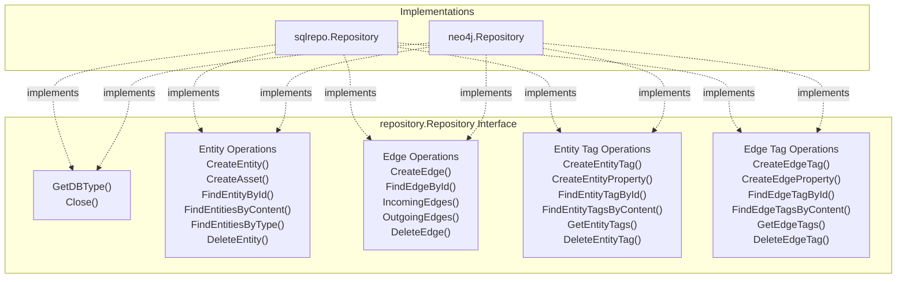
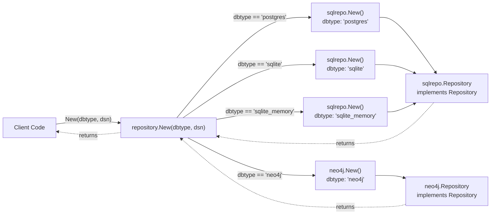
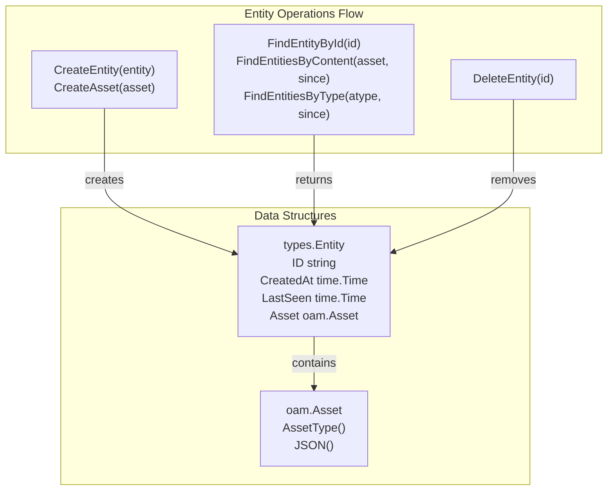
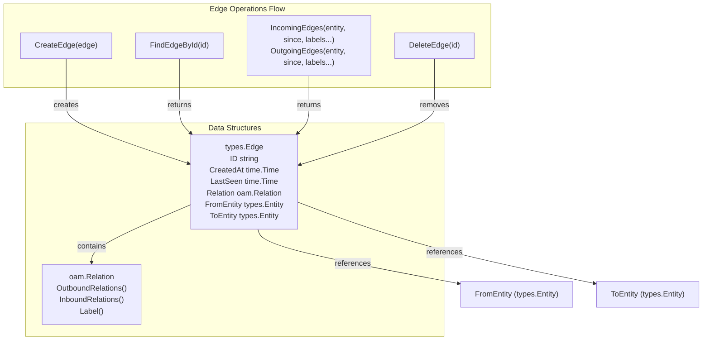
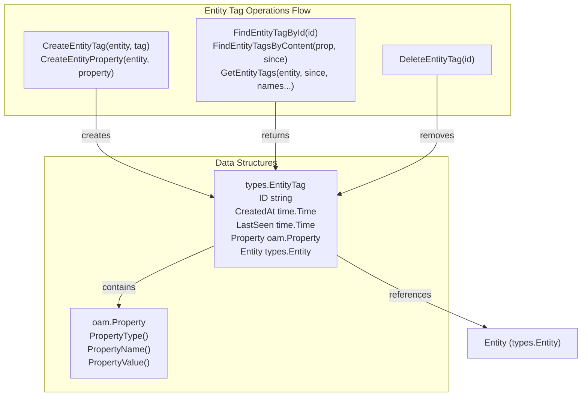
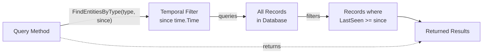

# Repository Interface

# Repository Interface

<details>
<summary>Relevant source files</summary>

The following files were used as context for generating this wiki page:

- [repository/repository.go](repository/repository.go)

</details>


## Purpose and Scope

The Repository interface is the central contract for all database operations in asset-db. It defines a unified API for creating, retrieving, and managing entities, edges, and tags across different database backends (PostgreSQL, SQLite, Neo4j). This page documents all methods in the `repository.Repository` interface.

For implementation-specific details, see [SQL Repository](#4) and [Neo4j Repository](#5). For performance optimization using caching, see [Caching System](#6).

**Sources:** [repository/repository.go:18-46]()

---

## Interface Overview

The `Repository` interface defines 24 methods organized into five functional categories:



**Sources:** [repository/repository.go:20-46]()

---

## Factory Method

The `repository.New()` function creates Repository instances based on the database type:



### Method Signature

```go
func New(dbtype, dsn string) (Repository, error)
```

### Parameters

| Parameter | Type | Description |
|-----------|------|-------------|
| `dbtype` | `string` | Database type identifier (case-insensitive) |
| `dsn` | `string` | Database connection string |

### Supported Database Types

| Value | Implementation | Description |
|-------|----------------|-------------|
| `"postgres"` | `sqlrepo` | PostgreSQL database |
| `"sqlite"` | `sqlrepo` | SQLite file-based database |
| `"sqlite_memory"` | `sqlrepo` | SQLite in-memory database |
| `"neo4j"` | `neo4j` | Neo4j graph database |

### Return Values

- **Success**: Returns a `Repository` interface implementation
- **Error**: Returns `nil` and an error "unknown DB type" if `dbtype` is not recognized

**Sources:** [repository/repository.go:48-61]()

---

## Core Methods

### GetDBType

Returns the database type identifier for the repository instance.

```go
GetDBType() string
```

**Returns:** Database type string (e.g., `"postgres"`, `"sqlite"`, `"neo4j"`)

**Use Case:** Identifying which database backend is in use, useful for conditional logic or logging.

**Sources:** [repository/repository.go:21]()

---

### Close

Closes the database connection and releases resources.

```go
Close() error
```

**Returns:** Error if connection cannot be closed cleanly

**Use Case:** Called when shutting down the application or releasing repository resources.

**Sources:** [repository/repository.go:45]()

---

## Entity Operations

Entity operations manage the core nodes/assets in the graph structure. Entities represent assets as defined by the Open Asset Model.



### CreateEntity

Creates a new entity record in the database.

```go
CreateEntity(entity *types.Entity) (*types.Entity, error)
```

**Parameters:**
- `entity`: Entity with `Asset` field populated (other fields may be empty)

**Returns:**
- Created entity with populated `ID`, `CreatedAt`, and `LastSeen` fields
- Error if creation fails

**Behavior:**
- Assigns unique `ID` (UUID)
- Sets `CreatedAt` and `LastSeen` timestamps
- Serializes `Asset` content for storage

**Sources:** [repository/repository.go:22]()

---

### CreateAsset

Convenience method that wraps an OAM Asset in a types.Entity and creates it.

```go
CreateAsset(asset oam.Asset) (*types.Entity, error)
```

**Parameters:**
- `asset`: Open Asset Model asset (e.g., `FQDN`, `IPAddress`, `Organization`)

**Returns:**
- Created entity
- Error if creation fails

**Behavior:**
- Internally creates a `types.Entity{Asset: asset}` and calls `CreateEntity()`
- Equivalent to manually wrapping asset in entity structure

**Sources:** [repository/repository.go:23]()

---

### FindEntityById

Retrieves an entity by its unique identifier.

```go
FindEntityById(id string) (*types.Entity, error)
```

**Parameters:**
- `id`: Entity UUID string

**Returns:**
- Entity if found
- Error if entity doesn't exist or query fails

**Use Case:** Direct entity lookup when ID is known (e.g., from edge references).

**Sources:** [repository/repository.go:24]()

---

### FindEntitiesByContent

Searches for entities matching specific asset content.

```go
FindEntitiesByContent(asset oam.Asset, since time.Time) ([]*types.Entity, error)
```

**Parameters:**
- `asset`: Asset with content to match (type and fields must match)
- `since`: Return only entities last seen on or after this time

**Returns:**
- Slice of matching entities
- Error if query fails

**Behavior:**
- Matches on both asset type and content
- For FQDN: must match name exactly
- For IPAddress: must match address and type (IPv4/IPv6)
- Temporal filtering via `since` parameter

**Use Case:** Finding existing entities before creating duplicates, or querying specific known assets.

**Sources:** [repository/repository.go:25]()

---

### FindEntitiesByType

Retrieves all entities of a specific asset type.

```go
FindEntitiesByType(atype oam.AssetType, since time.Time) ([]*types.Entity, error)
```

**Parameters:**
- `atype`: Asset type (e.g., `oam.FQDN`, `oam.IPAddress`, `oam.Organization`)
- `since`: Return only entities last seen on or after this time

**Returns:**
- Slice of entities matching the type
- Error if query fails

**Use Case:** Enumerating all assets of a specific category, bulk operations on asset types.

**Sources:** [repository/repository.go:26]()

---

### DeleteEntity

Removes an entity and its associated data from the database.

```go
DeleteEntity(id string) error
```

**Parameters:**
- `id`: Entity UUID to delete

**Returns:**
- Error if deletion fails or entity doesn't exist

**Behavior:**
- Implementation-specific cascade behavior:
  - SQL: May cascade delete tags via foreign keys
  - Neo4j: May require explicit edge/tag deletion first

**Warning:** Behavior may differ between implementations regarding orphaned edges.

**Sources:** [repository/repository.go:27]()

---

## Edge Operations

Edge operations manage directed relationships between entities. Edges represent relations as defined by the Open Asset Model.



### CreateEdge

Creates a directed relationship between two entities.

```go
CreateEdge(edge *types.Edge) (*types.Edge, error)
```

**Parameters:**
- `edge`: Edge with `Relation`, `FromEntity`, and `ToEntity` populated

**Returns:**
- Created edge with populated `ID`, `CreatedAt`, and `LastSeen` fields
- Error if creation fails or entities don't exist

**Behavior:**
- Validates `FromEntity` and `ToEntity` exist in database
- Assigns unique `ID` (UUID)
- Sets `CreatedAt` and `LastSeen` timestamps
- May prevent duplicate edges (implementation-specific)

**Sources:** [repository/repository.go:28]()

---

### FindEdgeById

Retrieves an edge by its unique identifier.

```go
FindEdgeById(id string) (*types.Edge, error)
```

**Parameters:**
- `id`: Edge UUID string

**Returns:**
- Edge with fully populated `FromEntity` and `ToEntity`
- Error if edge doesn't exist or query fails

**Sources:** [repository/repository.go:29]()

---

### IncomingEdges

Finds all edges pointing to an entity.

```go
IncomingEdges(entity *types.Entity, since time.Time, labels ...string) ([]*types.Edge, error)
```

**Parameters:**
- `entity`: Target entity (appears as `ToEntity` in returned edges)
- `since`: Return only edges last seen on or after this time
- `labels`: Optional filter for relation labels (empty = all labels)

**Returns:**
- Slice of edges where `edge.ToEntity.ID == entity.ID`
- Error if query fails

**Use Case:** Finding what entities point to this entity (reverse relationships).

**Example Labels:** `"dns_record"`, `"service_on"`, `"netblock_contains"`

**Sources:** [repository/repository.go:30]()

---

### OutgoingEdges

Finds all edges originating from an entity.

```go
OutgoingEdges(entity *types.Entity, since time.Time, labels ...string) ([]*types.Edge, error)
```

**Parameters:**
- `entity`: Source entity (appears as `FromEntity` in returned edges)
- `since`: Return only edges last seen on or after this time
- `labels`: Optional filter for relation labels (empty = all labels)

**Returns:**
- Slice of edges where `edge.FromEntity.ID == entity.ID`
- Error if query fails

**Use Case:** Finding what entities this entity points to (forward relationships).

**Sources:** [repository/repository.go:31]()

---

### DeleteEdge

Removes an edge from the database.

```go
DeleteEdge(id string) error
```

**Parameters:**
- `id`: Edge UUID to delete

**Returns:**
- Error if deletion fails or edge doesn't exist

**Behavior:**
- Removes relationship but leaves entities intact
- May cascade delete associated tags (implementation-specific)

**Sources:** [repository/repository.go:32]()

---

## Entity Tag Operations

Entity tag operations manage metadata (properties) attached to entities. Tags allow flexible key-value style annotations.



### CreateEntityTag

Attaches a tag to an entity.

```go
CreateEntityTag(entity *types.Entity, tag *types.EntityTag) (*types.EntityTag, error)
```

**Parameters:**
- `entity`: Entity to attach tag to
- `tag`: Tag with `Property` field populated

**Returns:**
- Created tag with populated `ID`, `CreatedAt`, `LastSeen`, and `Entity` reference
- Error if creation fails or entity doesn't exist

**Behavior:**
- Links tag to entity via entity ID
- Assigns unique tag `ID`
- Sets timestamps

**Sources:** [repository/repository.go:33]()

---

### CreateEntityProperty

Convenience method that wraps an OAM Property in a types.EntityTag.

```go
CreateEntityProperty(entity *types.Entity, property oam.Property) (*types.EntityTag, error)
```

**Parameters:**
- `entity`: Entity to attach property to
- `property`: Open Asset Model property (e.g., `SimpleProperty`, `DNSRecordProperty`)

**Returns:**
- Created entity tag
- Error if creation fails

**Behavior:**
- Internally creates a `types.EntityTag{Property: property}` and calls `CreateEntityTag()`

**Sources:** [repository/repository.go:34]()

---

### FindEntityTagById

Retrieves a tag by its unique identifier.

```go
FindEntityTagById(id string) (*types.EntityTag, error)
```

**Parameters:**
- `id`: EntityTag UUID string

**Returns:**
- Tag with populated `Entity` reference
- Error if tag doesn't exist or query fails

**Sources:** [repository/repository.go:35]()

---

### FindEntityTagsByContent

Searches for entity tags matching specific property content.

```go
FindEntityTagsByContent(prop oam.Property, since time.Time) ([]*types.EntityTag, error)
```

**Parameters:**
- `prop`: Property with content to match (type and value must match)
- `since`: Return only tags last seen on or after this time

**Returns:**
- Slice of matching entity tags
- Error if query fails

**Use Case:** Finding all entities with a specific property value (e.g., all entities with source="amass").

**Sources:** [repository/repository.go:36]()

---

### GetEntityTags

Retrieves all tags attached to an entity.

```go
GetEntityTags(entity *types.Entity, since time.Time, names ...string) ([]*types.EntityTag, error)
```

**Parameters:**
- `entity`: Entity whose tags to retrieve
- `since`: Return only tags last seen on or after this time
- `names`: Optional filter for property names (empty = all names)

**Returns:**
- Slice of tags attached to the entity
- Error if query fails

**Use Case:** Getting all metadata for an entity, or specific named properties.

**Example Names:** `"source"`, `"confidence"`, `"dns_record"`

**Sources:** [repository/repository.go:37]()

---

### DeleteEntityTag

Removes a tag from the database.

```go
DeleteEntityTag(id string) error
```

**Parameters:**
- `id`: EntityTag UUID to delete

**Returns:**
- Error if deletion fails or tag doesn't exist

**Behavior:**
- Removes tag but leaves entity intact

**Sources:** [repository/repository.go:38]()

---

## Edge Tag Operations

Edge tag operations manage metadata (properties) attached to edges. Similar to entity tags but for relationships.


### CreateEdgeTag

Attaches a tag to an edge.

```go
CreateEdgeTag(edge *types.Edge, tag *types.EdgeTag) (*types.EdgeTag, error)
```

**Parameters:**
- `edge`: Edge to attach tag to
- `tag`: Tag with `Property` field populated

**Returns:**
- Created tag with populated `ID`, `CreatedAt`, `LastSeen`, and `Edge` reference
- Error if creation fails or edge doesn't exist

**Sources:** [repository/repository.go:39]()

---

### CreateEdgeProperty

Convenience method that wraps an OAM Property in a types.EdgeTag.

```go
CreateEdgeProperty(edge *types.Edge, property oam.Property) (*types.EdgeTag, error)
```

**Parameters:**
- `edge`: Edge to attach property to
- `property`: Open Asset Model property

**Returns:**
- Created edge tag
- Error if creation fails

**Sources:** [repository/repository.go:40]()

---

### FindEdgeTagById

Retrieves a tag by its unique identifier.

```go
FindEdgeTagById(id string) (*types.EdgeTag, error)
```

**Parameters:**
- `id`: EdgeTag UUID string

**Returns:**
- Tag with populated `Edge` reference
- Error if tag doesn't exist or query fails

**Sources:** [repository/repository.go:41]()

---

### FindEdgeTagsByContent

Searches for edge tags matching specific property content.

```go
FindEdgeTagsByContent(prop oam.Property, since time.Time) ([]*types.EdgeTag, error)
```

**Parameters:**
- `prop`: Property with content to match
- `since`: Return only tags last seen on or after this time

**Returns:**
- Slice of matching edge tags
- Error if query fails

**Sources:** [repository/repository.go:42]()

---

### GetEdgeTags

Retrieves all tags attached to an edge.

```go
GetEdgeTags(edge *types.Edge, since time.Time, names ...string) ([]*types.EdgeTag, error)
```

**Parameters:**
- `edge`: Edge whose tags to retrieve
- `since`: Return only tags last seen on or after this time
- `names`: Optional filter for property names (empty = all names)

**Returns:**
- Slice of tags attached to the edge
- Error if query fails

**Sources:** [repository/repository.go:43]()

---

### DeleteEdgeTag

Removes a tag from the database.

```go
DeleteEdgeTag(id string) error
```

**Parameters:**
- `id`: EdgeTag UUID to delete

**Returns:**
- Error if deletion fails or tag doesn't exist

**Sources:** [repository/repository.go:44]()

---

## Method Summary Table

### Entity Operations

| Method | Returns | Primary Use Case |
|--------|---------|------------------|
| `CreateEntity(entity)` | `*types.Entity, error` | Create new entity node |
| `CreateAsset(asset)` | `*types.Entity, error` | Create entity from OAM asset |
| `FindEntityById(id)` | `*types.Entity, error` | Direct lookup by UUID |
| `FindEntitiesByContent(asset, since)` | `[]*types.Entity, error` | Search by asset content |
| `FindEntitiesByType(atype, since)` | `[]*types.Entity, error` | Query by asset type |
| `DeleteEntity(id)` | `error` | Remove entity |

### Edge Operations

| Method | Returns | Primary Use Case |
|--------|---------|------------------|
| `CreateEdge(edge)` | `*types.Edge, error` | Create relationship |
| `FindEdgeById(id)` | `*types.Edge, error` | Direct lookup by UUID |
| `IncomingEdges(entity, since, labels...)` | `[]*types.Edge, error` | Find edges pointing to entity |
| `OutgoingEdges(entity, since, labels...)` | `[]*types.Edge, error` | Find edges from entity |
| `DeleteEdge(id)` | `error` | Remove relationship |

### Entity Tag Operations

| Method | Returns | Primary Use Case |
|--------|---------|------------------|
| `CreateEntityTag(entity, tag)` | `*types.EntityTag, error` | Attach tag to entity |
| `CreateEntityProperty(entity, property)` | `*types.EntityTag, error` | Attach OAM property to entity |
| `FindEntityTagById(id)` | `*types.EntityTag, error` | Direct lookup by UUID |
| `FindEntityTagsByContent(prop, since)` | `[]*types.EntityTag, error` | Search by property content |
| `GetEntityTags(entity, since, names...)` | `[]*types.EntityTag, error` | Get entity's tags |
| `DeleteEntityTag(id)` | `error` | Remove tag |

### Edge Tag Operations

| Method | Returns | Primary Use Case |
|--------|---------|------------------|
| `CreateEdgeTag(edge, tag)` | `*types.EdgeTag, error` | Attach tag to edge |
| `CreateEdgeProperty(edge, property)` | `*types.EdgeTag, error` | Attach OAM property to edge |
| `FindEdgeTagById(id)` | `*types.EdgeTag, error` | Direct lookup by UUID |
| `FindEdgeTagsByContent(prop, since)` | `[]*types.EdgeTag, error` | Search by property content |
| `GetEdgeTags(edge, since, names...)` | `[]*types.EdgeTag, error` | Get edge's tags |
| `DeleteEdgeTag(id)` | `error` | Remove tag |

**Sources:** [repository/repository.go:20-46]()

---

## Temporal Querying

Many methods accept a `since time.Time` parameter for temporal filtering:



**Behavior:**
- `since = time.Time{}` (zero value): Returns all records regardless of timestamp
- `since = time.Now()`: Returns only recently updated records
- Compares against `LastSeen` field in database records

**Affected Methods:**
- `FindEntitiesByContent()`
- `FindEntitiesByType()`
- `IncomingEdges()`
- `OutgoingEdges()`
- `GetEntityTags()`
- `GetEdgeTags()`
- `FindEntityTagsByContent()`
- `FindEdgeTagsByContent()`

**Sources:** [repository/repository.go:25-43]()