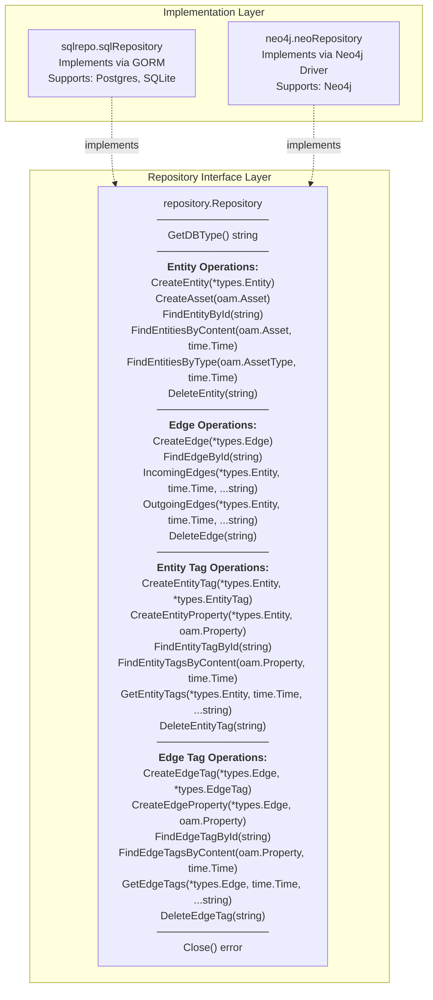
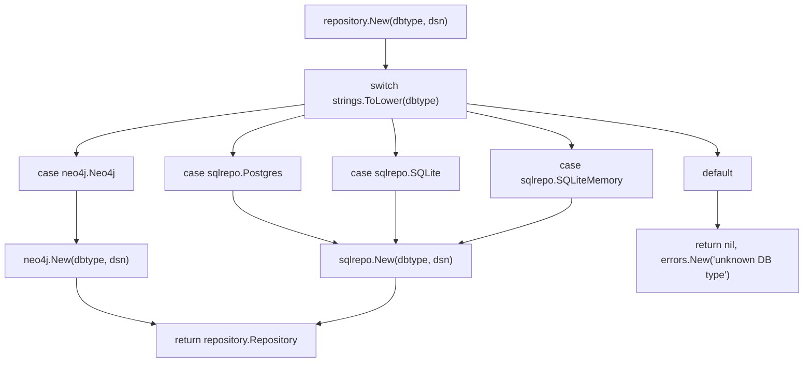
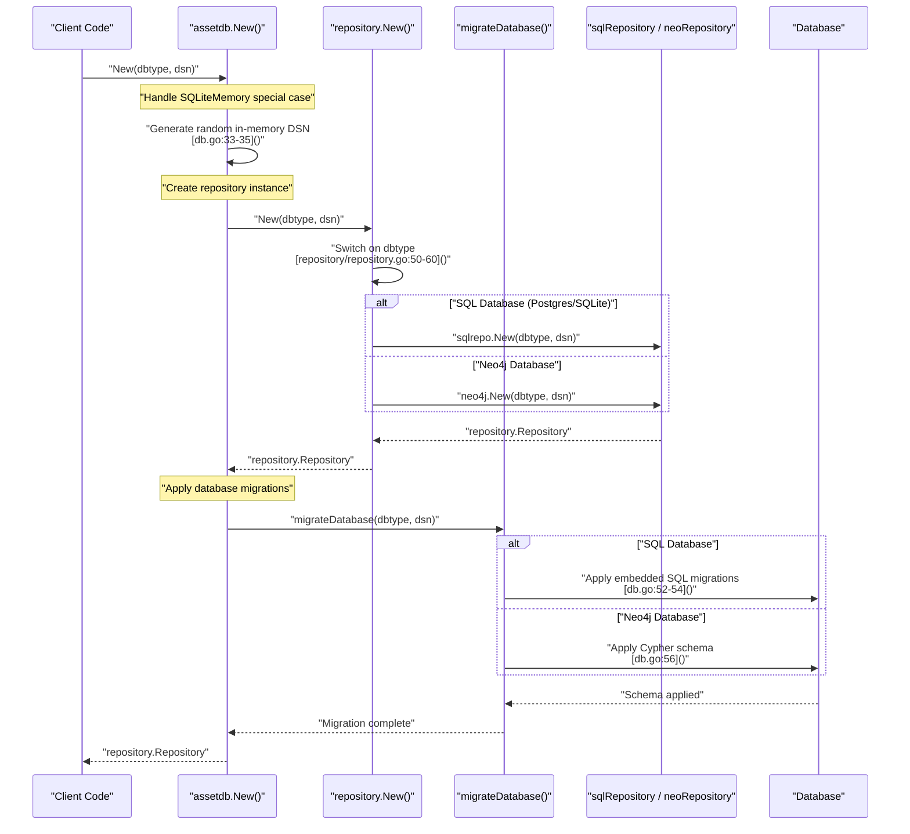
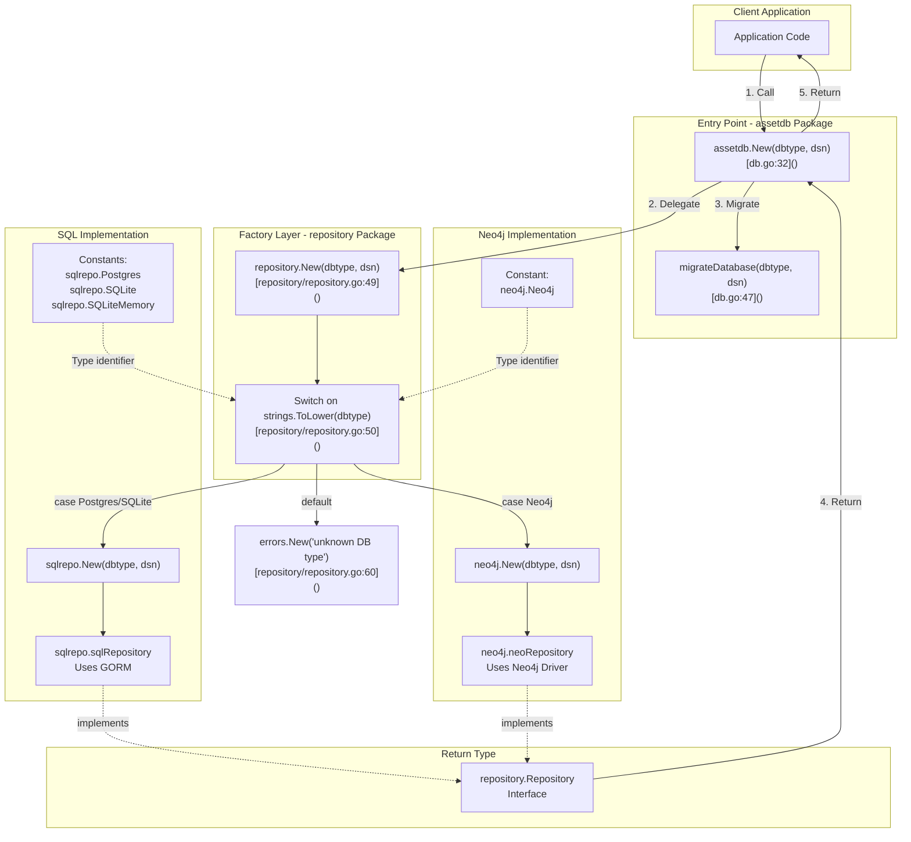

# Repository Pattern

# Repository Pattern

<details>
<summary>Relevant source files</summary>

The following files were used as context for generating this wiki page:

- [db.go](db.go)
- [repository/repository.go](repository/repository.go)

</details>


## Purpose and Scope

This page documents the Repository Pattern implementation that provides the core abstraction layer for database operations in asset-db. The Repository Pattern decouples the application logic from specific database implementations, allowing the system to support multiple database backends (PostgreSQL, SQLite, Neo4j) through a unified interface.

This page focuses on the interface definition and factory pattern mechanics. For implementation-specific details, see [SQL Repository](#4) and [Neo4j Repository](#5). For performance optimization through caching, see [Caching System](#6).

**Sources:** [repository/repository.go:1-62]()

---

## Interface Definition

The `repository.Repository` interface defines the contract that all database implementations must fulfill. Located in [repository/repository.go:18-46](), this interface provides a comprehensive set of operations organized into four functional groups:

### Entity Operations

| Method | Purpose | Return Type |
|--------|---------|-------------|
| `CreateEntity(entity *types.Entity)` | Create a new entity in the database | `*types.Entity, error` |
| `CreateAsset(asset oam.Asset)` | Create an entity from an OAM asset | `*types.Entity, error` |
| `FindEntityById(id string)` | Retrieve an entity by its unique identifier | `*types.Entity, error` |
| `FindEntitiesByContent(asset oam.Asset, since time.Time)` | Find entities matching specific asset content | `[]*types.Entity, error` |
| `FindEntitiesByType(atype oam.AssetType, since time.Time)` | Find all entities of a specific type | `[]*types.Entity, error` |
| `DeleteEntity(id string)` | Remove an entity from the database | `error` |

### Edge Operations

| Method | Purpose | Return Type |
|--------|---------|-------------|
| `CreateEdge(edge *types.Edge)` | Create a new edge (relationship) between entities | `*types.Edge, error` |
| `FindEdgeById(id string)` | Retrieve an edge by its unique identifier | `*types.Edge, error` |
| `IncomingEdges(entity *types.Entity, since time.Time, labels ...string)` | Find all edges pointing to an entity | `[]*types.Edge, error` |
| `OutgoingEdges(entity *types.Entity, since time.Time, labels ...string)` | Find all edges originating from an entity | `[]*types.Edge, error` |
| `DeleteEdge(id string)` | Remove an edge from the database | `error` |

### Tag Operations

Tags provide extensible metadata storage for both entities and edges. The interface supports two categories of tag operations:

**Entity Tags:**

| Method | Purpose | Return Type |
|--------|---------|-------------|
| `CreateEntityTag(entity *types.Entity, tag *types.EntityTag)` | Add a tag to an entity | `*types.EntityTag, error` |
| `CreateEntityProperty(entity *types.Entity, property oam.Property)` | Add an OAM property as a tag | `*types.EntityTag, error` |
| `FindEntityTagById(id string)` | Retrieve an entity tag by ID | `*types.EntityTag, error` |
| `FindEntityTagsByContent(prop oam.Property, since time.Time)` | Find tags matching specific property content | `[]*types.EntityTag, error` |
| `GetEntityTags(entity *types.Entity, since time.Time, names ...string)` | Get all tags for an entity, optionally filtered by name | `[]*types.EntityTag, error` |
| `DeleteEntityTag(id string)` | Remove an entity tag | `error` |

**Edge Tags:**

| Method | Purpose | Return Type |
|--------|---------|-------------|
| `CreateEdgeTag(edge *types.Edge, tag *types.EdgeTag)` | Add a tag to an edge | `*types.EdgeTag, error` |
| `CreateEdgeProperty(edge *types.Edge, property oam.Property)` | Add an OAM property as a tag | `*types.EdgeTag, error` |
| `FindEdgeTagById(id string)` | Retrieve an edge tag by ID | `*types.EdgeTag, error` |
| `FindEdgeTagsByContent(prop oam.Property, since time.Time)` | Find tags matching specific property content | `[]*types.EdgeTag, error` |
| `GetEdgeTags(edge *types.Edge, since time.Time, names ...string)` | Get all tags for an edge, optionally filtered by name | `[]*types.EdgeTag, error` |
| `DeleteEdgeTag(id string)` | Remove an edge tag | `error` |

### Utility Operations

| Method | Purpose | Return Type |
|--------|---------|-------------|
| `GetDBType()` | Return the database type identifier | `string` |
| `Close()` | Close database connections and cleanup resources | `error` |

**Sources:** [repository/repository.go:18-46]()

---

## Repository Interface Structure

The following diagram illustrates the `repository.Repository` interface and its relationship to the concrete implementations:



**Sources:** [repository/repository.go:18-46]()

---

## Factory Pattern Implementation

The system uses the Factory Pattern to instantiate the appropriate repository implementation based on the specified database type. This pattern provides two key benefits:

1. **Decoupling:** Client code depends only on the `repository.Repository` interface, not concrete implementations
2. **Extensibility:** New database backends can be added without modifying client code

### Factory Function

The `repository.New()` factory function [repository/repository.go:48-61]() accepts two parameters:

- `dbtype`: Database type identifier (case-insensitive)
- `dsn`: Data Source Name connection string



### Supported Database Types

The factory recognizes the following database type constants:

| Database Type | Constant | Implementation Function |
|--------------|----------|------------------------|
| Neo4j | `neo4j.Neo4j` | `neo4j.New()` [repository/repository.go:52]() |
| PostgreSQL | `sqlrepo.Postgres` | `sqlrepo.New()` [repository/repository.go:53-58]() |
| SQLite | `sqlrepo.SQLite` | `sqlrepo.New()` [repository/repository.go:55-58]() |
| SQLite In-Memory | `sqlrepo.SQLiteMemory` | `sqlrepo.New()` [repository/repository.go:57-58]() |

The switch statement uses fallthrough behavior for SQL database types [repository/repository.go:54-57](), routing all three SQL variants to `sqlrepo.New()`. The specific SQL dialect is handled internally by the SQL repository implementation.

**Sources:** [repository/repository.go:48-61]()

---

## Initialization Flow

The complete initialization process involves two steps: repository creation and database migration. The `assetdb.New()` function [db.go:30-45]() orchestrates this sequence:



### SQLite In-Memory Handling

For in-memory SQLite databases, `assetdb.New()` generates a unique DSN [db.go:33-35]() to ensure each instance has an isolated memory space:

```
file:mem{randomInt}?mode=memory&cache=shared
```

This prevents conflicts when multiple in-memory instances are created, particularly during testing.

### Migration Integration

The `migrateDatabase()` function [db.go:47-59]() routes to the appropriate migration system:

| Database Type | Migration Function | Migration Source |
|--------------|-------------------|------------------|
| SQLite | `sqlMigrate()` | `sqlitemigrations.Migrations()` [db.go:52]() |
| PostgreSQL | `sqlMigrate()` | `pgmigrations.Migrations()` [db.go:54]() |
| Neo4j | `neoMigrate()` | `neomigrations.InitializeSchema()` [db.go:56]() |

SQL databases use the `sql-migrate` library with embedded migration scripts [db.go:61-83](), while Neo4j uses a custom Cypher-based initialization [db.go:85-119]().

**Sources:** [db.go:30-119]()

---

## Factory Pattern Architecture

This diagram shows the complete factory pattern architecture, including the entry point, factory delegation, and concrete implementations:



**Sources:** [db.go:30-59](), [repository/repository.go:48-61]()

---

## Design Benefits

The Repository Pattern implementation provides several architectural advantages:

### 1. Database Backend Abstraction

Client code interacts exclusively with the `repository.Repository` interface, remaining agnostic to the underlying database technology. This allows applications to switch between SQL and graph databases by changing only the initialization parameters.

### 2. Single Responsibility Principle

Each component has a well-defined responsibility:
- `repository.Repository`: Defines the contract
- `repository.New()`: Creates the appropriate implementation
- `sqlrepo.sqlRepository` / `neo4j.neoRepository`: Implement database-specific logic
- `assetdb.New()`: Orchestrates initialization and migration

### 3. Extensibility

New database backends can be added by:
1. Creating a new package implementing `repository.Repository`
2. Adding a new case to the switch statement in `repository.New()` [repository/repository.go:50-60]()
3. Adding migration logic to `migrateDatabase()` [db.go:47-59]()

No changes are required to existing client code or other implementations.

### 4. Temporal Query Support

All query methods accept a `since time.Time` parameter, enabling temporal queries that filter results based on modification timestamps. This supports incremental synchronization and time-based data analysis patterns.

**Sources:** [repository/repository.go:1-62](), [db.go:1-120]()