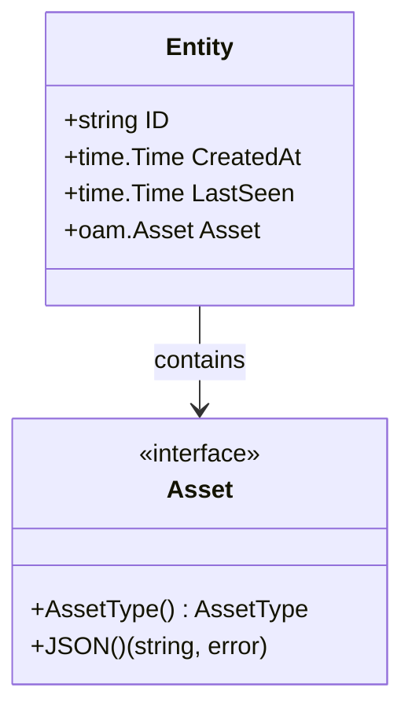
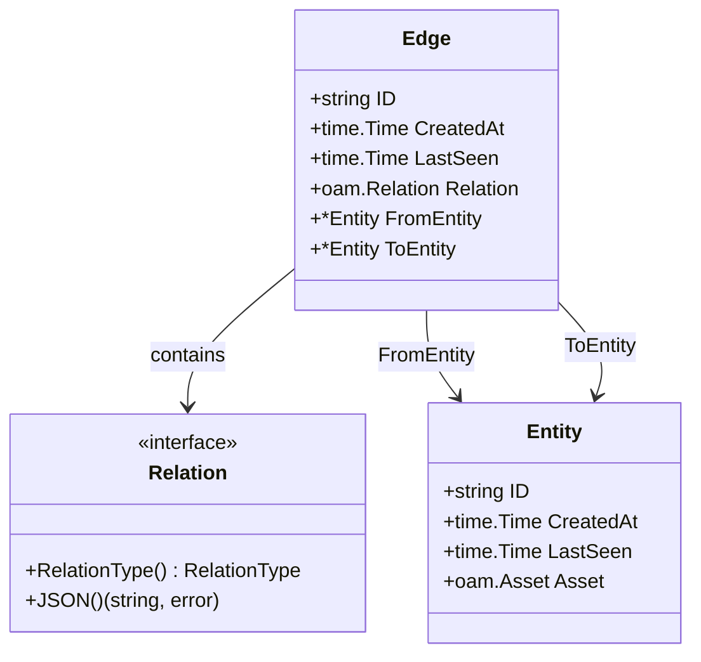
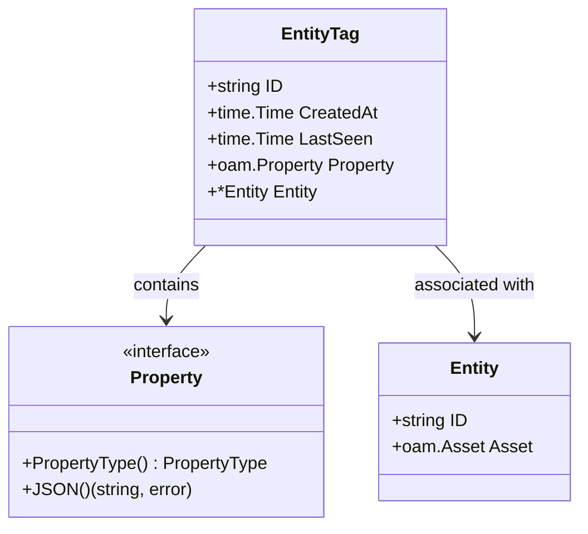
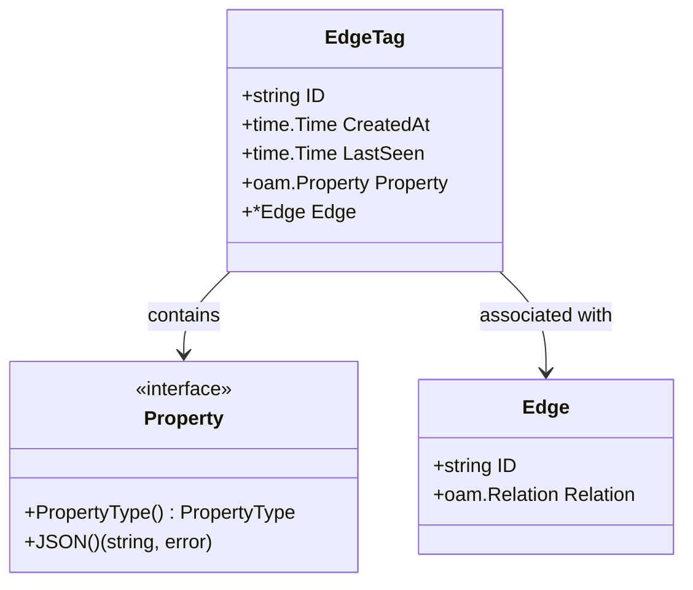
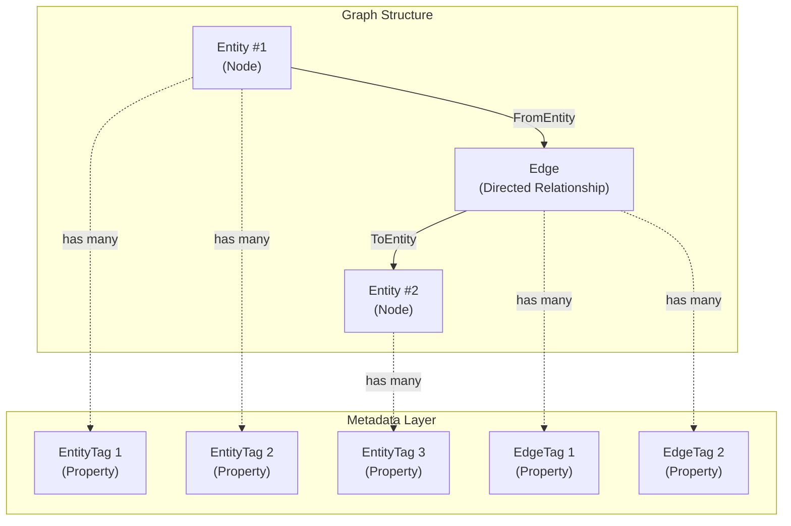
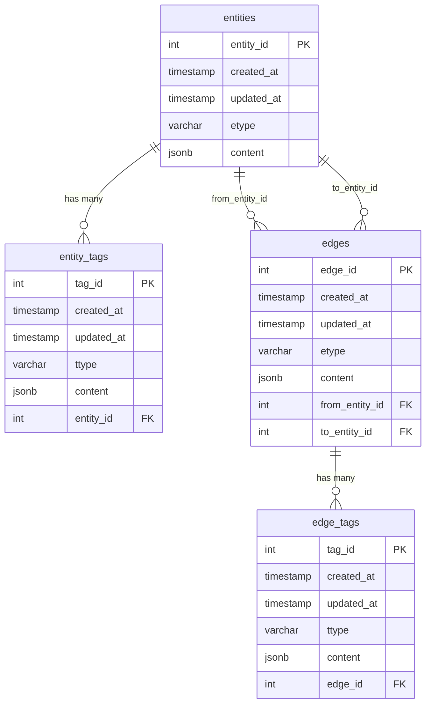
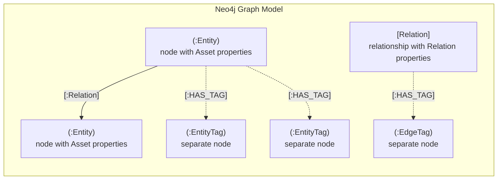
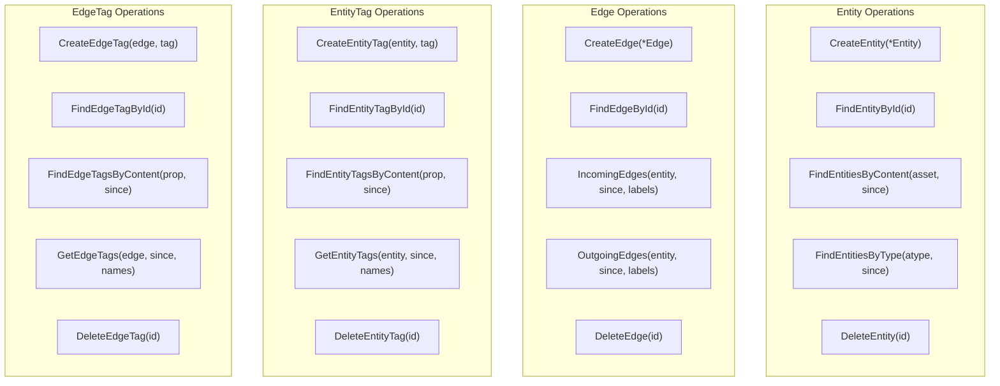
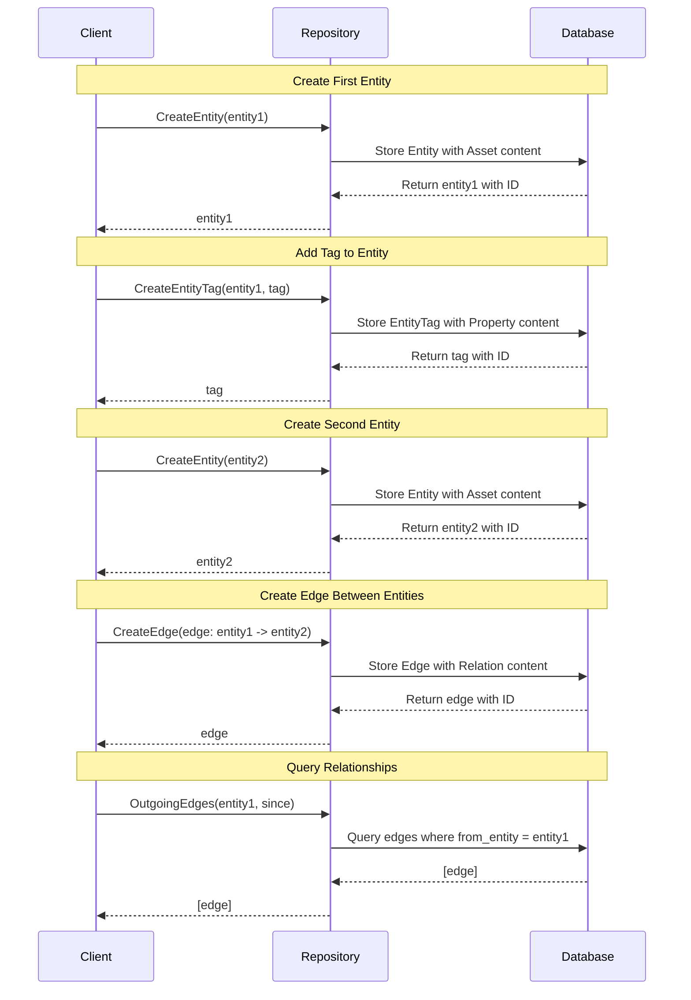

# Data Model

# Data Model

Relevant source files

The following files were used as context for generating this wiki page:

- [migrations/postgres/001_schema_init.sql](migrations/postgres/001_schema_init.sql)
- [migrations/sqlite3/001_schema_init.sql](migrations/sqlite3/001_schema_init.sql)
- [repository/repository.go](repository/repository.go)
- [types/types.go](types/types.go)

This page documents the core data model of asset-db, which implements a property graph structure consisting of four primary types: Entity, Edge, EntityTag, and EdgeTag. These types form the foundation for representing assets and their relationships across all repository implementations.

For details on how these types are used in repository operations, see [Repository Pattern](#3.1). For information about the Open Asset Model types stored within these structures, see [Open Asset Model Integration](#3.3).

---

## Overview

The asset-db data model implements a **labeled property graph** with first-class support for temporal tracking. Assets are represented as entities (nodes), relationships between assets are represented as edges (directed relationships), and both entities and edges can have multiple associated tags (properties/metadata).

All content in entities and edges is defined using the Open Asset Model (OAM), ensuring type safety and standardization across the OWASP Amass ecosystem. Tags provide extensible metadata storage without modifying the core entity or edge structures.

**Sources:** [types/types.go:1-48]()

---

## Core Data Types

### Type Definitions

The following table summarizes the four core types defined in the `types` package:

| Type | Purpose | Key Fields | Content Type |
|------|---------|------------|--------------|
| `Entity` | Represents a node/asset in the graph | `ID`, `CreatedAt`, `LastSeen`, `Asset` | `oam.Asset` |
| `Edge` | Represents a directed relationship between entities | `ID`, `CreatedAt`, `LastSeen`, `Relation`, `FromEntity`, `ToEntity` | `oam.Relation` |
| `EntityTag` | Metadata/properties attached to an entity | `ID`, `CreatedAt`, `LastSeen`, `Property`, `Entity` | `oam.Property` |
| `EdgeTag` | Metadata/properties attached to an edge | `ID`, `CreatedAt`, `LastSeen`, `Property`, `Edge` | `oam.Property` |

**Sources:** [types/types.go:13-47]()

---

### Entity Structure

**Entity Diagram: Structure and Open Asset Model Integration**

The `Entity` type represents a node in the property graph. Each entity has:

- **ID**: Unique identifier (string representation, database-specific)
- **CreatedAt**: Timestamp when the entity was first created
- **LastSeen**: Timestamp when the entity was last observed/updated
- **Asset**: An Open Asset Model asset (FQDN, IPAddress, Organization, etc.)

The `Asset` field contains the actual asset data and must implement the `oam.Asset` interface, which provides type identification and JSON serialization.

**Sources:** [types/types.go:13-19]()

---

### Edge Structure

**Edge Diagram: Directed Relationships Between Entities**

The `Edge` type represents a directed relationship in the property graph. Each edge has:

- **ID**: Unique identifier
- **CreatedAt**: Timestamp when the edge was first created
- **LastSeen**: Timestamp when the edge was last observed/updated
- **Relation**: An Open Asset Model relation (BasicDNSRelation, SimpleRelation, etc.)
- **FromEntity**: Pointer to the source entity
- **ToEntity**: Pointer to the target entity

Edges are always directed from `FromEntity` to `ToEntity`, establishing a clear semantic relationship direction (e.g., "domain points to IP address").

**Sources:** [types/types.go:30-38]()

---

### EntityTag Structure

**EntityTag Diagram: Extensible Metadata for Entities**

The `EntityTag` type attaches metadata to entities. Each entity tag has:

- **ID**: Unique identifier
- **CreatedAt**: Timestamp when the tag was first created
- **LastSeen**: Timestamp when the tag was last observed/updated
- **Property**: An Open Asset Model property (SimpleProperty, DNSRecordProperty, etc.)
- **Entity**: Pointer to the associated entity

Multiple tags can be attached to a single entity, allowing flexible metadata storage without modifying the entity structure.

**Sources:** [types/types.go:21-28]()

---

### EdgeTag Structure

**EdgeTag Diagram: Extensible Metadata for Edges**

The `EdgeTag` type attaches metadata to edges. Each edge tag has:

- **ID**: Unique identifier
- **CreatedAt**: Timestamp when the tag was first created
- **LastSeen**: Timestamp when the tag was last observed/updated
- **Property**: An Open Asset Model property
- **Edge**: Pointer to the associated edge

Multiple tags can be attached to a single edge, enabling relationship metadata such as confidence scores, data sources, or additional context.

**Sources:** [types/types.go:40-47]()

---

## Graph Relationships

The following diagram illustrates how the four core types relate to form a complete property graph:

**Complete Property Graph Model: Entities, Edges, and Tags**

This diagram shows:
- **Entities** are nodes that can be connected by edges
- **Edges** are directed relationships from one entity to another
- **EntityTags** provide many-to-one metadata relationships with entities
- **EdgeTags** provide many-to-one metadata relationships with edges

**Sources:** [types/types.go:1-48]()

---

## Temporal Tracking

All four core types include temporal tracking fields that enable time-based queries and data lifecycle management:

| Field | Type | Purpose |
|-------|------|---------|
| `CreatedAt` | `time.Time` | Records when the entity/edge/tag was first created in the database |
| `LastSeen` | `time.Time` | Records when the entity/edge/tag was last observed or updated |

These timestamps enable:
- **Historical queries**: Find entities/edges/tags created or updated within a time range
- **Data freshness**: Determine how recently data was observed
- **Cache invalidation**: Track when cached data becomes stale (see [Cache Architecture](#6.1))

The repository interface methods often accept a `since time.Time` parameter to filter results based on `LastSeen` timestamps.

**Sources:** [types/types.go:14-47](), [repository/repository.go:25-43]()

---

## Database Schema Mappings

The core data types map to database schemas differently depending on the backend.

### SQL Schema (PostgreSQL and SQLite)

The SQL schema consists of four tables that directly correspond to the four core types:

**SQL Schema: Entity-Relationship Diagram**

#### Field Mappings

| Go Type Field | SQL Column | Notes |
|---------------|------------|-------|
| `Entity.ID` | `entities.entity_id` | Auto-generated integer primary key |
| `Entity.CreatedAt` | `entities.created_at` | Default: `CURRENT_TIMESTAMP` |
| `Entity.LastSeen` | `entities.updated_at` | Updated on each modification |
| `Entity.Asset` | `entities.etype` + `entities.content` | Type stored as string, content as JSONB (PostgreSQL) or TEXT (SQLite) |
| `Edge.FromEntity` | `edges.from_entity_id` | Foreign key to `entities.entity_id` |
| `Edge.ToEntity` | `edges.to_entity_id` | Foreign key to `entities.entity_id` |
| `EntityTag.Entity` | `entity_tags.entity_id` | Foreign key with CASCADE delete |
| `EdgeTag.Edge` | `edge_tags.edge_id` | Foreign key with CASCADE delete |

#### Key Schema Features

**Indexes for Performance:**
- All tables have indexes on `updated_at` for temporal queries
- Entity and edge type fields (`etype`) are indexed for type-based filtering
- Foreign key columns are indexed for join performance

**Cascading Deletes:**
- Deleting an entity automatically deletes all its entity tags
- Deleting an entity automatically deletes all edges connected to it
- Deleting an edge automatically deletes all its edge tags

**JSON Storage:**
- PostgreSQL uses native `JSONB` type for `content` fields
- SQLite uses `TEXT` type with JSON serialization

**Sources:** [migrations/postgres/001_schema_init.sql:1-90](), [migrations/sqlite3/001_schema_init.sql:1-85]()

---

### Neo4j Schema

In Neo4j, the data model maps to native graph concepts:

**Neo4j Graph Model: Nodes and Relationships**

#### Neo4j Mapping

| Go Type | Neo4j Concept | Label/Type | Properties |
|---------|---------------|------------|------------|
| `Entity` | Node | `:Entity` | `id`, `created_at`, `last_seen`, `asset_type`, plus all Asset fields |
| `Edge` | Relationship | Dynamic (based on `Relation.Type()`) | `id`, `created_at`, `last_seen`, plus all Relation fields |
| `EntityTag` | Node | `:EntityTag` | `id`, `created_at`, `last_seen`, `property_type`, plus all Property fields |
| `EdgeTag` | Node | `:EdgeTag` | `id`, `created_at`, `last_seen`, `property_type`, plus all Property fields |

#### Neo4j Schema Features

- **Entity nodes** are labeled `:Entity` and have properties flattened from the contained `oam.Asset`
- **Edges** are native Neo4j relationships with dynamic types based on `oam.Relation.Type()`
- **Tags** are separate nodes connected with `:HAS_TAG` relationships
- **Constraints** ensure uniqueness on `id` fields for all node types
- **Indexes** on `last_seen` and type fields for performance

The Neo4j schema is initialized with constraints and indexes. For details, see [Neo4j Schema and Constraints](#5.4).

**Sources:** [types/types.go:1-48]()

---

## Type System Integration

All content fields in the core types use Open Asset Model interfaces:

| Core Type | Content Field | OAM Interface | Examples |
|-----------|--------------|---------------|----------|
| `Entity` | `Asset` | `oam.Asset` | `FQDN`, `IPAddress`, `Organization`, `AutonomousSystem` |
| `Edge` | `Relation` | `oam.Relation` | `BasicDNSRelation`, `SimpleRelation`, `OwnershipRelation` |
| `EntityTag` | `Property` | `oam.Property` | `SimpleProperty`, `DNSRecordProperty`, `GeoLocationProperty` |
| `EdgeTag` | `Property` | `oam.Property` | `SimpleProperty`, `ConfidenceProperty`, `SourceProperty` |

Each OAM interface provides:
- **Type identification**: Methods to determine the specific asset/relation/property type
- **JSON serialization**: Standardized serialization for database storage
- **Type safety**: Compile-time guarantees about data structure

For comprehensive documentation of OAM types and their usage, see [Open Asset Model Integration](#3.3).

**Sources:** [types/types.go:10-47](), [repository/repository.go:15]()

---

## Repository Interface Operations

The `Repository` interface provides methods for creating, retrieving, and deleting all four core types:

**Repository Operations: CRUD Methods for Core Types**

Each type has:
- **Creation**: Methods to create new instances
- **Retrieval by ID**: Methods to find by unique identifier
- **Content-based search**: Methods to find by OAM content matching
- **Associated queries**: Methods to find tags for entities/edges, or edges for entities
- **Deletion**: Methods to remove instances

For complete method signatures and usage details, see [Repository Interface](#10.1).

**Sources:** [repository/repository.go:18-46]()

---

## Data Flow Example

The following diagram shows how the core types are used in a typical operation to create an entity with tags and connect it to another entity:

**Data Flow: Creating and Querying a Property Graph**

This sequence shows:
1. Entities are created with their `oam.Asset` content
2. Tags are attached to entities using `CreateEntityTag`
3. Edges establish directed relationships between entities
4. Queries can traverse the graph using `OutgoingEdges` and `IncomingEdges`

**Sources:** [repository/repository.go:22-31](), [types/types.go:1-48]()