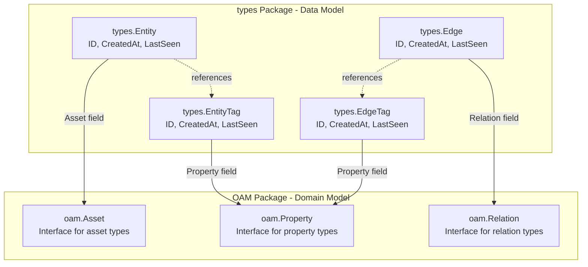
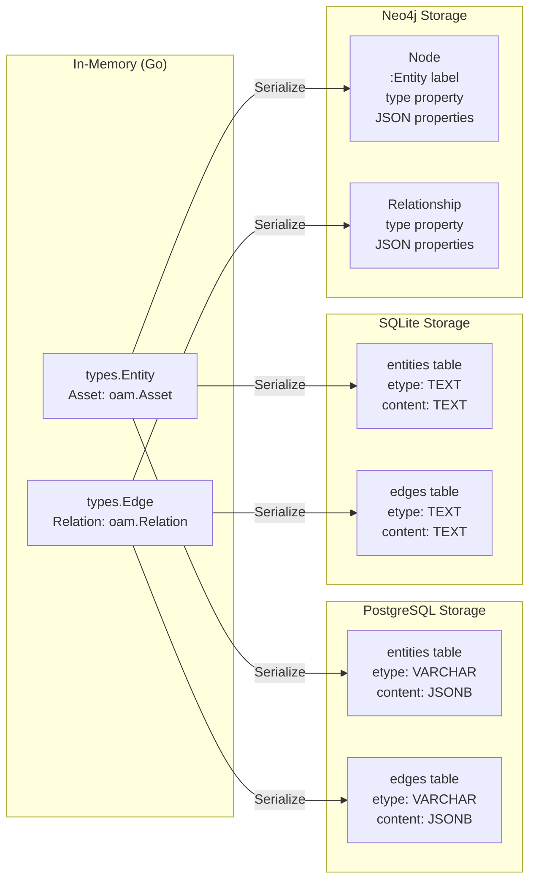
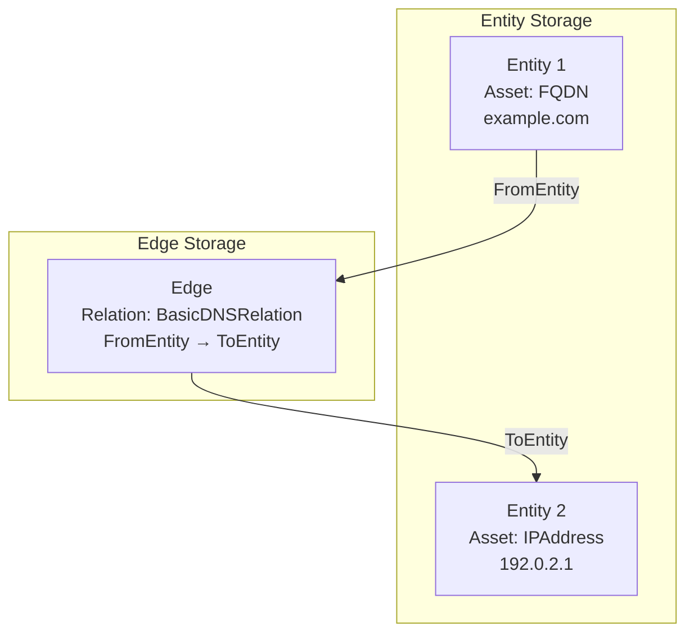
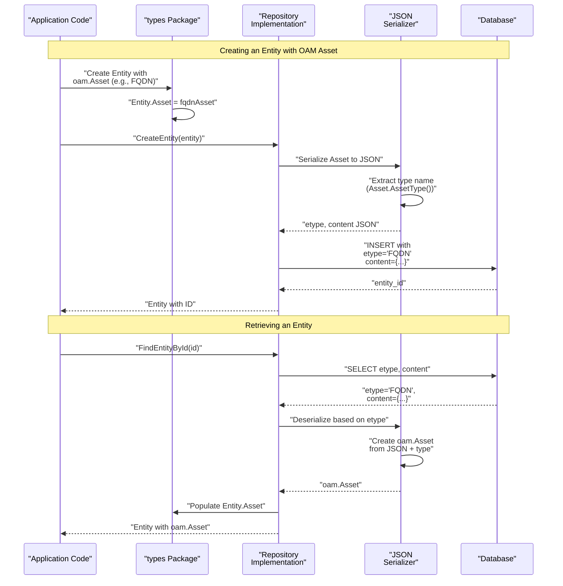

# Open Asset Model Integration

# Open Asset Model Integration

<details>
<summary>Relevant source files</summary>

The following files were used as context for generating this wiki page:

- [go.mod](go.mod)
- [go.sum](go.sum)
- [migrations/postgres/001_schema_init.sql](migrations/postgres/001_schema_init.sql)
- [migrations/sqlite3/001_schema_init.sql](migrations/sqlite3/001_schema_init.sql)
- [types/types.go](types/types.go)

</details>


## Purpose and Scope

This page describes how the asset-db system integrates with the Open Asset Model (OAM) for standardized asset, property, and relationship definitions. It covers the OAM type system, how OAM types are embedded in the core data structures, and how they are serialized for database storage. For details on the core data structures themselves, see [Data Model](#3.2). For implementation-specific storage details, see [SQL Repository](#4) and [Neo4j Repository](#5).

---

## What is the Open Asset Model

The Open Asset Model (OAM) is a standardized schema for representing assets and their relationships in the OWASP Amass ecosystem. It provides a common vocabulary and type system that enables interoperability between different tools and databases.

The asset-db system uses OAM version `v0.13.6` as specified in [go.mod:10]():

```
github.com/owasp-amass/open-asset-model v0.13.6
```

OAM defines three primary type categories:

| OAM Type | Purpose | Used In |
|----------|---------|---------|
| `oam.Asset` | Represents network assets (domains, IPs, organizations, etc.) | `types.Entity` |
| `oam.Property` | Represents metadata and properties of assets or relationships | `types.EntityTag`, `types.EdgeTag` |
| `oam.Relation` | Represents relationships between assets | `types.Edge` |

**Sources:** [go.mod:10](), [types/types.go:10]()

---

## Core Type Embedding

The asset-db type system directly embeds OAM types within its core data structures, creating a clean separation between the data model (entity, edge, tag) and the domain model (asset, property, relation).

### Type Structure Mapping



Each core type embeds exactly one OAM type as defined in [types/types.go:1-48]():

- `Entity.Asset` (line 18): Stores the actual asset information
- `EntityTag.Property` (line 26): Stores metadata about an entity
- `Edge.Relation` (line 35): Defines the relationship type between entities
- `EdgeTag.Property` (line 45): Stores metadata about an edge

**Sources:** [types/types.go:1-48]()

---

## Serialization and Storage Strategy

OAM types are serialized to JSON for database storage. The database schema uses two fields to represent each OAM-typed object:

| Database Field | Purpose | Example Values |
|----------------|---------|----------------|
| `etype` / `ttype` | Stores the OAM type name as a string | `"FQDN"`, `"IPAddress"`, `"BasicDNSRelation"` |
| `content` | Stores the serialized OAM object | JSON representation of the asset/property/relation |

### Storage Format by Database



#### PostgreSQL Schema

In PostgreSQL, OAM content is stored as native JSONB for efficient querying [migrations/postgres/001_schema_init.sql:3-9]():

```sql
CREATE TABLE IF NOT EXISTS entities(
    entity_id INT GENERATED ALWAYS AS IDENTITY,
    ...
    etype VARCHAR(255),
    content JSONB,
    PRIMARY KEY(entity_id)
);
```

#### SQLite Schema

In SQLite, OAM content is stored as TEXT (JSON string) [migrations/sqlite3/001_schema_init.sql:6-12]():

```sql
CREATE TABLE IF NOT EXISTS entities(
    entity_id INTEGER PRIMARY KEY,
    ...
    etype TEXT,
    content TEXT
);
```

The `etype` field is indexed in both databases [migrations/postgres/001_schema_init.sql:13](), [migrations/sqlite3/001_schema_init.sql:15]() to enable efficient queries by asset type.

**Sources:** [migrations/postgres/001_schema_init.sql:1-90](), [migrations/sqlite3/001_schema_init.sql:1-85]()

---

## OAM Asset Types

Assets represent the nodes in the graph - the actual network entities being tracked. Common OAM asset types include:

| Asset Type | Description | Example Content |
|------------|-------------|-----------------|
| `FQDN` | Fully Qualified Domain Name | `{"name": "example.com"}` |
| `IPAddress` | IPv4 or IPv6 address | `{"address": "192.0.2.1", "type": "IPv4"}` |
| `Netblock` | CIDR network range | `{"cidr": "192.0.2.0/24"}` |
| `AutonomousSystem` | AS Number | `{"number": 64512}` |
| `Organization` | Entity or company | `{"name": "Example Corp"}` |
| `Location` | Geographic location | `{"address": "123 Main St"}` |
| `ContactRecord` | Contact information | `{"email": "admin@example.com"}` |
| `EmailAddress` | Email address | `{"address": "user@example.com"}` |
| `Phone` | Phone number | `{"number": "+1-555-0123"}` |
| `URL` | Web resource locator | `{"url": "https://example.com/path"}` |

These asset types are defined in the OAM package and stored in the `Entity.Asset` field [types/types.go:18](). The `etype` database field contains the string name of the asset type for efficient filtering and querying.

**Sources:** [types/types.go:14-19](), [migrations/postgres/001_schema_init.sql:7]()

---

## OAM Property Types

Properties represent metadata that can be attached to entities or edges. They are stored in `EntityTag` and `EdgeTag` structures. Common OAM property types include:

| Property Type | Used For | Example Content |
|---------------|----------|-----------------|
| `SimpleProperty` | Generic key-value metadata | `{"key": "source", "value": "recon"}` |
| `DNSRecordProperty` | DNS record information | `{"type": "A", "value": "192.0.2.1"}` |
| `TLSCertificateProperty` | Certificate details | `{"subject": "CN=example.com"}` |
| `PortProperty` | Open port information | `{"port": 443, "protocol": "tcp"}` |
| `ServiceProperty` | Running service details | `{"name": "https", "version": "1.1"}` |
| `VulnerabilityProperty` | Security vulnerability | `{"cve": "CVE-2021-1234"}` |

Properties are stored in the `Property` field of both `EntityTag` [types/types.go:26]() and `EdgeTag` [types/types.go:45]() structures, with the property type name stored in the `ttype` database field.

**Example Usage:**

An entity representing a domain might have multiple tags:
- A `DNSRecordProperty` tag containing its A record
- A `TLSCertificateProperty` tag with certificate information
- Multiple `SimpleProperty` tags for additional metadata

**Sources:** [types/types.go:21-28](), [types/types.go:40-47](), [migrations/postgres/001_schema_init.sql:15-27]()

---

## OAM Relation Types

Relations define the typed edges between entities in the graph. They specify the semantic meaning of relationships. Common OAM relation types include:

| Relation Type | Description | From Asset → To Asset |
|---------------|-------------|----------------------|
| `BasicDNSRelation` | DNS resolution | `FQDN` → `IPAddress` |
| `SimpleRelation` | Generic relationship | Any → Any |
| `ASNToIPRelation` | AS ownership | `AutonomousSystem` → `Netblock` |
| `IPToNetblockRelation` | IP membership | `IPAddress` → `Netblock` |
| `FQDNToFQDNRelation` | Domain hierarchy | `FQDN` → `FQDN` |
| `ContactToOrgRelation` | Organization membership | `ContactRecord` → `Organization` |
| `WhoisRelation` | WHOIS registration | `FQDN` → `Organization` |
| `SSLCertRelation` | Certificate binding | `FQDN` → `TLSCertificateProperty` |

Relations are stored in the `Edge.Relation` field [types/types.go:35]() and define directed relationships from `FromEntity` to `ToEntity`.

### Relation Storage Schema



The database enforces referential integrity through foreign keys [migrations/postgres/001_schema_init.sql:41-48]():

```sql
CONSTRAINT fk_edges_entities_from
    FOREIGN KEY(from_entity_id)
        REFERENCES entities(entity_id)
        ON DELETE CASCADE,
CONSTRAINT fk_edges_entities_to
    FOREIGN KEY(to_entity_id)
        REFERENCES entities(entity_id)
        ON DELETE CASCADE
```

**Sources:** [types/types.go:30-38](), [migrations/postgres/001_schema_init.sql:32-49](), [migrations/sqlite3/001_schema_init.sql:32-46]()

---

## Type System Benefits

The integration of OAM provides several key benefits:

### Standardization Across OWASP Amass Ecosystem

All tools in the OWASP Amass ecosystem use the same OAM definitions, ensuring:
- Consistent asset representation across different tools
- Interoperable data exchange between components
- Unified querying and analysis capabilities

### Type Safety and Validation

By using OAM's typed interfaces:
- Asset types are validated at the OAM level
- Relationships can be constrained to valid asset type pairs
- Properties are strongly typed rather than arbitrary key-value pairs

### Extensibility

New asset types, properties, and relations can be added to OAM without changing the asset-db schema:
- The `etype`/`ttype` fields accommodate any OAM type name
- The `content` fields store arbitrary JSON structure
- Repositories handle serialization/deserialization transparently

### Database-Agnostic Domain Model

The OAM integration allows the same domain model to work across different database backends:
- PostgreSQL uses native JSONB for efficient querying
- SQLite uses TEXT storage for portability
- Neo4j stores OAM data as node/relationship properties
- All repositories expose the same `oam.Asset`, `oam.Property`, and `oam.Relation` interfaces

**Sources:** [types/types.go:1-48](), [go.mod:10](), [migrations/postgres/001_schema_init.sql:8](), [migrations/sqlite3/001_schema_init.sql:11]()

---

## Content Serialization Flow

The following diagram illustrates how OAM objects flow from creation through serialization to database storage and back:



This flow is implemented differently in each repository but maintains the same contract:
- SQL repositories use GORM with JSON serialization
- Neo4j repositories use custom Cypher queries with property mapping

**Sources:** [types/types.go:14-19](), [migrations/postgres/001_schema_init.sql:3-10]()

---

## Summary

The Open Asset Model integration provides a standardized, type-safe foundation for representing network assets in the asset-db system:

- **Three OAM Types**: `Asset`, `Property`, and `Relation` are embedded in `Entity`, `EntityTag`/`EdgeTag`, and `Edge` respectively
- **Database Storage**: Type names stored in `etype`/`ttype` fields, content serialized to JSON in `content` fields
- **Cross-Database Compatibility**: Same OAM types work across PostgreSQL (JSONB), SQLite (TEXT), and Neo4j (properties)
- **Ecosystem Integration**: Ensures interoperability with other OWASP Amass tools through shared type definitions

For details on how specific repositories handle OAM serialization and queries, see [SQL Entity Operations](#4.1) and [Neo4j Entity Operations](#5.1).

**Sources:** [types/types.go:1-48](), [go.mod:10](), [go.sum:55-56](), [migrations/postgres/001_schema_init.sql:1-90](), [migrations/sqlite3/001_schema_init.sql:1-85]()