# Architecture

# Architecture

Relevant source files

The following files were used as context for generating this wiki page:

- [go.mod](go.mod)
- [go.sum](go.sum)
- [migrations/postgres/001_schema_init.sql](migrations/postgres/001_schema_init.sql)
- [migrations/sqlite3/001_schema_init.sql](migrations/sqlite3/001_schema_init.sql)
- [repository/repository.go](repository/repository.go)
- [types/types.go](types/types.go)

This document provides an overview of the asset-db system architecture, including its layered design, core design patterns, and component relationships. It explains how the system abstracts database operations through the Repository pattern, supports multiple database backends, and provides optional caching capabilities.

For detailed information about the Repository pattern implementation, see [Repository Pattern](#3.1). For the complete data model specification, see [Data Model](#3.2). For integration with the Open Asset Model, see [Open Asset Model Integration](#3.3).

---

## Architectural Overview

The asset-db system follows a layered architecture that separates concerns through well-defined abstractions. The system is designed to provide a unified interface for asset management while supporting multiple database backends (PostgreSQL, SQLite, and Neo4j).

### Layered Architecture

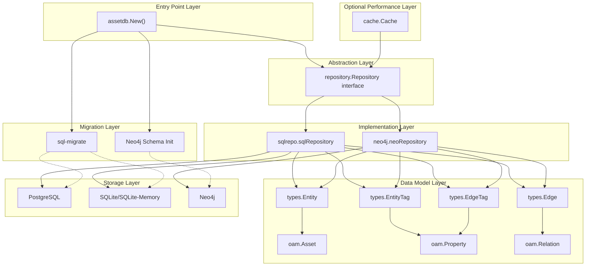

**Sources**: [repository/repository.go](), [types/types.go](), [go.mod:1-48]()

---

## Design Patterns

### Factory Pattern

The system uses the Factory pattern to create appropriate repository implementations based on the database type. The `assetdb.New()` function serves as the main entry point, while `repository.New()` acts as the repository factory.

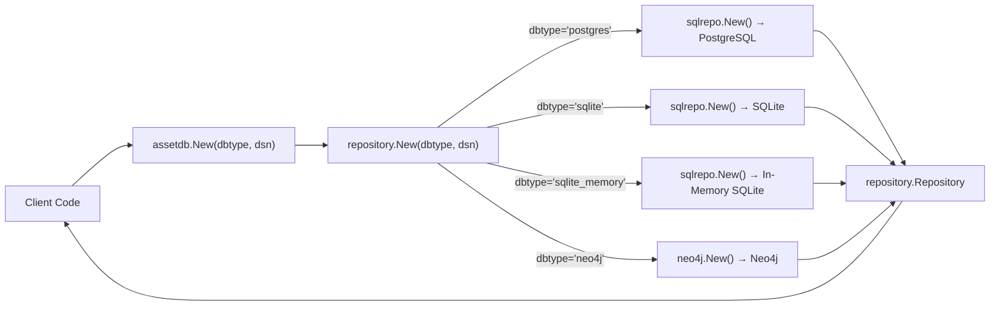

The factory implementation uses a simple switch statement to instantiate the correct repository:

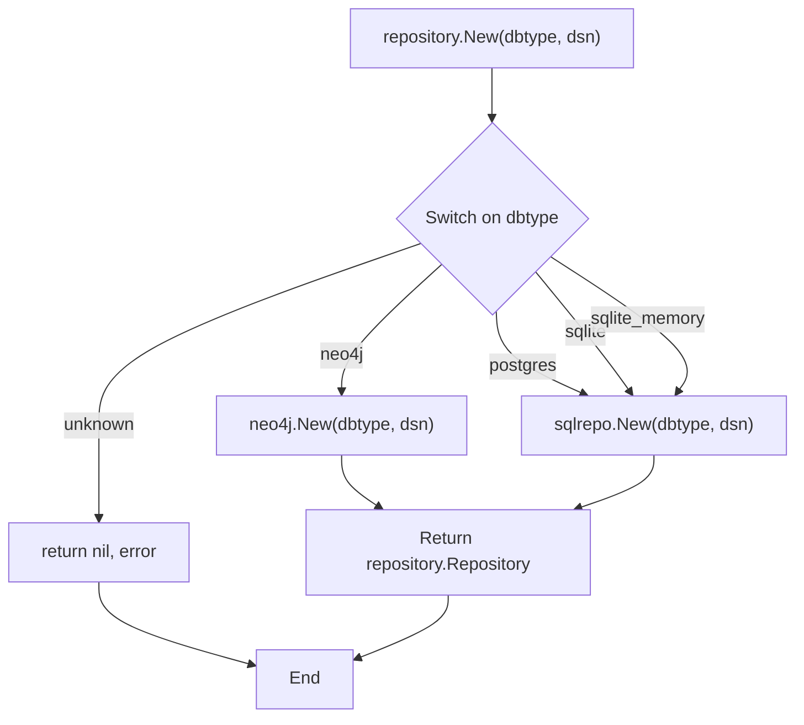

**Sources**: [repository/repository.go:48-61]()

### Repository Pattern

The Repository pattern provides a clean abstraction over data access operations. The `repository.Repository` interface defines all operations for managing entities, edges, and tags, allowing implementations to provide database-specific logic while maintaining a consistent API.

| Interface Method | Purpose |
|-----------------|---------|
| `CreateEntity()` | Create a new entity node |
| `FindEntityById()` | Retrieve entity by ID |
| `FindEntitiesByContent()` | Query entities by asset content |
| `FindEntitiesByType()` | Query entities by asset type |
| `DeleteEntity()` | Remove an entity |
| `CreateEdge()` | Create a relationship between entities |
| `IncomingEdges()` | Find edges pointing to an entity |
| `OutgoingEdges()` | Find edges originating from an entity |
| `DeleteEdge()` | Remove an edge |
| `CreateEntityTag()` | Add metadata to an entity |
| `GetEntityTags()` | Retrieve entity metadata |
| `CreateEdgeTag()` | Add metadata to an edge |
| `GetEdgeTags()` | Retrieve edge metadata |

**Sources**: [repository/repository.go:18-46]()

### Decorator Pattern (Caching)

The caching system uses the Decorator pattern to wrap any `repository.Repository` implementation with a caching layer. This allows performance optimization to be added transparently without modifying the core repository implementations.

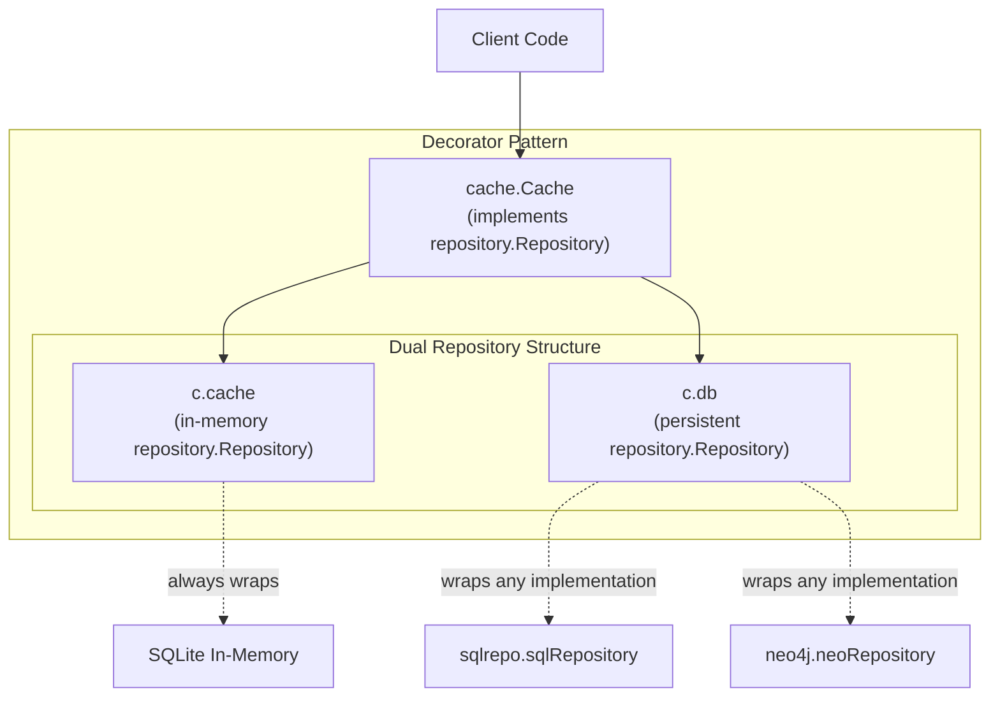

**Sources**: [cache/cache.go](), [repository/repository.go:18-46]()

---

## Component Relationships

### Repository Interface and Implementations

The `repository.Repository` interface serves as the central abstraction point. Two concrete implementations exist:

#### SQL Repository (`sqlrepo`)

Implements the repository interface using GORM ORM for SQL databases:

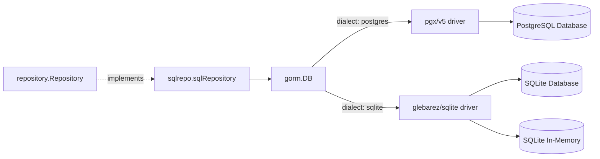

The SQL repository serializes OAM types (Asset, Property, Relation) as JSON/JSONB in the `content` columns.

#### Neo4j Repository (`neo4j`)

Implements the repository interface using the Neo4j Go driver for native graph database operations:

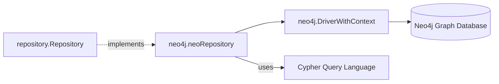

The Neo4j repository stores entities as nodes, edges as relationships, and tags as properties on nodes/relationships.

**Sources**: [repository/repository.go:48-61](), [go.mod:5-16]()

---

## Database Abstraction Strategy

The system abstracts database differences through three key mechanisms:

### 1. Unified Data Model

All repository implementations work with the same data types defined in the `types` package:

| Type | File Location | Purpose |
|------|--------------|---------|
| `types.Entity` | [types/types.go:14-19]() | Represents a graph node/asset |
| `types.Edge` | [types/types.go:31-38]() | Represents a directed relationship |
| `types.EntityTag` | [types/types.go:22-28]() | Metadata attached to entities |
| `types.EdgeTag` | [types/types.go:41-47]() | Metadata attached to edges |

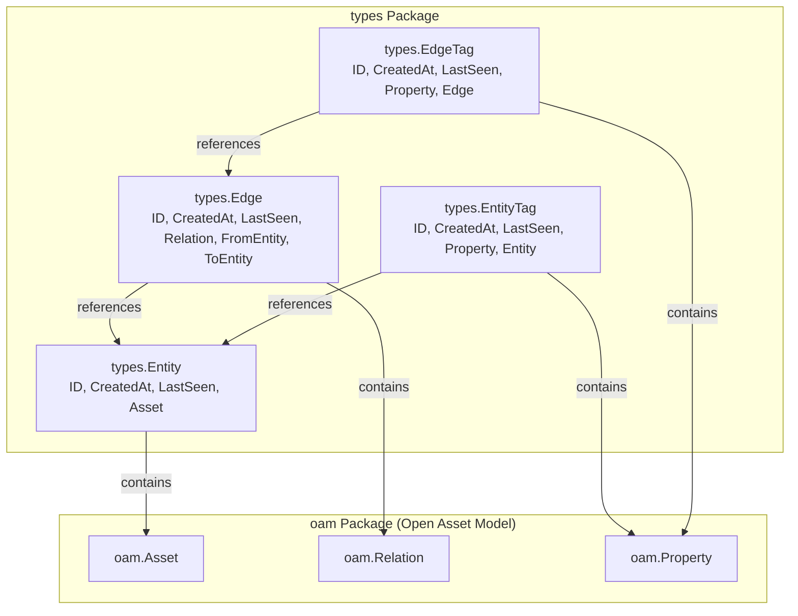

**Sources**: [types/types.go:1-48]()

### 2. Storage Format Abstraction

Different databases store the same data using their native capabilities:

| Database | Entity Storage | Edge Storage | Tag Storage |
|----------|---------------|--------------|-------------|
| PostgreSQL | Table row with JSONB `content` column | Table row with foreign keys | Table row with JSONB `content` column |
| SQLite | Table row with TEXT `content` column (JSON string) | Table row with foreign keys | Table row with TEXT `content` column (JSON string) |
| Neo4j | Node with properties | Relationship between nodes | Properties on nodes/relationships |

**Sources**: [migrations/postgres/001_schema_init.sql:1-90](), [migrations/sqlite3/001_schema_init.sql:1-85]()

### 3. Query Interface Abstraction

The repository interface methods provide database-agnostic query operations:

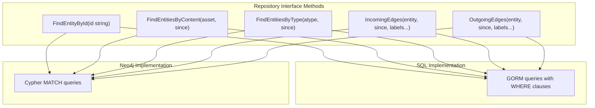

**Sources**: [repository/repository.go:18-46]()

---

## Schema Management

### SQL Schema Migrations

SQL databases (PostgreSQL and SQLite) use the `sql-migrate` library with embedded SQL scripts for schema versioning:

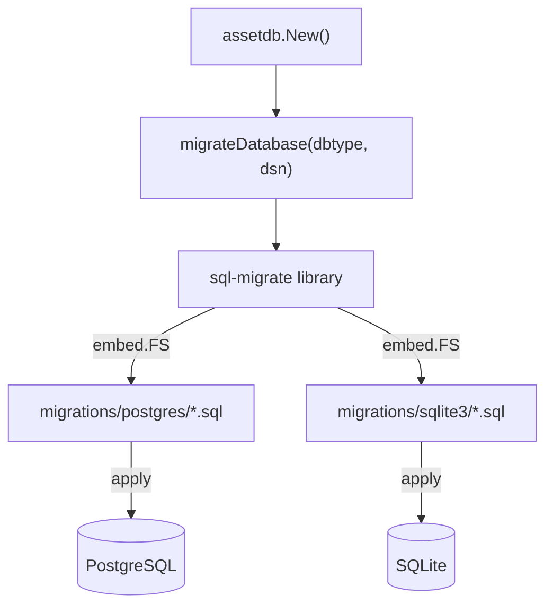

**SQL Schema Structure**:

The schema defines four core tables with foreign key relationships:

| Table | Purpose | Key Columns |
|-------|---------|-------------|
| `entities` | Store asset nodes | `entity_id`, `etype`, `content`, `created_at`, `updated_at` |
| `entity_tags` | Store entity metadata | `tag_id`, `ttype`, `content`, `entity_id` (FK) |
| `edges` | Store relationships | `edge_id`, `etype`, `content`, `from_entity_id` (FK), `to_entity_id` (FK) |
| `edge_tags` | Store edge metadata | `tag_id`, `ttype`, `content`, `edge_id` (FK) |

All tables include indexes on `updated_at` for temporal queries, and foreign key columns for relationship traversal.

**Sources**: [migrations/postgres/001_schema_init.sql:1-90](), [migrations/sqlite3/001_schema_init.sql:1-85]()

### Neo4j Schema Initialization

Neo4j uses constraints and indexes rather than explicit schema definitions. These are created during initialization:

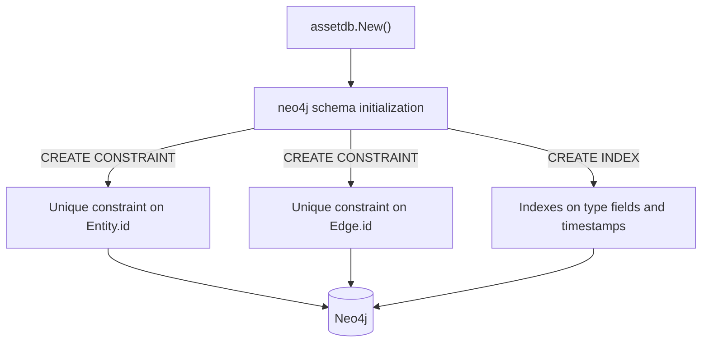

**Sources**: [repository/neo4j]() directory

---

## System Initialization Flow

The complete initialization sequence demonstrates how database migrations and repository creation work together:

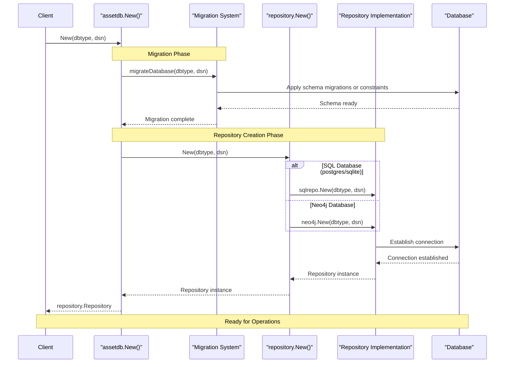

**Sources**: [repository/repository.go:48-61]()

---

## Module Dependencies

The system's module dependencies are organized to support multiple database backends and the Open Asset Model:

### Core Dependencies

| Module | Version | Purpose |
|--------|---------|---------|
| `github.com/owasp-amass/open-asset-model` | v0.13.6 | Asset type definitions (Asset, Property, Relation) |
| `gorm.io/gorm` | v1.25.12 | ORM layer for SQL operations |
| `github.com/neo4j/neo4j-go-driver/v5` | v5.27.0 | Neo4j database driver |
| `github.com/rubenv/sql-migrate` | v1.7.1 | SQL schema migration tool |
| `github.com/google/uuid` | v1.6.0 | UUID generation for entity IDs |

### Database Drivers

| Module | Purpose |
|--------|---------|
| `gorm.io/driver/postgres` v1.5.11 | PostgreSQL driver using pgx/v5 |
| `github.com/glebarez/sqlite` v1.11.0 | Pure Go SQLite driver |
| `github.com/jackc/pgx/v5` v5.7.2 | PostgreSQL wire protocol implementation |

### Utility Dependencies

| Module | Purpose |
|--------|---------|
| `github.com/caffix/stringset` v0.2.0 | Set operations for string collections |
| `gorm.io/datatypes` v1.2.5 | GORM data type support for JSON fields |

**Sources**: [go.mod:1-48](), [go.sum:1-130]()

---

## Caching Architecture Overview

The optional caching layer provides a performance optimization mechanism that can wrap any repository implementation:

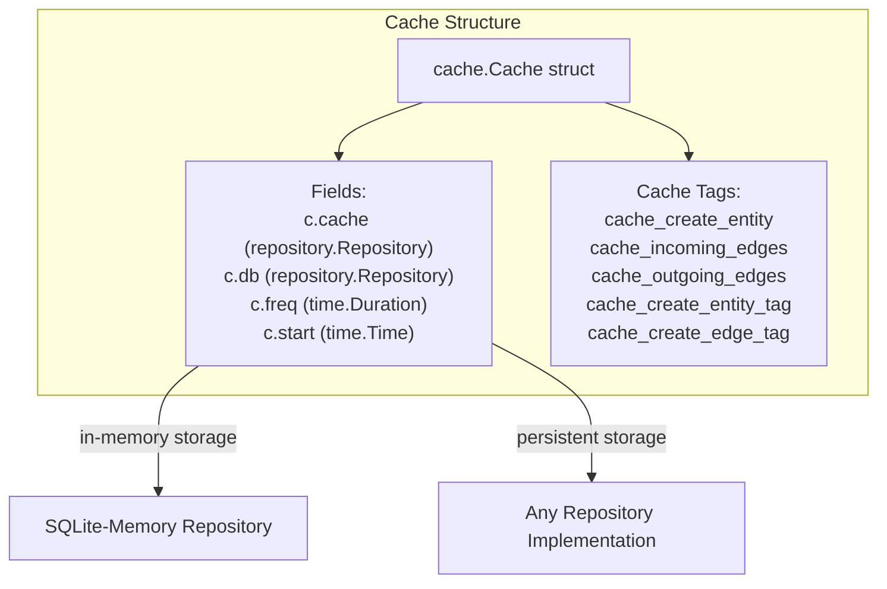

The cache uses a dual-repository pattern:
- **`c.cache`**: In-memory SQLite repository for fast access
- **`c.db`**: Persistent repository (PostgreSQL, SQLite file, or Neo4j)
- **`c.freq`**: Frequency duration for write throttling
- **`c.start`**: Baseline timestamp for temporal queries

For detailed information about cache operations and strategies, see [Caching System](#6).

**Sources**: [cache/cache.go]()

---

## Summary

The asset-db architecture is built on three key principles:

1. **Abstraction through Interfaces**: The `repository.Repository` interface provides a unified API across different database backends
2. **Flexible Storage**: Support for both relational (SQL) and graph (Neo4j) databases through specialized implementations
3. **Optional Performance Layer**: Transparent caching via the Decorator pattern without changing the core API

This architecture allows clients to work with assets, relationships, and metadata in a consistent way while supporting diverse deployment scenarios from embedded SQLite to production-grade PostgreSQL or Neo4j clusters.