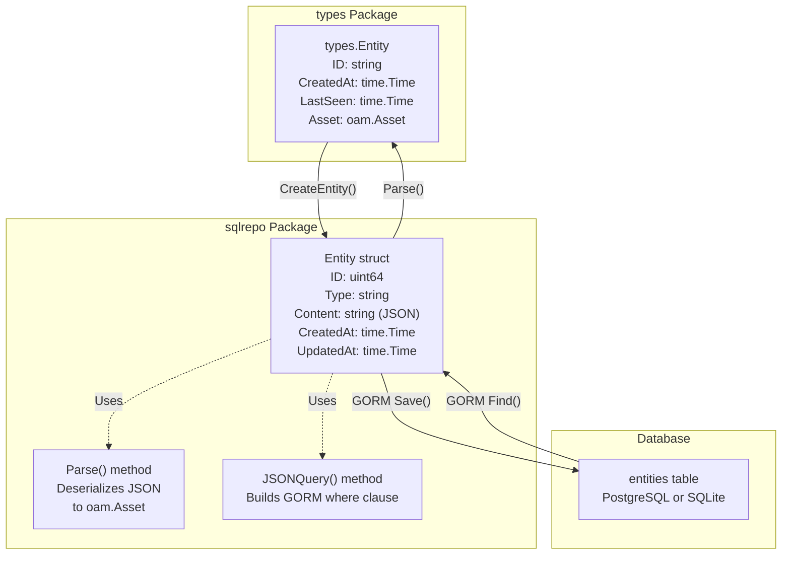
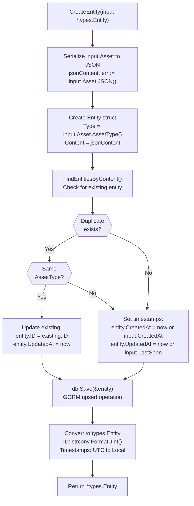
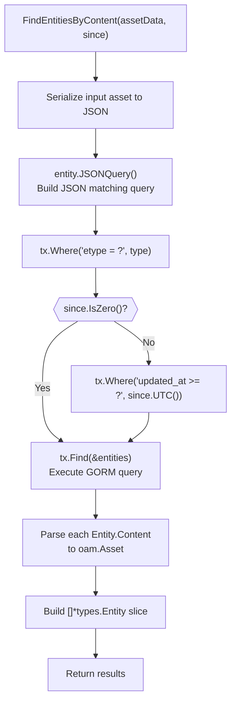
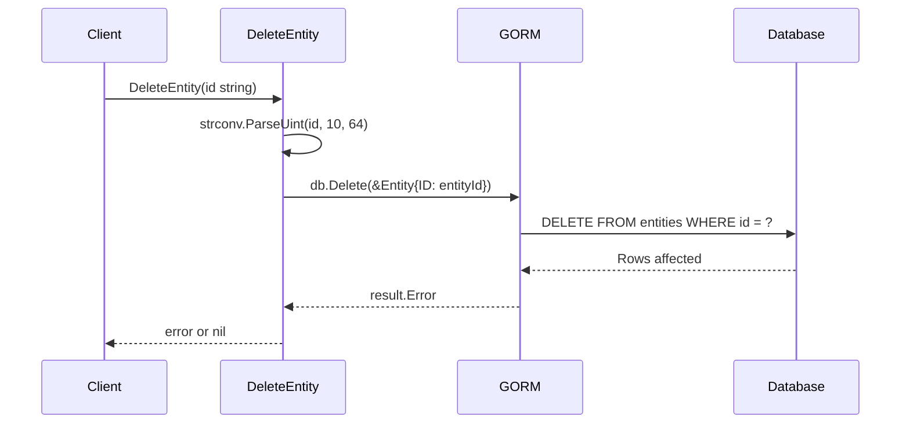
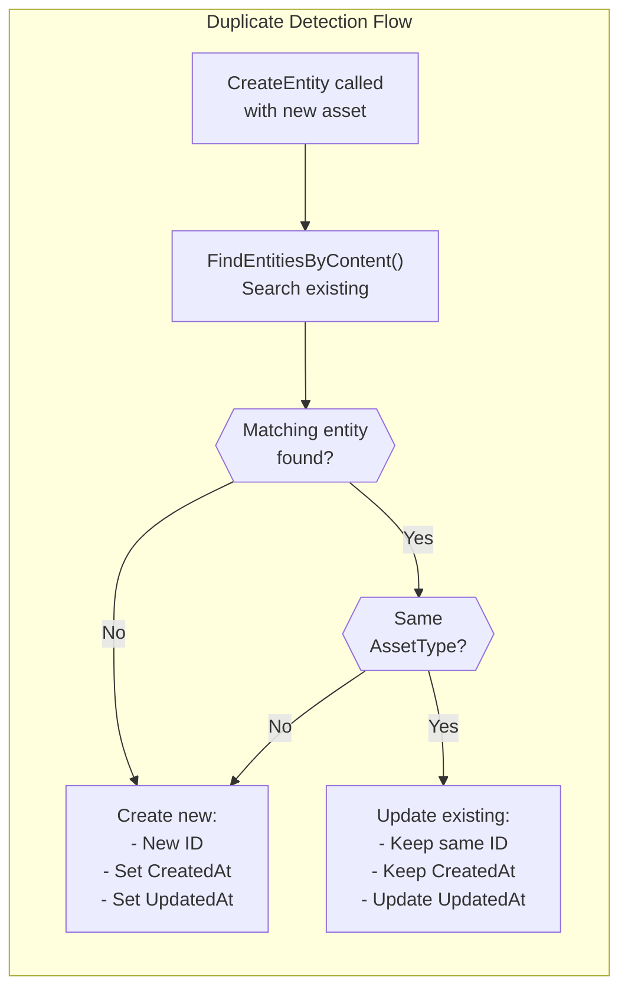

# SQL Entity Operations

# SQL Entity Operations

<details>
<summary>Relevant source files</summary>

The following files were used as context for generating this wiki page:

- [repository/sqlrepo/edge_test.go](repository/sqlrepo/edge_test.go)
- [repository/sqlrepo/entity.go](repository/sqlrepo/entity.go)
- [repository/sqlrepo/entity_test.go](repository/sqlrepo/entity_test.go)
- [repository/sqlrepo/tag_test.go](repository/sqlrepo/tag_test.go)

</details>


This page documents entity CRUD (Create, Read, Delete) operations in the SQL repository implementation. It covers how entities representing assets are created, queried, and managed in PostgreSQL and SQLite databases using GORM. For edge (relationship) operations, see [SQL Edge Operations](#4.2). For entity tag management, see [SQL Tag Management](#4.3).

## Overview

The SQL repository implements entity operations defined in the `Repository` interface using GORM as the ORM layer. Entities are stored in the `entities` table with JSON-serialized content. The implementation handles duplicate detection, timestamp management, and conversion between database records and `types.Entity` objects.

**Sources:** [repository/sqlrepo/entity.go:1-204]()

## Entity Storage Model

### Database Schema

Entities in SQL repositories are stored using the `Entity` struct, which maps to the `entities` table:

| Field | Type | Purpose |
|-------|------|---------|
| `ID` | `uint64` | Auto-incrementing primary key |
| `Type` | `string` | Asset type (e.g., "FQDN", "IPAddress") from `oam.AssetType()` |
| `Content` | `string` | JSON-serialized asset data from `oam.Asset.JSON()` |
| `CreatedAt` | `time.Time` | First creation timestamp |
| `UpdatedAt` | `time.Time` | Last seen/update timestamp |

The `Content` field stores the complete asset as JSON, allowing flexible storage of any asset type defined in the Open Asset Model.



**Sources:** [repository/sqlrepo/entity.go:21-68](), [repository/sqlrepo/entity.go:78-104]()

## Create Operations

### CreateEntity

The `CreateEntity` method persists a `types.Entity` to the database. It includes sophisticated duplicate detection logic that updates existing entities rather than creating duplicates.



**Key behaviors:**
- **Duplicate detection:** Queries `FindEntitiesByContent` to check if entity already exists [repository/sqlrepo/entity.go:33]()
- **Update vs Insert:** If duplicate found with matching `AssetType`, updates `UpdatedAt` timestamp but preserves `ID` and `CreatedAt` [repository/sqlrepo/entity.go:36-42]()
- **GORM Save:** Uses `db.Save()` which performs upsert (insert or update based on primary key) [repository/sqlrepo/entity.go:57]()
- **ID conversion:** Database `uint64` ID converted to string for `types.Entity` [repository/sqlrepo/entity.go:63]()
- **Timezone handling:** Timestamps stored in UTC, returned in local time [repository/sqlrepo/entity.go:64-65]()

**Sources:** [repository/sqlrepo/entity.go:17-68](), [repository/sqlrepo/entity_test.go:181-198]()

### CreateAsset

The `CreateAsset` method is a convenience wrapper around `CreateEntity`:

```go
func (sql *sqlRepository) CreateAsset(asset oam.Asset) (*types.Entity, error) {
    return sql.CreateEntity(&types.Entity{Asset: asset})
}
```

It accepts an `oam.Asset` directly and wraps it in a `types.Entity` before calling `CreateEntity`.

**Sources:** [repository/sqlrepo/entity.go:70-76](), [repository/sqlrepo/entity_test.go:247]()

## Query Operations

### FindEntityById

Retrieves a single entity by its string ID.

| Operation | Implementation |
|-----------|----------------|
| **Input** | `id string` - Entity ID as string |
| **Conversion** | `strconv.ParseUint(id, 10, 64)` to convert to `uint64` |
| **Query** | `db.First(&entity)` - GORM query by primary key |
| **Parsing** | `entity.Parse()` - Deserializes JSON content to `oam.Asset` |
| **Output** | `*types.Entity` with populated `Asset` field |

**Error cases:**
- Invalid ID format (not a valid uint64)
- Entity not found in database
- JSON parsing failure

**Sources:** [repository/sqlrepo/entity.go:78-104](), [repository/sqlrepo/entity_test.go:251-261]()

### FindEntitiesByContent

Searches for entities matching specific asset content, with optional time filtering.



**Key features:**
- **Content matching:** Uses `JSONQuery()` method to build database-specific JSON query [repository/sqlrepo/entity.go:122-125]()
- **Type filtering:** Always filters by `etype` field [repository/sqlrepo/entity.go:127]()
- **Time filtering:** Optional `since` parameter filters by `updated_at >= since` [repository/sqlrepo/entity.go:128-130]()
- **Zero value handling:** If `since.IsZero()`, time filter is skipped [repository/sqlrepo/entity.go:128]()

**Sources:** [repository/sqlrepo/entity.go:106-154](), [repository/sqlrepo/entity_test.go:263-273]()

### FindEntitiesByType

Retrieves all entities of a specific asset type, with optional time filtering.

| Parameter | Type | Purpose |
|-----------|------|---------|
| `atype` | `oam.AssetType` | Asset type to filter (e.g., "FQDN", "IPAddress") |
| `since` | `time.Time` | Optional time filter for `updated_at >= since` |

**Query variations:**

```go
// Without time filter (since.IsZero())
db.Where("etype = ?", atype).Find(&entities)

// With time filter
db.Where("etype = ? AND updated_at >= ?", atype, since.UTC()).Find(&entities)
```

**Sources:** [repository/sqlrepo/entity.go:156-189](), [repository/sqlrepo/entity_test.go:275-304]()

## Delete Operations

### DeleteEntity

Removes an entity by ID from the database.



**Implementation details:**
- Converts string ID to `uint64` [repository/sqlrepo/entity.go:195-197]()
- Uses GORM's `Delete()` method with primary key [repository/sqlrepo/entity.go:200-201]()
- Returns error if conversion fails or deletion fails
- Does not check if entity exists before deletion

**Sources:** [repository/sqlrepo/entity.go:191-203](), [repository/sqlrepo/entity_test.go:355-360]()

## Duplicate Handling Strategy

The SQL repository implements intelligent duplicate detection in `CreateEntity`:



**Rationale:** This prevents duplicate entities with identical content while updating the `LastSeen` timestamp to track recency. This is critical for time-based queries in discovery systems like OWASP Amass.

**Test validation:** The test `TestLastSeenUpdates` verifies that calling `CreateAsset` twice with the same asset updates `LastSeen` while preserving `ID` and `CreatedAt` [repository/sqlrepo/entity_test.go:181-198]().

**Sources:** [repository/sqlrepo/entity.go:32-55](), [repository/sqlrepo/entity_test.go:181-198]()

## JSON Serialization

### Encoding: Asset to JSON

The `CreateEntity` method serializes `oam.Asset` to JSON:

```go
jsonContent, err := input.Asset.JSON()
if err != nil {
    return nil, err
}
```

The JSON string is stored in the `Content` field of the database entity [repository/sqlrepo/entity.go:22-25]().

### Decoding: JSON to Asset

The `Parse()` method (implementation in `Entity` struct) deserializes JSON back to `oam.Asset`:

```go
assetData, err := entity.Parse()
if err != nil {
    return nil, err
}
```

This method is called in all query operations to reconstruct the asset from database storage [repository/sqlrepo/entity.go:93-96]().

### JSONQuery Method

The `JSONQuery()` method builds database-specific WHERE clauses for JSON content matching. This is used by `FindEntitiesByContent` to efficiently query entities with specific content [repository/sqlrepo/entity.go:122-125]().

**Sources:** [repository/sqlrepo/entity.go:22-25](), [repository/sqlrepo/entity.go:93-96](), [repository/sqlrepo/entity.go:122-125]()

## Time Handling

The SQL repository performs careful timezone conversions to ensure consistency:

### Storage: Local/Input to UTC

```go
// For new entities
if input.CreatedAt.IsZero() {
    entity.CreatedAt = time.Now().UTC()
} else {
    entity.CreatedAt = input.CreatedAt.UTC()
}

if input.LastSeen.IsZero() {
    entity.UpdatedAt = time.Now().UTC()
} else {
    entity.UpdatedAt = input.LastSeen.UTC()
}
```

All timestamps are converted to UTC before storage [repository/sqlrepo/entity.go:44-54]().

### Retrieval: UTC to Local

```go
return &types.Entity{
    ID:        strconv.FormatUint(entity.ID, 10),
    CreatedAt: entity.CreatedAt.In(time.UTC).Local(),
    LastSeen:  entity.UpdatedAt.In(time.UTC).Local(),
    Asset:     input.Asset,
}
```

Timestamps are converted back to local time when returning entities [repository/sqlrepo/entity.go:62-67]().

**Rationale:** Storing in UTC ensures consistency across different database servers and clients in different timezones. Converting to local time on retrieval maintains compatibility with client expectations.

**Sources:** [repository/sqlrepo/entity.go:44-67](), [repository/sqlrepo/entity.go:99-103]()

## Integration with GORM

All SQL entity operations use GORM methods:

| GORM Method | Purpose | Used In |
|-------------|---------|---------|
| `db.Save(&entity)` | Insert or update based on primary key | `CreateEntity` |
| `db.First(&entity)` | Query single record by primary key | `FindEntityById` |
| `db.Where(...).Find(&entities)` | Query multiple records with conditions | `FindEntitiesByContent`, `FindEntitiesByType` |
| `db.Delete(&entity)` | Delete record by primary key | `DeleteEntity` |

The `sqlRepository` struct contains a `*gorm.DB` field that executes these operations against PostgreSQL or SQLite databases configured at initialization.

**Sources:** [repository/sqlrepo/entity.go:57](), [repository/sqlrepo/entity.go:88](), [repository/sqlrepo/entity.go:127-136](), [repository/sqlrepo/entity.go:162-167](), [repository/sqlrepo/entity.go:201]()