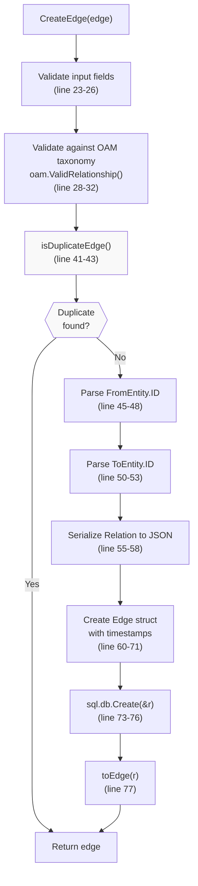
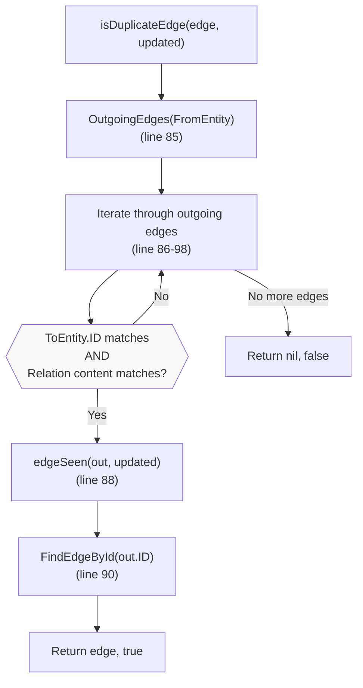
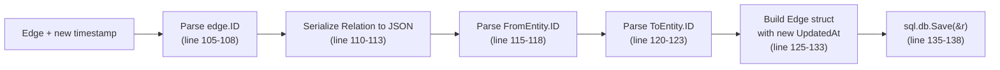
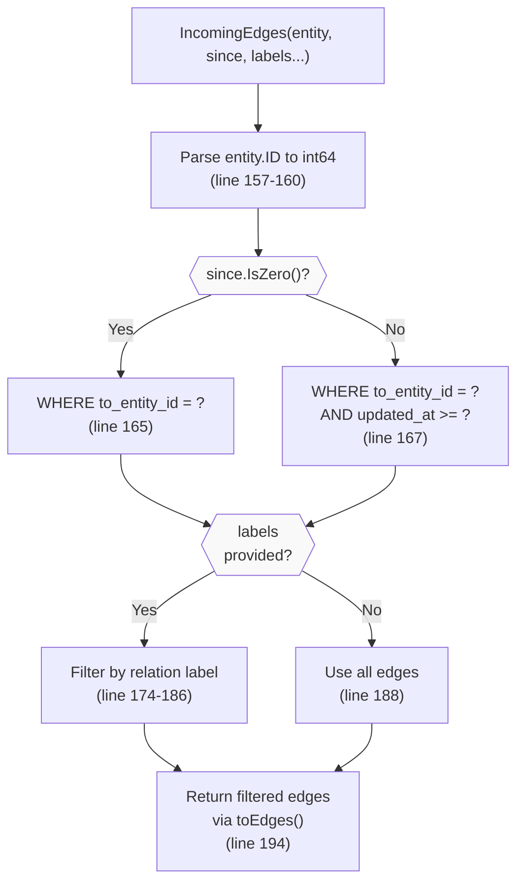
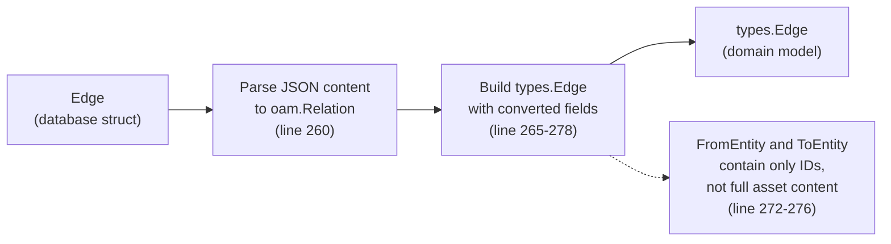

# SQL Edge Operations

# SQL Edge Operations

<details>
<summary>Relevant source files</summary>

The following files were used as context for generating this wiki page:

- [repository/sqlrepo/edge.go](repository/sqlrepo/edge.go)
- [repository/sqlrepo/edge_test.go](repository/sqlrepo/edge_test.go)
- [repository/sqlrepo/entity_test.go](repository/sqlrepo/entity_test.go)
- [repository/sqlrepo/tag_test.go](repository/sqlrepo/tag_test.go)

</details>


## Purpose and Scope

This document details the SQL repository implementation for edge operations. Edges represent directed relationships between entities in the property graph model. The SQL implementation uses GORM to manage edges stored in relational databases (PostgreSQL and SQLite).

This page covers edge creation, querying, retrieval, and deletion operations. For entity management, see [SQL Entity Operations](#4.1). For edge tag operations, see [SQL Tag Management](#4.3). For the Neo4j graph database implementation of edge operations, see [Neo4j Edge Operations](#5.2).

**Sources:** [repository/sqlrepo/edge.go:1-292]()

---

## Edge Table Structure

The SQL repository stores edges in an `edges` table with the following structure:

| Column | Type | Description |
|--------|------|-------------|
| `edge_id` | uint64 | Primary key, auto-incremented |
| `type` | string | Relation type from OAM |
| `content` | JSON | Serialized relation data |
| `from_entity_id` | uint64 | Foreign key to source entity |
| `to_entity_id` | uint64 | Foreign key to destination entity |
| `created_at` | timestamp | When the edge was first created |
| `updated_at` | timestamp | Last seen timestamp |

The `Edge` struct in the SQL repository maps to this table structure:

```
type Edge struct {
    ID           uint64
    Type         string
    Content      []byte
    FromEntityID uint64
    ToEntityID   uint64
    CreatedAt    time.Time
    UpdatedAt    time.Time
}
```

**Sources:** [repository/sqlrepo/edge.go:60-71]()

---

## Edge Creation Flow

### CreateEdge Method



**Diagram: Edge Creation Process**

The `CreateEdge` method implements comprehensive validation and duplicate detection:

1. **Input Validation** [repository/sqlrepo/edge.go:23-26](): Verifies that the edge, relation, and both entities are non-nil
2. **Taxonomy Validation** [repository/sqlrepo/edge.go:28-32](): Calls `oam.ValidRelationship()` to ensure the relationship is valid according to the Open Asset Model taxonomy
3. **Duplicate Detection** [repository/sqlrepo/edge.go:41-43](): Checks if an identical edge already exists
4. **Timestamp Management** [repository/sqlrepo/edge.go:34-39](): Uses provided `LastSeen` timestamp or defaults to current UTC time
5. **Entity ID Parsing** [repository/sqlrepo/edge.go:45-53](): Converts string entity IDs to uint64
6. **Content Serialization** [repository/sqlrepo/edge.go:55-58](): Serializes the relation to JSON format
7. **Database Insert** [repository/sqlrepo/edge.go:73-76](): Uses GORM to insert the edge record

**Sources:** [repository/sqlrepo/edge.go:19-78]()

---

## Duplicate Edge Detection

### isDuplicateEdge Logic



**Diagram: Duplicate Edge Detection Mechanism**

The duplicate detection mechanism prevents redundant edges in the database:

- **Query Existing Edges** [repository/sqlrepo/edge.go:85](): Retrieves all outgoing edges from the source entity with the same label
- **Deep Comparison** [repository/sqlrepo/edge.go:87](): Compares both the destination entity ID and the relation content using `reflect.DeepEqual`
- **Update Timestamp** [repository/sqlrepo/edge.go:88](): If a duplicate is found, updates its `updated_at` timestamp via `edgeSeen()`
- **Return Existing** [repository/sqlrepo/edge.go:90-93](): Fetches and returns the existing edge instead of creating a new one

This approach ensures that re-discovering the same relationship updates the temporal information without creating duplicate records.

**Sources:** [repository/sqlrepo/edge.go:80-101]()

---

## Edge Timestamp Management

### edgeSeen Method

The `edgeSeen` method updates the `updated_at` timestamp for an existing edge:



**Diagram: Edge Timestamp Update Flow**

The method preserves the original `created_at` timestamp while updating `updated_at` to reflect the most recent observation of the relationship.

**Sources:** [repository/sqlrepo/edge.go:103-140]()

---

## Querying Edges

### Incoming and Outgoing Edge Queries

Both `IncomingEdges` and `OutgoingEdges` methods support:
- Temporal filtering via the `since` parameter
- Label filtering to retrieve edges of specific relation types
- Optional label filtering (returns all edges if no labels specified)

#### IncomingEdges Query Structure



**Diagram: IncomingEdges Query Flow**

#### OutgoingEdges Query Structure

The `OutgoingEdges` method follows the same pattern but queries on `from_entity_id` instead:

| Query Parameter | SQL WHERE Clause |
|----------------|------------------|
| No time filter | `from_entity_id = ?` |
| With time filter | `from_entity_id = ? AND updated_at >= ?` |

**Label Filtering Implementation:**

When labels are provided [repository/sqlrepo/edge.go:218-230]():
1. Parse each edge's JSON content to extract the relation
2. Compare the relation's label against the requested labels
3. Include the edge only if its label matches

**Sources:** [repository/sqlrepo/edge.go:153-239]()

---

## Edge Retrieval and Deletion

### FindEdgeById

The `FindEdgeById` method retrieves a single edge by its ID:

```
func FindEdgeById(id string) (*types.Edge, error)
```

Implementation details [repository/sqlrepo/edge.go:142-151]():
- Parses the string ID
- Queries using `WHERE edge_id = ?`
- Converts the database `Edge` to `types.Edge` via `toEdge()`

### DeleteEdge

The `DeleteEdge` method removes an edge from the database:

```
func DeleteEdge(id string) error
```

Implementation [repository/sqlrepo/edge.go:244-250]():
- Parses the string ID to uint64
- Delegates to `deleteEdges()` which executes: `DELETE FROM edges WHERE edge_id IN ?`

The `deleteEdges` helper method [repository/sqlrepo/edge.go:252-255]() accepts a slice of IDs, enabling batch deletion operations.

**Sources:** [repository/sqlrepo/edge.go:142-255]()

---

## Type Conversion Functions

### Database to Domain Model Conversion



**Diagram: Edge Type Conversion**

### toEdge Function

The `toEdge` function [repository/sqlrepo/edge.go:257-279]() converts a database `Edge` struct to a `types.Edge`:

- Parses the JSON `Content` field back to an `oam.Relation`
- Converts numeric timestamps to `time.Time` in local timezone
- Creates entity references with IDs only (does not join to fetch full entity data)
- Converts uint64 IDs to string format

### toEdges Function

The `toEdges` helper [repository/sqlrepo/edge.go:281-291]() applies `toEdge` to a slice of edges, filtering out any that fail to parse.

**Important Note:** The converted `FromEntity` and `ToEntity` objects contain only the ID field. Full entity content is not joined during edge queries for performance reasons. To retrieve complete entity data, use `FindEntityById()` on the entity IDs.

**Sources:** [repository/sqlrepo/edge.go:257-291]()

---

## Integration Testing Examples

The test suite demonstrates typical edge operations:

### Basic Edge Creation and Query

From [repository/sqlrepo/entity_test.go:310-350]():

```
edge := &types.Edge{
    Relation:   tc.relation,
    FromEntity: sourceEntity,
    ToEntity:   destinationEntity,
}

e, err := store.CreateEdge(edge)
// Query incoming edges
incoming, err := store.IncomingEdges(destinationEntity, start, tc.relation.Label())
// Query outgoing edges  
outgoing, err := store.OutgoingEdges(sourceEntity, start, tc.relation.Label())
```

### Duplicate Handling

From [repository/sqlrepo/edge_test.go:106-111]():

```
// Store duplicate relation - last_seen is updated
rr, err := store.CreateEdge(edge2)
// Verify LastSeen timestamp increased
assert(rr.LastSeen > originalEdge.LastSeen)
```

### Unfiltered Edge Queries

From [repository/sqlrepo/edge_test.go:74-76]():

```
// Retrieve all outgoing edges (no label filter)
outs, err := store.OutgoingEdges(sourceEntity, time.Time{})
// Returns all edges regardless of relation type
```

**Sources:** [repository/sqlrepo/entity_test.go:200-363](), [repository/sqlrepo/edge_test.go:20-112]()

---

## Error Handling

Edge operations return errors for the following conditions:

| Operation | Error Condition | Error Type |
|-----------|----------------|------------|
| `CreateEdge` | Nil input fields | "failed input validation checks" |
| `CreateEdge` | Invalid taxonomy relationship | "%s -%s-> %s is not valid in the taxonomy" |
| `CreateEdge` | Entity ID parse failure | Parse error |
| `CreateEdge` | JSON serialization failure | Serialization error |
| `CreateEdge` | Database insert failure | GORM error |
| `IncomingEdges` | Entity ID parse failure | Parse error |
| `IncomingEdges` | Zero edges found | "zero edges found" |
| `OutgoingEdges` | Entity ID parse failure | Parse error |
| `OutgoingEdges` | Zero edges found | "zero edges found" |
| `FindEdgeById` | Edge not found | GORM error (record not found) |
| `DeleteEdge` | ID parse failure | Parse error |
| `DeleteEdge` | Database delete failure | GORM error |

**Sources:** [repository/sqlrepo/edge.go:1-292]()

---

## Performance Considerations

### Query Optimization

1. **Indexed Lookups:** The `from_entity_id` and `to_entity_id` columns should be indexed for efficient edge traversal queries
2. **Time-based Filtering:** The `updated_at` column enables temporal queries for incremental data retrieval
3. **Label Filtering:** Performed in-memory after database query, requires parsing JSON content

### Duplicate Detection Cost

The `isDuplicateEdge` check [repository/sqlrepo/edge.go:80-101]() queries all outgoing edges with the same label and performs deep equality checks. For entities with many outgoing edges, this can be expensive. The cost is traded off against preventing duplicate records.

### Lazy Entity Loading

Edge queries return entity references with IDs only, avoiding JOIN operations. This design improves query performance but requires separate queries to fetch full entity data when needed.

**Sources:** [repository/sqlrepo/edge.go:1-292]()