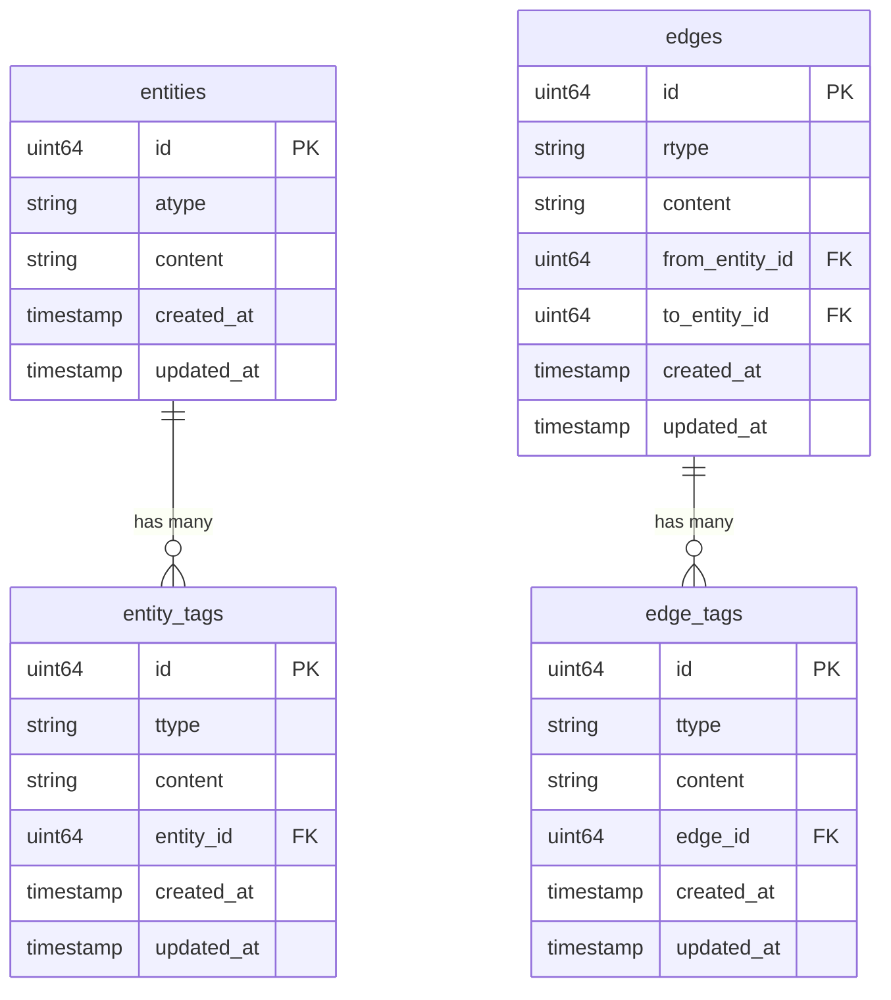
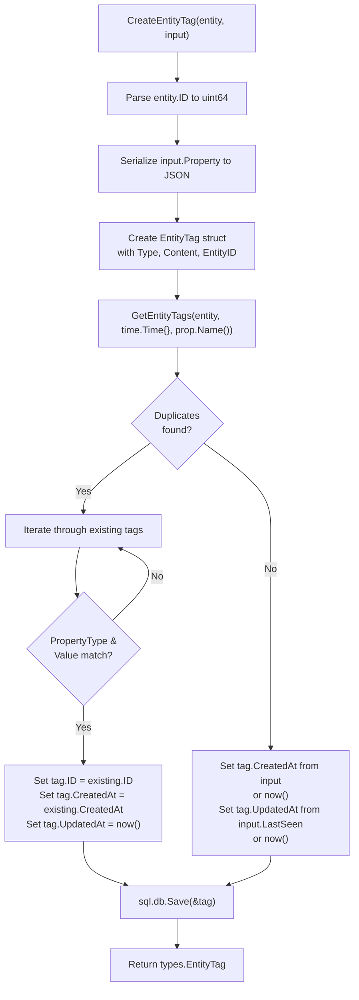
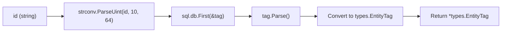
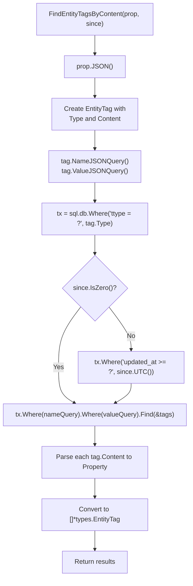
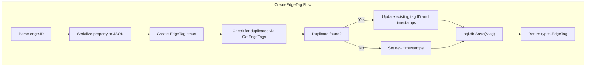
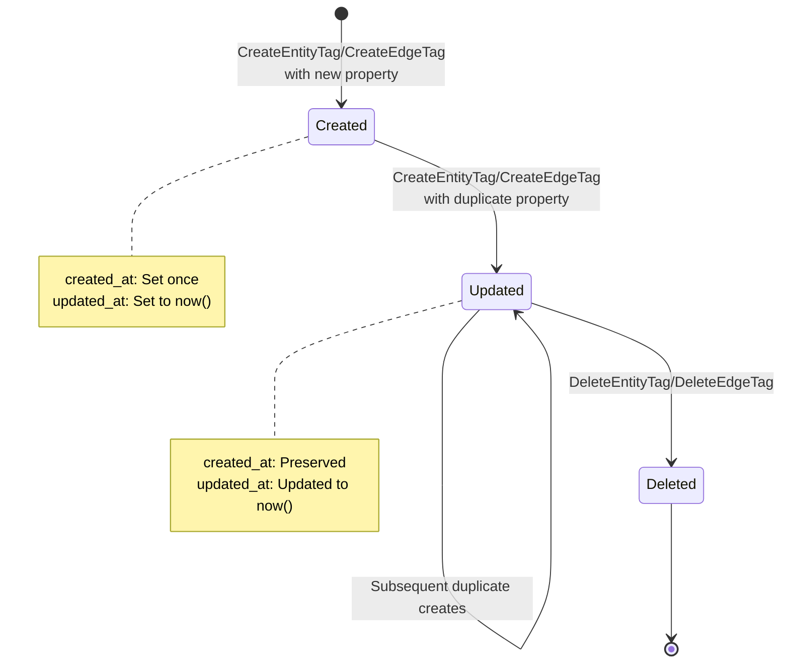
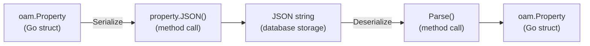
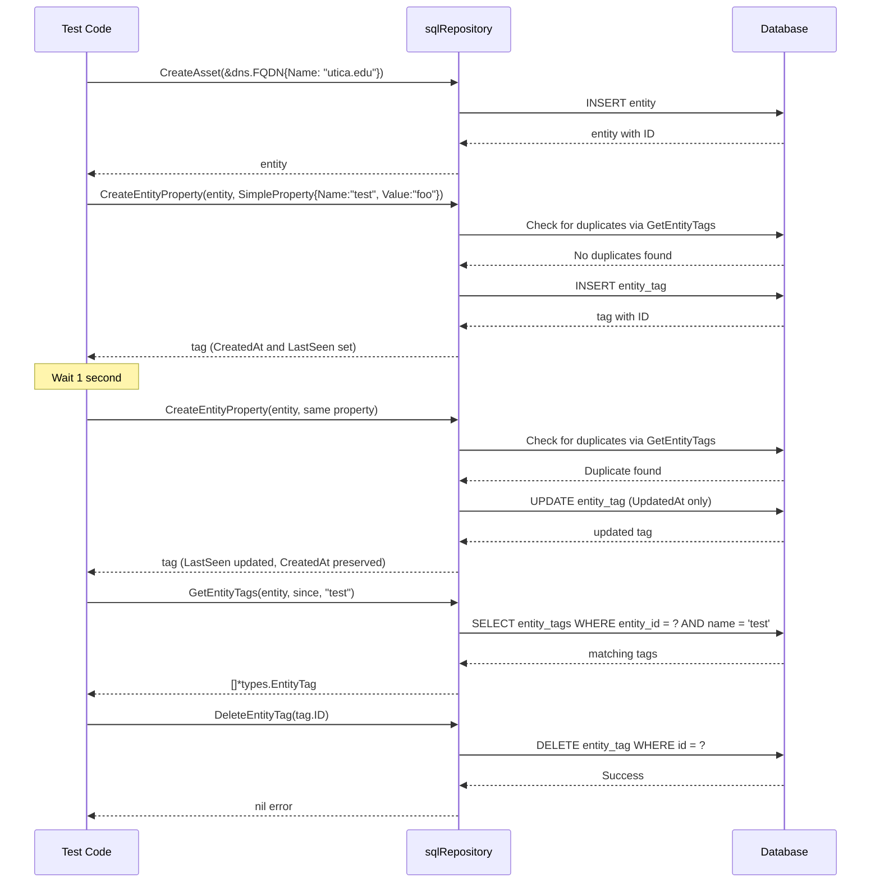

# SQL Tag Management

# SQL Tag Management

<details>
<summary>Relevant source files</summary>

The following files were used as context for generating this wiki page:

- [repository/sqlrepo/edge_test.go](repository/sqlrepo/edge_test.go)
- [repository/sqlrepo/entity_test.go](repository/sqlrepo/entity_test.go)
- [repository/sqlrepo/tag.go](repository/sqlrepo/tag.go)
- [repository/sqlrepo/tag_test.go](repository/sqlrepo/tag_test.go)

</details>


This document details how the SQL repository implementation manages entity and edge tags. Tags are metadata containers that store OAM properties (from the Open Asset Model) as JSON content attached to entities and edges. This page covers tag creation, retrieval, content-based searching, duplicate handling, and deletion.

For entity and edge operations themselves, see [SQL Entity Operations](#4.1) and [SQL Edge Operations](#4.2). For tag management in Neo4j, see [Neo4j Tag Management](#5.3).

---

## Overview

Tags in the SQL repository serve as a flexible metadata system for attaching properties to both entities and edges. Each tag wraps an `oam.Property` object, serializes it to JSON, and stores it in the database with timestamp tracking. The system prevents duplicate tags and supports content-based queries.

**Sources:** [repository/sqlrepo/tag.go:1-477]()

---

## Database Schema and Core Structures

The SQL repository uses two separate tables for tags: `entity_tags` and `edge_tags`. Both follow a similar structure, storing the property type, JSON content, and foreign key references.



### Internal Tag Structures

The `EntityTag` and `EdgeTag` structs are internal GORM models that map to database tables:

| Field | Type | Description |
|-------|------|-------------|
| `ID` | `uint64` | Auto-incrementing primary key |
| `Type` | `string` | The property type (e.g., "simple_property") |
| `Content` | `string` | JSON-serialized property data |
| `EntityID` / `EdgeID` | `uint64` | Foreign key reference |
| `CreatedAt` | `time.Time` | Initial creation timestamp |
| `UpdatedAt` | `time.Time` | Last seen timestamp |

These internal structs are converted to `types.EntityTag` and `types.EdgeTag` for external API consumption.

**Sources:** [repository/sqlrepo/tag.go:32-36](), [repository/sqlrepo/tag.go:260-264]()

---

## Entity Tag Operations

### Creating Entity Tags

The `CreateEntityTag` function persists property metadata for an entity. It serializes the OAM property to JSON and implements duplicate detection logic.



**Key behaviors:**

1. **Duplicate Prevention**: The function queries existing tags with the same name [repository/sqlrepo/tag.go:39]()
2. **Type and Value Matching**: Duplicates are identified by matching `PropertyType()` and `Value()` [repository/sqlrepo/tag.go:41]()
3. **Update vs Insert**: Duplicates update `UpdatedAt` while preserving `CreatedAt`; new tags set both timestamps [repository/sqlrepo/tag.go:42-61]()
4. **GORM Save**: Uses `Save()` to perform INSERT or UPDATE based on whether `ID` is set [repository/sqlrepo/tag.go:64]()

**Sources:** [repository/sqlrepo/tag.go:17-76]()

### Convenience Wrapper

The `CreateEntityProperty` function provides a simpler interface when you only have an `oam.Property`:

```go
// Wrapper that creates EntityTag from Property
func (sql *sqlRepository) CreateEntityProperty(entity *types.Entity, prop oam.Property) (*types.EntityTag, error)
```

**Sources:** [repository/sqlrepo/tag.go:78-84]()

### Finding Entity Tags by ID

The `FindEntityTagById` function retrieves a single tag by its unique identifier:



**Sources:** [repository/sqlrepo/tag.go:86-113]()

### Content-Based Tag Searching

The `FindEntityTagsByContent` function enables searching for tags by property content. It uses JSON field extraction to query specific property values.



The `NameJSONQuery()` and `ValueJSONQuery()` methods generate database-specific JSON extraction queries for PostgreSQL and SQLite. This allows efficient content filtering at the database level.

**Sources:** [repository/sqlrepo/tag.go:115-169]()

### Retrieving All Entity Tags

The `GetEntityTags` function retrieves all tags for a specific entity with optional filtering:

**Function Signature:**
```go
func (sql *sqlRepository) GetEntityTags(entity *types.Entity, since time.Time, names ...string) ([]*types.EntityTag, error)
```

**Parameters:**
- `entity`: The entity whose tags to retrieve
- `since`: If not zero, only returns tags with `updated_at >= since`
- `names`: Optional property names to filter by

**Query Logic:**

| Condition | Query |
|-----------|-------|
| `since.IsZero()` | `WHERE entity_id = ?` |
| `!since.IsZero()` | `WHERE entity_id = ? AND updated_at >= ?` |

After database retrieval, the function filters results by property name if `names` are provided [repository/sqlrepo/tag.go:198-207]().

**Sources:** [repository/sqlrepo/tag.go:171-226]()

### Deleting Entity Tags

The `DeleteEntityTag` function removes a tag by its ID:

```go
func (sql *sqlRepository) DeleteEntityTag(id string) error
```

It parses the string ID to `uint64`, creates an `EntityTag` struct with that ID, and uses GORM's `Delete()` method.

**Sources:** [repository/sqlrepo/tag.go:228-243]()

---

## Edge Tag Operations

Edge tag operations mirror entity tag operations but target edge relationships instead of entities.

### Creating Edge Tags

The `CreateEdgeTag` function follows the same pattern as `CreateEntityTag`:



**Duplicate detection logic:**
1. Queries existing edge tags with the same property name [repository/sqlrepo/tag.go:267]()
2. Compares `PropertyType()` and `Value()` [repository/sqlrepo/tag.go:269]()
3. Updates timestamp on match or creates new tag

**Sources:** [repository/sqlrepo/tag.go:245-304]()

### Edge Tag Convenience Functions

Similar to entity tags, edge tags provide a convenience wrapper:

```go
func (sql *sqlRepository) CreateEdgeProperty(edge *types.Edge, prop oam.Property) (*types.EdgeTag, error)
```

**Sources:** [repository/sqlrepo/tag.go:306-312]()

### Finding Edge Tags

Edge tag retrieval functions parallel their entity counterparts:

| Function | Purpose | Sources |
|----------|---------|---------|
| `FindEdgeTagById` | Retrieve by unique ID | [repository/sqlrepo/tag.go:314-346]() |
| `FindEdgeTagsByContent` | Search by property content | [repository/sqlrepo/tag.go:348-402]() |
| `GetEdgeTags` | Get all tags for an edge | [repository/sqlrepo/tag.go:404-459]() |
| `DeleteEdgeTag` | Remove by ID | [repository/sqlrepo/tag.go:461-476]() |

The implementation details match entity tag operations but operate on the `edge_tags` table with `edge_id` foreign keys instead of `entity_id`.

**Sources:** [repository/sqlrepo/tag.go:314-476]()

---

## Tag Lifecycle and Timestamp Management

Tags maintain two timestamps that track their lifecycle:



### Timestamp Behavior

**On Initial Creation** [repository/sqlrepo/tag.go:51-61]():
- `created_at`: Set from `input.CreatedAt` if provided, otherwise `time.Now().UTC()`
- `updated_at`: Set from `input.LastSeen` if provided, otherwise `time.Now().UTC()`

**On Duplicate Update** [repository/sqlrepo/tag.go:42-48]():
- `created_at`: Preserved from existing tag
- `updated_at`: Set to `time.Now().UTC()`

**Time Zone Handling:**
All timestamps are stored in UTC but converted to local time when returned via `types.EntityTag` or `types.EdgeTag` [repository/sqlrepo/tag.go:71-72]().

**Sources:** [repository/sqlrepo/tag.go:42-62](), [repository/sqlrepo/tag.go:279-289]()

---

## JSON Content Storage and Querying

Tags store OAM properties as JSON strings in the `content` field. This enables flexible property storage while supporting content-based queries.

### Serialization Process



### JSON Query Methods

The internal `EntityTag` and `EdgeTag` structs implement methods for generating database-specific JSON extraction queries:

- `NameJSONQuery()`: Extracts the property name field
- `ValueJSONQuery()`: Extracts the property value field

These methods handle differences between PostgreSQL's `->>` operator and SQLite's `json_extract()` function, abstracting database-specific syntax.

**Sources:** [repository/sqlrepo/tag.go:27-30](), [repository/sqlrepo/tag.go:131-139](), [repository/sqlrepo/tag.go:364-372]()

---

## Code Entity Mapping

The following diagram maps the public API functions to their internal implementations and database operations:

```mermaid
flowchart TB
    subgraph "Public API (repository.Repository interface)"
        CreateEntityTag["CreateEntityTag(entity, tag)"]
        CreateEntityProperty["CreateEntityProperty(entity, prop)"]
        FindEntityTagById["FindEntityTagById(id)"]
        FindEntityTagsByContent["FindEntityTagsByContent(prop, since)"]
        GetEntityTags["GetEntityTags(entity, since, names...)"]
        DeleteEntityTag["DeleteEntityTag(id)"]
        
        CreateEdgeTag["CreateEdgeTag(edge, tag)"]
        CreateEdgeProperty["CreateEdgeProperty(edge, prop)"]
        FindEdgeTagById["FindEdgeTagById(id)"]
        FindEdgeTagsByContent["FindEdgeTagsByContent(prop, since)"]
        GetEdgeTags["GetEdgeTags(edge, since, names...)"]
        DeleteEdgeTag["DeleteEdgeTag(id)"]
    end
    
    subgraph "sqlRepository Implementation"
        CreateEntityTagImpl["sqlRepository.CreateEntityTag<br/>[tag.go:21-76]"]
        CreateEntityPropertyImpl["sqlRepository.CreateEntityProperty<br/>[tag.go:82-84]"]
        FindEntityTagByIdImpl["sqlRepository.FindEntityTagById<br/>[tag.go:89-113]"]
        FindEntityTagsByContentImpl["sqlRepository.FindEntityTagsByContent<br/>[tag.go:120-169]"]
        GetEntityTagsImpl["sqlRepository.GetEntityTags<br/>[tag.go:174-226]"]
        DeleteEntityTagImpl["sqlRepository.DeleteEntityTag<br/>[tag.go:231-243]"]
        
        CreateEdgeTagImpl["sqlRepository.CreateEdgeTag<br/>[tag.go:249-304]"]
        CreateEdgePropertyImpl["sqlRepository.CreateEdgeProperty<br/>[tag.go:310-312]"]
        FindEdgeTagByIdImpl["sqlRepository.FindEdgeTagById<br/>[tag.go:317-346]"]
        FindEdgeTagsByContentImpl["sqlRepository.FindEdgeTagsByContent<br/>[tag.go:353-402]"]
        GetEdgeTagsImpl["sqlRepository.GetEdgeTags<br/>[tag.go:407-459]"]
        DeleteEdgeTagImpl["sqlRepository.DeleteEdgeTag<br/>[tag.go:464-476]"]
    end
    
    subgraph "GORM Database Operations"
        Save["db.Save(&tag)"]
        First["db.First(&tag)"]
        Where["db.Where(...).Find(&tags)"]
        Delete["db.Delete(&tag)"]
    end
    
    CreateEntityTag --> CreateEntityTagImpl --> Save
    CreateEntityProperty --> CreateEntityPropertyImpl --> CreateEntityTagImpl
    FindEntityTagById --> FindEntityTagByIdImpl --> First
    FindEntityTagsByContent --> FindEntityTagsByContentImpl --> Where
    GetEntityTags --> GetEntityTagsImpl --> Where
    DeleteEntityTag --> DeleteEntityTagImpl --> Delete
    
    CreateEdgeTag --> CreateEdgeTagImpl --> Save
    CreateEdgeProperty --> CreateEdgePropertyImpl --> CreateEdgeTagImpl
    FindEdgeTagById --> FindEdgeTagByIdImpl --> First
    FindEdgeTagsByContent --> FindEdgeTagsByContentImpl --> Where
    GetEdgeTags --> GetEdgeTagsImpl --> Where
    DeleteEdgeTag --> DeleteEdgeTagImpl --> Delete
```



**Sources:** [repository/sqlrepo/tag.go:1-477]()

---

## Usage Examples from Tests

The test suite demonstrates typical tag operations:

### Entity Tag Test Flow



**Sources:** [repository/sqlrepo/tag_test.go:20-85]()

### Edge Tag Test Flow

Edge tags follow an identical pattern but require an edge to be created first:

1. Create two entities (`CreateAsset`)
2. Create an edge between them (`CreateEdge`)
3. Attach properties to the edge via `CreateEdgeProperty`
4. Query and verify tags via `GetEdgeTags`
5. Clean up with `DeleteEdgeTag`

**Sources:** [repository/sqlrepo/tag_test.go:87-165]()

---

## Error Handling

The tag management system returns errors in the following scenarios:

| Scenario | Error Source | Functions Affected |
|----------|--------------|-------------------|
| Invalid ID format | `strconv.ParseUint` | `FindEntityTagById`, `DeleteEntityTag`, `FindEdgeTagById`, `DeleteEdgeTag` |
| JSON serialization failure | `property.JSON()` | `CreateEntityTag`, `CreateEdgeTag`, `FindEntityTagsByContent`, `FindEdgeTagsByContent` |
| Tag not found | `gorm.First` | `FindEntityTagById`, `FindEdgeTagById` |
| Database operation failure | `gorm.Save`, `gorm.Delete` | All create and delete operations |
| Zero results | Custom check | `FindEntityTagsByContent`, `GetEntityTags`, `FindEdgeTagsByContent`, `GetEdgeTags` |

The "zero tags found" error [repository/sqlrepo/tag.go:166]() is explicitly returned when queries produce no results, distinguishing between database errors and legitimate empty result sets.

**Sources:** [repository/sqlrepo/tag.go:22-24](), [repository/sqlrepo/tag.go:165-167](), [repository/sqlrepo/tag.go:222-224]()