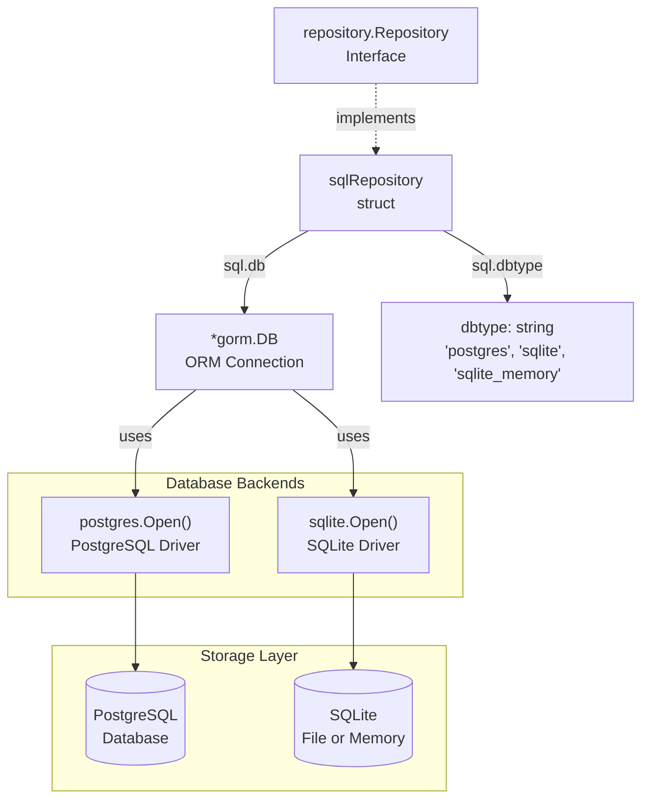
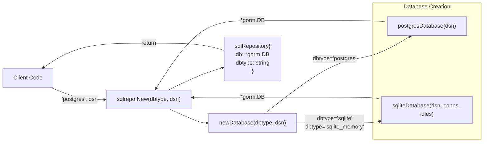
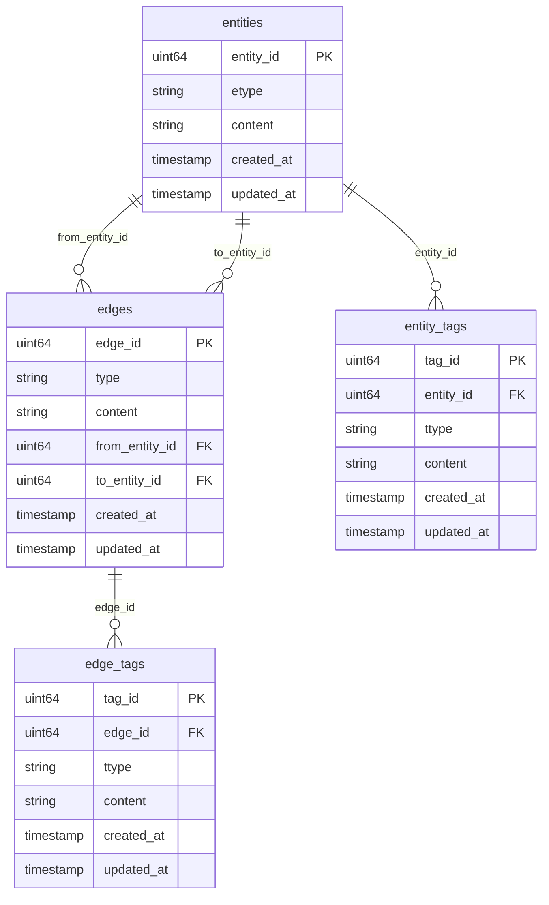
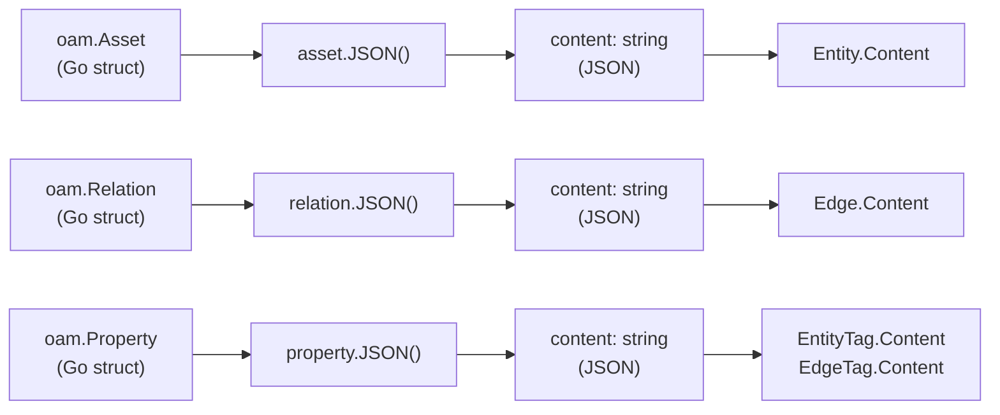
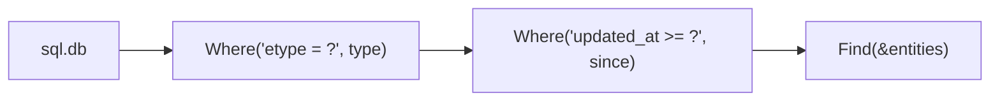

# SQL Repository

# SQL Repository

Relevant source files

The following files were used as context for generating this wiki page:

- [repository/neo4j/db.go](repository/neo4j/db.go)
- [repository/neo4j/extract_property.go](repository/neo4j/extract_property.go)
- [repository/neo4j/extract_tags.go](repository/neo4j/extract_tags.go)
- [repository/sqlrepo/db.go](repository/sqlrepo/db.go)
- [repository/sqlrepo/edge.go](repository/sqlrepo/edge.go)
- [repository/sqlrepo/entity.go](repository/sqlrepo/entity.go)

## Purpose and Scope

The SQL Repository provides a relational database implementation of the `Repository` interface using GORM as the ORM layer. It supports PostgreSQL for production deployments and SQLite for embedded/development use cases. This document covers the architecture, initialization, and data storage approach of the SQL repository implementation.

For detailed information about specific operations:
- Entity CRUD operations: see [SQL Entity Operations](#4.1)
- Edge management and querying: see [SQL Edge Operations](#4.2)  
- Tag creation and retrieval: see [SQL Tag Management](#4.3)

For the Neo4j graph database implementation, see [Neo4j Repository](#5).

**Sources:** [repository/sqlrepo/db.go](), [repository/sqlrepo/entity.go](), [repository/sqlrepo/edge.go]()

---

## Repository Architecture

The SQL repository is implemented by the `sqlRepository` struct defined in [repository/sqlrepo/db.go:24-27](). It wraps a GORM database connection and implements all methods of the `Repository` interface.

### Core Components

**Sources:** [repository/sqlrepo/db.go:17-27](), [repository/sqlrepo/db.go:43-53]()

---

## Database Type Constants

The SQL repository supports three database configurations, identified by string constants:

| Constant | Value | Purpose |
|----------|-------|---------|
| `Postgres` | `"postgres"` | Production PostgreSQL deployment |
| `SQLite` | `"sqlite"` | File-based SQLite database |
| `SQLiteMemory` | `"sqlite_memory"` | In-memory SQLite for testing |

**Sources:** [repository/sqlrepo/db.go:17-21]()

---

## Initialization Process

The `New` function creates and configures a SQL repository instance. It establishes the database connection with appropriate driver settings and connection pooling parameters.

### Factory Function

**Key Implementation Details:**

The factory function routes to database-specific initialization based on the `dbtype` parameter [repository/sqlrepo/db.go:29-40]():

- **PostgreSQL**: Uses `gorm.Open(postgres.Open(dsn))` with connection pooling configured for production workloads [repository/sqlrepo/db.go:55-72]()
- **SQLite (file)**: Uses `gorm.Open(sqlite.Open(dsn))` with 3 max connections and 5 max idle connections [repository/sqlrepo/db.go:74-91]()
- **SQLite (memory)**: Uses the same driver but with increased limits (50 max connections, 100 max idle) for test performance [repository/sqlrepo/db.go:49-50]()

**Sources:** [repository/sqlrepo/db.go:29-53](), [repository/sqlrepo/db.go:55-91]()

---

## Connection Pooling Configuration

Each database backend is configured with specific connection pooling parameters to optimize performance and resource usage.

### PostgreSQL Connection Pool

| Parameter | Value | Purpose |
|-----------|-------|---------|
| `MaxIdleConns` | 5 | Maintains 5 idle connections for quick reuse |
| `MaxOpenConns` | 10 | Limits concurrent connections to 10 |
| `ConnMaxLifetime` | 1 hour | Recycles connections after 1 hour |
| `ConnMaxIdleTime` | 10 minutes | Closes idle connections after 10 minutes |

**Sources:** [repository/sqlrepo/db.go:62-71]()

### SQLite Connection Pool

**File-based SQLite:**
- `MaxOpenConns`: 3
- `MaxIdleConns`: 5
- Same lifetime settings as PostgreSQL

**In-memory SQLite:**
- `MaxOpenConns`: 50
- `MaxIdleConns`: 100  
- Optimized for high-throughput testing scenarios

**Sources:** [repository/sqlrepo/db.go:75-90]()

---

## Data Storage Model

The SQL repository stores graph data (entities and edges) in relational tables using JSON serialization for flexible content storage.

### Table Structure

### GORM Model Structs

The repository uses internal GORM model structs (not shown in provided files but referenced by operations) that map to these tables:

- `Entity` struct: Maps to `entities` table
- `Edge` struct: Maps to `edges` table with foreign key constraints
- `EntityTag` struct: Maps to `entity_tags` table
- `EdgeTag` struct: Maps to `edge_tags` table

**Sources:** [repository/sqlrepo/entity.go:27-30](), [repository/sqlrepo/edge.go:60-66]()

---

## JSON Content Serialization

All Open Asset Model objects (Assets, Relations, Properties) are serialized to JSON for storage in the `content` fields. This approach provides:

1. **Schema Flexibility**: Supports arbitrary asset types without schema migrations
2. **OAM Compatibility**: Preserves full fidelity of OAM objects
3. **Query Capability**: JSON operators enable content-based queries

### Serialization Flow

**Examples in Code:**

- Entity serialization: [repository/sqlrepo/entity.go:22-24]()
- Edge serialization: [repository/sqlrepo/edge.go:55-58]()
- Deserialization: [repository/sqlrepo/entity.go:93-96]()

**Sources:** [repository/sqlrepo/entity.go:22-30](), [repository/sqlrepo/edge.go:55-66]()

---

## GORM Query Patterns

The SQL repository uses GORM's query builder extensively throughout its operations. Common patterns include:

### Basic CRUD Operations

| Operation | GORM Method | Example Location |
|-----------|-------------|------------------|
| Create | `db.Create(&model)` | [repository/sqlrepo/entity.go:57]() |
| Read by ID | `db.First(&model)` | [repository/sqlrepo/entity.go:88]() |
| Update | `db.Save(&model)` | [repository/sqlrepo/edge.go:135]() |
| Delete | `db.Delete(&model)` | [repository/sqlrepo/entity.go:201]() |

### Query Chaining

The repository builds complex queries by chaining GORM methods:

**Example:** Finding entities by type with temporal filtering at [repository/sqlrepo/entity.go:163-168]()

**Sources:** [repository/sqlrepo/entity.go:57-60](), [repository/sqlrepo/entity.go:163-171](), [repository/sqlrepo/edge.go:164-171]()

---

## Duplicate Prevention

The SQL repository implements duplicate detection logic to prevent redundant data storage.

### Entity Deduplication

When creating an entity, the repository:

1. Searches for existing entities with matching content [repository/sqlrepo/entity.go:33]()
2. If found, updates the existing entity's timestamp instead of creating a new one [repository/sqlrepo/entity.go:36-42]()
3. Uses GORM's `Save` method which performs an upsert operation [repository/sqlrepo/entity.go:57]()

**Sources:** [repository/sqlrepo/entity.go:32-55]()

### Edge Deduplication

Edge creation uses the `isDuplicateEdge` helper function [repository/sqlrepo/edge.go:80-101]():

1. Queries existing outgoing edges from the source entity
2. Checks for matching destination entity and relation content using `reflect.DeepEqual`
3. If duplicate found, updates the timestamp via `edgeSeen` [repository/sqlrepo/edge.go:103-140]()
4. Returns the existing edge instead of creating a new one

**Sources:** [repository/sqlrepo/edge.go:40-43](), [repository/sqlrepo/edge.go:80-101](), [repository/sqlrepo/edge.go:103-140]()

---

## Timestamp Management

All entities and edges track two timestamps:

- `created_at`: When the record was first created (immutable after creation)
- `updated_at`: When the record was last seen/updated (modified on subsequent observations)

The repository uses UTC timezone consistently and converts to local time when returning results to clients [repository/sqlrepo/entity.go:64-65]().

**Sources:** [repository/sqlrepo/entity.go:44-54](), [repository/sqlrepo/entity.go:64-66](), [repository/sqlrepo/edge.go:34-39](), [repository/sqlrepo/edge.go:267-268]()

---

## Repository Interface Methods

The `sqlRepository` implements all methods defined by the `Repository` interface. Operations are organized into three categories:

### Entity Operations

- `CreateEntity(*types.Entity) (*types.Entity, error)`
- `CreateAsset(oam.Asset) (*types.Entity, error)` - Convenience wrapper
- `FindEntityById(string) (*types.Entity, error)`
- `FindEntitiesByContent(oam.Asset, time.Time) ([]*types.Entity, error)`
- `FindEntitiesByType(oam.AssetType, time.Time) ([]*types.Entity, error)`
- `DeleteEntity(string) error`

Detailed documentation: [SQL Entity Operations](#4.1)

### Edge Operations

- `CreateEdge(*types.Edge) (*types.Edge, error)`
- `FindEdgeById(string) (*types.Edge, error)`
- `IncomingEdges(*types.Entity, time.Time, ...string) ([]*types.Edge, error)`
- `OutgoingEdges(*types.Entity, time.Time, ...string) ([]*types.Edge, error)`
- `DeleteEdge(string) error`

Detailed documentation: [SQL Edge Operations](#4.2)

### Tag Operations

- `CreateEntityTag(*types.EntityTag) (*types.EntityTag, error)`
- `GetEntityTags(*types.Entity, time.Time) ([]*types.EntityTag, error)`
- `CreateEdgeTag(*types.EdgeTag) (*types.EdgeTag, error)`
- `GetEdgeTags(*types.Edge, time.Time) ([]*types.EdgeTag, error)`

Detailed documentation: [SQL Tag Management](#4.3)

### Utility Methods

- `Close() error` - Closes the database connection [repository/sqlrepo/db.go:93-99]()
- `GetDBType() string` - Returns the database type constant [repository/sqlrepo/db.go:101-104]()

**Sources:** [repository/sqlrepo/entity.go](), [repository/sqlrepo/edge.go](), [repository/sqlrepo/db.go:93-104]()

---

## Error Handling

The SQL repository propagates GORM errors to callers with minimal wrapping. Common error scenarios include:

| Scenario | Error Source | Example Location |
|----------|--------------|------------------|
| Record not found | `gorm.ErrRecordNotFound` | [repository/sqlrepo/entity.go:89-91]() |
| ID parsing failure | `strconv.ParseUint` | [repository/sqlrepo/entity.go:82-85]() |
| Database constraint violation | GORM/database driver | [repository/sqlrepo/entity.go:58-60]() |
| JSON serialization failure | `asset.JSON()` | [repository/sqlrepo/entity.go:22-25]() |

The repository also returns custom errors for semantic issues:
- `"zero entities found"` when queries return no results [repository/sqlrepo/entity.go:150-152]()
- `"failed input validation checks"` for nil parameters [repository/sqlrepo/edge.go:25-26]()
- OAM validation errors for invalid relationships [repository/sqlrepo/edge.go:30-32]()

**Sources:** [repository/sqlrepo/entity.go:58-60](), [repository/sqlrepo/entity.go:82-91](), [repository/sqlrepo/edge.go:22-32]()

---

## Performance Considerations

### Query Optimization

The SQL repository relies on proper database indexing for performance. Key indexes should include:

- Primary keys on `entity_id`, `edge_id`, `tag_id`
- Foreign key indexes on `from_entity_id`, `to_entity_id` in edges table
- Index on `etype` column for type-based queries
- Index on `updated_at` for temporal queries
- JSON path indexes for content-based queries (database-specific)

These indexes are created by the migration system (see [SQL Schema Migrations](#7.1)).

### Connection Pooling

The conservative connection limits (5-10 for PostgreSQL, 3 for SQLite) balance resource usage with throughput. For high-concurrency scenarios, consider:

- Wrapping the repository with the caching layer (see [Caching System](#6))
- Adjusting pool sizes at [repository/sqlrepo/db.go:67-70]()

**Sources:** [repository/sqlrepo/db.go:62-71](), [repository/sqlrepo/db.go:85-89]()