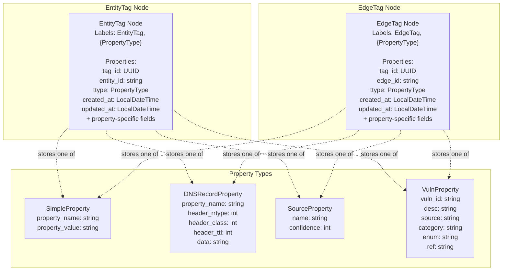
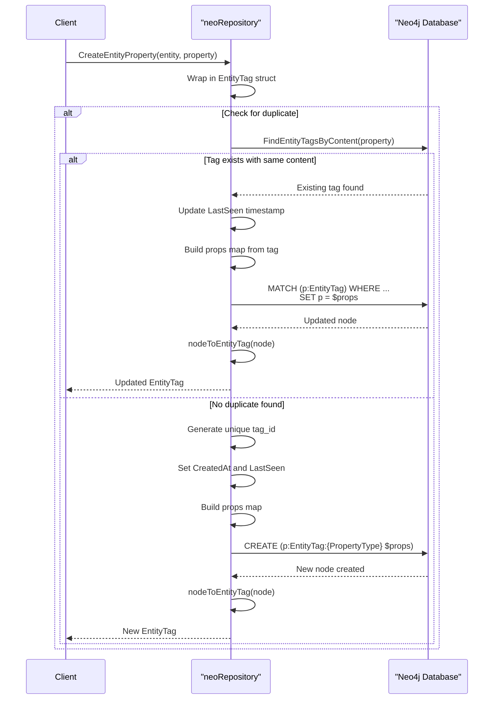
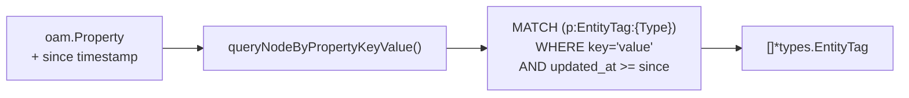
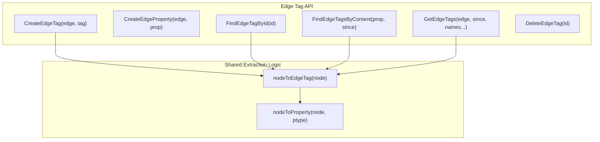
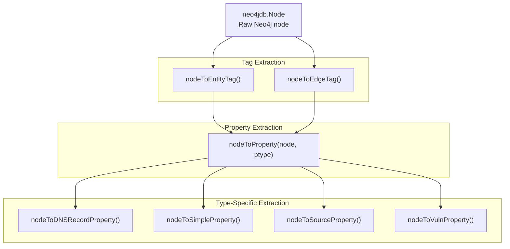
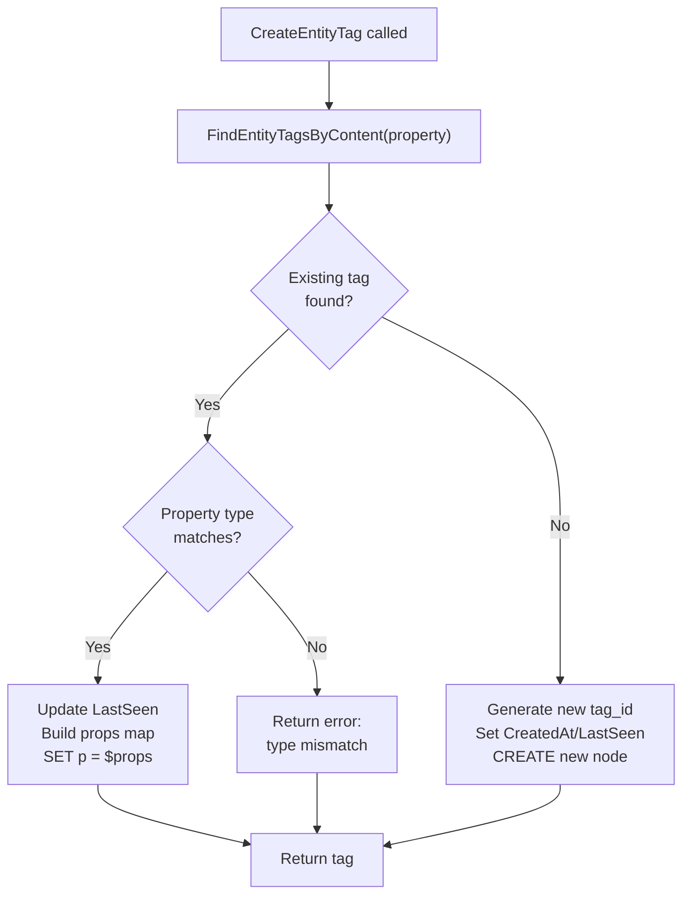

# Neo4j Tag Management

# Neo4j Tag Management

<details>
<summary>Relevant source files</summary>

The following files were used as context for generating this wiki page:

- [repository/neo4j/db.go](repository/neo4j/db.go)
- [repository/neo4j/entity_tag.go](repository/neo4j/entity_tag.go)
- [repository/neo4j/extract_property.go](repository/neo4j/extract_property.go)
- [repository/neo4j/extract_tags.go](repository/neo4j/extract_tags.go)
- [repository/neo4j/tag_test.go](repository/neo4j/tag_test.go)
- [repository/sqlrepo/db.go](repository/sqlrepo/db.go)

</details>


## Purpose and Scope

This document covers tag management operations in the Neo4j repository implementation. Tags are metadata properties attached to entities and edges, implemented as separate nodes in the Neo4j graph database. Tags use the Open Asset Model (OAM) property types to provide structured, type-safe metadata storage.

For entity and edge operations themselves, see [Neo4j Entity Operations](#5.1) and [Neo4j Edge Operations](#5.2). For schema initialization including tag node constraints, see [Neo4j Schema and Constraints](#5.4).

**Sources:** [repository/neo4j/entity_tag.go](), [repository/neo4j/extract_tags.go]()

---

## Tag Data Model

### Core Tag Types

Tags in Neo4j are represented as separate nodes with relationships to their parent entities or edges. The system supports two tag types:

| Tag Type | Purpose | Parent Relationship | Node Label Pattern |
|----------|---------|-------------------|-------------------|
| `EntityTag` | Properties attached to entities | Links to Entity node via `entity_id` | `:EntityTag:{PropertyType}` |
| `EdgeTag` | Properties attached to edges | Links to Edge relationship via `edge_id` | `:EdgeTag:{PropertyType}` |

Both tag types share a common structure defined in the `types` package:

```
EntityTag {
  ID        string         // Unique tag identifier (tag_id)
  CreatedAt time.Time      // Initial creation timestamp
  LastSeen  time.Time      // Most recent update timestamp
  Property  oam.Property   // OAM property instance
  Entity    *types.Entity  // Reference to parent entity
}

EdgeTag {
  ID        string         // Unique tag identifier (tag_id)
  CreatedAt time.Time      // Initial creation timestamp
  LastSeen  time.Time      // Most recent update timestamp
  Property  oam.Property   // OAM property instance
  Edge      *types.Edge    // Reference to parent edge
}
```

**Sources:** [repository/neo4j/entity_tag.go:19-23](), [repository/neo4j/extract_tags.go:13-54]()

### Neo4j Node Structure

Tags are stored as nodes with multiple labels for efficient querying:



The dual-label system (`:EntityTag:{PropertyType}`) enables:
- Fast filtering by tag type (EntityTag vs EdgeTag)
- Type-specific queries without scanning all tags
- Efficient property content matching

**Sources:** [repository/neo4j/entity_tag.go:96](), [repository/neo4j/extract_property.go:17-39]()

---

## Entity Tag Operations

### Tag Creation with Duplicate Handling

The `CreateEntityTag` and `CreateEntityProperty` functions implement sophisticated duplicate detection and timestamp updating:



**Key Implementation Details:**

| Function | Purpose | Cypher Pattern |
|----------|---------|----------------|
| `CreateEntityTag` | Main tag creation | `CREATE (p:EntityTag:{PropertyType} $props)` |
| `CreateEntityProperty` | Convenience wrapper | Delegates to `CreateEntityTag` |
| `uniqueEntityTagID` | Generate unique UUID | Loop until `FindEntityTagById` fails |
| `entityTagPropsMap` | Serialize tag to map | Flatten Property fields to node properties |

The duplicate detection strategy at [repository/neo4j/entity_tag.go:30-75]() ensures:
1. Properties with identical content reuse existing tags
2. `LastSeen` timestamp is updated on duplicates
3. Property type must match for updates
4. `CreatedAt` remains unchanged for duplicates

**Sources:** [repository/neo4j/entity_tag.go:19-126](), [repository/neo4j/entity_tag.go:136-143]()

### Finding Tags by ID

`FindEntityTagById` retrieves a specific tag using its unique identifier:

```
Query: MATCH (p:EntityTag {tag_id: $tid}) RETURN p
```

The function at [repository/neo4j/entity_tag.go:148-173]():
1. Executes parameterized Cypher query with 30-second timeout
2. Returns error if no records found
3. Extracts node from result record
4. Calls `nodeToEntityTag` for property deserialization

**Sources:** [repository/neo4j/entity_tag.go:145-173]()

### Content-Based Tag Search

`FindEntityTagsByContent` searches for tags matching a specific property value:



The `queryNodeByPropertyKeyValue` helper function (defined elsewhere in the codebase) constructs type-specific MATCH patterns. For example, a `SimpleProperty` with `name="test"` and `value="foo"` generates:

```
MATCH (p:EntityTag:SimpleProperty {property_name: 'test', property_value: 'foo'})
```

Time filtering is applied when `since` is non-zero:
```
WHERE p.updated_at >= localDateTime('2025-01-15T10:30:00')
```

**Sources:** [repository/neo4j/entity_tag.go:175-218]()

### Retrieving All Entity Tags

`GetEntityTags` fetches all tags for a specific entity with optional filtering:

| Parameter | Type | Purpose |
|-----------|------|---------|
| `entity` | `*types.Entity` | Parent entity to query |
| `since` | `time.Time` | Filter by update timestamp (ignored if zero) |
| `names` | `...string` | Optional property names to filter (returns all if empty) |

**Query Patterns:**

```cypher
# Without time filter
MATCH (p:EntityTag {entity_id: '{entity.ID}'}) RETURN p

# With time filter
MATCH (p:EntityTag {entity_id: '{entity.ID}'})
WHERE p.updated_at >= localDateTime('{since}')
RETURN p
```

Post-query filtering at [repository/neo4j/entity_tag.go:258-271]() applies the `names` parameter in-memory by comparing `Property.Name()` against the provided list.

**Sources:** [repository/neo4j/entity_tag.go:220-280]()

### Tag Deletion

`DeleteEntityTag` removes a tag node completely:

```cypher
MATCH (n:EntityTag {tag_id: $tid})
DETACH DELETE n
```

The `DETACH DELETE` ensures any relationships to the tag are also removed, maintaining graph integrity.

**Sources:** [repository/neo4j/entity_tag.go:282-299]()

---

## Edge Tag Operations

Edge tag operations mirror entity tag operations with different node labels and parent relationships. The implementation follows the same patterns but uses `:EdgeTag` labels and `edge_id` properties instead of `entity_id`.

**Key Functions:**



The implementation reuses the same property extraction logic as entity tags, differing only in:
- Node label: `:EdgeTag` instead of `:EntityTag`
- Parent reference field: `edge_id` instead of `entity_id`
- Return type: `*types.EdgeTag` instead of `*types.EntityTag`

**Sources:** [repository/neo4j/tag_test.go:87-165](), [repository/neo4j/extract_tags.go:56-97]()

---

## Property Extraction System

### Converting Neo4j Nodes to Tags

The extraction functions transform Neo4j nodes back into Go structs:



**Extraction Flow:**

1. **Read Common Fields** - Extract `tag_id`, `entity_id`/`edge_id`, timestamps
2. **Determine Property Type** - Read `ttype` field to identify OAM property type
3. **Dispatch to Type Handler** - Call appropriate `nodeTo{Type}Property` function
4. **Assemble Tag Struct** - Combine extracted data into `EntityTag` or `EdgeTag`

**Sources:** [repository/neo4j/extract_tags.go:13-97](), [repository/neo4j/extract_property.go:17-155]()

### Property Type Handlers

Each OAM property type has a dedicated extraction function:

| Property Type | Extractor Function | Key Fields Extracted |
|---------------|-------------------|---------------------|
| `DNSRecordProperty` | `nodeToDNSRecordProperty` | `property_name`, `header_rrtype`, `header_class`, `header_ttl`, `data` |
| `SimpleProperty` | `nodeToSimpleProperty` | `property_name`, `property_value` |
| `SourceProperty` | `nodeToSourceProperty` | `name`, `confidence` |
| `VulnProperty` | `nodeToVulnProperty` | `vuln_id`, `desc`, `source`, `category`, `enum`, `ref` |

**Example: SimpleProperty Extraction**

[repository/neo4j/extract_property.go:81-96]() demonstrates the straightforward extraction:

```
1. Call neo4jdb.GetProperty[string](node, "property_name")
2. Call neo4jdb.GetProperty[string](node, "property_value")
3. Return &general.SimpleProperty with both fields
```

Each extractor uses `neo4jdb.GetProperty[T]` for type-safe property access. Errors propagate upward if required fields are missing.

**Sources:** [repository/neo4j/extract_property.go:41-155]()

---

## Time Management

### Timestamp Fields

Tags maintain two timestamps for tracking:

| Field | Purpose | Update Strategy |
|-------|---------|-----------------|
| `CreatedAt` | Initial creation time | Set once, never updated |
| `LastSeen` | Most recent observation | Updated on every duplicate detection |

Both timestamps use Neo4j's `LocalDateTime` type for storage, converted via helper functions:

```
Go time.Time --> Neo4j LocalDateTime: timeToNeo4jTime(t)
Neo4j LocalDateTime --> Go time.Time: neo4jTimeToTime(t)
```

**Timestamp Behavior in Queries:**

```cypher
# Time filter format
WHERE p.updated_at >= localDateTime('2025-01-15T10:30:00.123456789')
```

The `since` parameter in query functions filters tags by `updated_at` (alias for `LastSeen`), enabling temporal queries for recently modified tags.

**Sources:** [repository/neo4j/entity_tag.go:188](), [repository/neo4j/extract_tags.go:24-34]()

---

## Duplicate Detection Strategy

### Content Matching Logic

The duplicate detection system at [repository/neo4j/entity_tag.go:30-75]() prevents redundant tag creation:



**Property Type Validation:**

The check at [repository/neo4j/entity_tag.go:33-35]() ensures type consistency:
```
if input.Property.PropertyType() != t.Property.PropertyType() {
    return error
}
```

This prevents a `SimpleProperty` from updating a `DNSRecordProperty` with the same name, maintaining data integrity.

**Sources:** [repository/neo4j/entity_tag.go:29-76]()

---

## Test Coverage

The integration tests in [repository/neo4j/tag_test.go]() verify:

| Test Case | Coverage |
|-----------|----------|
| `TestEntityTag` | Full lifecycle: create, find, duplicate handling, timestamp updates, query by name, deletion |
| `TestEdgeTag` | Parallel verification for edge tags |

**Key Test Scenarios:**

1. **Initial Creation** - Verify `CreatedAt` and `LastSeen` are set correctly
2. **Duplicate Detection** - Second creation with same property updates `LastSeen` only
3. **Value Change** - New property value creates new tag with later `CreatedAt`
4. **Filtered Retrieval** - `GetEntityTags` with name filter returns correct subset
5. **Deletion** - Tag removal and subsequent lookup failure

**Sources:** [repository/neo4j/tag_test.go:20-165]()