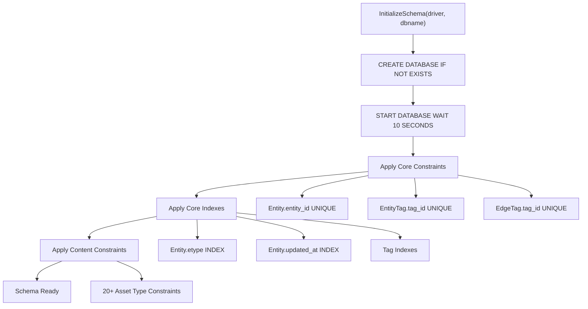
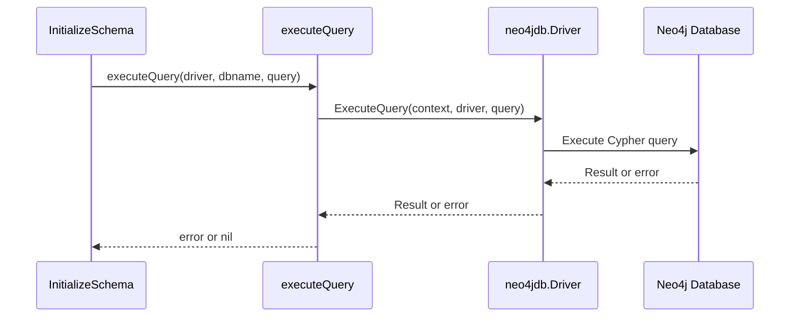
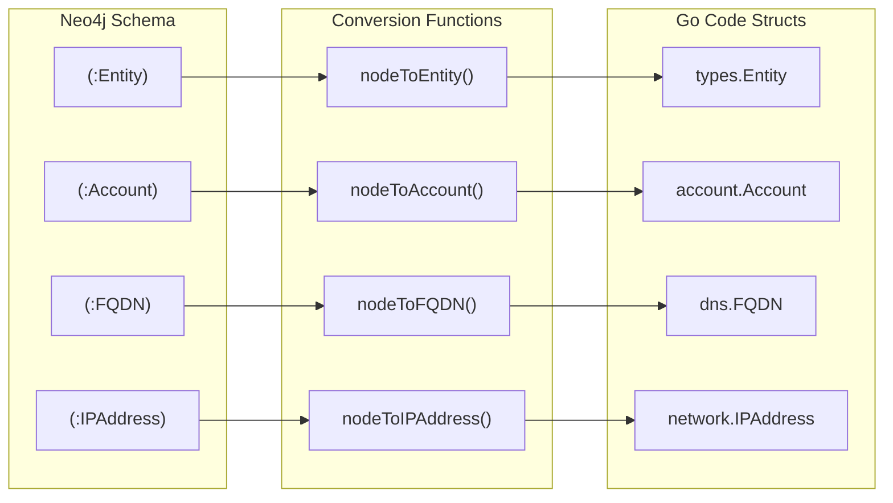
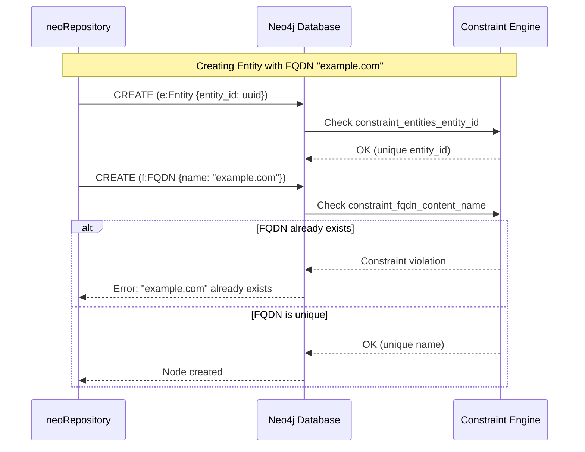
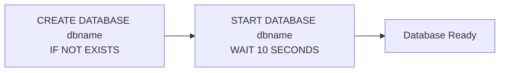
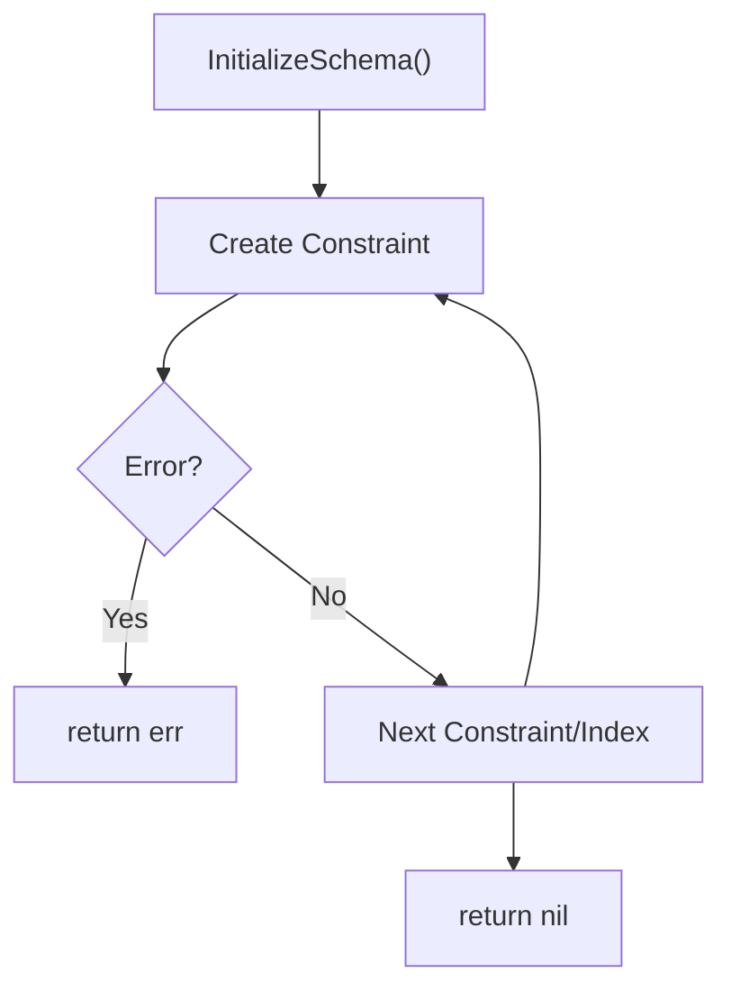
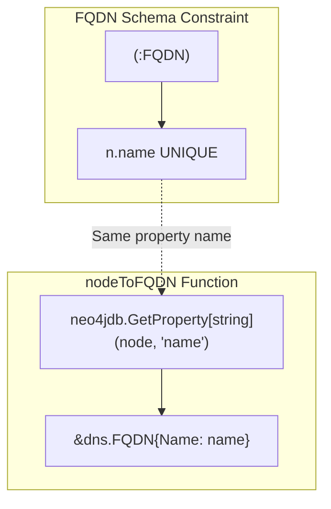

# Neo4j Schema and Constraints

# Neo4j Schema and Constraints

Relevant source files

The following files were used as context for generating this wiki page:

- [migrations/neo4j/schema.go](migrations/neo4j/schema.go)
- [repository/neo4j/extract_entity.go](repository/neo4j/extract_entity.go)

This page documents the Neo4j schema initialization system, including uniqueness constraints, range indexes, and database creation. It covers how the Neo4j repository ensures data integrity and query performance through structured schema definitions.

For details on how these constraints are used during entity, edge, and tag operations, see [Neo4j Entity Operations](#5.1), [Neo4j Edge Operations](#5.2), and [Neo4j Tag Management](#5.3). For broader migration system context, see [Neo4j Schema Initialization](#7.2).

## Schema Initialization Overview

The Neo4j schema is initialized through the `InitializeSchema` function, which creates the database, establishes constraints, and defines indexes. This initialization occurs automatically when a new Neo4j repository is created via `assetdb.New`.

**Sources:** [migrations/neo4j/schema.go:13-73]()

### Initialization Flow

**Sources:** [migrations/neo4j/schema.go:13-73]()

## Core Schema Components

The Neo4j schema defines three primary node types with associated constraints and indexes:

### Entity Nodes

| Property | Constraint Type | Purpose |
|----------|----------------|---------|
| `entity_id` | UNIQUE | Ensures each entity has a unique identifier |
| `etype` | RANGE INDEX | Enables efficient queries by asset type |
| `updated_at` | RANGE INDEX | Supports temporal queries and filtering |

**Sources:** [migrations/neo4j/schema.go:17-30]()

### EntityTag Nodes

| Property | Constraint Type | Purpose |
|----------|----------------|---------|
| `tag_id` | UNIQUE | Ensures each tag has a unique identifier |
| `ttype` | RANGE INDEX | Enables queries by property type |
| `updated_at` | RANGE INDEX | Supports temporal filtering |
| `entity_id` | RANGE INDEX | Optimizes tag lookup by entity |

**Sources:** [migrations/neo4j/schema.go:32-50]()

### EdgeTag Nodes

| Property | Constraint Type | Purpose |
|----------|----------------|---------|
| `tag_id` | UNIQUE | Ensures each tag has a unique identifier |
| `ttype` | RANGE INDEX | Enables queries by property type |
| `updated_at` | RANGE INDEX | Supports temporal filtering |
| `edge_id` | RANGE INDEX | Optimizes tag lookup by edge |

**Sources:** [migrations/neo4j/schema.go:52-70]()

## Constraint Implementation Details

The schema uses Cypher's `CREATE CONSTRAINT` syntax with the `IF NOT EXISTS` clause to ensure idempotent initialization.

```mermaid
graph TB
    subgraph "Entity Constraint"
        EntityNode["(:Entity)"]
        EntityProp["n.entity_id"]
        EntityConstraint["constraint_entities_entity_id"]
        
        EntityNode --> EntityProp
        EntityProp --> EntityConstraint
    end
    
    subgraph "EntityTag Constraint"
        TagNode["(:EntityTag)"]
        TagProp["n.tag_id"]
        TagConstraint["constraint_enttag_tag_id"]
        
        TagNode --> TagProp
        TagProp --> TagConstraint
    end
    
    subgraph "EdgeTag Constraint"
        EdgeTagNode["(:EdgeTag)"]
        EdgeTagProp["n.tag_id"]
        EdgeTagConstraint["constraint_edgetag_tag_id"]
        
        EdgeTagNode --> EdgeTagProp
        EdgeTagProp --> EdgeTagConstraint
    end
```

**Sources:** [migrations/neo4j/schema.go:17-20](), [migrations/neo4j/schema.go:32-35](), [migrations/neo4j/schema.go:52-55]()

### executeQuery Helper

The `executeQuery` function provides a wrapper around Neo4j's `ExecuteQuery` API, abstracting the context and transaction handling:

**Sources:** [migrations/neo4j/schema.go:218-222]()

## Content-Specific Constraints

Each Open Asset Model asset type has its own constraint ensuring uniqueness on a natural key property. The `entitiesContentIndexes` function defines constraints for all 21 supported asset types.

### Asset Type Constraint Mapping

| Asset Type | Node Label | Unique Property | Constraint Name |
|------------|-----------|-----------------|-----------------|
| `Account` | `:Account` | `unique_id` | `constraint_account_content_unique_id` |
| `AutnumRecord` | `:AutnumRecord` | `handle`, `number` | `constraint_autnum_content_handle`, `constraint_autnum_content_number` |
| `AutonomousSystem` | `:AutonomousSystem` | `number` | `constraint_autsys_content_number` |
| `ContactRecord` | `:ContactRecord` | `discovered_at` | `constraint_contact_record_content_discovered_at` |
| `DomainRecord` | `:DomainRecord` | `domain` | `constraint_domainrec_content_domain` |
| `File` | `:File` | `url` | `constraint_file_content_url` |
| `FQDN` | `:FQDN` | `name` | `constraint_fqdn_content_name` |
| `FundsTransfer` | `:FundsTransfer` | `unique_id` | `constraint_ft_content_unique_id` |
| `Identifier` | `:Identifier` | `unique_id` | `constraint_identifier_content_unique_id` |
| `IPAddress` | `:IPAddress` | `address` | `constraint_ipaddr_content_address` |
| `IPNetRecord` | `:IPNetRecord` | `handle` | `constraint_ipnetrec_content_handle` |
| `Location` | `:Location` | `address` | `constraint_location_content_name` |
| `Netblock` | `:Netblock` | `cidr` | `constraint_netblock_content_cidr` |
| `Organization` | `:Organization` | `unique_id` | `constraint_org_content_id` |
| `Person` | `:Person` | `unique_id` | `constraint_person_content_id` |
| `Phone` | `:Phone` | `e164`, `raw` | `constraint_phone_content_e164`, `constraint_phone_content_raw` |
| `Product` | `:Product` | `unique_id` | `constraint_product_content_id` |
| `ProductRelease` | `:ProductRelease` | `name` | `constraint_productrelease_content_name` |
| `Service` | `:Service` | `unique_id` | `constraint_service_content_id` |
| `TLSCertificate` | `:TLSCertificate` | `serial_number` | `constraint_tls_content_serial_number` |
| `URL` | `:URL` | `url` | `constraint_url_content_url` |

**Sources:** [migrations/neo4j/schema.go:75-216]()

### Additional Content Indexes

Beyond uniqueness constraints, certain asset types have additional range indexes for frequently queried properties:

| Asset Type | Indexed Property | Purpose |
|------------|------------------|---------|
| `IPNetRecord` | `cidr` | Efficient CIDR range queries |
| `Organization` | `name`, `legal_name` | Name-based searches |
| `Person` | `full_name` | Name-based searches |
| `Product` | `product_name` | Name-based searches |

**Sources:** [migrations/neo4j/schema.go:131-134](), [migrations/neo4j/schema.go:156-163](), [migrations/neo4j/schema.go:171-173](), [migrations/neo4j/schema.go:191-193]()

## Schema-to-Code Mapping

**Sources:** [repository/neo4j/extract_entity.go:29-111](), [repository/neo4j/extract_entity.go:113-152](), [repository/neo4j/extract_entity.go:337-344](), [repository/neo4j/extract_entity.go:446-466]()

## Constraint Enforcement

Neo4j enforces these constraints at write time, preventing duplicate entities and ensuring data integrity:

**Sources:** [migrations/neo4j/schema.go:111-114]()

## Index Types and Performance

Neo4j uses **range indexes** for all non-constraint indexes, enabling efficient range queries, equality checks, and sorting operations.

### Index Usage Patterns

| Index | Query Pattern | Example Cypher |
|-------|--------------|----------------|
| `entities_range_index_etype` | Filter by asset type | `MATCH (e:Entity) WHERE e.etype = 'FQDN'` |
| `entities_range_index_updated_at` | Temporal queries | `MATCH (e:Entity) WHERE e.updated_at > datetime('2024-01-01')` |
| `enttag_range_index_entity_id` | Tag lookup | `MATCH (t:EntityTag) WHERE t.entity_id = $id` |
| `org_range_index_name` | Name searches | `MATCH (o:Organization) WHERE o.name CONTAINS 'Example'` |

**Sources:** [migrations/neo4j/schema.go:22-29](), [migrations/neo4j/schema.go:37-49](), [migrations/neo4j/schema.go:156-159]()

## Database Creation

The initialization process begins by ensuring the database exists and is started:

These commands are executed with best-effort error handling (errors are ignored) since the database may already exist or be started.

**Sources:** [migrations/neo4j/schema.go:14-15]()

## Error Handling

The schema initialization uses fail-fast error handling for constraints and indexes. If any constraint or index creation fails, the entire initialization process returns an error, preventing partial schema states.

**Sources:** [migrations/neo4j/schema.go:17-70]()

## Property Extraction from Nodes

The schema's property names directly correspond to the `neo4jdb.GetProperty` calls in entity extraction functions:

**Sources:** [migrations/neo4j/schema.go:111-114](), [repository/neo4j/extract_entity.go:337-344]()

## Multi-Property Constraints

Some asset types require multiple unique constraints to ensure different forms of the same data are treated as distinct:

### Phone Number Example

The `Phone` asset type has two separate uniqueness constraints:
- `constraint_phone_content_e164` on the standardized E.164 format
- `constraint_phone_content_raw` on the raw input string

This allows the same phone number to exist in multiple formats while preventing exact duplicates.

**Sources:** [migrations/neo4j/schema.go:176-184]()

### AutnumRecord Example

The `AutnumRecord` asset type has two constraints:
- `constraint_autnum_content_handle` on the registry handle
- `constraint_autnum_content_number` on the AS number

This prevents duplicates by both registry identifier and numeric AS value.

**Sources:** [migrations/neo4j/schema.go:81-89]()