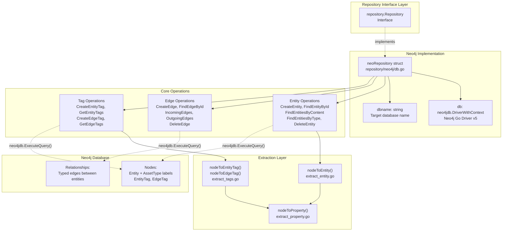
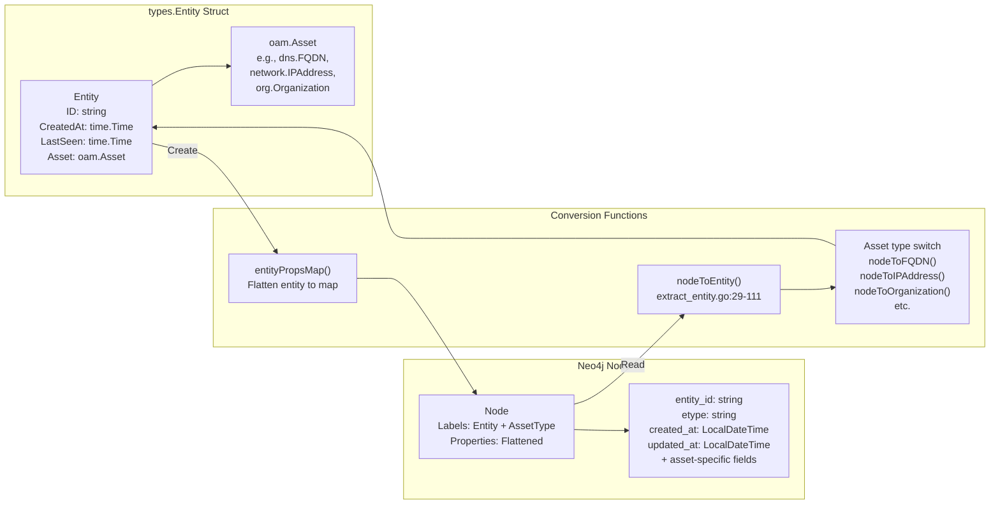
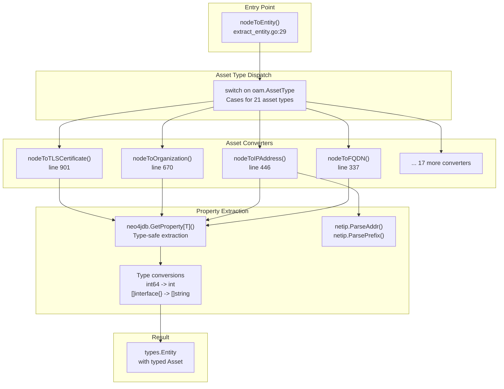

# Neo4j Repository

# Neo4j Repository

<details>
<summary>Relevant source files</summary>

The following files were used as context for generating this wiki page:

- [migrations/neo4j/schema.go](migrations/neo4j/schema.go)
- [repository/neo4j/db.go](repository/neo4j/db.go)
- [repository/neo4j/entity.go](repository/neo4j/entity.go)
- [repository/neo4j/extract_entity.go](repository/neo4j/extract_entity.go)
- [repository/neo4j/extract_property.go](repository/neo4j/extract_property.go)
- [repository/neo4j/extract_tags.go](repository/neo4j/extract_tags.go)
- [repository/sqlrepo/db.go](repository/sqlrepo/db.go)

</details>


## Purpose and Scope

The Neo4j Repository provides a graph database implementation of the Repository interface, enabling asset storage and retrieval using Neo4j's native graph data model. This implementation leverages Neo4j's Cypher query language and graph traversal capabilities to efficiently manage entities, edges, and their associated tags.

This page covers the Neo4j repository architecture, connection management, data model mapping, and query patterns. For detailed operation-level documentation, see:
- Entity operations: [Neo4j Entity Operations](#5.1)
- Edge operations: [Neo4j Edge Operations](#5.2)
- Tag operations: [Neo4j Tag Management](#5.3)
- Schema and constraints: [Neo4j Schema and Constraints](#5.4)

For SQL-based implementations, see [SQL Repository](#4).

**Sources:** [repository/neo4j/db.go:1-70](), [repository/neo4j/entity.go:1-283]()

---

## Repository Implementation Structure

The `neoRepository` struct implements the `Repository` interface using the Neo4j Go Driver. It maintains a driver connection and database name for all operations.



**Sources:** [repository/neo4j/db.go:20-70](), [repository/neo4j/entity.go:1-283](), [repository/neo4j/extract_entity.go:1-1064]()

---

## Connection and Initialization

The `New()` function creates a `neoRepository` instance by parsing the DSN, establishing a driver connection, and verifying connectivity.

### DSN Format

The DSN format is: `neo4j://[username:password@]host[:port]/database`

### Connection Configuration

| Parameter | Value | Description |
|-----------|-------|-------------|
| `MaxConnectionPoolSize` | 20 | Maximum concurrent connections |
| `MaxConnectionLifetime` | 1 hour | Connection lifetime before refresh |
| `ConnectionLivenessCheckTimeout` | 10 minutes | Timeout for liveness checks |

```mermaid
sequenceDiagram
    participant Client
    participant New["New() function<br/>db.go:27-59"]
    participant URLParse["url.Parse()<br/>DSN parsing"]
    participant Driver["neo4jdb.NewDriverWithContext()<br/>Driver creation"]
    participant Verify["driver.VerifyConnectivity()<br/>Connection test"]
    participant Repo["neoRepository"]
    
    Client->>New: New(dbtype, dsn)
    New->>URLParse: Parse DSN
    URLParse-->>New: URL components
    New->>New: Extract auth credentials
    New->>New: Extract database name from path
    New->>Driver: Create driver with config
    Driver-->>New: neo4jdb.DriverWithContext
    New->>Verify: Test connectivity (5s timeout)
    alt Connection successful
        Verify-->>New: nil error
        New->>Repo: Create neoRepository
        Repo-->>Client: Return repository
    else Connection failed
        Verify-->>New: error
        New-->>Client: Return error
    end
```

**Sources:** [repository/neo4j/db.go:26-59]()

---

## Entity-to-Node Mapping

Entities are stored as Neo4j nodes with dual labels: a base `Entity` label and an asset-specific type label (e.g., `FQDN`, `IPAddress`, `Organization`). All asset properties are flattened into node properties.

### Node Structure

Each entity node contains:
- **entity_id**: Unique identifier (constrained)
- **etype**: Asset type string
- **created_at**: Creation timestamp (LocalDateTime)
- **updated_at**: Last seen timestamp (LocalDateTime)
- **Asset-specific properties**: Flattened from OAM asset structure



### Supported Asset Types

The `nodeToEntity()` function supports conversion for all OAM asset types:

| Asset Type | Converter Function | Unique Key Property |
|------------|-------------------|---------------------|
| `Account` | `nodeToAccount()` | `unique_id` |
| `AutnumRecord` | `nodeToAutnumRecord()` | `handle`, `number` |
| `AutonomousSystem` | `nodeToAutonomousSystem()` | `number` |
| `ContactRecord` | `nodeToContactRecord()` | `discovered_at` |
| `DomainRecord` | `nodeToDomainRecord()` | `domain` |
| `File` | `nodeToFile()` | `url` |
| `FQDN` | `nodeToFQDN()` | `name` |
| `FundsTransfer` | `nodeToFundsTransfer()` | `unique_id` |
| `Identifier` | `nodeToIdentifier()` | `unique_id` |
| `IPAddress` | `nodeToIPAddress()` | `address` |
| `IPNetRecord` | `nodeToIPNetRecord()` | `handle` |
| `Location` | `nodeToLocation()` | `address` |
| `Netblock` | `nodeToNetblock()` | `cidr` |
| `Organization` | `nodeToOrganization()` | `unique_id` |
| `Person` | `nodeToPerson()` | `unique_id` |
| `Phone` | `nodeToPhone()` | `e164`, `raw` |
| `Product` | `nodeToProduct()` | `unique_id` |
| `ProductRelease` | `nodeToProductRelease()` | `name` |
| `Service` | `nodeToService()` | `unique_id` |
| `TLSCertificate` | `nodeToTLSCertificate()` | `serial_number` |
| `URL` | `nodeToURL()` | `url` |

**Sources:** [repository/neo4j/extract_entity.go:29-1063]()

---

## Cypher Query Patterns

The Neo4j repository uses standardized Cypher query patterns for consistency and performance.

### Entity Creation Pattern

```
CREATE (a:Entity:{AssetType} $props) RETURN a
```

Example for FQDN:
```cypher
CREATE (a:Entity:FQDN {
  entity_id: "uuid-here",
  etype: "FQDN",
  created_at: localdatetime(),
  updated_at: localdatetime(),
  name: "example.com"
}) RETURN a
```

### Entity Retrieval Patterns

| Operation | Cypher Pattern |
|-----------|---------------|
| By ID | `MATCH (a:Entity {entity_id: $eid}) RETURN a` |
| By Content | `MATCH (a:{AssetType} {key: value}) RETURN a` |
| By Type | `MATCH (a:{AssetType}) RETURN a` |
| By Type + Since | `MATCH (a:{AssetType}) WHERE a.updated_at >= localDateTime($since) RETURN a` |

### Entity Update Pattern

```cypher
MATCH (a:Entity {entity_id: $eid})
SET a = $props
RETURN a
```

### Entity Deletion Pattern

```cypher
MATCH (n:Entity {entity_id: $eid})
DETACH DELETE n
```

The `DETACH DELETE` ensures all relationships are removed before node deletion.

**Sources:** [repository/neo4j/entity.go:94-99](), [repository/neo4j/entity.go:150-155](), [repository/neo4j/entity.go:223-226](), [repository/neo4j/entity.go:272-278]()

---

## Duplicate Prevention Strategy

The repository prevents duplicate entities by checking for existing entities before creation. When a duplicate is detected, the existing entity's `updated_at` timestamp is refreshed rather than creating a new node.

```mermaid
sequenceDiagram
    participant Client
    participant CreateEntity["CreateEntity()<br/>entity.go:23-124"]
    participant FindContent["FindEntitiesByContent()"]
    participant UpdateNode["MATCH + SET query"]
    participant CreateNode["CREATE query"]
    participant ExtractNode["nodeToEntity()"]
    
    Client->>CreateEntity: CreateEntity(input)
    CreateEntity->>FindContent: Check for existing entity
    alt Entity exists
        FindContent-->>CreateEntity: Existing entity found
        CreateEntity->>CreateEntity: Validate asset type match
        CreateEntity->>UpdateNode: Update existing node timestamp
        UpdateNode-->>CreateEntity: Updated node
        CreateEntity->>ExtractNode: Convert to Entity
        ExtractNode-->>Client: Return existing entity
    else Entity not found
        FindContent-->>CreateEntity: No entity found
        CreateEntity->>CreateEntity: Generate UUID if needed
        CreateEntity->>CreateEntity: Set timestamps
        CreateEntity->>CreateNode: CREATE new node
        CreateNode-->>CreateEntity: New node
        CreateEntity->>ExtractNode: Convert to Entity
        ExtractNode-->>Client: Return new entity
    end
```

**Sources:** [repository/neo4j/entity.go:29-75]()

---

## Time Handling

Neo4j uses `LocalDateTime` for timestamp storage, which doesn't include timezone information. The repository converts between Go's `time.Time` and Neo4j's `LocalDateTime` format.

### Conversion Functions

**Go Time to Neo4j Format:**
```go
func timeToNeo4jTime(t time.Time) string {
    return t.Format("2006-01-02T15:04:05")
}
```

**Neo4j Format to Go Time:**
```go
func neo4jTimeToTime(t neo4jdb.LocalDateTime) time.Time {
    return time.Date(
        t.Year(), time.Month(t.Month()), t.Day(),
        t.Hour(), t.Minute(), t.Second(),
        t.Nanosecond(), time.UTC,
    )
}
```

All timestamps are stored and compared in UTC.

**Sources:** Referenced in [repository/neo4j/entity.go:35-45](), [repository/neo4j/extract_entity.go:35-39]()

---

## Property Extraction Pipeline

The property extraction pipeline converts Neo4j node properties back into typed Go structures. This is a multi-stage process that handles different property types.



### Error Handling

Each property extraction uses `neo4jdb.GetProperty[T]()` which returns an error if:
- The property doesn't exist on the node
- The property type doesn't match the expected type `T`

All errors are propagated up the call stack, ensuring that malformed data is never silently ignored.

**Sources:** [repository/neo4j/extract_entity.go:29-111](), [repository/neo4j/extract_entity.go:337-343](), [repository/neo4j/extract_entity.go:446-465]()

---

## Context and Timeout Management

All Neo4j operations use context-based timeouts for reliability. The standard timeout is 30 seconds for query execution.

```go
ctx, cancel := context.WithTimeout(context.Background(), 30*time.Second)
defer cancel()

result, err := neo4jdb.ExecuteQuery(ctx, neo.db, query, params,
    neo4jdb.EagerResultTransformer,
    neo4jdb.ExecuteQueryWithDatabase(neo.dbname))
```

This pattern ensures:
- Operations don't hang indefinitely
- Resources are properly released via `defer cancel()`
- Database-specific queries are routed correctly via `ExecuteQueryWithDatabase()`

**Sources:** [repository/neo4j/entity.go:147-154](), [repository/neo4j/entity.go:189-194]()

---

## Database-Specific Query Execution

All queries specify the target database using `neo4jdb.ExecuteQueryWithDatabase(neo.dbname)`. This allows multi-database Neo4j deployments where different databases serve different purposes.

The database name is extracted from the DSN path during initialization:

```go
dbname := strings.TrimPrefix(u.Path, "/")
```

For example, DSN `neo4j://localhost:7687/assetdb` results in `dbname = "assetdb"`.

**Sources:** [repository/neo4j/db.go:40](), [repository/neo4j/entity.go:55](), [repository/neo4j/entity.go:98]()

---

## Summary

The Neo4j Repository implementation provides:

| Feature | Implementation |
|---------|----------------|
| **Connection Management** | Neo4j Go Driver v5 with connection pooling |
| **Data Model** | Dual-labeled nodes (Entity + AssetType) with flattened properties |
| **Query Language** | Cypher with parameterized queries |
| **Duplicate Prevention** | Content-based lookup before creation |
| **Type Safety** | Type-safe property extraction with error handling |
| **Timeout Management** | 30-second context-based timeouts |
| **Asset Type Support** | All 21 OAM asset types |
| **Schema Management** | Constraints and indexes for performance (see [Neo4j Schema and Constraints](#5.4)) |

The implementation leverages Neo4j's native graph capabilities while maintaining compatibility with the unified Repository interface, enabling seamless database backend switching.

**Sources:** [repository/neo4j/db.go:1-70](), [repository/neo4j/entity.go:1-283](), [repository/neo4j/extract_entity.go:1-1064]()