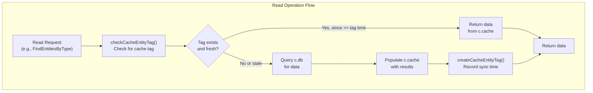
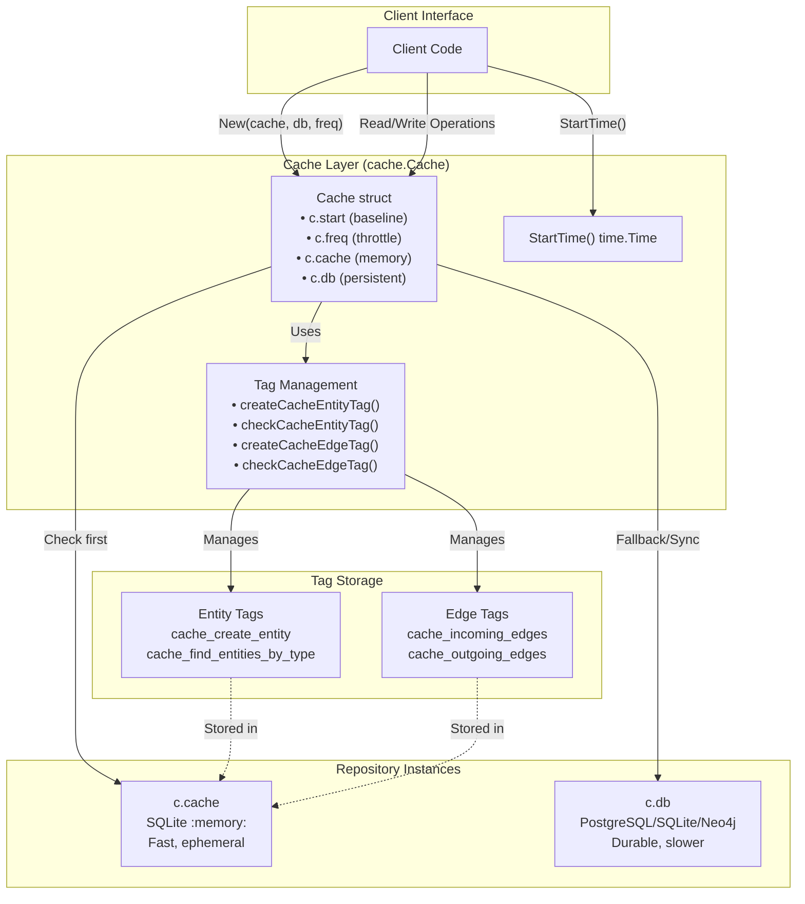
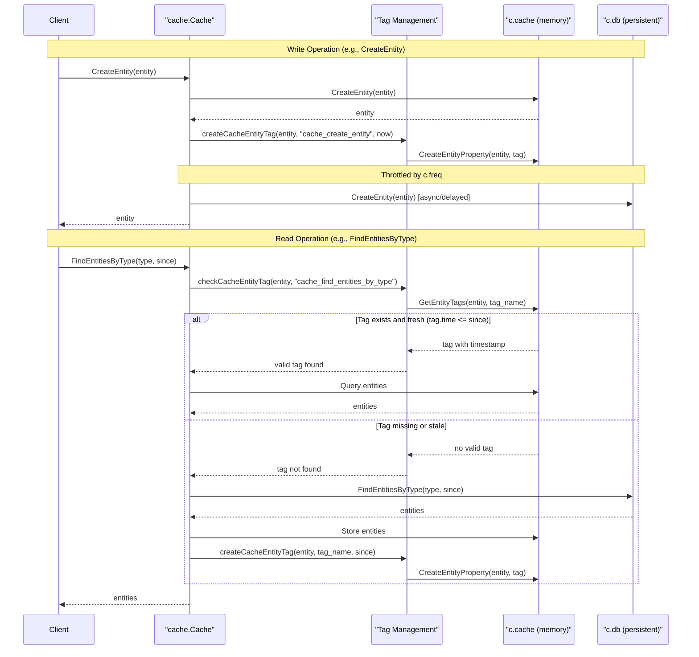

# Cache Architecture

# Cache Architecture

<details>
<summary>Relevant source files</summary>

The following files were used as context for generating this wiki page:

- [cache/cache.go](cache/cache.go)
- [cache/cache_test.go](cache/cache_test.go)
- [cache/entity_test.go](cache/entity_test.go)
- [db_test.go](db_test.go)

</details>


## Purpose and Scope

This document describes the architectural design of the caching layer in asset-db. The cache provides a performance optimization layer that wraps any repository implementation (SQL or Neo4j) with an in-memory cache. This page focuses on the core architectural patterns: the dual-repository design, tag-based cache invalidation, and frequency-based write throttling.

For specific caching operations, see:
- Entity caching operations: [6.2](#6.2)
- Edge caching operations: [6.3](#6.3)
- Tag caching operations: [6.4](#6.4)

For information about the underlying repository implementations being cached, see [3.1](#3.1) for the Repository pattern.

**Sources:** [cache/cache.go:1-81](), [cache/entity_test.go:1-405](), [cache/cache_test.go:1-87]()

---

## Overview

The caching system implements a sophisticated dual-repository architecture that provides performance optimization through intelligent cache management. The design balances three competing concerns:

1. **Performance** - Fast in-memory access to frequently used data
2. **Durability** - Persistent storage in the underlying database
3. **Consistency** - Controlled synchronization between cache and database

The cache operates transparently by implementing the `repository.Repository` interface, allowing it to be used as a drop-in replacement for any repository implementation.

**Sources:** [cache/cache.go:15-20](), [cache/cache_test.go:22-25]()

---

## Dual Repository Pattern

### Architecture

The `Cache` struct maintains two separate repository instances:

```go
type Cache struct {
    start time.Time              // Baseline timestamp for temporal queries
    freq  time.Duration           // Throttling frequency for DB writes
    cache repository.Repository   // In-memory repository (fast)
    db    repository.Repository   // Persistent repository (durable)
}
```

**Sources:** [cache/cache.go:15-20]()

### Repository Roles

| Repository | Purpose | Storage | Speed | Durability |
|-----------|---------|---------|-------|------------|
| `c.cache` | Fast data access, temporary storage | In-memory (SQLite `:memory:`) | Very fast | Ephemeral |
| `c.db` | Persistent data storage, source of truth | File-based or remote DB | Slower | Durable |

The dual pattern operates as follows:

1. **Reads** check `c.cache` first (cache-aside pattern)
2. On cache miss, data is fetched from `c.db` and populated into `c.cache`
3. **Writes** go immediately to `c.cache`
4. Writes to `c.db` are throttled based on the `c.freq` duration

**Sources:** [cache/cache.go:15-20](), [cache/cache_test.go:69-86]()

### Construction

The cache is constructed using the `New` function:

```go
func New(cache, database repository.Repository, freq time.Duration) (*Cache, error)
```

**Parameters:**
- `cache` - In-memory repository (typically SQLite in-memory)
- `database` - Persistent repository (PostgreSQL, SQLite file, or Neo4j)
- `freq` - Frequency duration for throttling database writes

**Example from tests:**

```
cache, err := assetdb.New(sqlrepo.SQLiteMemory, "")  // In-memory
db, err := assetdb.New(sqlrepo.SQLite, "assetdb.sqlite")  // Persistent
c, err := New(cache, db, time.Minute)  // 1-minute write throttling
```

**Sources:** [cache/cache.go:22-31](), [cache/cache_test.go:69-86](), [cache/entity_test.go:29-31]()

---

## Tag-Based Invalidation System

### Cache Tag Mechanism

The cache uses entity and edge tags to track when data was last synchronized between `c.cache` and `c.db`. Each synchronized operation creates a tag with a timestamp indicating when the synchronization occurred.

### Cache Tag Structure

Cache tags are regular entity/edge tags with specific naming conventions and timestamp values:

| Field | Value |
|-------|-------|
| Property Name | Operation-specific identifier (e.g., `cache_create_entity`) |
| Property Value | RFC3339Nano formatted timestamp |
| Property Type | `general.SimpleProperty` |

**Sources:** [cache/cache.go:48-54](), [cache/cache.go:65-71]()

### Standard Cache Tag Names

The following cache tag names are used by the system:

| Tag Name | Purpose | Applied To |
|----------|---------|------------|
| `cache_create_entity` | Tracks entity creation synchronization | Entity |
| `cache_create_asset` | Tracks asset creation synchronization | Entity |
| `cache_find_entities_by_type` | Tracks type-based query synchronization | Entity |
| `cache_incoming_edges` | Tracks incoming edge query synchronization | Entity |
| `cache_outgoing_edges` | Tracks outgoing edge query synchronization | Entity |

**Sources:** [cache/entity_test.go:50-52](), [cache/entity_test.go:99-101](), [cache/entity_test.go:313-314]()

### Tag Management Methods

The cache provides internal methods for managing cache tags:

**For Entity Tags:**
```go
func (c *Cache) createCacheEntityTag(entity *types.Entity, name string, since time.Time) error
func (c *Cache) checkCacheEntityTag(entity *types.Entity, name string) (*types.EntityTag, time.Time, bool)
```

**For Edge Tags:**
```go
func (c *Cache) createCacheEdgeTag(edge *types.Edge, name string, since time.Time) error
func (c *Cache) checkCacheEdgeTag(edge *types.Edge, name string) (*types.EdgeTag, time.Time, bool)
```

The `check` methods return three values:
1. The tag itself (if found)
2. The parsed timestamp from the tag
3. A boolean indicating whether a valid tag was found

**Sources:** [cache/cache.go:48-80]()

### Diagram: Tag-Based Invalidation Flow



**Sources:** [cache/cache.go:48-80](), [cache/entity_test.go:234-377]()

---

## Frequency-Based Throttling

### Throttling Mechanism

The `c.freq` field controls how frequently write operations are synchronized to the persistent database. This reduces database load by batching writes and deferring non-critical synchronizations.

### Throttling Strategy

| Write Type | Cache Behavior | Database Behavior |
|-----------|----------------|-------------------|
| Entity creation | Immediate write to `c.cache` | Throttled write to `c.db` |
| Edge creation | Immediate write to `c.cache` | Throttled write to `c.db` |
| Tag creation | Immediate write to `c.cache` | Throttled write to `c.db` |
| Entity deletion | Immediate delete from `c.cache` | Throttled delete from `c.db` |
| Edge deletion | Immediate delete from `c.cache` | Throttled delete from `c.db` |

### Frequency Duration

The frequency duration is set during cache construction and cannot be changed afterward:

```go
c, err := New(cache, db, time.Minute)  // 1-minute throttling
```

**Common frequency values:**
- **Testing:** `250 * time.Millisecond` - Fast synchronization for tests
- **Development:** `time.Minute` - 1-minute intervals
- **Production:** `5 * time.Minute` or higher - Reduced database load

**Sources:** [cache/cache.go:15-31](), [cache/entity_test.go:54-71](), [cache/cache_test.go:38-39]()

### Eventual Consistency

The throttling mechanism provides **eventual consistency** between the cache and database:

1. Writes are immediately visible in `c.cache`
2. Reads from `c.cache` see the latest data immediately
3. Writes to `c.db` occur asynchronously within the `c.freq` window
4. After the throttling delay, `c.db` is synchronized

**Test verification:** Tests use `time.Sleep(250 * time.Millisecond)` to wait for database synchronization before verifying data in `c.db`.

**Sources:** [cache/entity_test.go:54-71](), [cache/entity_test.go:103-120]()

---

## Start Time Baseline

### Purpose

The `c.start` field stores the timestamp when the cache was created. This serves as a baseline for temporal queries, allowing the cache to determine which data is "new" since the cache was initialized.

### Start Time Usage

```go
func (c *Cache) StartTime() time.Time {
    return c.start
}
```

The start time is used to:

1. **Filter queries** - Only return data created/modified after cache initialization
2. **Determine cache hits** - Data older than `c.start` may not be in cache
3. **Query optimization** - Avoid unnecessary database queries for old data

**Sources:** [cache/cache.go:24](), [cache/cache.go:33-36](), [cache/cache_test.go:27-49]()

### Example Usage Pattern

```
Cache created at T0 (c.start = T0)
Data created at T-5 (before cache) → Not in cache, must query c.db
Data created at T+5 (after cache) → May be in cache
Query with since=T-10 → Will query c.db (older than c.start)
Query with since=T+1 → May use cache (newer than c.start)
```

**Test verification:**

[cache/entity_test.go:160-232]() demonstrates this behavior:
- Old data (24 hours before) is added directly to `c.db`
- Medium-old data (8 hours before) is added to `c.db`
- New data is added through the cache
- Queries with different `since` values behave differently based on `c.start`

**Sources:** [cache/entity_test.go:160-232](), [cache/cache_test.go:27-49]()

---

## Diagram: Complete Cache Architecture



**Sources:** [cache/cache.go:15-81](), [cache/cache_test.go:69-86]()

---

## Diagram: Cache Operation Sequence



**Sources:** [cache/cache.go:15-81](), [cache/entity_test.go:20-72](), [cache/entity_test.go:234-377]()

---

## Implementation Details

### Cache Struct Definition

The complete `Cache` struct from [cache/cache.go:15-20]():

```go
type Cache struct {
    start time.Time              // Timestamp when cache was created
    freq  time.Duration           // Frequency for throttling DB writes
    cache repository.Repository   // In-memory repository
    db    repository.Repository   // Persistent repository
}
```

### Core Methods

| Method | Purpose | Returns |
|--------|---------|---------|
| `New(cache, database, freq)` | Constructor | `*Cache, error` |
| `StartTime()` | Get cache creation time | `time.Time` |
| `Close()` | Close cache repository | `error` |
| `GetDBType()` | Get underlying DB type | `string` |

**Sources:** [cache/cache.go:22-46]()

### Tag Management Implementation

The tag system uses `general.SimpleProperty` from the Open Asset Model to store timestamp information:

**Creating a cache tag:**
```go
func (c *Cache) createCacheEntityTag(entity *types.Entity, name string, since time.Time) error {
    _, err := c.cache.CreateEntityProperty(entity, &general.SimpleProperty{
        PropertyName:  name,
        PropertyValue: since.Format(time.RFC3339Nano),
    })
    return err
}
```

**Checking a cache tag:**
```go
func (c *Cache) checkCacheEntityTag(entity *types.Entity, name string) (*types.EntityTag, time.Time, bool) {
    if tags, err := c.cache.GetEntityTags(entity, time.Time{}, name); err == nil && len(tags) == 1 {
        if t, err := time.Parse(time.RFC3339Nano, tags[0].Property.Value()); err == nil {
            return tags[0], t, true
        }
    }
    return nil, time.Time{}, false
}
```

**Sources:** [cache/cache.go:48-80]()

### Interface Compliance

The `Cache` type implements the `repository.Repository` interface, allowing it to be used wherever a repository is expected:

```go
var _ repository.Repository = &Cache{}
var _ repository.Repository = (*Cache)(nil)
```

This is verified in tests at [cache/cache_test.go:22-25]().

**Sources:** [cache/cache_test.go:22-25](), [cache/cache.go:38-46]()

---

## Testing Infrastructure

### Test Repository Setup

Tests create dual repositories using a helper function:

```go
func createTestRepositories() (repository.Repository, repository.Repository, string, error)
```

This creates:
1. An in-memory SQLite repository for the cache
2. A file-based SQLite repository for persistent storage
3. A temporary directory for the file-based database

**Sources:** [cache/cache_test.go:69-86]()

### Example Test Pattern

[cache/entity_test.go:20-72]() demonstrates the complete pattern:

1. Create dual repositories
2. Construct cache with frequency parameter
3. Perform operation (e.g., `CreateEntity`)
4. Verify immediate cache presence
5. Wait for frequency delay (`time.Sleep`)
6. Verify database synchronization

**Sources:** [cache/entity_test.go:20-72](), [cache/cache_test.go:27-49]()

---

## Performance Characteristics

### Cache Hit Scenarios

| Scenario | Cache Behavior | Database Queries |
|----------|----------------|------------------|
| Recent data query | Cache hit, return from `c.cache` | 0 |
| Historical data query | Cache miss, fetch from `c.db` | 1 |
| Repeated query | Cache hit after first query | 1 (first time only) |
| Write operation | Immediate in `c.cache` | 1 (throttled) |

### Throttling Impact

With frequency `f`:
- **Best case**: Database writes delayed by `0` to `f`
- **Average case**: Database writes delayed by `f/2`
- **Worst case**: Database writes delayed by `f`

**Example:** With `freq = time.Minute`:
- Write at T+0 → DB write between T+0 and T+60
- Write at T+10 → DB write between T+10 and T+70
- Write at T+59 → DB write between T+59 and T+119

**Sources:** [cache/cache.go:15-31](), [cache/entity_test.go:54-71]()

---

## Summary

The cache architecture provides performance optimization through:

1. **Dual Repository Pattern**: Separate in-memory and persistent storage with controlled synchronization
2. **Tag-Based Invalidation**: Timestamp-based tags track data freshness and enable intelligent cache decisions
3. **Frequency-Based Throttling**: Configurable write delays reduce database load while maintaining eventual consistency
4. **Temporal Awareness**: Start time baseline enables efficient query optimization

This architecture enables the cache to transparently optimize any repository implementation while maintaining the same `repository.Repository` interface.

**Sources:** [cache/cache.go:1-81](), [cache/entity_test.go:1-405](), [cache/cache_test.go:1-87]()