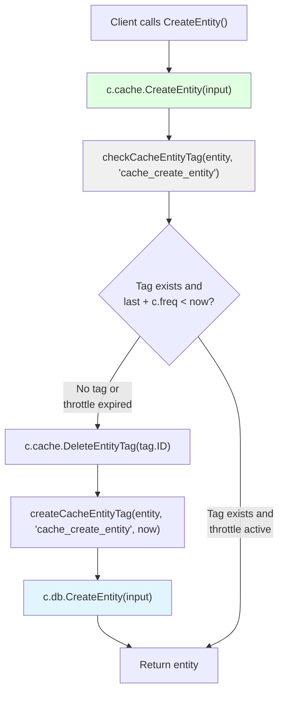
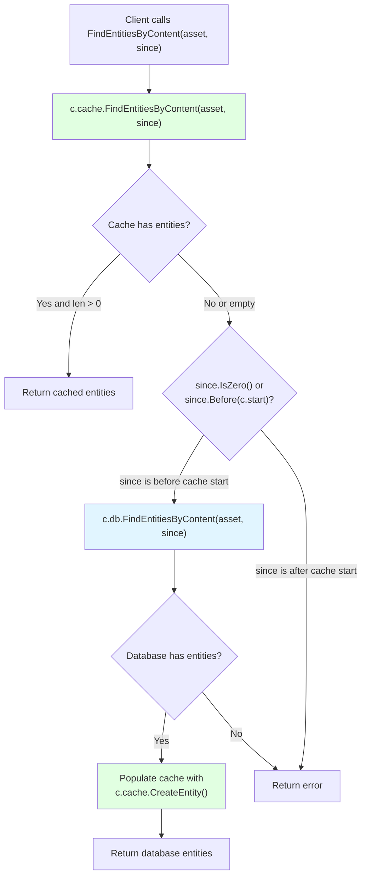
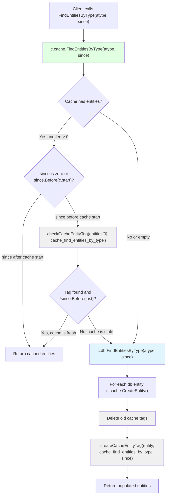
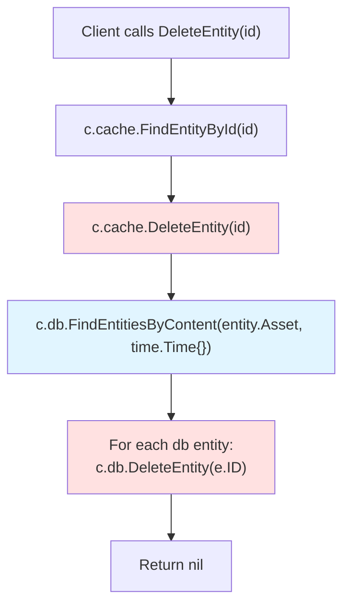
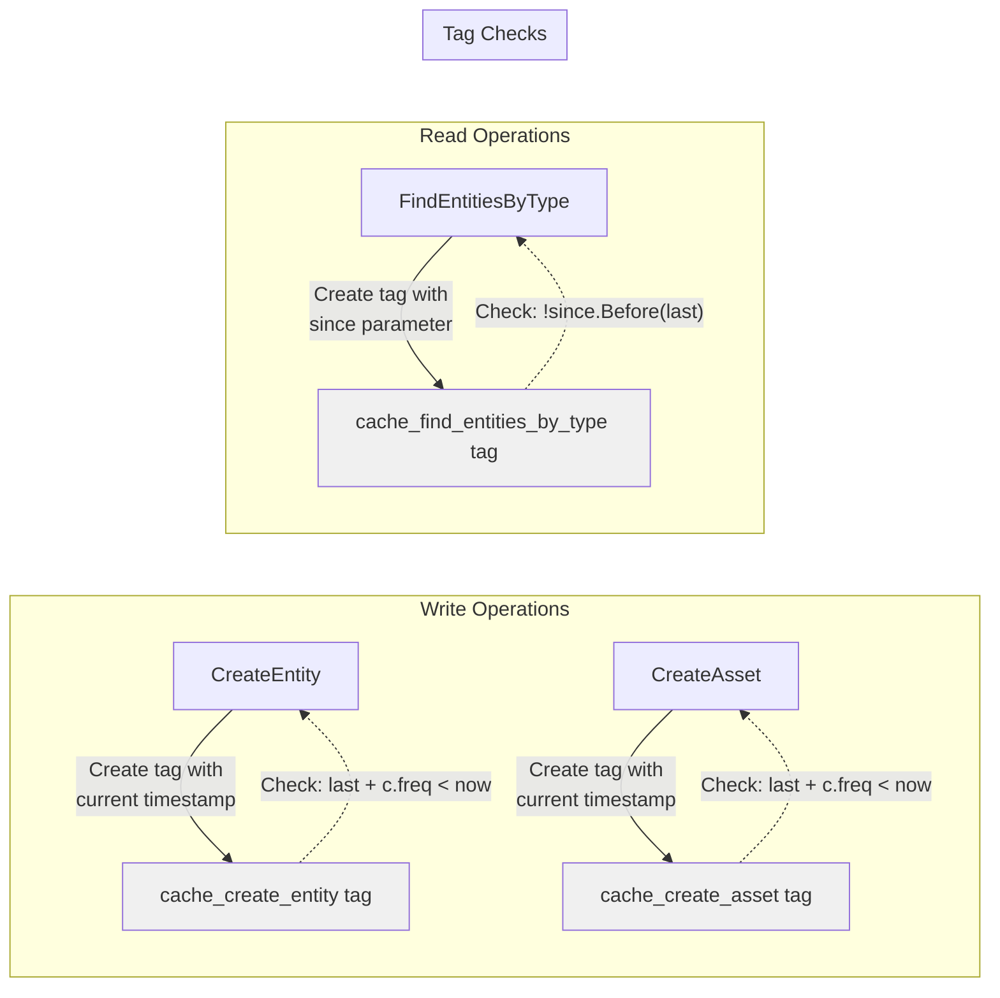

# Entity Caching

# Entity Caching

<details>
<summary>Relevant source files</summary>

The following files were used as context for generating this wiki page:

- [cache/cache_test.go](cache/cache_test.go)
- [cache/entity.go](cache/entity.go)
- [cache/entity_test.go](cache/entity_test.go)
- [db_test.go](db_test.go)

</details>


This document describes how entity operations are cached in the caching layer. It covers the cache-aside pattern for reads, frequency-based throttling for writes, and tag-based cache synchronization tracking. For information about the overall cache architecture and dual-repository pattern, see [Cache Architecture](#6.1). For edge caching operations, see [Edge Caching](#6.3).

---

## Overview

The entity caching system implements a dual-repository pattern where entities are stored in both an in-memory cache repository (`c.cache`) and a persistent database repository (`c.db`). The cache layer intercepts all entity operations and applies intelligent caching strategies to minimize database load while maintaining data consistency.

The implementation is located in [cache/entity.go:1-151]() and implements the following `Repository` interface methods:
- `CreateEntity` - Creates entities with frequency-based database throttling
- `CreateAsset` - Convenience method for creating entities from OAM assets
- `FindEntityById` - Direct cache lookup
- `FindEntitiesByContent` - Cache-aside pattern with database fallback
- `FindEntitiesByType` - Type-based querying with tag-based synchronization tracking
- `DeleteEntity` - Removal from both cache and database

**Sources:** [cache/entity.go:1-151]()

---

## Entity Creation with Frequency-Based Throttling

### CreateEntity Operation

The `CreateEntity` method immediately creates entities in the in-memory cache but throttles writes to the persistent database based on the cache frequency (`c.freq`). This reduces database write load while ensuring data availability.

**Entity Creation Flow**



The implementation at [cache/entity.go:16-36]() follows this logic:

1. **Immediate Cache Write:** The entity is created in `c.cache` immediately, ensuring fast availability
2. **Tag Check:** The method checks for a `cache_create_entity` tag on the entity
3. **Throttle Decision:** If no tag exists or the last tag timestamp plus `c.freq` is before the current time, proceed with database write
4. **Tag Management:** Delete old tag and create new tag with current timestamp
5. **Throttled Database Write:** Write to `c.db` only if throttle period has elapsed

| Operation | Target Repository | Frequency |
|-----------|------------------|-----------|
| Cache write | `c.cache` | Every call |
| Database write | `c.db` | Throttled by `c.freq` |
| Tag update | `c.cache` | When database write occurs |

**Sources:** [cache/entity.go:16-36](), [cache/entity_test.go:20-72]()

### CreateAsset Operation

The `CreateAsset` method is a convenience wrapper that creates an entity from an OAM asset. It follows identical throttling logic but uses the `cache_create_asset` tag type.

The implementation at [cache/entity.go:38-55]() is structurally identical to `CreateEntity`, differing only in:
- Delegates to `c.cache.CreateAsset(asset)` instead of `CreateEntity`
- Uses `cache_create_asset` tag instead of `cache_create_entity`
- Delegates to `c.db.CreateAsset(asset)` for database writes

**Sources:** [cache/entity.go:38-55](), [cache/entity_test.go:74-121]()

---

## Entity Read Operations

### FindEntityById - Direct Cache Lookup

The `FindEntityById` method performs a simple lookup in the cache repository without any database fallback. This assumes entities are already cached or returns an error if not found.

```go
func (c *Cache) FindEntityById(id string) (*types.Entity, error) {
    return c.cache.FindEntityById(id)
}
```

This direct lookup is efficient because:
- Entities are always created in the cache first
- No database roundtrip required
- Constant-time lookup by ID

**Sources:** [cache/entity.go:57-60](), [cache/entity_test.go:123-145]()

### FindEntitiesByContent - Cache-Aside Pattern

The `FindEntitiesByContent` method implements a classic cache-aside pattern with temporal awareness. It searches for entities matching a specific OAM asset, checking the cache first and falling back to the database if necessary.

**Cache-Aside Pattern Flow**



The implementation at [cache/entity.go:62-93]() follows this logic:

1. **Cache Query:** First attempt to find entities in `c.cache`
2. **Cache Hit:** If entities are found and non-empty, return immediately
3. **Temporal Check:** If `since` is zero or before `c.start` (cache initialization time), query database
4. **Database Query:** Query `c.db.FindEntitiesByContent` for historical data
5. **Cache Population:** Create each database entity in the cache using `c.cache.CreateEntity`
6. **Return Results:** Return the populated entities from the database

The temporal awareness ensures that queries for data created before the cache was initialized correctly fall back to the database.

**Sources:** [cache/entity.go:62-93](), [cache/entity_test.go:147-232]()

### FindEntitiesByType - Tag-Based Synchronization

The `FindEntitiesByType` method queries entities by their OAM asset type with sophisticated tag-based cache synchronization tracking. It uses the `cache_find_entities_by_type` tag to track when the cache was last synchronized with the database for a particular query.

**Tag-Based Type Query Flow**



The implementation at [cache/entity.go:95-129]() provides multi-level caching logic:

1. **Cache Query:** Query `c.cache.FindEntitiesByType` for entities of the specified type
2. **Recent Data Check:** If entities found and `since` is after `c.start`, return immediately
3. **Tag Freshness Check:** Check if a `cache_find_entities_by_type` tag exists and whether its timestamp is after `since`
4. **Cache Hit:** If tag exists and is fresh, return cached entities
5. **Database Fallback:** Query `c.db.FindEntitiesByType` for complete results
6. **Cache Population:** Create each database entity in the cache
7. **Tag Management:** Delete old tags and create new tag with `since` timestamp
8. **Return Results:** Return populated entities

| Condition | Cache Behavior | Database Query |
|-----------|---------------|----------------|
| `since` after `c.start` and entities in cache | Return cache immediately | No |
| Tag exists and `!since.Before(last)` | Return cache | No |
| Tag stale or missing | Populate cache from DB | Yes |
| No cache entities | Populate cache from DB | Yes |

**Sources:** [cache/entity.go:95-129](), [cache/entity_test.go:234-377]()

---

## Entity Deletion

The `DeleteEntity` method removes an entity from both the cache and the persistent database. It ensures consistency by finding matching entities in the database by content and deleting all matches.

**Entity Deletion Flow**



The implementation at [cache/entity.go:131-150]() follows this process:

1. **Find in Cache:** Lookup the entity in `c.cache` to get its content
2. **Delete from Cache:** Remove the entity from `c.cache`
3. **Find in Database:** Query `c.db.FindEntitiesByContent` to find all matching entities
4. **Delete from Database:** Iterate through matches and delete each from `c.db`

This approach ensures that duplicate entities in the database (if any exist) are also removed, maintaining consistency.

**Sources:** [cache/entity.go:131-150](), [cache/entity_test.go:379-404]()

---

## Cache Tag System for Entity Operations

The entity caching system uses cache tags to track synchronization state between the cache and database. Tags are entity tags with specific property values that indicate when operations were last performed.

### Tag Types and Their Purposes

| Tag Type | Purpose | Timestamp Meaning |
|----------|---------|------------------|
| `cache_create_entity` | Throttle entity creation | Last time entity was written to database |
| `cache_create_asset` | Throttle asset creation | Last time asset was written to database |
| `cache_find_entities_by_type` | Track type query sync | The `since` parameter of last database query |

### Tag-Based Throttling Mechanism



### Tag Management Functions

The cache uses internal helper functions for tag management:
- `checkCacheEntityTag(entity, tagType)` - Returns the tag, last timestamp, and whether found
- `createCacheEntityTag(entity, tagType, timestamp)` - Creates a new tag with the given timestamp
- `GetEntityTags(entity, since, tagType)` - Retrieves tags for an entity (Repository interface method)
- `DeleteEntityTag(id)` - Deletes a tag by ID (Repository interface method)

These functions are called at [cache/entity.go:22](), [cache/entity.go:26](), [cache/entity.go:102](), [cache/entity.go:120-125]() to implement the tag-based synchronization strategy.

**Sources:** [cache/entity.go:16-151](), [cache/entity_test.go:50-52](), [cache/entity_test.go:313-345]()

---

## Summary of Entity Caching Strategies

The entity caching implementation uses three distinct strategies based on operation type:

**Write Operations (CreateEntity, CreateAsset)**
- Immediate cache write for fast availability
- Frequency-based throttling of database writes using `c.freq`
- Tag-based tracking of last database write timestamp

**Direct Lookup (FindEntityById)**
- Cache-only lookup without database fallback
- Assumes entity is already cached
- O(1) performance

**Search Operations (FindEntitiesByContent, FindEntitiesByType)**
- Cache-aside pattern with database fallback
- Temporal awareness using `c.start` baseline
- Tag-based synchronization tracking for type queries
- Cache population when database is queried

**Delete Operations (DeleteEntity)**
- Removal from both cache and database
- Content-based matching to handle duplicates

**Sources:** [cache/entity.go:1-151](), [cache/entity_test.go:1-404]()